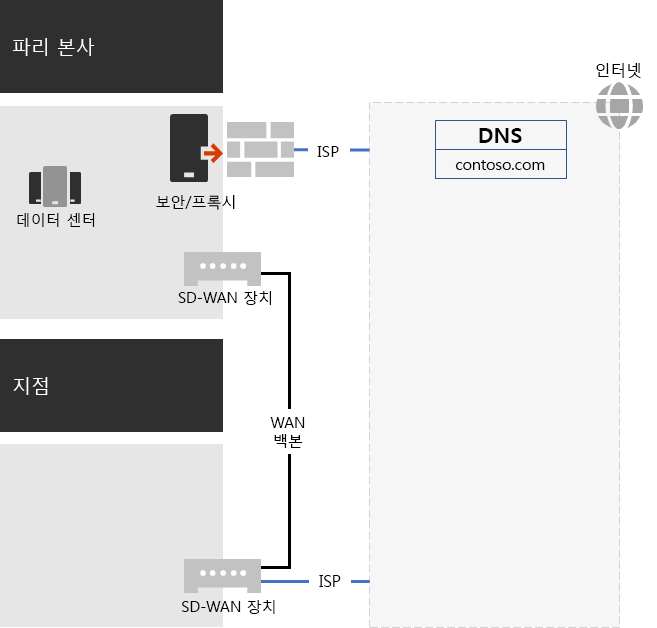
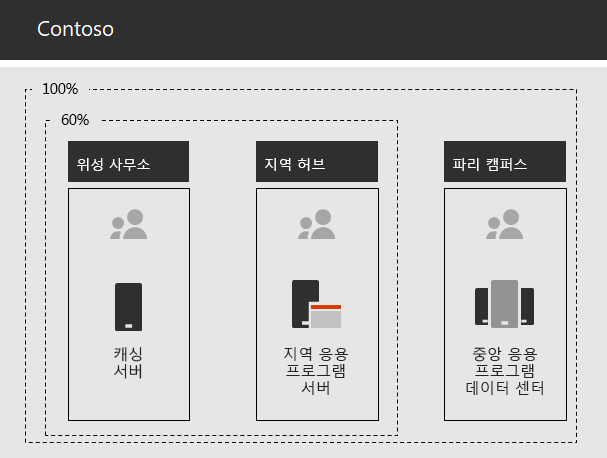

# Contoso Corporation에 대한 네트워킹Networking for the Contoso Corporation

**요약:** Contoso 네트워킹 인프라와 이 인프라가 Microsoft 365 Enterprise 클라우드 기반 서비스에 대해 최적 성능의 네트워크 연결을 설정하기 위해 SD-WAN 기술을 사용하는 방법을 이해합니다.**Summary:** Understand the Contoso networking infrastructure and how it uses its SD-WAN technology for optimal performance network connectivity to Microsoft 365 Enterprise cloud based services.

Contoso의 네트워크 엔지니어들은 클라우드 포함 인프라를 채택하기 위해 클라우드 기반 서비스로의 네트워크 트래픽이 이동되는 방식이 기본적으로 달라진다는 사실을 인식했습니다. 본사의 네트워크 연결에 초점을 맞추는 허브 및 스포크 모델 대신, 사용자 위치를 인터넷의 Microsoft 네트워크 위치에 대한 로컬 인터넷 송신 및 로컬 연결에 매핑하기 위한 작업을 진행했습니다.To adopt a cloud-inclusive infrastructure, Contoso's network engineers realized the fundamental shift in the way that network traffic to cloud-based services travels. Instead of a hub and spoke model that focusses network connectivity on the head office, they worked to map user locations to local Internet egress and local connections to Microsoft network locations on the Internet.

## Contoso의 네트워킹 인프라Contoso's networking infrastructure

다음은 전 세계의 사무실을 연결하는 Contoso의 네트워크 요소입니다.The elements of Contoso's network that links their offices across the globe are the following:

- MPLS WAN 네트워크MPLS WAN network

  MPLS WAN 네트워크는 스포크 및 허브 구성에서 파리 본사를 지점으로, 지점을 위성 사무실로 연결합니다. 이러한 연결은 사용자가 파리 사무실에서 LOB(기간 업무) 응용 프로그램을 구성하는 온-프레미스 서버에 액세스할 수 있도록 하기 위한 것입니다. 또한 모든 일반 인터넷 트래픽은 네트워크 보안 장치가 요청을 스크럽하는 파리 사무실로 라우팅됩니다. 각 사무실 내에서 라우터는 호스트 또는 개인 IP 주소 공간을 사용하는 서브넷의 무선 액세스 지점으로 트래픽을 전달합니다.An MPLS WAN network connects the Paris headquarters to regional offices and regional offices to satellite offices in a spoke and hub configuration. This is for users to access on-premises servers that make up line of business applications in the Paris office. It also routes any generic Internet traffic to the Paris office where network security devices scrub the requests. Within each office, routers deliver traffic to hosts or wireless access points on subnets, which use the private IP address space.

- Office 365 트래픽에 대한 로컬 직접 인터넷 액세스Local direct Internet access for Office 365 traffic

  각 사무실에는 여러 로컬 인트라넷 ISP 네트워크 회로 중 하나를 사용하며 프록시 서버를 통해 고유한 인터넷 연결을 유지하는 SD-WAN 장치가 있습니다. 이러한 연결은 일반적으로 프록시 서버에 대해 공용 IP 주소 및 로컬 DNS 서버 IP 주소도 제공하는 로컬 ISP에 대한 WAN 연결로 구현됩니다.Each office has an SD-WAN device with one of more local Internet ISP network circuits, with its own Internet connectivity through a proxy server. This is typically implemented as a WAN link to a local ISP that also provides public IP addresses and local DNS server IP addresses for the proxy server.

- 인터넷 서비스Internet presence

  Contoso는 contoso.com 공용 도메인 이름을 소유합니다. 제품 주문용 Contoso 공용 웹 사이트는 파리 캠퍼스에 있는 인터넷 연결 데이터 센터 내의 서버 집합입니다. Contoso는 인터넷에서 /24 공용 IP 주소 범위를 사용합니다.Contoso owns the contoso.com public domain name. The Contoso public web site for ordering products is a set of servers in an Internet-connected datacenter in the Paris campus. Contoso uses a /24 public IP address range on the Internet.

그림 1은 Contoso의 네트워킹 인프라 및 해당 인터넷 연결을 보여 줍니다.Figure 1 shows Contoso's networking infrastructure and its connections to the Internet.

 
**그림 1: Contoso의 네트워크****Figure 1: Contoso's network**

## Microsoft에 대한 최적 네트워크 연결을 위해 SD-WAN 사용Use of SD-WAN for optimal network connectivity to Microsoft

Contoso는 다음과 같은 [Office 365 네트워크 연결 원칙](https://docs.microsoft.com/office365/enterprise/office-365-network-connectivity-principles)을 준수했습니다.Contoso followed [Office 365 network connectivity principles](https://docs.microsoft.com/office365/enterprise/office-365-network-connectivity-principles):

1. Office 365 네트워크 트래픽 식별 및 차별화Identify and differentiate Office 365 network traffic
2. 네트워크 연결을 로컬로 송신Egress network connections locally
3. 네트워크 헤어핀 방지Avoid network hairpins
4. 중복된 네트워크 보안 장치 우회Bypass duplicate network security devices

Office 365의 네트워크 트래픽의 세 가지 범주는 최적화, 허용 및 기본입니다. 최적화 및 허용 트래픽은 끝점에서 보호되고 Microsoft 데이터 센터를 목적지로 하는 신뢰할 수 있는 네트워크 트래픽입니다.There are three categories of network traffic for Office 365: Optimize, Allow, and Default. Optimize and Allow traffic is trusted network traffic that is encrypted and secured at the endpoints and is destined for Microsoft datacenters.

Contoso는 최적화 및 허용 범주 트래픽에 대해 직접 인터넷 송신을 사용하고, 모든 기본 범주 트래픽은 파리에 기반을 둔 중앙 인터넷 연결로 전달하기로 결정했습니다.Contoso decided to use direct Internet egress for Optimize and Allow category traffic and to forward all Default category traffic to the Paris-based central Internet connection.

또한 이러한 원칙을 준수하고 Microsoft 365 클라우드 기반 서비스에 대해 최적의 네트워크 성능에 도달하는 간단한 방법으로, 각 사무실에 SD-WAN 장치를 배포하기로 했습니다.They decided to deploy SD-WAN devices at each of their office locations as a simple way to follow these principles and achieve optimal network performance for Microsoft 365 cloud-based services.

SD-WAN 장치에는 로컬 네트워크용 LAN 포트 1개와 여러 개의 WAN 포트가 있습니다. WAN 포트 1개는 해당 MPLS 네트워크에 연결되고 다른 WAN 포트는 로컬 ISP 회로에 연결됩니다. SD-WAN 장치는 최적화 및 허용 범주 네트워크 트래픽을 ISP 링크로 라우팅합니다.The SD-WAN devices have a LAN port for the local office network and multiple WAN ports. One WAN port connects to their MPLS network and other WAN ports connect to local ISP circuits. The SD-WAN device routes Optimize and Allow category network traffic to the ISP links.

## Contoso의 LOB(기간 업무) 앱 인프라Contoso's line of business app infrastructure

Contoso는 다음을 위한 LOB(기간 업무) 응용 프로그램 및 서버 인프라를 설계했습니다.Contoso has architected its line of business application and server infrastructure for the following:

- 위성 사무소는 로컬 캐싱 서버를 사용하여 자주 액세스하는 문서 및 내부 웹 사이트를 저장합니다.Satellite offices use local caching servers to store frequently accessed documents and internal web sites.
- 지역 허브는 지역 사무소와 위성 사무소에 지역 응용 프로그램 서버를 사용합니다. 이러한 서버는 파리 본사의 서버와 동기화됩니다.Regional hubs use regional application servers for the regional and satellite offices. These servers synchronize with servers in the Paris headquarters.
- 파리 캠퍼스에는 전체 조직에 서비스를 제공하는 중앙 집중식 응용 프로그램 서버가 포함된 데이터 센터가 있습니다.The Paris campus has the datacenters that contain the centralized application servers that serve the entire organization.

그림 2에서는 Contoso의 인트라넷을 통해 서버에 액세스할 때의 네트워크 트래픽 비율을 보여 줍니다.Figure 2 shows the percentage of network traffic when accessing servers across Contoso’s intranet.

 
**그림 2: 내부 응용 프로그램에 대한 Contoso의 인프라****Figure 2: Contoso's infrastructure for internal applications**

위성 사무소 또는 지역 허브 사무소 사용자의 경우 직원에게 필요한 리소스 중 60%는 위성 및 지역 허브 사무소 서버가 제공할 수 있습니다. 추가 40%의 리소스 요청은 WAN 링크를 통해 파리 캠퍼스로 전송해야 합니다.For users in satellite or regional hub offices, 60% of the resources needed by employees can be served by satellite and regional hub office servers. The additional 40% of resource requests must go over the WAN link to the Paris campus.

## Contoso의 네트워크 분석 및 Microsoft 365 Ennterprise 사용을 위한 네트워크 준비Contoso's network analysis and preparation of their network for Microsoft 365 Enterprise

Contoso 사용자가 Microsoft 365 Enterprise 서비스를 성공적으로 채택할 수 있는지 여부는 인터넷에 대해 또는 Microsoft 클라우드 서비스에 대해 직접적으로 고가용성 및 고성능 연결이 설정되어 있는지에 따라 좌우됩니다. Contoso는 Microsoft 365 Enterprise 클라우드 서비스에 대해 최적화된 연결을 계획 및 구현하기 위해 다음과 같은 단계를 수행했습니다.Successful adoption of Microsoft 365 Enterprise services by Contoso’s users depend on highly available and performant connectivity to the Internet, or directly to Microsoft cloud services. Contoso took these steps to plan for and implement optimized connectivity to Microsoft 365 Enterprise cloud services:

1. 계획에 도움이 되는 회사 WAN 네트워크 다이어그램 생성Created a company WAN network diagram to aid with planning

   Contoso는 해당 위치, 기존 네트워크 연결, 기존 네트워크 주변 장치 및 네트워크에서 관리되는 서비스 클래스를 보여 주는 다이어그램을 만들어 네트워크 계획을 시작했습니다. 또한 네트워킹 연결의 계획과 구현의 각 후속 단계에서 이 다이어그램을 사용했습니다.Contoso started their network planning by creating a diagram showing their locations, the existing network connectivity, their existing network perimeter devices and classes of service that are managed on the network. They used this diagram for each subsequent step in the planning and implementation of networking connectivity.

2. Microsoft 365 Enterprise 네트워크 연결 계획 수립Created a plan for Microsoft 365 Enterprise network connectivity

   Contoso는 [Office 365 네트워크 연결 원칙](https://docs.microsoft.com/office365/enterprise/office-365-network-connectivity-principles)을 사용하고, SD-WAN을 Office 365 연결을 위한 기본 토폴로지로 결정하기 위해 참조 네트워크 아키텍처를 제공했습니다.Contoso used the [Office 365 network connectivity principles](https://docs.microsoft.com/office365/enterprise/office-365-network-connectivity-principles) and provided reference network architectures to determine SD-WAN as their preferred topology for Office 365 connectivity.

3. 각 사무실의 인터넷 연결 사용률 및 MPLS WAN 대역폭을 분석하고 필요한 경우 대역폭 증가Analyzed Internet connection utilization and MPLS WAN bandwidth at each office and increased bandwidth as needed

   각 사무실의 현재 사용량을 분석했으며, 예측된 Microsoft 365 클라우드 기반 트래픽이 사용하지 않은 용량의 평균 20%에서 작동될 수 있도록 회로를 늘렸습니다.Each office was analyzed for the current usage and circuits were increased so that predicted Microsoft 365 cloud-based traffic would be operating with an average of 20% of unused capacity.

4. Microsoft 네트워크 서비스에 맞춰 성능 최적화Optimized performance to Microsoft network services

   Contoso는 Office 365, Intune 및 Azure 끝점 집합을 파악하고, 최적의 성능을 제공할 수 있도록 방화벽, 보안 장치 및 인터넷 경로의 기타 시스템을 구성했습니다. Office 365 최적화 및 허용 범주 트래픽에 대한 끝점은 직접 인터넷 액세스를 제공하는 SD-WAN 장치로 구성되었습니다.Contoso determined the set of Office 365, Intune, and Azure endpoints and configured firewalls, security devices, and other systems in the Internet path for optimal performance. Endpoints for Office 365 Optimize and Allow category traffic was configured into the SD-WAN devices that provided direct Internet access.

5. 내부 DNS 구성Configured internal DNS

   DNS가 작동되어야 하며, Office 365 트래픽이 있는지 로컬로 조회되어야 합니다.DNS is required to be functional and to be looked up locally for Office 365 traffic.

6. 네트워크 끝점 및 포트 연결 유효성 검사Validated network endpoint and port connectivity

   Contoso는 Microsoft 365 Enterprise 클라우드 서비스에 대한 연결 유효성을 검사하기 위해 Microsoft가 제공하는 네트워크 연결 테스트 도구를 실행했습니다.Contoso ran network connectivity test tools provided by Microsoft to validate connectivity for Microsoft 365 Enterprise cloud services.

7. 직원 컴퓨터의 네트워크 연결 최적화Optimized employee computers for network connectivity

   개별 컴퓨터에서 최신 운영 체제 업데이트가 설치되어 있는지와 끝점 보안 모니터링이 모든 클라이언트에서 활성 상태인지 확인되었습니다.Individual computers were checked to ensure that the latest operating system updates were installed and that endpoint security monitoring is active on all clients.

## 다음 단계Next step

Contoso가 어떻게 직원을 위해 클라우드에서 온-프레미스 ID 공급자를 활용하고, 고객 및 비즈니스 파트너의 인증을 페더레이션하는지 [알아봅니다](contoso-identity.md).[Learn](contoso-identity.md) how Contoso is leveraging its on-premises identity provider in the cloud for employees and federating authentication for customers and business partners.

## 참고 항목See also

[Microsoft 365 Enterprise의 네트워킹Networking for Microsoft 365 Enterprise](networking-infrastructure.md)

[배포 가이드Deployment guide](deploy-microsoft-365-enterprise.md)

[테스트 랩 가이드Test lab guides](m365-enterprise-test-lab-guides.md)
