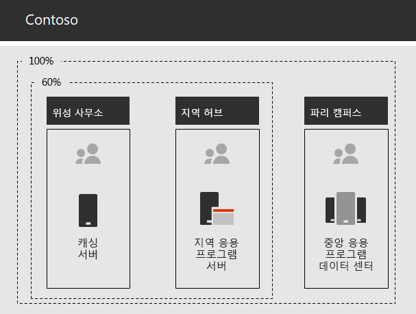

# Contoso Corporation에 대한 네트워킹

Contoso는 클라우드 포함 인프라를 채택하기 위해 클라우드 서비스로의 네트워크 트래픽이 이동하는 방식의 기본적인 변화를 고안했습니다. 사무실 계층 구조의 다음 수준에 대한 네트워크 연결 및 트래픽에 초점을 맞추는 내부 허브 및 스포크 모델 대신, 사용자 위치를 인터넷의 가장 가까운 Microsoft 365 네트워크 위치에 로컬 인터넷 연결 및 로컬 연결에 매핑했습니다.

## 네트워킹 인프라

다음은 전 세계 Contoso 사무실을 연결하는 네트워크 요소입니다.

- 멀티 프로토콜 레이블 전환 (MPLS) WAN 네트워크

  MPLS WAN 네트워크는 스포크 및 허브 구성에서 파리 본사를 지역 사무소 및 지역 사무소에 위성 사무소에 연결합니다. 이 네트워크를 통해 사용자는 파리 본사에서 업무(LINE-OF-BUSINESS) 응용 프로그램을 구성하는 사내 서버에 액세스할 수 있습니다. 또한 네트워크 보안 장치가 요청을 스크럽하는 일반 인터넷 트래픽을 파리 사무실로 라우팅합니다. 각 사무실 내에서 라우터는 개인 IP 주소 공간을 사용하는 서브넷의 유선 호스트 또는 무선 액세스 지점으로 트래픽을 전달합니다.

- 트래픽에 대한 로컬 직접 Microsoft 365 액세스

  각 사무실에는 프록시 서버를 통해 자체 인터넷 연결이 있는 하나 이상의 로컬 인터넷 ISP 네트워크 회로가 있는 소프트웨어 정의 WAN(SD-WAN) 장치가 있습니다. 일반적으로 이 링크는 공용 IP 주소와 로컬 DNS 서버도 제공하는 로컬 ISP에 대한 WAN 링크로 구현됩니다.

- 인터넷 서비스

  Contoso는 contoso com 공용 도메인 \. 이름을 소유합니다. 제품 주문을 위한 Contoso 공용 웹 사이트는 파리 캠퍼스에 있는 인터넷 연결 데이터 센터의 서버 집합입니다. Contoso는 인터넷에서 /24 공용 IP 주소 범위를 사용 합니다.

그림 1에서는 Contoso 네트워킹 인프라와 인터넷에 대한 연결을 보여줍니다.

 
**그림 1: Contoso 네트워크**

## Microsoft에 대한 최적 네트워크 연결을 위해 SD-WAN 사용

Contoso는 다음과 같은 [Microsoft 365 네트워크 연결 원칙](microsoft-365-network-connectivity-principles.md)을 준수했습니다.

- Microsoft 365 네트워크 트래픽 식별 및 차별화
- 네트워크 연결을 로컬로 송신
- 네트워크 헤어핀 방지
- 중복된 네트워크 보안 장치 우회

최적화, 허용 및 기본값의 Microsoft 365 네트워크 트래픽의 세 가지 *범주가 있습니다.* 최적화 및 허용 트래픽은 끝점에서 암호화되고 보안되며 네트워크로 전송되는 신뢰할 수 있는 네트워크 Microsoft 365 합니다.

Contoso는 다음의 사항을 결정했습니다:

- 최적화 및 허용 범주 트래픽에 대해 직접 인터넷 연결을 사용하여 모든 기본 범주 트래픽을 파리 기반 중앙 인터넷 연결로 전달합니다.

- 이러한 원칙을 따르고 클라우드 기반 서비스에 대해 최적의 네트워크 성능을 달성하기 위한 간단한 방법으로 각 사무실에 SD-WAN Microsoft 365 배포합니다.

  SD-WAN 장치에는 로컬 사무실 네트워크와 여러 대의 WAN 포트용 LAN 포트가 있습니다. 하나의 WAN 포트가 MPLS 네트워크에 연결됩니다. 다른 회로는 로컬 ISP 회로에 연결됩니다. SD-WAN 장치는 ISP 링크를 통해 최적화 및 허용범주 네트워크 트래픽을 라우팅합니다.

## Contoso LINE-OF-BUSINESS 앱 인프라

Contoso는 다음을 위해 업무용 응용 프로그램 및 서버 인트라넷 인프라를 설계했습니다.

- 위성 사무소는 로컬 캐싱 서버를 사용하여 자주 액세스하는 문서 및 내부 웹 사이트를 저장합니다.
- 지역 허브는 지역 사무소와 위성 사무소에 지역 응용 프로그램 서버를 사용합니다. 이러한 서버는 파리 본사의 서버와 동기화됩니다.
- 파리 캠퍼스 데이터 센터에는 전체 조직에 서비스를 제공 하는 중앙 집중식 응용 프로그램 서버가 포함되어 있습니다.

그림 2에서는 Contoso 인트라넷을 통해 서버에 액세스할 때 사용되는 네트워크 트래픽 용량의 백분율을 보여줍니다.

 
**그림 2: 내부 응용 프로그램용 Contoso 인프라**

위성 또는 지역 허브 사무소의 경우 직원이 필요로 하는 리소스의 60%는 위성 및 지역 허브 사무실 서버에서 제공될 수 있습니다. 추가 리소스 요청의 40%는 파리 캠퍼스에 대한 WAN 링크를 통해 이동해야 합니다.

## 엔터프라이즈용 네트워크 분석 및 Microsoft 365 준비

Contoso Microsoft 365 엔터프라이즈 서비스에 대한 성공적인 채택은 인터넷 또는 Microsoft 클라우드 서비스에 직접 연결되는 고가용성 및 뛰어난 연결에 따라 달라 습니다. Contoso는 엔터프라이즈 클라우드 서비스에 대한 최적화된 연결을 계획하고 Microsoft 365 단계를 수행했습니다.

1. 계획을 지원하기 위한 회사 WAN 네트워크 다이어그램 만들기

   네트워크 계획을 시작하기 위해 Contoso는 사무실 위치, 기존 네트워크 연결, 기존 네트워크 경계 장치 및 네트워크에서 관리되는 서비스 클래스를 보여주는 다이어그램을 만들었다. 또한 네트워킹 연결 계획 및 구현의 각 후속 단계에서 이 다이어그램을 사용했습니다.

2. 엔터프라이즈 네트워크 연결에 Microsoft 365 계획 만들기

   Contoso는  Microsoft 365 네트워크 연결 원칙 및 샘플 참조 네트워크 아키텍처를 사용하여 SD-WAN을 Microsoft 365 기본 토폴로지로 식별했습니다.

3. 각 사무실에서 인터넷 연결 사용률 및 MPLS-WAN 대역폭을 분석하고 필요한 경우 대역폭 증가

   각 사무실의 현재 사용량을 분석하고 예측된 클라우드 기반 트래픽이 평균 20%Microsoft 365 작동할 수 있도록 회로가 증가했습니다.

4. Microsoft 네트워크 서비스에 대한 성능 최적화

   Contoso는 최적의 성능을 위해 Office 365, Intune 및 Azure 끝점 집합을 결정하고 방화벽, 보안 장치 및 기타 시스템을 인터넷 경로에 구성했습니다. 최적화 및 Office 365 허용 범주 트래픽에 대한 끝점이 ISP 회로를 통해 라우팅하기 위해 SD-WAN 장치에 구성되었습니다.

5. 내부 DNS 구성

   DNS가 작동해야 하고 Microsoft 365 트래픽 여부를 로컬에서 조회해야 합니다.

6. 네트워크 끝점 및 포트 연결 유효성 검사

   Contoso는 Microsoft 네트워크 연결 테스트 도구를 실행하여 엔터프라이즈 클라우드 서비스에 Microsoft 365 연결의 유효성을 검사했습니다.

7. 네트워크 연결에 맞게 직원 컴퓨터 최적화

   개별 컴퓨터를 확인하여 최신 운영 체제 업데이트가 설치되어 있으며 모든 클라이언트에서 끝점 보안 모니터링이 활성화되도록 확인했습니다.

## 다음 단계

Contoso가 직원을 위해 클라우드에서 해당 사내 [Active Directory 도메인](contoso-identity.md) 서비스를 활용하고 고객 및 비즈니스 파트너를 위한 인증을 페더화하는 방법을 알아보십시오.

## 참고 항목

[네트워크용 네트워킹 로드맵 Microsoft 365](networking-roadmap-microsoft-365.md)

[엔터프라이즈용 Microsoft 365 개요](microsoft-365-overview.md)

[테스트 랩 가이드](m365-enterprise-test-lab-guides.md)
