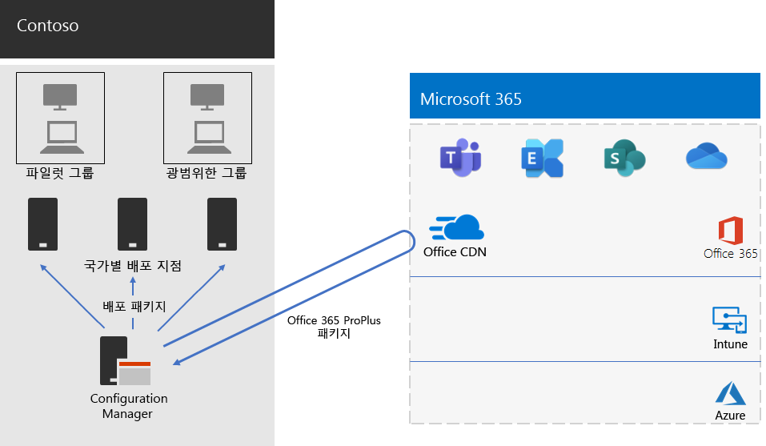

# Contoso의 Office 365 ProPlus 배포Office 365 ProPlus deployment for Contoso

Contoso는 보다 효과적인 공동 작업, 더 나은 보안 및 최신 데스크톱 환경을 사용하기 위해 PC를 Windows 10 Enterprise 및 Office 365 ProPlus로 업그레이드했습니다. Contoso는 해당 인프라 및 비즈니스 요구를 파악한 후 배포에 대한 다음과 같은 주요 요구 사항을 파악했습니다.Contoso upgraded their PCs to Windows 10 Enterprise and Office 365 ProPlus to enable more effective collaboration, better security, and a more modern desktop experience. After assessing their infrastructure and business needs, Contoso identified these key requirements for the deployment:

- 모든 PC에서 Office 365 ProPlus를 실행해야 합니다.All PCs should run Office 365 ProPlus
- 가능한 경우 기존 관리 도구와 인프라를 사용해서 배포합니다.Deployment should use existing management tools and infrastructure when possible
- 배포는 최종 사용자 장치에서 여러 언어 및 기존 아키텍처를 지원해야 합니다.Deployment must support multiple languages and existing architectures on end-user devices
- PC는 최소한의 IT 관리 비용을 들이고 최종 사용자에게 최소한의 영향을 미치면서 최신 상태로 안전하게 유지해야 합니다.PCs should stay up-to-date and secure with minimal IT administrative costs and with minimal impact to end-users

## 배포 도구Deployment tools

Contoso는 해당 요구 사항을 토대로, Configuration Manager(현재 분기)를 사용하여 Windows 10 Enterprise 및 Office 365 ProPlus를 배포하기로 선택했습니다. Configuration Manager는 대규모 환경에 맞게 확장되며, 설치, 업데이트 및 설정을 포괄적으로 제어할 수 있도록 합니다. 그뿐 아니라 Office를 보다 쉽고 효율적으로 배포 및 관리할 수 있도록 하는 다음과 같은 기본 제공 기능도 제공합니다.Based on their requirements, Contoso chose to deploy Windows 10 Enterprise and Office 365 ProPlus with Configuration Manager (Current Branch). Configuration Manager scales for large environments and provides extensive control over installation, updates, and settings. It also has built-in features to make it easier and more efficient to deploy and manage Office, including:

- 피어 캐시: 원격 위치에 장치를 배포할 때 네트워크 용량이 제한적인 경우 도움이 될 수 있습니다.Peer cache, which can help with limited network capacity when deploying to devices in remote locations
- Office 클라이언트 관리 대시보드: Office를 쉽게 배포하고 업데이트를 모니터링할 수 있도록 하고, 관리자에게 최신 배포 및 관리 기능에 대한 액세스 권한을 부여합니다.The Office Client Management dashboard, which makes it easy to deploy Office and monitor updates and gives administrators access to the latest deployment and management features
- 지능형 언어 팩 배포: 운영 체제와 동일한 언어를 자동으로 배포하는 기능을 포함합니다.Intelligent language pack deployment, including automatically deploying the same language as the operating system
- 배포 중에 클라이언트에서 기존 버전의 Office를 제거하기 위한 완전히 지원되는 편리한 방법Fully supported and easy-to-use method of removing existing versions of Office from a client during deployment

Contoso는 Configuration Manager 외에도, Microsoft에서 무료로 제공하는 [Readiness Toolkit](https://docs.microsoft.com/deployoffice/use-the-readiness-toolkit-to-assess-application-compatibility-for-office-365-pro)를 사용하여 Office 매크로 및 추가 기능에 대한 호환성 문제를 평가했습니다.In addition to Configuration Manager, Contoso used the [Readiness Toolkit](https://docs.microsoft.com/deployoffice/use-the-readiness-toolkit-to-assess-application-compatibility-for-office-365-pro), a free tool from Microsoft, to assess compatibility issues with their Office macros and add-ins.

## 배포 및 업데이트 관리Managing the deployment and updates

Office 365 ProPlus에는 새 릴리스 모델인 Office as a Service가 포함되어 있습니다. 이 서비스 모델을 사용하면 새 기능으로 손쉽게 최신 상태로 유지할 수 있지만 새 릴리스를 배포 및 테스트하는 방식에 대한 IT 부서의 접근 방식을 변경해야 하는 경우가 종종 발생합니다. 호환성 문제를 최소화하고 컴퓨터를 최신 상태로 유지하기 위해 Contoso는 다음 두 단계에 걸쳐 Windows 및 Office를 배포했습니다.Office 365 ProPlus has a new release model: Office as a service. The service model makes it easy to stay up to date with new features, but often requires a change in approach for IT departments in how new releases are deployed and tested. To minimize any compatibility issues and to ensure their computers stayed up to date, Contoso deployed Windows and Office in two stages: 

- 첫 번째 단계에서는 조직의 소규모 대표 장치 집합에 Office 365 ProPlus를 배포했습니다. 이 파일럿 그룹은 Office 365 ProPlus에서 앱, 추가 기능 및 하드웨어를 테스트하는 데 사용되었습니다.For the first stage, they deployed Office 365 ProPlus to a small set of representative devices across the organization. This pilot group was used to test apps, add-ins, and hardware with Office 365 ProPlus
- 4개월 후에 파일럿 그룹에서 앱, 추가 기능 및 하드웨어의 모든 중요 문제를 해결한 다음, Contoso는 조직의 나머지 장치에 Office 365 ProPlus를 배포했습니다(브로드 그룹).Four months later, after addressing all critical issues with apps, add-ins, and hardware in the pilot group, Contoso deployed Office 365 ProPlus to the rest of the devices in the organization (the broad group). 

Configuration Manager를 사용하여 Office에 대한 업데이트를 관리하는 대신, Contoso는 클라우드에서 자동 업데이트를 사용하도록 설정했습니다. 클라우드 기반 업데이트는 장치를 최신 상태로 유지하면서 관리 오버헤드를 줄였습니다.Instead of managing updates to Office with Configuration Manager, Contoso enabled automatic updates from the cloud. Cloud-based updates reduced their administrative overhead while ensuring the devices stayed up to date. 

Contoso는 기능 업데이트를 위해서도 Office 배포에 사용한 것과 동일한 2단계 접근 방법을 따랐습니다. 즉, 파일럿 그룹의 장치가 조직의 나머지 장치(브로드 그룹)보다 4개월 먼저 기능 업데이트를 받았습니다. Office에 대해 이러한 방식을 적용하기 위해 Contoso는 권장되는 두 개의 [업데이트 채널](https://docs.microsoft.com/DeployOffice/overview-of-update-channels-for-office-365-proplus)을 사용했습니다.Contoso followed the same two-stage approach for feature updates that they used for deploying Office: devices in the pilot group received feature updates four months earlier than devices in the rest of the organization (the broad group). To enable this for Office, Contoso used two recommended [update channels](https://docs.microsoft.com/DeployOffice/overview-of-update-channels-for-office-365-proplus): 

- 파일럿 그룹에 대한 업데이트용 반기 채널(대상 지정)Semi-Annual Channel (Targeted) for updates to the pilot group 
- 브로드 그룹에 대한 업데이트용 반기 채널.Semi-Annual Channel for updates to the broad group. 

반기(대상 지정) 채널은 반기 채널보다 4개월 먼저 Office 365 ProPlus 버전을 릴리스하므로, Contoso는 관리 작업 없이 업데이트 유효성을 검사할 시간적 여유를 갖게 됩니다.Because the Semi-Annual (Targeted) Channel releases a version of Office 365 ProPlus four months earlier than the Semi-Annual Channel, Contoso has time to validate the updates without having to manage them. 

## 배포 프로세스Deployment process

Office 배포를 완료하기 위해 Contoso는 Microsoft의 모범 사례 권장 사항을 포함하는 다음 프로세스를 구현했습니다.To complete the deployment of Office, Contoso implemented the following process, which includes best practice recommendations from Microsoft:

1. 배포 전에, Readiness Toolkit를 사용하여 앱 및 Office 추가 기능이 Office 365 ProPlus와 호환되는지 평가했습니다.Before deploying, they used the Readiness Toolkit to test their apps and Office add-ins to assess their compatibility with Office 365 ProPlus.
2. Configuration Manager에서 Contoso는 클라이언트 장치에 피어 캐시를 사용하도록 설정하여 원격 위치의 클라이언트 장치에 배포할 때 제한적인 네트워크 용량 때문에 발생하는 문제를 완화했습니다.In Configuration Manager, Contoso enabled peer cache on their client devices, which helped with limited network capacity when deploying to client devices in remote locations. 
3. 또한 Configuration Manager에서 두 가지 배포 그룹, 즉 파일럿 그룹과 브로드 그룹을 장치 컬렉션으로 정의했습니다. 조직 내의 소규모 대표 장치 집합을 포함하는 파일럿 그룹은 Windows 10 Enterprise 및 Office 365 ProPlus에서 앱, 추가 기능 및 하드웨어를 추가적으로 테스트하는 데 사용되었습니다.They defined two deployment groups as device collections in Configuration Manager: a pilot group and a broad group. The pilot group, which included a small set of representative devices across the organization, was used to do additional testing of apps, add-ins, and hardware with Windows 10 Enterprise and Office 365 ProPlus. 
4. 그뿐 아니라 Configuration Manager에 포함되어 있는 Office 클라이언트 관리 대시보드 및 Office 365 설치 관리자 마법사를 사용하여 Office용 배포 패키지를 만들었습니다. 이러한 두 기능은 두 개의 Office 365 ProPlus 패키지, 즉 반기 채널(대상 지정)의 파일럿 그룹용 패키지와 반기 채널의 브로드 그룹용 패키지를 작성했습니다.They created deployment packages for Office using the Office Client Management dashboard and the Office 365 Installer wizard, both of which are part of the Configuration Manager console. They built two Office 365 ProPlus packages, one for the pilot group on the Semi-Annual Channel (Targeted) and one for the broad group on the Semi-Annual Channel. 
5. 각 Office 패키지의 일부로, 영어, 프랑스어,및 독일어 언어 팩을 포함했습니다. 장치에 Office 패키지에 포함되지 않은 언어가 필요한 경우 Office CDN(콘텐츠 배달 네트워크)에서 자동으로 다운로드되었습니다.As part of each Office package, they included English, French, and German Language packs. If a device required a language not included in the Office package, it was automatically downloaded from the Office Content Delivery Network (CDN).
6. Office 365 ProPlus를 설치하기 전에 모든 기존 MSI 버전의 Office를 자동으로 제거하는 Office 패키지의 기본 제공 기능을 사용했습니다.They used the built-in feature in the Office package to automatically remove all existing MSI versions of Office before installing Office 365 ProPlus.
7. Configuration Manager에서 Windows 및 Office 패키지를 네트워크의 배포 지점에 배포한 후 Configuration Manager 배포 작업 시퀀스를 실행하여 파일럿 그룹에 파일럿 Office 365 ProPlus 패키지를 배포했습니다.In Configuration Manager, they deployed the Windows and Office packages to distribution points across their network, and then ran the Configuration Manager deployment task sequences to deploy the pilot Office 365 ProPlus package to the pilot group.
8. Contoso는 파일럿 그룹과의 호환성 문제를 해결한 후에 광범위한 Office 365 ProPlus 패키지를 브로드 그룹에 배포하는 작업 시퀀스를 실행했습니다.After addressing any compatibility issues with the pilot group, Contoso ran the task sequences to deploy the broad Office 365 ProPlus package to the broad group.

Contoso는 자동으로 클라우드로부터 장치를 업데이트하도록 선택했기 때문에 구성 관리자에서 프로세스를 관리할 필요가 없습니다.Because Contoso chose to automatically update devices from the cloud, there was no need to manage the process in Configuration Manager. 그 장치는 초기 배포의 부분으로 정의된 업데이트 채널을 기반으로 한 클라우드로부터 직접적으로 자동 업데이트됩니다.Their devices are automatically updated directly from the cloud-based on the update channel that was defined as part of the initial deployment. 

Contoso의 Office 365 ProPlus 설치 및 지속적인 업데이트 배포 아키텍처는 다음과 같습니다.Here is Contoso’s Office 365 ProPlus installation and ongoing updates deployment architecture.

 
## 다음 단계Next step

Contoso가 어떻게 Microsoft 365 Enterprise의 Microsoft Intune을 사용하여 조직에서 실행되는 해당 장치 및 앱을 관리하고 있는지 [알아봅니다](contoso-mdm.md).[Learn](contoso-mdm.md) how Contoso is using Microsoft Intune in Microsoft 365 Enterprise to manage its devices and the apps that run on them across its organization.

## 참고 항목See also

[Microsoft 365 Enterprise용 Office 365 ProPlusOffice 365 ProPlus for Microsoft 365 Enterprise](office365proplus-infrastructure.md)

[배포 가이드Deployment guide](deploy-microsoft-365-enterprise.md)

[테스트 랩 가이드Test lab guides](m365-enterprise-test-lab-guides.md)
