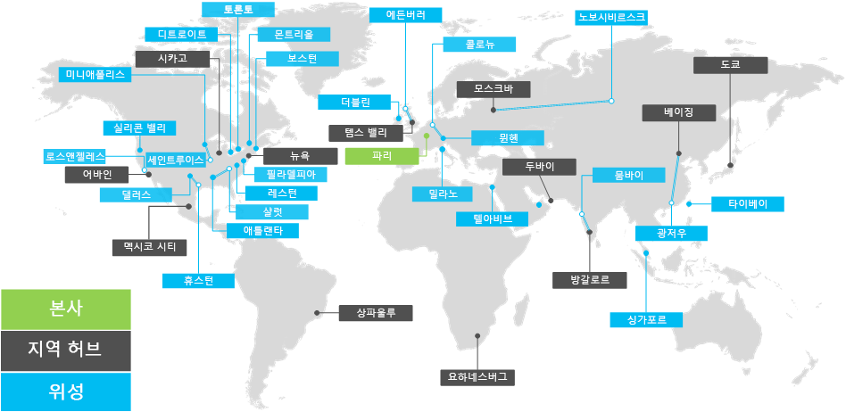

# Contoso Corporation 개요

Contoso Corporation은 파리에 본사가 있는 다국적 기업입니다. 이 회사는 100,000개가 넘는 제품을 생산, 판매 및 지원하는 조직입니다.

## 전 세계 Contoso

그림 1은 파리의 본사와 다양한 대륙에 있는 지역 허브 및 위성 사무소를 보여줍니다.

**그림 1: 전 세계 Contoso 사무실**
 
Contoso에는 세 가지 계층의 사무실이 있습니다.

- 본사

  Contoso 본사는 파리 외부에 있는 기업 캠퍼스로, 수십 개의 관리, 엔지니어링 및 제조 시설 건물이 있습니다. 모든 Contoso 데이터 센터와 인터넷 현재 상태는 파리 본사에 있습니다.

  본사의 직원 수는 25,000명입니다.

- 지역 허브

  허브 사무소는 60%의 영업 및 지원 직원을 통해 전 세계 특정 지역에 서비스를 제공합니다. 각 지역 허브는 대역폭이 높은 WAN 링크를 통해 파리 본사에 연결됩니다.

  지역 허브의 평균 작업자는 2,000명입니다.

- 위성 사무소

  위성 사무소에는 80%의 영업 및 지원 직원이 있습니다. 주요 도시 또는 하위 지역 고객의 현장 현재 상태도 제공합니다. 각 위성 사무소는 높은 대역폭 WAN 링크를 통해 지역 허브에 연결됩니다.

  위성 사무소의 평균 작업자는 250명입니다.

Contoso 인력의 약 25%가 모바일 전용입니다. 지역 허브 및 위성 사무소는 이러한 작업자의 비율이 더 높습니다. 모바일 전용 작업자에 대한 더 나은 지원을 제공하는 것은 Contoso의 중요한 비즈니스 목표입니다.

## 엔터프라이즈용 Microsoft 365 고려 사항

Contoso IT 설계자는 엔터프라이즈용 배포를 위해 다음과 같은 디자인 요구 사항 Microsoft 365 확인했습니다.

- 현지 규정 및 준수 요구 사항이 있는 여러 지리적 위치
- 본사의 중앙 인트라넷 데이터 센터 및 내부 업무용 응용 프로그램을 호스팅하는 지역 응용 프로그램 서버
- 기존 Microsoft Endpoint Configuration Manager 인프라
- mac, Mac 및 Linux를 Windows 클라이언트 컴퓨팅 장치 조합
- iOS(iPhone 및 iPad) 및 Android 스마트폰과 태블릿을 포함하는 개인용 및 회사 소유의 모바일 장치
- 많은 원격 및 모바일 근로자
- 많은 비즈니스 파트너
- 관리 및 보안을 위해 많은 고객 및 기타 기밀 개인 정보
- 디자인 사양 형태로 제공되는 제품 및 제조 영업 비밀에 대한 고가치의 방대한 지적 재산권

## 다음 단계

Contoso Corporation의 사내 [IT](contoso-infra-needs.md) 인프라와 기업용 클라우드를 통해 회사의 비즈니스 요구를 Microsoft 365 대해 자세히 알아보습니다.

## 참고 항목

[엔터프라이즈용 Microsoft 365 개요](microsoft-365-overview.md)

[테스트 랩 가이드](m365-enterprise-test-lab-guides.md)
