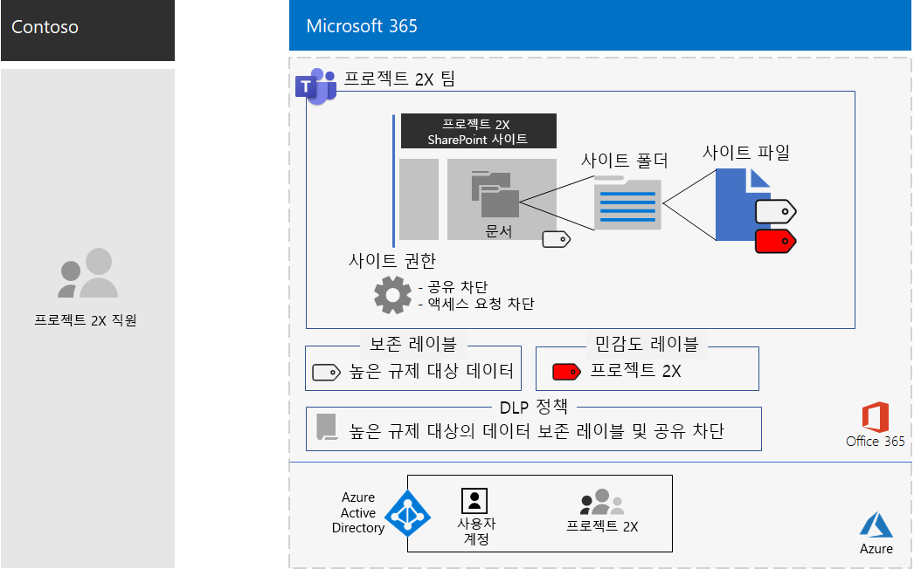

# Contoso Corporation의 극비 프로젝트를 위한 팀

경영진은이 Contoso의 CEO가 향후 5 년 동안 Contoso의 이익을 두 배로 만들 수 있는 새로운 제품 및 서비스 제품군의 개발을 주문 했습니다. 비즈니스, 엔지니어링 및 시장 계획을 개발 하기 위한 최상위 수준의 보안 프로젝트는 **프로젝트 2** , 회사 전체의 주요 직원 이라는 것이 recruited 되었습니다. 

연구 및 개발에 대 한 일정은 공동 작업을 효율적으로 수행 하 고 보안 모임, 진행 중인 대화 및 파일 저장을 제공 하기 위한 것입니다.

프로젝트 2의 결과 결과물은 비즈니스 계획, 제품 및 엔지니어링 사양, 마케팅 자료 및 일정은 Word, Excel 및 PowerPoint 파일 형식입니다. 

중요 한 특성으로 인해 다음과 같은 파일에 액세스할 수 있습니다.

- 프로젝트 2 개 팀 구성원으로 제한 됩니다.
- DLP (데이터 손실 방지) 정책으로 보호 되어 프로젝트 2 팀 구성원이 팀 외부에서이를 공유 하지 못하도록 방지 합니다.
- 암호화 및 보호 된 파일은 Contoso 외부에 배포 된 경우에도 프로젝트 2 번째 팀 구성원 에게만 액세스를 허용 하는 사용 권한으로 보호할 수 있습니다.

Contoso IT 직원은 프로젝트에 대 한 [높은 규제 대상 데이터에 대 한 팀](secure-teams-highly-regulated-data-scenario.md) 을 사용 했습니다.

## 1 단계: 개인 팀을 만들고 기본 SharePoint 사이트를 잠 궜 습니다.

팀의 기본 SharePoint 사이트에 대 한 액세스를 보호 하기 위해 Contoso IT 관리자는 [권장 되는 sharepoint 액세스 정책을](sharepoint-file-access-policies.md)구성 했습니다.

다음으로 Contoso IT 관리자가 Project 라는 새 비공개 팀을 만들고 프로젝트 2 개 직원의 사용자 계정을 구성원으로 추가 했습니다.

다음으로, 프로젝트 2가 사이트에 대 한 액세스를 공유 하지 못하도록 하 고 사이트에 대 한 액세스 요청을 방지 하기 위해 사이트에 대 한 추가 사용 권한 설정을 구성 했습니다.

구성에 대 한 자세한 내용은 [고도로 규제 된 팀에 대 한 SharePoint 설정](https://docs.microsoft.com/microsoft-365/security/office-365-security/deploy-teams-three-tiers#highly-confidential-teams)를 참조 하세요.

## 2 단계: 보존 레이블에 대 한 기본 사이트 및 DLP 정책 구성 

첫째로, Contoso 관리자는 기존의 **고도로 기밀** Office 365 보존 레이블을 프로젝트의 기본 SharePoint 사이트 (팀)에 있는 **문서** 섹션에 적용 했습니다.

다음으로, 다음은 **프로젝트 이름이 2** 인 새 OFFICE 365 DLP 정책을 만들었습니다.

- 높은 수준의 기밀 Office 365 보존 레이블을 사용 합니다.
- 사용자가 Contoso 외부의 팀 프로젝트에서 파일을 공유 하려고 할 때 차단 합니다.

구성에 대 한 자세한 내용은 [보존 레이블 및 DLP를 사용 하 여 팀의 파일 보호](https://docs.microsoft.com/microsoft-365/security/office-365-security/deploy-teams-retention-dlp)를 참조 하세요.

## 3 단계: 프로젝트 2 팀에 대 한 Office 365 민감도 레이블 작성

Contoso 관리자는 다음과 같은 **Project가 2** 배인 새 Office 365 민감도 레이블을 만들었습니다.

- 암호화 필요
- Office 365 그룹 2 개 프로젝트에 대해 공동 작성자 권한을 허용 합니다.

다음은 프로젝트를 2 배로 구성 하는 결과입니다.

 
원본으로 사용 하는 Project 2의 문서 섹션에 있는 파일은 다음과 같은 방법으로 보호 됩니다.

- 사이트 사용 권한-프로젝트 2 x 365 그룹 구성원 에게만 액세스를 허용 합니다.
- 높은 기밀 보존 레이블-새 파일에 자동으로 할당 됩니다.
- 고도로 기밀 보존 레이블과 파일을 외부 사용자와 공유 하지 못하도록 차단 하는 설정을 사용 하는 DLP 정책입니다.
- 파일을 이동 하거나 복사 하는 경우 파일과 함께 이동 하는 암호화 및 사용 권한을 갖는 프로젝트 2X 민감도 레이블입니다.

다음은 원본으로 사용 되는 프로젝트에 저장 되는 파일의 예로, 높은 규제 대상 보존 레이블과 프로젝트 2X 민감도 레이블이 할당 되는 위치입니다.

 
## 4 단계: 팀 구성원 2 대 교육 프로젝트

Contoso 보안 직원은 다음과 같은 작업을 수행 하는 필수 과정을 통해 프로젝트를 2 배의 팀 구성원에 게 교육 합니다.

- 새 프로젝트에 액세스 하는 방법 2 배, 모임 및 채팅을 사용 하 고 팀 파일을 공동으로 작업 하는 방법
- 팀에서 새 파일을 만들고 로컬로 만든 새 파일을 업로드 하는 방법
- DLP 정책이 외부에서 파일을 공유 하지 못하도록 차단 하는 방법에 대 한 데모입니다.
- 프로젝트의 민감도 레이블을 사용 하 여 파일에 레이블을 지정 하는 방법
- 프로젝트가 팀에서 나간 경우에도 파일을 2 차원으로 보호 하는 방법을 보여 주는 예제입니다.

최종 결과는 프로젝트 2 개 팀 구성원이 대화방, 모임 및 파일을 위해 안전한 환경에서 collaborated 하는 보안 환경 이었습니다.

두 개의 인스턴스에서 프로젝트 2 개 프로젝트의 보호 된 파일을 오프 라인 작업을 위해 로컬 드라이브로 다운로드 했습니다. 그러나 자격 증명을 열 때 확인 메시지가 표시 되 면 사용자가 실수로 메시지를 인식 하 고 삭제 합니다.

팀의 공동 작업 환경 및 Microsoft 365의 보안 기능 때문에 프로젝트의 세부 정보는 프로젝트 기간 동안 기밀로 유지 되었습니다. Contoso는 해당 계획을 발표 했으며, 고객 및 투자자의 안전 게 및 경쟁사의 chagrin에 새 제품 및 서비스를 배포 하는 프로세스를 진행 하 고 있습니다.

## 다음 단계

[배포](deploy-microsoft-365-enterprise.md) 조직의 Microsoft 365 Enterprise

## 참고 항목

[Microsoft 365 생산성 라이브러리](https://aka.ms/productivitylibrary) (https://aka.ms/productivitylibrary)
