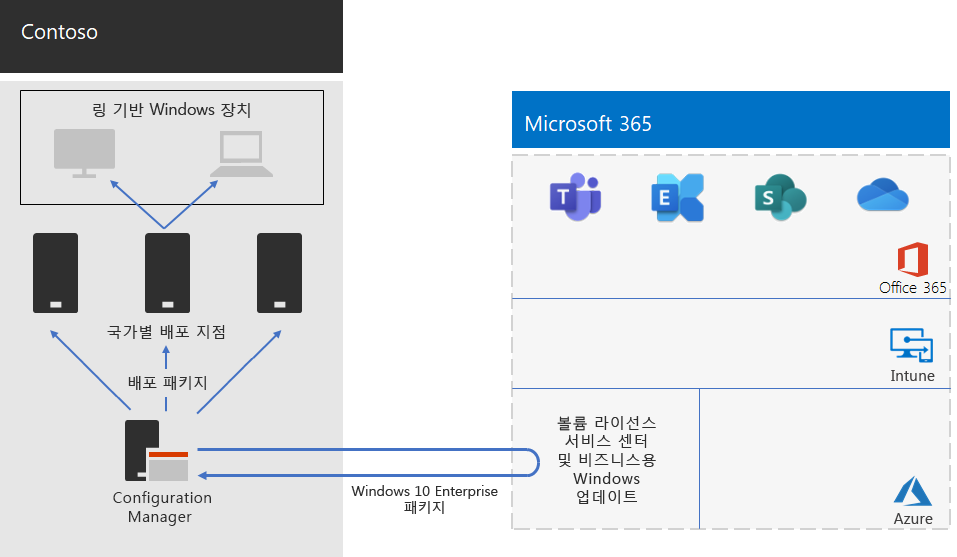

# Contoso의 Windows 10 Enterprise 배포

엔터프라이즈용 Microsoft 365 광범위한 롤아웃 이전에 Contoso는 Windows 7(10%), Windows 8.1(65%) 및 Windows 10(25%)를 Windows Windows 호환되는 PC 및 장치를 실행했습니다. Contoso는 자동화된 업데이트 배포에서 고급 보안을 Windows 10 Enterprise IT 오버헤드를 낮추기 위해 PC를 업그레이드하기를 원했습니다. 

Contoso는 해당 인프라 및 비즈니스 요구를 파악한 후 다음과 같은 핵심 배포 요구 사항을 확인했습니다.

- 가능한 한 많은 PC 및 장치에서 Windows 10 Enterprise를 실행해야 합니다.
- 현재 위치 업그레이드의 롤아웃은 기존 Configuration Manager 인프라를 활용해야 합니다.
- 배포할 Windows 10 Enterprise 버전 및 업데이트에 대한 제어는 링을 통해 수행됩니다.
- PC 및 장치는 최소한의 IT 관리 비용을 들이고 최종 사용자에게 최소한의 영향을 미치면서 최신 상태로 유지해야 합니다.

최신 버전은 지원되는 Contoso의 비즈니스 요구를 충족하는 지원되는 Windows 10 Enterprise 버전으로 정의되며, 이것은 모든 Windows 호환 PC에서 최신 버전의 Windows 10 Enterprise를 실행하도록 하는 것과는 다른 차원일 수 있습니다.

## 배포 도구

Windows 10 Enterprise의 현재 위치 업그레이드 이전 및 도중에 Contoso는 다음 Windows Analytics 솔루션을 사용했습니다.

- 업그레이드 준비  

  분석을 위해 시스템, 응용 프로그램 및 드라이버 데이터를 수집한 후 업그레이드를 차단할 수 있는 호환성 문제와 Microsoft에 알려져 있는 문제에 대한 제안된 수정 프로그램을 식별합니다.

- 준수 업데이트  

  Windows 업데이트와 관련된 장치의 상태를 표시 하여 최신 업데이트를 적절하게 유지할 수 있도록 해줍니다.

- 장치 상태  

  자주 충돌이 발생하여 다시 제조하거나 대체할 필요가 있는 장치 및 장치의 충돌을 발생시키는 장치 드라이버와 충돌 횟수를 줄일 수 있는 이들 드라이버의 대체 버전에 대한 제안과 함께 식별 합니다. 최종 사용자에게 프롬프트를 보내는 Windows Information Protection의 잘못된 구성에 대해 알립니다.
 
Contoso는 기존의 Configuration Manager(현재 분기) 인프라가 있습니다. Configuration Manager는 대규모 환경에 맞게 확장되며, 설치, 업데이트 및 설정을 포괄적으로 제어할 수 있도록 합니다. 그뿐 아니라 Windows 10 Enterprise를 보다 쉽고 효율적으로 배포 및 관리할 수 있도록 하는 기본 제공 기능도 제공합니다.

## 계획 프로세스

Contoso는 Windows Analytics에서 업그레이드 준비를 사용하여 설치된 앱 집합 및 앱과의 호환성을 Windows 10 Enterprise.

## 배포 프로세스

Windows 10 Enterprise의 현재 위치 업그레이드 배포를 완료하기 위해 Contoso는 Microsoft의 모범 사례 권장 사항을 포함하는 다음 프로세스를 구현했습니다.

1. Configuration Manager에 대한 피어 캐시를 사용하도록 설정했습니다.
2. 볼륨 라이선스 서비스 센터의 이미지를 기준으로 사용자 지정된 Windows 패키지를 생성했습니다.
3. Configuration Manager를 사용하여 네트워크의 Windows 배포 지점에 배포하고 세 가지 유효성 검사 및 배포 준비 그룹에 빌드를 배포했습니다.
4. Windows Analytics의 장치 상태 및 업데이트 준수 솔루션을 사용하여 3개의 유효성 검사 및 배포 준비 링의 PC 및 장치에 대한 배포 성공 여부를 평가했습니다.
5. Contoso는 Windows 분석 정보에 따라 광범위한 배포 Windows 10 Enterprise 배포할 버전이 결정되었습니다.
6. Configuration Manager 배포 작업 순서를 실행하여 선택된 Windows 배포 그룹에 배포했습니다.
7. 장치 상태 및 업데이트 준수 솔루션을 사용하여 문제를 해결하기 위해 광범위한 배포 그룹의 PC 및 장치를 모니터링했습니다.

Contoso의 현재 위치 업그레이드 및 지속적인 업데이트 배포 아키텍처는 다음과 같습니다.

이 인프라는 다음으로 구성됩니다.

- 다음과 같은 Configuration Manager:
  - Microsoft Network의 Microsoft 볼륨 라이선스 센터에서 Windows 10 Enterprise 패키지에 대한 이미지를 가져옵니다.
  - 배포 패키지에 대한 중앙 관리 지점
- 일반적으로 Contoso의 지역 허브 사무실에 있는 지역별 배포 지점
- Windows 현재 위치 업그레이드 또는 그룹 구성원 자격에 따라 진행되는 업데이트에 대한 배포 패키지를 받아 설치하는 다양한 위치의 PC 및 장치

## 다음 단계

Contoso가 Configuration Manager 인프라를 활용하여 조직 전체에서 최신 구성 엔터프라이즈용 Microsoft 365 앱 [방법을](contoso-o365pp.md) 알아보습니다. 

## 참고 항목

[Windows 10 Enterprise](/windows/deployment/)

[엔터프라이즈용 Microsoft 365 개요](microsoft-365-overview.md)

[테스트 랩 가이드](m365-enterprise-test-lab-guides.md)