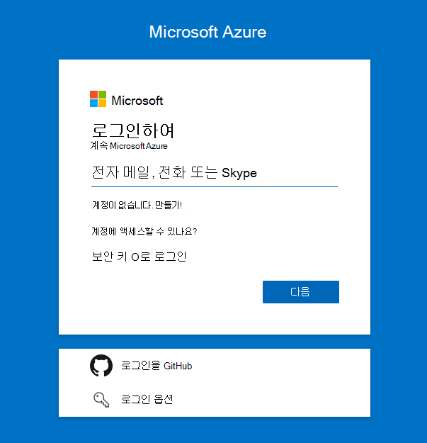
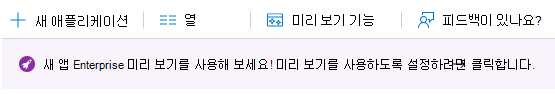
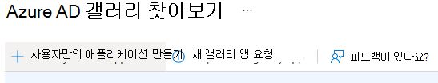
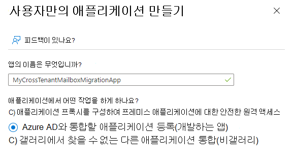
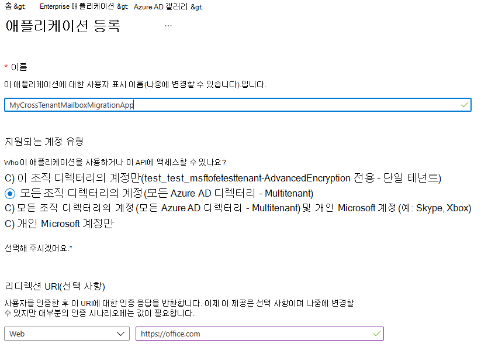
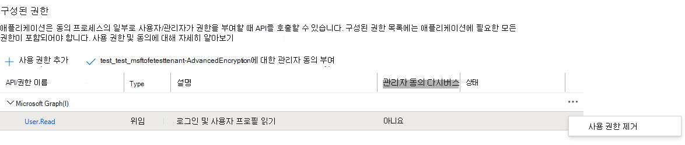
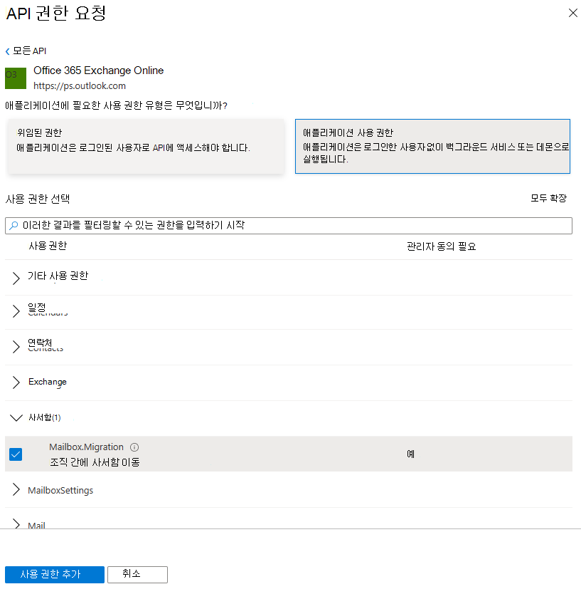

# <a name="cross-tenant-mailbox-migration-preview"></a>테넌트 간 사서함 마이그레이션(미리 보기)

일반적으로 합병 또는 매입 중에 사용자의 Exchange Online 사서함을 새 테넌트로 이동하는 능력이 필요합니다. 테넌트 간 사서함 마이그레이션을 통해 테넌트 관리자는 원격 PowerShell 및 MRS와 같은 잘 알려진 인터페이스를 사용하여 사용자를 새 조직으로 전환할 수 있습니다.

관리자는 사서함 이동 관리 역할을 통해 New-MigrationBatch cmdlet을 사용하여 테넌트 간 이동을 실행할 수 있습니다.

테넌트 간 이동을 Exchange Online 특정 특성으로 표시된 MailUsers로 대상 테넌트 Exchange Online 시스템에 사용자 마이그레이션이 있어야 합니다. 대상 테넌트에서 제대로 설정되지 않은 사용자에 대해 시스템이 이동되지 않습니다.

이동이 완료되면 원본 사용자 사서함이 MailUser로 변환되어 targetAddress(Exchange의 ExternalEmailAddress로 표시)는 대상 테넌트에 대한 라우팅 주소로 스탬프가 지정됩니다. 이 프로세스는 원본 테넌트에 레거시 MailUser를 그대로 남겨두고 공조 및 메일 라우팅을 허용합니다. 비즈니스 프로세스에서 허용하는 경우 원본 테넌트가 원본 MailUser를 제거하거나 메일 연락처로 변환할 수 있습니다.

크로스 테넌트 Exchange 하이브리드 또는 클라우드의 테넌트 또는 둘의 임의 조합에 대해 지원됩니다.

이 문서에서는 테넌트 간 사서함 이동 프로세스에 대해 설명하고 사서함 콘텐츠 이동에 대해 원본 및 대상 테넌트가 Exchange Online 지침을 제공합니다.

   > [!NOTE]
   > 최근에 테넌트 간 사서함 마이그레이션을 사용하도록 설정 단계를 업데이트하여 Azure Key Vault가 더 이상 필요하지 않습니다! 이 미리 보기에 처음 온보드를 하는 경우 아무 작업도 필요하지 않습니다. 이 문서에 자세히 설명된 단계를 진행할 수 있습니다. 이전 AKV 방법을 사용하여 테넌트 구성을 시작한 경우 이 새 방법을 사용하려면 해당 구성을 중지하거나 제거하는 것이 좋습니다. 이전 AKV 방법을 사용하여 사서함 마이그레이션을 진행하고 있는 경우 기존 마이그레이션이 완료될 때까지 기다렸다가 아래 단계에 따라 새로운 간소화된 방법을 사용하도록 설정하세요. Azure Key Vault 필수 설정 단계는 보관되지만 참조를 위해 여기에서 찾을 수 있습니다. **[](https://github.com/microsoft/cross-tenant/wiki/V1-Content#cross-tenant-mailbox-migration-preview)**

## <a name="preparing-source-and-target-tenants"></a>원본 및 대상 테넌트 준비

### <a name="prerequisites-for-source-and-target-tenants"></a>원본 테넌트 및 대상 테넌트의 선행 준비

시작하기 전에 Azure, EXO 마이그레이션 끝점 및 EXO 조직 관계에서 사서함 이동 응용 프로그램을 구성하는 데 필요한 권한이 있는지 확인해야 합니다.

또한 원본 테넌트에 메일 사용이 가능한 보안 그룹이 하나 이상 필요합니다. 이러한 그룹은 원본(또는 리소스라고도 하는) 테넌트에서 대상 테넌트로 이동할 수 있는 사서함 목록의 범위를 지정하는 데 사용됩니다. 이렇게 하면 원본 테넌트 관리자가 이동해야 하는 특정 사서함 집합을 제한하거나 범위를 지정하여 의도하지 않은 사용자가 마이그레이션되지 않도록 할 수 있습니다. 중첩된 그룹은 지원되지 않습니다.

또한 해당 테넌트 ID를 얻기 위해 신뢰할 수 있는 파트너 회사(사서함을 이동하는 Microsoft 365 통신해야 합니다. 이 테넌트 ID는 조직 관계 도메인 이름 필드에 사용됩니다.

구독의 테넌트 ID를 구하려면 구독에 로그인하고 [Microsoft 365 관리 센터](https://go.microsoft.com/fwlink/p/?linkid=2024339) 로 [https://aad.portal.azure.com/\#blade/Microsoft_AAD_IAM/ActiveDirectoryMenuBlade/Properties](https://aad.portal.azure.com/#blade/Microsoft_AAD_IAM/ActiveDirectoryMenuBlade/Properties) 이동하세요. 테넌트 ID 속성의 복사 아이콘을 클릭하여 클립보드에 복사합니다.

### <a name="configuration-steps-to-enable-your-tenants-for-cross-tenant-mailbox-migrations"></a>테넌트 간 사서함 마이그레이션을 사용하도록 설정하는 구성 단계

   > [!NOTE]
   > 먼저 대상(대상)을 구성해야 합니다. 이 단계를 완료하려면 원본 테넌트와 대상 테넌트 둘 다에 대한 테넌트 관리자 자격 증명을 가지거나 알 필요가 없습니다. 단계는 각 테넌트에 대해 서로 다른 관리자가 개별적으로 수행할 수 있습니다.

### <a name="prepare-the-target-destination-tenant-by-creating-the-migration-application-and-secret"></a>마이그레이션 응용 프로그램 및 비밀을 만들어 대상(대상) 테넌트 준비

1. 대상 테넌트 관리자 자격 증명을 사용하여 Azure AD 포털에 <https://portal.azure.com> 로그인( )

   

2. Azure의 서비스에서 Azure의 서비스를 Azure Active Directory.

3. 왼쪽 탐색 모음에서 응용 프로그램 Enterprise 선택합니다.

4. 새 응용 프로그램 선택

   

5. 자체 응용 프로그램 만들기 선택

   

6. 응용 프로그램의 이름(조직의 명명 규칙에 따라 다를 수 있습니다)을 입력하고 Azure AD와 통합할 응용 프로그램 등록을 선택한 다음 만들기를 선택합니다.

   

7. 응용 프로그램 등록 페이지의 지원되는 계정 유형에서 조직에서 직접 계정 선택(모든 Azure AD 디렉터리 - 멀티텐트)을 선택합니다. 그런 다음 URI 리디렉션(선택 사항)에서 웹을 선택하고 를 <https://office.com> 입력합니다. 마지막으로 등록을 선택합니다.

   

8. 페이지의 오른쪽 위 모서리에 앱이 성공적으로 만들어졌다는 알림 팝업이 표시됩니다.

9. 홈으로 돌아가서 Azure Active Directory 등록을 클릭합니다.

10. 소유 응용 프로그램에서 방금 만든 앱을 찾아서 클릭합니다.

11. ^Essentials에서 나중에 대상 테넌트의 URL을 만드는 데 필요한 응용 프로그램(클라이언트) ID를 복사해야 합니다.

12. 이제 왼쪽 탐색 모음에서 API 권한을 클릭하여 앱에 할당된 사용 권한을 볼 수 있습니다.

13. 기본적으로 User.Read 권한은 방금 만든 앱에 할당되지만 사서함 마이그레이션에는 필요하지 않습니다. 해당 권한을 제거할 수 있습니다.

    

14. 이제 사서함 마이그레이션에 대한 사용 권한을 추가해야 합니다. 사용 권한 추가를 선택합니다.

15. API 권한 요청 창에서 조직 사용자에 대한 API를 선택하고 온라인으로 Office 365 Exchange를 검색합니다.

    

16. 다음으로 응용 프로그램 사용 권한을 선택합니다.

17. 그런 다음 사용 권한 선택에서 사서함을 확장하고 Mailbox.Migration을 확인하고 화면 맨 아래에 사용 권한 추가를 선택합니다.

    

18. 이제 응용 프로그램의 왼쪽 & 표시줄에서 인증서 인증서를 선택합니다.

19. 클라이언트 비밀에서 새 클라이언트 비밀을 선택합니다.

    

20. 클라이언트 비밀 추가 창에서 설명을 입력하고 원하는 만료 설정을 구성합니다.

      > [!NOTE]
      > 이 암호는 마이그레이션 끝점을 만들 때 사용됩니다. 이 암호를 클립보드에 복사하거나 이 암호를 복사하여 안전한 암호로 보호하는 것이 매우 중요합니다. 이 암호를 볼 수 있는 유일한 시간입니다! 손실되거나 다시 설정해야 하는 경우 Azure Portal에 다시 로그인하고, 앱 등록으로 이동하여 마이그레이션 앱을 찾고, & 암호를 선택하고, 앱에 대한 새 암호를 만들 수 있습니다.

21. 마이그레이션 응용 프로그램과 비밀을 성공적으로 만들었다면 응용 프로그램에 동의해야 합니다. 응용 프로그램에 동의하려면 Azure Active Directory 방문 페이지로 돌아가서 왼쪽 탐색에서 Enterprise 응용 프로그램을 클릭하고 방금 만든 마이그레이션 앱을 찾아 선택한 다음 왼쪽 탐색에서 사용 권한을 선택합니다.

22. [테넌트] 관리자 동의 부여 단추를 클릭합니다.

23. 새 브라우저 창이 열리면 수락을 선택합니다.

24. 포털 창으로 돌아가서 새로 고침을 선택하여 수락을 확인할 수 있습니다.

25. 사서함 마이그레이션을 사용하도록 설정하기 위해 응용 프로그램을 수락할 수 있도록 신뢰할 수 있는 파트너(원본 테넌트 관리자)에게 보낼 URL을 수식화합니다. 다음은 방금 만든 앱의 응용 프로그램 ID가 필요한 URL의 예입니다.

    ```powershell
    https://login.microsoftonline.com/sourcetenant.onmicrosoft.com/adminconsent?client_id=[application_id_of_the_app_you_just_created]&redirect_uri=https://office.com
    ```

    > [!NOTE]
    > 방금 만든 사서함 마이그레이션 앱의 응용 프로그램 ID가 필요합니다.
    >
    > 위 예제의 sourcetenant.onmicrosoft.com 이름을 올바른 원본 테넌트로 onmicrosoft.com 합니다.
    >
    > 또한 [application_id_of_the_app_you_just_created]를 방금 만든 사서함 마이그레이션 앱의 응용 프로그램 ID로 바꾸야 합니다.

### <a name="prepare-the-target-tenant-by-creating-the-exchange-online-migration-endpoint-and-organization-relationship"></a>마이그레이션 끝점 및 조직 관계를 Exchange Online 대상 테넌트 준비

1. 대상 테넌트에 대한 원격 PowerShell 연결을 Exchange Online.

2. 테넌트 간 사서함 이동을 위한 새 마이그레이션 끝점 만들기

   > [!NOTE]
   > 방금 만든 사서함 마이그레이션 앱의 응용 프로그램 ID와 이 프로세스 중에 구성한 암호(암호)가 필요합니다. 또한 끝점을 사용하는 Microsoft 365 클라우드 인스턴스에 따라 다를 수 있습니다. Microsoft 365 끝점 [](/microsoft-365/enterprise/microsoft-365-endpoints) 페이지를 참조하고 테넌트에 대한 올바른 인스턴스를 선택하고 Exchange Online 최적화 필수 주소를 검토하고 적절하게 바하세요.

   ```powershell
   $AppId = "[guid copied from the migrations app]"

   $Credential = New-Object -TypeName System.Management.Automation.PSCredential -ArgumentList $AppId, (ConvertTo-SecureString -String "[this is your secret password you saved in the previous steps]" -AsPlainText -Force)

   New-MigrationEndpoint -RemoteServer outlook.office.com -RemoteTenant "sourcetenant.onmicrosoft.com" -Credentials $Credential -ExchangeRemoteMove:$true -Name "[the name of your migration endpoint]" -ApplicationId $AppId
   ```

3. 원본 테넌트에 대한 기존 조직 관계 개체를 새로 만들거나 편집합니다.

   ```powershell
   $sourceTenantId="[tenant id of your trusted partner, where the source mailboxes are]"
   $orgrels=Get-OrganizationRelationship
   $existingOrgRel = $orgrels | ?{$_.DomainNames -like $sourceTenantId}
   If ($null -ne $existingOrgRel)
   {
       Set-OrganizationRelationship $existingOrgRel.Name -Enabled:$true -MailboxMoveEnabled:$true -MailboxMoveCapability Inbound
   }
   If ($null -eq $existingOrgRel)
   {
       New-OrganizationRelationship "[name of the new organization relationship]" -Enabled:$true -MailboxMoveEnabled:$true -MailboxMoveCapability Inbound -DomainNames $sourceTenantId
   }
   ```

### <a name="prepare-the-source-current-mailbox-location-tenant-by-accepting-the-migration-application-and-configuring-the-organization-relationship"></a>마이그레이션 응용 프로그램을 수락하고 조직 관계를 구성하여 원본(현재 사서함 위치) 테넌트 준비

1. 브라우저에서 사서함 마이그레이션 응용 프로그램에 동의하기 위해 신뢰할 수 있는 파트너가 제공하는 URL 링크로 이동하십시오. URL은 다음과 같습니다.

   ```powershell
   https://login.microsoftonline.com/sourcetenant.onmicrosoft.com/adminconsent?client_id=[application_id_of_the_app_you_just_created]&redirect_uri=https://office.com
   ```

   > [!NOTE]
   > 방금 만든 사서함 마이그레이션 앱의 응용 프로그램 ID가 필요합니다.
   > 위 예제의 sourcetenant.onmicrosoft.com 이름을 올바른 원본 테넌트로 onmicrosoft.com 합니다.
   > 또한 [application_id_of_the_app_you_just_created]를 방금 만든 사서함 마이그레이션 앱의 응용 프로그램 ID로 바꾸야 합니다.

2. 팝업이 나타날 때 응용 프로그램을 수락합니다. 또한 사이트 포털에 로그인하고 Azure Active Directory 응용 프로그램에서 응용 프로그램을 Enterprise 있습니다.

3. 원격 PowerShell 창에서 대상(대상) 테넌트에 새 조직 관계 개체를 만들거나 Exchange Online 편집합니다.

   ```powershell
   $targetTenantId="[tenant id of your trusted partner, where the mailboxes are being moved to]"
   $appId="[application id of the mailbox migration app you consented to]"
   $scope="[name of the mail enabled security group that contains the list of users who are allowed to migrate]"
   $orgrels=Get-OrganizationRelationship
   $existingOrgRel = $orgrels | ?{$_.DomainNames -like $targetTenantId}
   If ($null -ne $existingOrgRel)
   {
       Set-OrganizationRelationship $existingOrgRel.Name -Enabled:$true -MailboxMoveEnabled:$true -MailboxMoveCapability RemoteOutbound -OAuthApplicationId $appId -MailboxMovePublishedScopes $scope
   }
   If ($null -eq $existingOrgRel)
   {
       New-OrganizationRelationship "[name of your organization relationship]" -Enabled:$true -MailboxMoveEnabled:$true -MailboxMoveCapability RemoteOutbound -DomainNames $targetTenantId -OAuthApplicationId $appId -MailboxMovePublishedScopes $scope
   }
   ```

### <a name="how-do-i-know-this-worked"></a>작동 여부는 어떻게 확인합니까?

대상 테넌트에서 만든 테넌트 간 마이그레이션 끝점에 대해 [Test-MigrationServerAvailability](/powershell/module/exchange/Test-MigrationServerAvailability) cmdlet을 실행하여 테넌트 간 사서함 마이그레이션 구성을 확인할 수 있습니다.

   > [!NOTE]
   > Test-MigrationServerAvailability -Endpoint "[테넌트 간 마이그레이션 끝점의 이름]" -TestMailbox "[마이그레이션 범위의 일부인 원본 사서함의 전자 메일 주소]"

### <a name="move-mailboxes-back-to-the-original-source"></a>사서함을 원래 원본으로 다시 이동

사서함이 원래 원본 테넌트로 다시 이동해야 하는 경우 새 원본 테넌트와 새 대상 테넌트에서 동일한 단계 및 스크립트 집합을 실행해야 합니다. 기존 조직 관계 개체는 다시 생성되지 않는 업데이트 또는 추가됩니다.

## <a name="prepare-target-user-objects-for-migration"></a>마이그레이션을 위한 대상 사용자 개체 준비

테넌트 간 이동을 사용하려면 마이그레이션하는 사용자가 대상 테넌트에 있어야 Exchange Online 시스템(MailUsers)에 특정 특성이 표시되어야 합니다. 대상 테넌트에서 제대로 설정되지 않은 사용자에 대해 시스템이 이동되지 않습니다. 다음 섹션에서는 대상 테넌트에 대한 MailUser 개체 요구 사항에 대해 자세히 설명합니다.

### <a name="prerequisites-for-target-user-objects"></a>대상 사용자 개체의 선행 준비

대상 조직에서 다음과 같은 개체와 특성을 설정해야 합니다.

1. 원본 조직에서 이동하는 사서함의 경우 대상 조직에서 MailUser 개체를 프로비전해야 합니다.

   - Target MailUser에는 원본 사서함에서 이러한 특성이 있어야 합니다. 또는 새 User 개체와 함께 할당되어야 합니다.
      - ExchangeGUID(원본에서 대상으로의 직접 흐름): 사서함 GUID가 일치해야 합니다. 이 개체가 대상 개체에 없는 경우 이동 프로세스가 진행되지 않습니다.
      - ArchiveGUID(원본에서 대상으로 직접 흐름): 보관 GUID가 일치해야 합니다. 이 개체가 대상 개체에 없는 경우 이동 프로세스가 진행되지 않습니다. 이 설정은 원본 사서함이 보관을 사용하도록 설정된 경우만 필요합니다.
      - LegacyExchangeDN (flow as proxyAddress, "x500: \<LegacyExchangeDN> "): LegacyExchangeDN must be present on target MailUser as x500: proxyAddress. 또한 원본 사서함의 모든 x500 주소를 대상 메일 사용자로 복사해야 합니다. 이러한 개체가 대상 개체에 없는 경우 이동 프로세스가 진행되지 않습니다.
      - UserPrincipalName: UPN이 사용자의 NEW ID 또는 대상 회사(예: user@northwindtraders.onmicrosoft.com)에 맞춰집니다.
      - 기본 SMTPAddress: 기본 SMTP 주소가 사용자의 새 회사(예: user@northwind.com)에 맞춰집니다.
      - TargetAddress/ExternalEmailAddress: MailUser는 원본 테넌트에 호스트된 사용자의 현재 사서함을 참조합니다(예: user@contoso.onmicrosoft.com). 이 값을 할당할 때 PrimarySMTPAddress도 할당하고 있는지 또는 이 값이 이동 실패의 원인이 될 PrimarySMTPAddress를 설정하는지 확인해야 합니다.
      - 원본 사서함의 레거시 smtp 프록시 주소를 대상 MailUser에 추가할 수 없습니다. 예를 들어 테넌트 개체의 MEU에 contoso.com 유지 fabrikam.onmicrosoft.com 없습니다. 도메인은 하나의 Azure AD 또는 Exchange Online 연결됩니다.

     대상  MailUser 개체의 예:

     | 특성            | 값                                                                                                                   |
     | -------------------- | ----------------------------------------------------------------------------------------------------------------------- |
     | 별칭                | 라라N                                                                                                                   |
     | RecipientType        | MailUser                                                                                                                |
     | RecipientTypeDetails | MailUser                                                                                                                |
     | UserPrincipalName    | LaraN@northwintraders.onmicrosoft.com                                                                                   |
     | PrimarySmtpAddress   | Lara.Newton@northwind.com                                                                                               |
     | ExternalEmailAddress | SMTP:LaraN@contoso.onmicrosoft.com                                                                                      |
     | ExchangeGuid         | 1ec059c7-8396-4d0b-af4e-d6bd4c12a8d8                                                                                    |
     | LegacyExchangeDN     | /o=First Organization/ou=Exchange 관리 그룹                                                                  |
     |                      | (FYDIBOHF23SPDLT)/cn=Recipients/cn=74e5385fce4b46d19006876949855035Lara                                                 |
     | EmailAddresses       | x500:/o=first Organization/ou=Exchange Administrative Group (FYDIBOHF23SPDLT)/cn=Recipients/cn=d11ec1a2cacd4f81858c8190 |
     |                      | 7273f1f9-Lara                                                                                                           |
     |                      | smtp:LaraN@northwindtraders.onmicrosoft.com                                                                             |
     |                      | SMTP:Lara.Newton@northwind.com                                                                                          |
     |                      |                                                                                                                         |

     원본 **사서함 개체의** 예:

     | 특성            | 값                                                                   |
     | -------------------- | ----------------------------------------------------------------------- |
     | 별칭                | 라라N                                                                   |
     | RecipientType        | UserMailbox                                                             |
     | RecipientTypeDetails | UserMailbox                                                             |
     | UserPrincipalName    | LaraN@contoso.onmicrosoft.com                                           |
     | PrimarySmtpAddress   | Lara.Newton@contoso.com                                                 |
     | ExchangeGuid         | 1ec059c7-8396-4d0b-af4e-d6bd4c12a8d8                                    |
     | LegacyExchangeDN     | /o=First Organization/ou=Exchange 관리 그룹                  |
     |                      | (FYDIBOHF23SPDLT)/cn=Recipients/cn=d11ec1a2cacd4f81858c81907273f1f9Lara |
     | EmailAddresses       | smtp:LaraN@contoso.onmicrosoft.com                                      |
     |                      | SMTP:Lara.Newton@contoso.com                                            |
     |                      |                                                                         |

   - 추가 특성은 하이브리드 쓰기 Exchange 이미 포함되어 있을 수 있습니다. 그렇지 않은 경우 포함해야 합니다.
   - msExchBlockedSendersHash – 클라이언트에서 온라인에서 안전한 수신 및 차단된 보낸 사람 데이터를 다시 프레미스 Active Directory에 기록합니다.
   - msExchSafeRecipientsHash – 온라인에서 클라이언트에서온-프레미스 Active Directory로 안전한 수신 및 차단된 보낸 사람 데이터를 기록합니다.
   - msExchSafeSendersHash – 클라이언트에서온-프레미스 Active Directory로 온라인에서 안전하고 차단된 보낸 사람 데이터를 다시 기록합니다.

2. 원본 사서함이 LitigationHold에 있으며 원본 사서함 복구 가능한 항목 크기가 데이터베이스 기본값(30GB)보다 크면 대상 할당량이 원본 사서함 크기보다 작기 때문에 이동이 진행되지 않습니다. 대상 MailUser 개체를 업데이트하여 원본 환경에서 대상으로 ELC 사서함 플래그를 전환할 수 있습니다. 그러면 대상 시스템에서 MailUser의 할당량 확장을 100GB로 트리거하여 대상으로 이동할 수 있습니다. ELC 플래그를 스탬프 지정하는 명령은 테넌트 관리자에게 노출되지 커넥트 Azure AD 2013을 실행하는 하이브리드 ID에만 이 지침이 실행됩니다.

    > [!NOTE]
    > 샘플 – 있는 경우 무상 수리
    >
    > 이 스크립트는 원본 사서함(원본 값을 얻기 위해) 및 대상에 대한 연결(ADUser 개체 스탬프 지정)을 가정합니다. 원본에 소송 또는 단일 항목 복구를 사용하도록 설정한 경우 대상 계정에서 이를 설정합니다.  이렇게 하면 대상 계정의 반지 크기가 100GB로 증가합니다.

    ```powershell
    $ELCValue = 0
    if ($source.LitigationHoldEnabled) {$ELCValue = $ELCValue + 8} if ($source.SingleItemRecoveryEnabled) {$ELCValue = $ELCValue + 16} if ($ELCValue -gt 0) {Set-ADUser -Server $domainController -Identity $destination.SamAccountName -Replace @{msExchELCMailboxFlags=$ELCValue}}
    ```

3. 비하이블 대상 테넌트는 다음 명령을 실행하여 MailUser 개체에 대한 소송 보류를 사용하도록 설정하고 할당량 을 100GB로 늘려 마이그레이션 전에 MailUsers의 복구 가능한 항목 폴더에 대한 할당량 을 수정할 수 `Set-MailUser -EnableLitigationHoldForMigration` 있습니다. 이 방식은 하이브리드의 테넌트에는 작동하지 않습니다.

4. 대상 조직의 사용자는 조직에 적용할 수 있는 적절한 Exchange Online 라이선스가 있어야 합니다. 사서함 이동에 앞서 라이선스를 적용할 수 있지만 대상 MailUser가 ExchangeGUID 및 프록시 주소로 올바르게 설정된 후만 적용할 수 있습니다. ExchangeGUID가 적용되기 전에 라이선스를 적용하면 대상 조직에 새 사서함이 프로비전됩니다.

    > [!NOTE]
    > Mailbox 또는 MailUser 개체에 라이선스를 적용하면 확인된 도메인만 EmailAddresses 배열에 포함되도록 모든 SMTP 형식 proxyAddresses가 Exchange 스크러빙됩니다.

5. 대상 MailUser에 Source ExchangeGuid와 일치하지 않는 이전 ExchangeGuid가 없는지 확인해야 합니다. 대상 MEU에 대해 이전에 사용이 허가되어 사서함을 프로비전한 Exchange Online 발생할 수 있습니다. 대상 MailUser가 이전에 사용이 허가되거나 Source ExchangeGuid와 일치하지 않는 ExchangeGuid가 있는 경우 클라우드 MEU를 정리해야 합니다. 이러한 클라우드 MEUS의 경우 를 실행할 수 `Set-User <identity> -PermanentlyClearPreviousMailboxInfo` 있습니다.

    > [!CAUTION]
    > 이 프로세스는 다시 할 수 없습니다. 개체에 softDeleted 사서함이 있는 경우 이 시점 이후에는 복원할 수 없습니다. 그러나 선택을 취소한 후 올바른 ExchangeGuid를 대상 개체와 동기화할 수 있으며 MRS는 원본 사서함을 새로 만든 대상 사서함에 연결합니다. (새 매개 변수에 대한 EHLO 참조 블로그)

    이 명령을 사용하여 이전에 사서함이던 개체를 찾을 수 있습니다.

    ```powershell
    Get-User <identity> | select Name, *recipient* | Format-Table -AutoSize
    ```

    예를 들면 다음과 같습니다.

    ```powershell
    Get-User John@northwindtraders.com |select name, *recipient*| Format-Table -AutoSize

    Name       PreviousRecipientTypeDetails     RecipientType RecipientTypeDetails
    ----       ---------------------------- ------------- --------------------
    John       UserMailbox                  MailUser      MailUser
    ```

    이 명령을 사용하여 소프트 삭제된 사서함의 선택을 취소합니다.

    ```powershell
    Set-User <identity> -PermanentlyClearPreviousMailboxInfo
    ```

    예를 들면 다음과 같습니다.

    ```powershell
    Set-User John@northwindtraders.com -PermanentlyClearPreviousMailboxInfo -Confirm
    
    Are you sure you want to perform this action?
    Delete all existing information about user "John@northwindtraders.com"?. This operation will clear existing values from Previous home MDB and Previous Mailbox GUID of the user. After deletion, reconnecting to the previous mailbox that existed in the cloud will not be possible and any content it had will be unrecoverable PERMANENTLY.
    Do you want to continue?
    [Y] Yes  [A] Yes to All  [N] No  [L] No to All  [?] Help (default is "Y"): Y
    ```

### <a name="perform-mailbox-migrations"></a>사서함 마이그레이션 수행

크로스 테넌트 Exchange 마이그레이션 일괄 처리로 대상 테넌트에서 시작됩니다. 이는 마이그레이션 일괄 처리가 모든 마이그레이션 일괄 처리에서 Exchange 작업하는 Microsoft 365.

### <a name="create-migration-batches"></a>마이그레이션 일괄 처리 만들기

다음은 이동 시작을 위한 마이그레이션 일괄 처리 cmdlet의 예입니다.

```powershell
New-MigrationBatch -Name T2Tbatch -SourceEndpoint target_source_7977 -CSVData ([System.IO.File]::ReadAllBytes('users.csv')) -Autostart -TargetDeliveryDomain target.onmicrosoft.com

Identity                   Status  Type               TotalCount
--------                   ------  ----               ----------
T2Tbatch                   Syncing ExchangeRemoteMove 1
```

> [!NOTE]
> CSV 파일의 전자 메일 주소는 원본 테넌트가 아니라 대상 테넌트에 지정된 주소입니다.
>
> [cmdlet에 대한 자세한 내용은 여기를 클릭하세요.](/powershell/module/exchange/new-migrationbatch)
>
> [예제 CSV 파일의 경우 여기를 클릭하세요.](/exchange/csv-files-for-mailbox-migration-exchange-2013-help)

테넌트 간 옵션을 선택할 때 마이그레이션 일괄 처리 Exchange 관리 센터에서 마이그레이션 일괄 처리 전송도 지원됩니다.

### <a name="update-on-premises-mailusers"></a>On-premises MailUsers 업데이트

사서함이 원본에서 대상으로 이동한 후 원본 및 대상 모두에서 모든 On-프레미스 메일 사용자가 새 targetAddress로 업데이트되도록 해야 합니다. 예제에서 이동에 사용되는 targetDeliveryDomain은 에 **contoso.onmicrosoft.com.** 이 targetAddress로 메일 사용자를 업데이트합니다.

## <a name="frequently-asked-questions"></a>질문과 대답

**이동 후 원본에서 원격Mailboxes를 업데이트해야 하나요?**

예, 원본 테넌트 사서함이 대상 테넌트로 이동할 때 원본의 targetAddress(RemoteRoutingAddress/ExternalEmailAddress)를 업데이트해야 합니다.  메일 라우팅은 다른 targetAddresses를 사용하는 여러 메일 사용자에 대한 추천을 따를 수 있는 반면, 메일 사용자에 대한 사용 중/사용 중은 사서함 사용자의 위치를 대상으로 지정해야 합니다. 무료/사용 중 검색은 여러 리디렉션을 추격하지 않습니다.

**테넌트 Teams 마이그레이션합니까?**

모임이 이동하나 Teams 교차 테넌트에서 항목이 마이그레이션될 때 모임 URL이 업데이트되지 않습니다. URL이 대상 테넌트에서 유효하지 않은 것이기 때문에 해당 모임을 제거하고 다시 Teams 합니다.

**공유 Teams 콘텐츠가 테넌트 간 마이그레이션합니까?**

아니요. Teams 폴더 콘텐츠는 테넌트 간 마이그레이션되지 않습니다.

**온보드 및 오프보드 이동이 아니라 테넌트 간 이동인 이동만 볼 수 있는 방법**

_Flags 매개 변수를_ 사용합니다. 예를 들면 다음과 같습니다.

```powershell
Get-MoveRequest -Flags "CrossTenant"
```

**테스트에 사용되는 특성을 복사하는 예제 스크립트를 제공할 수 있나요?**

> [!NOTE]
> SAMPLE – AS IS, NO WARRANTY 이 스크립트는 원본 사서함(원본 값을 얻기 위해) 및 대상의 Active Directory 도메인 서비스(ADUser 개체를 스탬프링하기 위해)에 대한 연결을 가정합니다. 원본에 소송 또는 단일 항목 복구를 사용하도록 설정한 경우 대상 계정에서 이를 설정합니다.  이렇게 하면 대상 계정의 반지 크기가 100GB로 증가합니다.


   ```powershell
   # This will export users from the source tenant with the CustomAttribute1 = "Cross-Tenant-Project"
   # These are the 'target' users to be moved to the Northwind org tenant
   $outFileUsers = "$home\desktop\UsersToMigrate.txt"
   $outFileUsersXML = "$home\desktop\UsersToMigrate.xml"
   Get-Mailbox -Filter "CustomAttribute1 -like 'Cross-Tenant-Project'" -ResultSize Unlimited | Select-Object -ExpandProperty  Alias | Out-File $outFileUsers
   $mailboxes = Get-Content $outFileUsers
   $mailboxes | ForEach-Object {Get-Mailbox $_} | Select-Object PrimarySMTPAddress,Alias,SamAccountName,FirstName,LastName,DisplayName,Name,ExchangeGuid,ArchiveGuid,LegacyExchangeDn,EmailAddresses | Export-Clixml $outFileUsersXML
   ```

   ```powershell
   # Copy the file $outfile to the desktop of the target on-premises then run the below to create MEU in Target
   $mailboxes = Import-Clixml $home\desktop\UsersToMigrate.xml
   add-type -AssemblyName System.Web
   foreach ($m in $mailboxes) {
       $organization = "@contoso.onmicrosoft.com"
       $mosi = $m.Alias+$organization
       $Password = [System.Web.Security.Membership]::GeneratePassword(16,4) | ConvertTo-SecureString -AsPlainText -Force
       $x500 = "x500:" +$m.LegacyExchangeDn
       $tmpUser = New-MailUser -MicrosoftOnlineServicesID $mosi -PrimarySmtpAddress $mosi -ExternalEmailAddress $m.PrimarySmtpAddress -FirstName $m.FirstName -LastName $m.LastName -Name $m.Name -DisplayName $m.DisplayName -Alias $m.Alias -Password $Password
       $tmpUser | Set-MailUser -EmailAddresses @{add=$x500} -ExchangeGuid $m.ExchangeGuid -ArchiveGuid $m.ArchiveGuid -CustomAttribute1 "Cross-Tenant-Project"
       $tmpx500 = $m.EmailAddresses | ?{$_ -match "x500"}
       $tmpx500 | %{Set-MailUser $m.Alias -EmailAddresses @{add="$_"}}
       }
   ```

   ```powershell
   # Now sync the changes from On-Premises to Azure and Exchange Online in the Target tenant
   # This action should create the target mail enabled users (MEUs) in the Target tenant
   Start-ADSyncSyncCycle
   ```

**사용 사서함을 Outlook 1일차에 액세스하는 방법**

한 테넌트만 도메인을 소유할 수 있는 것이기 때문에 사서함 이동이 완료되면 이전 기본 SMTPAddress가 대상 테넌트의 사용자에게 연결되지 않습니다. 새 테넌트와 연결된 도메인만 해당합니다. Outlook 새 UPN을 사용하여 서비스에 인증하고 Outlook 프로필은 대상 시스템의 사서함과 일치할 레거시 기본 SMTPAddress를 찾을 것으로 예상합니다. 레거시 주소가 대상 시스템에 있지 않은 경우 Outlook 프로필은 새로 이동된 사서함을 찾기 위해 연결되지 않습니다.

이 초기 배포의 경우 사용자는 새 UPN, 기본 SMTP 주소로 프로필을 다시 작성하고 OST 콘텐츠를 다시 동기화해야 합니다.

> [!NOTE]
> 완료를 위해 사용자를 배치할 때 그에 따라 계획합니다. 클라이언트 프로필을 만들어 후속 OST Outlook OAB 파일을 클라이언트로 다운로드할 때 네트워크 사용률 및 용량을 고려해야 합니다.

**테넌트 Exchange 설정하거나 완료하기 위해 구성원으로 RBAC 역할이 필요한 이유는 무엇입니까?**

사서함 이동을 실행할 때 위임된 업무를 가정한 역할 매트릭스가 있습니다. 현재 다음 두 가지 역할이 필요합니다.

- 첫 번째 역할은 테넌트/조직 경계로 또는 외부로 콘텐츠를 이동하는 권한 부여를 설정하는 일회성 설치 작업에 대한 것입니다. 조직 제어에서 데이터를 이동하는 것은 모든 회사에서 중요한 문제인만큼 조직 관리자(OrgAdmin)의 가장 높은 할당된 역할을 옵트인했습니다. 이 역할은 원격 조직과의 -MailboxMoveCapability를 정의하는 새 OrganizationRelationship을 변경하거나 설정해야 합니다. OrgAdmin만 MailboxMoveCapability 설정을 변경할 수 있는 반면, OrganizationRelationship의 다른 특성은 페더링 공유 관리자가 관리할 수 있습니다.

- 실제 이동 명령을 실행하는 역할을 하위 수준 함수로 위임할 수 있습니다. 사서함 이동 역할은 조직 안이나 밖으로 사서함을 이동하는 기능에 할당됩니다.

**변환된 사서함에서 targetAddress(TargetDeliveryDomain)에 대해 선택한 SMTP 주소를 지정하는 방법(MailUser 변환)?**

Exchange MRS를 사용하여 사서함을 이동하면 대상 개체의 전자 메일 주소(proxyAddress)와 일치하여 MailUser로 변환할 때 원본 원본 사서함의 targetAddress가 만들어지며, 이 프로세스는 이동 명령에 전달된 -TargetDeliveryDomain 값을 사용하여 대상 쪽에서 해당 도메인에 대한 일치하는 프록시를 검사합니다. 일치하는 항목은 일치하는 proxyAddress를 사용하여 변환된 사서함(현재 MailUser) 개체에 ExternalEmailAddress(targetAddress)를 설정하는 데 사용됩니다.

**사서함 사용 권한을 전환하는 방법**

사서함 사용 권한에는 다음을 대신하여 보내기 및 사서함 액세스가 포함됩니다.

- 대신 보내기(AD:publicDelegates)는 사용자 사서함에 대한 액세스 권한이 있는 받는 사람의 DN을 대리인으로 저장합니다. 이 값은 Active Directory에 저장되고 현재 사서함 전환의 일부로 이동하지 않습니다. 원본 사서함에 publicDelegates가 설정된 경우 를 실행하여 MEU에서 사서함으로의 변환이 대상 환경에서 완료되면 대상 사서함의 publicDelegates를 다시스탬프해야 `Set-Mailbox <principle> -GrantSendOnBehalfTo <delegate>` 합니다.

- 사서함에 저장된 사용 권한은 보안 주체와 대리인이 모두 대상 시스템으로 이동될 때 사서함과 함께 이동됩니다. 예를 들어 사용자 TestUser_7 테넌트 서버의 사서함 TestUser_8 FullAccess가 SourceCompany.onmicrosoft.com. 사서함 이동이 완료된 TargetCompany.onmicrosoft.com 동일한 사용 권한이 대상 디렉터리에 설정됩니다. 원본 테넌트와 대상 테넌트의 TestUser_7 *Get-MailboxPermission을* 사용하는 예는 다음과 같습니다. Exchange cmdlet에는 그에 따라 원본 및 대상이 미리 지정됩니다.

다음은 이동하기 전에 사서함 사용 권한 출력의 예입니다.

```powershell
Get-SourceMailboxPermission TestUser_7 | Format-Table -AutoSize User, AccessRights, IsInherited, Deny

User                                             AccessRights                         IsInherited Deny
----                                             ------------                         ----------- ----
NT AUTHORITY\SELF                                {FullAccess, ReadPermission}         False       False
TestUser_8@SourceCompany.onmicrosoft.com         {FullAccess}                         False       False
```

이동 후 사서함 사용 권한 출력의 예는 다음과 같습니다.

```powershell
Get-TargetMailboxPermission TestUser_7 | Format-Table -AutoSize User, AccessRights, IsInherited, Deny

User                                             AccessRights                         IsInherited Deny
----                                             ------------                         ----------- ----
NT AUTHORITY\SELF                                {FullAccess, ReadPermission}         False       False
TestUser_8@TargetCompany.onmicrosoft.com         {FullAccess}                         False       False
```

> [!NOTE]
> 테넌트 간 사서함 및 일정 권한은 지원되지 않습니다. 이러한 연결된 사서함이 원본 테넌트에서 동시에 전환될 수 있도록 보안 주체와 대리인을 통합 이동 일괄 처리로 구성해야 합니다.

**마이그레이션을 사용하도록 설정하려면 대상 MailUser 프록시 주소에 어떤 X500 프록시를 추가해야 하나요?**

테넌트 간 사서함 마이그레이션을 수행하려면 원본 사서함 개체의 LegacyExchangeDN 값을 대상 MailUser 개체의 x500 전자 메일 주소로 스탬프 처리해야 합니다.

예제:

```powershell
LegacyExchangeDN value on source mailbox is:
/o=First Organization/ou=Exchange Administrative Group(FYDIBOHF23SPDLT)/cn=Recipients/cn=d11ec1a2cacd4f81858c81907273f1f9Lara

so, the x500 email address to be added to target MailUser object would be:
x500:/o=First Organization/ou=Exchange Administrative Group (FYDIBOHF23SPDLT)/cn=Recipients/cn=d11ec1a2cacd4f81858c81907273f1f9-Lara
```

> [!NOTE]
> 이 X500 프록시 외에도 원본 사서함의 모든 X500 프록시를 대상의 사서함에 복사해야 합니다.

**원본 테넌트와 대상 테넌트가 동일한 도메인 이름을 사용할 수 있나요?**

아니요. 원본 및 대상 테넌트 도메인 이름은 고유해야 합니다. 예를 들어 contoso.com 도메인의 원본 도메인과 대상 도메인은 fourthcoffee.com.

**공유 사서함이 이동하고 계속 작동하나요?**

예. 그러나 다음 문서에 설명된 바와 같이 스토어 사용 권한만 보관합니다.

- [Microsoft Docs | 2013에서 받는 사람에 대한 사용 권한 Exchange Online](/exchange/recipients-in-exchange-online/manage-permissions-for-recipients)

- [Microsoft 지원 | 전용 사서함에서 사서함 Exchange Outlook 권한을 부여하는 Office 365 방법](https://support.microsoft.com/topic/how-to-grant-exchange-and-outlook-mailbox-permissions-in-office-365-dedicated-bac01b2c-08ff-2eac-e1c8-6dd01cf77287)

**일괄 처리에 대한 권장 사항이 있나요?**

일괄 처리당 사서함 수가 2,000개를 초과하지 않습니다. 동기화하는 동안 최종 사용자에게는 영향이 없는 일괄 처리는 2주 전에 제출하는 것이 좋습니다. 50,000개가 넘는 사서함 수량에 대한 지침이 필요한 경우 2016년 8월에 엔지니어링 피드백 메일 crosstenantmigrationpreview@service.microsoft.com.

**고객 키와 함께 서비스 암호화를 사용하는 경우 어떻게 하나요?**

이동하기 전에 사서함의 암호가 해독됩니다. 고객 키가 필요한 경우 대상 테넌트에 구성되어 있는지 확인 자세한 [내용은 여기를](/microsoft-365/compliance/customer-key-overview) 참조하세요.

**예상 마이그레이션 시간은 무엇입니까?**

마이그레이션을 계획하는 데 도움이 [](/exchange/mailbox-migration/office-365-migration-best-practices#estimated-migration-times) 될 수 있도록 여기에 있는 표에는 대량 사서함 마이그레이션 또는 개별 마이그레이션이 완료될 것으로 예상되는 경우에 대한 지침이 표시됩니다. 이러한 예상 비용은 이전 고객 마이그레이션에 대한 데이터 분석을 기반으로 합니다. 모든 환경은 고유하기 때문에 정확한 마이그레이션 속도는 다를 수 있습니다.

이 기능은 현재 미리 보기 및 SLA에 있으며 해당 서비스 수준은 이 기능의 미리 보기 상태 중 성능 또는 가용성 문제에 적용되지 않습니다.

**대상 테넌트의 사용자가 원본 테넌트에서 문서를 사용할 수 있도록 합니다.**

테넌트 간 마이그레이션은 사서함 데이터만 마이그레이션하고 다른 마이그레이션은 마이그레이션하지 않습니다. 다음 블로그 게시물에 설명된 여러 다른 옵션이 도움이 될 수 있습니다. <https://techcommunity.microsoft.com/t5/security-compliance-and-identity/mergers-and-spinoffs/ba-p/910455>

**조직 간의 맞춤에 따라 마이그레이션된 사용자의 추가 레이블 집합 또는 유일한 레이블 집합으로 원본 테넌트에서와 동일한 레이블을 대상 테넌트에 둘 수 있습니다.**

테넌트 간 마이그레이션에서는 레이블을 내보내지 못하고 테넌트 간에 레이블을 공유할 수 있는 방법이 없습니다. 대상 테넌트에서 레이블을 다시 만들기만 하면 됩니다.

**그룹 이동을 Microsoft 365 지원하나요?**

현재 테넌트 간 사서함 마이그레이션 기능은 테넌트 그룹 간 마이그레이션을 Microsoft 365 않습니다.

**사서함이 새/대상 테넌트로 마이그레이션된 후 원본 테넌트 관리자가 사서함에 대해 eDiscovery 검색을 수행할 수 있나요?**

아니요. 테넌트 간 사서함 마이그레이션 후 원본에서 마이그레이션된 사용자의 사서함에 대한 eDiscovery가 작동하지 않습니다. 이는 사서함이 대상 테넌트로 마이그레이션되고 이제 대상 테넌트에 속해 있기 때문에 원본에 더 이상 검색할 사서함이 없습니다. eDiscovery, 사서함 후 마이그레이션은 대상 테넌트에서만 수행될 수 있습니다(현재 사서함이 있는 경우). 마이그레이션 후 원본 사서함의 복사본을 원본 테넌트에 유지해야 하는 경우 원본의 관리자는 데이터에 대한 향후 eDiscovery 작업을 위해 콘텐츠를 대체 사서함 마이그레이션 전으로 복사할 수 있습니다.

## <a name="known-issues"></a>알려진 문제

- **문제: 마이그레이션 후 Teams 테넌트의 기능이 제한됩니다.** 사서함이 대상 테넌트로 마이그레이션된 Teams 원본 테넌트의 사용자는 더 이상 사용자의 사서함에 액세스할 수 없습니다. 따라서 사용자가 Teams 자격 증명으로 로그인하면 프로필 사진을 업데이트할 수 없는 기능, 일정 응용 프로그램 없음, 공용 팀을 검색하고 참가할 수 없는 등의 기능이 손실됩니다.

- **문제: 자동 확장된 보관 파일을 마이그레이션할 수 없습니다.** 테넌트 간 마이그레이션 기능은 특정 사용자에 대한 기본 사서함 및 보관 사서함의 마이그레이션을 지원합니다. 그러나 원본의 사용자에게 자동 확장 보관함이 있는 경우(즉, 두 개 이상의 보관 사서함을 의미) 이 기능은 추가 보관 파일을 마이그레이션할 수 없습니다.

- **문제: 소유하지 않은 smtp proxyAddress를 사용하는 클라우드 메일사용자가 MRS 이동을 차단합니다.** 대상 테넌트 MailUser 개체를 만들 때 모든 SMTP 프록시 주소가 대상 테넌트 조직에 속하는지 확인해야 합니다. SMTP proxyAddress가 로컬 테넌트에 속하지 않은 대상 메일 사용자에 있는 경우 MailUser를 Mailbox로 변환할 수 없습니다. 이는 사서함 개체가 테넌트가 권한이 있는 도메인(테넌트가 클레임한 도메인)에서만 메일을 보낼 수 있습니다.

  - Azure AD 커넥트를 사용하여 사용자를 동기화할 때 사서함이 있는 원본 테넌트(LaraN@contoso.onmicrosoft.com)를 대상으로 하는 ExternalEmailAddress를 사용하여 사내 메일 사용자 개체를 프로비전하고 PrimarySMTPAddress를 대상 테넌트(Lara.Newton@northwind.com)에 있는 도메인으로 스탬프 지정합니다. 이러한 값은 테넌트와 동기화되어 적절한 메일 사용자가 프로비전되어 마이그레이션할 준비가 됩니다. 예제 개체는 다음과 같습니다.

    ```powershell
    Get-MailUser LaraN | select ExternalEmailAddress, EmailAddresses

    ExternalEmailAddress               EmailAddresses
    --------------------               --------------
    SMTP:LaraN@contoso.onmicrosoft.com {SMTP:lara.newton@northwind.com}
    ```

   > [!NOTE]
   > 전자 *contoso.onmicrosoft.com* 주소가  EmailAddresses/proxyAddresses 배열에 없습니다.

- **문제: "외부" 기본 SMTP 주소가 있는 MailUser 개체가 수정/"내부" 회사 클레임 도메인으로 다시 설정**

  MailUser 개체는 로컬이 아닌 사서함에 대한 포인터입니다. 테넌트 간 사서함 마이그레이션의 경우 MailUser 개체를 사용하여 원본 사서함(대상 조직의 관점에서) 또는 대상 사서함(원본 조직의 관점에서)을 표현합니다. MailUsers에는 디렉터리에 있는 사서함 사용자의 표시된 SMTP 주소를 나타내는 실제 사서함(ProxyTest@fabrikam.onmicrosoft.com) 및 primarySMTP 주소의 smtp 주소를 나타내는 ExternalEmailAddress(targetAddress)가 있습니다. 일부 조직에서는 기본 SMTP 주소를 로컬 테넌트가 소유/확인한 주소가 아닌 외부 SMTP 주소로 표시하기로 fabrikam.com(예: contoso.com.  그러나 라이선스 작업을 통해 Exchange 서비스 계획 개체가 MailUser에 적용되면 기본 SMTP 주소가 수정되어 로컬 조직(contoso.com)에서 확인된 도메인으로 표시됩니다. 두 가지 이유로 인해 발생할 수 있습니다.

  - 모든 Exchange 서비스 계획이 MailUser에 적용되면 Azure AD 프로세스에서 프록시 스크러빙을 적용하여 로컬 조직이 다른 테넌트에서 메일을 보내거나 스푸핑하거나 메일을 보낼 수 없는지 확인하게 됩니다. 로컬 조직에서 주소를 확인하지 않은 경우 이러한 서비스 계획이 있는 받는 사람 개체의 SMTP 주소가 제거됩니다. 예에서와 같습니다. Fabikam.com 도메인은 contoso.onmicrosoft.com 확인되지 않았기 때문에 스크러빙을 통해 fabrikam.com 제거됩니다. 이러한 외부 도메인을 MailUser에 유지하려면 마이그레이션 전이나 마이그레이션 후에 마이그레이션 프로세스를 변경하여 이동이 완료된 후 또는 이동 전에 라이선스를 제거하여 사용자가 예상되는 외부 브랜더를 적용하도록 해야 합니다. 메일 서비스에 영향을 주지 않도록 사서함 개체에 적절한 사용이 허가되었는지 확인해야 합니다.
  - 테넌트의 MailUser에서 서비스 계획을 제거하는 contoso.onmicrosoft.com 스크립트가 여기에 나와 있습니다.

    ```powershell
    $LO = New-MsolLicenseOptions -AccountSkuId "contoso:ENTERPRISEPREMIUM" DisabledPlans "LOCKBOX_ENTERPRISE","EXCHANGE_S_ENTERPRISE","INFORMATION_BARRIERS","MIP_S_CLP2","MIP_S_CLP1","MYANALYTICS_P2","EXCHANGE_ANALYTICS","EQUIVIO_ANALYTICS","THREAT_INTELLIGENCE","PAM_ENTERPRISE","PREMIUM_ENCRYPTION"
    Set-MsolUserLicense -UserPrincipalName ProxyTest@contoso.com LicenseOptions $lo
    ```

       할당된 ServicePlans 집합의 결과는 다음과 같습니다.

    ```powershell
    (Get-MsolUser -UserPrincipalName ProxyTest@contoso.com).licenses | Select-Object -ExpandProperty ServiceStatus |sort ProvisioningStatus -Descending

    ServicePlan           ProvisioningStatus
    -----------           ------------------
    ATP_ENTERPRISE        PendingProvisioning
    MICROSOFT_SEARCH      PendingProvisioning
    INTUNE_O365           PendingActivation
    PAM_ENTERPRISE        Disabled
    EXCHANGE_ANALYTICS    Disabled
    EQUIVIO_ANALYTICS     Disabled
    THREAT_INTELLIGENCE   Disabled
    LOCKBOX_ENTERPRISE    Disabled
    PREMIUM_ENCRYPTION    Disabled
    EXCHANGE_S_ENTERPRISE Disabled
    INFORMATION_BARRIERS  Disabled
    MYANALYTICS_P2        Disabled
    MIP_S_CLP1            Disabled
    MIP_S_CLP2            Disabled
    ADALLOM_S_O365        PendingInput
    RMS_S_ENTERPRISE      Success
    YAMMER_ENTERPRISE     Success
    PROJECTWORKMANAGEMENT Success
    BI_AZURE_P2           Success
    WHITEBOARD_PLAN3      Success
    SHAREPOINTENTERPRISE  Success
    SHAREPOINTWAC         Success
    KAIZALA_STANDALONE    Success
    OFFICESUBSCRIPTION    Success
    MCOSTANDARD           Success
    Deskless              Success
    STREAM_O365_E5        Success
    FLOW_O365_P3          Success
    POWERAPPS_O365_P3     Success
    TEAMS1                Success
    MCOEV                 Success
    MCOMEETADV            Success
    BPOS_S_TODO_3         Success
    FORMS_PLAN_E5         Success
    SWAY                  Success
    ```

    사용자의 PrimarySMTPAddress는 더 이상 스크러빙하지 않습니다. fabrikam.com 도메인은 contoso.onmicrosoft.com 소유하지 않고 디렉터리에 표시된 기본 SMTP 주소로 유지됩니다.

    예를 들면 다음과 같습니다.

    ```powershell
    Get-Recipient ProxyTest | Format-Table -AutoSize UserPrincipalName, PrimarySmtpAddress, ExternalEmailAddress, ExternalDirectoryObjectId
    UserPrincipalName               PrimarySmtpAddress              ExternalEmailAddress                 ExternalDirectoryObjectId
    -----------------               ------------------              --------------------                 -------------------------
    ProxyTest@fabrikam.com          ProxyTest@fabrikam.com          SMTP:ProxyTest@fabrikam.com          e2513482-1d5b-4066-936a-cbc7f8f6f817
    ```

    - msExchRemoteRecipientType이 8(DeprovisionMailbox)로 설정되어 있는 경우 대상 테넌트로 마이그레이션된 사내 메일 사용자에 대해 Azure의 프록시 스크러빙 논리는 소유되지 않은 도메인을 제거하고 primarySMTP를 소유 도메인으로 다시 설정합니다. 프록시 스크럽 논리는 더 이상 적용되지 않습니다.

      다음은 사용자 서비스가 포함된 현재 서비스 계획의 전체 Exchange Online.

      | 이름                                             |
      | ------------------------------------------------ |
      | Advanced eDiscovery Storage(500GB)              |
      | 고객 Lockbox                                 |
      | 데이터 손실 방지                             |
      | Exchange Enterprise CAL Services(EOP, DLP)      |
      | Exchange Essentials                              |
      | Exchange Foundation                              |
      | Exchange Online(P1)                             |
      | Exchange Online(계획 1)                         |
      | Exchange Online(계획 2)                         |
      | Exchange Online용 Exchange Online Archiving    |
      | Exchange Server용 Exchange Online Archiving    |
      | Exchange Online 비활성 사용자 추가 기능             |
      | Exchange Online Kiosk                            |
      | Exchange Online Multi-Geo                        |
      | Exchange Online 요금제 1                           |
      | Exchange Online POP                              |
      | Exchange Online Protection                       |
      | 정보 장벽                             |
      | Office 365 보호 - Premium  |
      | Office 365 보호 - 표준 |
      | Insights By MyAnalytics                          |
      | Microsoft 365 고급 감사                  |
      | Microsoft Bookings                               |
      | Microsoft 비즈니스 센터                        |
      | Microsoft MyAnalytics(전체)                     |
      | Office 365 고급 eDiscovery                   |
      | Microsoft Defender for Office 365(계획 1)       |
      | Microsoft Defender for Office 365(계획 2)       |
      | Office 365 권한 있는 액세스 관리          |
      | Premium 암호화의 Office 365                 |
      |                                                  |
