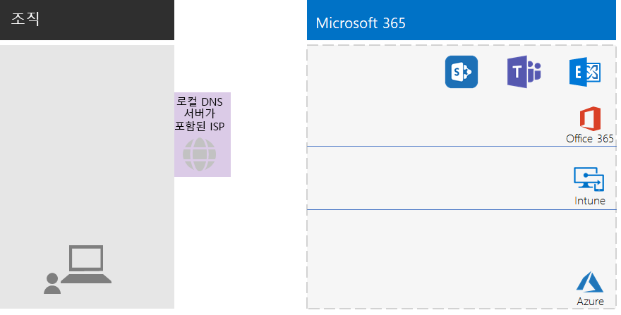
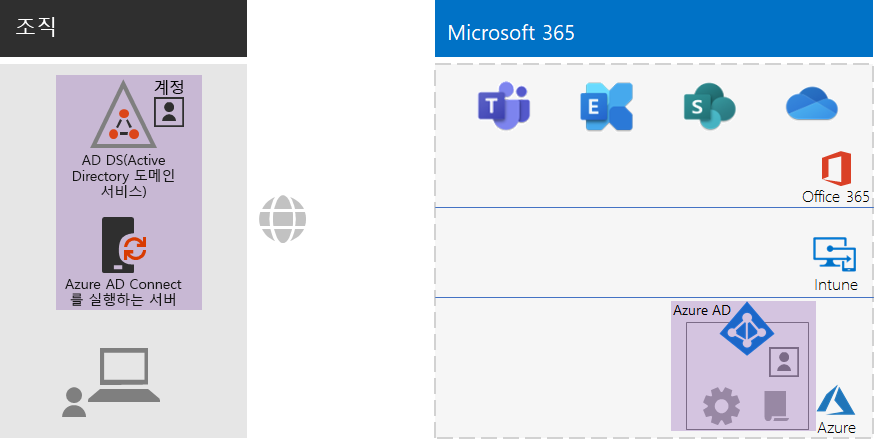
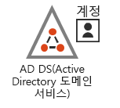
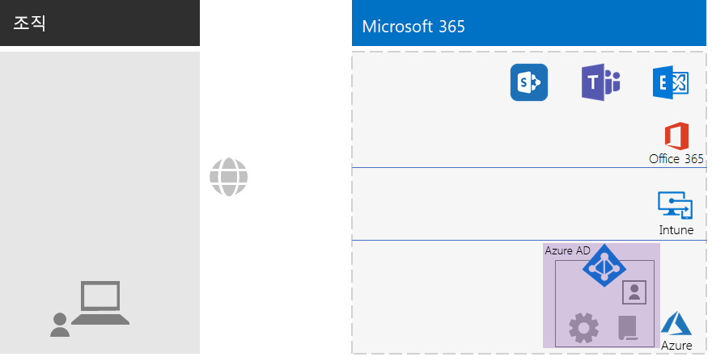
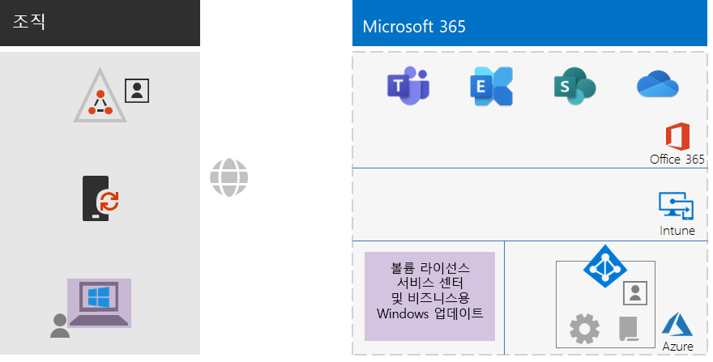
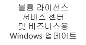
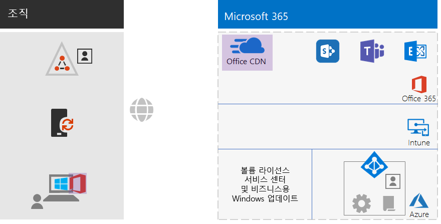
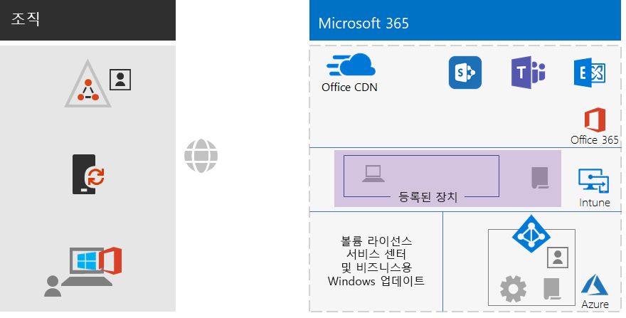
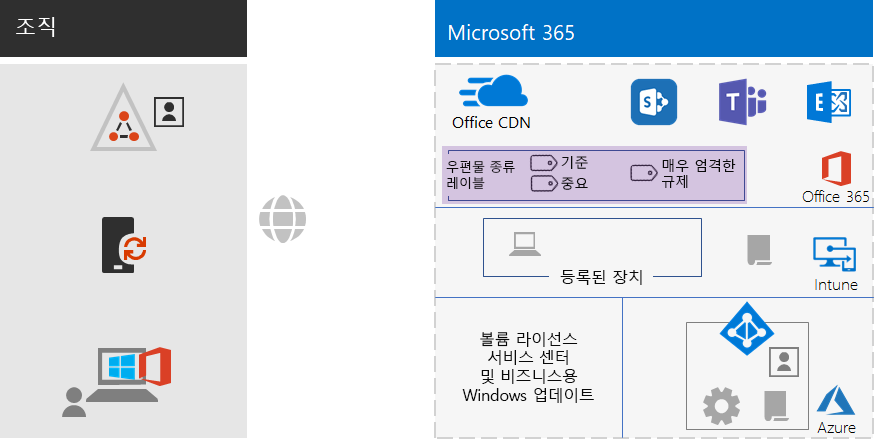
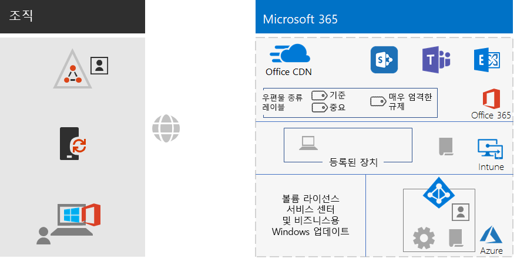

# 엔터프라이즈 이외의 비즈니스용 Microsoft 365 기본 인프라

엔터프라이즈 이외의 조직도 엔터프라이즈용 Microsoft 365를 배포하여 팀워크를 활성화하고 창의성을 열어주는 통합된 보안 인프라의 비즈니스 가치를 실현할 수 있습니다. 일반적으로 엔터프라이즈 기반이 아닌 조직은 다음을 포함합니다.

- 소규모의 온-프레미스 IT 인프라(예: 전자 메일 및 파일 서버와 AD DS(Active Directory Domain Services) 도메인) 또는 인프라가 없습니다.
- 소수의 IT 담당자. 이들 중 대부분은 네트워킹 또는 전자 메일과 같은 특정 기술 또는 워크로드의 전문가가 아닌, IT 제너럴리스트입니다.

엔터프라이즈가 아닌, 중소기업의 경우, Microsoft는 [Microsoft 365 Business](https://www.microsoft.com/microsoft-365/business)를 제공합니다. 그러나 다음과 같은 이유로 인해 엔터프라이즈용 Microsoft 365가 필요할 수 있습니다.

- 조직이 Microsoft 365 Business의 최대 개수인 300개 이상의 Microsoft 365 라이선스가 필요합니다.
- 조직에서 Microsoft 365 Business에서 제공하지 않는 고급 생산성, 음성, 보안 및 분석 기능을 필요로 합니다.

이 문서에서는 엔터프라이즈 이외에 적합한 엔터프라이즈용 Microsoft 365의 기본 인프라를 배포하는 간단한 방법에 대해 설명합니다.

## 먼저, 구독 설정

구독에 적합한 DNS(Domain Name System) 도메인을 설정해야 합니다. Office 365 구독이 이미 있는 경우 이 작업이 완료되어 있습니다. 그렇지 않은 경우 [Office 365에 도메인 추가](https://docs.microsoft.com/office365/admin/setup/add-domain?view=o365-worldwide)의 지침을 따릅니다.

그런 다음, Microsoft 365를 위한 추가 보안을 구성해야 합니다. [향상된 보안 구성](https://docs.microsoft.com/office365/securitycompliance/tenant-wide-setup-for-increased-security)의 지침을 따릅니다.

## 1단계: 네트워킹

엔터프라이즈가 아닌 조직은 일반적으로 각 사무실에 로컬 인터넷 연결이 있으며 프록시 서버, 방화벽 또는 패킷 검사 디바이스를 사용하지 않습니다. 트래픽이 사무실과 온-프레미스 사용자에게 가장 가까운 Microsoft 365 네트워크 위치로 리디렉션되도록 각 사무실에 서비스를 제공하는 ISP(인터넷 서비스 공급자)에는 지리적 로컬 DNS가 있습니다. 더 자세한 내용은 [각 사무실에 대해 로컬 인터넷 연결 구성](networking-dns-resolution-same-location.md)을 참조하세요.

따라서 ISP를 사용하여 각 사무실 위치의 해당 연결이 다음과 같은지를 확인하면 됩니다. 

- 지리적 로컬 DNS 서버를 사용합니다.
- 더 많은 Microsoft 365 클라우드 서비스를 사용하기 시작할 때 현재와 미래의 요구에 적합합니다.

프록시 서버, 방화벽 또는 패킷 검사 장치를 사용 하는 경우 [트래픽 우회 구성](networking-configure-proxies-firewalls.md)을 참조하여 Microsoft 365 서비스의 성능을 최적화하는 방법에 대 한 정보를 확인하세요.

### 지금까지의 구성

1단계 요소가 강조 표시된 시각적 요약입니다. **조직**은 여러 개의 사무실이 있을 수 있고, 각 사무실에는 지리적 로컬 DNS 서버를 사용하는 ISP와의 로컬 인터넷 연결이 있습니다. ISP를 통해 각 사무실의 사용자는 가장 가까운 Microsoft 365 네트워크 위치와 Microsoft 365 구독의 리소스에 연결할 수 있습니다.

## 2단계: ID

조직의 각 직원은 로그인을 해야 하며, 이를 위해 엔터프라이즈용 Microsoft 365의 Azure AD(Azure Active Directory) 테넌트에 사용자 계정이 필요합니다. 그런 다음, 그룹을 사용하여 사용자 계정 및 기타 그룹을 포함하여 통신하거나 권한 있는 리소스(예: SharePoint Online 사이트 또는 팀)에 대한 액세스 권한을 획득합니다. 

### 관리자 계정

강력한 암호와 MFA(다단계 인증)를 요구하여 전역 관리자 사용자 계정을 보호할 수 있습니다. 자세한 내용은 [전역 관리자 계정 보호](identity-create-protect-global-admins.md#protect-global-administrator-accounts)를 참조하세요.

조직에서 높은 수준의 보안을 요구하고 Microsoft 365 E5를 사용하는 경우, Azure AD Privileged Identity Management를 사용하여 적시 관리자 액세스 권한을 활성화합니다. 자세한 내용은 [주문형 전역 관리자 설정](identity-create-protect-global-admins.md#identity-pim)을 참조하세요.

### 그룹에 대한 권장 사항

온-프레미스 AD DS 도메인이 있는 경우, 엔터프라이즈용 Microsoft 365의 그룹을 Azure AD의 그룹으로 계속 사용합니다.

온-프레미스 AD DS 도메인이 없는 경우, 이 보안 수준을 사용하여 Azure AD에서 보안 그룹을 만듭니다.

| 보안 수준 | 설명 | 예제 |
|:-------|:-----|:-----|
| 기준 | 이는 데이터에 액세스하는 장치 및 데이터와 ID를 보호하는 데 최소한의 기본 표준입니다.데    이는 일반적으로 대부분의 사용자가 관리하는 대부분의 조직 데이터입니다. | 영업, 마케팅, 지원, 관리 및 제조와 같은 일선 직원을 위한 그룹입니다. |
| 중요 | 이는 기준 수준을 넘어서 보호해야 하는 데이터의 하위 집합을 위한 추가 보호 기능입니다. 이 그룹에는 모든 사용자가 사용할 수 있도록 설계되지 않은 부서 및 프로젝트에 해당하는 중요한 데이터를 사용하고 만드는 사용자가 포함됩니다. | 미래의 제품을 개발하는 제품 또는 마케팅 팀 |
| 매우 엄격한 규제 | 이는 고도로 분류되고 고려된 지적 재산권이나 영업 비밀, 또는 보안 규정을 준수해야 하는 데이터로서 일반적으로 소량의 데이터에 적용되는 가장 높은 수준의 보호입니다. |  연구, 법률 및 재무 팀이나 고객 또는 파트너 데이터를 저장하거나 사용하는 팀 |
||||

### 하이브리드 ID

온-프레미스 AD DS 도메인이 있는 경우 도메인의 사용자 계정, 그룹 및 연락처 집합을 엔터프라이즈용 Microsoft 365 구독의 Azure AD 테넌트와 동기화해야 합니다. 엔터프라이즈 이외에는 서버에서 PHS(암호 해시 동기화)를 사용하여 Azure AD Connect를 구성합니다. 자세한 내용은 [ID 동기화](identity-add-user-accounts.md#synchronize-identities-for-hybrid-identity)를 참조하세요.

### 조건부 액세스 정책을 사용하여 더욱 안전한 사용자 액세스

Azure AD는 사용자 로그인의 조건을 평가 하고, 조건부 액세스 정책을 사용하여 액세스를 허용하거나 거부하며 로그인을 완료하기 위해 수행해야 하는 추가 작업을 적용할 수 있습니다. 예를 들어, Azure AD에서 보통 또는 위험성이 높은 조건에 따라 로그인이 진행되고 있음을 확인하는 경우 사용자가 MFA를 수행하여 로그인을 완료해야 합니다.

조건부 액세스 정책을 사용자 계정 또는 그룹에 적용합니다. 더욱 간편하게 조건부 액세스 정책을 할당하려면 조직에서 다음 Azure AD 보안 그룹을 만듭니다.

- 기준선

  기준 데이터에 대한 액세스 권한이 있는 사용자의 그룹 또는 사용자 계정을 포함합니다.

- 중요

  중요한 데이터에 대한 액세스 권한이 있는 사용자의 그룹 또는 사용자 계정을 포함합니다.

- 매우 엄격한 규제

  매우 엄격한 규제 데이터에 대한 액세스 권한이 있는 사용자의 그룹 또는 사용자 계정을 포함합니다.

- 조건-액세스-제외

  조건부 액세스 정책에서 사용자를 일시적으로 제외하는 데 사용할 수 있는 빈 그룹입니다.

활성화하거나 만들기 위한 Azure AD 조건부 액세스 정책의 목록은 다음과 같습니다.

| Azure AD 조건부 액세스 정책 | 적용 대상 그룹 |
|:------|:-----|
| 기준 정책: 관리자에게 MFA 필요 | 이 정책은 관리자 역할에 적용되므로 그룹을 지정할 필요가 없습니다. 이 정책을 사용하도록 설정하기만 하면 됩니다. 모든 후속 정책을 만들고 사용하도록 설정해야 합니다. |
| 최신 인증을 지원하지 않는 클라이언트 차단 | 정책 설정에서 "모든 사용자"를 선택합니다. |
| 로그인 위험 수준이 보통 또는 높음인 경우 MFA가 필요(Microsoft 365 E5가 필요) | 기준선 |
| 로그인 위험 수준이 낮음 또는 보통인 경우 MFA가 필요(Microsoft 365 E5가 필요) | 중요 |
| 항상 MFA 필요 | 매우 엄격한 규제 |
| IOS 및 Android 장치에서 승인된 앱 필요 | 기준, 중요, 매우 엄격한 규제 |
| 호환 PC 필요 | 기준 |
| 호환 PC와 iOS 및 Android 장치 필요 | 중요, 매우 엄격한 규제 |
|||

다음은 만들고 활성화할 Azure AD Identity Protection(Microsoft 365 E5가 필요) 사용자 위험 정책입니다.

| Azure AD Identity Protection 사용자 위험 정책 | 적용 대상 그룹 |
|:------|:-----|
| 높은 위험 사용자는 암호를 변경해야 함 | 정책 설정에서 "모든 사용자"를 선택합니다. |
|||

지침을 보려면 [일반적인 ID 및 장치 액세스 정책](identity-access-policies.md)을 참조하세요.

### 더 쉬운 관리를 위한 그룹

다음은 그룹과 라이선싱 관리를 쉽게 할 수 있는 몇 가지 기능입니다.

| 기능 | 사용 |
|:------|:-----|
| 셀프 서비스 그룹 관리 | IT 담당자가 아닌 그룹 소유자로 Azure AD 그룹 관리를 허용합니다. 자세한 내용은 [셀프 서비스 그룹 관리](identity-use-group-management.md#allow-users-to-create-and-manage-their-own-groups)를 참조하세요. |
| 동적 그룹 구성원 자격 | 사용자 계정 속성(예: 부서 또는 국가)에 따라 Azure AD 그룹에서 사용자 계정의 자동 추가 또는 제거를 구성합니다. 자세한 내용은 [동적 그룹 구성원 자격](identity-use-group-management.md#set-up-dynamic-group-membership)을 참조하세요. |
| 그룹 기반 라이선스 | 구성원 자격을 사용하여 사용자 계정에 라이선스를 자동으로 할당하거나 할당 취소합니다. 자세한 [내용은 그룹 기반 라이선스](identity-use-group-management.md#set-up-automatic-licensing) 를 참조 하세요. |
|  |  |

그룹 기반 라이선스를 사용하는 경우 엔터프라이즈용 Microsoft 365 라이선스가 할당된 사용자 계정 이름을 포함하도록 LICENSED라는 그룹을 만듭니다.

### 사용자 액세스 모니터링

Microsoft 365 E5를 사용하는 경우 AD Identity Protection을 사용하여 사용자 로그인 시 자격 증명의 노출을 모니터링하고 분석할 수 있습니다. 자세한 내용은 [자격 증명 해킹으로부터 보호](identity-secure-user-sign-ins.md#protect-against-credential-compromise)를 참조하세요.

### 지금까지의 구성

다음은 기존 및 새로운 요소가 강조 표시된 하이브리드 ID의 ID 단계를 시각적으로 요약한 것입니다.

 
강조 표시된 새 하이브리드 ID 요소에 포함된 내용은 다음을 포함합니다:
 
|||
|:------:|:-----|
|  | 사용자 계정 및 그룹이 포함된 온-프레미스 AD DS 도메인 |
|  | Azure AD Connect를 실행하는 Windows 기반 서버 |
|  | Azure AD에서의 AD DS 사용자 계정 및 그룹의 동기화된 집합. |
|  | 전역 계정 보안 및 그룹과 라이선스를 더 쉽게 관리할 수 있게 해주는 인증을 위한 Azure AD 설정. |
|  | Azure AD 조건부 액세스 정책 |
|||

다음은 새 요소가 강조 표시된 클라우드 전용 ID의 ID 단계를 시각적으로 요약한 것입니다.

 
다음은 강조 표시된 새 클라우드 전용 ID 요소에 포함된 내용입니다:
 
|||
|:------:|:-----|
|  | Azure AD의 사용자 계정 및 그룹 |
|  | 전역 계정 보안 및 그룹과 라이선스를 더 쉽게 관리할 수 있게 해주는 인증을 위한 Azure AD 설정. |
|  | Azure AD 조건부 액세스 정책 |
|||

## 3단계: Windows 10 Enterprise

Windows 10 Enterprise 장치가 엔터프라이즈용 Microsoft 365의 ID 및 보안 인프라에 통합되었는지 확인하기 위한 옵션은 다음과 같습니다.

- 하이브리드(온-프레미스 AD DS 도메인 보유)

  AD DS 도메인에 이미 조인된 각각의 기존 Windows 10 Enterprise 디바이스인 경우, 이를 Azure AD 테넌트에 조인합니다. 자세한 내용은 [하이브리드 Azure Active Directory 조인된 장치를 구성하는 방법](https://go.microsoft.com/fwlink/p/?linkid=872870)을 참조하세요.

  새 Windows 10 Enterprise 장치의 경우, 이를 AD DS 도메인에 조인한 다음, Azure AD 테넌트에 조인합니다.

  각 Windows 10 Enterprise 장치의 경우, 모바일 장치 관리에 등록합니다. 자세한 지침은 [그룹 정책을 사용하여 Windows 10 디바이스 등록](https://go.microsoft.com/fwlink/p/?linkid=872871)을 참조하세요.

- 클라우드 전용(온-프레미스 AD DS 도메인이 없음)

  각 Windows 10 Enterprise 디바이스를 구독의 Azure AD 테넌트에 조인합니다.

  자세한 내용은 [회사 디바이스를 조직의 네트워크에 조인](https://docs.microsoft.com/azure/active-directory/user-help/user-help-join-device-on-network)을 참조하세요.

Windows 10 Enterprise 디바이스를 설치하 고 조인한 후에는 각 디바이스가 비즈니스용 Windows 업데이트 클라우드 서비스에서 업데이트를 자동으로 설치합니다. 일반적으로 엔터프라이즈가 아닌 조직은 Windows 10 업데이트를 배포하고 설치하기 위한 인프라를 설정할 필요가 없습니다.

### 지금까지의 구성

다음은 새 요소가 강조 표시된 Windows 10 Enterprise 단계를 시각적으로 요약한 것입니다.

 
강조 표시된 새 Windows 10 Enterprise 요소에는 다음이 포함됩니다:

|||
|:------:|:-----|
|  | Windows 디바이스에 설치된 Windows 10 Enterprise (예 온-프레미스 노트북) |
|  | Windows 10 Enterprise의 새 설치에 대한 이미지와 최신 업데이트를 제공하는 비즈니스용 Windows Update를 제공하는 VLSC(Volume Licensing Service Center)입니다. |
|||

## 4단계: Office 365 ProPlus

엔터프라이즈용 Microsoft 365에는 Microsoft Office 구독 버전인 Office 365 ProPlus가 포함되어 있습니다. Office 2016 또는 Office 2019와 같이, Office 365 ProPlus는 클라이언트 디바이스에 직접 설치됩니다. 그러나 Office 365 ProPlus는 정기적으로 새로운 기능을 포함하는 업데이트를 받습니다. 자세한 내용은 [엔터프라이즈의 Office 365 ProPlus](https://docs.microsoft.com/deployoffice/about-office-365-proplus-in-the-enterprise)를 참조하세요.

엔터프라이즈가 아닌 조직의 경우, Windows, iOS 및 Android장치를 포함할 수 있는 장치에 Office 365 ProPlus를 수동으로 설치합니다. 새 디바이스를 사용할 수 있도록 준비하는 과정에서 또는 온보딩 프로세스의 일부로 이 작업을 수행할 수 있습니다.

어떤 경우든, 관리자나 사용자가 Office 365 포털 https://portal.office.com에 로그인합니다. **Microsoft Office Home** 탭에서 **Office 설치**를 클릭하고 설치 프로세스를 진행합니다.

Office 365 ProPlus에 대한 기능 업데이트는 프로그램이 설치된 각 컴퓨터에서 매월 다운로드됩니다. 일반적으로 엔터프라이즈가 아닌 조직은 Office 365 ProPlus 업데이트를 배포하기 위한 인프라를 설정할 필요가 없습니다.  

### 지금까지의 구성

다음은 새 요소가 강조 표시된 Office 365 ProPlus 단계를 시각적으로 요약한 것입니다.

 
다음은 강조 표시된 새 Office 365 ProPlus 요소에 포함된 내용입니다:
 
|||
|:------:|:-----|
|  | 장치에 설치된 Office 365 ProPlus (예: 온-프레미스 노트북) |
|  | 장치가 Office 365 ProPlus 업데이트를 위해 액세스하는 Office 365 ProPlus용 Office CDN(콘텐츠 배달 네트워크). |
|||

## 5단계: 모바일 장치 관리

엔터프라이즈용 Microsoft 365에는 모바일 장치 관리를 위한 Microsoft Intune이 포함되어 있습니다. Intune을 사용하면 Windows, iOS, Android 및 macOS 디바이스를 관리하여 데이터를 포함하여 조직의 리소스에 대한 액세스를 보호할 수 있습니다. Intune에서는 Azure AD의 사용자, 그룹 및 컴퓨터 계정을 사용합니다.

Intune은 다음과 같은 두 가지 유형의 모바일 디바이스 관리를 제공합니다.

- MDM(모바일 장치 관리)은 장치가 Intune에 등록된 경우에 제공됩니다. 등록하면 관리되는 장치가 되며 조직에서 사용하는 정책, 규칙 및 설정을 받을 수 있습니다. 이러한 유형의 장치는 보통 조직에서 소유 하며 직원에게 발행됩니다.

- 개인 장치를 사용하는 사용자는 해당 장치를 등록하지 않거나 사용자의 정책과 설정을 사용하여 Intune에서 관리하고 싶지 않을 수 있습니다. 그러나 조직의 리소스와 데이터는 계속 보호해야 합니다. 이 시나리오에서는 MAM(모바일 애플리케이션 관리)를 사용하여 앱을 보호할 수 있습니다.  

Intune 정책은 디바이스 준수 및 앱 보호를 적용할 수 있습니다. 다음은 작성할 Intune 정책의 목록입니다.

| Intune 정책 | 적용 대상 그룹 |
|:------|:-----|
| Windows용 장치 준수 정책 | 기준, 중요, 매우 엄격한 규제 |
| iOS용 장치 준수 정책 | 중요, 매우 엄격한 규제 |
| MacOS용 장치 준수 | 중요, 매우 엄격한 규제 |
| Android 및 Android Enterprise용 장치 준수 정책 | 중요, 매우 엄격한 규제 |
| IOS용 앱 보호 정책 | 기준, 중요, 매우 엄격한 규제 |
| MacOS용 앱 보호 정책 | 기준, 중요, 매우 엄격한 규제 |
| Android 및 Android Enterprise용 앱 보호 정책 | 기준, 중요, 매우 엄격한 규제 |
|||
    
지침을 보려면 [일반적인 ID 및 장치 액세스 정책](identity-access-policies.md)을 참조하세요.

### 지금까지의 구성

다음은 새 요소가 강조 표시된 모바일 장치 관리 단계를 시각적으로 요약한 것입니다.

 
강조 표시된 새 모바일 디바이스 관리 요소에는 다음이 포함됩니다:

|||
|:------:|:-----|
|  | Windows 10 Enterprise를 실행하는 온-프레미스 노트북을 예시로 보여주는 Intune에 등록된 장치. |
|  | 디바이스 준수 및 앱 보호를 위한 Intune 정책 |
|||

## 6단계: 정보 보호

엔터프라이즈용 Microsoft 365에는 다양한 수준의 관리, 보안 및 보호를 적용하여 데이터 분류를 다르게 처리할 수 있는 정보 보호 기능의 호스트가 있습니다. 

예를 들어, 대부분의 직원 간 정규 서신 및 해당 사용자가 작업하는 문서에는 특정한 보호 기준 수준이 필요합니다. 재무 레코드, 고객 데이터 및 지적 재산에는 더 높은 수준의 보호가 필요합니다.

정보 보호 전략의 첫 번째 단계는 보호 수준을 결정하는 것입니다. 대부분의 조직에서는 이미 조건부 액세스 정책에 사용되고 있는 이 수준을 사용합니다.

- 기준선

  수준 1 데이터의 예로는 관리/영업/지원 담당자의 파일 및 일반적인 업무 관련 통신 내용(전자 메일)이 있습니다.

- 중요

  예로는 새로운 제품 또는 서비스 연구 개발 데이터 및 재무/법률 정보가 있습니다.

- 높은 규제

  예로는 고객 및 파트너의 개인 식별 정보와 조직의 전략적 계획 혹은 지적 재산이 있습니다.

이 데이터 보안 수준에 따라, 다음 단계는 다음을 식별하고 구현하는 것입니다.

- 사용자 지정 중요한 정보 유형

  Microsoft 365는 상태 서비스, 신용 카드 번호와 같은 중요한 정보 유형을 다양하게 제공합니다. 제공 목록에서 필요한 항목을 찾을 수 없는 경우 직접 만들 수 있습니다.

- 보존 레이블

  조직 정책과 지역별 규정을 준수하려면 특정 유형의 문서 또는 특정 콘텐츠가 담긴 문서를 보존해야 하는 기간을 지정해야 합니다. 보존 레이블을 사용하여 전자 메일 및 문서에 대해 이를 구현할 수 있습니다. 조직 외부에서의 파일 또는 전자 메일 공유를 제한할 수 있는 데이터 손실 방지 (DLP) 정책과 함께 보존 레이블을 사용할 수도 있습니다.

- 민감도 레이블

  추가 보안 수준이 적용될 수 있도록 전자 메일 또는 문서에 지정된 민감도 레이블을 지정할 수 있습니다. 예를 들어 워터 마크, 암호화 및 사용 권한이 있으며, 이는 해당 전자 메일 또는 문서에 액세스할 수 있는 사용자와 수행할 수 있는 작업을 지정합니다.

자세한 내용은 [Microsoft 365 분류 유형](infoprotect-configure-classification.md#microsoft-365-classification-types)을 참조하세요.

사용 권한에 민감도 레이블을 사용하는 경우, 추가 Office 365 보안 그룹을 만들어 민감도 레이블을 적용한 전자 메일과 문서를 사용하여 누가 무엇을 할 수 있는지를 정의해야 합니다. 

예를 들어, RESEARCH 민감도 레이블을 만들어 연구팀의 전자 메일과 문서를 보호해야 합니다. 다음 사항을 확인합니다.

- 연구원에게 RESEARCH 민감도 레이블로 표시된 문서를 변경할 수 있는 능력이 있어야 합니다.
- 연구원 이외 직원에게 RESEARCH 민감도 레이블로 표시된 문서를 볼 수 있는 능력만 있어야 합니다. 

즉, 두 개의 추가 Office 365 그룹을 만들고 관리해야 합니다.

- RESEARCH-모두
- RESEARCH-보기

이러한 그룹과 해당 사용 권한은 RESEARCH 민감도 레이블에 대한 구성의 일부가 됩니다.

그룹 기반 사용 권한으로 구성된 민감도 레이블의 경우, 이 그룹의 구성원 자격을 관리해야 합니다.

### 지금까지의 구성

다음은 새 요소가 강조 표시된 정보 보호 단계를 시각적으로 요약한 것입니다.

 
강조 표시된 새 정보 보호 요소에는 다음이 포함됩니다:
 
|||
|:------:|:-----|
|  | 사용자가 문서 및 이메일에 적용할 수 있는 세 가지 보안 수준에 대한 민감도 레이블 |
|||

사용자 지정 정보 유형 및 보존 레이블은 표시되지 않습니다.

## 온보딩

엔터프라이즈용 Microsoft 365 인프라를 사용하는 경우 직원을 손쉽게 온보딩할 수 있습니다.

### 새 Windows 10 Enterprise 디바이스

직원에게 새 Windows 10 Enterprise 디바이스를 제공하기 전에:

- 하이브리드 ID의 경우

  AD DS에 디바이스를 조인하고, Azure AD 테넌트에 이 디바이스를 조인한 다음, 디바이스를 Intune에 등록합니다.

- 클라우드 전용 ID의 경우

  Azure AD 테넌트로 장치를 조인

### AD DS 사용자 계정이 있는 기존 직원

하이브리드 ID를 사용하는 경우 조직에 대 한 초기 온보딩의 일부로, AD DS 사용자 계정을 다음 Azure AD 그룹에 추가합니다.

- 사용 허가됨
- 기준, 중요 및 매우 엄격한 규제가 적용되는 Azure AD 그룹의 구성원인 해당 AD DS 또는 Azure AD 보안 그룹
- 민감도 레이블 그룹(필요한 경우)

기존 직원이 해당 작업 그룹, 부서별 및 지역별 AD DS 그룹에 이미 추가되어 있어야 합니다.

Microsoft 365 관리 센터의 여러 Azure AD 그룹에 사용자 계정을 추가할 수 있습니다. 사용자 계정의 속성에서 **그룹 관리 > 구성원 자격 추가**를 클릭합니다.

Powershell을 사용하려면 이 [다운로드 가능한 Excel 통합 문서](https://github.com/MicrosoftDocs/microsoft-365-docs/raw/public/microsoft-365/enterprise/media/deploy-foundation-infrastructure-non-enterprises/Group-License-Mgmt-PowerShell.xlsx)를 참조하여 지정된 사용자 계정 및 선택한 그룹 이름을 기준으로 PowerShell 명령을 생성합니다.

### 클라우드 전용 사용자 계정이 있는 신입 직원

클라우드 전용 ID를 사용하는 경우 조직에 대한 초기 온보딩의 일부로, 새 사용자 계정을 이 그룹에 추가합니다.

- 사용 허가됨
- 기준, 중요 및 매우 엄격한 규제가 적용되는 Azure AD 그룹의 구성원인 해당 Azure AD 보안 그룹
- 작업 그룹, 부서별 및 지역별 그룹
- 민감도 레이블 그룹(필요한 경우)

### Microsoft 365의 초기 로그인

직원들이 Microsoft 365에 처음으로 로그인할 때 다음을 지시합니다.

1. 사용자 계정 자격 증명을 사용하여 디바이스에 로그인합니다.
2. 브라우저를 사용하여 Office 365 포털 https://portal.office.com에 로그인합니다.
3. **Office 365 Home** 탭에서 장치에 Office 365 ProPlus를 설치하려면 **Office 설치**를 클릭합니다.

## 최종 결과

다음은 엔터프라이즈가 아닌 조직을 위한 엔터프라이즈용 Microsoft 365의 기본 인프라 구성의 결과입니다.

### 인프라 결과

엔터프라이즈용 Microsoft 365 인프라를 빌드하고 구성한 후에는 다음의 사항이 있어야 합니다.

- 지리적 로컬 DNS 서버를 사용하는 ISP가 충분하게 공급되는 각 사무소에 로컬 인터넷 연결이 있어야 합니다.
- 하이브리드 ID의 경우, 온-프레미스 AD DS 도메인을 Azure AD 테넌트와 동기화하는 서버에서 Azure AD Connect를 실행합니다.
- 이 그룹:
  - 사용 허가됨
  - 조건-액세스-제외
  - 기준, 중요 및 매우 엄격한 규제가 적용되는 Azure AD 그룹의 구성원이기도 한 해당 AD DS 또는 Azure AD 보안 그룹 
  - 작업 그룹, 부서별 및 지역별 그룹
  - 민감도 레이블 Office 365 그룹(필요한 경우)
- BASELINE, SENSITIVE, and HIGHLY-REGULATED 및 COND-ACCESS-EXCLUDE Azure AD 그룹을 사용하는 Azure AD 로그인 조건부 액세스 정책.
- Intune 응용 프로그램 및 장치 규정 준수 정책.
- 사용자 지정 중요한 정보 유형(필요한 경우).
- 보존 레이블(필요한 경우).
- 민감도 레이블(필요한 경우).

조직에서 AD DS 도메인, Azure AD Connect 서버 및 동기화된 AD DS 사용자 및 그룹을 포함하는 하이브리드 ID를 사용하는 경우 인프라를 시각적으로 요약한 것입니다.

 
조직에서 클라우드 전용 ID를 사용하는 경우 인프라를 시각적으로 요약한 것입니다.
 

### 직원 결과

온보딩 후 직원마다 다음이 있어야 합니다.

- 직원의 장치에서 해당 지역의 Microsoft 365 클라우드 서비스까지의 고성능 온-프레미스 네트워크 경로.
- 다음 그룹 구성원 자격이 있는 사용자 계정:
   - 사용 허가됨
   - 조건부 액세스 정책의 BASELINE, SENSITIVE 및 HIGHLY-REGULATED Azure AD 그룹의 구성원인 해당 AD DS 또는 Azure AD 보안 그룹. 
   - 해당 작업 그룹, 부서별 및 지역별 그룹
   - 민감도 레이블 Office 365 그룹(필요한 경우)
- Windows 10 Enterprise 장치:
   - Azure AD 테넌트(클라우드 전용) 또는 Azure AD 테넌트와 AD DS 도메인(하이브리드) 양쪽에 조인됨.
   - 최신 Windows 10 Enterprise 제품 개선 사항 및 보안 기능 향상으로 자동 업데이트합니다.
   - Office 365 ProPlus가 설치되어 있으며, 최신 Office 제품 개선 사항 및 보안 기능 향상으로 자동 업데이트합니다.
   - Intune에 등록되고 Intune 장치 준수 정책 및 앱 보호 정책이 적용됩니다.

## 다음 단계

[워크로드와 시나리오](deploy-workloads.md)를 배포하여 엔터프라이즈용 Microsoft 365 기본 인프라의 기능과 구성을 활용하세요.
