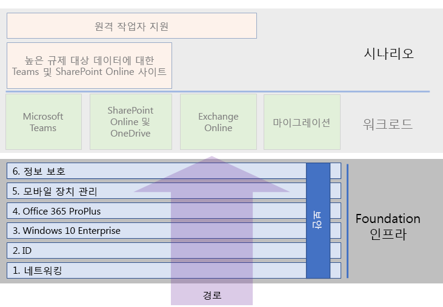

# Microsoft 365 Enterprise 기본 인프라Microsoft 365 Enterprise foundation infrastructure

Microsoft 365 Enterprise의 종단 간 배포를 하는 경우, 먼저 응용프로그램 및 서비스가 보안 환경에서 창의성과 팀워크를 해제할 수 있는 안전한 기초 위에 구축해야합니다.If you're doing the end-to-end deployment of Microsoft 365 Enterprise yourself, you should first build a firm foundation upon which applications and services can unlock creativity and teamwork in a secure environment. 이 기초를 *핵심 배포*라고 합니다.This foundation is sometimes referred to as the core deployment.

배포에 대한 종단 간 경로에 있어서 Microsoft 365 Enterprise 의 기초 인프라 배포와 계획을 위해 이러한 단계들을 사용할 수 있습니다.For a defined end-to-end path for deployment, you can use these phases to plan for and deploy the foundation infrastructure of Microsoft 365 Enterprise:

| | 단계Phase | 결과Results |
|:-------|:-----|:-----|
||[1단계: 네트워킹Phase 1: Networking](networking-infrastructure.md)| Microsoft 365 클라우드 기반 서비스에 액세스 하기 위해 네트워크가 최적화 되어있습니다.Your network is optimized for access to Microsoft 365's cloud-based services. |
||[2단계: IDPhase 2: Identity](identity-infrastructure.md)| 관리자 계정이 보호되고, 사용자 및 그룹은 동기화되며, 사용자 인증은 강력합니다.Your admin accounts are protected, your users and groups are synchronized, and your user authentication is strong. |
||[3단계: Windows 10 EnterprisePhase 3: Windows 10 Enterprise](windows10-infrastructure.md)| 기존 Windows 기반 컴퓨터는 Windows 10 Enterprise를 업그레이드 할 수 있으며 새 장치는 Windows 10 Enterprise와 함께 설치됩니다.Your existing Windows-based computers can upgrade to Windows 10 Enterprise and new devices are installed with Windows 10 Enterprise. |
||[4단계: Office 365 ProPlusPhase 4: Office 365 ProPlus](office365proplus-infrastructure.md)| 기존 사용자의 Microsoft Office는 Office 365 ProPlus으로 업그레이드 할 수 있습니다.Your existing users of Microsoft Office can upgrade to Office 365 ProPlus. |
||[5단계: 모바일 장치 관리Phase 5: Mobile device management](mobility-infrastructure.md)| 장치를 등록하고 관리할 수 있습니다.Your devices can be enrolled and managed. |
||[6단계: 정보 보호Phase 6: Information protection](infoprotect-infrastructure.md)| Office 365 보안 기능이 사용 설정되었으며 레이블과 정책으로 문서 및 전자 메일을 보호할 준비가 되어있습니다.Office 365 security features are enabled and your sensitivity or Azure Information Protection labels are ready to protect documents. |

이 단계들은 가장 기초적인 (네트워킹 및 아이디) 것으로 시작하며 인프라 설정 및 그룹들을 생성합니다.The phases start with the most foundational (networking and identity), and then create layers of infrastructure settings and groups to:

- 장치에 최신의 안전한 Windows 버전을 설치하고 장치를 최신 상태로 유지합니다.Install the most current and secure version of Windows on your devices.
- 장치에 최신 버전의 Microsoft Office를 설치하고 장치를 최신 상태로 유지합니다.Install the most current version of Microsoft Office on your devices and keep it current.
- 조직의 장치 및 앱에 대한 액세스를 관리합니다.Manage your organization's devices and their access to apps.
- 클라우드에서 장치에 대한 정보를 보호하십시오.Protect the information on those devices and in the cloud.

하지만 IT 리소스 및 비즈니스 요구에 맞는 단계 내에서 절차 및 단계를 유연하게 구성하고 시작할 수 있습니다.However, you have the flexibility of configuring and rolling out the phases or steps within phases to fit your IT resources and business needs.

- **더 작고 최신 조직인 경우**, 조직적으로 인프라를 구축하기 위해 필요한 단계를 따르십시오.**If you are a smaller or newer organization**, follow the phases as needed to methodically build out your infrastructure. 비 엔터프라이즈에 대한 배포를 단순화하려면 [여기](deploy-foundation-infrastructure-non-enterprises.md)를 클릭하세요.For a simplified deployment for non-enterprises, click [here](deploy-foundation-infrastructure-non-enterprises.md).

-  **엔터프라이즈 조직인 경우**, 규정된 경로 보다는 IT 인프라 단계를 살펴보십시오. 그리고 조직 전체에서 각 레이어의 요구 사항을 최종적으로 준수하는 가장 효과적인 방법을 결정하십시오.**If you are an enterprise organization**, view the phases as layers of IT infrastructure, rather than a defined path, and determine how to best work toward eventual adherence to the requirements for each layer across your organization.

각 작업 단계의 마지막에 충족해야 할 필수 조건과 고려할 선택 조건을 포함하는 *종료 기준*을 검사해야 합니다.At the end of each phase, you should examine its exit criteria, which include required conditions that you must meet and optional conditions to consider. 각 단계의 종료 기준에서 온 프레미스 및 클라우드 인프라 그리고 종단간 구성 결과가 Microsoft 365 Enterprise 배포의 요구조건을 충족하는지 확인해야합니다.Exit criteria for each phase ensures that your on-premises and cloud infrastructure and resulting end-to-end configuration meet the requirements for a Microsoft 365 Enterprise deployment.

콘텐츠 구성 방식을 알아보려면 이 짧은 비디오를 시청 하십시오.To see how the content is structured, watch this short video.

> [!VIDEO https://www.microsoft.com/videoplayer/embed/RE23VRG]

전체 Microsoft 365 Enterprise 배포 가이드에서 기초 인프라는 다음과 같습니다.Here's the foundation infrastructure in the overall Microsoft 365 Enterprise deployment guide:

## 간략한 개요At-a-glance

[Microsoft 365 Enterprise 기본 인프라 포스터](media/deploy-foundation-infrastructure/Microsoft365EnterpriseFoundInfra.pdf)는 각 단계에서 볼 수 있는 중앙 위치입니다.The [Microsoft 365 Enterprise foundation infrastructure poster](media/deploy-foundation-infrastructure/Microsoft365EnterpriseFoundInfra.pdf) is a central location for you to view, for each phase:

- 관리자 및 사용자를 위한 단계의 전반적인 목표The overall goals of the phase for administrators and users
- 서비스, 기능 및 도구The services, features, and tools
- 계획에 대한 주요 디자인 결정The key design decisions for planning
- 구성 결과The configuration results
- 새 사용자를 온보딩하는 프로세스The process for onboarding a new user
- 모니터링 및 업데이트 방법How to monitor and update

포스터 사본을 다운로드 하려면 [여기](https://github.com/MicrosoftDocs/microsoft-365-docs/raw/public/microsoft-365/enterprise/media/deploy-foundation-infrastructure/Microsoft365EnterpriseFoundInfra.pdf)를 클릭하세요.To download a copy of the poster, click [here](https://github.com/MicrosoftDocs/microsoft-365-docs/raw/public/microsoft-365/enterprise/media/deploy-foundation-infrastructure/Microsoft365EnterpriseFoundInfra.pdf).

## 인프라 구성 대 사용자 공개Infrastructure configuration vs. user rollout

기초 인프라는 사용자가 함께 병행될 때, Microsoft Enterprise 365에서 제공하는 기능 및 보호의 전체 스펙트럼을 활용하게 해주는 구성된 소프트웨어와 서비스입니다.The foundation infrastructure is a set of configured software and services that, when combined together for a user, allow them to take advantage of the entire spectrum of capabilities and protections that Microsoft 365 Enterprise offers. 종단 간 배포 이동의 최종 목적은 이 인프라를 모든 사용자 및 해당 Windows 기반 장치에 적용하도록 하는 것입니다.The ultimate destination of your end-to-end deployment journey is to have this infrastructure apply to all of your users and their Windows-based devices. 

그러나 Microsoft 365 Enterprise 기초 인프라가 사용자를 위한 개별된 소프트웨어 및 서비스의 시작이라는 사실을 알아야 합니다.However, it is important to note that the Microsoft 365 Enterprise foundation infrastructure is independent of the rollout of software and services to your users. ***모든 사용자에게 해당 레이어를 공개하지 않고도 기초 인프라의 레이어를 구성할 수 있습니다.******You can configure the layers of the foundation infrastructure without having to roll out those layers to all of your users.***

조직의 사무실, 지역 또는 부서에서 많은 사용자를 위한 구성 요소 전에 기초 인프라의 요소들을 구성하고 테스트하며 시험 사용하는 것이 가능합니다.Therefore, it is possible to configure, test, and pilot elements of the foundation infrastructure well ahead of the rollout of those elements to the multitude of your users in the offices, regions, or divisions of your organization.

예를 들어, 설정을 생성할 수 있습니다.For example, you create the settings for:

| 단계Phase | 결과Results |
|:-------|:-----|
| IDIdentity | 계정 동기화와 ID를 기반으로 조건부 액세스 정책에 대 한 그룹.Account synchronization and groups for identity-based conditional access policies. |
| Windows 10 EnterpriseWindows 10 Enterprise | 실행 중인 Windows 7 또는 Windows 8.1을 Windows 10 Enterprise로 자동으로 업그레이드 할 수 있는 그룹.Groups to automatically upgrade computers running Windows 7 or Windows 8.1 to Windows 10 Enterprise in place. |
| Office 365 ProPlusOffice 365 ProPlus | 그룹을 자동으로 Office 2010, Office 2013 또는 Office 2016의 사용자를 위해 Office 365 ProPlus를 배포하는 그룹.Groups to automatically deploy Office 365 ProPlus for users with Office 2010, Office 2013, or Office 2016. |
| 모바일 장치 관리Mobile device management | 장치 등록 및 장치 기반 조건부 액세스 정책에 대한 그룹.Groups for device enrollment and device-based conditional access policies. |
| 정보 보호Information protection | Office 365 민감도 레이블을 위한 그룹Groups for Office 365 sensitivity labels. |

사용자를 위한 인프라 구성요소를 공개할 준비가 된 경우.When you are ready to rollout elements of this infrastructure to users, you:

| 단계Phase | 공개 작업Rollout action |
|:-------|:-----|
| IDIdentity | ID 기반의 조건부 액세스 정책에 대한 그룹에 사용자 계정을 추가하십시오.Add user accounts to the groups for identity-based conditional access policies. |
| Windows 10 EnterpriseWindows 10 Enterprise | Windows 7 또는 Windows 8.1 사용자를 위해 Windows 10 Enterprise를 자동으로 배포하는 그룹에 계정을 추가하십시오.Add accounts to the groups to automatically deploy Windows 10 Enterprise in place for users with Windows 7 or Windows 8.1. |
| Office 365 ProPlusOffice 365 ProPlus | Office 2010, Office 2013 또는 Office 2016의 사용자를 위해 Office 365 ProPlus를 자동으로 배포하는 그룹에 사용자 계정을 추가하십시오.Add user accounts to the groups to automatically deploy Office 365 ProPlus for users with Office 2010, Office 2013, or Office 2016. |
| 모바일 장치 관리Mobile device management | 장치 등록 및 장치 기반 조건부 액세스 정책에 대한 그룹에 계정을 추가하십시오.Add accounts to the groups for device enrollment and device-based conditional access policies. |
| 정보 보호Information protection | 민감도 레이블을 위한 그룹에 사용자 계정을 추가합니다.Add user accounts to the groups for Information Protection labels. |

기초 인프라의 단계나 요소를 완료하고 테스트하며 시험 사용한 후, Windows 10 Enterprise 및 Office 365 ProPlus와 같이 설치된 소프트웨어와 디바이스 등록 및 조건부 액세스 정책과 같이 클라우드 기반 서비스 및 보호 기능을 비즈니스 목적 및 IT 리소스에 최적화된 방식으로 사용자에게 공개할 수 있습니다.Once the foundation infrastructure is completed, tested, and piloted, you can roll out installed software, such as Windows 10 Enterprise and Office 365 ProPlus, and cloud-based services and protections, such as device enrollment and conditional access policies, to your users in the manner that best fits your business goals and IT resources.

## 배포 및 프로젝트 관리 전략Deployment and project management strategies

시험 사용자 및 조직의 나머지를 위한 기초 인프라의 각 단계 프로젝트 관리에 접근하는 방법에 대한 몇 가지 아이디어를 제공하기 위해 [배포 전략](deployment-strategies-microsoft-365-enterprise.md)을 참조하십시오.To give you some ideas on how to approach the project management of the different phases of the foundation infrastructure for pilot users and the rest of your organization, see [deployment strategies](deployment-strategies-microsoft-365-enterprise.md).

## 비 엔터프라이즈를 위한 배포Deployment for non-enterprises

조직이 소규모이므로 Microsoft 365 Business가 사용자에게 적합하지 않은 경우 [비 엔터프라이즈를 위한 배포](deploy-foundation-infrastructure-non-enterprises.md)를 참조하여 간소화된 배포 방법을 확인하세요.If your organization is smaller and Microsoft 365 Business is not suitable for you, see [deployment for non-enterprises](deploy-foundation-infrastructure-non-enterprises.md) for a simplified deployment method.

## 다음 단계Next step

| 내 위치Where I am | 가야할 곳Where I need to go |
|:-------|:-----|
| 현재 Office 365, Enterprise 편리성+보안성 (EMS) 또는 Windows 10 Enterprise에 대한 기존 인프라를 가지고 있습니다.I have existing infrastructure for Office 365, Enterprise Mobility + Security (EMS), or Windows 10 Enterprise: | [기존 인프라를 사용하여 배포](deploy-with-existing-infrastructure.md)부터 시작하여 각 단계에 대한 종료 기준을 단계별로 안내합니다.Start with [Deploy with existing infrastructure](deploy-with-existing-infrastructure.md), which steps you through the exit criteria for each phase. |
| 엔터프라이즈로 처음부터 시작합니다.I'm starting from scratch as an enterprise | [1 단계: 네트워킹](networking-infrastructure.md)으로 종단 간 배포의 첫걸음을 시작해보십시오.Begin your end-to-end deployment journey with [Phase 1: Networking](networking-infrastructure.md). |
| 비 엔터프라이즈로 처음부터 시작합니다.I'm starting from scratch as a non-enterprise | [비 엔터프라이즈에 대한 배포](deploy-foundation-infrastructure-non-enterprises.md)로 종단 간 배포의 첫걸음을 시작해보십시오.Begin your end-to-end deployment journey with [Deployment for non-enterprises](deploy-foundation-infrastructure-non-enterprises.md). |
