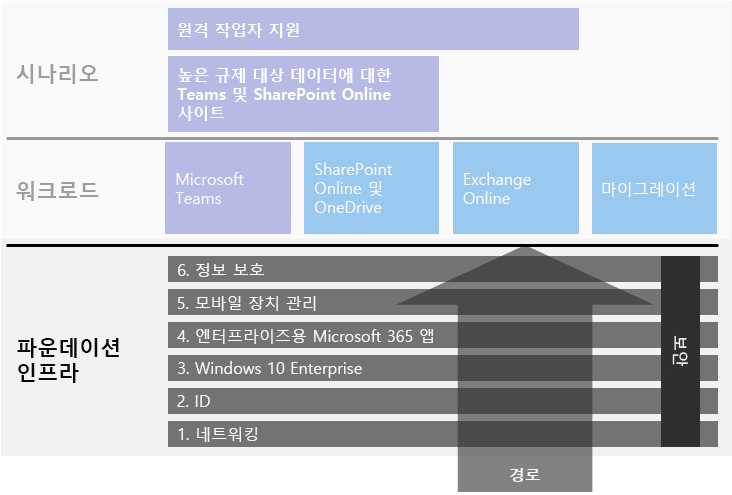
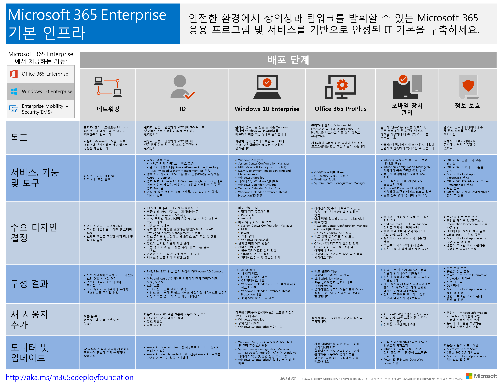

# Microsoft 365 Enterprise 기본 인프라

Microsoft 365 Enterprise의 종단 간 배포를 하는 경우, 먼저 응용프로그램 및 서비스가 보안 환경에서 창의성과 팀워크를 해제할 수 있는 안전한 기초 위에 구축해야합니다. 이 기초를 *핵심 배포*라고 합니다.

배포에 대한 종단 간 경로에 있어서 Microsoft 365 Enterprise의 기본 인프라 배포와 계획을 위해 이러한 단계들을 사용할 수 있습니다.

| | 단계 | 결과 |
|:-------|:-----|:-----|
||[1단계: 네트워킹](networking-infrastructure.md)| Microsoft 365 클라우드 기반 서비스에 액세스 하기 위해 네트워크가 최적화 되어있습니다. |
||[2단계: ID](identity-infrastructure.md)| 관리자 계정이 보호되고, 사용자 및 그룹은 동기화되며, 사용자 인증은 강력합니다. |
||[3단계: Windows 10 Enterprise](windows10-infrastructure.md)| 기존 Windows 기반 컴퓨터는 Windows 10 Enterprise를 업그레이드 할 수 있으며 새 장치는 Windows 10 Enterprise와 함께 설치됩니다. |
||[4단계: Office 365 ProPlus](office365proplus-infrastructure.md)| 기존 사용자의 Microsoft Office는 Office 365 ProPlus으로 업그레이드 할 수 있습니다. |
||[5단계: 모바일 장치 관리](mobility-infrastructure.md)| 장치를 등록하고 관리할 수 있습니다. |
||[6단계: 정보 보호](infoprotect-infrastructure.md)| Office 365 보안 기능이 사용 설정되었으며 레이블과 정책으로 문서 및 전자 메일을 보호할 준비가 되어있습니다. |

이 단계들은 가장 기초적인 (네트워킹 및 아이디) 것으로 시작하며 인프라 설정 및 그룹들을 생성합니다.

- 장치에 최신의 안전한 Windows 버전을 설치하고 장치를 최신 상태로 유지합니다.
- 장치에 최신 버전의 Microsoft Office를 설치하고 장치를 최신 상태로 유지합니다.
- 조직의 장치 및 앱에 대한 액세스를 관리합니다.
- 클라우드에서 장치에 대한 정보를 보호하십시오.

하지만 IT 리소스 및 비즈니스 요구에 맞는 단계 내에서 절차 및 단계를 유연하게 구성하고 시작할 수 있습니다.

- **더 작고 최신 조직인 경우**, 조직적으로 인프라를 구축하기 위해 필요한 단계를 따르십시오. 비 엔터프라이즈에 대한 배포를 단순화하려면 [여기](deploy-foundation-infrastructure-non-enterprises.md)를 클릭하세요.

-  **엔터프라이즈 조직인 경우**, 규정된 경로 보다는 IT 인프라 단계를 살펴보십시오. 그리고 조직 전체에서 각 레이어의 요구 사항을 최종적으로 준수하는 가장 효과적인 방법을 결정하십시오.

각 작업 단계의 마지막에 충족해야 할 필수 조건과 고려할 선택 조건을 포함하는 *종료 기준*을 검사해야 합니다. 각 단계의 종료 기준에서 온-프레미스 및 클라우드 인프라 그리고 종단간 구성 결과가 Microsoft 365 Enterprise 배포의 요구 사항을 충족하는지 확인해야합니다.

콘텐츠 구성 방식을 알아보려면 이 짧은 비디오를 시청 하십시오.

> [!VIDEO https://www.microsoft.com/videoplayer/embed/RE23VRG]

전체 Microsoft 365 Enterprise 배포 가이드에서 기본 인프라는 다음과 같습니다.

## 한눈에 보기

[Microsoft 365 Enterprise 기본 인프라 포스터](../media/deploy-foundation-infrastructure/Microsoft365EnterpriseFoundInfra.pdf)는 각 단계에서 볼 수 있는 중앙 위치입니다.

- 관리자 및 사용자를 위한 단계의 전반적인 목표
- 서비스, 기능 및 도구
- 계획에 대한 주요 디자인 결정
- 구성 결과
- 새 사용자를 온보딩하는 프로세스
- 모니터링 및 업데이트 방법

포스터 사본을 다운로드 하려면 [여기](https://github.com/MicrosoftDocs/microsoft-365-docs/raw/public/microsoft-365/media/deploy-foundation-infrastructure/Microsoft365EnterpriseFoundInfra.pdf)를 클릭하세요.

## 인프라 구성 대 사용자 공개

기본 인프라는 사용자가 함께 병행될 때, Microsoft 365 Enterprise에서 제공하는 기능 및 보호의 전체 스펙트럼을 활용하게 해주는 구성된 소프트웨어와 서비스입니다. 종단 간 배포 이동의 최종 목적은 이 인프라를 모든 사용자 및 해당 Windows 기반 장치에 적용하도록 하는 것입니다. 

그러나 Microsoft 365 Enterprise 기본 인프라가 사용자를 위한 개별된 소프트웨어 및 서비스의 시작이라는 사실을 알아야 합니다. ***모든 사용자에게 해당 레이어를 공개하지 않고도 기초 인프라의 레이어를 구성할 수 있습니다.***

조직의 사무실, 지역 또는 부서에서 많은 사용자를 위한 구성 요소 전에 기초 인프라의 요소들을 구성하고 테스트하며 시험 사용하는 것이 가능합니다.

예를 들어, 설정을 생성할 수 있습니다.

| 단계 | 결과 |
|:-------|:-----|
| ID | 계정 동기화와 ID를 기반으로 조건부 액세스 정책에 대 한 그룹. |
| Windows 10 Enterprise | 실행 중인 Windows 7 또는 Windows 8.1을 Windows 10 Enterprise로 자동으로 업그레이드 할 수 있는 그룹. |
| Office 365 ProPlus | 그룹을 자동으로 Office 2010, Office 2013 또는 Office 2016의 사용자를 위해 Office 365 ProPlus를 배포하는 그룹. |
| 모바일 장치 관리 | 장치 등록 및 장치 기반 조건부 액세스 정책에 대한 그룹. |
| 정보 보호 | Office 365 민감도 레이블을 위한 그룹 |

사용자를 위한 인프라 구성요소를 공개할 준비가 된 경우.

| 단계 | 공개 작업 |
|:-------|:-----|
| ID | ID 기반의 조건부 액세스 정책에 대한 그룹에 사용자 계정을 추가하십시오. |
| Windows 10 Enterprise | Windows 7 또는 Windows 8.1 사용자를 위해 Windows 10 Enterprise를 자동으로 배포하는 그룹에 계정을 추가하십시오. |
| Office 365 ProPlus | Office 2010, Office 2013 또는 Office 2016의 사용자를 위해 Office 365 ProPlus를 자동으로 배포하는 그룹에 사용자 계정을 추가하십시오. |
| 모바일 장치 관리 | 장치 등록 및 장치 기반 조건부 액세스 정책에 대한 그룹에 계정을 추가하십시오. |
| 정보 보호 | 민감도 레이블을 위한 그룹에 사용자 계정을 추가합니다. |

기초 인프라의 단계나 요소를 완료하고 테스트하며 시험 사용한 후, Windows 10 Enterprise 및 Office 365 ProPlus와 같이 설치된 소프트웨어와 디바이스 등록 및 조건부 액세스 정책과 같이 클라우드 기반 서비스 및 보호 기능을 비즈니스 목적 및 IT 리소스에 최적화된 방식으로 사용자에게 공개할 수 있습니다.

## 배포 및 프로젝트 관리 전략

시험 사용자 및 조직의 나머지를 위한 기초 인프라의 각 단계 프로젝트 관리에 접근하는 방법에 대한 몇 가지 아이디어를 제공하기 위해 [배포 전략](deployment-strategies-microsoft-365-enterprise.md)을 참조하십시오.

## 비 엔터프라이즈를 위한 배포

조직이 소규모이므로 Microsoft 365 Business가 사용자에게 적합하지 않은 경우 [비 엔터프라이즈를 위한 배포](deploy-foundation-infrastructure-non-enterprises.md)를 참조하여 간소화된 배포 방법을 확인하세요.

## 다음 단계

| 내 위치 | 가야할 곳 |
|:-------|:-----|
| 현재 Office 365, Enterprise 편리성+보안성 (EMS) 또는 Windows 10 Enterprise에 대한 기존 인프라를 가지고 있습니다. | [기존 인프라를 사용하여 배포](deploy-with-existing-infrastructure.md)부터 시작하여 각 단계에 대한 종료 기준을 단계별로 안내합니다. |
| 엔터프라이즈로 처음부터 시작합니다. | [1 단계: 네트워킹](networking-infrastructure.md)으로 종단 간 배포의 첫걸음을 시작해보십시오. |
| 비 엔터프라이즈로 처음부터 시작합니다. | [비 엔터프라이즈에 대한 배포](deploy-foundation-infrastructure-non-enterprises.md)로 종단 간 배포의 첫걸음을 시작해보십시오. |
