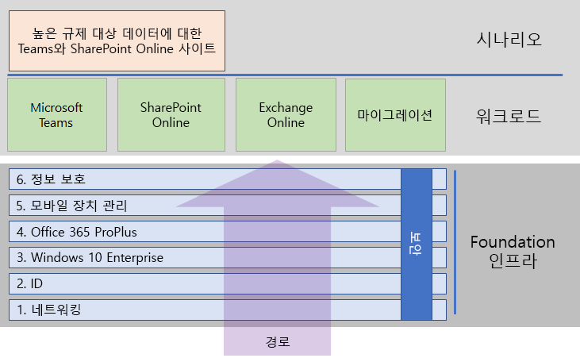

# Microsoft 365 Enterprise 배포

Microsoft 365 Enterprise는 Office 365, EMS(Enterprise Mobility + Security) 및 Windows 10 Enterprise가 통합된 제품으로, 다음과 같은 이점을 제공합니다. 

- 지능형 보안 기능이 있습니다.
- 간소화하도록 통합됩니다.
- 독창성을 촉진합니다.
- 팀 작업에 적합하게 설계되었습니다.

이러한 혜택은 세 가지 제품에 대한 라이선스를 얻는 것만으로 실현되는 것이 아니라, 통합과 최첨단 보안을 포함하는 구체적인 방법으로 라이선스와 그 기능을 배치함으로써 실현됩니다.

Microsoft 365 Enterprise를 배포하는 세 가지 기본 방법이 있습니다.

- Microsoft 365에 대한 FastTrack을 사용하여 Microsoft 엔지니어와 수행하십시오.
- Microsoft 컨설팅 서비스 혹은 [Microsoft 파트너](https://partner.microsoft.com/)의 도움말을 참고하여 수행하십시오.
- Microsoft 365 Enterprise 배포 가이드를 사용하여 수행하십시오.

## Microsoft 365에 대한 FastTrack

FastTrack은 Microsoft 엔지니어들이 제공하는 지속적인 반복 가능한 혜택으로 - 일부 사용료로 이용가능 합니다. - 사용자의 속도에 맞춰 클라우드로 전환할 수 있도록 도와줍니다. 또한 FastTrack은 추가 서비스를 위해 자격을 갖춘 파트너에 대한 액세스를 제공합니다. 현재까지 40,000명 이상의 고객이 활성화된 FastTrack은 조직 전반에서 ROI를 극대화하고, 배포를 가속화 하며, 채택률을 높이는 데 도움이 됩니다. [Microsoft 365에 대한 FastTrack](https://fasttrack.microsoft.com/microsoft365)을 참조하십시오.

FastTrack을 활용하여 Microsoft 365 Enterprise를 배포하려는 경우, FastTrack [Microsoft 365 배포 관리자](https://aka.ms/microsoft365setupguide)를 사용하여 기초 인프라 배포 및 설정 방법에 대한 지침을 사용할 수 있습니다. 이 페이지에 액세스하려면 Office 365 또는 Microsoft 365 테넌트에서 글로벌 관리자로 로그인해야 합니다.

FastTrack [여기](https://fasttrack.microsoft.com/microsoft365)를 사용하여 종단 간 배포의 첫걸음을 시작해보십시오.

## Microsoft 365 Enterprise 배포 가이드

Microsoft 365 Enterprise 배포 가이드에서는 Microsoft 365 Enterprise 제품 및 기능의 필수 구성을 단계별로 안내합니다.

Microsoft 365 Enterprise를 직접 배포하려면 다음을 수행할 수 있습니다.

- 먼저, 간소화된 관리를 위해 기본 제공 보안 및 통합용 필수 [기초 인프라](deploy-foundation-infrastructure.md)를 배포합니다. 그러면 최신 생산성 및 보안 강화와 함께 클라이언트 소프트웨어가 더 쉽게 업데이트되게 해줍니다. 
 
  기초 인프라는 서로를 기반으로 하고 Microsoft 365 Enterprise 워크로드 및 시나리오를 지원하는 환경을 지향하는 일련의 단계로서 구성됩니다. 

  **소규모 혹은 신생 조직인 경우**, 조직적으로 인프라를 구축하기 위해 필요한 단계를 따르십시오.

  그러나 현재 인프라와 통합하고 IT 계획 및 리소스에 적합하며 비즈니스 요구사항을 충족하기 위해 필요한 순서대로 [순차적으로 또는 병렬로](deployment-strategies-microsoft-365-enterprise.md) 이 인프라의 단계를 배포할 수 있습니다. 

  **Enterprise 조직인 경우**, 규정된 경로 보다는 IT 인프라 단계를 살펴보십시오. 그리고 조직 전체에서 각 레이어의 요구 사항을 최종적으로 준수하는 가장 효과적인 방법을 결정하십시오.

- 주요 생산성 [워크로드 및 시나리오](deploy-workloads.md) 인프라 위에 배포하십시오. 이는 조직의 창의성과 팀워크를 열어줍니다..

여기에 기초 인프라와 워크로드 및 시나리오 간의 관계가 나와 있습니다.

워크로드와 시나리오는 기초 인프라의 상단에 걸쳐 운영됩니다. 그러나 생산성 및 협업을 위한 워크로드를 사용하기 위해 모든 기초 인프라 단계가 구축되어야 하는 것은 아닙니다.

[여기](deploy-foundation-infrastructure.md)에서 사용하여 종단 간 배포의 첫걸음을 직접 시작해보십시오.

## 드라이브를 테스트 하십시오.

"*우리가 할 수 있기 전에 배워야 하는 일들을, 우리는 하면서 배운다.*" -아리스토텔레스

Microsoft 365 Enterprise 또는 특정 제품 또는 기능을 처음 접하는 경우, 이해하기 쉬운 가장 좋은 방법 중 하나는 직접 구축하여 작동하는 것을 보는 것입니다.

TLG(Test Lab Guides)를 통해 평가판 또는 유료 구독을 사용하여 단순하지만 대표적인 환경에서 인프라 또는 기능을 구성하는 단계를 더 간단하게 했습니다.

TLG를 사용하면 복잡한 구성, 워크로드 또는 종단 간 시나리오의 개념 증명을 직접 배우고 보여주며 사용자를 지정하거나 구축할 수 있습니다.

자세한 내용은 [Microsoft 365 Enterprise 테스트 랩 가이드](m365-enterprise-test-lab-guides.md)를 참조하세요.

## 다른 사용자는 어떻게 했습니까?

이러한 리소스를 사용하여 다른 사용자가 Microsoft 365 Enterprise를 배포하고 사용하는 방법을 이해하십시오.

### 사용자가 Microsoft 365 Enterprise를 사용하는 방법

사용자가 Microsoft 365 Enterprise를 모든 사람이 창의적이면서 안전하게 작업하도록 지원하는 완전한 지능형 솔루션으로 사용하는 방법을 알아보려면 여기를 참조하십시오.

- 건설
  - [일반 건설 계약업체에서 데이터 검색 보안 솔루션을 통해 Microsoft 365의 공동 작업 기능 활용](https://aka.ms/Transbluecasestudy)
  - [EMCOR 그룹이 클라우드로 전환, Microsoft 365로 지능형 업무 공간 구축](https://aka.ms/EMCOR)
- 컨설팅
  - [ERM은 Microsoft 365를 사용하여 지속 가능한 미래에 기여](https://aka.ms/ERM_CS)
- 에너지 서비스
  - [Schlumberger에서 Microsoft 365로 글로벌 팀 작업을 보다 구체적으로 조정함](https://aka.ms/Schlumberger_)
- 엔지니어링
   - [케이던스를 통해 모바일 공동 작업 도구의 속도 높이기](https://customers.microsoft.com/story/cadence-partner-professional-services-microsoft-365)
- 금융 서비스
  - [TD Bank는 Office 365 및 Windows 10의 지원 기술로 직원 업무를 지원함](https://aka.ms/tdbankgroup)
  - [가족 수당 신고 처리 업체에서 비즈니스 성장에 도움을 주는 통합형 솔루션 선택](https://aka.ms/SOSCaseStudy)
- 게임
  - [Microsoft 365 및 Surface 장치로 게임 회사의 생산성 및 커뮤니케이션 개선](https://aka.ms/PlaynGO)
  - [Razer는 Microsoft 365를 통해 글로벌 게임 산업의 이점을 얻고 승승장구하고 있습니다.](https://aka.ms/Razer_)
- 상태 서비스
  - [Lilly는 내부 및 외부 협력으로 혁신을 가능하게 하고 신약의 출시 기간을 단축하는 데 도움이 되는 작업장을 구상함](https://aka.ms/Eli_CLS)
  - [Healthcare Technology 혁신 담당자는 클라우드에서 당뇨병 예방을 가속화함](https://aka.ms/Soleracasestudy)
  - [Adventist Health System은 Microsoft 365를 사용하여 의료 서비스 전달을 개선함](https://aka.ms/adventisthealth)
  - [Abrona에서는 Microsoft 365를 사용하여 GDPR 규정 준수를 가속화하고 생산성을 높임](https://aka.ms/Abrona)
  - [Centra는 Microsoft 365 지능형 비즈니스 도구로 혁신을 진행하고, 환자 관리를 향상함](https://aka.ms/Centra_Health)
  - [Advocate Aurora Health는 공동 작업을 향상하는 Microsoft 의료 서비스 조정 솔루션을 사용하여 환자의 건강을 도움](https://aka.ms/Advocate_)
- 수입하기
  - [Microsoft 365로 데이터 보안을 강화하고 운영 비용을 절감하는 영업, 마케팅 및 수입 회사](https://aka.ms/MvmtGroupNordic)
- 제조
  - [철강 기업은 클라우드에서 하드웨어 비용을 없애고, IT를 간소화하고, 모바일 생산성을 확보함](https://aka.ms/Steeledalecasestudy)
  - [자수 장비 공급업체가 클라우드 기반 서비스로 비즈니스를 강화하고, 다른 중소기업으로 인지도를 넓힘](https://aka.ms/PriorityLLCCaseStudy)
  - [이 아버지와 아들의 사업은 장애가 있는 직원도 업무 목표에 달성할 수 있다는 것을 보여줌](https://aka.ms/JCSCaseStudy)
  - [이 코코넛 회사는 공동 작업 도구를 현대화하여 이동성, 메트릭 및 생산성이 향상됨](https://aka.ms/SilvermillCS)
  - [Microsoft 365 Business로 미래를 보장하는 유연성과 향상된 보안을 제공받는 일본의 번창하는 혁신 업체](https://aka.ms/DreamFactoryCaseStudy)
- 비영리
  - [비영리 단체에서 클라우드로 이동하여 보안, 이동성 및 공동 작업을 향상하면서 50만 달러를 절약함](https://aka.ms/MOWCaseStudy)
- 전문 서비스
  - [부티크 기업 및 부동산 법률 회사에서 포괄적인 클라우드 기반 플랫폼으로 확장을 지원함](https://aka.ms/Lieserskaffcasestudy)
  - [스포츠 기술 회사에서 바이오 피드백 및 분석을 통해 운동 선수들이 최고 기량에 도달하도록 지원함](https://aka.ms/KMOTIONCasestudy)
  - [디지털 혁신 및 클라우드로 비즈니스 협회가 회원을 덜 잘 관리하도록 지원](https://aka.ms/AIMCS)
- 교통
  - [Qantas에서는 직원들이 Microsoft 365를 통해 최상의 업무를 수행할 수 있도록 지원하여 고객 경험을 향상함](https://aka.ms/Qantas_CS)
  - [Amtrak에서는 Microsoft 365를 사용하여 모바일 엔터프라이즈를 일정보다 먼저 운영함](https://aka.ms/Amtrak_)
  - [Amtrak에서는 Microsoft 365를 사용하여 작업 공간을 현대화하고 노동 비용을 절감하여 포트폴리오 투명도를 향상시킵니다.](https://aka.ms/Amtrak_CS)
  
### Microsoft에서 Microsoft 365 Enterprise를 사용하는 방법

디지털 문화를 정의하는 것이 현대적인 작업장을 조성하려고 노력하는 모든 리더의 우선 과제입니다. Microsoft 365는 이런 종류의 문화적 변화를 지원하도록 설계되어, 리더가 모든 회사 사람들이 창의성과 공동 작업을 발휘하도록 지원할 수 있습니다. Microsoft에서는 기초 인프라를 구축하여 정확하게 이런 종류의 디지털 문화 변화를 일으켰습니다. Microsoft 365 Enterprise를 구현하여 공동 작업 기술(예: Microsoft Teams 및 Exchange Online)을 배포하고 안전한 SharePoint 인트라넷 사이트 간에 온라인으로 중요한 데이터를 공유했습니다.

동시에, 지능형 보안 기능과 제품 통합이 적용되어 관리 요구 사항을 간소화하고 IT 수명 주기에서 총 소유 비용을 최소화합니다. 

CSEO(Core Services Engineering and Operations)(이전의 Microsoft IT)가 안전한 환경에서 창의성을 발휘하고 팀워크를 조성하는 응용 프로그램과 서비스를 지원하기 위한 [토대를 계획하고 배포한](https://www.microsoft.com/en-us/itshowcase/deploying-and-managing-microsoft-365) 방법에 대해 알아봅니다.

> [!Note]
> 이 웹 페이지는 영어로만 제공됩니다.

### Contoso Corporation에서 Microsoft 365 Enterprise를 배포한 방식

Contoso 기업은 프랑스 파리에 본사를 둔 가상의 대표적인 글로벌 제조 대기업입니다. [Contoso가 Microsoft 365 Enterprise를 배포](contoso-case-study.md)하고 네트워킹, ID, Windows 10 Enterprise, Office 365 ProPlus, 모바일 장치 관리, 정보 보호 및 보안에 대한 중요 디자인 결정 및 구현 세부 사항을 진행하는 방식을 참조하십시오. 

## Microsoft 365 Enterprise 배포하기 위한 다음 단계

[FastTrack](https://fasttrack.microsoft.com/microsoft365)을 사용하여 직접 Microsoft 지원과 함께 수행하십시오.

컨설턴트와 함께 하려면, Microsoft Consulting Services 또는 [Microsoft 파트너](https://partner.microsoft.com/)에 문의하세요.

직접 시작하려면 [기초 인프라](deploy-foundation-infrastructure.md)를 참조 하십시오.
