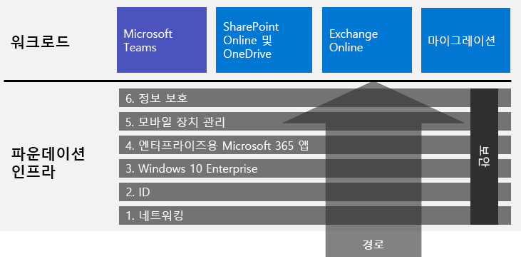

# 엔터프라이즈용 Microsoft 365 배포

엔터프라이즈용 Microsoft 365는 Windows 10 Enterprise를 사용하는 로컬 및 클라우드 기반 생산성 앱 및 서비스의 조합입니다.  

- 지능형 보안 기능이 있습니다.
- 간소화하도록 통합됩니다.
- 독창성을 촉진합니다.
- 팀 작업에 적합하게 설계되었습니다.

최신 보안 서비스 및 기능을 포함하는 통합된 방식으로 인프라 및 생산성 워크로드를 배포하여 이러한 이점을 실현할 수 있습니다.

엔터프라이즈용 Microsoft 365를 배포하는 세 가지 주요 방법이 있습니다.

- [Microsoft 365에 대한 FastTrack](#fasttrack-for-microsoft-365)을 사용하여 Microsoft 엔지니어와 수행하십시오.
- Microsoft 컨설팅 서비스 혹은 [Microsoft 파트너](https://partner.microsoft.com/)의 도움말을 참고하여 수행하십시오.
- [엔터프라이즈용 Microsoft 365 배포 가이드](#microsoft-365-for-enterprise-deployment-guide)를 사용하여 직접 수행하십시오.

## Microsoft 365에 대한 FastTrack

FastTrack은 *구독에 포함되어 비용 없이 제공되는* 지속적이고 반복 사용 가능한 혜택으로, Microsoft 엔지니어가 사용자의 속도에 맞춰 클라우드로 전환할 수 있도록 제공하는 서비스입니다. 또한 FastTrack은 추가 서비스를 위해 자격을 갖춘 파트너에 대한 액세스를 제공합니다. 현재까지 40,000명 이상의 고객이 활성화된 FastTrack은 조직 전반에서 ROI를 극대화하고, 배포를 가속화 하며, 채택률을 높이는 데 도움이 됩니다. [Microsoft 365에 대한 FastTrack](https://fasttrack.microsoft.com/microsoft365)을 참조하십시오.

FastTrack을 활용하여 엔터프라이즈용 Microsoft 365를 배포하려는 경우, FastTrack [Microsoft 365 배포 관리자](https://aka.ms/microsoft365setupguide)를 사용하여 기초 인프라 배포 및 설정 방법에 대한 지침을 사용할 수 있습니다. 이 페이지에 액세스하려면 Office 365 또는 Microsoft 365 테넌트에서 글로벌 관리자로 로그인해야 합니다.

FastTrack [여기](https://fasttrack.microsoft.com/microsoft365)를 사용하여 종단 간 배포의 첫걸음을 시작해보십시오.

## 엔터프라이즈용 Microsoft 365 배포 가이드

엔터프라이즈용 Microsoft 365 배포 가이드에서는 엔터프라이즈용 Microsoft 365 제품 및 기능의 올바르고 필요한 구성을 단계별로 안내합니다.

엔터프라이즈용 Microsoft 365를 직접 배포하려면 다음을 수행할 수 있습니다.

- 먼저, 간소화된 관리를 위해 기본 제공 보안 및 통합용 필수 [기초 인프라](deploy-foundation-infrastructure.md)를 배포합니다. 그러면 최신 생산성 및 보안 강화와 함께 클라이언트 소프트웨어가 더 쉽게 업데이트되게 해줍니다. 
 
  기초 인프라는 서로를 기반으로 하고 엔터프라이즈용 Microsoft 365 워크로드 및 시나리오를 지원하는 환경을 지향하는 일련의 단계로서 구성됩니다. 

  **소규모 혹은 신생 조직인 경우**, 조직적으로 인프라를 구축하기 위해 필요한 단계를 따르십시오.

  그러나 현재 인프라와 통합하고 IT 계획 및 리소스에 적합하며 비즈니스 요구사항을 충족하기 위해 필요한 순서대로 [순차적으로 또는 병렬로](deployment-strategies-microsoft-365-enterprise.md) 이 인프라의 단계를 배포할 수 있습니다. 비 엔터프라이즈에 대한 배포를 단순화하려면 [여기](deploy-foundation-infrastructure-non-enterprises.md)를 클릭하세요.

  **Enterprise 조직인 경우**, 규정된 경로 보다는 IT 인프라 단계를 살펴보십시오. 그리고 조직 전체에서 각 레이어의 요구 사항을 최종적으로 준수하는 가장 효과적인 방법을 결정하십시오.

- 주요 생산성 [워크로드 및 시나리오](deploy-workloads.md) 인프라 위에 배포하십시오. 이는 조직의 창의성과 팀워크를 열어줍니다..

여기에 기초 인프라와 워크로드 및 시나리오 간의 관계가 나와 있습니다.

워크로드와 시나리오는 기초 인프라의 상단에 걸쳐 운영됩니다. 그러나 생산성 및 협업을 위한 워크로드를 사용하기 위해 모든 기초 인프라 단계가 구축되어야 하는 것은 아닙니다.

[여기](deploy-foundation-infrastructure.md)에서 사용하여 종단 간 배포의 첫걸음을 직접 시작해보십시오.

## 드라이브를 테스트 하십시오.

"*우리가 할 수 있기 전에 배워야 하는 일들을, 우리는 하면서 배운다.*" -아리스토텔레스

엔터프라이즈용 Microsoft 365 또는 특정 제품 또는 기능을 처음 접하는 경우, 이해하기 쉬운 가장 좋은 방법 중 하나는 직접 구축하여 작동하는 것을 보는 것입니다.

TLG(Test Lab Guides)는 평가판 또는 유료 구독을 통해 단순하면서도 일반적인 테스트 환경에서 인프라 또는 기능을 구성할 수 있도록 단계별로 안내하므로, 이 서비스를 더 편리하게 이용할 수 있습니다.

TLG를 사용하면 복잡한 구성, 워크로드 또는 종단 간 시나리오의 PoC(개념 증명)를 직접 배우고 보여주며 사용자 지정하거나 빌드할 수 있습니다.

자세한 내용은 [엔터프라이즈용 Microsoft 365 테스트 랩 가이드](m365-enterprise-test-lab-guides.md)를 참조하세요.

## 전체 조직 전환

전체 조직을 엔터프라이즈용 Microsoft 365의 제품 및 서비스로 전환하는 방법을 더 자세히 보려면 [Microsoft 365로 조직의 전환](../media/deploy-microsoft-365-enterprise/transition-org-to-m365.pdf) 포스터를 참조하세요.

이 두 페이지 포스터는 신속하게 기존 인프라를 목록화하고 엔터프라이즈용 Microsoft 365에서 해당 제품이나 서비스로 전환하는 방법에 대한 지침을 제공합니다. Windows와 Office 제품, 디바이스 관리, ID, 정보 및 위협 방지와 같은 기타 인프라 및 보안 요소가 포함됩니다.

[전환 포스터를 다운로드](https://github.com/MicrosoftDocs/microsoft-365-docs/raw/public/microsoft-365/media/deploy-microsoft-365-enterprise/transition-org-to-m365.pdf)하고 편지형, 법률형 또는 타블로이드(11 x 17) 형식으로 인쇄할 수 있습니다.

## 다른 사용자는 어떻게 했습니까?

이들 리소스를 사용하여 다른 사용자가 엔터프라이즈용 Microsoft 365를 배포하고 사용하는 방법을 이해하십시오.

### 고객이 엔터프라이즈용 Microsoft 365를 사용하는 방법

고객 사례 사이트를 사용하여 Microsoft 고객이 엔터프라이즈용 Microsoft 365를 어떻게 사용하는지 확인합니다.

1. [https://customers.microsoft.com/](https://customers.microsoft.com/)로 이동하여 **검색**을 클릭합니다.
2. 왼쪽 창의 **언어**에서 사용자의 언어를 선택합니다.
3. **산업**에서 사용자 조직의 산업을 선택합니다.
4. **제품**에서 **Microsoft 365**를 선택합니다.
5. 고객 사례 연구용 카드를 클릭합니다.

### Microsoft에서 엔터프라이즈용 Microsoft 365를 사용하는 방법

디지털 문화를 정의하는 것이 현대적인 작업장을 조성하려고 노력하는 모든 리더의 우선 과제입니다. Microsoft 365는 이런 종류의 문화적 변화를 지원하도록 설계되어, 리더가 모든 회사 사람들이 창의성과 공동 작업을 발휘하도록 지원할 수 있습니다. Microsoft에서는 기초 인프라를 구축하여 정확하게 이런 종류의 디지털 문화 변화를 일으켰습니다. 엔터프라이즈용 Microsoft 365를 구현하여 공동 작업 기술(예: Microsoft Teams 및 Exchange Online)을 배포하고 안전한 SharePoint 인트라넷 사이트 간에 온라인으로 중요한 데이터를 공유했습니다.

동시에, 지능형 보안 기능과 제품 통합이 적용되어 관리 요구 사항을 간소화하고 IT 수명 주기에서 총 소유 비용을 최소화합니다. 

CSEO(Core Services Engineering and Operations)(이전의 Microsoft IT)가 안전한 환경에서 창의성을 발휘하고 팀워크를 조성하는 응용 프로그램과 서비스를 지원하기 위한 [토대를 계획하고 배포한](https://www.microsoft.com/itshowcase/deploying-and-managing-microsoft-365) 방법에 대해 알아봅니다.

> [!Note]
> 이 웹 페이지는 영어로만 제공됩니다.

### Contoso Corporation에서 엔터프라이즈용 Microsoft 365를 배포한 방법

Contoso 기업은 프랑스 파리에 본사를 둔 가상의 대표적인 글로벌 제조 대기업입니다. [Contoso가 엔터프라이즈용 Microsoft 365를 배포](contoso-case-study.md)하고 네트워킹, ID, Windows 10 Enterprise, Microsoft 365 앱, 모바일 장치 관리, 정보 보호 및 보안에 대한 중요 디자인 결정 및 구현 세부 사항을 처리한 방식을 참조하십시오. 

## 배포 콘텐츠 최신 상태로 유지

콘텐츠의 마지막 변경 내용을 확인하려면 [이 문서](microsoft-365-deploment-guide-changes.md)를 참조하십시오.

## 다음 단계

[FastTrack](https://fasttrack.microsoft.com/microsoft365)을 사용하여 직접 Microsoft 지원과 함께 수행하십시오.

컨설턴트와 함께 하려면, Microsoft Consulting Services 또는 [Microsoft 파트너](https://partner.microsoft.com/)에 문의하세요.

직접 시작하려면 [기초 인프라](deploy-foundation-infrastructure.md)를 참조 하십시오.
