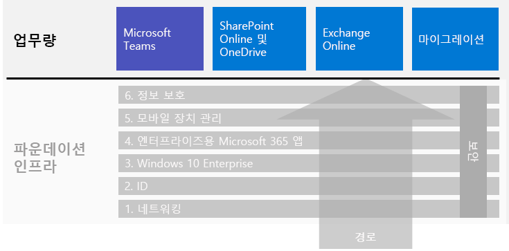

# Microsoft 365 Enterprise 워크로드 및 시나리오

Microsoft 365 Enterprise의 독창성과 팀워크 이점을 얻으려면 기본 인프라에 다음과 같은 워크로드를 배포하세요.

- [Microsoft Teams](teams-workload.md)
- [Exchange Online](exchangeonline-workload.md)
- [SharePoint 및 OneDrive](sharepoint-online-onedrive-workload.md)

전체 조직을 Microsoft Office 클라이언트 제품, 온-프레미스 Office Server 제품 및 Microsoft Windows 기반 장치가 포함된 Microsoft 365 Enterprise로 마이그레이션하는 일반적인 로드맵은 [마이그레이션](migration-microsoft-365-enterprise-workload.md) 문서를 참조하세요.

시나리오는 Microsoft 365 Enterprise에서 제공되는 기능 및 서비스를 통합된 방식으로 사용하여 비즈니스 요구 사항을 해결합니다. 

그러한 요구 사항 중 하나는 직원들이 인트라넷에 직접 연결되어 있지 않을 때 생산적으로 안전하게 작업할 수 있도록 하는 것입니다. 인프라 요소를 배포하고 원거리 사용자의 Teams 및 Exchange Online과 같은 주요 작업부하의 채택을 견인하기 위한 지침은 [원거리 작업자에 권리 부여](empower-people-to-work-remotely.md) 시나리오를 참조하세요.

그러한 요구 중 또 다른 하나는 Microsoft 365에 저장된 규제가 엄격한 데이터의 보호입니다. 규제가 엄격한 데이터에는 다음과 같은 디지털 자산이 포함됩니다.

- 지역 규제를 받는 데이터
- 영업 비밀, 재무 또는 인사 관련 정보와 조직의 전략과 같이 조직에서 가장 중요한 데이터

내부 및 외부 위협에서이 데이터를 보호하려면 다음을 참조하세요:

- [높은 규제 대상 데이터를 위한 Teams](secure-teams-highly-regulated-data-scenario.md)
- [높은 규제 대상 데이터를 위한 SharePoint 사이트](teams-sharepoint-online-sites-highly-regulated-data.md). 

이들 시나리오에서는 가장 중요한 데이터를 안전하게 저장하기 위해 Microsoft Teams 팀을 구성하는 방법을 단계별로 설명합니다.

전체 Microsoft 365 Enterprise 배포 가이드의 워크로드 및 시나리오는 다음과 같습니다.

추가 시나리오는 [Microsoft 365 생산성 라이브러리](https://aka.ms/productivitylibrary)(https://aka.ms/productivitylibrary)를 참조하세요. 

## 기본 인프라 전제 조건

*이상적으로*는 [기초 인프라](deploy-foundation-infrastructure.md)의 모든 단계를 구성한 후에 워크로드 및 시나리오를 배포해야합니다. 이렇게하면 모든 기본 기반 계층이 사용자 및 장치에 통합, 보안 및 최상의 환경을 제공할 수 있습니다.

| 단계 | 결과 |
|:-------|:-----|
| 네트워크 | 네트워크가 Microsoft 365 클라우드 서비스에 최적의 성능을 발휘하도록 업데이트 되었습니다. |
| ID | ID는 사용자 계정에 대한 강력한 인증과 관리자 계정에 대한 보호로 동기화되고 안전하게 보호됩니다. |
| Windows 10 Enterprise | Windows 7 또는 Windows 8.1을 실행하는 컴퓨터는 Windows 10 Enterprise로 업그레이드 할 수 있으며 새 장치는 Windows 10 Enterprise가 설치됩니다. |
| 엔터프라이즈용 Microsoft 365 앱 | Microsoft Office의 기존 사용자는 엔터프라이즈용 Microsoft 365 앱으로 업그레이드할 수 있습니다. |
| 모바일 장치 관리 | 장치를 등록하고 관리할 수 있습니다. |
| 정보 보호 | Office 365 정보 보호 기능이 구성되고 민감도 또는 Azure 정보 보호 레이블은 문서와 이메일을 보호할 준비가 되어있습니다. |

이는 이상적이며 특히 기존 인프라 및 여러 위치를 가진 대규모 조직에서 구성, 테스트 및 파일럿 수행을 계획하는 데 시간이 걸릴 수 있음을 기억하세요. Microsoft 365 Enterprise에서 비즈니스 가치를 더 빨리 얻기 위해 모든 위치에서 이러한 단계를 완료할 필요는 없습니다. 

다음은 몇 가지 일반적인 워크로드를 즉시 배포하는 방법입니다. 

- 기본 인프라의 **ID** 단계가 사용자에게 배포되면 많은 조직이 다음을 배포합니다.
  - [OneDrive](https://docs.microsoft.com/onedrive/plan-onedrive-enterprise)와 함께 사용된 [엔터프라이즈용 Microsoft 365 앱](office365proplus-infrastructure.md) 엔터프라이즈용 Microsoft 365 앱은 최신 인증 보안 및 최신 Microsoft Office 클라이언트 사용자 환경을 제공합니다. 사용자 개인 파일을 OneDrive로 마이그레이션하면 홈 폴더 및 드라이브를 지원해야 할 필요성과 인프라가 줄어 듭니다.
  - [Exchange Online](exchangeonline-workload.md)을 사용하면 사용자가 클라우드 기반 이메일을 시작할 수 있습니다.
- 엄격히 규제된 디지털 자산을 클라우드에 즉시 저장할 필요가 없다면 **정보 보호** 단계 이전에 [Microsoft Teams](teams-workload.md) 및 [SharePoint](sharepoint-online-onedrive-workload.md)를 사용자에게 배포하세요.

비즈니스 요구 사항을 충족시킬 수 있도록 기본 인프라의 전제 조건 단계를 구성하는 데 가장 적합한 방법을 결정해야 합니다.

### 모범 사례

사용자를 모든 워크로드 또는 시나리오에 온 보딩하기 전에 기본 인프라의 **ID** 단계를 배포하고 롤아웃하는 것이 좋습니다.

**ID** 단계에서는 클라우드 전용 또는 온-프레미스 AD DS (Active Directory 도메인 서비스)와 동기화 된 클라우드 기반 ID에 인증 및 액세스를 관리 할 사용자 및 컴퓨터 계정과 그룹이 포함되도록 합니다. 조직의 디지털 자산을 Microsoft 365 클라우드에 배치하기 전에 관리자 계정을 강력하게 보호하고 모든 사용자에 대해 강력한 인증을 수행해야합니다.

전반적인 성능에 있어 기본적이고 매우 중요하지만 Microsoft 365 작업 부하 및 서비스 성능이 시간이 지남에 따라 개선될 것이라는 점을 고려하여 사용자를작업 부하에 적응 시키는 동안 **네트워킹** 단계가 진행될 수 있습니다. 이는 여러 위치가 있고 에지 장치와 인터넷 연결이 혼합된 엔터프라이즈 조직에 특히 해당됩니다.
