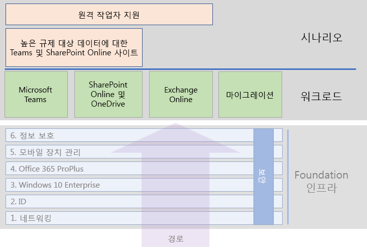

# Microsoft 365 Enterprise 워크로드 및 시나리오Microsoft 365 Enterprise workloads and scenarios

Microsoft 365 Enterprise의 독창성과 팀워크 이점을 얻으려면 기본 인프라에 다음과 같은 워크로드를 배포하세요.To get the creativity and teamwork benefits of Microsoft 365 Enterprise, deploy these workloads over your foundation infrastructure:

- [Microsoft TeamsMicrosoft Teams](teams-workload.md)
- [Exchange OnlineExchange Online](exchangeonline-workload.md)
- [SharePoint OnlineSharePoint Online](sharepoint-online-onedrive-workload.md)

전체 조직을 Microsoft Office 클라이언트 제품, 온 - 프레미스 Office Server 제품 및 Microsoft Windows 기반 장치가 포함 된 Microsoft 365 Enterprise로 마이그레이션하는 일반적인 로드맵은 [마이그레이션](migration-microsoft-365-enterprise-workload.md) 워크로드를 참조하세요.See the [migration](migration-microsoft-365-enterprise-workload.md) workload for a general roadmap to migrate your entire organization to Microsoft 365 Enterprise, which includes Microsoft Office client products, on-premises Office Server products, and Microsoft Windows-based devices.

시나리오는 Microsoft 365 Enterprise에서 제공되는 기능 및 서비스를 통합된 방식으로 사용하여 비즈니스 요구 사항을 해결합니다.Scenarios use features and services from across Microsoft 365 Enterprise in an integrated way to address a business need. 그러한 요구 중 하나는 Microsoft 365에 저장된 규제가 엄격한 데이터의 보호입니다.One such need is to protect highly regulated data stored in Microsoft 365. 규제가 엄격한 데이터에는 다음과 같은 디지털 자산이 포함됩니다.Highly regulated data includes digital assets that are:

- 지역 규제를 받는 데이터Subject to regional regulations.
- 영업 비밀, 재무 또는 인사 관련 정보와 조직의 전략과 같이 조직에서 가장 중요한 데이터The most valuable data for your organization, such as trade secrets, financial or human resources information, and organization strategy.

내부 및 외부 위협으로부터 이 데이터를 보호하려면 [규제가 엄격한 데이터에 대한 Microsoft Teams 및 SharePoint Online 사이트](teams-sharepoint-online-sites-highly-regulated-data.md)의 지침을 참조합니다.To protect this data from internal and external threats, see the instructions in [Microsoft Teams and SharePoint Online sites for highly regulated data](teams-sharepoint-online-sites-highly-regulated-data.md). 이 시나리오에서는 가장 중요한 데이터를 안전하게 저장하기 위해 SharePoint Online 사이트 또는 Microsoft Teams 팀을 구성하는 방법을 단계별로 설명합니다.This scenario steps you through configuring a SharePoint Online site or a Microsoft Teams team to securely store your most valuable data.

전체 Microsoft 365 Enterprise 배포 가이드의 워크로드 및 시나리오는 다음과 같습니다.Here are the workloads and scenarios in the overall Microsoft 365 Enterprise deployment guide:

## 기본 인프라 전제 조건Foundation infrastructure prerequisites

*이상적으로*는 [기초 인프라](deploy-foundation-infrastructure.md)의 모든 단계를 구성한 후에 워크로드 및 시나리오를 배포해야합니다.*Ideally*, you should deploy workloads and scenarios after you have configured all of the phases of the [foundation infrastructure](deploy-foundation-infrastructure.md). 이렇게하면 모든 기본 계층이 사용자 및 장치에 통합, 보안 및 최상의 환경을 제공 할 수 있습니다.This ensures that all of the underlying layers are in place to provide integration, security, and the best experience for your users and their devices.

| 단계Phase | 결과Result |
|:-------|:-----|
| 네트워크Network | 네트워크가 Microsoft 365 클라우드 서비스에 최적의 성능을 발휘하도록 업데이트 되었습니다.Your network is updated for optimum performance to Microsoft 365 cloud services. |
| IDIdentity | ID는 사용자 계정에 대한 강력한 인증과 관리자 계정에 대한 보호로 동기화되고 안전하게 보호됩니다.Identity is synchronized and secured with strong authentication for user accounts and protection for admin accounts. |
| Windows 10 EnterpriseWindows 10 Enterprise | Windows 7 또는 Windows 8.1을 실행하는 컴퓨터는 Windows 10 Enterprise로 업그레이드 할 수 있으며 새 장치는 Windows 10 Enterprise가 설치됩니다.Your computers running Windows 7 or Windows 8.1 can upgrade to Windows 10 Enterprise and new devices are installed with Windows 10 Enterprise. |
| Office 365 ProPlusOffice 365 ProPlus | 기존 Microsoft Office 사용자는 Office 365 ProPlus로 업그레이드 할 수 있습니다.Your existing users of Microsoft Office can upgrade to Office 365 ProPlus. |
| 모바일 장치 관리Mobile device management | 장치를 등록하고 관리할 수 있습니다.Your devices can be enrolled and managed. |
| 정보 보호Information protection | Office 365 보안 기능을 사용할 수 있으며 민감도 또는 Azure 정보 보호 레이블을 통해 문서를 보호할 수 있습니다.Office 365 security features are enabled and your sensitivity or Azure Information Protection labels are ready to protect documents. |

이는 이상적이며 특히 기존 인프라 및 여러 위치를 가진 대규모 조직에서 구성, 테스트 및 파일럿 수행을 계획하는 데 시간이 걸릴 수 있음을 기억하세요.Remember that this is ideal and can take some time to plan for, configure, test, and pilot, especially in large organizations with existing infrastructure and multiple locations. Microsoft 365 Enterprise에서 비즈니스 가치를 더 빨리 얻기 위해 이러한 모든 계층을 모든 위치에 배치 할 필요는 없습니다.Putting all of these layers in place in all locations is not necessary for you to more quickly get business value from Microsoft 365 Enterprise. 

다음은 몇 가지 일반적인 워크로드를 즉시 배포하는 방법입니다.Here are some common workloads to deploy right away: 

- 기본 인프라의 **ID 계층**이 사용자에게 배포되면 많은 조직이 다음을 배포합니다.After the **Identity** layer of the foundation infrastructure is rolled out to users, many organizations deploy:
  - [OneDrive for Business](https://docs.microsoft.com/onedrive/plan-onedrive-enterprise)와 결합 된 [Office 365 ProPlus](office365proplus-infrastructure.md).[Office 365 ProPlus](office365proplus-infrastructure.md) combined with [OneDrive for Business](https://docs.microsoft.com/onedrive/plan-onedrive-enterprise). Office 365 ProPlus는 최신 인증의 보안 및 최신 Microsoft Office 클라이언트의 사용자 환경을 제공합니다.Office 365 ProPlus provides the security of modern authentication and the user experience of the latest Microsoft Office client. 사용자 개인 파일을 OneDrive for Business로 마이그레이션하면 홈 폴더 및 드라이브를 지원해야 할 필요성과 인프라가 줄어 듭니다.The migration of user's personal files to OneDrive for Business reduces infrastructure and the need to support home folders and drives.
  - [Exchange Online](exchangeonline-workload.md)을 사용하면 사용자가 클라우드 기반 이메일을 시작할 수 있습니다.[Exchange Online](exchangeonline-workload.md) so that users can begin using cloud-based email.
- 엄격히 규제된 디지털 자산을 클라우드에 즉시 저장할 필요가 없다면 **정보 보호** 계층 이전에 [Microsoft Teams](teams-workload.md) 및 [SharePoint Online](sharepoint-online-onedrive-workload.md)을 사용자에게 배포하세요.If you don't have an immediate need for storing highly regulated digital assets in the cloud, deploy [Microsoft Teams](teams-workload.md) and [SharePoint Online](sharepoint-online-onedrive-workload.md) for your users prior to the **Information protection** layer.

비즈니스 요구 사항을 가장 잘 충족시킬 수 있도록 기본 인프라의 전제 조건 단계를 구성하는 데 가장 적합한 방법을 결정해야 합니다.You must decide on how to best order and deploy the configuration of prerequisite phases of foundation infrastructure to best meet your business needs.

### 모범 사례Best practice

사용자를 모든 워크로드 또는 시나리오에 온 보딩하기 전에 기본 인프라의 **ID** 단계를 배포하고 롤아웃하는 것이 좋습니다.We highly recommend that you deploy and roll out the **Identity** phase of the foundation infrastructure prior to onboarding your users to any workloads or scenarios.

**ID** 단계에서는 클라우드 전용 또는 온-프레미스 AD DS (Active Directory 도메인 서비스)와 동기화 된 클라우드 기반 ID에 인증 및 액세스를 관리 할 사용자 및 컴퓨터 계정과 그룹이 포함되도록 합니다.The **Identity** phase ensures that your cloud-based identity, whether cloud-only or synchronized with your on-premises Active Directory Domain Services (AD DS), contains the user and computer accounts and groups to manage authentication and access. 조직의 디지털 자산을 Microsoft 365 클라우드에 배치하기 전에 관리자 계정을 강력하게 보호하고 모든 사용자에 대해 강력한 인증을 수행해야합니다.Strong authentication for all your users along with strong protection of admin accounts is required before placing your organization's digital assets in the Microsoft 365 cloud.

전반적인 성능에 있어 기본적이고 매우 중요하지만 Microsoft 365 응용 프로그램 및 서비스 성능이 시간이 지남에 따라 개선 될 것이라는 점을 고려하여 사용자를 워크로드에 온보딩하는 동안 네트워크의 **네트워킹** 단계가 진행될 수 있습니다.Although foundational and very important to overall performance, the rollout of the **Networking** phase on your network can be in progress while onboarding your users to workloads, with the understanding that Microsoft 365 application and service performance will improve over time.

이는 여러 위치가 있고 에지 장치와 인터넷 연결이 혼합된 엔터프라이즈 조직에 특히 해당됩니다.This is especially true for enterprise organizations with multiple locations and a mixture of edge devices and Internet connections.
