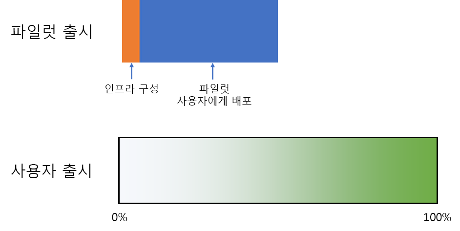
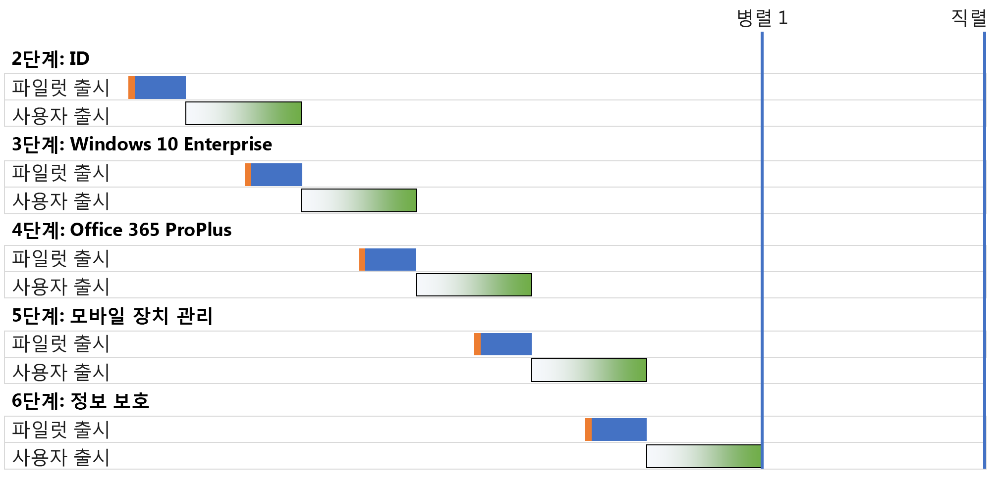
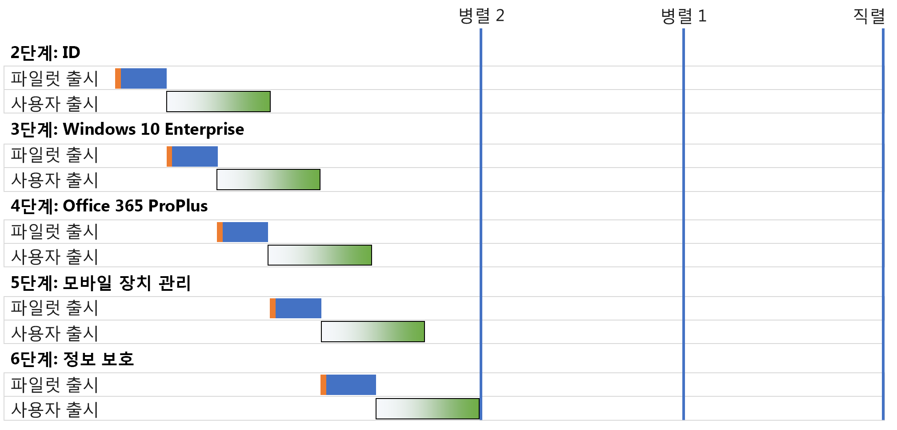
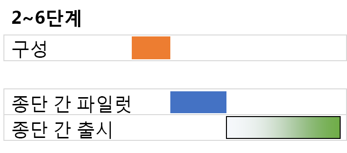

# 엔터프라이즈용 Microsoft 365 기본 인프라 배포 전략Microsoft 365 for enterprise foundation infrastructure deployment strategies

엔터프라이즈용 Microsoft 365 [기본 인프라](deploy-foundation-infrastructure.md)의 단계를 배포하고 사용자에게 그 기능과 소프트웨어, 서비스를 선보이는 방법에는 몇 가지가 있습니다. 조직과 기존 인프라의 규모에 따라 복잡한 대규모 작업이 될 수 있는 이 프로젝트 관리를 시작할 때 다음과 같은 배포 전략을 고려해 보세요.There are many ways you can deploy the phases of the [foundation infrastructure](deploy-foundation-infrastructure.md) of Microsoft 365 for enterprise and roll out its capabilities, software, and services to your users. To get you started on the project management of this undertaking, which can be large and complex depending on the size of your organization and its existing infrastructure, consider the following deployment strategies:

- 직렬 배포Serial deployment
- 사용자 롤아웃이 중첩되지 않는 병렬 배포Parallel deployment with non-overlapping user rollout
- 사용자 롤아웃이 중첩되는 병렬 배포Parallel deployment with overlapping user rollout
- 인프라 선행 구현 및 엔드투엔드 구성의 롤아웃Up-front infrastructure and rollout of the end-to-end configuration

전체 프로젝트를 관리하고 엔터프라이즈용 Microsoft 365의 비즈니스 이점을 빠르게 실현하기 위한 다음과 같은 전략을 참고하시기 바랍니다.Use these strategies for ideas on how to manage the overall project and more quickly realize the business benefits of Microsoft 365 for enterprise.

>[!Note]
>이 문서는 배포 전략을 일관된 방식으로 기술하기 위해 몇 가지 가정을 바탕으로 간소화하여 설명하고 있습니다. 여기에서 설명하는 배포 전략은 일반화된 방식이며, 구체적인 기간을 시사하거나 모든 조직과 상황에 적용될 수 있음을 암시하지 않습니다.This article contains assumptions and simplifications for a consistent way to describe the deployment strategies. These deployment strategies are generalized and are not meant to imply any specific timeframes, nor are they meant to apply to all organizations and situations.
>

## 일반적인 기업 조직에서 볼 수 있는 IT 프로젝트 관리의 요소Elements of IT project management for typical enterprise organizations

IT 인프라에는 백엔드 서비스, 그리고 최종 사용자를 대상으로 신규 또는 향상된 기능 및 설치된 소프트웨어의 롤아웃이 모두 포함됩니다. IT 부서에서는 일반적으로 체계적인 방식으로 IT 인프라의 여러 요소를 배포합니다. IT 인프라 요소를 성공적으로 배포하기 위한 한 가지 방법은 다음으로 구성됩니다.IT infrastructure includes both backend services and the rollout of new or improved capabilities or installed software to end users. IT departments typically deploy elements of an IT infrastructure in a methodical way. One approach to the successful deployment of an element of IT infrastructure consists of:

- 파일럿 롤아웃A pilot rollout 

  초기 인프라 구성을 파일럿 사용자에게 롤아웃하고, 테스트를 진행하고, 인프라 구성을 수정하는 과정이 포함됩니다.This includes initial infrastructure configuration and rollout to a pilot set of users, testing, and subsequent modifications to the infrastructure configuration.

- 사용자 롤아웃A user rollout

  지역, 부서, 그룹 등을 기준으로 구성 또는 소프트웨어를 조직의 나머지 사용자에게 체계적으로 롤아웃하는 과정입니다.This includes the rollout to the rest of your organization based on regions, departments, groups, or other types of systematic propagation of configuration or software.

파일럿 롤아웃에 포함된 사용자는 사용자 롤아웃에 포함된 사용자와 같지 않습니다.The set of users in the pilot rollout are not the same as those in the user rollout.

이 문서에서는 아래와 같은 그림을 사용하여 각각의 롤아웃을 표현합니다.This article uses the following graphics to depict these definitions: 

 

사용자 롤아웃 그래픽의 음영은 그룹, 부서, 지역과 같은 체계적인 기준을 바탕으로 0%부터 100%까지 조직의 백분율을 나타냅니다.The shading for the user rollout graphic indicates the percentage across your organization from 0% to 100% using a structured or methodical approach such as groups, departments, or regions.

## 배포 전략Deployment strategies

지금부터 다음과 같은 배포 전략을 설명합니다.Consider the following deployment strategies:

- 직렬 배포Serial deployment
- 사용자 롤아웃이 중첩되지 않는 병렬 배포Parallel deployment with non-overlapping user rollout
- 사용자 롤아웃이 중첩되는 병렬 배포Parallel deployment with overlapping user rollout
- 인프라 선행 구현 및 엔드투엔드 구성의 롤아웃Up-front infrastructure and rollout of the end-to-end configuration

### 직렬 배포Serial deployment

직렬 배포에서는 특정 단계가 모든 사용자에게 100% 배포된 후에 다음 단계로 넘어갑니다. 직렬 배포를 사용하는 이유는 다음과 같습니다.With a serial deployment, you completely roll out a phase, allowing the phase to reach 100% completion of deployment to all of your users, before moving on to the next one. Here are some of the reasons why you might deploy this way:

- 위험 완화Risk mitigation
- 한정된 리소스Resourcing constraints
- IT 부서 자금 주기IT department funding cycles
- IT 기술 종속성IT technology dependencies
- 비즈니스 변경 관리 및 최종 사용자의 저항Business change management and end-user resistance

다음은 엔터프라이즈용 Microsoft 365 기본 인프라를 단순화한 직렬 배포의 2~6단계를 보여주는 Gantt 차트입니다.This Gantt chart shows a simplified serial deployment of phases 2-6 of the foundation infrastructure for Microsoft 365 for enterprise.

 
 
설명과 예시의 간소화를 위해 각 단계와 단계 내의 배포 세그먼트는 모두 동일한 시간 안에 완료된다고 가정했습니다.To simplify the discussion and example, each phase and deployment segment within each phase are assumed to take the same amount of time.

>[!Note]
>1단계: 엔터프라이즈용 Microsoft 365 기본 인프라의 네트워킹은 IT 부서만 개입하는 단계입니다. 사용자는 Microsoft 클라우드 리소스로의 최적화된 연결이라는 이점을 누리긴 하나, 연결을 본격적으로 사용하지는 않습니다.Phase 1: Networking of the Microsoft 365 for enterprise Foundation Infrastructure is an IT department-only phase. Users reap the benefits of optimized connectivity to Microsoft’s cloud resources but are not imposed upon to achieve it.
>

다음은 간단한 파일럿 사용자 환경을 보여주는 예제입니다.Here’s a simplified pilot user experience as an example:

- 12월부터 MFA를 위해 내 스마트폰을 사용해야 합니다. (ID)In December, I need to use my smart phone for MFA. (Identity)
- 3월에는 내 Windows 8.1 데스크톱에 Windows 10 Enterprise를 설치하게 됩니다. (Windows 10 Enterprise)In March, I get Windows 10 Enterprise installed on my Windows 8.1 desktop. (Windows 10 Enterprise)
- 6월에는 Office 2013을 대체하는 Office 365 ProPlus가 설치됩니다. (Office 365 ProPlus)In June, I get Office 365 ProPlus installed, replacing Office 2013. (Office 365 ProPlus)
- 9월에는 장치 등록과 앱 및 장치 정책이 적용됩니다.In September, I get device enrollment and app and device policies applied. (모바일 장치 관리)(Mobile device management)
- 12월에는 Azure Information Protection 클라이언트가 설치되고, 문서에 레이블을 적용하는 방법을 교육받습니다. (정보 보호)In December, I get the Azure Information Protection client installed and get trained on how to apply labels to documents. (Information protection)

각 파일럿 롤아웃 단계는 90일 간격으로 진행됩니다.The result is a 90-day cadence between successive pilot rollouts.

다음은 간단한 최종 사용자 환경을 보여주는 예제입니다.Here’s a simplified end-user experience as an example:

- 1월부터 MFA를 위해 내 스마트폰을 사용해야 합니다. (ID)In January, I need to use my smart phone for MFA. (Identity)
- 4월에는 내 Windows 8.1 데스크톱에 Windows 10 Enterprise를 설치하게 됩니다. (Windows 10 Enterprise)In April, I get Windows 10 Enterprise installed on my Windows 8.1 desktop. (Windows 10 Enterprise)
- 7월에는 Office 2013을 대체하는 Office 365 ProPlus가 설치됩니다. (Office 365 ProPlus)In July, I get Office 365 ProPlus installed, replacing Office 2013. (Office 365 ProPlus)
- 10월에는 장치 등록과 앱 및 장치 정책이 적용됩니다.In October, I get device enrollment and app and device policies applied. (모바일 장치 관리)(Mobile device management)
- 다음 해 1월에는 Azure Information Protection 클라이언트가 설치되고, 문서에 레이블을 적용하는 방법을 교육받습니다. (정보 보호)In January of the following year, I get the Azure Information Protection client installed and get trained on how to apply labels to documents. (Information protection)

각 최종 사용자 롤아웃 단계는 90일 간격으로 진행됩니다.The result is a 90-day cadence between successive user rollouts.

엔터프라이즈용 Microsoft 365 기본 인프라가 완전히 배포되기까지 시간이 오래 걸릴 수 있다는 것이 이 직렬 배포 전략의 단점입니다.The disadvantage to this deployment strategy is that it can take a long time to fully deploy the Microsoft 365 for enterprise foundation infrastructure.

### 사용자 롤아웃이 중첩되지 않는 병렬 배포 (병렬 1)Parallel deployment with non-overlapping user rollout (Parallel 1)

이 배포 전략에서는 현 단계의 사용자 롤아웃 중 마지막 부분이 진행되는 시점에 다음 단계의 파일럿 롤아웃을 시작합니다. 다음은 배포의 2~6단계에서 직전 단계의 사용자 롤아웃이 마무리되고 있는 시점에 파일럿 롤아웃이 시작되는 것을 보여주는 차트입니다.For this deployment strategy, you start the pilot rollout of the next phase during the last part of the user rollout of the current phase. Here is the deployment of phases 2-6 when the pilot rollout occurs as the user rollout of the previous phase is wrapping up.

 
 
이 배포 전략에서는 조직 전체에서 사용자 롤아웃의 현 단계가 완료된 후에 차기 단계가 시작됩니다. 파일럿 롤아웃에 포함되지 않은 사용자는 동시에 여러 개의 단계를 진행하지 않는 반면, 파일럿 롤아웃은 사용자 롤아웃과 병렬로 진행됩니다.The end result is that user rollout for the current phase completes across your organization before the next one starts. Users that are not in pilot rollouts are not dealing with the rollouts of multiple phases at the same time, but pilot rollouts are done in parallel with user rollouts.

다음은 간단한 파일럿 사용자 환경을 보여주는 예제입니다.Here’s a simplified pilot user experience as an example:

- 12월부터 MFA를 위해 내 스마트폰을 사용해야 합니다. (ID)In December, I need to use my smart phone for MFA. (Identity)
- 2월에는 내 Windows 8.1 데스크톱에 Windows 10 Enterprise를 설치하게 됩니다. (Windows 10 Enterprise)In February, I get Windows 10 Enterprise installed on my Windows 8.1 desktop. (Windows 10 Enterprise)
- 4월에는 Office 2013을 대체하는 Office 365 ProPlus가 설치됩니다. (Office 365 ProPlus)In April, I get Office 365 ProPlus installed, replacing Office 2013. (Office 365 ProPlus)
- 6월에는 장치 등록과 앱 및 장치 정책이 적용됩니다.In June, I get device enrollment and app and device policies applied. (모바일 장치 관리)(Mobile device management)
- 8월에는 Azure Information Protection 클라이언트가 설치되고, 문서에 레이블을 적용하는 방법을 교육받습니다. (정보 보호)In August, I get the Azure Information Protection client installed and get trained on how to apply labels to documents. (Information protection)

각 파일럿 롤아웃 단계는 60일 간격으로 진행됩니다.The result is a 60-day cadence between successive pilot rollouts.

다음은 간단한 최종 사용자 환경을 보여주는 예제입니다.Here’s a simplified end-user experience as an example:

- 1월부터 MFA를 위해 내 스마트폰을 사용해야 합니다. (ID)In January, I need to use my smart phone for MFA. (Identity)
- 3월에는 내 Windows 8.1 데스크톱에 Windows 10 Enterprise를 설치하게 됩니다. (Windows 10 Enterprise)In March, I get Windows 10 Enterprise installed on my Windows 8.1 desktop. (Windows 10 Enterprise)
- 5월에는 Office 2013을 대체하는 Office 365 ProPlus가 설치됩니다. (Office 365 ProPlus)In May, I get Office 365 ProPlus installed, replacing Office 2013. (Office 365 ProPlus)
- 7월에는 장치 등록과 앱 및 장치 정책이 적용됩니다.In July, I get device enrollment and app and device policies applied. (모바일 장치 관리)(Mobile device management)
- 9월에는 Azure Information Protection 클라이언트가 설치되고, 문서에 레이블을 적용하는 방법을 교육받습니다. (정보 보호)In September, I get the Azure Information Protection client installed and get trained on how to apply labels to documents. (Information protection)

각 최종 사용자 롤아웃 단계는 60일 간격으로 진행됩니다.The result is a 60-day cadence between successive user rollouts.

IT 부서와 사용자들이 동시에 여러 건의 롤아웃을 진행할 필요가 없으면서도 엔터프라이즈용 Microsoft 365 기본 인프라가 완전히 배포되기까지 시간이 비교적 짧게 걸린다는 것이 이 배포 전략의 장점입니다.The advantage to this deployment strategy is that it can take less time to fully deploy the Microsoft 365 for enterprise foundation infrastructure, without having your IT department and users deal with multiple rollouts the same time.

### 사용자 롤아웃이 중첩되는 병렬 배포(병렬 2)Parallel deployment with overlapping user rollout (Parallel 2)

이 배포 전략에서는 차기 단계의 파일럿 롤아웃과 사용자 롤아웃이 다음과 같이 시작됩니다.For this deployment strategy, you start the:

- 현 단계의 사용자 롤아웃 중 마지막 부분이 진행되는 시점에 차기 단계의 파일럿 롤아웃이 시작됩니다.Pilot rollout of the next phase during the last part of the user rollout of the current phase.
- 사용자들이 여러 단계의 롤아웃에 동시에 참여하지 않는 방식으로 현 단계의 사용자 롤아웃이 진행되는 시점에 차기 단계의 사용자 롤아웃이 시작됩니다.User rollout of the next phase during the user rollout of the current phase in such a way that no user is dealing with the rollouts of multiple phases at the same time. 여기에서는 지역, 부서 또는 기타 그룹화를 사용하여 동일한 방식으로 기본 인프라의 각 단계를 배포한다고 가정합니다.This assumes that you are rolling out each phase of the foundation infrastructure in the same way, using regions, departments, or other groupings.

다음은 세 가지 배포 전략을 간단하게 비교한 차트입니다.Here is a simplified comparison between the different deployment strategies.

 

이 배포 전략의 최종 결과는 다음과 같습니다.The end result is that:

- 파일럿 롤아웃은 중단 없이 현 단계에서 차기 단계로 넘어갑니다.Pilot rollouts go from one phase to the next without a pause.
- 직전 단계의 사용자 롤아웃이 완료되기 전에 차기 단계의 사용자 롤아웃이 시작되나, 각 사용자는 한 번에 하나의 단계에만 참여합니다.The user rollout for a phase begins before the completion of the user rollout of the previous phase, but no individual user is rolling out more than one phase at a time.

다음은 간단한 파일럿 사용자 환경을 보여주는 예제입니다.Here’s a simplified pilot user experience as an example:

- 12월부터 MFA를 위해 내 스마트폰을 사용해야 합니다. (ID)In December, I need to use my smart phone for MFA. (Identity)
- 1월에는 내 Windows 8.1 데스크톱에 Windows 10 Enterprise를 설치하게 됩니다. (Windows 10 Enterprise)In January, I get Windows 10 Enterprise installed on my Windows 8.1 desktop. (Windows 10 Enterprise)
- 2월에는 Office 2013을 대체하는 Office 365 ProPlus가 설치됩니다. (Office 365 ProPlus)In February, I get Office 365 ProPlus installed, replacing Office 2013. (Office 365 ProPlus)
- 3월에는 장치 등록과 앱 및 장치 정책이 적용됩니다.In March, I get device enrollment and app and device policies applied. (모바일 장치 관리)(Mobile device management)
- 4월에는 Azure Information Protection 클라이언트가 설치되고, 문서에 레이블을 적용하는 방법을 교육받습니다. (정보 보호)In April, I get the Azure Information Protection client installed and get trained on how to apply labels to documents. (Information protection)

각 파일럿 롤아웃 단계는 30일 간격으로 진행됩니다.The result is a 30-day cadence between successive pilot rollouts.

다음은 간단한 최종 사용자 환경을 보여주는 예제입니다.Here’s a simplified end-user experience as an example:

- 1월부터 MFA를 위해 내 스마트폰을 사용해야 합니다. (ID)In January, I need to use my smart phone for MFA. (Identity)
- 2월에는 내 Windows 8.1 데스크톱에 Windows 10 Enterprise를 설치하게 됩니다. (Windows 10 Enterprise)In February, I get Windows 10 Enterprise installed on my Windows 8.1 desktop. (Windows 10 Enterprise)
- 3월에는 Office 2013을 대체하는 Office 365 ProPlus가 설치됩니다. (Office 365 ProPlus)In March, I get Office 365 ProPlus installed, replacing Office 2013. (Office 365 ProPlus)
- 4에는 장치 등록과 앱 및 장치 정책이 적용됩니다.In April, I get device enrollment and app and device policies applied. (모바일 장치 관리)(Mobile device management)
- 5월에는 Azure Information Protection 클라이언트가 설치되고, 문서에 레이블을 적용하는 방법을 교육받습니다. (정보 보호)In May, I get the Azure Information Protection client installed and get trained on how to apply labels to documents. (Information protection)

각 최종 사용자 롤아웃 단계는 30일 간격으로 진행됩니다.The result is a 30-day cadence between successive user rollouts.

최종 사용자가 동시에 여러 건의 롤아웃을 진행할 필요가 없으면서도 엔터프라이즈용 Microsoft 365 기본 인프라가 완전히 배포되기까지 시간이 비교적 짧게 걸린다는 것이 이 배포 전략의 장점입니다.The advantage to this deployment strategy is that it can take even less time to fully deploy the Microsoft 365 for enterprise foundation infrastructure, still without having end-users deal with multiple rollouts the same time. 그러나 연속적인 단계 사이의 휴식은 없습니다.However, users don’t get a break between successive phases.

### 인프라 선행 구현 및 엔드투엔드 구성의 롤아웃Up-front infrastructure and rollout of the end-to-end configuration

하나의 배포 세그먼트에 2~6단계를 압축하여 진행할 수 있는 소규모 조직에서는 다음과 같은 배포 전략을 구현할 수 있습니다.For smaller organizations with the ability to compress phases 2-6 into a single deployment segment, the resulting deployment looks like this:
 
 

IT 부서가 2~6단계의 인프라를 구성한 다음 엔드투엔드 기능의 점검을 위해 파일럿 사용자에게 구성을 롤아웃합니다. 따라서 사용자는 다음과 같은 기능을 한꺼번에 이용하게 됩니다.The IT department configures the infrastructure for phases 2-6, then rolls out to the pilot users to check for the end-to-end functionality. For example, pilot users get all of this functionality at the same time:

- MFA 및 기타 ID 기능 (ID)MFA and other identity features (Identity)
- Windows 장치의 Windows 10 Enterprise (Windows 10 Enterprise)Windows 10 Enterprise on Windows devices (Windows 10 Enterprise)
- Office 제품군으로서 Office 365 ProPlus (Office 365 ProPlus)Office 365 ProPlus for the Office suite (Office 365 ProPlus)
- 앱 및 장치 정책(모바일 장치 관리)App and device policies (Mobile device management)
- Azure Information Protection 클라이언트 설치 및 문서에 레이블을 적용하는 방법에 관한 교육 (정보 보호)Azure Information Protection client installed and training on how to apply labels to documents (Information protection)

파일럿 롤아웃이 완료되면 사용자 롤아웃이 시작되어 각 사용자가 동시에 모든 기능을 이용하게 됩니다.Once the pilot rollout is concluded, the user rollout begins in which each user gets all the functionality the same time.

## 다음 단계Next step

[기본 인프라](deploy-foundation-infrastructure.md)를 사용하여 엔터프라이즈용 Microsoft 365의 배포를 시작하세요.Start your deployment of Microsoft 365 for enterprise with the [foundation infrastructure](deploy-foundation-infrastructure.md).
