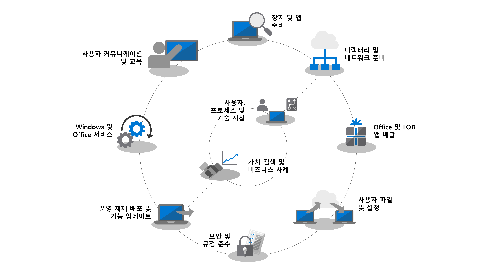

# 데스크톱 배포 센터Desktop Deployment Center

<strong>Windows 7에서 Windows 10으로 업그레이드</strong><strong>Upgrading from Windows 7 to Windows 10</strong>

Windows 7 연장 지원은 2020년 1월 14일에 종료됩니다.Windows 7 extended support ended on January 14, 2020. Windows 7에서 Windows 10으로의 전체 업그레이드가 가장 빠른 배포 방법입니다.In-place upgrade from Windows 7 to Windows 10 is the fastest method to deploy. Microsoft Endpoint Configuration Manager를 사용하여 <a href="https://docs.microsoft.com/microsoft-365/enterprise/windows-7-to-windows-10-upgrade-manual">단일 PC를 업그레이드</a>하거나 <a href="https://docs.microsoft.com/microsoft-365/enterprise/windows-7-to-windows-10-upgrade-automated">수천 대의 PC를 업그레이드</a>할 수 있습니다.You can <a href="https://docs.microsoft.com/microsoft-365/enterprise/windows-7-to-windows-10-upgrade-manual">upgrade a single PC</a> or <a href="https://docs.microsoft.com/microsoft-365/enterprise/windows-7-to-windows-10-upgrade-automated">upgrade thousands of PCs using Microsoft Endpoint Configuration Manager</a>. 전체 업그레이드를 사용하여 앱 제공, 파일 마이그레이션, 사용자 지정 이미징 또는 클라우드 기반 서비스 사용에 집중할 필요가 없습니다.You don’t need to focus on app delivery, file migration, custom imaging, or enabling cloud-based services with in-place upgrades. 이미 가지고 있는 도구를 사용하여 기존 PC를 업그레이드하고 업그레이드를 위한 다음 배포 단계에 집중할 수 있습니다:You can use tools you already have to upgrade existing PCs and focus on the following deployment steps for upgrades: 

|               |               |               |               |               |               |
| ------------- | ------------- | ------------- | ------------- | ------------- | ------------- |
|  | **[ConfigMgr를 현재 분기로 업그레이드](https://docs.microsoft.com/microsoft-365/enterprise/step-2-directory-and-network-readiness)****[Upgrade ConfigMgr to Current Branch](https://docs.microsoft.com/microsoft-365/enterprise/step-2-directory-and-network-readiness)** 
Configuration Manager를 사용하는 조직을 위한 디렉터리 및 네트워크 준비의 일부Part of Directory and Network Readiness for organizations using Configuration Manager
 |  | **[디바이스 및 앱 준비 상태 확인](/microsoft-365/enterprise/step-1-device-and-app-readiness)****[Validate device and app readiness](/microsoft-365/enterprise/step-1-device-and-app-readiness)** 
디바이스 및 앱 준비의 일부입니다. Desktop App Assure를 통해 도움말을 사용할 수 있습니다.Part of Device and App Readiness; help is available via Desktop App Assure
 |  | **[Windows 7 PC를 Windows 10으로 업그레이드](/microsoft-365/enterprise/windows-7-to-windows-10-upgrade-automated)****[Upgrade Windows 7 PCs to Windows 10](/microsoft-365/enterprise/windows-7-to-windows-10-upgrade-automated)** 
디바이스 및 앱 준비의 일부입니다. Desktop App Assure를 통해 도움말을 사용할 수 있습니다.Part of Device and App Readiness; help is available via Desktop App Assure
 |

Windows 10 및 엔터프라이즈용 Microsoft 365 앱의 대규모 배포를 계획하고 실행하려면 아래 단계를 따르십시오.Follow the steps below to plan and carry out your large-scale deployment of Windows 10 and Microsoft 365 Apps for enterprise. 아래의 각 단계는 단계적인 배포에서 일반적으로 서로 동시에 실행하는 단계와 함께 전체 계획 및 배포 프로세스의 일부입니다.Each step below is part of the overall planning and deployment process with steps typically running in parallel to each other in a phased deployment. 배포 프로세스에서 강조된 도구로의 실습 교육을 위한 [데스크톱 배포 및 관리 랩 키트](https://aka.ms/howtoshiftlabs)를 무료로 다운로드 하십시오.Download the free [Desktop Deployment and Management Lab Kit](https://aka.ms/howtoshiftlabs) for hands-on training with the tools highlighted in the deployment process. Microsoft 파트너 및 FastTrack 서비스에서 데스크톱 배포를 위해[도움말을 찾을 수](https://aka.ms/mddhelp) 있습니다.You can also [find help](https://aka.ms/mddhelp) for your desktop deployment from Microsoft partners and FastTrack services.

 

<table>
<tr class="even">
<td></td>
<td>
<strong><a href="https://aka.ms/mdd0">시작: 사용자, 프로세스 및 기술 지침</a></strong><strong><a href="https://aka.ms/mdd0">Getting Started: People, Process and Technology Guidance</a></strong>

Windows 10 및 엔터프라이즈용 Microsoft 365 앱으로 원활하게 전환하기 위한 모범사례 및 이전의 배포와 비교하여 주요 변경 사항과 고려사항, Windows 10 및 엔터프라이즈용 Microsoft 365 앱으로의 변경에 대한 이점을 발견해보십시오.Discover the benefits of moving to Windows 10 and Microsoft 365 Apps for enterprise, major changes and considerations versus previous deployments, and best practices to ensure a smooth transition to Windows 10 and Microsoft 365 Apps for enterprise.
</td>
<td></td>
</tr>
<tbody>
<tr class="odd">
<td></td>
<td>
<strong><a href="https://aka.ms/mdd1">1단계: 장치 및 앱 준비</a></strong><strong><a href="https://aka.ms/mdd1">Step 1: Device and App Readiness</a></strong>

장치 및 앱의 인벤토리 사용하여 데스크톱 배포 프로젝트를 시작하고, 이동할 항목의 우선 순위를 지정하고, 우선 순위가 지정된 앱 및 장치를 테스트한 후, 배포 준비 완료에 필요한 항목을 수정합니다.Begin your desktop deployment project with an inventory of your devices and apps, prioritize what you need to move forward, test prioritized apps and devices, then remediate what’s needed to get ready for deployment.
</td>
<td></td>
</tr>
<tr class="even">
<td></td>
<td>
<strong><a href="https://aka.ms/mdd2">2단계: 디렉터리 및 네트워크 준비</a></strong><strong><a href="https://aka.ms/mdd2">Step 2: Directory and Network Readiness</a></strong>

엔터프라이즈용 Microsoft 365 앱의 클라우드 연결 서비스와 새로운 배포 옵션(예: Windows Autopilot)에는 Azure Active Directory가 필요합니다. Windows 이미지, 앱, 드라이버 및 관련 파일을 PC로 이동할 때 계획해야 하는 중요한 영역이 바로 네트워크와 연결입니다. 새로운 도구와 배포 옵션으로 네트워크 트래픽을 줄이고 능률화하는 방법을 알아봅니다.Cloud connected services in Microsoft 365 Apps for enterprise and new deployment options like Windows Autopilot require Azure Active Directory. Your network and connectivity are also important areas to plan when moving Windows images, apps, drivers and related files to your PCs. Learn how new tools and deployment options reduce and streamline network traffic.
</td>
<td></td>
</tr>
<tr class="odd">
<td></td>
<td>
<strong><a href="https://aka.ms/mdd3">3단계: Office 및 LOB 앱 배달</a></strong><strong><a href="https://aka.ms/mdd3">Step 3: Office and LOB App Delivery</a></strong>

패키지된 앱 및 자동화된 설치에 대한 준비를 확인하십시오.Ensure your apps are packaged and ready for automated installation. 엔터프라이즈용 Microsoft 365 앱을 사용한 간편 설치 패키징을 통해 Office 앱을 최신 상태로 구성, 전달, 유지하기 위한 새 옵션을 제공하는 방법을 알아봅니다.Learn how Click-to-Run packaging with Microsoft 365 Apps for enterprise gives you new options to configure, deliver, and keep your Office apps up-to-date.
</td>
<td></td>
</tr>
<tr class="even">
<td></td>
<td>
<strong><a href="https://aka.ms/mdd4">4단계: 사용자 파일 및 설정</a></strong><strong><a href="https://aka.ms/mdd4">Step 4: User Files and Settings</a></strong>

PC를 재생하거나 교체하는 경우, 사용자 상태의 백업 및 복원을 자동화하여 시간을 절약 하십시오.When refreshing or replacing PCs, save time by automating user state backup and restore. 클라우드 파일 동기화에 대한 새 옵션을 사용하면 새로운 Windows 설치에서 파일에 원활하게 액세스할 수 있도록 사용자 당 OneDrive로의 데스크톱, 문서 및 그림 폴더의 동기화를 강화할 수 있습니다.New options for cloud file sync allow you to enforce per user sync of Desktop, Documents, and Pictures folders to OneDrive for seamless file access from new Windows installs.
</td>
<td></td>
</tr>
<tr class="odd">
<td></td>
<td>
<strong><a href="https://aka.ms/mdd5">5단계: 보안 및 준수 고려 사항</a></strong><strong><a href="https://aka.ms/mdd5">Step 5: Security and Compliance Considerations</a></strong>

Windows 10 및 엔터프라이즈용 Microsoft 365 앱 데이터, 장치 및 사용자를 보호하며 위협을 빠르게 감지하고 대응하는 새로운 방법을 제공합니다.Windows 10 and Microsoft 365 Apps for enterprise provide new ways to protect your data, devices and users, and quickly detect and respond to threats. 또한 Windows 10으로 이동하는 경우 디스크 암호화, 안티 악성 소프트웨어 앱 및 정책과 연결된 일반적인 문제를 처리하는 방법을 알아보십시오.Also, learn how to deal with common problems associated with disk encryption, anti-malware apps, and policies when moving to Windows 10.
</td>
<td></td>
</tr>
<tr class="even">
<td></td>
<td>
<strong><a href="https://aka.ms/mdd6">6단계: 운영 체제 배포 및 기능 업데이트</a></strong><strong><a href="https://aka.ms/mdd6">Step 6: OS Deployment and Feature Updates</a></strong>

베어메탈 설치, PC 새로고침 및 대체를 위한 대규모 단계적 배포를 자동화 하기위해 작업 시퀀스 기반 배포가 사용됩니다.Task sequence-based deployment is used to automate large scale, phased deployment for bare metal installs, PC refresh, and PC replacement. 업그레이드 작업 시퀀스는 주요 반기별 업데이트와 함께 최신으로 유지되도록 해줍니다.Upgrade task sequences will also help you stay current with major semi-annual updates. Windows Autopilot은 신규 및 기존 장치의 이미지를 최신화해주는 최근 추가기능입니다.Windows Autopilot is a recent addition that modernizes imaging new and existing devices.
</td>
<td></td>
</tr>
<tr class="odd">
<td></td>
<td>
<strong><a href="https://aka.ms/mdd7">7단계: Windows 및 Office Servicing</a></strong><strong><a href="https://aka.ms/mdd7">Step 7: Windows and Office Servicing</a></strong>

Windows 10과 엔터프라이즈용 Microsoft 365 앱 모두 지속해서 새로운 기능을 추가하여 혁신적인 최신 기능으로 사용자 환경과 보안을 향상시킵니다.Both Windows 10 and Microsoft 365 Apps for enterprise continually add new capabilities to keep bringing user experiences and security forward with the latest innovations. 반기 및 월별 업데이트를 통해 최신 상태를 유지 하는 방법과 새로운 서비스 모델 및 보유하고 있는 도구와 옵션이 어떻게 작동하는지 알아봅니다.Learn how to stay current with semi-annual and monthly updates, how the new servicing model works, and the tools and options you have.
</td>
<td></td>
</tr>
<tr class="even">
<td></td>
<td>
<strong><a href="https://aka.ms/mdd8">8단계: 사용자 커뮤니케이션 및 교육</a></strong><strong><a href="https://aka.ms/mdd8">Step 8: User Communication and Training</a></strong>

사용자에게 새로운 환경과 PC를 Windows 10 및 엔터프라이즈용 Microsoft 365 앱으로 전환하는 새로운 작업 방법을 알려주어야 합니다. Microsoft FastTrack, 교육 자료 및 커뮤니케이션 서식 파일과 사용자 수용 및 사용 현황을 모니터링하는 새로운 방법을 통해 사용자 채택과 사용을 지원하는 방법을 알아보세요.Make sure your users are informed about new experiences and new ways of working as you shift your PCs to Windows 10 and Microsoft 365 Apps for enterprise. Learn how to take advantage of user adoption assistance with Microsoft FastTrack, training materials and communication templates, as well as new ways to monitor user acceptance and usage.
</td>
<td></td>
</tr>
</tbody>
</table>
