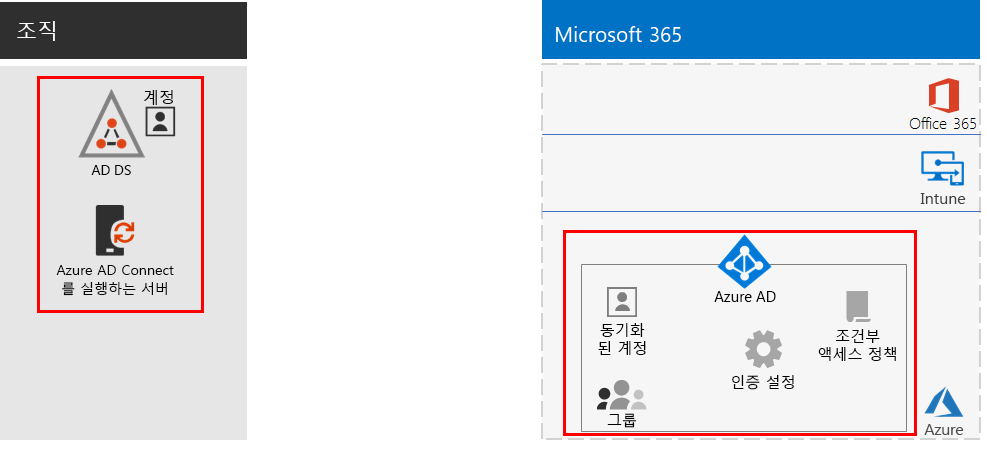
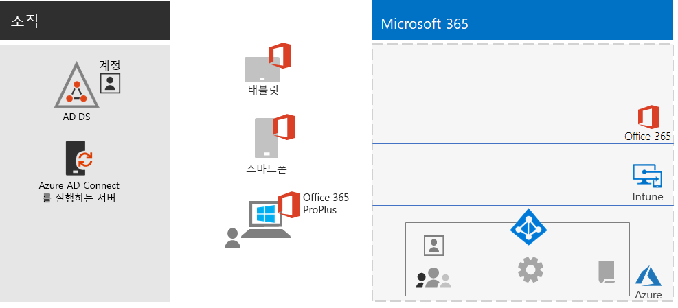
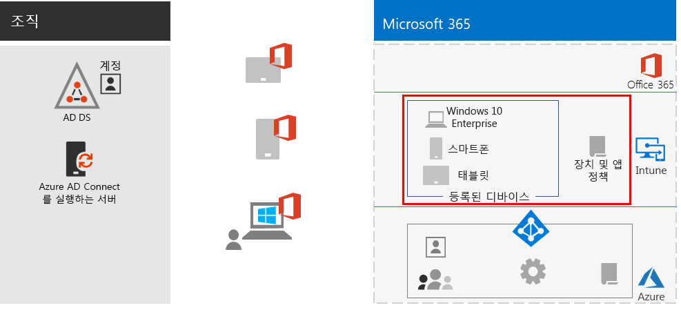
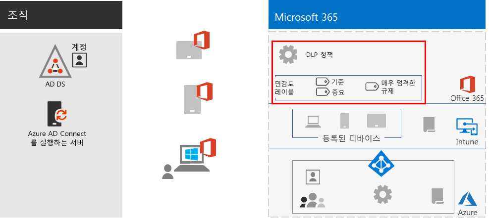
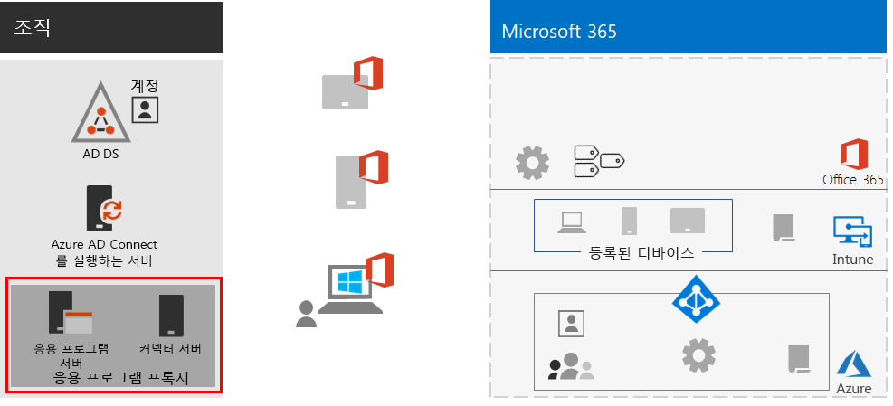
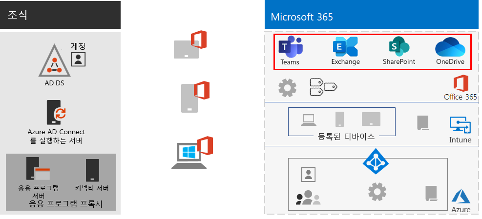

# 원격 작업자 지원

*이 시나리오는 Microsoft 365 Enterprise E3 및 E5 버전에 적용됩니다.*

직원들이 사무실 밖에서 원활하고 안전하게 업무를 수행할 수 있도록 하는 것은 사무실 공간을 절약하고, 이전을 원치 않는 직원을 고용 및 유지하며, 직원의 통근을 줄임으로써 생산성을 높이고 스트레스를 줄이며 업무 외 할동에 더 많은 시간을 할애하게 하며 많은 조직에 중요합니다.

원격 작업(teleworking이라고도 함)은 다음과 같은 항목을 포함하는 스펙트럼에 걸쳐 있을 수 있습니다.

- 회의나 클라이언트 회의를 위해 가끔 사무실을 떠나는 직원
- 풀타임 원격으로 작업을 하는 몇몇 직원
- 사무실이 없고 모든 직원이 원격으로 일하는 완전한 원격 조직

원격 작업자를 지원하기 위해 Microsoft 365 Enterprise의 기능을 조합을 통해서 다음으로 원격 작업자는 매우 협력적으로 업무를 수행할 수 있습니다.

- 온라인 회의 및 채팅 세션
- 전역 접근성과 실시간 공동 작업을 통해 클라우드 기반 파일 저장소를 위한 공유 작업 영역
- 작업을 분할하고 작업을 완료하기 위한 공유 작업 및 워크플로

강력한 보안을 위해 Microsoft 365 Enterprise에는 다음이 포함됩니다.

- 인증 요구 사항을 적용하고, 고위험 로그인을 감지하여 대응하고, 선택한 앱과 비규격 장치를 차단합니다.
- 클라우드에서 암호화된 연결 및 디지털 자산
- 파일에 대한 작업을 수행할 수 있는 사용자를 정의하는 권한
- 높은 규제 대상 데이터가 누출되는 것을 방지하기 위한 DLP(데이터 손실 방지)

원격 작업자에 대한 이러한 조건을 충족하기 위해 다음 Microsoft 365 Enterprise 기능을 사용합니다. 

- 사용자 ID 및 로그인 보안
  - MFA(Multi-Factor Authentication)을 사용하는 Azure AD(Azure Active Directory) 사용자 계정
  - 위험한 로그인에 대해 MFA를 요구하는 조건부 액세스 정책
- 공동 작업 플랫폼
  - 원격 작업자와 온라인 비디오 기반 모임을 예약하고 모임에 참석하고 동시에 동일한 문서 작업을 할 수 있는 Microsoft Teams, SharePoint 및 OneDrive
- 리소스에 대한 안전한 액세스
  - 인증되고 허가된 사용자만 액세스할 수 있도록 Teams, SharePoint 사이트 및 OneDrive에 대한 그룹 및 사용 권한
- 유출된 파일 보호
  - Office 365 DLP 정책
  - 파일과 함께 이동하는 암호 및 사용 권한에 대한 민감도 레이블
- Microsoft Intune을 사용한 장치 관리 및 보안
  - 관리 장치 등록
  - 개인 장치의 앱 설정
  - 장치 및 앱 정책
- 장치용 생산성 앱
  - Teams, SharePoint 및 OneDrive와 공동 작업 환경을 위한 Office 365 ProPlus 앱 
- Windows 10 Enterprise
  - 사이버 공격으로부터 보호하고 데이터 유출을 방지하는 포괄적인 보안 기능
- 온-프레미스 앱에 액세스
  - 하이브리드 ID가 있는 조직에서는 VPN(가상 사설망) 연결 대신 Azure AD 애플리케이션 프록시를 사용할 수 있습니다.

다음 단계에서는 원격 액세스를 위한 Microsoft 365 Enterprise 기능을 배포하고 원격 작업자의 채택을 유도합니다. 이러한 단계의 요소가 이미 배포된 경우에는 다음 요소로 이동하기 전에 규정된 요구 사항을 충족하는지 확인합니다.

 이 시나리오의 1페이지 요약은 [원격 작업자 지원 포스터](media/empower-people-to-work-remotely/empower-remote-workers-scenario.pdf)를 참조하세요.

[이 포스터를 다운로드](https://github.com/MicrosoftDocs/microsoft-365-docs/raw/public/microsoft-365/enterprise/media/empower-people-to-work-remotely/empower-remote-workers-scenario.pdf)하고 편지형, 법률형 또는 타블로이드(11 x 17) 형식으로 인쇄할 수 있습니다.

## 1단계: 원격 작업자를 위한 Microsoft 365 특징과 기능 배포

이 시나리오에 필요한 특징과 기능의 폭과 수로 인해 [Microsoft 365 Enterprise 배포 가이드](deploy-microsoft-365-enterprise.md)의 기본 인프라 및 작업 섹션의 필수 요소를 단계별로 안내합니다.

### 1단계: 원격 작업자를 위한 기본 인프라 요구 사항

이 단계에서는 [기본 인프라](deploy-foundation-infrastructure.md)의 단계를 살펴보고 원격 작업자를 지원하는 데 필요한 요소를 나열합니다.

[2단계: ID](identity-infrastructure.md)에서는 사용자 ID와 로그인 보안을 위해 다음을 배포합니다.

- 하이브리드 ID의 경우 온-프레미스 AD DS(Active Directory 도메인 서비스)에서 동기화된 사용자 계정 및 그룹
- 사용 권한 할당의 경우 적절한 구성원이 있는 동기화된 또는 Azure AD 그룹
- MFA를 요구하는 등의 인증 설정
- 위험한 로그인에 대해 MFA를 요구하고 최신 인증을 지원하지 않는 클라이언트를 차단하는 조건부 액세스 정책

다음은 ID 요소가 강조 표시된 결과 구성입니다.

 
[3단계: Windows 10 Enterprise](windows10-infrastructure.md)에서는 다음을 배포합니다.

- Windows 10 Enterprise가 있는 새 장치를 배포하고 Windows 7 또는 Windows 8.1 장치를 Windows 10 Enterprise로 업그레이드하기 위한 인프라
- ID, 위협, 정보 보호를 위한 포괄적인 보안 기능을 사용하도록 설정

다음은 Windows 10 Enterprise 장치의 구성 결과입니다.

 
[4단계: Office 365 ProPlus](office365proplus-infrastructure.md)에서는 인프라를 배포하여 Office 365 ProPlus를 설치하거나 조직 장치의 현재 설치된 Office 제품군(예: Office 2010 또는 Office 2013)을 Office 365 ProPlus로 업그레이드합니다. 이렇게 하면 사용자에게 최상의 보안과 공동 작업 환경을 제공합니다.

다음은 Office 365 ProPlus가 장치에 설치된 결과 구성입니다.

 
[5단계: 모바일 장치 관리](mobility-infrastructure.md)에서는 다음에 대 한 Intune 장치 및 앱 관리를 배포합니다.

- Windows 10 Enterprise, iOS, macOS, Android 및 Android Enterprise 장치를 등록하여 조직에서 정의된 기능 및 보안 설정을 받을 수 있습니다.
- 직원 소유의 개인 장치에도 보안을 강화하고 앱을 허용하거나 차단하기 위한 앱 설정
- 비규격 장치에 연결할 수 없도록 조건부 액세스를 사용하는 규정 준수 정책

다음은 Intune에서 등록한 장치 및 정책이 강조 표시된 결과 구성입니다.

 
[6단계: 정보 보호](infoprotect-infrastructure.md)에서는 다음을 사용하여 디지털 자산에 대한 보호를 설계하고 구성합니다.

- Office 365 DLP 정책
- 파일과 함께 이동하는 암호 및 사용 권한에 대한 Office 365 민감도 레이블

다음은 DLP 정책과 민감도 레이블이 강조 표시된 결과 구성입니다.

 
온-프레미스 앱에 액세스하는 경우 하이브리드 ID 환경을 필요로 하는 [Azure AD 애플리케이션 프록시](https://docs.microsoft.com/azure/active-directory/manage-apps/application-proxy)를 사용할 수 있습니다.

애플리케이션 프록시 구성 요소가 강조 표시된 결과 구성입니다.

 
### 2단계: 원격 작업자를 위한 워크로드

[Exchange Online](exchangeonline-workload.md)의 경우 각 사용자에게 Exchange Online 사서함을 배포합니다.

[Teams](teams-workload.md)의 경우 사용자 및 그룹에 Teams를 배포합니다.

[SharePoint 및 OneDrive](sharepoint-online-onedrive-workload.md)의 경우 SharePoint 팀 또는 커뮤니케이션 사이트와 OneDrive 폴더를 배포합니다.

다음은 워크로드가 강조 표시된 결과 구성입니다.

 
### 배포 결과

기본 인프라와 워크로드를 배포하고 Windows 10 Enterprise 및 Office 365 ProPlus를 배포한 후 원격 작업자는:

- 강력한 인증 및 ID 보호를 받습니다.
- Windows 장치에 최신의 가장 안전한 버전의 Windows를 사용할 수 있습니다.
- 장치에서 최신의 가장 생산적인 버전의 Office 제품군을 사용할 수 있습니다.
- 앱 관리 및 장치 준수 정책을 따릅니다. 
- DLP 정책 및 제한 사항을 따릅니다.
- 파일 및 전자 메일과 함께 이동하는 암호 및 사용 권한에 대한 민감도 레이블을 할당할 수 있습니다.
- VPN 연결 없이 온-프레미스 앱에 액세스할 수 있습니다.
- 자신의 작업을 수행하고, 채팅, 모임, Teams와 SharePoint 및 OneDrive의 파일을 사용하여 동료들과 실시간 공동 작업에 참여할 수 있습니다.

오프라인(인터넷에 연결되지 않은 상태)일 때 원격 작업자는 파일의 로컬 복사본을 변경할 수 있습니다. 인터넷에 다시 연결되면 OneDrive는 로컬 복사본을 Microsoft 365 구독에 저장된 파일과 동기화합니다. 

하이브리드 ID를 사용하는 경우 조직의 원격 작업자를 위한 결과 구성은 다음과 같습니다.

 
 
클라우드 전용 ID를 사용하는 경우 조직의 원격 작업자를 위한 결과 구성은 다음과 같습니다.

## 2단계: 원격 작업자를 위한 사용자 채택 유도

이제 기본 인프라와 워크로드가 준비되었으므로 원격으로 직원들이 이러한 기능을 지속적으로 사용하도록 하여 언제 어디서나 생산성을 높일 수 있습니다.

### 1단계: 사용자 교육

다음에 관해 원격 작업자를 교육합니다.

- MFA 등록을 포함한 올바른 로그인 절차 및 위험이 감지될 때 로그인에 어떻게 문제가 발생하는지
- 장치 사용 및 정책을 사용하여 어떻게 비규격 장치에 대한 액세스를 차단하는지
- 허용되는 앱 사용 및 Intune 앱 정책을 사용하여 어떻게 앱을 차단하는지
- Windows 10 Enterprise 보안 기능
- 전자 메일 및 일정 관리를 위해 Outlook을 사용하는 방법
- 채팅, 비디오 기반 회의, 문서 공유, 스레드 대화에 [Teams](https://docs.microsoft.com/microsoftteams/training-microsoft-teams-landing-page)를 사용하는 방법
- SharePoint 팀 또는 커뮤니케이션 사이트 및 OneDrive 폴더를 사용하여 사용자의 라이브러리 및 그룹에 속한 파일을 검색하는 방법
- 로컬 또는 온라인 파일 버전 모두에 중요하거나 높은 규제 대상 데이터가 포함된 파일에 민감도 레이블을 사용하고 적용하는 방법

이 교육에는 사용자가 이러한 기능과 해당 결과를 경험해볼 수 있도록 하기 위해 실무 위주의 연습이 포함되어 있습니다.

### 2단계: 정기적으로 사용 현황 및 직원 피드백 처리

교육 후 몇 주 안에:

- 원격 작업자 피드백을 신속하게 처리하고 정책과 구성을 세부적으로 조정합니다.
- Teams, SharePoint 사이트 및 OneDrive 폴더에 대한 사용 현황을 분석하고 사용 기대치와 비교해 봅니다.
- 중요하거나 높은 규제 대상 파일에 적절한 민감도 레이블이 지정되어 있는지 확인합니다.

필요에 따라 사용자를 재교육합니다.

### 사용자 채택 계획

원격 작업자는 Windows 10 Enterprise 또는 기타 장치와 Office 365 ProPlus를 사용하여 안전한 환경에서 공유된 Microsoft 365 Enterprise 클라우드 서비스와 리소스에 액세스하고 작업할 수 있으며 실시간으로 모임, 작성, 공동 작업을 수행할 수 있습니다.

## 참고 항목

[워크로드 및 시나리오](deploy-workloads.md)

[Microsoft 365 생산성 라이브러리](https://aka.ms/productivitylibrary) (https://aka.ms/productivitylibrary)

[배포 가이드](deploy-microsoft-365-enterprise.md)
