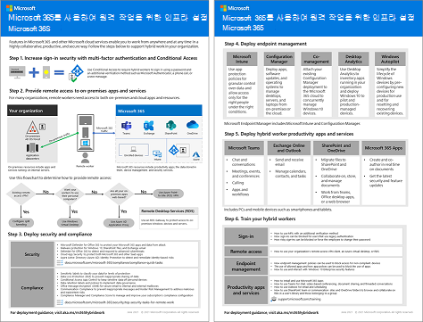

# 원격 작업자 지원Empower remote workers

*이 시나리오는 Microsoft 365 Enterprise E3 및 E5 버전에 적용됩니다.**This scenario applies to both the E3 and E5 versions of Microsoft 365 Enterprise*

직원들이 사무실 밖에서 원활하고 안전하게 업무를 수행할 수 있도록 하는 것은 사무실 공간을 절약하고, 이전을 원치 않는 직원을 고용 및 유지하며, 직원의 통근을 줄임으로써 생산성을 높이고 스트레스를 줄이며 업무 외 할동에 더 많은 시간을 할애하게 하며 많은 조직에 중요합니다.Allowing employees to work away from the office seamlessly and securely is important for many organizations to save on office space, hire and retain employees who are unwilling to relocate, and reduce employee commuting, leaving them with more time to be productive and for stress-reducing activities outside of work.

원격 작업(teleworking이라고도 함)은 다음과 같은 항목을 포함하는 스펙트럼에 걸쳐 있을 수 있습니다.Remote working, also known as teleworking, can span a spectrum that includes:

- 회의나 클라이언트 회의를 위해 가끔 사무실을 떠나는 직원Employees that are occasionally away from the office for conferences or client meetings.
- 풀타임 원격으로 작업을 하는 몇몇 직원Some employees that work remotely full-time.
- 사무실이 없고 모든 직원이 원격으로 일하는 완전한 원격 조직A fully remote organization in which there is no office and all employees are remote.

원격 작업자를 지원하기 위해 Microsoft 365 Enterprise의 기능을 조합을 통해서 다음으로 원격 작업자는 매우 협력적으로 업무를 수행할 수 있습니다.To support remote workers, a combination of features in Microsoft 365 Enterprise enables your remote workers in a highly collaborative way, such as:

- 온라인 회의 및 채팅 세션Online meetings and chat sessions.
- 전역 접근성과 실시간 공동 작업을 통해 클라우드 기반 파일 저장소를 위한 공유 작업 영역Shared workspaces for cloud-based file storage with global accessibility and real-time collaboration.
- 작업을 분할하고 작업을 완료하기 위한 공유 작업 및 워크플로Shared tasks and workflows to divide up the work and get things done.

강력한 보안을 위해 Microsoft 365 Enterprise에는 다음이 포함됩니다.For strong security, Microsoft 365 Enterprise includes:

- 인증 요구 사항을 적용하고, 고위험 로그인을 감지하여 대응하고, 선택한 앱과 비규격 장치를 차단합니다.Enforced authentication requirements, detecting and responding to high-risk sign-ins, and blocking selected apps and non-compliant devices.
- 클라우드에서 암호화된 연결 및 디지털 자산Encrypted connections and digital assets in the cloud.
- 파일에 대한 작업을 수행할 수 있는 사용자를 정의하는 권한Permissions to define who can do what with files.
- 높은 규제 대상 데이터가 누출되는 것을 방지하기 위한 DLP(데이터 손실 방지)Data loss prevention (DLP) to prevent leakage of highly regulated data.

원격 작업자에 대한 이러한 조건을 충족하기 위해 다음 Microsoft 365 Enterprise 기능을 사용합니다. To meet these criteria for remote workers, use the following Microsoft 365 Enterprise features:

- 사용자 ID 및 로그인 보안User identity and sign-in security
  - MFA(Multi-Factor Authentication)을 사용하는 Azure AD(Azure Active Directory) 사용자 계정Azure Active Directory (Azure AD) user accounts with multi-factor authentication (MFA)
  - 위험한 로그인에 대해 MFA를 요구하는 조건부 액세스 정책Conditional Access policies to require MFA for risky sign-ins
- 공동 작업 플랫폼Collaboration platforms
  - 원격 작업자와 온라인 비디오 기반 모임을 예약하고 모임에 참석하고 동시에 동일한 문서 작업을 할 수 있는 Microsoft Teams, SharePoint 및 OneDriveMicrosoft Teams, SharePoint, and OneDrive, with which remote workers can schedule and attend online video-based meetings and work on the same documents at the same time
- 리소스에 대한 안전한 액세스Secure access to resources
  - 인증되고 허가된 사용자만 액세스할 수 있도록 Teams, SharePoint 사이트 및 OneDrive에 대한 그룹 및 사용 권한Groups and permissions for Teams, SharePoint sites, and OneDrive so that only authenticated and permitted users have access
- 유출된 파일 보호Protection for leaked files
  - Office 365 DLP 정책Office 365 DLP policies
  - 파일과 함께 이동하는 암호 및 사용 권한에 대한 민감도 레이블Sensitivity labels for encryption and permissions that travel with files
- Microsoft Intune을 사용한 장치 관리 및 보안Device management and security with Microsoft Intune
  - 관리 장치 등록Enrollment for managed devices
  - 개인 장치의 앱 설정App settings for personal devices
  - 장치 및 앱 정책Device and app policies
- 장치용 생산성 앱Productivity apps for devices
  - Teams, SharePoint 및 OneDrive와 공동 작업 환경을 위한 Office 365 ProPlus 앱Office 365 ProPlus apps for collaborative experiences with Teams, SharePoint, and OneDrive 
- Windows 10 EnterpriseWindows 10 Enterprise
  - 사이버 공격으로부터 보호하고 데이터 유출을 방지하는 포괄적인 보안 기능Comprehensive security features to protect against cyberattacks and prevent data leakage
- 온-프레미스 앱에 액세스Access to on-premises apps
  - 하이브리드 ID가 있는 조직에서는 VPN(가상 사설망) 연결 대신 Azure AD 애플리케이션 프록시를 사용할 수 있습니다.Organizations that have hybrid identity can use Azure AD Application Proxy instead of virtual private network (VPN) connections

다음 단계에서는 원격 액세스를 위한 Microsoft 365 Enterprise 기능을 배포하고 원격 작업자의 채택을 유도합니다.The following phases step you through deploying the feature of Microsoft 365 Enterprise for remote access and driving adoption for remote workers. 이러한 단계의 요소가 이미 배포된 경우에는 다음 요소로 이동하기 전에 규정된 요구 사항을 충족하는지 확인합니다.If you have already deployed elements of these phases, ensure that they meet the stated requirements before moving on to the next element.

 이 시나리오의 1페이지 요약은 [원격 작업자 지원 포스터](../media/empower-people-to-work-remotely/empower-remote-workers-scenario.pdf)를 참조하세요.For a 1-page summary of this scenario, see the [Empower remote workers poster](../media/empower-people-to-work-remotely/empower-remote-workers-scenario.pdf).

이 포스터를 [PDF](https://github.com/MicrosoftDocs/microsoft-365-docs/raw/public/microsoft-365/media/empower-people-to-work-remotely/empower-remote-workers-scenario.pdf)나 [PowerPoint](https://github.com/MicrosoftDocs/microsoft-365-docs/raw/public/microsoft-365/media/empower-people-to-work-remotely/Empower-Remote-Workers-Poster.pptx) 형식으로 다운로드할 수 있고, Letter, Legal, Tabloid(11 x 17) 크기 용지에 인쇄할 수도 있습니다.You can also download this poster in [PDF](https://github.com/MicrosoftDocs/microsoft-365-docs/raw/public/microsoft-365/media/empower-people-to-work-remotely/empower-remote-workers-scenario.pdf) or [PowerPoint](https://github.com/MicrosoftDocs/microsoft-365-docs/raw/public/microsoft-365/media/empower-people-to-work-remotely/Empower-Remote-Workers-Poster.pptx) formats and print it on letter, legal, or tabloid (11 x 17)-sized paper.

## 1단계: 원격 작업자를 위한 Microsoft 365 특징과 기능 배포Phase 1: Deploy Microsoft 365 features and capabilities for remote workers

이 시나리오에 필요한 특징과 기능의 폭과 수로 인해 [Microsoft 365 Enterprise 배포 가이드](deploy-microsoft-365-enterprise.md)의 기본 인프라 및 작업 섹션의 필수 요소를 단계별로 안내합니다.Because of the breadth and number of features and capabilities required for this scenario, we’ll step you through the required elements of the foundation infrastructure and workloads sections of the [Microsoft 365 Enterprise Deployment Guide](deploy-microsoft-365-enterprise.md).

### 1단계: 원격 작업자를 위한 기본 인프라 요구 사항Step 1: Foundation infrastructure requirements for remote workers

이 단계에서는 [기본 인프라](deploy-foundation-infrastructure.md)의 단계를 살펴보고 원격 작업자를 지원하는 데 필요한 요소를 나열합니다.In this step, we’ll visit the phases of the [foundation infrastructure](deploy-foundation-infrastructure.md) and list the required elements to enable remote workers.

[2단계: ID](identity-infrastructure.md)에서는 사용자 ID와 로그인 보안을 위해 다음을 배포합니다.For [Phase 2: Identity](identity-infrastructure.md), deploy the following for user identity and sign-in security:

- 하이브리드 ID의 경우 온-프레미스 AD DS(Active Directory 도메인 서비스)에서 동기화된 사용자 계정 및 그룹For hybrid identity, user accounts and groups synchronized from on-premises Active Directory Domain Services (AD DS).
- 사용 권한 할당의 경우 적절한 구성원이 있는 동기화된 또는 Azure AD 그룹For assigning permissions, synchronized or Azure AD groups with the appropriate members.
- MFA를 요구하는 등의 인증 설정Authentication settings, such as requiring MFA.
- 위험한 로그인에 대해 MFA를 요구하고 최신 인증을 지원하지 않는 클라이언트를 차단하는 조건부 액세스 정책Conditional Access policies to require MFA for risky sign-ins and block clients that don’t support modern authentication.

다음은 ID 요소가 강조 표시된 결과 구성입니다.Here's the resulting configuration with the identity elements highlighted.

 
[3단계: Windows 10 Enterprise](windows10-infrastructure.md)에서는 다음을 배포합니다.For [Phase 3: Windows 10 Enterprise](windows10-infrastructure.md), deploy:

- Windows 10 Enterprise가 있는 새 장치를 배포하고 Windows 7 또는 Windows 8.1 장치를 Windows 10 Enterprise로 업그레이드하기 위한 인프라The infrastructure to deploy new devices with Windows 10 Enterprise and to upgrade of your Windows 7 or Windows 8.1 devices to Windows 10 Enterprise
- ID, 위협, 정보 보호를 위한 포괄적인 보안 기능을 사용하도록 설정Enabling comprehensive security features for identity, threat, and information protection

다음은 Windows 10 Enterprise 장치의 구성 결과입니다.Here's the resulting configuration with Windows 10 Enterprise devices.

 
[4단계: Office 365 ProPlus](office365proplus-infrastructure.md)에서는 인프라를 배포하여 Office 365 ProPlus를 설치하거나 조직 장치의 현재 설치된 Office 제품군(예: Office 2010 또는 Office 2013)을 Office 365 ProPlus로 업그레이드합니다.For [Phase 4: Office 365 ProPlus](office365proplus-infrastructure.md), deploy the infrastructure to install Office 365 ProPlus or upgrade your currently installed Office suite, such as Office 2010 or Office 2013, to Office 365 ProPlus on your organization devices. 이렇게 하면 사용자에게 최상의 보안과 공동 작업 환경을 제공합니다.This will give your users the best security and collaborative experiences.

다음은 Office 365 ProPlus가 장치에 설치된 결과 구성입니다.Here's the resulting configuration with Office 365 ProPlus installed on devices.

 
[5단계: 모바일 장치 관리](mobility-infrastructure.md)에서는 다음에 대 한 Intune 장치 및 앱 관리를 배포합니다.For [Phase 5: Mobile device management](mobility-infrastructure.md), deploy Intune device and app management for:

- Windows 10 Enterprise, iOS, macOS, Android 및 Android Enterprise 장치를 등록하여 조직에서 정의된 기능 및 보안 설정을 받을 수 있습니다.Enrollment of your Windows 10 Enterprise, iOS, macOS, Android, and Android Enterprise devices so they receive features and security settings defined by your organization.
- 직원 소유의 개인 장치에도 보안을 강화하고 앱을 허용하거나 차단하기 위한 앱 설정App settings for extra security and to allow or block apps, even on employee-owned personal devices.
- 비규격 장치에 연결할 수 없도록 조건부 액세스를 사용하는 규정 준수 정책Compliance policies with Conditional Access to prevent non-compliant devices from connecting.

다음은 Intune에서 등록한 장치 및 정책이 강조 표시된 결과 구성입니다.Here's the resulting configuration with Intune enrolled devices and policies highlighted.

 
[6단계: 정보 보호](infoprotect-infrastructure.md)에서는 다음을 사용하여 디지털 자산에 대한 보호를 설계하고 구성합니다.For [Phase 6: Information protection](infoprotect-infrastructure.md), design and configure protection for your digital assets with:

- Office 365 DLP 정책Office 365 DLP policies.
- 파일과 함께 이동하는 암호 및 사용 권한에 대한 Office 365 민감도 레이블Office 365 sensitivity labels for encryption and permissions that travel with files.

다음은 DLP 정책과 민감도 레이블이 강조 표시된 결과 구성입니다.Here's the resulting configuration with DLP policies and sensitivity labels highlighted.

 
온-프레미스 앱에 액세스하는 경우 하이브리드 ID 환경을 필요로 하는 [Azure AD 애플리케이션 프록시](https://docs.microsoft.com/azure/active-directory/manage-apps/application-proxy)를 사용할 수 있습니다.For access to on-premises apps, you can use [Azure AD Application Proxy](https://docs.microsoft.com/azure/active-directory/manage-apps/application-proxy), which requires a hybrid identity environment.

애플리케이션 프록시 구성 요소가 강조 표시된 결과 구성입니다.Here's the resulting configuration with the application proxy components highlighted.

 
### 2단계: 원격 작업자를 위한 워크로드Step 2: Workloads for remote workers

[Exchange Online](exchangeonline-workload.md)의 경우 각 사용자에게 Exchange Online 사서함을 배포합니다.For [Exchange Online](exchangeonline-workload.md), deploy Exchange Online mailboxes to each of your users.

[Teams](teams-workload.md)의 경우 사용자 및 그룹에 Teams를 배포합니다.For [Teams](teams-workload.md), deploy Teams to your users and groups.

[SharePoint 및 OneDrive](sharepoint-online-onedrive-workload.md)의 경우 SharePoint 팀 또는 커뮤니케이션 사이트와 OneDrive 폴더를 배포합니다.For [SharePoint and OneDrive](sharepoint-online-onedrive-workload.md), deploy SharePoint team or communication sites and OneDrive folders.

다음은 워크로드가 강조 표시된 결과 구성입니다.Here's the resulting configuration with the workloads highlighted.

 
### 배포 결과Deployment results

기본 인프라와 워크로드를 배포하고 Windows 10 Enterprise 및 Office 365 ProPlus를 배포한 후 원격 작업자는:After deploying the foundation infrastructure and workloads and rolling out Windows 10 Enterprise and Office 365 ProPlus, remote workers:

- 강력한 인증 및 ID 보호를 받습니다.Are subject to strong authentication and identity protection.
- Windows 장치에 최신의 가장 안전한 버전의 Windows를 사용할 수 있습니다.Have the latest and most secure version of Windows on their Windows devices.
- 장치에서 최신의 가장 생산적인 버전의 Office 제품군을 사용할 수 있습니다.Have the latest and most productive version of the Office suite on their devices.
- 앱 관리 및 장치 준수 정책을 따릅니다. Are subject to app management and device compliance policies.
- DLP 정책 및 제한 사항을 따릅니다.Are subject to DLP policies and restrictions.
- 파일 및 전자 메일과 함께 이동하는 암호 및 사용 권한에 대한 민감도 레이블을 할당할 수 있습니다.Can assign sensitivity labels for encryption and permissions that travel with files and email.
- VPN 연결 없이 온-프레미스 앱에 액세스할 수 있습니다.Can access on-premises apps without a VPN connection.
- 자신의 작업을 수행하고, 채팅, 모임, Teams와 SharePoint 및 OneDrive의 파일을 사용하여 동료들과 실시간 공동 작업에 참여할 수 있습니다.Can perform their own work and participate in real-time collaboration with co-workers with chats, meetings, and files in Teams and files in SharePoint and OneDrive.

오프라인(인터넷에 연결되지 않은 상태)일 때 원격 작업자는 파일의 로컬 복사본을 변경할 수 있습니다.When offline (not connected to the Internet), your remote workers can change local copies of files. 인터넷에 다시 연결되면 OneDrive는 로컬 복사본을 Microsoft 365 구독에 저장된 파일과 동기화합니다.When they reconnect to the Internet, OneDrive synchronizes local copies with the files stored in your Microsoft 365 subscription. 

하이브리드 ID를 사용하는 경우 조직의 원격 작업자를 위한 결과 구성은 다음과 같습니다.Here's the resulting configuration for remote workers of your organization if you use hybrid identity.

 
 
클라우드 전용 ID를 사용하는 경우 조직의 원격 작업자를 위한 결과 구성은 다음과 같습니다.Here's the resulting configuration for remote workers your organization if you use cloud-only identity.

## 2단계: 원격 작업자를 위한 사용자 채택 유도Phase 2: Drive user adoption for remote workers

이제 기본 인프라와 워크로드가 준비되었으므로 원격으로 직원들이 이러한 기능을 지속적으로 사용하도록 하여 언제 어디서나 생산성을 높일 수 있습니다.Now that the foundation infrastructure and workloads are in place, it’s time to drive the ongoing usage of these capabilities to your remote workers so they can be productive anywhere and at any time.

### 1단계: 사용자 교육Step 1: Train your users

다음에 관해 원격 작업자를 교육합니다.Train your remote workers on:

- MFA 등록을 포함한 올바른 로그인 절차 및 위험이 감지될 때 로그인에 어떻게 문제가 발생하는지Proper sign-in procedures, including MFA registration, and how sign ins can be challenged when risk is detected.
- 장치 사용 및 정책을 사용하여 어떻게 비규격 장치에 대한 액세스를 차단하는지The use of devices and how policies can be used to block access for non-compliant devices.
- 허용되는 앱 사용 및 Intune 앱 정책을 사용하여 어떻게 앱을 차단하는지The use of allowed apps and how Intune app polices can be used to block apps.
- Windows 10 Enterprise 보안 기능Windows 10 Enterprise security features.
- 전자 메일 및 일정 관리를 위해 Outlook을 사용하는 방법How to use Outlook for email and calendaring.
- 채팅, 비디오 기반 회의, 문서 공유, 스레드 대화에 [Teams](https://docs.microsoft.com/microsoftteams/training-microsoft-teams-landing-page)를 사용하는 방법How to use [Teams](https://docs.microsoft.com/microsoftteams/training-microsoft-teams-landing-page) for chat, video-based conferencing, document sharing, and threaded conversations.
- SharePoint 팀 또는 커뮤니케이션 사이트 및 OneDrive 폴더를 사용하여 사용자의 라이브러리 및 그룹에 속한 파일을 검색하는 방법How to use SharePoint team or communication sites and OneDrive folders to browse files in a user's library and those belonging to a group.
- 로컬 또는 온라인 파일 버전 모두에 중요하거나 높은 규제 대상 데이터가 포함된 파일에 민감도 레이블을 사용하고 적용하는 방법How to use and apply sensitivity labels for files containing sensitive or highly regulated data, for both local and online versions of files.

이 교육에는 사용자가 이러한 기능과 해당 결과를 경험해볼 수 있도록 하기 위해 실무 위주의 연습이 포함되어 있습니다.This training should include hands-on exercises so that your students can experience these capabilities and their results.

### 2단계: 정기적으로 사용 현황 및 직원 피드백 처리Step 2: Conduct periodic reviews of usage and address worker feedback

교육 후 몇 주 안에:In the weeks after training:

- 원격 작업자 피드백을 신속하게 처리하고 정책과 구성을 세부적으로 조정합니다.Quickly address remote worker feedback and fine tune polices and configurations.
- Teams, SharePoint 사이트 및 OneDrive 폴더에 대한 사용 현황을 분석하고 사용 기대치와 비교해 봅니다.Analyze usage for teams, SharePoint sites, and OneDrive folders and compare it with usage expectations.
- 중요하거나 높은 규제 대상 파일에 적절한 민감도 레이블이 지정되어 있는지 확인합니다.Verify that sensitive or highly regulated files have been properly labeled with the appropriate sensitivity label.

필요에 따라 사용자를 재교육합니다.Retrain your users as needed.

### 사용자 채택 계획User adoption results

원격 작업자는 Windows 10 Enterprise 또는 기타 장치와 Office 365 ProPlus를 사용하여 안전한 환경에서 공유된 Microsoft 365 Enterprise 클라우드 서비스와 리소스에 액세스하고 작업할 수 있으며 실시간으로 모임, 작성, 공동 작업을 수행할 수 있습니다.Your remote workers can use their Windows 10 Enterprise or other devices and Office 365 ProPlus to access and work on shared Microsoft 365 Enterprise cloud services and resources in a secure environment, and they’re meeting, creating, and collaborating in real time.

## 참고 항목See also

[워크로드 및 시나리오Workloads and scenarios](deploy-workloads.md)

[Microsoft 365 생산성 라이브러리](https://aka.ms/productivitylibrary) (https://aka.ms/productivitylibrary)[Microsoft 365 Productivity Library](https://aka.ms/productivitylibrary) (https://aka.ms/productivitylibrary)

[배포 가이드Deployment guide](deploy-microsoft-365-enterprise.md)
