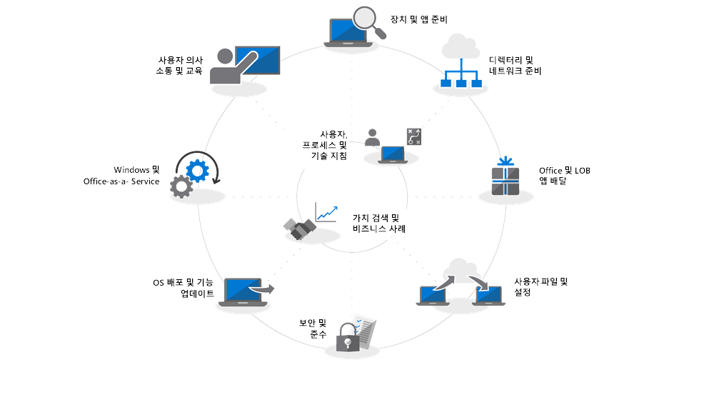
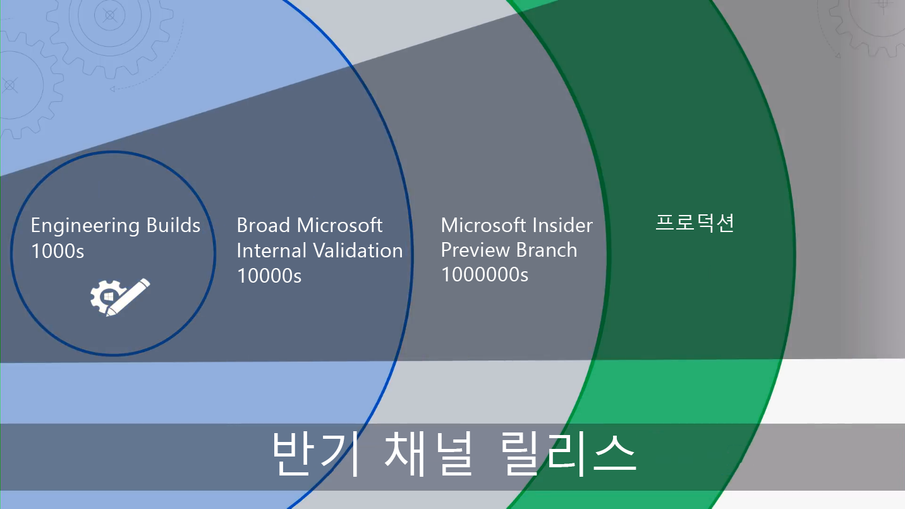

# 시작 - 최신 데스크톱 배포

Microsoft의 지능형 클라우드가 IT 전문가들이 최신 데스크톱으로 전환하는 데 도움이 되는 실행 관련 인사이트를 제공하는 가운데, 클라우드의 PC 관리 방식이 달라지고 있습니다. 이 시리즈는 Windows 10 및 Office 365 ProPlus에 따라 최신 데스크톱으로의 전환을 계획하고 진행하는 데 도움을 주기 위해 디자인되었습니다.

<table>
<thead>
<td></td>
<td>
<strong>시작: 사용자, 프로세스 및 기술 지침</strong>

이전 배포와 비교할 때 최신 데스크톱, 주요 변경 사항 및 고려 사항의 이점과 Windows 10 및 Office 365 ProPlus로 원활하게 전환하기 위한 모범 사례를 알아봅니다.
</td>
<td></td>
</thead>
</table>

>[!NOTE]
>이 시리즈에서는 기존 도구를 사용하는 가장 좋은 방법을 설명하고 클라우드에서 지원되는 새 기술, 서비스 및 방법을 소개합니다. 전체 데스크톱 배포 프로세스를 보려면 [최신 데스크톱 배포 센터](https://aka.ms/HowToShift)를 참조하세요.
>

최신 데스크톱 배포 센터에 오신 것을 환영합니다. 이 센터는 최신 데스크톱으로의 전환을 계획하고 수행하는 방법을 알아볼 수 있는 중심 위치입니다. 여기서는 최신 생산성, 팀워크 및 공동 작업 환경을 통해 보안 작업 공간을 활용할 수 있습니다.

얼마 동안 새 데스크톱 환경을 배포하지 않은 경우 많이 개선된 배포 프로세스에 만족할 것입니다. 응용 프로그램 호환성 등과 같은 이전 문제들이 지금은 훨씬 줄어들었으며, 새로운 도구와 클라우드에서 제공되는 인사이트를 통해 이전보다 더 안심하고 더 빠르고 효율적으로 전환을 진행할 수 있습니다.

이 소개 부분에서는 변경된 사항을 대략적으로 살펴보고, 데스크톱 배포 사이클을 간단히 알아봅니다. 여기서는 Windows 10 및 Office 365 ProPlus로 전환하기 위한 권장 단계를 안내하며 최신 관리 기술 및 접근 방식을 채택하면서 기존 도구와 프로세스를 활용하는 방법도 자세히 다룹니다.

## 업그레이드가 필요한 이유

Windows 10 및 Microsoft 인텔리전스 클라우드를 함께 사용하면 사용자를 위한 가장 강력하고 풍부하고 안전한 작업 공간을 전달할 수 있으며 지원 인프라도 간소화할 수 있습니다.

최신 관리 방식의 핵심 테넌트 중 하나는 항상 최신 상태로 유지되는 장치입니다. 이 시리즈를 진행하면서 Windows 10 및 Office 365 ProPlus로 전환하는 데 도움을 주기 위한 새로운 기능과, 반기 릴리스를 통해 최신 상태를 유지하는 방법을 알아볼 것입니다.

[IT 전문가용 Windows 10](https://www.microsoft.com/ko-KR/itpro/windows-10)

## 변경된 사항

먼저 마지막 데스크톱 배포 이후에 변경된 사항과 개선된 사항을 살펴보겠습니다. 얼마 동안 데스크톱 환경으로 전환하지 않은 경우 Windows 7과 Office 2010 또는 Office 2013을 사용하고 있을 것입니다. 이 경우 마지막 주요 업그레이드 이후에 몇 가지 사항이 개선되었다는 사실을 알게 될 것입니다. 일부 핵심 변경 내용은 다음과 같습니다.

**ID 및 액세스 관리** 클라우드 생산성, 보안 및 관리 서비스와 연결된 상태를 유지하는 최신 데스크톱은 핵심 영역에 새로운 ID 및 액세스 관리 서비스인 Azure Active Directory를 유지합니다. 이 서비스는 Single Sign-On과 클라우드 서비스 간 보안 연결을 지원합니다. 즉, 앞으로 Azure AD의 필요성이 높아질 것입니다. 이 서비스를 통해 Office 365, Intune 또는 Windows Autopilot과 같은 Microsoft 365 서비스를 활용할 수 있습니다.

[Microsoft 365](https://www.microsoft.com/ko-KR/microsoft-365/default.aspx)

**보안 사전 부팅 환경** 64비트 UEFI 펌웨어가 BIOS를 대체합니다. 이러한 펌웨어는 부팅 시간을 단축할 뿐만 아니라 Windows 10의 다양한 최신 보안 기능을 사용하는 데도 필요합니다. Windows 10은 BIOS에서 실행되지만 UEFI를 사용하는 것이 좋습니다. 아직 BIOS에서 UEFI 및 64비트로 전환하지 않은 경우 지금이 적기입니다. Windows 10 업그레이드 도중 및 이후에 이러한 전환에 도움이 되는 도구도 사용할 수 있습ㄴ다.

[MBR2GPT를 사용하여 BIOS에서 UEFI로 변환](https://technet.microsoft.com/ko-KR/windows/mt782786.aspx)

**클라우드 기반 장치 관리** 서비스는 Microsoft Intune과 비슷하게 다른 모바일 장치의 경우처럼 Windows 10 장치를 모두 한 곳에서 관리할 수 있도록 합니다. Microsoft Intune의 독특한 기능은 System Center Configuration Manager와 함께 Windows 10 장치를 관리할 수 있다는 것입니다. System Center Configuration Manager를 사용하여 Windows 10으로의 전환을 지원한 후 Microsoft Intune을 추가할 수 있습니다. System Center Configuration Manager는 조직 내에서 Microsoft 지능형 클라우드에 연결된 지능형 에지로서 함께 작동합니다. 이를 통해 조직에 연결되어 있거나 공용 클라우드에 포함되어 있는 사용자 장치를 현재 위치에 관계없이 안전하게 관리할 수 있습니다.

[Windows 10 장치의 공동 관리](https://docs.microsoft.com/ko-KR/sccm/core/clients/manage/co-management-overview)

**클라우드 기반 배포 서비스** 사용자가 새 PC를 구입하면 Microsoft는 Microsoft 365 장치를 배포하는 데 도움이 되는 새로운 클라우드 서비스를 추가합니다. 이 서비스를 Windows Autopilot 배포 서비스라고 합니다. AutoPilot은 하드웨어 공급자와 통합되며, 새로운 PC는 AutoPilot에 자동으로 등록됩니다. 이를 통해 새 PC가 최종 사용자에게 직접 배송될 수 있습니다. PC 전원을 처음 켜면 조직이 원하는 구성으로 빠르게 구성되고, 사용자의 특정 요구에 맞게 사용자 지정됩니다.

[Windows Autopilot](https://www.microsoft.com/ko-KR/windowsforbusiness/windows-autopilot)

**간편 실행 배포** Office 데스크톱 앱을 프로비전할 때 Office 365 ProPlus가 기본 설정 옵션입니다. 이 프로그램을 사용하면 개발된 Office의 새로운 혁신 기능에 액세스할 수 있으므로 새 기능을 받기 위해 기다릴 필요가 없습닏. 또한 간편 실행이라는 새로운 설치 방법도 사용하게 됩니다.

간편 실행은 과거의 MSI 기반 패키지와 상당히 다릅니다. 간편 실행은 더 빠르고 가벼우며, 프로그램 스트리밍을 사용하여 사용자가 몇 분 안에 작동을 시작하고, 백그라운드에서 업데이트가 진행되도록 합니다. 또한 Office의 로컬 복사본으로 계속 제공되므로 다른 걱정은 필요하지 않습니다. System Center Configuration Manager와 같은 기존의 배포 도구를 계속 사용하여 앱을 프로비전하고 구성할 수 있습니다.

[Office 365 ProPlus 배포 가이드](https://docs.microsoft.com/ko-KR/DeployOffice/deployment-guide-for-office-365-proplus)

**반기 업데이트** Windows 10 및 Office 365 ProPlus로 전환하고 아면 새 기능을 포함하는 업데이트가 1년에 2번 제공됩니다. 그렇지만 Microsoft에서 클라우드의 인사이트를 제공할 수 있으므로, 이러한 업데이트를 수백 또는 수천 대의 장치로 빠르고 안정적으로 롤아웃할 수 있습니다. 기능 업데이트는 현재 위치 업그레이드와 마찬가지로, 이전 릴리스의 앱, 데이터 및 구성을 유지합니다.

## 배포 프로세스 사이클

시작하기 전에 대략적인 계획을 세우고 필요한 후원자를 확보하고 싶을 것입니다. Microsoft가 제공하는 배포 프로세스 사이클은 다음 배포 영역에서 관리할 핵심 팀 구성원 및 리소스를 식별하는 데 도움이 되는 중요한 단계를 대략적으로 설명합니다.

**[1단계: 장치 및 앱 준비](https://aka.ms/mdd1)** 성공적인 배포를 위해서는 먼저 보유하고 있는 항목을 파악해야 합니다. 즉, 장치 및 앱의 인벤토리를 구축하고 호환성을 확인해야 합니다.

이를 위한 도움을 얻기 위해 클라우드 기반 서비스인 Windows Analytics를 사용할 수 있습니다. Windows Analytics를 사용하면 수억 대의 PC수집한 호환성 인텔리전스 및 원격 분석을 활용하여 장치에서 실행되고 있는 앱 및 드라이버를 평가함으로써 데스크톱 환경의 작업 준비를 진행할 수 있습니다. Windows Analytics에서 System Center Configuration Manager(사용 중인 경우)로 “배포 준비가 완료된 PC” 목록을 내보내, 사용 준비가 완료된 타기팅된 PC의 데이터 중심 컬렉션을 구축할 수도 있습니다.

[업그레이드 준비 시작](https://docs.microsoft.com/ko-KR/windows/deployment/upgrade/upgrade-readiness-get-started)

**[2단계: 디렉터리 및 네트워크 준비](https://aka.ms/mdd2)** 아직 수행하지 않은 경우 다음 번에 ID 및 액세스 관리를 수행하기 위해 Azure Active Directory를 구현할 수 있습니다. 또한 시스템 이미지, 응용 프로그램 패키지, 사용자 파일 및 업데이트를 이동하기 위해 네트워크를 준비하려고 할 수 있습니다. 이것은 대량의 추가 데이터를 이동해야 함을 의미합니다. 네트워크에는 조직의 일상 업무에 영향을 미치지 않으면서 이러한 추가 부하를 처리하기 위한 용량이 있어야 합니다. 대역폭 제한 및 피어 투 피어 옵션부터 동적 대역폭 청소 및 차등 업데이트에 이르는 다양한 네트워킹 최적화 방법을 사용할 수 있습니다.

[BranchCache 및 피어 캐시](https://blogs.technet.microsoft.com/swisspfe/2018/01/25/branch-cache-vs-peer-cache/)

**[3단계: Office 및 LOB(기간 업무) 앱 전달](https://aka.ms/mdd3)** Windows는 MSI 기반 설치를 계속 지원하지만, 이제 자동화된 배포와 연속 업데이트에 맞게 최적화된 최신 설치 메커니즘도 지원합니다. Office 365 ProPlus 및 Windows 2019 클라이언트는 간편 실행을 사용하며, 사용자는 광범위한 UWP 앱을 사용하기 원하고 새로운 MSIX 기반 패키징 앱을 사용하는 타사 앱 및 사내에서 개발된 LOB(기간 업무) 앱을 직접 배포하기 원할 것입니다. 이 단계를 수행하면 자동 배포를 수행할 수 있도록 앱이 준비되며, 간편 실행, MSIX, 기존의 MSI 기반 방식을 사용하여 배포되는 앱이나 사용자가 설정한 비즈니스용 Microsoft Store에서 배포되는 UWP 앱을 비롯한 다양한 앱을 성공적으로 배포할 수 있는 준비를 갖출 수 있습니다.

[MSIX 소개](https://blogs.msdn.microsoft.com/sgern/2018/06/15/msix-intro/)

**[4단계: 사용자 파일 및 설정 마이그레이션](https://aka.ms/mdd4)** 이 단계는 PC 교체 또는 새로 고침 주기에서 중요합니다. 사용자의 파일, 데이터 및 설정은 성공적으로 이동되고, 마이그레이션 시 보존되도록 해야 합니다. 이 단계에서는 잘 알려진 옵션 및 새 옵션을 비롯하여 수동 또는 자동화된 마이그레이션에 사용할 수 있는 옵션을 대해 설명합니다.

이전 업그레이드의 경우처럼 사용자 상태 마이그레이션 도구는 이러한 프로세스를 자동화할 수 있는 유용한 도구로 계속 사용되며, System Center Configuration Manager 또는 Microsoft Deployment Toolkit를 사용하여 오케스트레이션되는 마이그레이션의 통합된 부분으로 사용됩니다. 그렇지만 PC 교체를 위한 마이그레이션을 수행할 때 이러한 모든 데이터를 이동하게 되면 실제로 기존 데스크톱에서 먼저 이동한 후 새 데스크톱으로 다시 이동하게 되어 PC당 수백 기가바이트의 데이터를 2번 전송하는 결과를 가져오므로 병목 상태를 유발할 수 있습니다. OneDrive를 기반으로 하는 새 옵션은 알려진 폴더 이동으로, 사용자 문서, 그림 및 바탕 화면 파일을 배포 전에 클라우등서 대규모로 동기화합니다.

[알려진 Windows 폴더를 OneDrive로 리디렉션 및 이동](https://docs.microsoft.com/ko-KR/onedrive/redirect-known-folders)

**[5단계: 보안 및 규정 준수](https://aka.ms/mdd5)** 보안 및 규정 준수는 Windows 10 및 Office 365 ProPlus로 전환할 때 비교적 크게 무리 없이 진행되는 영역입니다. 사용자는 새로운 기본 제공 기능을 숙지하고, 이미 사용 중인 기능과 비교하는 것이 중요합니다. 예를 들어 가상화 기반 보안을 사용하는 Windows 10의 새로운 기능은 핵심 프로세스 및 비밀을 운영 체제와 격리하여 자격 증명 도난을 방지하고, 브라우저 기반 악용 및 악성 코드로부터 보호할 수 있습니다. 또한 Advanced Threat Protection과 같은 클라우드 서비스는 보안 강화, 사후 위반 감지, 조사 및 대응을 위한 통합 플랫폼을 제공합니다. 그뿐 아니라 Advanced Threat Protection은 악의적인 전자 메일 첨부 파일, 안전하지 않은 하이퍼링크 등으로부터 사용자를 보호할 수 있습니다.

[Microsoft 보안](https://www.microsoft.com/ko-KR/security/default.aspx)

**[6단계: OS 배포 및 기능 업데이트](https://aka.ms/mdd6)** 모든 준비가 완료되면 다음 단계로, OS 이미지를 배포합니다. System Center Configuration Manage 작업 시퀀스와 인프라를 사용하면 과도한 전환이 수행될 수 있습니다. 따라서 권장되는 방식은 대표적인 하드웨어 및 앱 집합을 사용하여 조직의 “얼리 어답터 그룹”을 대상으로 단계별 배포를 진행하는 것입니다. 그런 후 해당 장치 및 사용자의 데이터를 토대로 점점 더 많은 PC를 타기팅할 수 있습니다.

[System Center Configuration Manager의 운영 체제 배포 소개](https://docs.microsoft.com/ko-KR/sccm/osd/understand/introduction-to-operating-system-deployment)

**[7단계: Windows and Office as a Service](https://aka.ms/mdd7)** 이 단계는 사용자의 데스크톱 환경 유지 방식을 대폭 전환합니다. 이와 같이 Windows 10(및 Office 365 ProPlus)으로 전환하면서 Windows(및 Office) as a Service 관리 방식으로 전환할 수 있습니다. 몇 년 간격으로 기술이 획기적으로 발전함에 따라, 새로운 기능, 환경 및 보호 기능을 사용자에게 계속 전달해야 합니다. 반기 기능 업데이트는 매년 가을과 봄에 새로운 기능을 전달하지만, 월별 누적 품질 업데이트는 보안, 안정성 및 버그 픽스를 포함하게 됩니다. Office 2019 클라이언트 배포를 선택할 수도 있지만, Office ProPlus로 전환할 것을 강력히 권장합니다. 이 서비스는 Windows와 비슷한 서비스 플랜을 따르므로 사용자들은 Office 앱에 대한 업데이트도 정기적으로 받을 수 있습니다.

[Windows as a Service 개요](https://docs.microsoft.com/ko-KR/windows/deployment/update/waas-overview)

**[8단계: 사용자 커뮤니케이션 및 교육](https://aka.ms/mdd8)** 이 마지막 단계는 팀워크, 커뮤니케이션, 보안 등을 개선하기 위한 새로운 기능의 사용을 유도하는 데 매우 중요합니다. 브로드 배포가 얼리 어답터 링 외부의 사용자를 타기팅하기 전에, 사용자 커뮤니케이션 및 교육을 롤아웃하는 것이 좋습니다. 이렇게 하면 사용자들이 Office, Windows 또는 기타 LOB(기간 업무) 앱 및 서비스의 새 기능을 사용하는 방식을 바람직한 방식으로 변경하는 데 도움이 됩니다. 이를 지원하기 위해 Microsoft FastTrack을 통한 무료 온라인 교육을 제공하고 있습니다. 그뿐 아니라 Windows 10의 롤아웃을 지원하기 위해 전자 메일, 소셜 및 인트라넷 서식 파일을 포함하는 무료 샘플 커뮤니케이션 플랜 및 타임라인도 게시하고 있습니다. Microsoft 365 또는 Office 365 조직은 직접적인 지원도 받을 수 있습니다.

## 다음 단계

지금까지 새로운 기능과 달라진 기능을 살펴보고 권장되는 배포 프로세스 사이클을 알아보았습니다. 최신 데스크톱으로 전환하는 데 사용할 수 있는 종합적인 지침과 도구를 토대로 작업을 시작해보겠습니다.

## [1단계: 장치 및 앱 준비](https://aka.ms/mdd1)

