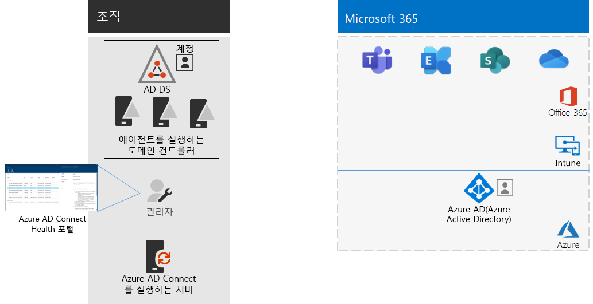

# 4단계: 사용자 계정 추가Step 4: Add your user accounts

## 클라우드 전용 ID에 대한 사용자 계정 만들기Create your user accounts for cloud-only identity

클라우드 전용 ID의 경우 Azure AD(Azure Active Directory)에서 사용자 및 그룹을 만듭니다.For cloud-only identity, create your users and groups in Azure Active Directory (Azure AD). 다음을 사용할 수 있습니다.You can use:

- Microsoft 365 관리 센터The Microsoft 365 admin center
- Azure PortalThe Azure portal
- Azure PowerShellAzure PowerShell

## 하이브리드 ID의 ID 동기화Synchronize identities for hybrid identity

*이는 하이브리드 환경의 필수 사항이며, Microsoft 365 Enterprise E3 및 E5 버전에 적용됩니다.**This is required for hybrid environments and applies to both the E3 and E5 versions of Microsoft 365 Enterprise*

이 섹션에서는 온-프레미스 AD DS(Active Directory Domain Services)를 Office 365, Microsoft Intune 및 Microsoft 365 Enterprise에 포함된 기타 클라우드 기반 서비스에서 사용하는 Azure AD 테넌트와 동기화합니다.In this section, you'll synchronize your on-premises Active Directory Domain Services (AD DS) with the Azure AD tenant used by Office 365, Microsoft Intune, and other cloud-based services included with Microsoft 365 Enterprise.

Azure AD Connect는 단일 또는 다중 포리스트 AD DS 환경에서 실제로 필요한 ID만 Azure AD 테넌트에 동기화하는 과정을 안내하는 지원되는 Microsoft 도구입니다.Azure AD Connect is the supported Microsoft tool that guides you through synchronizing only the identities you really need from single or multi-forest AD DS environments to your Azure AD tenant. 다음 그림에서는 Azure AD Connect 동기화의 기본 프로세스를 보여 줍니다.The following figure shows the basic process for Azure AD Connect synchronization.

1. 서버에서 실행되는 Azure AD Connect는 계정, 그룹 및 연락처 변경 내용을 AD DS에서 폴링합니다.Azure AD Connect running on a server polls AD DS for changes in accounts, groups, and contacts.
2. Azure AD Connect는 이러한 변경 내용을 Microsoft 365 구독의 Azure AD 테넌트로 보냅니다.Azure AD Connect sends those changes to the Azure AD tenant of your Microsoft 365 subscription.

하이브리드 ID 솔루션에서 가장 처음으로 결정할 사항은 인증 요구 사항입니다. 옵션은 다음과 같습니다.The first decision in your hybrid identity solution is your authentication requirement. The following options are options:

- **관리되는 인증**을 사용하는 경우 Azure AD는 사용자 로그인에 대한 인증 프로세스를 처리합니다. 관리되는 인증에는 다음 두 가지 방법이 있습니다.With **managed authentication**, Azure AD handles the authentication process for user sign-in. There are two methods for managed authentication: 
    - **PHS(암호 해시 동기화)**[일부 프리미엄 기능에 권장되고 필요함]**Password Hash Sync (PHS)** [Recommended and required for some premium features]. Azure AD에서 온-프레미스 디렉터리 개체에 대한 인증을 사용하도록 설정하는 가장 간단한 방법입니다.This is the simplest way to enable authentication for on-premises directory objects in Azure AD. Azure AD Connect는 AD DS에서 해시된 암호를 추출하고 암호의 보안을 강화하고 Azure AD에 동기화합니다.Azure AD Connect extracts the hashed password from AD DS, does extra security processing on the password hash, and synchronizes it to Azure AD. 자세한 내용은 [Azure AD Connect 동기화를 사용하여 암호 해시 동기화 구현](https://docs.microsoft.com/azure/active-directory/hybrid/how-to-connect-password-hash-synchronization)을 참조하세요.For more information, see [Implement password hash synchronization with Azure AD Connect sync](https://docs.microsoft.com/azure/active-directory/hybrid/how-to-connect-password-hash-synchronization).
    - **PTA(통과 인증)** 는 Azure AD 기반 서비스에 대한 간단한 암호 유효성 검사 솔루션을 제공합니다.**Pass-through Authentication (PTA)** provides a simple password validation solution for Azure AD-based services. PTA는 하나 이상의 온-프레미스 서버에서 실행되는 에이전트를 사용하여 온-프레미스 AD DS를 통해 직접 사용자 인증이 유효한지 검사합니다.PTA uses an agent running on one or more on-premises servers to validate the user authentications directly with your on-premises AD DS. 자세한 내용은 [Azure Active Directory 통과 인증으로 사용자 로그인](https://docs.microsoft.com/azure/active-directory/connect/active-directory-aadconnect-pass-through-authentication)을 참조하세요.For more information, see [User sign-in with Azure Active Directory Pass-through Authentication](https://docs.microsoft.com/azure/active-directory/connect/active-directory-aadconnect-pass-through-authentication).
- **페더레이션 인증**을 사용하는 경우 인증 프로세스는 사용자의 로그인에 대해 AD FS(Active Directory Federation Services)와 같은 ID 페더레이션 서버를 통해 다른 ID 공급자로 리디렉션됩니다. ID 공급자는 스마트 카드 기반 인증과 같은 추가 인증 방법을 제공할 수 있습니다. 자세한 내용은 [Azure Active Directory 하이브리드 ID 솔루션에 적합한 인증 방법 선택](https://docs.microsoft.com/azure/security/azure-ad-choose-authn)를 참조하세요.With **federated authentication**, the authentication process is redirected to another identity provider through an identity federation server, such as Active Directory Federation Services (AD FS), for a user’s sign-in. The identity provider can provide additional authentication methods, such as smartcard-based authentication. For more information, see [Choosing the right authentication method for your Azure Active Directory hybrid identity solution](https://docs.microsoft.com/azure/security/azure-ad-choose-authn).

Microsoft 365 Enterprise에 대한 인증과 ID모델의 개요에 대한 비디오를 시청하세요.Watch this video for an overview of identity models and authentication for Microsoft 365 Enterprise.

 

 

> [!VIDEO https://www.microsoft.com/videoplayer/embed/RE2Pjwu]

하이브리드 ID 솔루션을 확인한 후에는 [IdFix 디렉터리 동기화 오류 수정 도구](https://www.microsoft.com/download/details.aspx?id=36832)를 다운로드하고 실행하여 AD DS에서 문제를 분석합니다.After you've determined your hybrid identity solution, download and run the [IdFix Directory Synchronization Error Remediation Tool](https://www.microsoft.com/download/details.aspx?id=36832) to analyze your AD DS for issues.

IdFix 도구에서 식별된 모든 문제를 해결한 후에는 [암호 해시 동기화 구현](https://docs.microsoft.com/azure/active-directory/connect/active-directory-aadconnectsync-implement-password-hash-synchronization)에서 Azure AD Connect 도구를 설치하는 방법과 Microsoft 365 구독에 대해 온-프레미스 AD DS와 Azure AD 테넌트 간의 디렉터리 동기화를 구성하는 방법에 대한 지침을 참조하세요.After resolving all of the issues identified by the IdFix tool, see [Implement password hash synchronization](https://docs.microsoft.com/azure/active-directory/connect/active-directory-aadconnectsync-implement-password-hash-synchronization) for guidance on installing the Azure AD Connect tool and configuring directory synchronization between your on-premises AD DS and the Azure AD tenant for your Microsoft 365 subscription. 동기화가 시작되면 AD DS와 같은 온-프레미스 ID 공급자를 통해 사용자 계정 및 그룹을 유지 관리하게 됩니다.After synchronization starts, you'll maintain your user accounts and groups with your on-premises identity provider, such as AD DS.

Microsoft에서는 직원 안전과 생산성을 유지하기 위해 [ID 및 디바이스 액세스](microsoft-365-policies-configurations.md)에 대한 권장 사항을 제공합니다.Microsoft provides a set of recommendations for [identity and device access](microsoft-365-policies-configurations.md) to ensure a secure and productive workforce. 

- 하이브리드 환경에 대한 권장 요구 사항에 대해서는 [필수 구성 요소](identity-access-prerequisites.md#prerequisites) 열의 **암호 해시 동기화를 사용한 Active Directory**를 참조하세요.For recommended requirements for hybrid environments, see the **Active Directory with password hash sync** column in [prerequisites](identity-access-prerequisites.md#prerequisites). 

- 클라우드 전용 환경에 대한 권장 요구 사항에 대해서는 [필수 구성 요소](identity-access-prerequisites.md#prerequisites) 열의 **클라우드만**을 참조하세요.For recommended requirements for cloud only environments, see the **Cloud only** column in [prerequisites](identity-access-prerequisites.md#prerequisites).

Azure AD에 온-프레미스 사용자 및 그룹이 있으면 라이선스를 할당을 시작하고 비즈니스용 OneDrive 및 Exchange Online과 같은 생산성 워크로드를 사용할 수 있습니다.Once your on-premises users and groups are present in Azure AD, you can start assigning licenses and using productivity workloads such as OneDrive for Business and Exchange Online.

|||
|:-------|:-----|
|| [테스트 랩 가이드: 암호 해시 동기화Test Lab Guide: Password hash synchronization](password-hash-sync-m365-ent-test-environment.md)  [테스트 랩 가이드: 경유 인증Test Lab Guide: Pass-through authentication](pass-through-auth-m365-ent-test-environment.md) |
|||

중간 검사점으로 이 섹션에 해당하는 [종료 조건](identity-exit-criteria.md#crit-identity-sync)을 확인할 수 있습니다.As an interim checkpoint, you can see the [exit criteria](identity-exit-criteria.md#crit-identity-sync) corresponding to this section.

## 동기화 상태 모니터링Monitor synchronization health

*이 단계는 선택 사항이며 Microsoft 365 E3 및 E5 버전에 모두 적용됩니다**This is optional and applies to both the E3 and E5 versions of Microsoft 365 Enterprise*

이 섹션에서는 각 온-프레미스 AD DS 도메인 컨트롤러에 Azure AD Connect 상태 에이전트를 설치하여 Azure AD Connect에서 제공하는 ID 인프라 및 동기화 서비스를 모니터링합니다.In this section, you'll install an Azure AD Connect Health agent on each of your on-premises AD DS domain controllers to monitor your identity infrastructure and the synchronization services provided by Azure AD Connect. 모니터링 정보는 Azure AD Connect Health 포털에서 사용할 수 있습니다. 이 포털에서 경고, 성능 모니터링, 사용 현황 분석, 기타 정보를 볼 수 있습니다.The monitoring information is made available in an Azure AD Connect Health portal, where you can view alerts, performance monitoring, usage analytics, and other information.

Azure AD Connect Health 사용 방법에 대한 주요 디자인 의사 결정은 Azure AD Connect 사용 방법을 기반으로 합니다.The key design decision of how to use Azure AD Connect Health is based on how you are using Azure AD Connect:

- **관리되는 인증** 옵션을 사용하는 경우 [동기화와 함께 Azure AD Connect Health 사용](https://docs.microsoft.com/azure/active-directory/connect-health/active-directory-aadconnect-health-sync)을 시작하여 Azure AD Connect Health를 이해하고 구성합니다.If you’re using the **managed authentication** option, start with [Using Azure AD Connect Health with sync](https://docs.microsoft.com/azure/active-directory/connect-health/active-directory-aadconnect-health-sync) to understand and configure Azure AD Connect Health.
- AD FS(Active Directory Federation Services)에서 **페더레이션 인증**을 사용하여 계정 및 그룹의 이름만 동기화하는 경우 [AD FS와 함께 Azure AD Connect Health 사용](https://docs.microsoft.com/azure/active-directory/connect-health/active-directory-aadconnect-health-adfs)을 시작하여 Azure AD Connect Health를 이해하고 구성합니다.If you're synchronizing just the names of the accounts and groups using **federated authentication** with Active Directory Federation Services (AD FS), start with [Using Azure AD Connect Health with AD FS](https://docs.microsoft.com/azure/active-directory/connect-health/active-directory-aadconnect-health-adfs) to understand and configure Azure AD Connect Health.

이 섹션을 완료하면 다음과 같은 결과를 얻을 수 있습니다.When you complete this section, you’ll have:

- 온-프레미스 ID 서버에 Azure AD Connect Health 에이전트가 설치됩니다.The Azure AD Connect Health agent installed on your on-premises identity provider servers.
- Microsoft 365 구독에 대한 Azure AD 테넌트와 함께 온-프레미스 인프라 및 동기화 활동의 현재 상태가 Azure AD Connect Health 포털에 표시됩니다.The Azure AD Connect Health portal displaying the current state of your on-premises infrastructure and synchronization activities with the Azure AD tenant for your Microsoft 365 subscription.

중간 검사점으로 이 섹션에 대한 [종료 조건](identity-exit-criteria.md#crit-identity-sync-health)을 확인할 수 있습니다.As an interim checkpoint, you can see the [exit criteria](identity-exit-criteria.md#crit-identity-sync-health) for this section.

## 암호 업데이트 간소화Simplify password updates

*이 단계는 하이브리드 환경의 선택 사항이며, Microsoft 365 Enterprise E3 및 E5 버전에 적용됩니다.**This is optional for hybrid environments and applies to both the E3 and E5 versions of Microsoft 365 Enterprise*

이 부문에서 사용자는 Azure 액티브 디렉토리(Azure AD-Microsoft Azure Active Directory)를 통해 암호를 재설정할 수 있으며 로컬 액티브 디렉토리 도메인 서비스(AD DS-Active Directory Domain Services)로 복제될 수 있습니다.In this section, you'll allow users to reset their passwords through Azure Active Directory (Azure AD), which is then replicated to your local Active Directory Domain Services (AD DS). 이 과정을 암호 쓰기 저장이라고 합니다.This process is known as password writeback. 암호 쓰기 저장에서 사용자는 사용자 계정과 속성이 저장된 온 프레미스 AD DS를 통한 암호의 업데이트가 필요 없습니다.With password writeback, users don’t need to update their passwords through the on-premises AD DS where user accounts and their attributes are stored. 온-프레미스 네트워크에 대한 원격 액세스 연결이 없는 로밍 또는 원격 사용자에게 유용합니다.This is valuable to roaming or remote users who do not have a remote access connection to the on-premises network.

암호 쓰기 저장은 계정 손상의 높은 위험이 감지된 경우 사용자에게 온-프레미스 암호를 변경하도록 요구하는 등 Azure AD ID 보호 기능을 최대한 활용하기 위해 필요합니다.Password writeback is required to fully utilize Azure AD Identity Protection capabilities, such as requiring users to change their on-premises passwords when there has been a high risk of account compromise detected.

추가 정보 및 구성 지침은 [암호 쓰기 저장을 지원하는 Azure AD SSPR](https://docs.microsoft.com/azure/active-directory/active-directory-passwords-writeback)을 참조하세요.For additional information and configuration instructions, see [Azure AD SSPR with password writeback](https://docs.microsoft.com/azure/active-directory/active-directory-passwords-writeback).

>[!Note]
>가능한 최상의 환경 및 새로운 기능(릴리스될 때)을 유지하도록 최신 버전의 Azure AD Connect로 업그레이드하세요. 자세한 내용은 [Azure AD Connect의 사용자 지정 설치](https://docs.microsoft.com/azure/active-directory/connect/active-directory-aadconnect-get-started-custom)를 참조하세요.Upgrade to the latest version of Azure AD Connect to ensure the best possible experience and new features as they are released. For more information, see [Custom installation of Azure AD Connect](https://docs.microsoft.com/azure/active-directory/connect/active-directory-aadconnect-get-started-custom).
>

|||
|:-------|:-----|
|| [테스트 랩 가이드: 암호 쓰기 저장Test Lab Guide: Password writeback](password-writeback-m365-ent-test-environment.md) |
|||

중간 검사점으로 이 섹션에 대한 [종료 조건](identity-exit-criteria.md#crit-identity-pw-writeback)을 확인할 수 있습니다.As an interim checkpoint, you can see the [exit criteria](identity-exit-criteria.md#crit-identity-pw-writeback) for this section.

|||
|:-------|:-----|
|| [그룹을 사용하여 관리Use groups for management](identity-use-group-management.md) |
