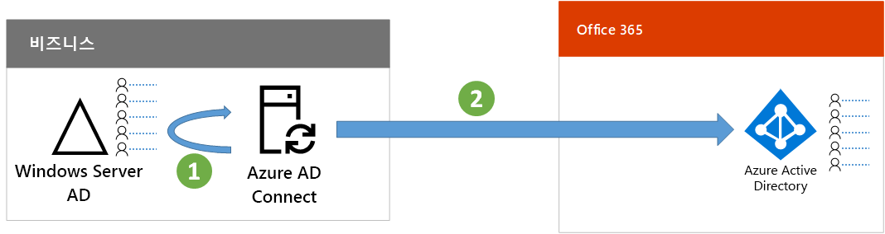

# 7단계: ID 동기화

*이 단계는 하이브리드 환경의 필수 사항이며, Microsoft 365 Enterprise E3 및 E5 버전에 적용됩니다.*

이 단계에서는 온-프레미스 Windows Server AD(Active Directory)를 Office 365 및 EMS(Enterprise Mobility + Security) 구독에서 사용하는 Azure AD(Active Directory)와 동기화합니다.

Azure AD Connect는 단일 또는 다중 포리스트 Windows Server AD 환경에서 실제로 필요한 ID만 Azure AD 테넌트에 동기화하는 과정을 안내하는 지원되는 Microsoft 도구입니다.

*Azure AD Connect에서 온-프레미스 디렉터리를 Azure AD와 동기화하는 방법*

하이브리드 ID 솔루션에서 가장 처음으로 결정할 사항은 인증 요구 사항입니다. 옵션은 다음과 같습니다.

- **관리되는 인증**을 사용하는 경우 Azure AD는 사용자 로그인에 대한 인증 프로세스를 처리합니다. 관리되는 인증에는 다음 두 가지 방법이 있습니다. 
    - **PHS(암호 해시 동기화)**[권장되며, 일부 프리미엄 기능에 필수]. Azure AD에서 온-프레미스 디렉터리 개체에 대한 인증을 사용하는 가장 간단한 방법입니다. Azure AD Connect는 Windows Server AD에서 해시된 암호를 추출하며, 암호에 대해 추가 보안 처리를 수행하지 않고 Azure AD에 저장합니다. 자세한 내용은 [Azure AD Connect 동기화를 사용하여 암호 해시 동기화 구현](https://docs.microsoft.com/azure/active-directory/connect/active-directory-aadconnectsync-implement-password-synchronization)을 참조하세요.
    - **PTA(통과 인증)** 는 Azure AD 기반 서비스에 대한 간단한 암호 유효성 검사 솔루션을 제공합니다. PTA는 하나 이상의 온-프레미스 서버에서 실행되는 에이전트를 사용하여 온-프레미스 Windows Server AD를 통해 직접 사용자 인증의 유효성을 검사합니다. 자세한 내용은 [Azure Active Directory 통과 인증으로 사용자 로그인](https://docs.microsoft.com/azure/active-directory/connect/active-directory-aadconnect-pass-through-authentication)을 참조하세요.
- **페더레이션 인증**을 사용하는 경우 인증 프로세스는 사용자의 로그인에 대해 AD FS(Active Directory Federation Services)와 같은 ID 페더레이션 서버를 통해 다른 ID 공급자로 리디렉션됩니다. ID 공급자는 스마트 카드 기반 인증과 같은 추가 인증 방법을 제공할 수 있습니다. 자세한 내용은 [Azure Active Directory 하이브리드 ID 솔루션에 적합한 인증 방법 선택](https://docs.microsoft.com/azure/security/azure-ad-choose-authn)를 참조하세요.

하이브리드 ID 솔루션을 확인한 후에는 [IdFix 디렉터리 동기화 오류 수정 도구](https://www.microsoft.com/download/details.aspx?id=36832)를 다운로드하고 실행하여 Windows Server AD에서 문제를 분석합니다.

IdFix 도구에서 식별된 모든 문제를 해결한 후에는 [암호 해시 동기화 구현](https://docs.microsoft.com/azure/active-directory/connect/active-directory-aadconnectsync-implement-password-hash-synchronization)에서 Azure AD Connect 도구를 설치하는 방법과 Office 365 및 EMS 구독에 대해 온-프레미스 Windows Server AD와 Azure AD 테넌트 간의 디렉터리 동기화를 구성하는 방법에 대한 지침을 참조하세요.

Microsoft에서는 직원 안전과 생산성을 유지하기 위해 [ID 및 디바이스 액세스](microsoft-365-policies-configurations.md)에 대한 권장 사항을 제공합니다. 
- 하이브리드 환경에 대한 권장 요구 사항에 대해서는 [필수 구성 요소](identity-access-prerequisites.md#prerequisites) 열의 **암호 해시 동기화를 사용한 Active Directory**를 참조하세요. 

- 클라우드 전용 환경에 대한 권장 요구 사항에 대해서는 [필수 구성 요소](identity-access-prerequisites.md#prerequisites) 열의 **클라우드만**을 참조하세요.

|||
|:-------|:-----|
|| [테스트 랩 가이드: 암호 해시 동기화](password-hash-sync-m365-ent-test-environment.md)  [테스트 랩 가이드: 경유 인증](pass-through-auth-m365-ent-test-environment.md) |
|||

중간 검사점으로 이 단계에 해당하는 [종료 조건](identity-exit-criteria.md#crit-identity-sync)을 확인할 수 있습니다.

## 다음 단계

|||
|:-------|:-----|
|| [동기화 상태 모니터링](identity-azure-ad-connect-health.md) |

