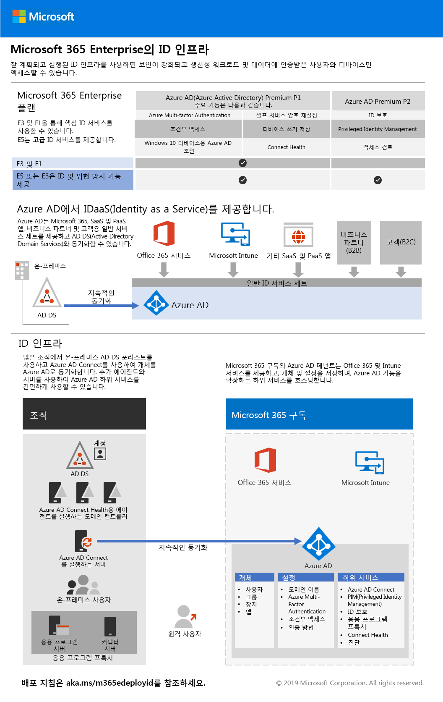

# 2단계: ID

Microsoft 365 Enterprise에서 적절히 계획되고 실행되는 ID 인프라는 인증된 사용자와 장치에서만 생산성 작업 및 데이터에 액세스할 수 있도록 하고 보안을 강화할 수 있는 방법을 제공합니다.

Microsoft 365 Enterprise에 대한 인증과 ID 모델의 개요에 대한 비디오를 시청하십시오.

 

> [!VIDEO https://www.microsoft.com/videoplayer/embed/RE2Pjwu]

>[!Note]
>ID 인프라를 이미 배포한 경우 [ID 종료 조건](identity-exit-criteria.md)을 검토하여 Microsoft 365 Enterprise에 대한 필수 및 선택적 조건을 충족하는지 확인하세요.
>

각 Microsoft 365 Enterprise 요금제의 ID 기능, Azure AD(Active Directory)의 역할, 온-프레미스 및 클라우드 기반 구성 요소, 가장 일반적인 인증 구성에 대한 자세한 내용은 [ID 인프라 포스터](../media/identity-infrastructure/M365E-ID-Infra.pdf)를 참조하세요.

이 두 페이지 포스터는 Microsoft 365 Enterprise에 대한 ID 개념과 구성을 빠르게 향상시킬 수 있는 방법입니다.

[이 포스터를 다운로드](https://github.com/MicrosoftDocs/microsoft-365-docs/raw/public/microsoft-365/media/identity-infrastructure/M365E-ID-Infra.pdf)하고 편지형, 법률형 또는 타블로이드(11 x 17) 형식으로 인쇄할 수 있습니다.

## Microsoft 365 Enterprise ID 인프라 계획 및 배포 

다음 단계를 사용하여 클라우드에서 새 ID 인프라를 계획 및 배포할 수 있습니다. 또한 이러한 단계를 사용하여 Microsoft 365 Enterprise와 함께 작동하도록 기존 온-프레미스 또는 하이브리드 ID 인프라를 조정할 수 있습니다. 

|||
|:-------|:-----|
|| [전역 관리자 계정 생성 및 보호](identity-create-protect-global-admins.md) |
|| [암호 보호](identity-secure-your-passwords.md) |
|| [사용자 로그인 보안 및 관리](identity-secure-user-sign-ins.md) |
|| [사용자 계정 추가](identity-add-user-accounts.md) |
|| [그룹을 사용하여 관리](identity-use-group-management.md) |
|| [ID 거버넌스 구성](identity-configure-identity-governance.md) |

이러한 단계를 완료했으면 이 단계에 대한 [종료 조건](identity-exit-criteria.md)으로 이동하여 Microsoft 365 Enterprise ID에 대한 필수 및 선택적 조건을 충족하는지 확인하세요.

## ID 및 장치 액세스 권장 사항

Microsoft에서는 직원 안전과 생산성을 유지하기 위해 [ID 및 디바이스 액세스](microsoft-365-policies-configurations.md)에 대한 권장 사항을 제공합니다. ID을 확인하려면 다음 문서의 권장 사항 및 설정과 함께 이 작업 단계의 다음 단계를 사용하세요.

- [필수 구성 요소](identity-access-prerequisites.md)
- [일반 ID 및 장치 액세스 정책](identity-access-policies.md)

## Microsoft에서 Microsoft 365 Enterprise를 수행하는 방법

Microsoft의 IT 전문가가 [ID와 보안 액세스를 관리하는 방법](https://www.microsoft.com/itshowcase/deploying-and-managing-microsoft-365#primaryR5)을 알아보세요.

## Contoso의 Microsoft 365 Enterprise 사용 방식

가상의 대표적 다국적 기업인 Contoso Corporation이 Microsoft 365 클라우드 서비스를 위해 [Microsoft 용 하이브리드 ID 인프라를 구축](contoso-identity.md)한 방식을 알아봅니다.

## 다음 단계

|||
|:-------|:-----|
|| [전역 관리자 계정 생성 및 보호](identity-create-protect-global-admins.md) |
