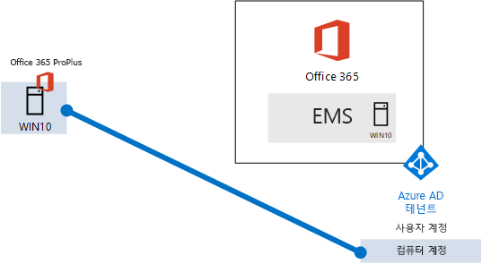
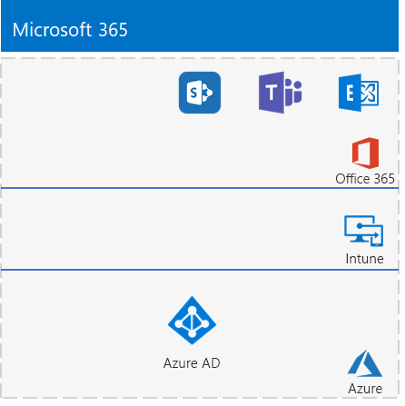

# <a name="the-lightweight-base-configuration"></a><span data-ttu-id="335b3-103">간단한 기본 구성</span><span class="sxs-lookup"><span data-stu-id="335b3-103">The lightweight base configuration</span></span>

<span data-ttu-id="335b3-104">*이 테스트 랩 가이드는 Microsoft 365 Enterprise와 Office 365 Enterprise 테스트 환경 모두에서 사용할 수 있습니다.*</span><span class="sxs-lookup"><span data-stu-id="335b3-104">*This Test Lab Guide can be used for both Microsoft 365 Enterprise and Office 365 Enterprise test environments.*</span></span>

<span data-ttu-id="335b3-105">이 문서에서는 Microsoft 365 E5 구독 및 Windows 10 Enterprise를 실행하는 컴퓨터에서 간소화된 환경을 만드는 방법에 대한 단계별 지침을 제공합니다.</span><span class="sxs-lookup"><span data-stu-id="335b3-105">This article provides you with step-by-step instructions to create a simplified environment with a Microsoft 365 E5 subscription and a computer running Windows 10 Enterprise.</span></span> 



<span data-ttu-id="335b3-107">결과로 나타난 환경을 사용하여 [Microsoft 365 Enterprise](https://www.microsoft.com/microsoft-365/enterprise)의 기능을 테스트합니다.</span><span class="sxs-lookup"><span data-stu-id="335b3-107">Use the resulting environment to test the features and functionality of [Microsoft 365 Enterprise](https://www.microsoft.com/microsoft-365/enterprise).</span></span>


  
> [!TIP]
> <span data-ttu-id="335b3-109">[여기](media/m365-enterprise-test-lab-guides/Microsoft365EnterpriseTLGStack.pdf)를 클릭하여 Microsoft 365 Enterprise 테스트 랩 가이드 스택의 모든 문서에 대한 가상 맵을 확인할 수 있습니다.</span><span class="sxs-lookup"><span data-stu-id="335b3-109">Click [here](media/m365-enterprise-test-lab-guides/Microsoft365EnterpriseTLGStack.pdf) for a visual map to all the articles in the Microsoft 365 Enterprise Test Lab Guide stack.</span></span>

## <a name="phase-1-create-your-office-365-e5-subscription"></a><span data-ttu-id="335b3-110">1단계: Office 365 E5 구독 만들기</span><span class="sxs-lookup"><span data-stu-id="335b3-110">Phase 1: Create your Office 365 E5 subscription</span></span>

<span data-ttu-id="335b3-111">Office 365 E5 평가판 구독으로 시작하여 Microsoft 365 E5 구독을 추가합니다.</span><span class="sxs-lookup"><span data-stu-id="335b3-111">We start with an Office 365 E5 trial subscription and then add the Microsoft 365 E5 subscription to it.</span></span>

<span data-ttu-id="335b3-112">Office 365 E5 평가판 구독을 시작하려면 먼저 가상의 회사 이름 및 새 Microsoft 계정이 필요합니다.</span><span class="sxs-lookup"><span data-stu-id="335b3-112">To start your Office 365 E5 trial subscription, you first need a fictitious company name and a new Microsoft account.</span></span>
  
1. <span data-ttu-id="335b3-p101">회사 이름으로 Microsoft 샘플 콘텐츠에 사용되는 가상의 회사인 Contoso의 변형을 사용하는 것이 좋지만 필수는 아닙니다. 여기에 가상의 회사 이름을 기록하세요. </span><span class="sxs-lookup"><span data-stu-id="335b3-p101">We recommend that you use a variant of the company name Contoso for your company name, which is a fictitious company used in Microsoft sample content, but it isn't required. Record your fictitious company name here: </span></span>
    
2. <span data-ttu-id="335b3-p102">새 Microsoft 계정을 등록하려면으로 [https://outlook.com](https://outlook.com)으로 이동한 후 새 전자 메일 계정 및 주소를 사용하여 계정을 만듭니다. 이 계정을 사용하여 Office 365에 등록합니다.</span><span class="sxs-lookup"><span data-stu-id="335b3-p102">To sign up for a new Microsoft account, go to [https://outlook.com](https://outlook.com) and create an account with a new email account and address. You will use this account to sign up for Office 365.</span></span>
    
  - <span data-ttu-id="335b3-117">여기에 새 계정의 이름과 성을 기록합니다. </span><span class="sxs-lookup"><span data-stu-id="335b3-117">Record the first and last name of your new account here: </span></span>
    
  - <span data-ttu-id="335b3-118">여기서 새 전자 메일 계정 주소를 기록합니다. @outlook.com</span><span class="sxs-lookup"><span data-stu-id="335b3-118">Record the new email account address here: @outlook.com</span></span>
    
### <a name="sign-up-for-an-office-365-e5-trial-subscription"></a><span data-ttu-id="335b3-119">Office 365 E5 평가판 구독 등록</span><span class="sxs-lookup"><span data-stu-id="335b3-119">Sign up for an Office 365 E5 trial subscription</span></span>

1. <span data-ttu-id="335b3-120">컴퓨터에서 인터넷 브라우저를 열고 [https://aka.ms/e5trial](https://aka.ms/e5trial)으로 이동합니다.</span><span class="sxs-lookup"><span data-stu-id="335b3-120">Open the Internet browser on your computer and go to [https://aka.ms/e5trial](https://aka.ms/e5trial).</span></span>
    
2. <span data-ttu-id="335b3-121">**Office 365 E5를 선택해 주셔서 감사합니다** 페이지에서 1단계의 새 이메일 계정 주소를 지정하십시오.</span><span class="sxs-lookup"><span data-stu-id="335b3-121">On the **Thank you for choosing Office 365 E5** page, specify, your new email account address in step 1.</span></span>
3. <span data-ttu-id="335b3-122">추적 구독 프로세스의 2단계에서 요청된 정보를 입력한 다음 확인을 수행하십시오.</span><span class="sxs-lookup"><span data-stu-id="335b3-122">In step 2 of the trail subscription process, type the requested information, and then perform the verification.</span></span>
4. <span data-ttu-id="335b3-123">3단계에서 조직 이름과 구독의 글로벌 관리자가 될 계정 이름을 입력하십시오.</span><span class="sxs-lookup"><span data-stu-id="335b3-123">In step 3, type an organization name and then an account name that will be the global admin for the subscription.</span></span> 
5. <span data-ttu-id="335b3-124">4단계를 위해, 여기에 로그인 페이지를 기록합니다(선택하고 복사하기). </span><span class="sxs-lookup"><span data-stu-id="335b3-124">For step 4, record the sign-in page here (select and copy): </span></span> 
6. <span data-ttu-id="335b3-125">여기에 사용자 ID를 기록합니다. .onmicrosoft.com</span><span class="sxs-lookup"><span data-stu-id="335b3-125">Record the user ID here (select and copy): .onmicrosoft.com</span></span>  
   <span data-ttu-id="335b3-126">입력한 암호를 안전한 위치에 기록해 둡니다.</span><span class="sxs-lookup"><span data-stu-id="335b3-126">Record the password that you typed in a secure location.</span></span>
   <span data-ttu-id="335b3-127">이 값은 **Office 365 전역 관리자 이름**으로 사용됩니다.</span><span class="sxs-lookup"><span data-stu-id="335b3-127">This value will be referred to as the **Office 365 global administrator name**.</span></span>
8. <span data-ttu-id="335b3-128">**설정으로 이동**을 클릭합니다.</span><span class="sxs-lookup"><span data-stu-id="335b3-128">Click **Go to Setup**.</span></span>
9. <span data-ttu-id="335b3-129">Office 365 E5 설정에서 **전자 메일 및 로그인에 대해 *조직*.onmicrosoft.com 계속 사용**을 클릭한 다음 **종료 및 나중에 계속**을 클릭합니다.</span><span class="sxs-lookup"><span data-stu-id="335b3-129">In Office 365 E5 Setup, click **Continue using *your organization*.onmicrosoft.com for email and signing in**, and then click **Exit and continue later**.</span></span>

<span data-ttu-id="335b3-130">Microsoft 365 관리 센터가 나타납니다.</span><span class="sxs-lookup"><span data-stu-id="335b3-130">You should see the Microsoft 365 admin center.</span></span>
  
<span data-ttu-id="335b3-131">우리는 사용자의 Office 365의 평가판 구독을 생성하여 테스트 환경에 사용자가 현재 보유하고 있는 유료 구독과 별도의 Azure AD 테넌트를 보유하게 합니다.</span><span class="sxs-lookup"><span data-stu-id="335b3-131">We have you create a trial subscription of Office 365 so that your dev/test environment has a separate Azure AD tenant from any paid subscriptions you currently have.</span></span> <span data-ttu-id="335b3-132">이러한 분리는 프로덕션 구독에 영향을 주지 않고 테스트 테넌트의 사용자 및 그룹을 추가 및 제거할 수 있음을 의미합니다.</span><span class="sxs-lookup"><span data-stu-id="335b3-132">This separation means you can add and remove users and groups in the test tenant without affecting your production subscriptions.</span></span>
    
## <a name="phase-2-configure-your-office-365-trial-subscription"></a><span data-ttu-id="335b3-133">2단계: Office 365 평가판 구독 구성</span><span class="sxs-lookup"><span data-stu-id="335b3-133">Phase 2: Configure your Office 365 trial subscription</span></span>

<span data-ttu-id="335b3-134">이 단계에서는 추가 사용자로 Office 365 구독을 구성하고 Office 365 E5 라이선스를 할당합니다.</span><span class="sxs-lookup"><span data-stu-id="335b3-134">In this phase, you configure your Office 365 subscription with additional users and assign them Office 365 E5 licenses.</span></span>
  
<span data-ttu-id="335b3-135">[Office 365 PowerShell에 연결](https://docs.microsoft.com/office365/enterprise/powershell/connect-to-office-365-powershell#connect-with-the-azure-active-directory-powershell-for-graph-module)의 지침을 사용하여 컴퓨터에서 그래프 모듈용 Azure Active Directory PowerShell을 사용하여 Office 365 구독에 연결합니다.</span><span class="sxs-lookup"><span data-stu-id="335b3-135">Use the instructions in [Connect to Office 365 PowerShell](https://docs.microsoft.com/office365/enterprise/powershell/connect-to-office-365-powershell#connect-with-the-azure-active-directory-powershell-for-graph-module) to connect to your Office 365 subscription with the Azure Active Directory PowerShell for Graph module from your computer.</span></span>
    
<span data-ttu-id="335b3-136">**Windows PowerShell 자격 증명 요청** 대화 상자에서 Office 365 전역 관리자 이름(예: jdoe@contosotoycompany.onmicrosoft.com)과 암호를 입력합니다.</span><span class="sxs-lookup"><span data-stu-id="335b3-136">In the Windows PowerShell Credential Request dialog box, type the Office 365 global administrator name (example: jdoe@contosotoycompany.onmicrosoft.com) and password.</span></span>
  
<span data-ttu-id="335b3-137">조직 이름(예 : contosotoycompany), 위치에 대한 2 자리 국가 코드, 공통 계정 암호를 입력 한 다음 PowerShell 프롬프트에서 다음 명령을 실행합니다.</span><span class="sxs-lookup"><span data-stu-id="335b3-137">Fill in your organization name (example: contosotoycompany), the two-character country code for your location, a common account password, and then run the following commands from the PowerShell prompt:</span></span>

```powershell
$orgName="<organization name>"
$loc="<two-character country code, such as US>"
$commonPW="<common user account password>"
$PasswordProfile=New-Object -TypeName Microsoft.Open.AzureAD.Model.PasswordProfile
$PasswordProfile.Password=$commonPW

$userUPN= "user2@" + $orgName + ".onmicrosoft.com"
New-AzureADUser -DisplayName "User 2" -GivenName User -SurName 2 -UserPrincipalName $userUPN -UsageLocation $loc -AccountEnabled $true -PasswordProfile $PasswordProfile -MailNickName "user2"
$License = New-Object -TypeName Microsoft.Open.AzureAD.Model.AssignedLicense
$License.SkuId = (Get-AzureADSubscribedSku | Where-Object -Property SkuPartNumber -Value "ENTERPRISEPREMIUM" -EQ).SkuID
$LicensesToAssign = New-Object -TypeName Microsoft.Open.AzureAD.Model.AssignedLicenses
$LicensesToAssign.AddLicenses = $License
Set-AzureADUserLicense -ObjectId $userUPN -AssignedLicenses $LicensesToAssign

$userUPN= "user3@" + $orgName + ".onmicrosoft.com"
New-AzureADUser -DisplayName "User 3" -GivenName User -SurName 3 -UserPrincipalName $userUPN -UsageLocation $loc -AccountEnabled $true -PasswordProfile $PasswordProfile -MailNickName "user3"
$License = New-Object -TypeName Microsoft.Open.AzureAD.Model.AssignedLicense
$License.SkuId = (Get-AzureADSubscribedSku | Where-Object -Property SkuPartNumber -Value "ENTERPRISEPREMIUM" -EQ).SkuID
$LicensesToAssign = New-Object -TypeName Microsoft.Open.AzureAD.Model.AssignedLicenses
$LicensesToAssign.AddLicenses = $License
Set-AzureADUserLicense -ObjectId $userUPN -AssignedLicenses $LicensesToAssign

$userUPN= "user4@" + $orgName + ".onmicrosoft.com"
New-AzureADUser -DisplayName "User 4" -GivenName User -SurName 4 -UserPrincipalName $userUPN -UsageLocation $loc -AccountEnabled $true -PasswordProfile $PasswordProfile -MailNickName "user4"
$License = New-Object -TypeName Microsoft.Open.AzureAD.Model.AssignedLicense
$License.SkuId = (Get-AzureADSubscribedSku | Where-Object -Property SkuPartNumber -Value "ENTERPRISEPREMIUM" -EQ).SkuID
$LicensesToAssign = New-Object -TypeName Microsoft.Open.AzureAD.Model.AssignedLicenses
$LicensesToAssign.AddLicenses = $License
Set-AzureADUserLicense -ObjectId $userUPN -AssignedLicenses $LicensesToAssign
```
> [!NOTE]
> <span data-ttu-id="335b3-138">여기서 공통 암호를 사용하는 것은 테스트 환경을 위한 구성을 쉽게 하고 자동화하기 위한 것입니다.</span><span class="sxs-lookup"><span data-stu-id="335b3-138">The use of a common password here is for automation and ease of configuration for a dev/test environment.</span></span> <span data-ttu-id="335b3-139">물론 프로덕션 구독에서는 공통 암호를 사용하지 않는 것이 좋습니다.</span><span class="sxs-lookup"><span data-stu-id="335b3-139">Obviously, this is highly discouraged for production subscriptions.</span></span> 

### <a name="record-key-information-for-future-reference"></a><span data-ttu-id="335b3-140">나중에 참조할 수 있도록 주요 정보 기록</span><span class="sxs-lookup"><span data-stu-id="335b3-140">Record key information for future reference</span></span>

<span data-ttu-id="335b3-141">이 문서를 인쇄하여 30일 동안의 Office 365 평가판 구독 기간 동안 환경에 필요한 특정 정보를 기록할 수 있습니다.</span><span class="sxs-lookup"><span data-stu-id="335b3-141">You might want to print this article to record the specific information that you will need for this environment over the 30 days of the Office 365 trial subscription.</span></span> <span data-ttu-id="335b3-142">추가 30일 동안 평가판 구독을 쉽게 연장할 수 있습니다.</span><span class="sxs-lookup"><span data-stu-id="335b3-142">You can easily extend the trail subscription for another 30 days.</span></span> <span data-ttu-id="335b3-143">영구 테스트 환경의 경우 별도의 Azure AD 테넌트와 소수의 라이선스를 사용해서 유료 구독을 새로 만듭니다.</span><span class="sxs-lookup"><span data-stu-id="335b3-143">For a permanent dev/test environment, create a new paid subscription with a separate Azure AD tenant and a small number of licenses.</span></span>

<span data-ttu-id="335b3-144">다음 값을 기록합니다.</span><span class="sxs-lookup"><span data-stu-id="335b3-144">Record these values:</span></span>
  
- <span data-ttu-id="335b3-145">Office 365 전역 관리자 이름: .onmicrosoft.com(작업 단계 1의 6단계)</span><span class="sxs-lookup"><span data-stu-id="335b3-145">Office 365 global administrator name: .onmicrosoft.com (from step 9 of Phase 2)</span></span>
    
    <span data-ttu-id="335b3-146">이 계정의 암호도 안전한 위치에 적어둡니다.</span><span class="sxs-lookup"><span data-stu-id="335b3-146">Also record the password for this account in a secure location.</span></span>
    
- <span data-ttu-id="335b3-147">평가판 구독 조직 이름: (작업 단계 1의 4단계)</span><span class="sxs-lookup"><span data-stu-id="335b3-147">Your trial subscription organization name:  (from step 4 of Phase 2)</span></span>
    
- <span data-ttu-id="335b3-148">사용자 2, 사용자 3, 사용자 4, 사용자 5에 대한 계정을 나열하려면 Windows PowerShell 프롬프트에 대한 Microsoft Azure Active Directory 모듈에서 다음 명령을 실행합니다.</span><span class="sxs-lookup"><span data-stu-id="335b3-148">To list the accounts for User 2, User 3, User 4, and User 5, run the following command from the Windows Azure Active Directory Module for Windows PowerShell prompt:</span></span>
    
  ```powershell
  Get-AzureADUser | Sort UserPrincipalName | Select UserPrincipalName
  ```

    <span data-ttu-id="335b3-149">여기에 계정 이름을 기록합니다.</span><span class="sxs-lookup"><span data-stu-id="335b3-149">Record the account names here:</span></span>
    
  - <span data-ttu-id="335b3-150">사용자 2 계정 이름: user2@.onmicrosoft.com</span><span class="sxs-lookup"><span data-stu-id="335b3-150">User 2 account name: user2@.onmicrosoft.com</span></span>
    
  - <span data-ttu-id="335b3-151">사용자 3 계정 이름: user3@.onmicrosoft.com</span><span class="sxs-lookup"><span data-stu-id="335b3-151">User 3 account name: user3@.onmicrosoft.com</span></span>
    
  - <span data-ttu-id="335b3-152">사용자 4 계정 이름: user4@.onmicrosoft.com</span><span class="sxs-lookup"><span data-stu-id="335b3-152">User 4 account name: user4@.onmicrosoft.com</span></span>
    
  - <span data-ttu-id="335b3-153">사용자 5 계정 이름: user5@.onmicrosoft.com</span><span class="sxs-lookup"><span data-stu-id="335b3-153">User 5 account name: user5@.onmicrosoft.com</span></span>
    
    <span data-ttu-id="335b3-154">해당 계정의 공통 암호도 안전한 위치에 적어둡니다.</span><span class="sxs-lookup"><span data-stu-id="335b3-154">Also record the common password for these accounts in a secure location.</span></span>
   

### <a name="using-an-office-365-test-environment"></a><span data-ttu-id="335b3-155">Office 365 테스트 환경 사용</span><span class="sxs-lookup"><span data-stu-id="335b3-155">Using an Office 365 dev/test environment</span></span>

<span data-ttu-id="335b3-156">Office 365 테스트 환경만을 필요로 하는 경우 여기에서 중단할 수 있습니다.</span><span class="sxs-lookup"><span data-stu-id="335b3-156">If all you need is an Office 365 dev/test environment, you can stop here.</span></span> 

<span data-ttu-id="335b3-157">Office 365 및 Microsoft 365 모두에 적용되는 추가 테스트 랩 가이드는 [Microsoft 365 Enterprise 테스트 랩 가이드](m365-enterprise-test-lab-guides.md)를 참조하세요.</span><span class="sxs-lookup"><span data-stu-id="335b3-157">See [Microsoft 365 Enterprise Test Lab Guides](m365-enterprise-test-lab-guides.md) for additional Test Lab Guides that apply to both Office 365 and Microsoft 365.</span></span>
  
## <a name="phase-3-add-a-microsoft-365-e5-trial-subscription"></a><span data-ttu-id="335b3-158">3단계: Microsoft 365 E5 평가판 구독 추가.</span><span class="sxs-lookup"><span data-stu-id="335b3-158">Phase 3: Add a Microsoft 365 E5 trial subscription</span></span>

<span data-ttu-id="335b3-159">이 단계에서는 Microsoft 365 E5 평가판 구독을 등록하고 Office 365 E5 평가판 구독과 동일한 조직에 추가합니다.</span><span class="sxs-lookup"><span data-stu-id="335b3-159">In this phase, you sign up for the Microsoft 365 E5 trial subscription and add it to the same organization as your Office 365 E5 trial subscription.</span></span>
  
<span data-ttu-id="335b3-160">우선, Microsoft 365 E5 평가판 구독을 추가하고 전역 관리자 계정에 새로운 Microsoft 365 라이선스를 할당합니다.</span><span class="sxs-lookup"><span data-stu-id="335b3-160">First, add the Microsoft 365 E5 trial subscription and assign a Microsoft 365 license to your global administrator account.</span></span>
  
1. <span data-ttu-id="335b3-161">인터넷 브라우저의 개인 인스턴스를 사용하고 전역 관리자 계정 자격 증명으로 [https://admin.microsoft.com](https://admin.microsoft.com)의 Microsoft 365 관리 센터에 로그인합니다.</span><span class="sxs-lookup"><span data-stu-id="335b3-161">With a private instance of an Internet browser, sign in to the Microsoft 365 admin center at [https://admin.microsoft.com](https://admin.microsoft.com) with your global administrator account credentials.</span></span>
    
2. <span data-ttu-id="335b3-162">**Microsoft 365 관리 센터** 페이지에 있는 왼쪽 탐색 영역에서 **대금 청구 > 서비스 구매**를 차례로 클릭합니다.</span><span class="sxs-lookup"><span data-stu-id="335b3-162">On the **Microsoft 365 admin center** page, in the left navigation, click **Billing > Purchase services**.</span></span>
    
3. <span data-ttu-id="335b3-163">**구입 서비스** 페이지에서 **Microsoft 365 E5**를 클릭한 다음 **무료 평가판 받기**를 클릭합니다.</span><span class="sxs-lookup"><span data-stu-id="335b3-163">On the **Purchase services** page, click **Microsoft 365 E5**, and then click **Get free trial**.</span></span>

4. <span data-ttu-id="335b3-164">**Microsoft 365 E5 평가판** 페이지에서 텍스트 또는 전화를 받도록 선택한 다음, 전화 번호를 입력하고, **문자 받기** 또는 **전화 받기**를 클릭합니다.</span><span class="sxs-lookup"><span data-stu-id="335b3-164">On the **Microsoft 365 E5 Trial** page, choose to receive a text or a call, enter your phone number, then click **Text me** or **Call me**.</span></span> <span data-ttu-id="335b3-165">인증을 수행합니다.</span><span class="sxs-lookup"><span data-stu-id="335b3-165">Perform the verification.</span></span>

5. <span data-ttu-id="335b3-166">**주문 확인** 페이지에서 **지금 평가판 사용**을 클릭합니다.</span><span class="sxs-lookup"><span data-stu-id="335b3-166">On the **Confirm your order** page, click **Try now**.</span></span>

6. <span data-ttu-id="335b3-167">**주문 접수** 페이지에서 **계속**을 클릭합니다.</span><span class="sxs-lookup"><span data-stu-id="335b3-167">On the **Order receipt** page, click **Continue**.</span></span>

7. <span data-ttu-id="335b3-168">Microsoft 365 관리 센터에서 **사용자> 활성 사용자**를 클릭하십시오.</span><span class="sxs-lookup"><span data-stu-id="335b3-168">On the Microsoft 365 admin center tab, click **Users > Active users**.</span></span>

8. <span data-ttu-id="335b3-169">**활성 사용자**에서 관리자 계정을 클릭합니다.</span><span class="sxs-lookup"><span data-stu-id="335b3-169">In **Active users**, click your administrator account.</span></span>

9. <span data-ttu-id="335b3-170">**라이선스와 앱**을 클릭합니다.</span><span class="sxs-lookup"><span data-stu-id="335b3-170">Click **Licenses and apps**.</span></span>

10. <span data-ttu-id="335b3-171">Office 365 Enterprise E5의 라이센스를 비활성화하고 Microsoft 365 E5의 라이센스를 활성화합니다.</span><span class="sxs-lookup"><span data-stu-id="335b3-171">Turn off the license for Office 365 Enterprise E5 and turn on the license for Microsoft 365 E5.</span></span>

11. <span data-ttu-id="335b3-172">**변경 내용 저장**을 클릭한 다음 사용자 계정 정보 창을 닫습니다.</span><span class="sxs-lookup"><span data-stu-id="335b3-172">Click **Save changes** and then close the user account information pane.</span></span>

<span data-ttu-id="335b3-173">다음, 다른 모든 계정 (사용자 2, 사용자 3, 사용자 4 및 사용자 5)에 대해 이전 절차의 8단계에서 11단계를 반복합니다.</span><span class="sxs-lookup"><span data-stu-id="335b3-173">Next, repeat steps 8 through 11 of the previous procedure for all of your other accounts (User 2, User 3, User 4, and User 5).</span></span>
  
> [!NOTE]
> <span data-ttu-id="335b3-174">Microsoft 365 E5 평가판 구독은 30일입니다.</span><span class="sxs-lookup"><span data-stu-id="335b3-174">The Microsoft 365 E5 trial subscription is 30 days.</span></span> <span data-ttu-id="335b3-175">영구 테스트 환경의 경우 소수의 라이선스를 사용해서 이 평가판 구독을 유료 구독으로 전환합니다.</span><span class="sxs-lookup"><span data-stu-id="335b3-175">For a permanent test environment, convert this trial subscription to a paid subscription with a small number of licenses.</span></span> 
  
<span data-ttu-id="335b3-176">이제 테스트 환경에는 다음이 구현됩니다.</span><span class="sxs-lookup"><span data-stu-id="335b3-176">Your test environment now has:</span></span>
  
- <span data-ttu-id="335b3-177">Microsoft 365 E5 평가판 구독.</span><span class="sxs-lookup"><span data-stu-id="335b3-177">A Microsoft 365 E5 trial subscription.</span></span>
- <span data-ttu-id="335b3-178">모든 해당 사용자 계정(전역 관리자만 또는 5개의 사용자 계정 모두)이 Microsoft 365 E5를 사용하도록 설정됩니다.</span><span class="sxs-lookup"><span data-stu-id="335b3-178">All your appropriate user accounts (either just the global administrator or all five user accounts) are enabled to use Microsoft 365 E5.</span></span>
    
<span data-ttu-id="335b3-179">다음에서는 구성 결과, Microsoft 365 E5를 추가하는 계정, Office 365 및 EMS(Enterprise Security + Management)를 포함하는 계정을 보여줍니다.</span><span class="sxs-lookup"><span data-stu-id="335b3-179">Here is your resulting configuration, which adds Microsoft 365 E5, which includes both Office 365 and Enterprise Security + Management (EMS).</span></span>
  

  
## <a name="phase-4-create-a-windows-10-enterprise-computer"></a><span data-ttu-id="335b3-181">4단계: Windows 10 Enterprise 컴퓨터 만들기</span><span class="sxs-lookup"><span data-stu-id="335b3-181">Phase 4: Create a Windows 10 Enterprise computer</span></span>

<span data-ttu-id="335b3-182">이 단계에서는 Windows 10 Enterprise를 실행하는 독립 실행형 컴퓨터를 실제 컴퓨터, 가상 머신 또는 Azure Virtual Machine으로 만듭니다.</span><span class="sxs-lookup"><span data-stu-id="335b3-182">In this phase, you create a standalone computer running Windows 10 Enterprise as either a physical computer, a virtual machine, or an Azure virtual machine.</span></span>
  
### <a name="physical-computer"></a><span data-ttu-id="335b3-183">실제 컴퓨터</span><span class="sxs-lookup"><span data-stu-id="335b3-183">Physical computer</span></span>

<span data-ttu-id="335b3-p109">개인용 컴퓨터를 구한 후 Windows 10 Enterprise를 설치합니다. Windows 10 Enterprise 평가판을 [여기](https://www.microsoft.com/evalcenter/evaluate-windows-10-enterprise)에서 다운로드할 수 있습니다.</span><span class="sxs-lookup"><span data-stu-id="335b3-p109">Obtain a personal computer and install Windows 10 Enterprise on it. You can download the Windows 10 Enterprise trial [here](https://www.microsoft.com/evalcenter/evaluate-windows-10-enterprise).</span></span>
  
### <a name="virtual-machine"></a><span data-ttu-id="335b3-186">가상 컴퓨터</span><span class="sxs-lookup"><span data-stu-id="335b3-186">Virtual machine</span></span>

<span data-ttu-id="335b3-p110">사용자가 선택한 하이퍼바이저를 사용하여 가상 머신을 만들고 Windows 10 Enterprise를 설치합니다. Windows 10 Enterprise 평가판을 [여기](https://www.microsoft.com/evalcenter/evaluate-windows-10-enterprise)에서 다운로드할 수 있습니다.</span><span class="sxs-lookup"><span data-stu-id="335b3-p110">Create a virtual machine using the hypervisor of your choice and install Windows 10 Enterprise on it. You can download the Windows 10 Enterprise trial [here](https://www.microsoft.com/evalcenter/evaluate-windows-10-enterprise).</span></span>
  
### <a name="virtual-machine-in-azure"></a><span data-ttu-id="335b3-189">Azure의 가상 머신</span><span class="sxs-lookup"><span data-stu-id="335b3-189">Virtual machine in Azure</span></span>

<span data-ttu-id="335b3-p111">Microsoft Azure에서 Windows 10 가상 머신을 만들려면 Windows 10 Enterprise에 대한 이미지에 액세스할 수 있는 ***Visual Studio 기반 구독이 있어야 합니다***. 다른 유형의 Azure 구독(예: 평가판 및 유료 구독)으로는 이 이미지에 액세스할 수 없습니다. 최신 정보를 보려면 [개발/테스트 시나리오에 Azure의 Windows 클라이언트 사용](https://docs.microsoft.com/azure/virtual-machines/windows/client-images)을 참조하세요.</span><span class="sxs-lookup"><span data-stu-id="335b3-p111">To create a Windows 10 virtual machine in Microsoft Azure, ***you must have a Visual Studio-based subscription***, which has access to the image for Windows 10 Enterprise. Other types of Azure subscriptions, such as trial and paid subscriptions, do not have access to this image. For the latest information, see [Use Windows client in Azure for dev/test scenarios](https://docs.microsoft.com/azure/virtual-machines/windows/client-images).</span></span>
  
> [!NOTE]
> <span data-ttu-id="335b3-p112">다음 명령에서는 최신 버전의 Azure PowerShell을 사용합니다. [Azure PowerShell cmdlet 시작](https://docs.microsoft.com/powershell/azureps-cmdlets-docs/)을 참조하세요. 이러한 명령 집합은 WIN10이라는 Windows 10 Enterprise 가상 머신과 리소스 그룹, 저장소 계정 및 가상 네트워크를 포함하는 모든 필수 인프라를 빌드합니다. Azure 인프라 서비스에 이미 익숙한 경우 혅 배포된 인프라에 맞게 이러한 지침을 조정하세요.</span><span class="sxs-lookup"><span data-stu-id="335b3-p112">The following command sets use the latest version of Azure PowerShell. See [Get started with Azure PowerShell cmdlets](https://docs.microsoft.com/powershell/azureps-cmdlets-docs/). These command sets build a Windows 10 Enterprise virtual machine named WIN10 and all of its required infrastructure, including a resource group, a storage account, and a virtual network. If you are already familiar with Azure infrastructure services, please adapt these instructions to suit your currently deployed infrastructure.</span></span> 
  
<span data-ttu-id="335b3-197">먼저 Microsoft PowerShell 프롬프트를 시작합니다.</span><span class="sxs-lookup"><span data-stu-id="335b3-197">First, start a Microsoft PowerShell prompt.</span></span>
  
<span data-ttu-id="335b3-198">다음 명령을 사용하여 Azure 계정에 로그인합니다.</span><span class="sxs-lookup"><span data-stu-id="335b3-198">Sign in to your Azure account with the following command.</span></span>
  
```powershell
Connect-AzAccount
```

<span data-ttu-id="335b3-199">다음 명령을 사용하여 구독 이름을 가져옵니다.</span><span class="sxs-lookup"><span data-stu-id="335b3-199">Get your subscription name using the following command.</span></span>
  
```powershell
Get-AzSubscription | Sort Name | Select Name
```

<span data-ttu-id="335b3-p113">Azure 구독을 설정합니다. \< 및 > 문자를 포함하여 따옴표 안에 있는 모든 것을 올바른 이름으로 바꿉니다.</span><span class="sxs-lookup"><span data-stu-id="335b3-p113">Set your Azure subscription. Replace everything within the quotes, including the \< and > characters, with the correct name.</span></span>
  
```powershell
$subscr="<subscription name>"
Get-AzSubscription -SubscriptionName $subscr | Select-AzSubscription
```

<span data-ttu-id="335b3-p114">다음으로 새 리소스 그룹을 만듭니다. 고유한 리소스 그룹 이름을 확인하려면 이 명령을 사용하여 기존 리소스 그룹을 나열합니다.</span><span class="sxs-lookup"><span data-stu-id="335b3-p114">Next, create a new resource group. To determine a unique resource group name, use this command to list your existing resource groups.</span></span>
  
```powershell
Get-AzResourceGroup | Sort ResourceGroupName | Select ResourceGroupName
```

<span data-ttu-id="335b3-p115">이러한 명령을 사용하여 새 리소스 그룹을 만듭니다. \< 및 > 문자를 포함하여 따옴표 안에 있는 모든 내용을 올바른 이름으로 바꿉니다.</span><span class="sxs-lookup"><span data-stu-id="335b3-p115">Create your new resource group with these commands. Replace everything within the quotes, including the \< and > characters, with the correct names.</span></span>
  
```powershell
$rgName="<resource group name>"
$locName="<location name, such as West US>"
New-AzResourceGroup -Name $rgName -Location $locName
```

<span data-ttu-id="335b3-p116">그런 후 다음 명령을 사용하여 새 가상 네트워크와 WIN10 가상 머신을 만듭니다. 메시지가 표시되면 WIN10의 로컬 관리자 계정에 대한 이름 및 암호를 제공하고 이러한 항목을 안전한 장소에 저장합니다.</span><span class="sxs-lookup"><span data-stu-id="335b3-p116">Next, you create a new virtual network and the WIN10 virtual machine with these commands. When prompted, provide the name and password of the local administrator account for WIN10 and store these in a secure location.</span></span>
  
```powershell
$corpnetSubnet=New-AzVirtualNetworkSubnetConfig -Name Corpnet -AddressPrefix 10.0.0.0/24
New-AzVirtualNetwork -Name "M365Ent-TestLab" -ResourceGroupName $rgName -Location $locName -AddressPrefix 10.0.0.0/8 -Subnet $corpnetSubnet
$rule1=New-AzNetworkSecurityRuleConfig -Name "RDPTraffic" -Description "Allow RDP to all VMs on the subnet" -Access Allow -Protocol Tcp -Direction Inbound -Priority 100 -SourceAddressPrefix Internet -SourcePortRange * -DestinationAddressPrefix * -DestinationPortRange 3389
New-AzNetworkSecurityGroup -Name Corpnet -ResourceGroupName $rgName -Location $locName -SecurityRules $rule1
$vnet=Get-AzVirtualNetwork -ResourceGroupName $rgName -Name "M365Ent-TestLab"
$nsg=Get-AzNetworkSecurityGroup -Name Corpnet -ResourceGroupName $rgName
Set-AzVirtualNetworkSubnetConfig -VirtualNetwork $vnet -Name Corpnet -AddressPrefix "10.0.0.0/24" -NetworkSecurityGroup $nsg
$vnet | Set-AzVirtualNetwork
$pip=New-AzPublicIpAddress -Name WIN10-PIP -ResourceGroupName $rgName -Location $locName -AllocationMethod Dynamic
$nic=New-AzNetworkInterface -Name WIN10-NIC -ResourceGroupName $rgName -Location $locName -SubnetId $vnet.Subnets[0].Id -PublicIpAddressId $pip.Id
$vm=New-AzVMConfig -VMName WIN10 -VMSize Standard_A2_V2
$cred=Get-Credential -Message "Type the name and password of the local administrator account for WIN10."
$vm=Set-AzVMOperatingSystem -VM $vm -Windows -ComputerName WIN10 -Credential $cred -ProvisionVMAgent -EnableAutoUpdate
$vm=Set-AzVMSourceImage -VM $vm -PublisherName MicrosoftWindowsDesktop -Offer Windows-10 -Skus RS3-Pro -Version "latest"
$vm=Add-AzVMNetworkInterface -VM $vm -Id $nic.Id
$vm=Set-AzVMOSDisk -VM $vm -Name WIN10-TestLab-OSDisk -DiskSizeInGB 128 -CreateOption FromImage
New-AzVM -ResourceGroupName $rgName -Location $locName -VM $vm
```

## <a name="phase-5-join-your-windows-10-computer-to-azure-ad"></a><span data-ttu-id="335b3-208">5단계: Azure AD에 Windows 10 컴퓨터 가입</span><span class="sxs-lookup"><span data-stu-id="335b3-208">Phase 5: Join your Windows 10 computer to Azure AD</span></span>

<span data-ttu-id="335b3-209">Windows 10 Enterprise가 있는 실제 또는 가상 머신을 만든 후에 로컬 관리자 계정으로 로그인합니다.</span><span class="sxs-lookup"><span data-stu-id="335b3-209">After the physical or virtual machine with Windows 10 Enterprise is created, sign in with a local administrator account.</span></span>
  
> [!NOTE]
> <span data-ttu-id="335b3-210">Azure에 있는 가상 머신에는 [다음 지침](https://docs.microsoft.com/azure/virtual-machines/windows/connect-logon)에 따라 연결합니다.</span><span class="sxs-lookup"><span data-stu-id="335b3-210">For a virtual machine in Azure, connect to it using [these instructions](https://docs.microsoft.com/azure/virtual-machines/windows/connect-logon).</span></span>
  
<span data-ttu-id="335b3-211">다음으로, WIN10 컴퓨터를 Microsoft 365 E5 구독의 Azure AD 테넌트에 가입합니다.</span><span class="sxs-lookup"><span data-stu-id="335b3-211">Next, join the WIN10 computer to the Azure AD tenant of your Microsoft 365 E5 subscription.</span></span>
  
1. <span data-ttu-id="335b3-212">WIN10 컴퓨터의 데스크톱에서 **시작 > 설정 > 계정 > 회사 또는 학교 액세스 > 연결**을 클릭합니다.</span><span class="sxs-lookup"><span data-stu-id="335b3-212">At the desktop of the WIN10 computer, click **Start > Settings > Accounts > Access work or school > Connect**.</span></span>
    
2. <span data-ttu-id="335b3-213">**회사 또는 학교 계정 설정** 대화 상자에서 **Azure Active Directory에 이 장치 가입**을 클릭합니다.</span><span class="sxs-lookup"><span data-stu-id="335b3-213">In the **Set up a work or school account** dialog box, click **Join this device to Azure Active Directory**.</span></span>
    
3. <span data-ttu-id="335b3-214">**회사 또는 학교 계정**에서 Microsoft 365 E5 구독의 전역 관리자 계정 이름을 입력하고 **다음**을 클릭합니다.</span><span class="sxs-lookup"><span data-stu-id="335b3-214">In **Work or school account**, type the global administrator account name of your Microsoft 365 E5 subscription, and then click **Next**.</span></span>
    
4. <span data-ttu-id="335b3-215">**암호 입력**에 전역 관리자 계정의 암호를 입력하고 **로그인**을 클릭합니다.</span><span class="sxs-lookup"><span data-stu-id="335b3-215">In **Enter password**, type the password for your global administrator account, and then click **Sign in**.</span></span>
    
5. <span data-ttu-id="335b3-216">사용자의 조직이 맞는지 묻는 메시지가 표시되면 **가입**을 클릭하고 **완료**를 클릭합니다.</span><span class="sxs-lookup"><span data-stu-id="335b3-216">When prompted to make sure this is your organization, click **Join**, and then click **Done**.</span></span>
    
6. <span data-ttu-id="335b3-217">설정 창을 닫습니다.</span><span class="sxs-lookup"><span data-stu-id="335b3-217">Close the settings window.</span></span>
    
<span data-ttu-id="335b3-218">다음으로, WIN10 컴퓨터에 Office 365 ProPlus를 설치합니다.</span><span class="sxs-lookup"><span data-stu-id="335b3-218">Next, install Office 365 ProPlus on the WIN10 computer.</span></span>
  
1. <span data-ttu-id="335b3-219">Microsoft Edge 브라우저를 열고 글로벌 관리자 계정 자격 증명으로 Office 포털에 로그인합니다.</span><span class="sxs-lookup"><span data-stu-id="335b3-219">Open the Microsoft Edge browser and sign in to the Office portal with your global administrator account credentials.</span></span> <span data-ttu-id="335b3-220">도움을 받으려면 [Office 365에 로그인하는 위치](https://support.office.com/Article/Where-to-sign-in-to-Office-365-e9eb7d51-5430-4929-91ab-6157c5a050b4)를 참조하십시오.</span><span class="sxs-lookup"><span data-stu-id="335b3-220">For help, see [Where to sign in to Office 365](https://support.office.com/Article/Where-to-sign-in-to-Office-365-e9eb7d51-5430-4929-91ab-6157c5a050b4).</span></span>
    
2. <span data-ttu-id="335b3-221">**Microsoft Office 홈** 탭에서 **Office 설치**를 클릭합니다.</span><span class="sxs-lookup"><span data-stu-id="335b3-221">On the **Microsoft Office Home** tab, click **Install Office**.</span></span>
    
3. <span data-ttu-id="335b3-222">수행할 작업을 묻는 메시지가 표시되면 **실행**을 클릭하고 **사용자 계정 컨트롤**에 대해 **예**를 클릭합니다.</span><span class="sxs-lookup"><span data-stu-id="335b3-222">When prompted with what to do, click **Run**, and then click **Yes** for **User Account Control**.</span></span>
    
4. <span data-ttu-id="335b3-p118">Office 설치가 완료될 때까지 기다립니다. **모두 완료되었습니다.** 가 표시되면 **닫기**를 두 번 차례로 클릭합니다.</span><span class="sxs-lookup"><span data-stu-id="335b3-p118">Wait for Office to complete its installation. When you see **You're all set!**, click **Close** twice.</span></span>
    
<span data-ttu-id="335b3-225">결과 환경은 다음과 같습니다.</span><span class="sxs-lookup"><span data-stu-id="335b3-225">Here is your resulting environment.</span></span>


<span data-ttu-id="335b3-227">여기에는 다음과 같은 WIN10 컴퓨터가 포함됩니다.</span><span class="sxs-lookup"><span data-stu-id="335b3-227">This includes the WIN10 computer that has:</span></span>

- <span data-ttu-id="335b3-228">Microsoft 365 E5 구독의 Azure AD 테넌트에 가입했습니다.</span><span class="sxs-lookup"><span data-stu-id="335b3-228">Joined the Azure AD tenant of your Microsoft 365 E5 subscription.</span></span>
- <span data-ttu-id="335b3-229">Microsoft Intune(EMS)에서 Azure AD 장치로 등록합니다.</span><span class="sxs-lookup"><span data-stu-id="335b3-229">Enrolled as an Azure AD device in Microsoft Intune (EMS).</span></span>
- <span data-ttu-id="335b3-230">Office 365 ProPlus가 설치되어 있습니다.</span><span class="sxs-lookup"><span data-stu-id="335b3-230">Has Office 365 ProPlus installed.</span></span>
  
<span data-ttu-id="335b3-231">이제 [Microsoft 365 Enterprise](https://www.microsoft.com/microsoft-365/enterprise)의 추가 기능을 사용해볼 준비가 되었습니다.</span><span class="sxs-lookup"><span data-stu-id="335b3-231">You are now ready to experiment with additional features of [Microsoft 365 Enterprise](https://www.microsoft.com/microsoft-365/enterprise).</span></span>
  
## <a name="next-steps"></a><span data-ttu-id="335b3-232">다음 단계</span><span class="sxs-lookup"><span data-stu-id="335b3-232">Next steps</span></span>

<span data-ttu-id="335b3-233">다음과 같은 추가 테스트 랩 가이드 집합에 대해 알아봅니다.</span><span class="sxs-lookup"><span data-stu-id="335b3-233">Explore these additional sets of Test Lab Guides:</span></span>
  
- [<span data-ttu-id="335b3-234">ID</span><span class="sxs-lookup"><span data-stu-id="335b3-234">Identity</span></span>](m365-enterprise-test-lab-guides.md#identity)
- [<span data-ttu-id="335b3-235">모바일 장치 관리</span><span class="sxs-lookup"><span data-stu-id="335b3-235">Mobile device management</span></span>](m365-enterprise-test-lab-guides.md#mobile-device-management)
- [<span data-ttu-id="335b3-236">정보 보호</span><span class="sxs-lookup"><span data-stu-id="335b3-236">Information protection</span></span>](m365-enterprise-test-lab-guides.md#information-protection)
   

## <a name="see-also"></a><span data-ttu-id="335b3-237">참고 항목</span><span class="sxs-lookup"><span data-stu-id="335b3-237">See also</span></span>

[<span data-ttu-id="335b3-238">Microsoft 365 Enterprise 테스트 랩 가이드</span><span class="sxs-lookup"><span data-stu-id="335b3-238">Microsoft 365 Enterprise Test Lab Guides</span></span>](m365-enterprise-test-lab-guides.md)

[<span data-ttu-id="335b3-239">Microsoft 365 Enterprise 배포</span><span class="sxs-lookup"><span data-stu-id="335b3-239">Deploy Microsoft 365 Enterprise</span></span>](deploy-microsoft-365-enterprise.md)

[<span data-ttu-id="335b3-240">Microsoft 365 Enterprise 설명서</span><span class="sxs-lookup"><span data-stu-id="335b3-240">Microsoft 365 Enterprise documentation</span></span>](https://docs.microsoft.com/microsoft-365-enterprise/)
