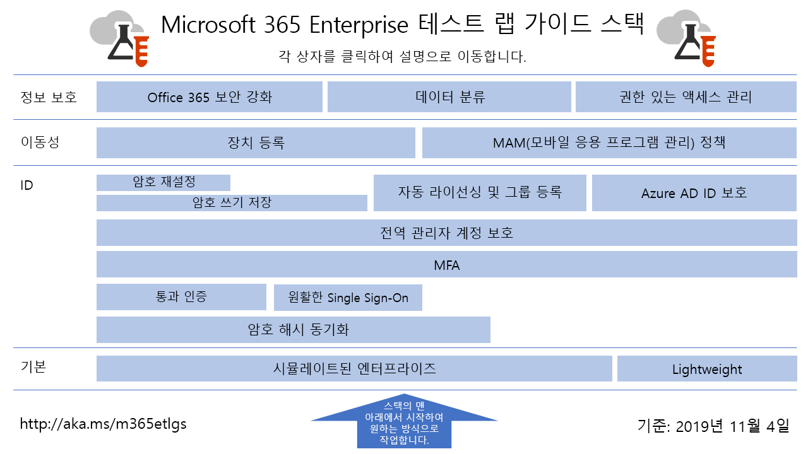

# Microsoft 365 Enterprise 테스트 랩 가이드Microsoft 365 for enterprise Test Lab Guides

*이는 Microsoft 365 Enterprise와 Office 365 Enterprise에 모두 적용됩니다.**This applies to both Microsoft 365 for enterprise and Office 365 Enterprise.*

TLS(테스트 랩 가이드)는 Microsoft 제품을 빠르게 알아보도록 지원합니다. 그리고 간소하지만 대표적인 테스트 환경을 구성하기 위한 지침을 제공합니다. 평가 기간 또는 유료 구독 기간 동안 데모, 사용자 지정 또는 복잡한 개념 증명 생성을 위해 이러한 환경을 사용할 수 있습니다.Test Lab Guides (TLGs) help you quickly learn about Microsoft products. They provide prescriptive instructions to configure simplified but representative test environments. You can use these environments for demonstration, customization, or creation of complex proofs of concept for the duration of a trial or paid subscription. 

TLS는 모듈 방식으로 설계되었습니다. 따라서 각 모듈을 조합하여 학습 또는 테스트 구성 요구에 좀 더 가깝게 일치하는 여러 구성을 만들 수 있습니다. "직접 구축 후 정상 작동 확인" 실습을 통해 새로운 제품 또는 시나리오의 배포 요구 사항을 이해할 수 있으므로 프로덕션에서 호스팅을 더욱 잘 계획할 수 있습니다.TLGs are designed to be modular. They build upon each other to create multiple configurations that more closely match your learning or test configuration needs. The "I built it out myself and it works" hands-on experience helps you understand the deployment requirements of a new product or scenario so you can better plan for hosting it in production.

또한, TLG는 응용 프로그램의 개발 및 테스트를 위한 대표적 환경(개발/테스트 환경이라고도 함)을 만들 수도 있습니다.You can also use TLGs to create representative environments for development and testing of applications, also known as dev/test environments.
  

[여기](../media/m365-enterprise-test-lab-guides/Microsoft365EnterpriseTLGStack.pdf)를 클릭하여 Microsoft 365 Enterprise 테스트 랩 가이드 스택의 모든 문서에 대한 가상 맵을 확인할 수 있습니다.Click [here](../media/m365-enterprise-test-lab-guides/Microsoft365EnterpriseTLGStack.pdf) for a visual map to all the articles in the Microsoft 365 for enterprise Test Lab Guide stack.

## 기본 구성Base configuration

먼저 Office 365 E5, Enterprise Mobility + Security (EMS) E5 및 Windows 10 Enterprise가 포함되는 [Microsoft 365 Enterprise](https://docs.microsoft.com/microsoft-365-enterprise/)의 테스트 환경을 만듭니다. 다음의 두 가지 유형의 기본 구성을 만들 수 있습니다.First, you create a test environment for [Microsoft 365 for enterprise](https://docs.microsoft.com/microsoft-365-enterprise/) that includes Office 365 E5, Enterprise Mobility + Security (EMS) E5, and Windows 10 Enterprise. You can create two different types of base configurations:

- 온-프레미스 구성 요소를 포함하지 않는 클라우드 전용 환경에서 Microsoft 365 Enterprise 기능을 구성하고 시연하려면 [간단한 기본 구성](lightweight-base-configuration-microsoft-365-enterprise.md)을 사용하십시오.Use the [lightweight base configuration](lightweight-base-configuration-microsoft-365-enterprise.md) when you want to configure and demonstrate Microsoft 365 for enterprise features and capabilities in a cloud-only environment, which does not include any on-premises components.

- 액티브 디렉토리 도메인 서비스(AD DS - Active Directory Domain Services) 도메인과 같이 온-프레미스 구성 요소를 사용하는 하이브리드 클라우드 환경에서 Microsoft 365 Enterprise 기능 및 성능을 구성하고 시연하려면 [시뮬레이트된 엔터프라이즈 기본 구성](simulated-ent-base-configuration-microsoft-365-enterprise.md)을 사용하십시오.Use the [simulated enterprise base configuration](simulated-ent-base-configuration-microsoft-365-enterprise.md) when you want to configure and demonstrate Microsoft 365 for enterprise features and capabilities in a hybrid cloud environment, which uses on-premises components such as an Active Directory Domain Services (AD DS) domain.

평가판 또는 프로덕션 테스트 환경에 Microsoft 365 E5 라이선스를 추가하지 않고 Office 365 E5에 대한 테스트 환경을 만들 수도 있습니다.You can also create test environments for Office 365 E5 by not adding the Microsoft 365 E5 license to your trial or production test environment.
    
## IDIdentity

ID 관련 기능을 시연하려면 다음을 참조하세요.To demonstrate identity-related features and capabilities, see:

- [암호 해시 동기화Password hash synchronization](password-hash-sync-m365-ent-test-environment.md)
  
   AD DS 도메인 컨트롤러에서 암호 해시 기반 디렉터리 동기화를 사용하도록 설정하고 테스트합니다.Enable and test password hash-based directory synchronization from an AD DS domain controller.

- [통과 인증Pass-through authentication](pass-through-auth-m365-ent-test-environment.md)
  
   AD DS 도메인 컨트롤러에 대한 통과 인증을 사용하도록 설정하고 테스트합니다.Enable and test pass-through authentication to an AD DS domain controller.

- [페더레이션 인증Federated authentication](federated-identity-for-your-office-365-dev-test-environment.md)
  
   AD DS 도메인 컨트롤러에 대한 페더레이션 인증을 사용하도록 설정하고 테스트합니다.Enable and test federated authentication to an AD DS domain controller.

- [Azure AD Seamless Single Sign-onAzure AD Seamless Single Sign-on](single-sign-on-m365-ent-test-environment.md)
  
   AD DS 도메인 컨트롤러를 사용하여 Azure AD Seamless SSO(Single Sign-On)를 사용하도록 설정하고 테스트합니다.Enable and test Azure AD Seamless Single Sign-on (SSO) with an AD DS domain controller.

- [Multi-Factor authenticationMulti-factor authentication](multi-factor-authentication-microsoft-365-test-environment.md)
  
   특정 사용자 계정에 대해 휴대폰 기반 다단계 인증을 사용하고 테스트합니다.Enable and test smart phone-based multi-factor authentication for a specific user account.

- [전역 관리자 계정 보호Protect global administrator accounts](protect-global-administrator-accounts-microsoft-365-test-environment.md)
 
   조건부 액세스 정책을 사용하여 글로벌 관리자 계정을 잠급니다.Lock down your global administrator accounts with conditional access policies.

- [암호 쓰기 저장Password writeback](password-writeback-m365-ent-test-environment.md)

   Azure AD에서 AD DS 사용자 계정 암호를 변경하려면 암호 쓰기 저장을 사용하십시오.Use password writeback to change the password on your AD DS user account from Azure AD.

- [암호 재설정Password reset](password-reset-m365-ent-test-environment.md)

   SSPR(셀프 서비스 암호 재설정)을 사용하여 암호를 재설정합니다.Use self-service password reset (SSPR) to reset your password.

- [자동 라이선싱 및 그룹 구성원Automatic licensing and group membership](automate-licenses-group-membership-microsoft-365-test-environment.md)

   자동 라이선싱 및 동적 그룹 등록으로 새 계정을 이전보다 더 쉽게 관리하도록 만듭니다.Make administering new accounts easier than ever with automatic licensing and dynamic group membership.

- [Azure AD ID 보호Azure AD Identity Protection](azure-ad-identity-protection-microsoft-365-test-environment.md)

   현재 사용자 계정의 취약성을 검사합니다.Scan your current user accounts for vulnerabilities.

- [ID 및 장치 액세스Identity and device access](identity-device-access-m365-test-environment.md)

   권장된 ID 및 장치 액세스 구성 및 조건부 액세스 정책을 테스트할 수 있는 환경을 만듭니다.Create an environment to test recommended identity and device access configurations and conditional access policies.

## 모바일 장치 관리Mobile device management

모바일 장치 관리와 관련 기능을 시연하려면 다음을 참조하세요.To demonstrate mobile device management-related features and capabilities, see:

- [장치 준수 정책Device compliance policies](mam-policies-for-your-microsoft-365-enterprise-dev-test-environment.md)
    
   Windows 10 장치에 대한 사용자 그룹 및 장치 준수 정책을 만듭니다.Create a user group and a device compliance policy for Windows 10 devices.
    
- [iOS 및 Android 장치 등록Enroll iOS and Android devices](enroll-ios-and-android-devices-in-your-microsoft-enterprise-365-dev-test-environ.md)
   
   iOS 또는 Android 장치를 등록하고 원격으로 관리합니다.Enroll iOS or Android devices and manage them remotely.

## 정보 보호Information protection

정보 보호 관련 기능을 시연하려면 다음을 참조하세요.To demonstrate information protection-related features and capabilities, see:

- [Office 365 보안 강화Increased Office 365 security](increased-o365-security-microsoft-365-enterprise-dev-test-environment.md)
    
   Office 365 보안 향상을 위한 설정을 구성하고 기본 제공 보안 도구를 조사합니다.Configure settings for increased Office 365 security and investigate built-in security tools.
  
- [데이터 분류Data classification](data-classification-microsoft-365-enterprise-dev-test-environment.md)
    
   SharePoint Online 팀 사이트에서 Office 365 레이블을 구성하고 문서에 적용합니다.Configure and apply Office 365 labels to a document in a SharePoint Online team site.
    
- [권한이 부여된 액세스 관리Privileged access management](privileged-access-microsoft-365-enterprise-dev-test-environment.md)
    
   Office 365 조직의 권한 상승이 필요한 작업 및 권한이 부여된 작업에 대한 JIT(Just-In-Time) 액세스를 위해 권한이 부여된 액세스 관리를 구성합니다.Configure privileged access management for just-in-time access to elevated and privileged tasks in your Office 365 organization.

