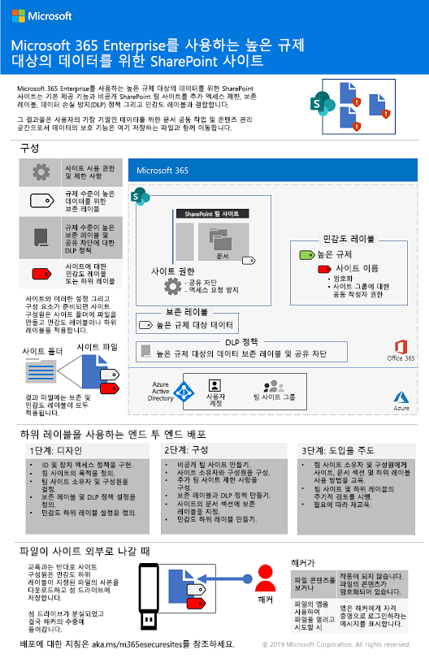

# Microsoft 365 Enterprise 배포 컨텐츠의 변경 사항Changes to Microsoft 365 Enterprise deployment content

## 2019년 10월October 2019

### 새로운 내용New content 

- [높은 규제 대상 데이터를 위한 Teams 포스터Teams for highly regulated data poster](secure-teams-highly-regulated-data-scenario.md#poster)

  

  이 포스터를 [PDF](https://github.com/MicrosoftDocs/microsoft-365-docs/raw/public/microsoft-365/enterprise/media/secure-teams-highly-regulated-data-scenario/TeamsHighlyRegulatedData.pdf)로 다운로드하고 편지형, 법률형 또는 타블로이드(11 x 17) 형식으로 인쇄할 수 있습니다.You can also download this poster as a [PDF](https://github.com/MicrosoftDocs/microsoft-365-docs/raw/public/microsoft-365/enterprise/media/secure-teams-highly-regulated-data-scenario/TeamsHighlyRegulatedData.pdf) and print it in letter, legal, or tabloid (11 x 17) formats.

- [높은 규제 대상 데이터를 위한 SharePoint 사이트 포스터SharePoint sites for highly regulated data poster](teams-sharepoint-online-sites-highly-regulated-data.md#poster)

  

  이 포스터를 [PDF](https://github.com/MicrosoftDocs/microsoft-365-docs/raw/public/microsoft-365/enterprise/media/teams-sharepoint-online-sites-highly-regulated-data/SharePointSitesHighlyRegulatedData.pdf)로 다운로드하고 편지형, 법률형 또는 타블로이드(11 x 17) 형식으로 인쇄할 수 있습니다.You can also download this poster as a [PDF](https://github.com/MicrosoftDocs/microsoft-365-docs/raw/public/microsoft-365/enterprise/media/teams-sharepoint-online-sites-highly-regulated-data/SharePointSitesHighlyRegulatedData.pdf) and print it in letter, legal, or tabloid (11 x 17) formats.

- [Autopilot 포스터를 사용하여 Windows 10 배포The Deploy Windows 10 with Autopilot poster](windows10-deploy-autopilot.md) 

  

  [PDF](https://github.com/MicrosoftDocs/windows-itpro-docs/raw/public/windows/deployment/media/Windows10AutopilotFlowchart.pdf)나 [Visio](https://github.com/MicrosoftDocs/windows-itpro-docs/raw/public/windows/deployment/media/Windows10Autopilotflowchart.vsdx) 형식으로도 포스터를 다운로드 할 수 있습니다.You can also download this poster in [PDF](https://github.com/MicrosoftDocs/windows-itpro-docs/raw/public/windows/deployment/media/Windows10AutopilotFlowchart.pdf) or [Visio](https://github.com/MicrosoftDocs/windows-itpro-docs/raw/public/windows/deployment/media/Windows10Autopilotflowchart.vsdx) format.

- [Microsoft Endpoint Configuration Manager 포스터를 사용하여 Windows 10 배포The Windows 10 deployment with System Center Configuration Manager poster](windows10-deploy-inplaceupgrade.md)

  

  [PDF](https://github.com/MicrosoftDocs/windows-itpro-docs/raw/public/windows/deployment/media/Windows10DeploymentConfigManager.pdf)나 [Visio](https://github.com/MicrosoftDocs/windows-itpro-docs/raw/public/windows/deployment/media/Windows10DeploymentConfigManager.vsdx) 형식으로도 포스터를 다운로드 할 수 있습니다.You can also download this poster in [PDF](https://github.com/MicrosoftDocs/windows-itpro-docs/raw/public/windows/deployment/media/Windows10DeploymentConfigManager.pdf) or [Visio](https://github.com/MicrosoftDocs/windows-itpro-docs/raw/public/windows/deployment/media/Windows10DeploymentConfigManager.vsdx) format.

- [규제가 엄격한 데이터 시나리오를 위한 TeamsTeams for highly regulated data scenario](secure-teams-highly-regulated-data-scenario.md)

  

  공지: [Microsoft 365 기술 커뮤니티 블로그](https://techcommunity.microsoft.com/t5/Microsoft-365-Blog/Protect-your-highly-regulated-files-in-Teams-with-Microsoft-365/ba-p/962985)  |  [LinkedIn](https://www.linkedin.com/pulse/how-can-i-lock-down-team-sensitive-top-secret-joe-davies/?published=t)Announcements: [Microsoft 365 Technical Community blog](https://techcommunity.microsoft.com/t5/Microsoft-365-Blog/Protect-your-highly-regulated-files-in-Teams-with-Microsoft-365/ba-p/962985)  |  [LinkedIn](https://www.linkedin.com/pulse/how-can-i-lock-down-team-sensitive-top-secret-joe-davies/?published=t)

- [원격 작업자 지원Empower remote workers poster](empower-people-to-work-remotely.md#poster)

   

- [Microsoft 365 Business에서 Microsoft 365 Enterprise E3로 마이그레이션Migrate from Microsoft 365 Business to Microsoft 365 Enterprise E3](https://docs.microsoft.com/microsoft-365/business/migrate-from-microsoft-365-business-to-microsoft-365-enterprise)

### 업데이트 및 향상된 기능Updates and enhancements

- [4단계: Office 365 ProPlus](office365proplus-infrastructure.md)의 새로 고침Refresh of [Phase 4: Office 365 ProPlus](office365proplus-infrastructure.md)
- [Contoso 사례 연구](contoso-case-study.md)의 새로 고침Refresh of the [Contoso case study](contoso-case-study.md)
- [Microsoft Teams](teams-workload.md) 새로 고침, [Exchange Online](exchangeonline-workload.md) 및 [SharePoint Online](sharepoint-online-onedrive-workload.md) 작업 부하Refresh of the [Microsoft Teams](teams-workload.md), [Exchange Online](exchangeonline-workload.md), and [SharePoint Online](sharepoint-online-onedrive-workload.md) workloads
- [높은 규제 대상 데이터를 위한 SharePoint 사이트](teams-sharepoint-online-sites-highly-regulated-data.md) 시나리오의 새로 고침Refresh of the [SharePoint sites for highly regulated data](teams-sharepoint-online-sites-highly-regulated-data.md) scenario
 
  

- 새 시나리오를 위한 [Microsoft 365 Enterprise 포스터](microsoft-365-overview.md#get-the-big-picture)[Microsoft 365 Enterprise poster](microsoft-365-overview.md#get-the-big-picture) for new scenarios 

  

## 2019년 9월September 2019

### 새로운 내용New content 

- [원격 작업자 시나리오Remote workers scenario](empower-people-to-work-remotely.md)

   
 
  공지: [Microsoft 365 기술 커뮤니티 블로그](https://techcommunity.microsoft.com/t5/Microsoft-365-Blog/Empower-your-remote-workers-with-Microsoft-365-Enterprise/ba-p/935196#M236)  |  [LinkedIn](https://www.linkedin.com/pulse/how-do-i-configure-microsoft-365-enterprise-empower-my-joe-davies/)Announcements: [Microsoft 365 Technical Community blog](https://techcommunity.microsoft.com/t5/Microsoft-365-Blog/Empower-your-remote-workers-with-Microsoft-365-Enterprise/ba-p/935196#M236)  |  [LinkedIn](https://www.linkedin.com/pulse/how-do-i-configure-microsoft-365-enterprise-empower-my-joe-davies/)

- [6 단계: 정보 보호](infoprotect-infrastructure.md)의 [전자 메일 암호화 단계](infoprotect-email-encryption.md)[Email encryption step](infoprotect-email-encryption.md) for [Phase 6: Information Protection](infoprotect-infrastructure.md)

### 업데이트 및 개선사항Updates and enhancements

- [2 단계: ID](identity-infrastructure.md)의 재구성 및 새로 고침Reorganization and refresh of [Phase 2: Identity](identity-infrastructure.md)
- [1 단계: 네트워킹](networking-infrastructure.md) 및 [6 단계: 정보 보호](infoprotect-infrastructure.md)의 새로 고침Refresh of [Phase 1: Networking](networking-infrastructure.md) and [Phase 6: Information Protection](infoprotect-infrastructure.md)

## 2019년 8월August 2019

### 새로운 내용New content 

- [Microsoft 365 Enterprise로의 조직의 전환 포스터Transition Your Organization to Microsoft 365 Enterprise poster](migration-microsoft-365-enterprise-workload.md#transition-your-entire-organization)

   
 
- [Microsoft 365 Enterprise의 ID 인프라 포스터Identity infrastructure for Microsoft 365 Enterprise poster](identity-infrastructure.md)

  

  공지: [Microsoft 365 기술 커뮤니티 블로그](https://techcommunity.microsoft.com/t5/Microsoft-365-Blog/Get-the-new-Identity-infrastructure-for-Microsoft-365-Enterprise/ba-p/874941)  |  [LinkedIn](https://www.linkedin.com/pulse/how-can-i-quickly-ramp-up-key-concepts-features-identity-joe-davies/?published=t)Announcements: [Microsoft 365 Technical Community blog](https://techcommunity.microsoft.com/t5/Microsoft-365-Blog/Get-the-new-Identity-infrastructure-for-Microsoft-365-Enterprise/ba-p/874941)  |  [LinkedIn](https://www.linkedin.com/pulse/how-can-i-quickly-ramp-up-key-concepts-features-identity-joe-davies/?published=t)

- [Windows 7 및 Office 10 지원 종료 포스터Windows 7 and Office 10 End-of-Support poster](migration-microsoft-365-enterprise-workload.md#summary-of-options-for-office-2010-clients-and-servers-and-windows-7)
  
  

  공지: [Microsoft 365 기술 커뮤니티 블로그](https://techcommunity.microsoft.com/t5/Microsoft-365-Blog/Move-from-Office-2010-clients-and-servers-and-Windows-7-to/ba-p/846994)  |  [LinkedIn](https://www.linkedin.com/pulse/how-can-microsoft-365-enterprise-help-me-end-support-products-davies/)Announcements: [Microsoft 365 Technical Community blog](https://techcommunity.microsoft.com/t5/Microsoft-365-Blog/Move-from-Office-2010-clients-and-servers-and-Windows-7-to/ba-p/846994)  |  [LinkedIn](https://www.linkedin.com/pulse/how-can-microsoft-365-enterprise-help-me-end-support-products-davies/)

### 업데이트 및 개선사항Updates and enhancements

- 새로운 생산성 시나리오를 위한 [Microsoft 365 Enterprise 포스터](microsoft-365-overview.md#get-the-big-picture)[Microsoft 365 Enterprise poster](microsoft-365-overview.md#get-the-big-picture) for new productivity scenarios

   

## 2019년 7월July 2019

### 새로운 내용New content

- [기업 이외의 조직 문서를 위한 Microsoft 365 Enterprise](deploy-foundation-infrastructure-non-enterprises.md#onboarding)용 Excel 통합 문서Excel workbook for [Microsoft 365 Enterprise for non-enterprise organizations article](deploy-foundation-infrastructure-non-enterprises.md#onboarding)

## 2019년 5월May 2019

### 새로운 내용New content

- [기본 인프라 포스터Foundation Infrastructure poster](deploy-foundation-infrastructure.md#at-a-glance)

  

  공지: [Linkedin](https://www.linkedin.com/pulse/how-can-i-get-big-picture-microsoft-365-enterprise-joe-davies/)Announcements: [LinkedIn](https://www.linkedin.com/pulse/how-can-i-get-big-picture-microsoft-365-enterprise-joe-davies/)

 
- [기업 이외의 조직 문서를 위한 Microsoft 365 EnterpriseMicrosoft 365 Enterprise for non-enterprise organizations article](deploy-foundation-infrastructure-non-enterprises.md)

  

  공지: [Microsoft 365 기술 커뮤니티 블로그](https://techcommunity.microsoft.com/t5/Microsoft-365-Blog/Deploy-Microsoft-365-Enterprise-infrastructure-even-if-you-re/ba-p/900012)  |  [LinkedIn](https://www.linkedin.com/pulse/how-do-i-deploy-microsoft-365-enterprise-without-joe-davies/)Announcements: [Microsoft 365 Technical Community blog](https://techcommunity.microsoft.com/t5/Microsoft-365-Blog/Deploy-Microsoft-365-Enterprise-infrastructure-even-if-you-re/ba-p/900012)  |  [LinkedIn](https://www.linkedin.com/pulse/how-do-i-deploy-microsoft-365-enterprise-without-joe-davies/)

## 2019년 4월April 2019

### 새로운 내용New content 

- [ID 및 장치 액세스](identity-device-access-m365-test-environment.md)필요 조건 테스트 랩 가이드[Identity and device access](identity-device-access-m365-test-environment.md) prerequisite Test Lab Guides
- [6 단계: 정보 보호](infoprotect-infrastructure.md)를 위한 [Windows 정보 보호](infoprotect-deploy-windows-information-protection.md) 및 [Office 365 데이터 손실 방지](infoprotect-data-loss-prevention.md) 단계[Windows Information Protection](infoprotect-deploy-windows-information-protection.md) and [Office 365 Data Loss Prevention](infoprotect-data-loss-prevention.md) steps for [Phase 6: Information Protection](infoprotect-infrastructure.md)

## 참고 항목See also

[배포 가이드Deployment guide](deploy-microsoft-365-enterprise.md)
