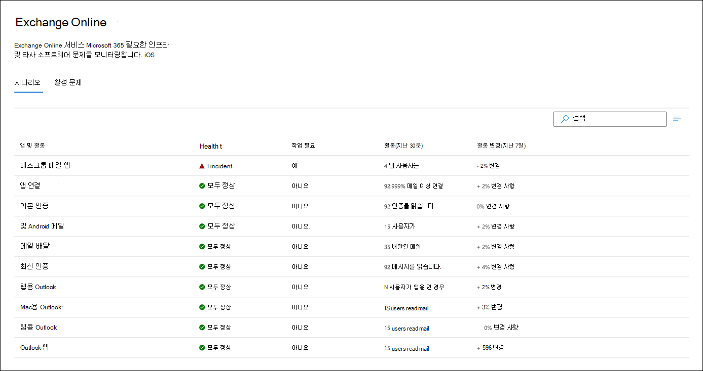
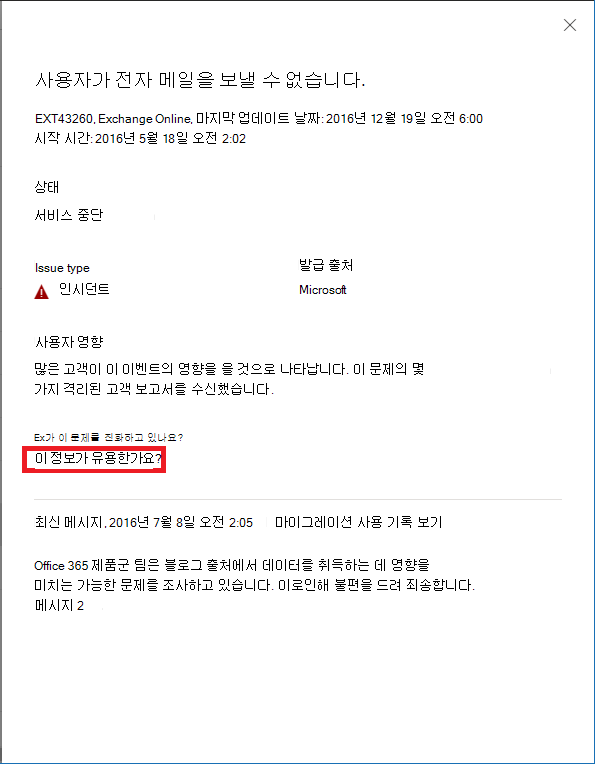

# Microsoft 365의 Exchange Online 모니터링

<a href="https://go.microsoft.com/fwlink/p/?linkid=2024339" target="_blank">Microsoft 365 관리 센터</a>에서 Exchange Online 모니터링을 사용하여 조직의 Microsoft 365 구독에 대한 Exchange 서비스의 상태를 모니터링할 수 있습니다. Exchange Online 모니터링에서는 다음 범주에서 수집되는 인시던트와 권고에 대한 정보를 제공합니다.

- **인프라**: Microsoft에서 정기 업데이트와 문제 해결을 위해 보유하고 있는 Microsoft 365 인프라에서 문제가 발견되었습니다. 예를 들어, Exchange 또는 기타 Microsoft 365 클라우드 인프라에 발생한 문제로 인해 Exchange Online에 액세스할 수 없습니다.
- **타사 인프라**: 조직이 하위 항목을 보유하는 타사 인프라에서 문제가 발견되었고 해결하려면 조직의 조치가 필요합니다. 예를 들어, 사용자 인증 거래는 사용자가 Exchange Online에 연결하는 것을 차단하는 타사 STS(보안 토큰 서비스) 공급자에 의해 제한을 받고 있습니다.
- **고객 인프라**: 조직 인프라에서 문제가 발견되었고 해결하려면 조직의 조치가 필요합니다. 예를 들어, 만료된 인증서로 인해 사용자가 조직에서 호스트하는 STS 공급자로부터 인증 토큰을 받을 수 없으므로 Exchange Online에 액세스할 수 없습니다.

다음은 Microsoft 365 관리 센터의 **서비스 상태** 페이지에 대한 예로, 조직 시나리오의 **상태** > [**서비스 상태**](https://go.microsoft.com/fwlink/p/?linkid=842900)에서 사용할 수 있습니다.

**조직의 문제는** 조직 수준의 모니터링에서 식별되고 사용됩니다.

**조직의 문제** 아래에 있는 **상태** 열의 값은 조직의 인프라 또는 타사 소프트웨어가 Exchange Online을 사용하는 조직의 사용자 서비스 상태 환경에 영향을 주는지 여부를 나타냅니다. 권고나 인시던트를 해결하려면 *사용자의* 조치가 필요합니다.

**Microsoft 서비스 상태** 아래의 **상태** 열 값은 서비스가 정상이거나 Microsoft가 유지 관리하는 클라우드 서비스를 기반으로 하는 권고 또는 인시던트가 있음을 나타냅니다.

다음은 **상태** > [**서비스 상태**](https://go.microsoft.com/fwlink/p/?linkid=842900) > **Exchange Online** 에서 사용할 수 있는 조직 수준 시나리오의 상태를 보여 주는 Microsoft 365 관리 센터의 Exchange Online 모니터링 페이지의 예입니다.

**Exchange Online** 모니터링 페이지를 사용하여 Exchange Online 서비스가 정상인지 여부를 확인하고 연결된 인시던트나 권고 사항이 있는지 확인할 수 있습니다. Exchange Online 모니터링을 사용하여 특정 이메일 시나리오에 대한 서비스 상태를 확인하고 거의 실시간 신호를 보고 조직 수준의 시나리오에 따른 영향을 확인할 수 있습니다.

## 요구 사항

다음 요구 사항을 충족하는 고객은 해당 미리 보기를 사용할 수 있습니다.

- 조직에서는 Office 365 E3, Microsoft 365 E3, Office 365 E5, Microsoft 365 E5 제품 중 하나 또는 조합에서 최소 5,000개의 라이선스를 보유하고 있어야 합니다.

  예를 들어 조직에서는 적격 제품 총 5,500개의 라이센스에 대해 3,000개의 Office 365 E3 라이선스 및 2,500개의 Microsoft 365 E5 라이선스를 보유할 수 있습니다.

- 조직에는 Microsoft Teams, 비즈니스용 OneDrive, SharePoint Online, Exchange Online 및 Office 앱을 포함하는 하나 이상의 핵심 Microsoft 365 서비스에 대해 최소 50명의 월간 활성 사용자가 있어야 합니다.

- 서비스 상태 대시보드 수준 권한이 있는 모든 역할은 Exchange Online 모니터링에 액세스할 수 있습니다. 자세한 내용은 [Microsoft 365 서비스 상태를 확인하는 방법](view-service-health.md)을 참조하세요.

## 조직 수준 시나리오

Exchange Online 모니터링은 다음 시나리오를 지원합니다.

- **이메일 클라이언트**: 이메일 읽기 활동을 기반으로 다음 이메일 클라이언트의 상태를 볼 수 있습니다.

  - Outlook 데스크톱
  - 웹용 Outlook
  - IOS 및 Android의 기본 메일 클라이언트
  - IOS 및 Android의 Outlook Mobile 앱
  - Outlook Mac 클라이언트
  - 웹용 Outlook 열기

   해당 클라이언트의 경우, 대시보드에서 인시던트와 권고 수와 함께, 메일을 읽는 사용자를 기반으로 지난 30분 동안의 활성 사용자 수를 볼 수 있습니다. 지난 주에 대해 동일한 간격으로 이 데이터를 비교하여 문제가 있는지 확인합니다.

   >[!Note]
   > 활성 사용자 수는 단일 활동(예: 사용자가 메일을 읽는 경우)으로 측정됩니다. 지난 30분 동안의 활동만 설명합니다.

- **앱 연결**: 예상 연결은 조직의 장치와 Exchange Online 간의 성공적인 가상 연결 백분율을 기반에 두며 Microsoft의 제어를 벗어난 문제를 포함할 수 있습니다. 

- **기본 인증 및 최신 인증**: Exchange Online 서비스에서 성공적으로 유효성이 검사된 사용자 수입니다.

- **메일 흐름**: 메시지가 Microsoft 365 네트워크에 연결된 후 지연 없이 사서함에 성공적으로 배달된 메시지 수입니다.

  

이러한 시나리오의 경우, 주요 숫자는 기본 대시보드의 마지막 30분에 대한 것입니다. 이러한 각 시나리오에 대한 자세한 보기에서는 이전 주와 비교하여 30분 집계로 7일 간의 거의 실시간 추세를 보여 줍니다.

## 의견 보내기

다음과 같은 두 가지 방법으로 의견을 제공할 수 있습니다.

- Microsoft 365 관리 센터의 모든 페이지에서 **의견 보내기** 옵션을 사용할 수 있습니다.

- 특정 인시던트나 권고에 **이 게시물이 유용한가요?** 링크를 사용하여 의견 제출

  

## 자주 묻는 질문

#### 1. Microsoft 365 관리 센터의 상태 아래에 "Exchange Online 모니터링"이 표시되지 않는 이유는 무엇인가요? 

먼저 <a href="https://go.microsoft.com/fwlink/p/?linkid=2024339" target="_blank">Microsoft 365 관리 센터</a>의 **홈** 페이지에서 새 관리 센터를 사용하도록 설정했는지 확인합니다.

그런 후, 다음 요구 사항을 모두 충족하는지 확인합니다. 

- 조직에서는 Office 365 E3, Microsoft 365 E3, Office 365 E5, Microsoft 365 E5 제품 중 하나 또는 조합에서 최소 5,000개의 라이선스를 보유하고 있어야 합니다. 

- 조직에는 매월 최소 50명의 활성 Exchange Online 사용자가 있어야 합니다.

조직의 라이선스 수가 5,000명 미만이고 월간 활성 사용자가 50명 미만인 경우, 해당 요구 사항이 충족될 때까지 Exchange Online 모니터링을 사용할 수 없습니다.

#### 2. 각 클라이언트에 대한 대시보드의 활성 사용자 수가 낮은 것으로 표시됩니다. 사용자에게 많은 활성 라이선스가 할당되어 있습니다. 시나리오

모니터링에 표시되는 활성 사용자 수는 기능에서 호출한 활동을 수행한 30분 창을 기반으로 합니다. 이 수치와 사용량 수치를 혼동해서는 안 됩니다. 사용량 수치를 보려면 Microsoft 365 관리 센터에서 활동 보고서 **(보고서** > <a href="https://go.microsoft.com/fwlink/p/?linkid=2074756" target="_blank">**사용fid**</a>)를 사용합니다.

#### 3. Teams 및 SharePoint와 같은 기타 서비스에 대한 다른 모니터링 시나리오가 있나요?

Microsoft에서 Microsoft 365 관리 센터의 서비스 상태 대시보드 내부에서 이 환경을 바로 통합했습니다. 이를 통해 Microsoft에서 다른 서비스에 대한 모니터링 시나리오를 확장할 수 있는 기회를 갖게 됩니다. 이 기능은 공유할 뉴스가 있을 경우 발표될 예정입니다.

#### 4 .이 환경의 출시 계획은 무엇인가요?

Microsoft에서 Microsoft 365 관리 센터의 <a href="https://go.microsoft.com/fwlink/p/?linkid=842900" target="_blank">**서비스 상태** 대시보드</a> 내부에서 Exchange Online 모니터링을 바로 통합했습니다.

새로운 통합 환경에서 Microsoft의 계획은 사용자 의견을 수집하고 출시 계획을 정의하는 것입니다.

#### 5. 이 기능은 무료(포함)인가요? 무료(추가)인가요? 

이는 미리 보기 상태에 있는 무료 기능으로 질문 1의 요구 사항을 충족하는 고객에게만 제공됩니다. 이 콘텐츠를 받기 위한 유료 옵션은 없습니다.

#### 6. 사용자 의견을 제공하려면 어떻게 하나요?

일반적인 사용자 의견을 보려면 **Exchange Online** 모니터링 페이지의 오른쪽 아래 모서리에 있는 **의견 보내기** 아이콘을 사용하세요. 

인시던트나 권고에 대한 의견을 보려면 **이 게시물이 유용한가요?** 링크를 사용하세요.

#### 7. 활동 경향을 보여주는 시나리오의 데이터는 어디에서 측정됩니까?

데이터는 Exchange Online 서비스에서 계측됩니다. 요청이 Exchange Online에 도달하기 전에 오류가 발생하거나 Exchange Online에서 오류가 발생한 경우 작업 신호가 감소합니다.

#### 8. 개인 정보 보호 관련 문제가 있나요?

모니터링은 서비스 메타데이터에 중점을 두며 사용자 콘텐츠는 모니터링되지 않습니다.

## 참고 항목

- [Microsoft 365 서비스 상태 확인 방법](view-service-health.md) 
- [Exchange Online 제한](/office365/servicedescriptions/exchange-online-service-description/exchange-online-limits#mailbox-storage-limits)
