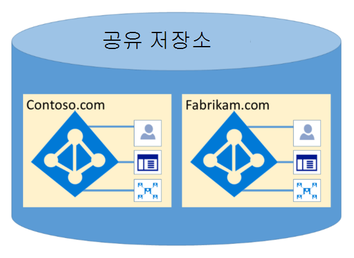

# Microsoft 365 Azure Active Directory

Azure Active Directory(Azure AD)는 논리 데이터와의 보안을 유지하여 여러 테넌트를 호스팅하도록 디자인되어 있습니다. Azure AD에 대한 액세스는 권한 부여 계층에 의해 제어됩니다. Azure AD는 고객이 테넌트 컨테이너를 보안 경계로 사용하여 고객의 콘텐츠를 보호하여 공동 테넌트에 의해 콘텐츠에 액세스하거나 손상되지 못하게 합니다. Azure AD의 권한 부여 계층에서 다음 세 가지 검사를 수행 합니다.

- 보안 주체가 Azure AD 테넌트에 액세스할 수 있도록 설정되어 있나요?
- 보안 주체가 이 테넌트의 데이터에 액세스할 수 있도록 설정되어 있나요?
- 이 테넌트의 보안 주체 역할은 요청된 데이터 액세스 유형에 대해 권한을 부여합니까?

적절한 인증 및 토큰 또는 인증서 없이는 응용 프로그램, 사용자, 서버 또는 서비스가 Azure AD에 액세스할 수 없습니다. 적절한 자격 증명이 함께 제공되지 않는 요청은 거부됩니다.

효과적으로 Azure AD는 단독으로 테넌트가 소유하고 관리하는 컨테이너에 대한 정책 및 사용 권한을 사용하여 자체 보호된 컨테이너에서 각 테넌트를 호스트합니다.
 

테넌트 컨테이너 개념은 포털에서 영구적 저장소까지 모든 계층의 디렉터리 서비스에 깊이 있습니다. 여러 Azure AD 테넌트 메타데이터가 동일한 실제 디스크에 저장되어 있는 경우에도 디렉터리 서비스에서 정의하는 것 외의 컨테이너 간에 관계가 없습니다. 이는 테넌트 관리자가 받아들입니다. 먼저 권한 부여 계층을 거치지 않고는 요청하는 응용 프로그램 또는 서비스에서 Azure AD 저장소에 직접 연결될 수 없습니다.

아래 예제에서 Contoso와 Fabrikam은 둘 다 별도의 전용 컨테이너를 가지며, 이러한 컨테이너가 서버 및 저장소와 같은 동일한 기반 인프라 중 일부를 공유할 수 있는 경우에도 서로 분리된 상태로 유지되고 격리된 상태로 유지되고 권한 부여 및 액세스 제어 계층에 의해 제어됩니다.
 

또한 Azure AD 내에서 실행할 수 있는 응용 프로그램 구성 요소는 없습니다. 또한 한 테넌트가 다른 테넌트의 무결성을 강요하거나, 다른 테넌트의 암호화 키에 액세스하거나, 서버에서 원시 데이터를 읽을 수 없습니다.

기본적으로 Azure AD는 다른 테넌트의 ID에 의해 발급된 모든 작업을 사용할 수 없습니다. 각 테넌트는 클레임 기반 액세스 제어를 통해 Azure AD 내에서 논리적으로 격리됩니다. 디렉터리 데이터의 읽기 및 쓰기는 테넌트 컨테이너로 범위가 지정됩니다. 내부 추상화 계층과 RBAC(역할 기반 액세스 제어) 계층에 의해 제어됩니다. 이 계층은 함께 테넌트를 보안 경계로 적용합니다. 모든 디렉터리 데이터 액세스 요청은 이러한 계층에서 처리하며, Microsoft 365 위의 논리에 의해 제어됩니다.

Azure AD에는 북미, 미국 정부, 유럽 연합, 독일 및 월드 와이드 파티션이 있습니다. 테넌트가 단일 파티션에 있으며 파티션에는 여러 테넌트가 포함될 수 있습니다. 파티션 정보는 사용자로부터 추상화됩니다. 주어진 파티션(해당 파티션 내의 모든 테넌트 포함)이 여러 데이터 센터로 복제됩니다. 테넌트의 파티션은 테넌트의 속성(예: 국가 코드)에 따라 선택됩니다. 각 파티션의 비밀 및 기타 중요한 정보는 전용 키로 암호화됩니다. 키는 새 파티션을 만들 때 자동으로 생성됩니다.

Azure AD 시스템 기능은 각 사용자 세션에 대한 고유한 인스턴스입니다. 또한 Azure AD는 암호화 기술을 사용하여 네트워크 수준에서 공유 시스템 리소스를 차단하여 무단 및 의도하지 않은 정보 전송을 방지합니다.
