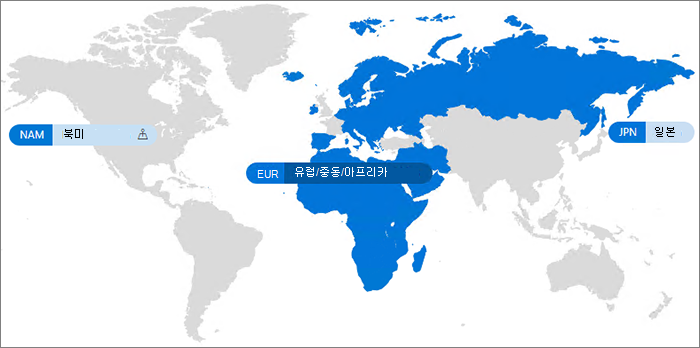

# Microsoft 365 Multi-Geo

Microsoft 365 Multi-Geo를 사용하면 Microsoft 365 범위를 기존 테넌트 내 여러 지리적 지역 및 / 또는 국가로 확장할 수 있습니다. Microsoft 계정 팀에 문의하여 Microsoft 365 Multi-Geo용 Multi-National Company에 등록하세요.
  
Microsoft 365 Multi-Geo를 사용하여 데이터 상주 요구 사항을 충족하기 위해 선택한 지리적 위치의 미사용 데이터를 프로비저닝 및 저장하고, 동시에 귀하의 전 세계 작업자들이 최신 생산성 환경을 활용하도록 할 수 있습니다.

Microsoft 365 Multi-Geo에 대한 비디오 소개는 [SharePoint Online 및 OneDrive Multi-Geo에서 데이터 위치](https://www.youtube.com/watch?v=Do9U3JuROhk)를 참조하세요.

## Multi-Geo 아키텍처

Multi-Geo 환경에서 Microsoft 365 테넌트는 중앙 위치(Microsoft 365 구독이 원래 제공되었던 위치)와 하나 이상의 위성 위치로 구성됩니다. Multi-Geo 테넌트의 경우 지리적 위치, 그룹 및 사용자 정보에 대한 정보는 Azure Active Directory(AAD)에서 관리됩니다. 테넌트 정보가 중앙에서 관리되고 각 지리적 위치와 동기화되기 때문에 회사의 모든 사람과 관련된 공유 및 경험은 전역 세계적으로 인식됩니다.

참고로, Microsoft 365 Multi-Geo는 성능 최적화를 위해 설계되지 않았고 데이터 상주 요구 사항을 충족하도록 설계되었습니다. Microsoft 365의 성능 최적화에 대한 자세한 내용은 [Microsoft 365의 네트워크 계획 및 성능 조정](https://support.office.com/article/e5f1228c-da3c-4654-bf16-d163daee8848)을 참조하거나 지원 그룹에 문의하세요.

## 용어

다음은 Microsoft 365 Multi-Geo를 설명하는 데 사용되는 주요 용어입니다.

- **중앙 위치** - 테넌트가 원래 프로비저닝된 지리적 위치
- **지역 관리자** - 하나 이상의 지정된 위성 위치를 관리할 수 있는 관리자
- **지역 코드** - 주어직 지리적 위치에 대한 세 자리 코드
- **지리적 위치** – Exchange 우편함 및 OneDrive 및 SharePoint 사이트를 포함하여 데이터를 호스팅하기 위해 Multi-Geo 테넌트에서 사용할 수있는 지리적 위치
- **선호 하는 데이터 위치 (PDL)** - 사용자가 Exchange 사서함과 OneDrive를 프로비저닝하는 위치를 나타내는 관리자가 설정한 사용자 속성 또한 PDL은 사용자가 만든 SharePoint 사이트가 프로비저닝되는 위치를 결정합니다.
- **위성 위치** - 지리적 인식 Microsoft 365 작업(SharePoint, OneDrive 및 Exchange)이 Multi-Geo 테넌트에서 사용하도록 설정된 지리적 위치
- **테넌트** – Microsoft 365에서 일반적으로 하나 이상의 도메인에 연결되어 있는 조직을 나타내는 표현(예: contoso.com)

## 라이선싱

Microsoft 365 Multi-Geo는 테넌트에 최소 Microsoft 365 사용자 수가 250명 이상인 기업계약 고객을 위한 다음 Microsoft 365 구독 계획에 대한 추가 기능으로 사용할 수 있으며, 이러한 사용자 중 최소 5%는 Multi-Geo를 사용하세요. 사용자 구독 라이선스는 Multi-Geo Services 기업계약 동일한 라이선스에 있어야 합니다. 자세한 내용은 Microsoft 계정 팀에 문의하시기 바랍니다.

- Microsoft 365 F1, F3, E3 또는 E5
- Office 365 F3, E1, E3 또는 E5
- 온라인 계획 1 또는 계획 2 교환
- OneDrive for Business 계획 1 또는 계획 2
- SharePoint Online 계획 1 또는 계획 2

사용자에게 라이선스가 할당되고 나중에 제거되면 Teams 데이터를 중앙 위치로 다시 이동하기 위해 대기열에 옮기게 됩니다. SharePoint Exchange 데이터가 이동되지 않습니다.

## Microsoft 365 Multi-Geo 사용 가능 여부

Microsoft 365 Multi-Geo는 현재 다음 지역 및 국가에서 제공됩니다.

[!INCLUDE [Microsoft 365 Multi-Geo locations](../includes/microsoft-365-multi-geo-locations.md)]

## 시작하기

Multi-Geo를 시작하려면 이러한 단계를 따르세요.

1. 계정 팀과 협의하여 _Microsoft 365의 Multi-Geo 기능_ 서비스 계획을 추가합니다. 계정 팀이 필요한 라이센스 수를 추가할 수 있도록 안내합니다. Multi-Geo 기능은 Microsoft 365 구독을 250개 이상 보유한 EA 고객에게 제공됩니다.

   Microsoft 365 Multi-Geo를 사용하여 시작하기 전에 Microsoft에서는 Multi-Geo 지원을 위해 Exchange Online 테넌트를 구성해야 합니다. 이 일회성 구성 프로세스는 *Microsoft 365의 Multi-Geo 기능* 서비스 계획을 주문하고 테넌트에 라이선스가 표시된 후에 실행됩니다. 테넌트가 각 워크로드에 대한 구성 [프로세스를](https://support.office.com/article/38FB3333-BFCC-4340-A37B-DEDA509C2093) 완료하고 나면 Microsoft 365 메시지 센터에서 작업별 알림을 받게 되면 Microsoft 365 Multi-Geo 기능 구성 및 사용을 시작할 수 있습니다. Multi-Geo 지원을 위해 테넌트를 구성하는 데 필요한 시간은 테넌트마다 다르지만 대부분의 테넌트는 기능 라이센스를 받은 후 한 달 내에 끝납니다. 더 크거나 더 복잡한 테넌트는 구성 프로세스를 완료하는 데 더 많은 시간이 필요할 수 있습니다. 필요한 경우 특정 테넌트에 대한 자세한 내용은 계정 팀에 문의하세요.

2. [Multi-Geo 환경 계획](plan-for-multi-geo.md)을 읽으세요.

3. [Multi-Geo 환경 관리](administering-a-multi-geo-environment.md) 및 [사용자가 환경을 경험하는 방법](multi-geo-user-experience.md)에 대해 알아봅니다.

4. Microsoft 365 Multi-Geo를 설치할 준비가 되면 [Multi-Geo의 테넌트를 구성합니다](multi-geo-tenant-configuration.md).

5. [검색 설정](configure-search-for-multi-geo.md)

## 참고 항목

[Exchange Online 및 OneDrive의 Multi-Geo](https://Aka.ms/GoMultiGeo)

[OneDrive 및 SharePoint Online의 Multi-Geo 기능](multi-geo-capabilities-in-onedrive-and-sharepoint-online-in-microsoft-365.md)

[Exchange Online의 Multi-Geo 기능](multi-geo-capabilities-in-exchange-online.md)

[Multi-Geo 환경의 Teams 작업 환경](/microsoftteams/teams-experience-o365odb-spo-multi-geo)