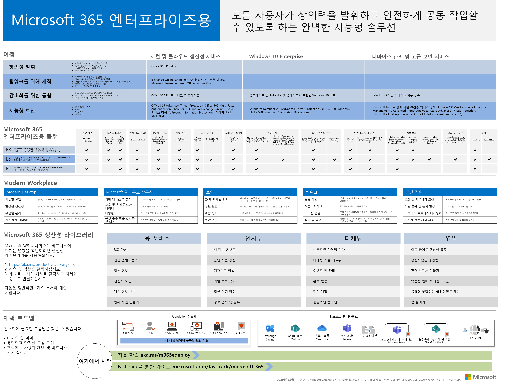
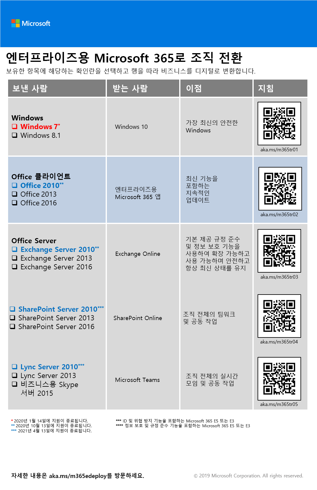
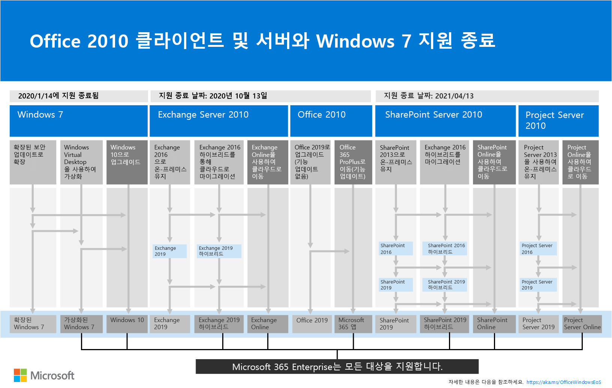

# 엔터프라이즈용 Microsoft 365 개요

기업에 대 한 Microsoft 365는 모든 사람이 창의적인 작업을 수행 하 고 안전 하 게 함께 작업할 수 있도록 지 원하는 완벽 한 지능형 솔루션입니다. 

대규모 조직을 위해 디자인 되었지만 기업에 대 한 Microsoft 365도 가장 고급 보안 및 생산성 기능을 필요로 하는 중간 규모 및 소규모 기업을 위해 사용할 수 있습니다. 

## 구성 요소

엔터프라이즈에 대 한 Microsoft 365는 다음으로 구성 됩니다.

|||
|:-------|:-----|
| 로컬 및 클라우드 기반 앱 및 생산성 서비스 | Office 365 ProPlus, PC 및 Mac용 최신 Office 앱(예: Word, Excel, PowerPoint, Outlook 등) 및 전자 메일, 파일 저장소 및 공동 작업, 모임 등을 위한 완전한 온라인 서비스 제품군이 포함됩니다. |
| Windows 10 Enterprise | 광범위 한 배포, 장치 및 앱 관리를 통해 사용자에 게 가장 생산적이 고 안전한 버전의 Windows 및 IT 전문가가 제공 되는 대규모 및 중간 규모 조직 모두의 요구 사항을 해결 합니다. |
| 장치 관리 및 고급 보안 서비스 | 회사 데이터를 보호 하는 동시에 직원의 생산성을 높일 수 있도록 하는 클라우드 기반 엔터프라이즈 이동성 관리 (EMM) 서비스인 Microsoft Intune이 포함 되어 있습니다. |
|||

## 계획

엔터프라이즈에 대 한 Microsoft 365는 세 가지 요금제에서 사용할 수 있습니다.

|||
|:-------|:-----|
| E3 | 회사 생산성을 향상 시키고 안전 하 게 작업 하는 데 도움이 되도록 Microsoft 365 내의 핵심 제품과 기능에 액세스 합니다. |
| E5 | Advanced threat protection, 보안 및 공동 작업 도구를 포함 하 여 Microsoft 365 내의 최신 제품 및 기능에 액세스 합니다. 모든 E3's 기능 및 고급 보안, 음성 및 데이터 분석 도구를 포함 합니다. |
| F1 | 최고 작업을 수행 하는 데 사용할 수 있는 용도의 제작 된 도구 및 리소스를 통해 Firstline 작업자와 연결 합니다. |
|||

Microsoft 365 E3이 있는 경우 다음 [제품](https://www.microsoft.com/microsoft-365/blog/2019/01/02/introducing-new-advanced-security-and-compliance-offerings-for-microsoft-365/)을 구할 수도 있습니다.

- Id & 위협 방지
- 정보 보호 & 준수

이러한 제품에는 Microsoft 365 E5에 포함 된 추가 기능이 포함 되어 있습니다.

자세한 내용은 [각 요금제의 기능 및](https://www.microsoft.com/microsoft-365/compare-all-microsoft-365-plans)기능을 참조 하십시오.

## 큰 그림 가져오기

[엔터프라이즈 포스터에 대 한 Microsoft 365](../media/m365-poster/Microsoft365Enterprise.pdf) 는 다음을 볼 수 있는 중앙 위치입니다.

- 엔터프라이즈에 대 한 Microsoft 365의 이점과 앱 및 서비스가 가치 핵심 요소로에 매핑되는 방식
- 엔터프라이즈 요금제 용 Microsoft 365 및 포함 된 구성 요소 
- 현대 직장 회사의 주요 구성 요소로, Microsoft 365 for enterprise를 사용 하면
- 일반적인 조직 부서에 대 한 [Microsoft 365 생산성 라이브러리](https://www.microsoft.com/microsoft-365/success/) 및 대표적인 시나리오
- Microsoft 365 for 엔터프라이즈 [배포 가이드](deploy-microsoft-365-enterprise.md) 를 강조 하는 채택 로드맵

포스터 사본을 다운로드 하려면 [여기](https://github.com/MicrosoftDocs/microsoft-365-docs/raw/public/microsoft-365/media/m365-poster/Microsoft365Enterprise.pdf)를 클릭하세요.

## 전체 조직 전환

전체 조직을 Microsoft 365의 기업에 대 한 제품 및 서비스로 이동 하는 방법에 대 한 자세한 그림을 보려면 [전환 포스터](../media/deploy-microsoft-365-enterprise/transition-org-to-m365.pdf)를 참조 하세요.

이 두 페이지 포스터는 신속하게 기존 인프라를 목록화하고 엔터프라이즈용 Microsoft 365에서 해당 제품이나 서비스로 전환하는 방법에 대한 지침을 제공합니다. Windows와 Office 제품, 디바이스 관리, ID, 정보 및 위협 방지와 같은 기타 인프라 및 보안 요소가 포함됩니다.

[이 포스터를 다운로드](https://github.com/MicrosoftDocs/microsoft-365-docs/raw/public/microsoft-365/media/deploy-microsoft-365-enterprise/transition-org-to-m365.pdf)하고 편지형, 법률형 또는 타블로이드(11 x 17) 형식으로 인쇄할 수 있습니다.

## Windows 7 및 Office 2010 클라이언트 및 서버에 대 한 지원 종료 방지

다음 제품은 **2020 년 1 월 14 일**에 대 한 지원 종료에 도달 했습니다.

- [Windows 7](https://aka.ms/win7upgrade)

다음 제품은 **2020 년 10 월 13 일**에 지원 종료에 도달 합니다.

- [Office 2010](https://docs.microsoft.com/DeployOffice/office-2010-end-support-roadmap)
- [Exchange Server 2010](https://docs.microsoft.com/office365/enterprise/exchange-2010-end-of-support)
- [SharePoint Server 2010](https://docs.microsoft.com/office365/enterprise/upgrade-from-sharepoint-2010)

이러한 제품에 대한 업그레이드, 클라우드로 이동 옵션을 알기 쉽게 요약한 내용을 보려면 [지원 종료 포스터](../media/migration-microsoft-365-enterprise-workload/Office2010Windows7EndOfSupport.pdf)를 참조하세요.

이 한 페이지 포스터는 Windows 7 및 Office 2010 클라이언트 및 서버 제품이 지원 종료에 도달 하지 못하도록 하는 데 사용할 수 있는 다양 한 경로를 이해 하는 데 도움이 되는 빠른 방법 이며, 엔터프라이즈에 대 한 Microsoft 365의 기본 설정 경로 및 지원을 통해 강조 표시 됩니다.

[이 포스터를 다운로드](https://github.com/MicrosoftDocs/microsoft-365-docs/raw/public/microsoft-365/media/migration-microsoft-365-enterprise-workload/Office2010Windows7EndOfSupport.pdf)하고 편지형, 법률형 또는 타블로이드(11 x 17) 형식으로 인쇄할 수 있습니다.

## 배포

다음과 같은 세 가지 방법으로 Microsoft 365의 제품, 기능 및 구성 요소를 배포할 수 있습니다.

1. FastTrack와의 파트너 관계
  
   FastTrack을 사용 하면 Microsoft 엔지니어가 사용자의 진도에 따라 클라우드로 쉽게 이동할 수 있습니다. [Microsoft 365에 대한 FastTrack](https://fasttrack.microsoft.com/microsoft365)을 참조하십시오.
  
2. Microsoft 컨설팅 서비스 또는 [microsoft 파트너](https://partner.microsoft.com/)의 도움을 받을 수 있습니다.

   컨설턴트는 현재 인프라를 분석할 수 있으며, 모든 소프트웨어 및 서비스를 엔터프라이즈 용 Microsoft 365에 통합 하는 계획 개발에 도움이 됩니다.

3. 직접 실행

   [Microsoft 365 for enterprise 배포 가이드](deploy-microsoft-365-enterprise.md) 에서는 인프라 및 생산성 워크 로드를 구축 하는 단계별 과정을 단계별로 안내 합니다. 

배포에 대 한 자세한 내용은 how to를 참조 하십시오.

- [고객은](deploy-microsoft-365-enterprise.md#how-customers-use-microsoft-365-for-enterprise) 기업에 대해 Microsoft 365을 사용 합니다.
- [Microsoft](deploy-microsoft-365-enterprise.md#how-microsoft-uses-microsoft-365-for-enterprise) 는 기업에 microsoft 365을 사용 합니다.
- 가상의 대표적인 다국적 조직인 [Contoso Corporation](contoso-overview.md)에는 기업에 대 한 Microsoft 365이 배포 되어 있습니다.

## 추가 Microsoft 365 솔루션

- [Microsoft 365 Business](https://docs.microsoft.com/microsoft-365/business/)
 
  Office 365의 동급 최고의 생산성 및 공동 작업 기능을 장치 관리 및 보안 솔루션과 결합하여 SMB(중소 중견 기업)의 비즈니스 데이터를 보호합니다.

- [Microsoft 365 Education](https://docs.microsoft.com/education)
 
  강사들이 교육용으로 디자인된 저렴한 단일 솔루션에서 독창성을 발휘하고, 팀 작업을 촉진하고, 간편하고 안전한 환경을 제공하도록 지원합니다.

- [Microsoft 365 정부](https://www.microsoft.com/microsoft-365/government)
 
  미국 공공 부문 직원이 안전 하 게 함께 작동 하도록 역량 강화

## Microsoft 365 교육

|||
|:-------|:-----|
| 직접 훈련 하 고 Microsoft 365 인증을 받아야 합니다.   [Microsoft 365 기본](https://docs.microsoft.com/learn/paths/m365-fundamentals/)사항을 사용 하 여 시작 합니다.
|||

## 다음 단계

배포를 직접 수행 하는 경우 [Microsoft 365에서 엔터프라이즈 배포에 대 한 여행](deploy-microsoft-365-enterprise.md)을 시작 합니다.

## 참고 항목

[Enterprise 제품 페이지에 대 한 Microsoft 365](https://www.microsoft.com/microsoft-365/enterprise)
