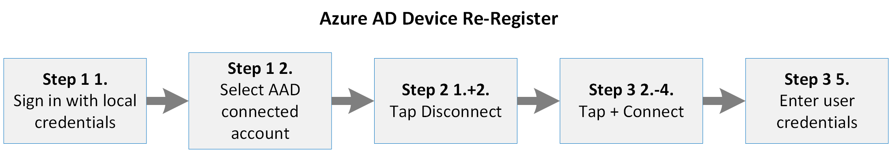

# <a name="additional-device-information-for-the-migration-from-microsoft-cloud-deutschland"></a><span data-ttu-id="4e46d-103">도이클란드 Microsoft 클라우드에서 마이그레이션하기 위한 추가 장치 정보</span><span class="sxs-lookup"><span data-stu-id="4e46d-103">Additional device information for the migration from Microsoft Cloud Deutschland</span></span>

<span data-ttu-id="4e46d-104">도이치클랜드 Microsoft 클라우드에 연결된 Azure AD 가입 및 등록된 장치는 9단계 및 10단계 이전으로 마이그레이션해야 합니다.</span><span class="sxs-lookup"><span data-stu-id="4e46d-104">Azure AD joined and registered devices connected to Microsoft Cloud Deutschland must be migrated after phase 9 and before phase 10.</span></span> <span data-ttu-id="4e46d-105">디바이스의 마이그레이션은 장치 유형, 운영 체제 및 Azure AD 관계에 따라 다릅니다.</span><span class="sxs-lookup"><span data-stu-id="4e46d-105">The migration of a device depends on the devices type, operating system and Azure AD relation.</span></span>

## <a name="azure-ad-joined-windows-10-devices"></a><span data-ttu-id="4e46d-106">Azure AD 가입 Windows 10 장치</span><span class="sxs-lookup"><span data-stu-id="4e46d-106">Azure AD Joined Windows 10 devices</span></span>
<span data-ttu-id="4e46d-107">Azure Windows 10 디바이스가 연결된 경우 Azure AD에서 연결을 끊고 다시 연결해야 합니다.</span><span class="sxs-lookup"><span data-stu-id="4e46d-107">If a Windows 10 device is Azure AD joined, it must be disconnected from Azure AD and must be connected again.</span></span>

<span data-ttu-id="4e46d-108">[](../media/ms-cloud-germany-migration-opt-in/AAD-ReJoin-flow.png#lightbox)</span><span class="sxs-lookup"><span data-stu-id="4e46d-108">[  ](../media/ms-cloud-germany-migration-opt-in/AAD-ReJoin-flow.png#lightbox)</span></span>


<span data-ttu-id="4e46d-109">사용자가 Windows 10 디바이스의 관리자인 경우 사용자는 Azure AD에서 디바이스 등록을 등록을 해지하고 3단계로 다시 가입할 수 있습니다.</span><span class="sxs-lookup"><span data-stu-id="4e46d-109">If the user is an administrator on the Windows 10 device, the user can unregister the device from Azure AD and re-join it again in three steps.</span></span>

### <a name="step-1-determine-if-the-device-is-azure-id-joined"></a><span data-ttu-id="4e46d-110">1단계: 디바이스가 Azure ID에 가입된지 확인</span><span class="sxs-lookup"><span data-stu-id="4e46d-110">Step 1: Determine if the device is Azure ID joined</span></span>

1. <span data-ttu-id="4e46d-111">회사 계정으로 로그인합니다.</span><span class="sxs-lookup"><span data-stu-id="4e46d-111">Sign in with your work account.</span></span>
2. <span data-ttu-id="4e46d-112">계정 **설정**  >    >  **또는 학교 액세스로 이동하십시오.**</span><span class="sxs-lookup"><span data-stu-id="4e46d-112">Go to **Settings** > **Accounts** > **Access Work Or School**.</span></span>
3. <span data-ttu-id="4e46d-113">**목록에서 [...]에 연결된 계정을 찾아야 합니다. s Azure AD**.</span><span class="sxs-lookup"><span data-stu-id="4e46d-113">Look for an account in the list with **connected to […]‘s Azure AD**.</span></span>
4. <span data-ttu-id="4e46d-114">연결된 계정이 있는 경우 2단계를 진행합니다.</span><span class="sxs-lookup"><span data-stu-id="4e46d-114">If a connected account exists, proceed with Step 2.</span></span>

### <a name="step-2-disconnect-the-device-from-azure-ad"></a><span data-ttu-id="4e46d-115">2단계: Azure AD에서 장치 연결 끊기</span><span class="sxs-lookup"><span data-stu-id="4e46d-115">Step 2: Disconnect the device from Azure AD</span></span>

1. <span data-ttu-id="4e46d-116">연결된 **직장** 또는 학교 계정에서 연결 끊기를 클릭합니다.</span><span class="sxs-lookup"><span data-stu-id="4e46d-116">Click **Disconnect** on the connected work or School Account.</span></span>
2. <span data-ttu-id="4e46d-117">연결이 끊어진 것을 두 번 확인 합니다.</span><span class="sxs-lookup"><span data-stu-id="4e46d-117">Confirm the disconnect twice.</span></span>
3. <span data-ttu-id="4e46d-118">로컬 관리자 사용자 이름과 암호를 입력합니다.</span><span class="sxs-lookup"><span data-stu-id="4e46d-118">Enter a local administrator username and password.</span></span> <span data-ttu-id="4e46d-119">디바이스의 연결이 끊어집니다.</span><span class="sxs-lookup"><span data-stu-id="4e46d-119">The device is disconnected.</span></span>
4. <span data-ttu-id="4e46d-120">장치를 다시 시작합니다.</span><span class="sxs-lookup"><span data-stu-id="4e46d-120">Restart the device.</span></span>

### <a name="step-3-join-the-device-to-azure-ad"></a><span data-ttu-id="4e46d-121">3단계: 디바이스를 Azure AD에 연결</span><span class="sxs-lookup"><span data-stu-id="4e46d-121">Step 3: Join the device to Azure AD</span></span>

1. <span data-ttu-id="4e46d-122">로컬 관리자의 자격 증명으로 로그인합니다.</span><span class="sxs-lookup"><span data-stu-id="4e46d-122">Sign in with the credentials of the local administrator.</span></span>
2. <span data-ttu-id="4e46d-123">계정 **설정**  >    >  **또는 학교 액세스로 이동하십시오.**</span><span class="sxs-lookup"><span data-stu-id="4e46d-123">Go to **Settings** > **Accounts** > **Access Work Or School**.</span></span>
3. <span data-ttu-id="4e46d-124">**연결** 을 클릭합니다.</span><span class="sxs-lookup"><span data-stu-id="4e46d-124">Click **Connect**.</span></span>
4. <span data-ttu-id="4e46d-125">**중요:** **Azure AD에 가입을 클릭합니다.**</span><span class="sxs-lookup"><span data-stu-id="4e46d-125">**IMPORTANT**: Click **Join to Azure AD**.</span></span>
5. <span data-ttu-id="4e46d-126">직장 계정의 전자 메일 주소와 암호를 입력합니다.</span><span class="sxs-lookup"><span data-stu-id="4e46d-126">Enter the e-mail address and password of your work account.</span></span> <span data-ttu-id="4e46d-127">장치가 연결되어 있습니다.</span><span class="sxs-lookup"><span data-stu-id="4e46d-127">The device is connected.</span></span>
6. <span data-ttu-id="4e46d-128">장치를 다시 시작합니다.</span><span class="sxs-lookup"><span data-stu-id="4e46d-128">Restart the device.</span></span>
7. <span data-ttu-id="4e46d-129">직장 계정의 전자 메일 주소와 암호로 로그인합니다.</span><span class="sxs-lookup"><span data-stu-id="4e46d-129">Sign in with the email address and password of your work account.</span></span>

<span data-ttu-id="4e46d-130">사용자가 디바이스 관리자가 아닌 경우 Azure AD 전역 관리자는 이 구성 경로에 따라 디바이스에서 로컬 관리자 계정을 만들고 디바이스에 연결을 언니어할 수 있습니다.</span><span class="sxs-lookup"><span data-stu-id="4e46d-130">If the user is not an administrator of the device, an Azure AD global administrator can create the local administrator account on the device following this configuration path and unjoin the device:</span></span>

<span data-ttu-id="4e46d-131">*설정 > 계정 > Microsoft > 없는 사용자 > > 자격 증명을 사용할 수 없음*</span><span class="sxs-lookup"><span data-stu-id="4e46d-131">*Settings > Accounts > Other Accounts > Credentials unknown > Add user without Microsoft-Account*</span></span>

<span data-ttu-id="4e46d-132">다시 가입하기 위해 이 단계에서 조직의 모든 작업 계정의 자격 증명을 사용할 수 있습니다.</span><span class="sxs-lookup"><span data-stu-id="4e46d-132">For re-joining, the credentials of any work account from your organization can be used in this step.</span></span>

<span data-ttu-id="4e46d-133">디바이스에 가입하는 데 사용되는 작업 계정이 자동으로 디바이스 관리자로 승격됩니다.</span><span class="sxs-lookup"><span data-stu-id="4e46d-133">Please consider that the work account used to join the device will be automatically promoted as an Administrator of the device.</span></span>
<span data-ttu-id="4e46d-134">조직의 다른 모든 작업 계정은 장치에 로그인할 수 있지만 관리자 권한이 없습니다.</span><span class="sxs-lookup"><span data-stu-id="4e46d-134">Any other work account from the organization can sign in to the device, but has no administrator privileges.</span></span>

## <a name="azure-ad-registered-workplace-joined-windows-10-devices"></a><span data-ttu-id="4e46d-135">Azure AD 등록(회사 가입) Windows 10 장치</span><span class="sxs-lookup"><span data-stu-id="4e46d-135">Azure AD registered (workplace-joined) Windows 10 devices</span></span>

<span data-ttu-id="4e46d-136">Azure Windows 10 등록된 경우 Azure AD에서 연결을 끊고 다시 연결해야 합니다.</span><span class="sxs-lookup"><span data-stu-id="4e46d-136">If a Windows 10 device is Azure AD registered, it needs to be disconnected from the Azure AD and connected again.</span></span>

<span data-ttu-id="4e46d-137">[](../media/ms-cloud-germany-migration-opt-in/AAD-ReJoin-flow.png#lightbox)</span><span class="sxs-lookup"><span data-stu-id="4e46d-137">[  ](../media/ms-cloud-germany-migration-opt-in/AAD-ReJoin-flow.png#lightbox)</span></span>

### <a name="step-1-determine-if-the-device-is-azure-id-registered"></a><span data-ttu-id="4e46d-138">1단계: 장치가 Azure ID로 등록되어 있는지 확인</span><span class="sxs-lookup"><span data-stu-id="4e46d-138">Step 1: Determine if the device is Azure ID registered</span></span>

1. <span data-ttu-id="4e46d-139">사용자와 함께 로그인합니다.</span><span class="sxs-lookup"><span data-stu-id="4e46d-139">Sign in with your user.</span></span>
2. <span data-ttu-id="4e46d-140">계정 **설정**  >    >  **또는 학교 액세스로 이동하십시오.**</span><span class="sxs-lookup"><span data-stu-id="4e46d-140">Go to **Settings** > **Accounts** > **Access Work Or School**.</span></span>
3. <span data-ttu-id="4e46d-141">목록에서 직장 계정을 검색하고 [...]에 연결되어 있는지 **확인 s Azure AD**.</span><span class="sxs-lookup"><span data-stu-id="4e46d-141">Discover your work account in the list and check if it is **connected to […]‘s Azure AD**.</span></span>

    <span data-ttu-id="4e46d-142">직장 계정이 목록에 있지만 Azure AD에 연결되지 않은 경우 2단계를 진행합니다.</span><span class="sxs-lookup"><span data-stu-id="4e46d-142">If your work account is in the list but NOT connected to an Azure AD, proceed with step 2.</span></span>

    <span data-ttu-id="4e46d-143">그렇지 않으면 디바이스가 Azure AD 가입 장치이기 때문에 Azure AD 가입 장치 를 [Windows 10 합니다.](#azure-ad-joined-windows-10-devices)</span><span class="sxs-lookup"><span data-stu-id="4e46d-143">Otherwise, your device is an Azure AD joined device and you have to refer to [Azure AD Joined Windows 10 devices](#azure-ad-joined-windows-10-devices).</span></span>

### <a name="step-2-disconnect-the-device-from-azure-ad"></a><span data-ttu-id="4e46d-144">2단계: Azure AD에서 장치 연결 끊기</span><span class="sxs-lookup"><span data-stu-id="4e46d-144">Step 2: Disconnect the device from Azure AD</span></span>

1. <span data-ttu-id="4e46d-145">작업 계정을 클릭합니다.</span><span class="sxs-lookup"><span data-stu-id="4e46d-145">Click on your work account.</span></span> <span data-ttu-id="4e46d-146">정보 및 *연결 끊기* *단추가* 나타납니다.</span><span class="sxs-lookup"><span data-stu-id="4e46d-146">The buttons *Info* and *Disconnect* appear.</span></span>
2. <span data-ttu-id="4e46d-147">연결 **끊기를 클릭합니다.**</span><span class="sxs-lookup"><span data-stu-id="4e46d-147">Click **Disconnect**.</span></span>
3. <span data-ttu-id="4e46d-148">예를 클릭하여 장치에서 계정 제거를 **확인합니다.**</span><span class="sxs-lookup"><span data-stu-id="4e46d-148">Confirm account removal from the device by clicking **Yes**.</span></span>

### <a name="step-3-connect-the-device-to-azure-ad"></a><span data-ttu-id="4e46d-149">3단계: 커넥트 Azure AD에 연결</span><span class="sxs-lookup"><span data-stu-id="4e46d-149">Step 3: Connect the device to Azure AD</span></span>

1. <span data-ttu-id="4e46d-150">**연결** 을 클릭합니다.</span><span class="sxs-lookup"><span data-stu-id="4e46d-150">Click **Connect**.</span></span>
2. <span data-ttu-id="4e46d-151">직장 계정의 전자 메일 주소를 입력하고 다음 을 **클릭합니다.**</span><span class="sxs-lookup"><span data-stu-id="4e46d-151">Enter the email address of your work account and click **Next**.</span></span>
3. <span data-ttu-id="4e46d-152">직장 계정의 암호를 입력하고 **로그인을 클릭합니다.**</span><span class="sxs-lookup"><span data-stu-id="4e46d-152">Enter the password of your work account and click **Sign in**.</span></span>
4. <span data-ttu-id="4e46d-153">완료 를 클릭하여 **확인**</span><span class="sxs-lookup"><span data-stu-id="4e46d-153">Confirm by clicking **Done**.</span></span> <span data-ttu-id="4e46d-154">직장 계정이 다시 나열됩니다.</span><span class="sxs-lookup"><span data-stu-id="4e46d-154">Your work account is listed again.</span></span>

## <a name="android"></a><span data-ttu-id="4e46d-155">Android</span><span class="sxs-lookup"><span data-stu-id="4e46d-155">Android</span></span>

<span data-ttu-id="4e46d-156">Android의 경우 사용자는 장치를 등록을 하지 않은 후 다시 등록해야 합니다.</span><span class="sxs-lookup"><span data-stu-id="4e46d-156">For Android, users will need to unregister and re-register their devices.</span></span> <span data-ttu-id="4e46d-157">이 완료는 앱 앱 또는 Microsoft Authenticator 앱을 통해 회사 포털 있습니다.</span><span class="sxs-lookup"><span data-stu-id="4e46d-157">This can be done via the Microsoft Authenticator app or the Company Portal app.</span></span>

- <span data-ttu-id="4e46d-158">Microsoft Authenticator 앱에서 사용자는 장치 **등록으로 설정 > 수 있습니다.**</span><span class="sxs-lookup"><span data-stu-id="4e46d-158">From the Microsoft Authenticator app, users can go to **Settings > Device Registration**.</span></span> <span data-ttu-id="4e46d-159">이 경우 사용자는 디바이스 등록을 등록을 다시 등록하고 다시 등록할 수 있습니다.</span><span class="sxs-lookup"><span data-stu-id="4e46d-159">From there users can unregister and re-register their device.</span></span>

- <span data-ttu-id="4e46d-160">사용자가 회사 포털 탭으로 **이동하여** 디바이스를 제거할 수 있습니다.</span><span class="sxs-lookup"><span data-stu-id="4e46d-160">From the Company Portal, users can go to **Devices** tab and remove the device.</span></span> <span data-ttu-id="4e46d-161">그런 다음 디바이스를 사용하여 장치를 다시 회사 포털.</span><span class="sxs-lookup"><span data-stu-id="4e46d-161">After that, re-enroll the device by using Company Portal.</span></span>

- <span data-ttu-id="4e46d-162">또한 사용자는 계정 설정 페이지에서 계정을 제거한 다음 직장 계정을 다시 추가하여 등록을 다시 등록 및 다시 등록할 수 있습니다.</span><span class="sxs-lookup"><span data-stu-id="4e46d-162">Users can also unregister and re-register by removing the account from the account settings page and then re-adding the work account.</span></span>

<span data-ttu-id="4e46d-163">앱 앱을 사용하여 Android에서 디바이스 등록을 등록을 Microsoft Authenticator:</span><span class="sxs-lookup"><span data-stu-id="4e46d-163">To unregister and re-register the device on Android by using the Microsoft Authenticator app:</span></span>

1. <span data-ttu-id="4e46d-164">앱 Microsoft Authenticator 열고 으로 **설정.**</span><span class="sxs-lookup"><span data-stu-id="4e46d-164">Open the Microsoft Authenticator app and go to **Settings**.</span></span>
2. <span data-ttu-id="4e46d-165">장치 **등록 을 선택합니다.**</span><span class="sxs-lookup"><span data-stu-id="4e46d-165">Select **Device registration**.</span></span>
3. <span data-ttu-id="4e46d-166">등록을 다시 등록하지 않습니다.를 선택하여 디바이스 **등록을 등록을 하세요.**</span><span class="sxs-lookup"><span data-stu-id="4e46d-166">Unregister the device by selecting **Unregister**.</span></span>
4. <span data-ttu-id="4e46d-167">장치 **등록의** 경우 전자 메일 주소를 입력하여 장치를 다시 등록한 다음 등록을 **선택합니다.**</span><span class="sxs-lookup"><span data-stu-id="4e46d-167">For **Device registration**, re-register the device by typing your email address, and then select **Register**.</span></span>

<span data-ttu-id="4e46d-168">Android 장치 등록을 등록을 해지하고 Android 디바이스를 다시 등록하려면 설정:</span><span class="sxs-lookup"><span data-stu-id="4e46d-168">To unregister and re-register an Android device with the Android Settings page:</span></span>

1. <span data-ttu-id="4e46d-169">장치 **설정** 열고 계정으로 **이동하세요.**</span><span class="sxs-lookup"><span data-stu-id="4e46d-169">Open **Device Settings** and go to **Accounts**.</span></span>
2. <span data-ttu-id="4e46d-170">다시 등록할 직장 계정을 선택하고 계정 제거 **를 선택합니다.**</span><span class="sxs-lookup"><span data-stu-id="4e46d-170">Select the work account that you want to re-register and select **Remove account**.</span></span>
3. <span data-ttu-id="4e46d-171">계정이 제거된 후  계정 페이지에서 계정 추가 계정 > **선택합니다.**</span><span class="sxs-lookup"><span data-stu-id="4e46d-171">After the account is removed, from the **Accounts** page, select **Add Account > Work account**.</span></span>
4. <span data-ttu-id="4e46d-172">Workplace **Join의** 경우 전자 메일 주소를 입력하고 **가입을** 선택하여 장치 등록을 완료합니다.</span><span class="sxs-lookup"><span data-stu-id="4e46d-172">For **Workplace Join**, type your email address and select **Join** to complete registering the device.</span></span>

<span data-ttu-id="4e46d-173">Android에서 디바이스 등록을 해지하고 디바이스를 다시 등록하려면 다음을 회사 포털.</span><span class="sxs-lookup"><span data-stu-id="4e46d-173">To unregister and re-register the device on Android from Company Portal:</span></span>

1. <span data-ttu-id="4e46d-174">시작 회사 포털 및 장치 **탭으로** 이동 합니다.</span><span class="sxs-lookup"><span data-stu-id="4e46d-174">Launch Company Portal and go to **Devices** tab.</span></span>
2. <span data-ttu-id="4e46d-175">장치를 선택하여 장치 세부 정보를 확인합니다.</span><span class="sxs-lookup"><span data-stu-id="4e46d-175">Select the device to see the device details.</span></span>
3. <span data-ttu-id="4e46d-176">타원(세 점) 메뉴에서 장치 제거를 선택하고 대화 상자에서 확인하여 제거를 완료합니다. </span><span class="sxs-lookup"><span data-stu-id="4e46d-176">From the ellipses (three dots) menu, select **Remove Device**, and complete the removal by confirming in the dialog.</span></span>
4. <span data-ttu-id="4e46d-177">이제 앱에 로그아웃해야 회사 포털 있습니다.</span><span class="sxs-lookup"><span data-stu-id="4e46d-177">You should now be logged out of the Company Portal app.</span></span> <span data-ttu-id="4e46d-178">로그인을 **선택하여** 장치를 다시 등록합니다.</span><span class="sxs-lookup"><span data-stu-id="4e46d-178">Select **Sign in** to re-register the device.</span></span>

<span data-ttu-id="4e46d-179">이 작업의 마이그레이션 단계 중에 필요한 작업 또는 관리 또는 사용에 미치는 영향에 대한 자세한 내용은 도이치랜드에서 마이그레이션을 위한 추가 Azure AD 정보의 Azure Active Directory(Azure AD)에 대한 정보를 [검토하세요.](ms-cloud-germany-transition-azure-ad.md)</span><span class="sxs-lookup"><span data-stu-id="4e46d-179">For more information about any actions required during the migration phase of this workload, or impact to administration or usage, review the information about Azure Active Directory (Azure AD) in [Additional Azure AD information for the migration from Microsoft Cloud Deutschland](ms-cloud-germany-transition-azure-ad.md).</span></span>

## <a name="ios"></a><span data-ttu-id="4e46d-180">iOS</span><span class="sxs-lookup"><span data-stu-id="4e46d-180">iOS</span></span>

<span data-ttu-id="4e46d-181">iOS 장치에서는 캐시된 계정을 장치에서 수동으로 제거하고, Microsoft Authenticator 등록을 해지하고, 장치의 모든 네이티브 앱에서 로그인해야 합니다.</span><span class="sxs-lookup"><span data-stu-id="4e46d-181">On iOS devices, a user will need to manually remove any cached accounts from the Microsoft Authenticator, unregister the device, and sign out from any native apps on the device.</span></span>

### <a name="step-1-if-present-remove-the-account-from-the-microsoft-authenticator-app"></a><span data-ttu-id="4e46d-182">1단계: 있는 경우 앱의 Microsoft Authenticator 제거</span><span class="sxs-lookup"><span data-stu-id="4e46d-182">Step 1: If present, remove the account from the Microsoft Authenticator app</span></span>

1. <span data-ttu-id="4e46d-183">앱 앱의 계정을 Microsoft Authenticator 탭합니다.</span><span class="sxs-lookup"><span data-stu-id="4e46d-183">Tap the account in the Microsoft Authenticator app.</span></span>
2. <span data-ttu-id="4e46d-184">오른쪽 **설정** 아이콘을 탭합니다.</span><span class="sxs-lookup"><span data-stu-id="4e46d-184">Tap the **Settings** icon in the top-right corner.</span></span> <span data-ttu-id="4e46d-185">if you don't see the **설정,** you might not using the latest version of Microsoft Authenticator.</span><span class="sxs-lookup"><span data-stu-id="4e46d-185">If you don't see the **Settings** icon, you might not be using the latest version of Microsoft Authenticator.</span></span>
3. <span data-ttu-id="4e46d-186">계정 **제거 단추를** 탭합니다.</span><span class="sxs-lookup"><span data-stu-id="4e46d-186">Tap the **Remove account** button.</span></span>
4. <span data-ttu-id="4e46d-187">이 **디바이스의 모든 앱을 탭합니다.**</span><span class="sxs-lookup"><span data-stu-id="4e46d-187">Tap **All apps on this device**.</span></span>

### <a name="step-2-unregister-the-device-from-the-microsoft-authenticator-app"></a><span data-ttu-id="4e46d-188">2단계: Microsoft Authenticator 앱에서 디바이스 등록을 Microsoft Authenticator</span><span class="sxs-lookup"><span data-stu-id="4e46d-188">Step 2: Unregister the device from the Microsoft Authenticator app</span></span>

1. <span data-ttu-id="4e46d-189">오른쪽 위 모서리에서 메뉴 아이콘을 탭합니다.</span><span class="sxs-lookup"><span data-stu-id="4e46d-189">Tap the menu icon in the top-right corner.</span></span>
2. <span data-ttu-id="4e46d-190">를 **설정** 다음 **장치 등록 을 탭합니다.**</span><span class="sxs-lookup"><span data-stu-id="4e46d-190">Tap **Settings** and then **Device Registration**.</span></span>
3. <span data-ttu-id="4e46d-191">계정이 표시될 경우 **등록을** 하지 않은 장치 및 대화 상자에서 **계속을** 탭합니다.</span><span class="sxs-lookup"><span data-stu-id="4e46d-191">If your account is shown, tap **Unregister device** and **Continue** in the dialog.</span></span> <span data-ttu-id="4e46d-192">그 이후에는 계정이 없습니다.</span><span class="sxs-lookup"><span data-stu-id="4e46d-192">You should see no account after that.</span></span>

### <a name="step-3-sign-out-from-individual-apps-if-necessary"></a><span data-ttu-id="4e46d-193">3단계: 필요한 경우 개별 앱에서 서명</span><span class="sxs-lookup"><span data-stu-id="4e46d-193">Step 3: Sign out from individual apps if necessary</span></span>

<span data-ttu-id="4e46d-194">사용자는 앱, 앱 Outlook, Teams 및 OneDrive 앱으로 이동하고 해당 앱에서 계정을 제거할 수 있습니다.</span><span class="sxs-lookup"><span data-stu-id="4e46d-194">Users can go to individual apps like Outlook, Teams, and OneDrive, and remove accounts from those apps.</span></span>

## <a name="frequently-asked-questions"></a><span data-ttu-id="4e46d-195">자주하는 질문</span><span class="sxs-lookup"><span data-stu-id="4e46d-195">Frequently asked questions</span></span>

<span data-ttu-id="4e46d-196">**조직이 영향을 받는지 어떻게 알 수 있나요?**</span><span class="sxs-lookup"><span data-stu-id="4e46d-196">**How can I tell if my organization is affected?**</span></span>

<span data-ttu-id="4e46d-197">관리자는 Azure AD가 등록되어 있는지 또는 Azure AD에 가입되어 `https://portal.microsoftazure.de` 있는지를 확인해야 합니다.</span><span class="sxs-lookup"><span data-stu-id="4e46d-197">Administrators should check `https://portal.microsoftazure.de` to determine if they have any Azure AD registered or Azure AD joined devices.</span></span> <span data-ttu-id="4e46d-198">조직에 Azure AD가 등록되거나 Azure AD 가입 장치가 있는 경우 조직은 이 페이지의 지침을 따라야 합니다.</span><span class="sxs-lookup"><span data-stu-id="4e46d-198">If your organization has Azure AD registered or Azure AD joined devices, your organization has to follow the instructions on this page.</span></span>

<span data-ttu-id="4e46d-199">**사용자가 언제 장치를 다시 등록하나요?**</span><span class="sxs-lookup"><span data-stu-id="4e46d-199">**When do my users re-register their devices?**</span></span>

<span data-ttu-id="4e46d-200">[9단계가](ms-cloud-germany-transition-phases.md#phase-9--10-azure-ad-finalization) 완료된 후에만 장치를 등록을 등록을 해지하고 다시 등록하는 것은 성공에 중요합니다.</span><span class="sxs-lookup"><span data-stu-id="4e46d-200">It's critical to your success that you only unregister and re-register your devices after [phase 9](ms-cloud-germany-transition-phases.md#phase-9--10-azure-ad-finalization) has been completed.</span></span> <span data-ttu-id="4e46d-201">10단계가 시작되기 전에 다시 등록을 완료해야 합니다. 그렇지 않으면 장치에 대한 액세스 권한이 손실될 수 있습니다.</span><span class="sxs-lookup"><span data-stu-id="4e46d-201">You must finish the re-registration before phase 10 starts, otherwise you could lose access to your device.</span></span>

<span data-ttu-id="4e46d-202">**모든 장치가 공용 클라우드에 등록되어 있는 것을 어떻게 알 수 있나요?**</span><span class="sxs-lookup"><span data-stu-id="4e46d-202">**How do I know that all my devices are registered in the public cloud?**</span></span>

<span data-ttu-id="4e46d-203">장치가 공용 클라우드에 등록되어 있는지 확인하려면 Azure AD 포털에서 장치 목록을 내보내고 앱 스프레드시트로 Excel 합니다.</span><span class="sxs-lookup"><span data-stu-id="4e46d-203">To check whether your devices are registered in the public cloud, you should export and download the list of devices from the Azure AD portal to an Excel spreadsheet.</span></span> <span data-ttu-id="4e46d-204">그런 다음 조직에서 마이그레이션 프로세스의 9단계를 통과한 날짜 이후에 _registeredTime_ 열을 사용하여 등록된 장치를 [필터링합니다.](ms-cloud-germany-transition-phases.md#phase-9--10-azure-ad-finalization)</span><span class="sxs-lookup"><span data-stu-id="4e46d-204">Then, filter the devices that are registered (by using the _registeredTime_ column) after the date when your organization has passed [phase 9 of the migration process](ms-cloud-germany-transition-phases.md#phase-9--10-azure-ad-finalization).</span></span>

<span data-ttu-id="4e46d-205">**아직 Dns 기반 DNS를 사용하여 Microsoft용 DNS 레코드 만들기에 Windows [DNS 이름을 추가해야 하나요?](/microsoft-365/admin/dns/create-dns-records-using-windows-based-dns?view=o365-worldwide#add-two-cname-records-for-mobile-device-management-mdm-for-microsoft)**</span><span class="sxs-lookup"><span data-stu-id="4e46d-205">**Do I still need to add the DNS name as stated in [Create DNS records for Microsoft using Windows-based DNS](/microsoft-365/admin/dns/create-dns-records-using-windows-based-dns?view=o365-worldwide#add-two-cname-records-for-mobile-device-management-mdm-for-microsoft)?**</span></span>

<span data-ttu-id="4e46d-206">이 DNS 항목은 더 이상 장치를 다시 등록할 필요가 없습니다.</span><span class="sxs-lookup"><span data-stu-id="4e46d-206">This DNS entry is no longer needed for re-registering your device.</span></span> 

## <a name="additional-considerations"></a><span data-ttu-id="4e46d-207">추가 고려 사항</span><span class="sxs-lookup"><span data-stu-id="4e46d-207">Additional considerations</span></span>

> [!IMPORTANT]
> <span data-ttu-id="4e46d-208">Intune 서비스 주체는 Azure AD 장치 등록의 활성화를 암시하는 마이그레이션 [프로세스의 3단계](ms-cloud-germany-transition-phases.md#phase-3-subscription-transfer)후에 활성화됩니다.</span><span class="sxs-lookup"><span data-stu-id="4e46d-208">The Intune service principal will be enabled after [phase 3 of the migration process](ms-cloud-germany-transition-phases.md#phase-3-subscription-transfer), which implies the activation of Azure AD Device Registration.</span></span> <span data-ttu-id="4e46d-209">마이그레이션 전에 Azure AD 장치 등록을 차단한 경우 Azure AD 포털에서 Azure AD 장치 등록을 다시 사용하지 않도록 설정하려면 PowerShell을 사용하여 Intune 서비스 계정을 사용하지 않도록 설정해야 합니다.</span><span class="sxs-lookup"><span data-stu-id="4e46d-209">If you blocked Azure AD Device Registration before migration, you must disable the Intune service principal with PowerShell to disable Azure AD Device Registration with the Azure AD portal again.</span></span> <span data-ttu-id="4e46d-210">이 명령을 사용하여 Intune 서비스 주체는 Azure Active Directory PowerShell for Graph 있습니다.</span><span class="sxs-lookup"><span data-stu-id="4e46d-210">You can disable the Intune service principal with this command in the Azure Active Directory PowerShell for Graph module.</span></span>

```powershell
Get-AzureADServicePrincipal -All:$true |Where-object -Property AppId -eq "0000000a-0000-0000-c000-000000000000" | Set-AzureADServicePrincipal -AccountEnabled:$false
```

## <a name="more-information"></a><span data-ttu-id="4e46d-211">추가 정보</span><span class="sxs-lookup"><span data-stu-id="4e46d-211">More information</span></span>

<span data-ttu-id="4e46d-212">시작:</span><span class="sxs-lookup"><span data-stu-id="4e46d-212">Getting started:</span></span>

- [<span data-ttu-id="4e46d-213">독일 Microsoft 클라우드에서 새 독일 Office 365 서비스로 마이그레이션</span><span class="sxs-lookup"><span data-stu-id="4e46d-213">Migration from Microsoft Cloud Deutschland to Office 365 services in the new German datacenter regions</span></span>](ms-cloud-germany-transition.md)
- [<span data-ttu-id="4e46d-214">Microsoft Cloud Deutschland 마이그레이션 지원</span><span class="sxs-lookup"><span data-stu-id="4e46d-214">Microsoft Cloud Deutschland Migration Assistance</span></span>](https://aka.ms/germanymigrateassist)
- [<span data-ttu-id="4e46d-215">마이그레이션에 대해 옵트인하는 방법</span><span class="sxs-lookup"><span data-stu-id="4e46d-215">How to opt-in for migration</span></span>](ms-cloud-germany-migration-opt-in.md)
- [<span data-ttu-id="4e46d-216">마이그레이션 중의 고객 환경</span><span class="sxs-lookup"><span data-stu-id="4e46d-216">Customer experience during the migration</span></span>](ms-cloud-germany-transition-experience.md)

<span data-ttu-id="4e46d-217">전환을 통해 이동:</span><span class="sxs-lookup"><span data-stu-id="4e46d-217">Moving through the transition:</span></span>

- [<span data-ttu-id="4e46d-218">문장 작업 및 영향 마이그레이션</span><span class="sxs-lookup"><span data-stu-id="4e46d-218">Migration phases actions and impacts</span></span>](ms-cloud-germany-transition-phases.md)
- [<span data-ttu-id="4e46d-219">추가 사전 작업</span><span class="sxs-lookup"><span data-stu-id="4e46d-219">Additional pre-work</span></span>](ms-cloud-germany-transition-add-pre-work.md)
- <span data-ttu-id="4e46d-220">[Azure AD,](ms-cloud-germany-transition-azure-ad.md) [장치,](ms-cloud-germany-transition-add-devices.md) [환경](ms-cloud-germany-transition-add-experience.md)및 [AD FS에](ms-cloud-germany-transition-add-adfs.md)대한 추가 정보.</span><span class="sxs-lookup"><span data-stu-id="4e46d-220">Additional information for [Azure AD](ms-cloud-germany-transition-azure-ad.md), [devices](ms-cloud-germany-transition-add-devices.md), [experiences](ms-cloud-germany-transition-add-experience.md), and [AD FS](ms-cloud-germany-transition-add-adfs.md).</span></span>

<span data-ttu-id="4e46d-221">클라우드 앱:</span><span class="sxs-lookup"><span data-stu-id="4e46d-221">Cloud apps:</span></span>

- [<span data-ttu-id="4e46d-222">Dynamics 365 마이그레이션 프로그램 정보</span><span class="sxs-lookup"><span data-stu-id="4e46d-222">Dynamics 365 migration program information</span></span>](/dynamics365/get-started/migrate-data-german-region)
- [<span data-ttu-id="4e46d-223">Power BI 마이그레이션 프로그램 정보</span><span class="sxs-lookup"><span data-stu-id="4e46d-223">Power BI migration program information</span></span>](/power-bi/admin/service-admin-migrate-data-germany)
- [<span data-ttu-id="4e46d-224">Microsoft Teams 업그레이드 시작하기</span><span class="sxs-lookup"><span data-stu-id="4e46d-224">Getting started with your Microsoft Teams upgrade</span></span>](/microsoftteams/upgrade-start-here)
