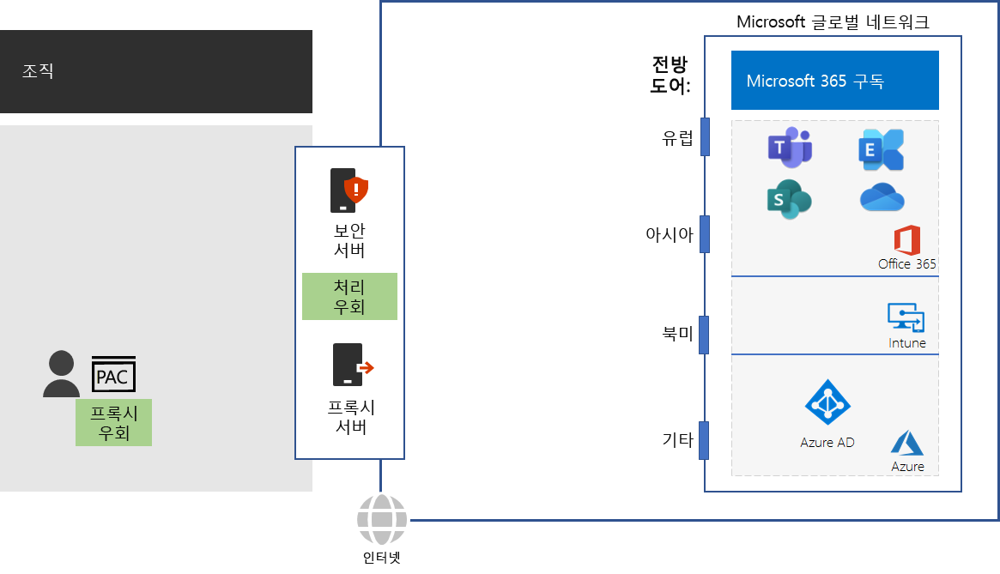

# 4단계: 트래픽 바이패스 구성Step 4: Configure traffic bypass

*이 단계는 선택 사항이며, Microsoft 365 Enterprise E3 및 E5 버전에 적용됩니다.**This step is optional and applies to both the E3 and E5 versions of Microsoft 365 Enterprise*

일반 인터넷 트래픽이 위험할 수 있으므로 일반적인 조직 네트워크는 프록시 서버, SSL 중단 및 조사, 패킷 검사 장치와 같은 에지 장치와 데이터 손실 방지 시스템을 통해 보안을 적용합니다.Because general Internet traffic can be risky, typical organization networks enforce security with edge devices such as proxy servers, SSL Break and Inspect, packet inspection devices, and data loss prevention systems. [Microsoft 365 트래픽에 대해 타사 네트워크 장치 또는 솔루션 사용](https://support.microsoft.com/help/2690045/using-third-party-network-devices-or-solutions-with-office-365)에서 네트워크 차단 장치의 일부 문제점을 읽어보세요.Read about some of the issues with network interception devices at [Using third-party network devices or solutions on Microsoft 365 traffic](https://support.microsoft.com/help/2690045/using-third-party-network-devices-or-solutions-with-office-365).

그러나 Microsoft 365 클라우드 기반 서비스에서 사용하는 DNS 도메인 이름 및  IP 주소는 잘 알려져 있습니다. 또한 트래픽 및 서비스 자체는 많은 보안 기능으로 보호됩니다. 이러한 보안 및 보호는 이미 설정되어 있으므로 에지 장치에서 복제할 필요가 없습니다. Microsoft 365 트래픽에 대한 중간 대상 및 중복 보안 처리로 인해 성능이 크게 저하될 수 있습니다.However, the DNS domain names and IP addresses used by Microsoft 365 cloud-based services are well known. Additionally, the traffic and services themselves are protected with many security features. Because this security and protection is already in place, your edge devices don’t need to duplicate it. Intermediate destinations and duplicate security processing for Microsoft 365 traffic can dramatically decrease performance.

중간 대상 및 중복 보안 처리를 제거하는 첫 번째 단계는 Microsoft 365 트래픽을 식별하는 것입니다. Microsoft는 끝점이라고 하는 다음과 같은 유형의 DNS 도메인 이름 및 IP 주소 범위를 정의했습니다.The first step in eliminating intermediate destinations and duplicate security processing is to identify Microsoft 365 traffic. Microsoft has defined the following types of DNS domain names and IP address ranges, known as endpoints:

- **최적화** - 모든 Microsoft 365 서비스에 연결이 필요하며 Microsoft 365 대역폭, 연결, 데이터 볼륨의 75%를 초과하여 표시합니다.**Optimize** - Required for connectivity to every Microsoft 365 service and represent over 75% of Microsoft 365 bandwidth, connections, and volume of data. 이러한 끝점은 네트워크 성능, 대기 시간 및 가용성에 가장 중요한 Microsoft 365 시나리오를 나타냅니다.These endpoints represent Microsoft 365 scenarios that are the most sensitive to network performance, latency, and availability.
- **허용** - 특정 Microsoft 365 서비스 및 기능에 연결하는 데 필요하지만 최적화 범주의 경우만큼 네트워크 성능 및 대기 시간에 민감하지 않습니다.**Allow** - Required for connectivity to specific Microsoft 365 services and features but are not as sensitive to network performance and latency as those in the Optimize category.
 - **기본** - 최적화를 요구하지 않는 Microsoft 365 서비스 및 종속성을 나타냅니다. 기본 범주 엔드포인트를 일반적인 인터넷 트래픽으로 처리할 수 있습니다.**Default** - Represent Microsoft 365 services and dependencies that do not require any optimization. You can treat Default category endpoints as normal Internet traffic.

[https://aka.ms/o365endpoints](https://aka.ms/o365endpoints)에서 DNS 도메인 이름 및 IP 주소 범위를 찾을 수 있습니다.You can find the DNS domain names and IP address ranges at [https://aka.ms/o365endpoints](https://aka.ms/o365endpoints).

다음이 권장됩니다.Microsoft recommends that you:

- 온-프레미스 컴퓨터의 인터넷 브라우저에서 PAC(프록시 자동 구성) 스크립트를 사용하여 Microsoft 365 클라우드 기반 서비스의 DNS 도메인 이름에 대한 프록시 서버를 무시합니다.Use Proxy Automatic Configuration (PAC) scripts on the Internet browsers of your on-premises computers to bypass your proxy servers for the DNS domain names of Microsoft 365 cloud-based services. 최신 Microsoft 365 PAC 스크립트의 경우 [Get-Pacfile PowerShell 스크립트](https://docs.microsoft.com/office365/enterprise/managing-office-365-endpoints#use-a-pac-file-for-direct-routing-of-vital-office-365-traffic)를 참조하세요.For the latest Microsoft 365 PAC script, see the [Get-Pacfile PowerShell script](https://docs.microsoft.com/office365/enterprise/managing-office-365-endpoints#use-a-pac-file-for-direct-routing-of-vital-office-365-traffic).

- 에지 장치를 분석하여 중복 처리를 확인한 후, 처리하지 않고 최적화 및 허용 끝점으로 트래픽을 전달하도록 구성합니다. 이것을 트래픽 바이패스라고 합니다.Analyze your edge devices to determine the duplicate processing and then configure them to forward traffic to Optimize and Allow endpoints without processing. This is known as traffic bypass. 

다음은 네트워크 인프라에 몇 가지 권장 사항입니다.Here are these recommendations in your network infrastructure.

에지 장치에는 방화벽, SSL 중단 및 조사, 패킷 검사 장치, 데이터 손실 방지 시스템 등이 포함됩니다.Edge devices include firewalls, SSL Break and Inspect, packet inspection devices, and data loss prevention systems. 에지 장치를 구성하고 업데이트하려면 스크립트나 REST 호출을 사용하여 Office 365 끝점 웹 서비스에서 끝점의 구조화 목록을 사용할 수 있습니다.To configure and update the configurations of edge devices, you can use a script or a REST call to consume a structured list of endpoints from the Office 365 Endpoints web service. 자세한 내용은 [Microsoft 365 IP 주소 및 URL 웹 서비스](https://docs.microsoft.com/office365/enterprise/office-365-ip-web-service)를 참조하세요.For more information, see [Microsoft 365 IP Address and URL Web service](https://docs.microsoft.com/office365/enterprise/office-365-ip-web-service).

Microsoft 365 최적화 및 허용 범주 끝점에 대한 트래픽의 일반 프록시 및 네트워크 보안 처리만 우회하게 됩니다. 다른 모든 일반 인터넷 트래픽은 프록시 처리되며, 기존 네트워크 보안 처리를 따릅니다.Note that you are only bypassing normal proxy and network security processing for traffic to Microsoft 365 Optimize and Allow categories endpoints. All other general Internet traffic will be proxied and be subject to your existing network security processing.

## VPN 연결을 사용하는 원격 근무자들을 위한 트래픽 최적화Optimizing traffic for remote workers that use VPN connections

원격 근무자들은 조직의 인트라넷에 리소스에 액세스 하기 위해 보통 VPN(가상 사설망) 연결을 사용합니다.Virtual private network (VPN) connections are commonly used by remote workers to access resources on an organization intranet. 기존 VPN 연결은 인터넷 트래픽을 포함하는 모든 트래픽을 조직 인트라넷에 라우팅합니다.A conventional VPN connection routes ALL traffic, including Internet traffic, to the organization intranet. 인터넷 트래픽은 조직의 경계 네트워크와 패킷 처리 장치에 라우팅 됩니다.The Internet traffic gets routed to the organization's edge network and packet processing devices. 이 트래픽은 성능을 현저히 낮추고 원격 근무자의 생산성에 영향을 미칠 수 있는 흐름과 처리 지연의 대상이 됩니다.This traffic is subject to travel and processing delays that can dramatically decrease performance and impact the productivity of your remote workers. 

분산 터널링은 인터넷의 특정 트래픽을 VPN 연결이 아닌 인터넷으로 보내는 VPN 연결 기능입니다.Split tunneling is the capability of a VPN connection to route specified traffic over the Internet rather than sending it over the VPN connection to your intranet. Teams, SharePoint Online, Exchange Online 등의 주요 Microsoft 365 서비스를 사용하는 원격 근무자의 최상의 성능을 위해서 VPN 연결에 분산 터널링을 구성하여 인터넷을 통해 Microsoft 365 끝점 항목을 최적화하여 트래픽을 보냅니다.For the best performance for remote workers to critical Microsoft 365 services such as Teams, SharePoint Online, and Exchange Online, configure your split tunneling VPN connections to send traffic to Optimize category endpoints directly over the Internet. 

자세한 내용은 [VPN 분산 터널링을 사용하여 원격 근무자의 연결 원격 최적화](https://docs.microsoft.com/office365/enterprise/office-365-vpn-split-tunnel)를 참조하세요.For detailed information, see [Optimize connectivity for remote users using VPN split tunnelling](https://docs.microsoft.com/office365/enterprise/office-365-vpn-split-tunnel).

Microsoft의 전역 네트워크에 대한 진입점과 얼마나 근접한지와 조직 네트워크가 ISP에 연결되는 지점과 얼마나 근접한지를 테스트하려면 [Office 365 Network 온보딩 도구](https://connectivity.office.com/)를 사용하세요.To test how close you are to an entry point for Microsoft’s global network and how close you are to the point where your organization network connects to your ISP, use the [Office 365 Network Onboarding tool](https://connectivity.office.com/).

중간 검사점으로 이 단계에 대한 [종료 조건](networking-exit-criteria.md#crit-networking-step4)을 확인할 수 있습니다.As an interim checkpoint, you can see the [exit criteria](networking-exit-criteria.md#crit-networking-step4) for this step.

## 다음 단계Next step

|||
|:-------|:-----|
||[클라이언트 및 서비스 성능 최적화Optimize client and service performance](networking-optimize-tcp-performance.md) |

