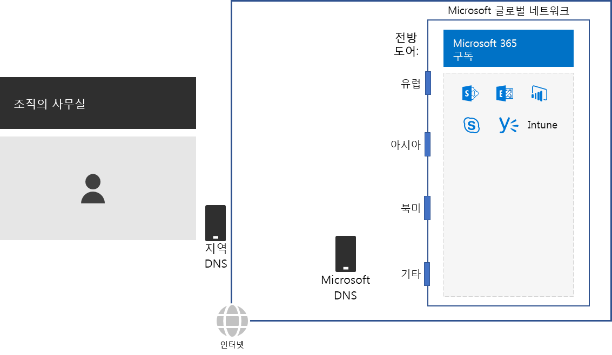
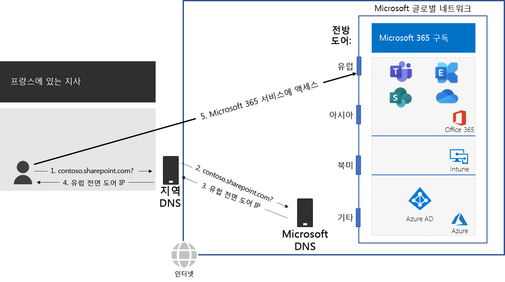

# 2단계: 각 사무실에 대해 로컬 인터넷 연결 구성Step 2: Configure local Internet connections for each office

*이 단계는 필수 사항이며, Microsoft 365 Enterprise E3 및 E5 버전에 적용됩니다.**This step is required and applies to both the E3 and E5 versions of Microsoft 365 Enterprise*

2단계에서는 각 사무실에 로컬 인터넷 연결이 설정되고 로컬 DNS 서버를 사용하고 있어야 합니다.연결 대기 시간을 줄이고 온-프레미스 클라이언트 컴퓨터가 Microsoft 365 클라우드 기반 서비스의 가장 가까운 입력 지점에 연결되어 있도록 하려면 이러한 두 요소가 모두 필요합니다.In Step 2, you ensure that each of your offices have local Internet connections and use local DNS servers. Both of these elements are required to reduce connection latency and ensure that on-premises client computers make connections to the nearest point of entry to Microsoft 365 cloud-based services.

대규모 조직의 경우 기존 네트워크에서 인터넷 트래픽은 네트워크 기간망을 통해 중앙 인터넷 연결점으로 이동합니다.In traditional networks for large organizations, Internet traffic travels across the network backbone to a central Internet connection. 이 기능은 Microsoft 365의 Office 365 및 Intune 제품을 포함하는 전역적으로 분산된 서비스로서의 소프트웨어 (SaaS) 인프라의 성능을 최적화하는 데에는 적합하지 않습니다.In traditional networks for large organizations, Internet traffic travels across the network backbone to a central Internet connection. This does not work well for optimizing performance to a globally distributed Software-as-a-Service (SaaS) infrastructure, which includes the Office 365 and Enterprise Mobility + Security (EMS) products in Microsoft 365.

Microsoft 전역 네트워크는 우수한 가용성과 확장성을 갖추고 지리적으로 분산된 위치를 갖춘 네트워크 엣지 *Distributed Service Front Door* 인프라를 포함하고 있습니다.The Microsoft Global Network includes a *Distributed Service Front Door* infrastructure, a highly available and scalable network edge with geographically distributed locations. 이 인프라는 프론트 도어 서버에서 최종 사용자의 연결을 종료하고 Microsoft 전역 네트워크 내에서 최종 사용자 트래픽을 효율적으로 라우팅합니다.It terminates end user connections at a front door server and efficiently routes end user traffic within the Microsoft Global Network.

최상의 성능을 위해서는 온-프레미스 클라이언트가 네트워크 백본을 통해 조직의 중앙 인터넷 연결에 가장 가까운 프런트 도어로 트래픽을 전송하기보다는 지리적으로 가장 가까운 프런트 도어 위치에 액세스해야 합니다.The Microsoft Global Network includes front end servers to the set of cloud services for Microsoft 365 all over the world. For the best performance, on-premises clients should access a front-end server that is geographically closest to them, rather than sending the traffic over a network backbone and to the front-end server that is closest to the organization’s central Internet connection.

다음은 예시입니다.Here’s an example.

파리 지점에 있는 사용자가 SharePoint 온라인 사이트에 액세스하기를 원할 때:When a user in the Paris branch office wants to access a SharePoint Online site:

1. Contoso.sharepoint.com과 같은 이름을 해겷하기 위해 DNS 쿼리를 보냅니다.It sends a DNS query to resolve a name, such as contoso.sharepoint.com. 
2. ISP에서 제공하는 DNS 서버는 해당 쿼리를 Microsoft DNS 서버로 전달합니다.The DNS server provided by the ISP forwards that query to a Microsoft DNS server.
3. Microsoft DNS 서버는 전달된 DNS 쿼리의 원본 IP 주소를 해당 주소에 할당된 지역에 매칭시킵니다.Microsoft’s DNS servers match the source IP address of the forwarded DNS query to the region of the world assigned that address. Microsoft DNS 서버는 유럽에서 가장 가까운 Microsoft Network 프론트 도어의 IP 주소를 사용하여 응답합니다.The Microsoft DNS server responds with the IP address of the nearest Microsoft Network front door in Europe.
4. ISP DNS 서버는 이 IP 주소를 사용자에게 보냅니다.The ISP DNS server sends that IP address to the user.
5. 사용자는 유럽 프론트 도어를 통해 SharePoint 서버로의 연결을 시작합니다.The user initiates a connection to the SharePoint server through the Europe front door.

클라이언트 요청을 지리적으로 가장 가까운 프론트 도어로 서버로 보내기 위해 Microsoft DNS 서버는 클라이언트의 초기 연결 요청에 해당하는 DNS 쿼리를 사용합니다.To direct a client request to the geographically nearest front-end server, Microsoft’s DNS servers use the DNS queries corresponding the client’s initial connection request. Therefore, for the lowest network latency: 따라서 네트워크 지연 속도가 최저인 경우:Therefore, for the lowest network latency:

- 조직의 모든 사무실은 [최적화](https://docs.microsoft.com/office365/enterprise/office-365-network-connectivity-principles#new-office-365-endpoint-categories) 범주 네트워크 트래픽에 대해 로컬 인터넷 연결이 있어야 합니다.All offices of your organization should have local Internet connections for [Optimize](https://docs.microsoft.com/office365/enterprise/office-365-network-connectivity-principles#new-office-365-endpoint-categories) category network traffic.
- 각 로컬 인터넷 연결은 해당 위치에서의 아웃바운드 인터넷 트래픽에 지역적으로 로컬에 있는 DNS 서버를 사용해야 합니다.Each local Internet connection should be using a regionally local DNS server for outbound Internet traffic from that location.

자세한 내용은 [네트워크 연결을 로컬로 송신](https://docs.microsoft.com/office365/enterprise/office-365-network-connectivity-principles#egress-network-connections-locally)을 참조하세요.For more information, see [Egress network connections locally](https://docs.microsoft.com/office365/enterprise/office-365-network-connectivity-principles#egress-network-connections-locally). 

중간 검사점으로 이 단계에 대한 [종료 조건](networking-exit-criteria.md#crit-networking-step2)을 확인할 수 있습니다.As an interim checkpoint, you can see the [exit criteria](networking-exit-criteria.md#crit-networking-step2) for this step.

## 다음 단계Next step

|||
|:-------|:-----|
||[네트워크 헤어핀 방지Avoid network hairpins](networking-avoid-network-hairpins.md)|
