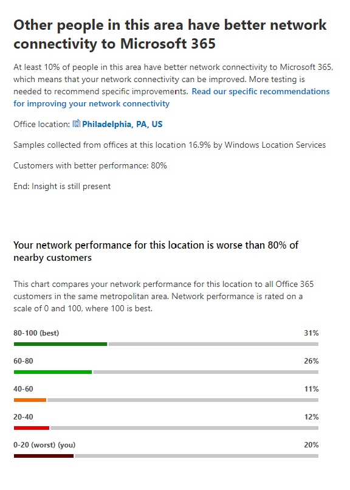

# Microsoft 365 네트워크 Insights

**네트워크 인사이트는** Microsoft 365 테넌트에서 수집된 성능 메트릭으로, 테넌트의 관리 사용자만 볼 수 있습니다. Insights 의 Microsoft 365 관리 센터에 <https://portal.microsoft.com/adminportal/home#/networkperformance> 표시됩니다.

Insights 위치의 네트워크 경계를 디자인하는 데 도움이 되는 정보를 제공합니다. 각 인사이트는 사용자가 테넌트에 액세스하는 각 지리적 위치에 대한 특정 일반적인 문제의 성능 특성에 대한 실시간 세부 정보를 제공합니다.

각 사무실 위치에 대해 표시될 수 있는 6개의 특정 네트워크 인사이트가 있습니다.

- [백hauled 네트워크 유선](#backhauled-network-egress)
- [네트워크 중간 장치](#network-intermediary-device)
- [가까운 고객을 위해 검색된 성능 향상](#better-performance-detected-for-customers-near-you)
- [최적이 아닌 서비스 Exchange Online 프론트 도어 사용](#use-of-a-non-optimal-exchange-online-service-front-door)
- [최적화되지 않은 온라인 SharePoint 프론트 도어 사용](#use-of-a-non-optimal-sharepoint-online-service-front-door)
- [정문에서 낮은 SharePoint 다운로드](#low-download-speed-from-sharepoint-front-door)
- [중국 사용자 최적의 네트워크 유출](#china-user-optimal-network-egress)

테넌트에 대해 표시될 수 있는 두 가지 테넌트 수준 네트워크 인사이트가 있습니다. 이러한 페이지는 생산성 점수 페이지에도 나타납니다.

- [Exchange 문제로 영향을 미치는 샘플링된 연결 수](#exchange-sampled-connections-impacted-by-connectivity-issues)
- [SharePoint 문제로 영향을 미치는 샘플링된 연결 수](#sharepoint-sampled-connections-impacted-by-connectivity-issues)

>[!IMPORTANT]
>Microsoft 365 관리 센터의 네트워크 인사이트, 성능 권장 사항 및 평가는 현재 미리 보기 상태입니다. Microsoft 365 미리 보기 프로그램에 등록된 Microsoft 365 테넌트에만 사용할 수 있습니다.

## 백hauled 네트워크 유선

이 인사이트 서비스는 네트워크 인사이트 서비스에서 특정 사용자 위치에서 네트워크로의 거리가 500 마일(800킬로미터)보다 크다는 것을 감지한 경우, Microsoft 365 트래픽이 일반적인 인터넷 에지 장치 또는 프록시로 백하우게 되었음을 나타내는 경우 표시됩니다.

이 인사이트는 일부 요약 보기에서 "Egress"로 요약됩니다.

> [!div class="mx-imgBorder"]
> 

### 시나리오

이는 사무실 위치와 네트워크 출구 사이의 거리가 500 마일(800킬로미터)보다 먼지(킬로미터)를 식별합니다. 사무실 위치는 난해한 클라이언트 컴퓨터 위치로 식별됩니다. 네트워크에서 위치는 역방향 IP 주소를 사용하여 위치 데이터베이스에 식별됩니다. 컴퓨터의 위치 서비스를 사용하지 않도록 Windows 사무실 위치가 부정확할 수 있습니다. 역방향 IP 주소 데이터베이스 정보가 부정확한 경우 네트워크 유입 위치가 부정확할 수 있습니다.

이 인사이트에 대한 세부 정보에는 사무실 위치, 위치의 예상 총 테넌트 사용자 백분율, 현재 네트워크 발신 위치, 발신 위치의 관련성, 위치와 현재 발신 지점 사이의 거리, 조건이 처음 검색된 날짜 및 조건이 해결된 날짜가 포함됩니다.

### 어떻게 해야 하나요?

이 정보의 경우 연결이 Microsoft의 전역 네트워크 및 가장 가까운 서비스 프런트 도어로 최적으로 라우팅될 수 있도록 사무실 위치에 더 가깝게 네트워크 Microsoft 365 것이 좋습니다. 또한 Microsoft는 향후 네트워크 지점과 서비스 프런트 도어를 모두 확장하여 사용자 사무실 위치로의 네트워크 Microsoft 365 수 있도록 합니다.

이 문제를 해결하는 방법에 대한 자세한 내용은 Egress Network Connectivity [Principles에서](microsoft-365-network-connectivity-principles.md#egress-network-connections-locally) Office 365 [참조하세요.](microsoft-365-network-connectivity-principles.md)

## 네트워크 중간 장치

이 인사이트는 사용자와 Microsoft 네트워크 간에 디바이스가 사용자 환경에 영향을 미칠 수 있는 디바이스를 감지한 Office 365 표시됩니다. Microsoft 데이터 센터로 전송되는 특정 Microsoft 365 네트워크 트래픽에 대해 이러한 트래픽을 무시하는 것이 좋습니다. 이 권장 설정은 네트워크 연결 Microsoft 365 [설명에 추가적으로 설명되어 있습니다.](microsoft-365-network-connectivity-principles.md) 

한 가지 네트워크 중계 인사이트는 네트워크 중계 장치에 의해 가로채기 및 암호 해독되는 Exchange, SharePoint Teams 네트워크 끝점에 대한 중요한 네트워크 끝점이 있는 경우 SS Office 365 L 중단 및 검사입니다.

### 시나리오

프록시 서버, VPN 및 데이터 손실 방지 장치와 같은 네트워크 중간 장치는 트래픽이 중간에 있는 Microsoft 365 클라이언트의 성능과 안정성에 영향을 줄 수 있습니다.

### 어떻게 해야 하나요?

네트워크 트래픽에 대한 처리를 무시하도록 검색된 네트워크 Microsoft 365 구성합니다.

## 가까운 고객을 위해 검색된 성능 향상

이 인사이트는 네트워크 인사이트 서비스에서 대도시 지역에 있는 많은 고객이 이 사무실에 있는 조직의 사용자보다 더 나은 성능을 제공한다고 감지하는 경우 표시됩니다.

이 인사이트는 일부 요약 보기에서 "피어"로 요약됩니다.

> [!div class="mx-imgBorder"]
> 

### 시나리오

이 인사이트는 이 사무실 위치와 동일한 Microsoft 365 고객에 대한 집계 성과를 검사합니다. 이 인사이트는 사용자의 평균 대기 시간이 인접 테넌트의 평균 대기 시간보다 10% 더 큰 경우 표시됩니다.

### 어떻게 해야 하나요?

이 조건에는 회사 네트워크 또는 ISP의 대기 시간, 병목 현상, 아키텍처 디자인 문제 등 여러 가지 이유가 있을 수 있습니다. 사무실 네트워크와 현재 프런트 도어 사이의 경로에 있는 각 홉 간의 Microsoft 365 검사합니다. 자세한 내용은 네트워크 [연결 Microsoft 365 을 참조하세요.](microsoft-365-network-connectivity-principles.md)

## 최적이 아닌 서비스 Exchange Online 프론트 도어 사용

이 인사이트는 네트워크 인사이트 서비스가 특정 위치에 있는 사용자가 최적의 서비스 프런트 도어에 연결하지 않는 Exchange Online 표시됩니다.

이 인사이트는 일부 요약 보기에서 "라우팅"으로 약어됩니다.

> [!div class="mx-imgBorder"]
> 

### 시나리오

당사는 Exchange Online 사무실 위치 도시에서 사용하기에 적합한 서비스 프런트 도어를 나열합니다. 현재 테스트에서 이 목록에 없는 Exchange Online 서비스 프런트 도어를 사용하는 것으로 표시되어 있는 경우 이 권장을 호출합니다.

### 어떻게 해야 하나요?

최적화되지 않은 Exchange Online 서비스 프런트 도어를 사용하는 경우 회사 네트워크가 들어오기 전에 네트워크 백힐로 인해 발생할 수 있습니다. 이 경우 로컬 및 직접 네트워크 유출이 권장됩니다. 또한 원격 DNS 재귀 해결 서버 사용으로 인해 발생할 수 있습니다. 이 경우 DNS 재귀 확인자 서버를 네트워크 전송에 맞추는 것이 좋습니다.

## 최적화되지 않은 온라인 SharePoint 프론트 도어 사용

이 인사이트는 네트워크 인사이트 서비스가 특정 위치에 있는 사용자가 가장 가까운 온라인 서비스 프런트 도어에 연결하지 않는 SharePoint 표시됩니다.

이 인사이트는 일부 요약 보기에서 "Afd"로 요약됩니다.

> [!div class="mx-imgBorder"]
> 

### 시나리오

테스트 클라이언트가 SharePoint 온라인 서비스 프런트 도어를 식별합니다. 그런 다음 사무실 위치 도시에 대해 해당 도시에 대한 SharePoint 온라인 서비스 프런트 도어와 비교합니다. 일치하지 않는 경우 이 권장됩니다.

### 어떻게 해야 하나요?

최적화되지 않은 SharePoint 온라인 서비스 프런트 도어를 사용하는 경우 회사 네트워크가 들어오기 전에 네트워크 백힐로 인해 발생할 수 있습니다. 이 경우 로컬 및 직접 네트워크 유출이 권장됩니다. 또한 원격 DNS 재귀 해결 서버 사용으로 인해 발생할 수 있습니다. 이 경우 DNS 재귀 확인자 서버를 네트워크 전송에 맞추는 것이 좋습니다.

## 정문에서 낮은 SharePoint 다운로드

이 인사이트는 네트워크 인사이트 서비스가 특정 사무실 위치와 SharePoint Online 간의 대역폭이 1MBps 미만인 경우 표시됩니다.

이 인사이트는 일부 요약 보기에서 "Throughput"로 약어됩니다.

### 시나리오

사용자가 SharePoint Online 및 비즈니스용 OneDrive 도어에서 얻을 수 있는 다운로드 속도는 메가바이트(MBps) 단위로 측정됩니다. 이 값이 1MBps보다 작은 경우 이 정보를 제공합니다.

### 어떻게 해야 하나요?

다운로드 속도를 높이기 위해 대역폭을 늘리면 됩니다. 또는 사무실 위치의 사용자 컴퓨터와 SharePoint 온라인 서비스 프런트 도어 간에 네트워크 정체가 있을 수 있습니다. 이를 연속적인 손실이라고도 부르며 충분한 대역폭을 사용할 수 있는 경우에도 사용자가 사용할 수 있는 다운로드 속도를 제한합니다.

## 중국 사용자 최적의 네트워크 유출

이 인사이트는 조직에서 중국의 사용자가 다른 지리적 위치에 있는 Microsoft 365 테넌트에 연결하는 경우 표시됩니다. 

### 시나리오

조직에 개인 WAN 연결이 있는 경우 다음 위치 중 한 위치에서 인터넷으로 네트워크가 유출된 중국의 사무실 위치에서 네트워크 WAN 회로를 구성하는 것이 좋습니다.

- 홍콩
- 일본
- 대만
- 대한민국
- 싱가포르
- 말레이시아

이러한 위치보다 사용자로부터 더 멀리 인터넷을 유출하면 성능이 낮아지며 중국에서 전송하면 경계 정체로 인해 대기 시간이 길어지며 연결 문제가 발생할 수 있습니다.

### 어떻게 해야 하나요?

이 인사이트와 관련된 성능 문제를 완화하는 방법에 대한 자세한 내용은 중국 사용자를 위한 Microsoft 365 전역 테넌트 성능 최적화를 [참조하세요.](microsoft-365-networking-china.md)

## Exchange 문제로 영향을 미치는 샘플링된 연결 수

이 인사이트는 샘플링된 연결 중 50% 이상이 영향을 미치는 경우를 보여 주게 됩니다. 영향은 각 샘플에 Exchange 60% 미만인 평가로 정의됩니다.

### 시나리오

이는 대부분의 사용자가 사용자 환경과 연결되지 Outlook 경험할 가능성이 Exchange Online. 샘플의 백분율은 60포인트 미만으로 표시하는 사용자의 백분율을 나타내고 있습니다.  

### 어떻게 해야 하나요?

아직 표시하지 않은 경우 Office 위치 네트워크 연결 표시를 사용하도록 설정하세요. 네트워크에 영향을 미치는 불량 네트워크 연결의 영향을 Exchange 각 사무실에서 사용자를 Microsoft 네트워크에 연결하는 네트워크 경계를 개선하는 방법을 찾으시고자 합니다.

## SharePoint 문제로 영향을 미치는 샘플링된 연결 수

이 인사이트는 샘플링된 연결 중 50% 이상이 영향을 미치는 경우를 보여 주게 됩니다. 영향은 각 샘플에 SharePoint 40% 미만인 평가로 정의됩니다.

### 시나리오

이는 대부분의 사용자가 사용자 환경 문제 및 사용자 환경과 관련한 SharePoint OneDrive. 샘플의 백분율은 40포인트 미만으로 표시하는 사용자의 백분율을 나타내고 있습니다.  

### 어떻게 해야 하나요?

아직 표시하지 않은 경우 Office 위치 네트워크 연결 표시를 사용하도록 설정하세요. 네트워크에 영향을 미치는 불량 네트워크 연결의 영향을 SharePoint Microsoft 네트워크에 연결하는 각 사무실에서 네트워크 경계를 개선하는 방법을 찾아야 합니다.

## 관련 항목

[Microsoft 365 관리 센터의 네트워크 연결(미리 보기)](office-365-network-mac-perf-overview.md)

[Microsoft 365 네트워크 평가(미리 보기)](office-365-network-mac-perf-score.md)

[Microsoft 365 연결 테스트 도구(미리 보기)](office-365-network-mac-perf-onboarding-tool.md)

[Microsoft 365 네트워크 연결 위치 서비스(미리 보기)](office-365-network-mac-location-services.md)
