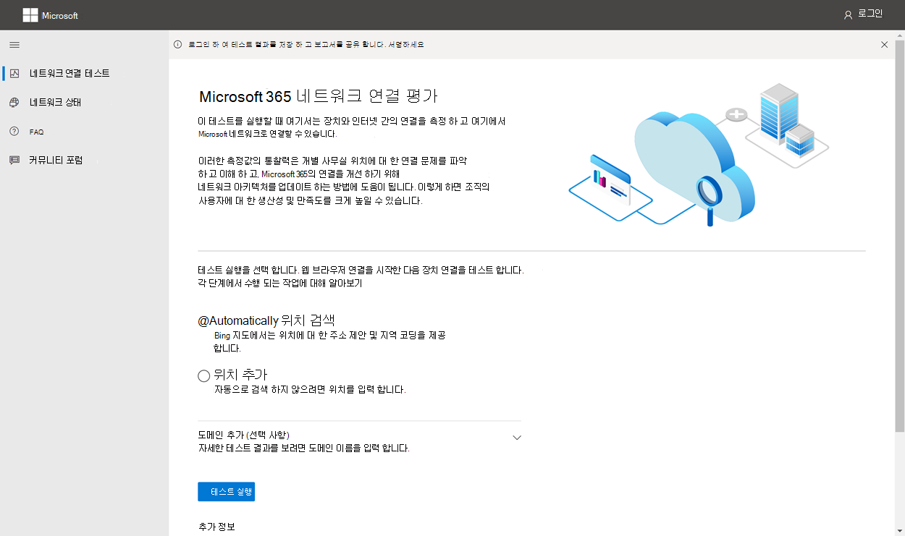

# Microsoft 365 연결 테스트 도구

네트워크 Microsoft 365 테스트 도구는 에 <https://connectivity.office.com> 있습니다. 이 도구는 상태 관리 서비스에서 사용할 수 있는 네트워크 평가 및 네트워크 Microsoft 365 관리 센터 **도구입니다| 연결 메뉴**

> [!IMPORTANT]
> 모든 테스트 보고서가 관리자와 공유되어 로그인하는 동안 Microsoft 365 테넌트에 업로드할 수 있도록 테넌트에 로그인하는 것이 중요합니다.

> [!div class="mx-imgBorder"]
> 

>[!NOTE]
>네트워크 연결 테스트 도구는 WW Commercial 및 Germany의 테넌트는 지원하지만 보통, GCC, GCC, DoD 또는 중국에서는 지원하지 않습니다.

Microsoft 365 관리 센터의 네트워크 인사이트는 매일 집계되는 Microsoft 365 테넌트에 대한 정기적인 제품 내 측정을 기반으로 합니다. 이와는 비교할 때 Microsoft 365 네트워크 연결 테스트의 네트워크 인사이트는 로컬에서 한 번씩 실행됩니다. 제품에서 수행될 수 있는 테스트는 제한되어 있으며, 사용자에게 로컬로 테스트를 실행하면 더 많은 데이터를 수집할 수 있습니다. 그런 다음 Microsoft 365 관리 센터의 네트워크 정보를 통해 특정 사무실 위치에서 Microsoft 365 네트워킹 문제가 있는 것으로 나타날 수 있습니다. Microsoft 365 연결 테스트는 해당 문제의 근본 원인을 파악하여 권장되는 네트워크 성능 개선 작업으로 이어지는 데 도움이 될 수 있습니다.

이러한 인사이트를 함께 사용하여 Microsoft 365 관리 센터의 각 사무실 위치에 대해 네트워킹 품질 상태를 평가할 수 있으며, Microsoft 365 연결 테스트를 기반으로 테스트를 배포한 후에 자세한 정보를 확인할 수 있습니다.

>[!IMPORTANT]
>Microsoft 365 관리 센터의 네트워크 인사이트, 성능 권장 사항 및 평가는 현재 미리 보기 상태입니다. Microsoft 365 미리 보기 프로그램에 등록된 Microsoft 365 테넌트에만 사용할 수 있습니다.

## 각 테스트 단계에서 발생하는 결과

### Office 위치 식별

테스트 실행 단추를 클릭하면 실행 중인 테스트 페이지가 표시되고 사무실 위치가 식별됩니다. 도시, 시 및 국가별로 위치를 입력하거나 웹 브라우저에서 검색할 수 있습니다. 검색한 경우 웹 브라우저에서 위도 및 세로를 요청하고 정확도를 300미터에서 300미터로 제한한 후 사용하세요. 네트워크 성능을 위해 건물보다 위치를 더 정확하게 식별할 필요는 없습니다. 

### JavaScript 테스트

사무실 위치 식별 후 JavaScript에서 TCP 대기 시간 테스트를 실행하고 서비스에서 사용 중 및 권장되는 Office 365 서비스 프런트 도어 서버에 대한 데이터를 요청합니다. 이러한 테스트가 완료되면 지도 및 세부 정보 탭에 다음 단계 전에 해당 테스트가 표시될 수 있습니다.

### 고급 테스트 클라이언트 응용 프로그램 다운로드

다음으로 고급 테스트 클라이언트 응용 프로그램 다운로드를 시작합니다. 사용자가 클라이언트 응용 프로그램을 시작해야 하며 .NET Core도 설치되어 있어야 합니다.

네트워크 연결 Microsoft 365 테스트에는 웹 사이트와 고급 네트워크 연결 테스트를 Windows 다운로드 가능한 클라이언트 응용 프로그램의 두 <https://connectivity.office.com> 부분으로 구성됩니다. 대부분의 테스트에서는 응용 프로그램을 실행해야 합니다. 실행 시 결과를 웹 페이지에 다시 채우게 됩니다.

웹 브라우저 테스트가 완료되면 웹 사이트에서 고급 클라이언트 테스트 응용 프로그램을 다운로드하라는 메시지가 표시됩니다. 메시지가 표시될 때 파일을 열고 실행합니다.

> [!div class="mx-imgBorder"]
> 

### 고급 테스트 클라이언트 응용 프로그램 시작

클라이언트 응용 프로그램이 시작되면 웹 페이지가 업데이트되어 이 결과가 표시됩니다. 테스트 데이터가 웹 페이지로 수신됩니다. 페이지는 새 데이터를 수신할 때마다 업데이트하며 데이터가 도착하면 검토할 수 있습니다.

### 고급 테스트 완료 및 테스트 보고서 업로드

테스트가 완료되면 웹 페이지와 고급 테스트 클라이언트에 모두 표시됩니다. 사용자가 로그인한 경우 테스트 보고서가 고객의 테넌트에 업로드됩니다.

## 테스트 보고서 공유

테스트 보고서에는 사용자 계정으로 로그인해야 Office 365 합니다. 관리자는 테스트 보고서를 공유할 수 있는 방법을 선택합니다.

### 관리자와 보고서 공유

테스트 보고서가 발생할 때 로그인하면 해당 보고서가 관리자와 공유됩니다.

### Microsoft 계정 팀, 지원 또는 기타 담당자와 공유

테스트 보고서(개인 식별 제외)는 Microsoft 직원과 공유됩니다. 이 공유는 기본적으로 사용하도록 설정되어 있으며 상태 관리에서 관리자가 사용하지 않도록 설정할 **수 | 네트워크 연결 센터의** Microsoft 365 관리 페이지입니다.

### 동일한 테넌트에 로그인한 다른 사용자와 Office 365 공유

보고서를 공유할 사용자를 선택할 수 있습니다. 기본적으로 선택할 수 있지만 관리자가 사용하지 않도록 설정할 수 있습니다.

> [!div class="mx-imgBorder"]
> 

### ReportID 링크를 사용하는 모든 사람과 공유

ReportID 링크에 대한 액세스를 제공하여 모든 사용자와 테스트 보고서를 공유할 수 있습니다. 이 링크는 로그인하지 않고 테스트 보고서를 가져올 수 있도록 다른 사람에게 보낼 수 있는 URL을 생성합니다. 이 공유는 기본적으로 사용하지 않도록 설정되어 있으며 관리자가 사용하도록 설정해야 합니다.

> [!div class="mx-imgBorder"]
> 

## 네트워크 연결 테스트 결과

결과는 요약 및 세부 **정보** **탭에** 표시됩니다. 요약 탭에는 검색된 네트워크 경계 맵과 네트워크 평가를 주변의 다른 Office 365 비교가 표시됩니다. 또한 테스트 보고서를 공유할 수 있습니다. 요약 결과 보기의 모양은 다음과 같습니다.

> [!div class="mx-imgBorder"]
> 

다음은 도구에서 보여 주는 세부 정보 탭 출력의 예입니다. 결과가 임계값과 우호적으로 비교된 경우 세부 정보 탭에 녹색 원 확인 표시가 표시됩니다. 결과가 네트워크 통찰력을 나타내는 임계값을 초과하는 경우 빨간색 삼각형 느낌표가 표시됩니다. 다음 섹션에서는 각 세부 정보 탭 결과 행에 대해 설명하고 네트워크 인사이트에 사용되는 임계값에 대해 설명합니다.

> [!div class="mx-imgBorder"]
> 

### 위치 정보

이 섹션에는 사용자 위치와 관련된 테스트 결과가 표시됩니다.

#### 사용자 위치

사용자 위치가 사용자 웹 브라우저에서 검색됩니다. 또한 사용자가 선택한 경우 입력할 수 있습니다. 엔터프라이즈 네트워크 경계의 특정 부분과의 네트워크 거리를 식별하는 데 사용됩니다. 이 위치 검색의 도시와 다른 네트워크 지점까지의 거리만 보고서에 저장됩니다.

사용자 사무실 위치가 지도 보기에 표시됩니다.

#### 네트워크 이동 위치(네트워크가 ISP에 연결되는 위치)

서버 쪽에서 네트워크 전송 IP 주소를 식별합니다. 위치 데이터베이스는 네트워크 연결의 대략적인 위치를 검색하는 데 사용됩니다. 이러한 데이터베이스는 일반적으로 IP 주소의 약 90%의 정확성을 가집니다. 네트워크에서 검색한 위치가 IP 주소로 이동하는 것이 정확하지 않은 경우 이 테스트로 인해 잘못된 결과가 발생할 수 있습니다. 특정 IP 주소에 대해 이 오류가 발생하는지 확인하기 위해 공개적으로 액세스할 수 있는 네트워크 IP 주소 위치 웹 사이트를 사용하여 실제 위치와 비교할 수 있습니다.

#### 네트워크 송신 위치로부터의 거리

해당 위치에서 사무실 위치까지의 거리를 파악합니다. 이는 거리가 **500** 마일(800킬로미터)보다 크면 TCP 대기 시간이 25밀리미터를 넘게 증가하고 사용자 경험에 영향을 줄 수 있는 네트워크 정보로 표시됩니다.

네트워크 시작 위치는 지도 보기에 표시되고 엔터프라이즈 WAN 내부의 네트워크 백할링을 나타내는 사용자 사무실 위치에 연결됩니다.

네트워크 연결을 위해 사용자 사무실 위치에서 인터넷으로 로컬 및 직접 네트워크 Microsoft 365 것이 좋습니다. 로컬 및 직접적인 연결 개선은 이 네트워크 정보를 해결할 수 있는 가장 좋은 방법입니다.

#### 프록시 서버 정보

로컬 컴퓨터로 구성된 프록시 서버를 식별합니다. 네트워크 트래픽에 대한 최적화 범주 및 네트워크 트래픽에 대해 네트워크 경로에 Microsoft 365 식별합니다. 사용자 사무실 위치에서 프록시 서버까지의 거리를 식별합니다. 거리는 ICMP ping에서 먼저 테스트하고 TCP ping으로 테스트에 실패하면 테스트한 다음 실패하면 IP 주소 위치 데이터베이스에서 프록시 서버 IP 주소를 검색합니다. 프록시 서버가 사용자 사무실 위치에서 **500** 마일(800킬로미터)을 멀어도 네트워크 인사이트를 보여 주게 됩니다.

#### 조직에 연결하는 데 사용하는 VPN(가상 사설망)

VPN을 사용하여 서버에 연결하는지 Office 365. VPN이 없는 경우 또는 VPN에 권장 분할 터널 구성이 있는 VPN이 있는 경우 통과 결과가 Office 365.

#### VPN 분할 Tunnel

Exchange Online, SharePoint Online 및 Microsoft Teams 최적화된 각 범주 경로는 VPN에서 터널링되어 있지 않은지 테스트됩니다. 분할된 워크로드는 VPN을 완전히 방지합니다. 터널링된 워크로드는 모두 VPN을 통해 전송됩니다. 선택적 터널링 워크로드에는 VPN을 통해 전송된 경로와 일부 경로가 분할됩니다. 통과 결과는 모든 워크로드가 분할 또는 선택적 터널링된 경우를 보여 주게 됩니다.

#### 대도시 지역에 있는 고객의 성능이 향상됩니다.

Exchange Online 서비스 프런트 도어에 대한 사용자 사무실 위치의 네트워크 TCP 대기 시간은 동일한 대도시에 있는 다른 Microsoft 365 고객과 비교됩니다. 동일한 대도시 지역에 있는 고객의 10% 이상이 더 나은 성능을 얻을 경우 네트워크 통찰력이 표시됩니다. 즉, 사용자가 사용자 인터페이스에서 더 나은 Microsoft 365 것입니다.

이 네트워크 인사이트는 도시에 있는 모든 사용자가 인터넷 회로 및 Microsoft 네트워크에 대해 동일한 통신 인프라와 동일한 근접성에 액세스할 수 있는 기반을 바탕으로 생성됩니다.

#### 네트워크에서 DNS 요청을 할 시간

테스트를 실행한 클라이언트 머신에 구성된 DNS 서버가 포함됩니다. DNS Recursive Resolver 서버일 수 있습니다. DNS 결과를 캐시하고 캐시되지 않은 DNS 요청을 다른 DNS 서버로 전달하는 DNS 전달자 서버일 가능성이 더 높습니다.

이 정보는 정보에만 제공된 것이고 네트워크 정보를 얻지 못합니다.

#### DNS 재발 확인자에 연결하는 데 까지의 거리 및/또는 시간

사용 중 DNS Recursive Resolver는 특정 DNS 요청을 한 다음 DNS 이름 서버에 동일한 요청을 받은 IP 주소를 요청하여 식별됩니다. 이 IP 주소는 DNS 재발 문제 해결사로, 위치를 찾기 위해 IP 주소 위치 데이터베이스에서 검색됩니다. 그러면 사용자 사무실 위치에서 DNS 재발 문제 해결 서버 위치까지의 거리가 계산됩니다. 이는 거리가 **500 마일(800킬로미터)보다** 큰 경우 네트워크 정보로 표시됩니다.

네트워크에서 검색한 위치가 IP 주소가 정확하지 않을 수 있으며 이로 인해 이 테스트에서 잘못된 결과가 발생할 수 있습니다. 특정 IP 주소에 대해 이 오류가 발생하는지 확인하기 위해 공개적으로 액세스할 수 있는 네트워크 IP 주소 위치 웹 사이트를 사용할 수 있습니다.

이 네트워크 인사이트는 서비스 프런트 도어의 선택에 Exchange Online 특히 영향을 미치게 됩니다. 이 인사이트 로컬 및 직접 네트워크 유출을 해결하기 위해 선행 요구가 있는 것이고 DNS 재귀 확인자는 해당 네트워크 발신에 가깝게 위치해야 합니다.

### Exchange Online

이 섹션에서는 테스트 결과와 관련된 Exchange Online.

#### Exchange 서비스 프런트 도어 위치

사용 중 Exchange 서비스 프런트 도어는 이 Outlook 사용자 위치에서 서비스 프런트 도어로의 네트워크 TCP 대기 시간을 측정하는 방식으로 식별됩니다. TCP 대기 시간이 표시되어 있으며 Exchange 서비스 프런트 도어가 현재 위치에 가장 적합한 서비스 프런트 도어 목록과 비교됩니다. 이는 최상의 서비스 프런트 도어 중 Exchange 사용하지 않는 경우 네트워크 정보로 표시됩니다.

최상의 Exchange 서비스 프런트 도어 중 하나를 사용하지 않는 경우 회사 네트워크가 유출되기 전에 네트워크 백힐로 인해 발생할 수 있습니다. 이 경우 로컬 및 직접 네트워크 유출이 권장됩니다. 또한 원격 DNS 재귀 확인자 서버를 사용하여 발생할 수 있습니다. 이 경우 DNS 재귀 확인자 서버를 네트워크 전송에 맞추는 것이 좋습니다.

서비스 프런트 도어에 대한 TCP 대기 시간(ms)Exchange 계산합니다. 테스트된 사용자 사무실 위치 네트워크 대기 시간을 보고 네트워크 대기 시간을 현재 위치에서 서비스 프런트 도어의 Exchange 제거합니다. 이 차이는 개선할 수 있는 잠재적인 기회를 나타 내는 것입니다.

#### 최적의 Exchange 서비스 프런트 도어

이 목록에는 위치의 Exchange 서비스 프런트 도어 위치가 나열됩니다.

#### 클라이언트 DNS에 기록된 서비스 프런트 도어

이 예에는 연결한 Exchange 서비스 프런트 도어 서버의 DNS 이름과 IP 주소가 표시됩니다. 정보만 제공하며 연결된 네트워크 인사이트가 없습니다.

### SharePoint Online

이 섹션에서는 온라인 및 SharePoint 관련된 테스트 결과를 OneDrive.

#### 서비스 프런트 도어 위치

사용 중 SharePoint 서비스 프런트 도어는 OneDrive 클라이언트가 실행하고 사용자 사무실 위치에서 서비스로의 네트워크 TCP 대기 시간을 측정하는 방식으로 식별됩니다.

#### 다운로드 속도

서비스 프런트 도어에서 15Mb 파일의 다운로드 SharePoint 측정합니다. 결과는 초당 메가바이트(메가바이트)로 표시되어 1초에 100만 메가바이트(1초) 또는 SharePoint OneDrive 수 있는 크기를 **나타냅니다.** 이 숫자는 초당 최소 회로 대역폭의 10분의 1과 비슷해야 합니다. 예를 들어 인터넷 연결이 100mbps인 경우 초당 10MB(10MBps)가 예상될 수 있습니다.

#### 버퍼 블로트

15Mb 다운로드 중에 서비스 프런트 도어에 대한 TCP SharePoint 측정합니다. 이는 부하가 진행되는 대기 시간으로, 부하가 없는 경우의 대기 시간과 비교됩니다. 부하가 낮은 경우 대기 시간이 증가하는 것은 소비자 네트워크 장치 버퍼가 로드(또는 부대)에 기인하는 경우가 자주 있습니다. 네트워크 인사이트가 1,000개 이상인 경우 표시됩니다.

#### 클라이언트 DNS에 기록된 서비스 프런트 도어

그러면 연결한 SharePoint 서비스 프런트 도어 서버의 DNS 이름과 IP 주소가 표시됩니다. 정보만 제공하며 연결된 네트워크 인사이트가 없습니다.

### Microsoft Teams

이 섹션에서는 테스트 결과와 관련된 Microsoft Teams.

#### 미디어 연결(오디오, 비디오 및 응용 프로그램 공유)

이 테스트에서는 서비스 프런트 도어에 Microsoft Teams UDP 연결을 테스트합니다. 이 기능이 차단된 경우 Microsoft Teams TCP를 사용하여 계속 작동할 수 있지만 오디오 및 비디오에는 장애가 있습니다. 이러한 UDP 네트워크 측정값에 대한 자세한 내용은 Microsoft Teams Online의 미디어 품질 및 네트워크 연결 성능에서 비즈니스용 Skype [읽어 보아야 합니다.](/skypeforbusiness/optimizing-your-network/media-quality-and-network-connectivity-performance)

#### 패킷 손실

클라이언트에서 서비스 프런트 도어로의 10초 테스트 오디오 호출로 측정된 Microsoft Teams UDP 패킷 손실을 보여줍니다. 통과의 경우 **1.00%보다** 낮아야 합니다.

#### 대기 시간

측정된 UDP 대기 시간을 표시하여 **100ms보다 낮아야 합니다.**

#### 지터

30ms보다 낮아야 하는 측정된 UDP **지터를 보여줍니다.**

#### 연결성

사용자 사무실 위치에서 필요한 모든 네트워크 끝점으로의 HTTP Microsoft 365 테스트합니다. 이러한 웹 은 에 [https://aka.ms/o365ip](./urls-and-ip-address-ranges.md) 게시됩니다. 네트워크에 연결할 수 없는 필수 네트워크 끝점에 대한 네트워크 인사이트가 표시됩니다.

엔터프라이즈 네트워크 경계의 프록시 서버, 방화벽 또는 다른 네트워크 보안 장치에 의해 연결이 차단될 수 있습니다. HTTP 요청을 통해 TCP 포트 80에 대한 연결을 테스트하고 HTTPS 요청을 통해 TCP 포트 443에 대한 연결을 테스트합니다. 응답이 없는 경우 FQDN이 오류로 표시됩니다. HTTP 응답 코드 407이 있는 경우 FQDN이 오류로 표시됩니다. HTTP 응답 코드 403이 있는 경우 응답의 Server 특성을 확인하고 프록시 서버로 나타나는 경우 이를 오류로 표시됩니다. 명령줄 도구 모음을 사용하여 수행한 테스트를 Windows 수 curl.exe.

에 정의된 최적화 또는 허용 범주에 있는 각 필수 Microsoft 365 네트워크 끝점에서 SSL 인증서를 [https://aka.ms/o365ip](./urls-and-ip-address-ranges.md) 테스트합니다. 테스트에서 Microsoft SSL 인증서를 찾지 못하면 연결된 암호화된 네트워크가 중간 네트워크 장치에 의해 가로채야 합니다. 가로채는 암호화된 네트워크 끝점에 네트워크 인사이트가 표시됩니다.

Microsoft에서 제공하지 않는 SSL 인증서가 발견되는 경우 테스트에 대한 FQDN과 사용 중 SSL 인증서 소유자가 표시됩니다. 이 SSL 인증서 소유자는 프록시 서버 공급업체일 수도, 엔터프라이즈 자체 서명된 인증서일 수도 있습니다.

#### 네트워크 경로

이 섹션에서는 Exchange Online 서비스 프런트 도어, SharePoint Online 서비스 프런트 도어 및 Microsoft Teams 서비스 프런트 도어로의 ICMP 추적 Microsoft Teams 보여줍니다. 정보만 제공하며 연결된 네트워크 인사이트가 없습니다. 세 개의 추적이 제공됩니다. a traceroute to _outlook.office365.com_, a traceroute to the customers SharePoint front end or to _microsoft.sharepoint.com_ if one not provided, and a traceroute to _world.tr.teams.microsoft.com._

## 연결 보고서

로그인하면 실행한 이전 보고서를 검토할 수 있습니다. 공유하거나 목록에서 삭제할 수도 있습니다.

> [!div class="mx-imgBorder"]
> 

## 네트워크 상태

이는 Microsoft의 글로벌 네트워크와 관련한 중요한 상태 문제를 보여 주며 이는 고객에 영향을 Microsoft 365 있습니다.

> [!div class="mx-imgBorder"]
> 

## FAQ

다음은 자주 묻는 몇 가지 질문과 대답입니다.

### 이 도구는 Microsoft에서 릴리스 및 지원하나요?

현재 미리 보기로, Microsoft의 지원을 통해 일반 가용성 릴리스 상태에 도달할 때까지 정기적으로 업데이트를 제공할 예정입니다. 개선에 도움이 되는 피드백을 제공하시기 바랍니다. 이 도구의 일부로 보다 자세한 Office 365 네트워크 온보드 가이드를 게시할 계획입니다. 이 가이드는 테스트 결과로 조직에 맞게 사용자 지정됩니다.

### 고급 테스트 클라이언트를 실행하려면 무엇이 필요한가요?

고급 테스트 클라이언트에는 .NET Core 3.1 데스크톱 런타임이 필요합니다. 설치하지 않고 고급 테스트 클라이언트를 실행하면 [.NET Core 3.1](https://dotnet.microsoft.com/download/dotnet-core/3.1)설치 관리자 페이지로 이동됩니다. SDK가 아닌 데스크톱 런타임 또는 페이지 상의 ASP.NET Core 런타임이 설치해야 합니다. .NET Core를 설치하려면 컴퓨터에 대한 관리자 권한이 필요합니다.

### 서비스 Microsoft 365 프론트 도어란?

Microsoft 365 서비스 프런트 도어는 Microsoft 전역 네트워크의 진입점으로, Office 및 서비스가 네트워크 연결을 종료합니다. 네트워크 연결을 최적화하기 위해 Microsoft 365 도시나 대도시에서 가장 가까운 정문으로 네트워크 Microsoft 365 종료하는 것이 좋습니다.

> [!NOTE]
> Microsoft 365 서비스 프런트 도어는 Azure 마켓플레이스에서 사용할 수 있는 **Azure Front Door 서비스** 제품에 직접적인 관계가 없습니다.

### 서비스 프런트 도어가 Microsoft 365 가장 좋은 것은 무엇입니까?

최상의 Microsoft 365 서비스 프런트 도어(이전의 최적의 서비스 프런트 도어)는 일반적으로 도시 또는 대도시에서 네트워크에서 가장 가까운 서비스 프런트 도어입니다. Microsoft 365 네트워크 성능 도구를 사용하여 사용 중 서비스 프런트 도어의 위치를 Microsoft 365 프런트 도어 및 최상의 서비스 프런트 도어를 확인합니다. 이 도구에서 사용 중 프런트 도어가 최상의 정문으로 확인되는 경우 Microsoft의 글로벌 네트워크에 대한 연결이 매우 끊어지기를 기대해야 합니다.

### 인터넷을 통해 이동하는 위치란?

인터넷 나가기 위치는 네트워크 트래픽이 엔터프라이즈 네트워크를 종료하고 인터넷에 연결하는 위치입니다. 이 위치는 NAT(Network Address Translation) 장치가 있으며 일반적으로 ISP(인터넷 서비스 공급자)에 연결하는 위치로도 식별됩니다. 위치와 인터넷의 반경 위치 간에 긴 거리가 표시될 경우 이는 중요한 WAN 백하울을 식별할 수 있습니다.

## 관련 항목

[Microsoft 365 관리 센터의 네트워크 연결(미리 보기)](office-365-network-mac-perf-overview.md)

[Microsoft 365 네트워크 성능 인사이트(미리 보기)](office-365-network-mac-perf-insights.md)

[Microsoft 365 네트워크 평가(미리 보기)](office-365-network-mac-perf-score.md)

[Microsoft 365 네트워크 연결 위치 서비스(미리 보기)](office-365-network-mac-location-services.md)