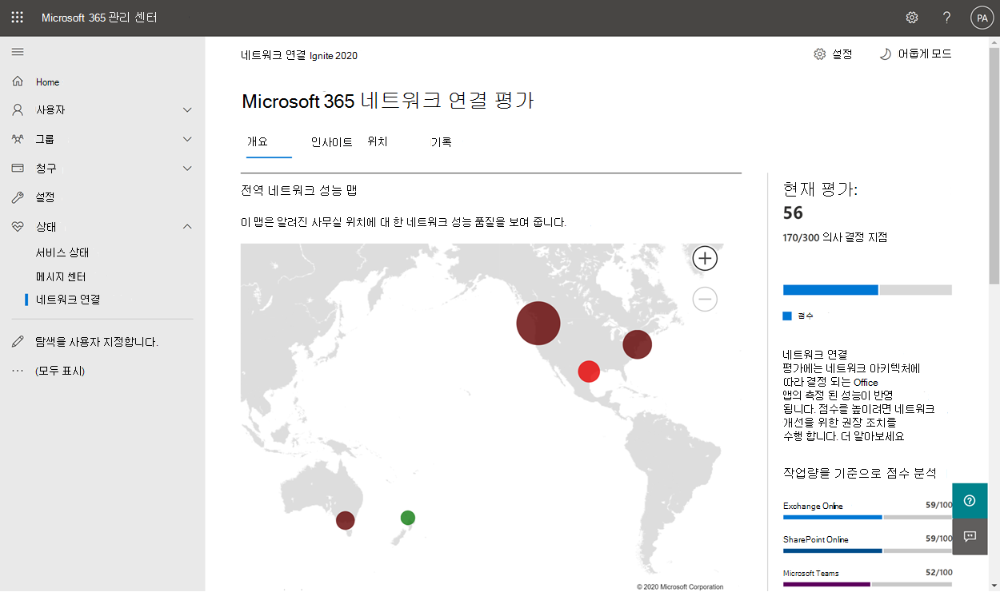
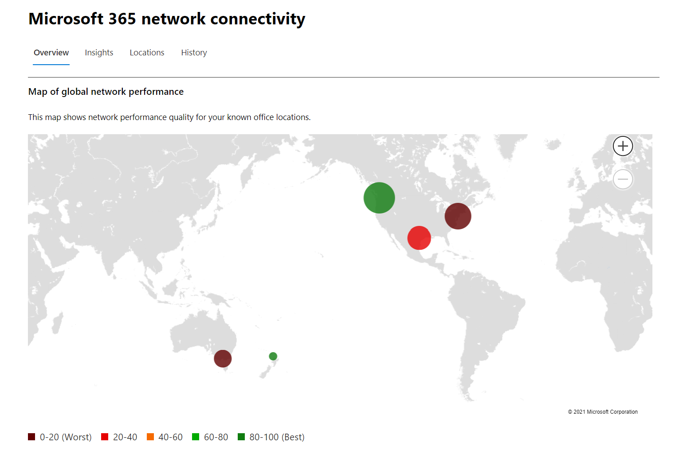
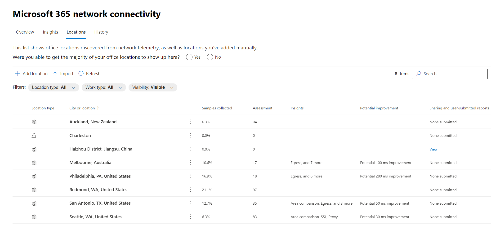
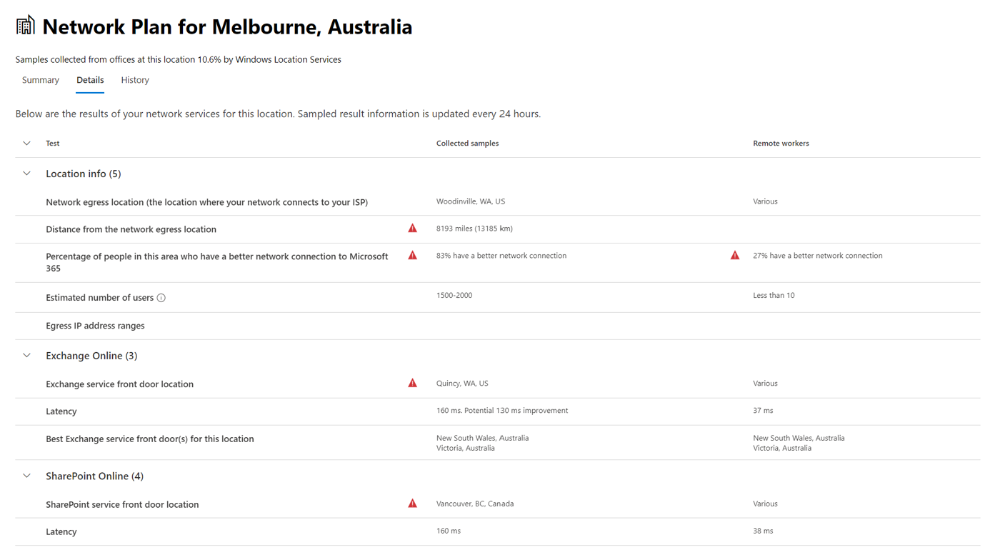

# Microsoft 365 관리 센터의 네트워크 연결(미리 보기)Network connectivity in the Microsoft 365 Admin Center (preview)

이제 Microsoft 365 관리 센터에는 Microsoft 365 테넌트에서 수집된 집계된 네트워크 연결 메트릭이 포함되고 테넌트의 관리 사용자만 볼 수 있습니다.The Microsoft 365 Admin Center now includes aggregated network connectivity metrics collected from your Microsoft 365 tenant and available to view only by administrative users in your tenant.

> [!div class="mx-imgBorder"]
> 

**네트워크 평가** 및 네트워크 인사이트는 Microsoft 365 관리 센터의 상태 관리 센터에  **| 연결 .****Network assessments** and **network insights** are displayed in the Microsoft 365 Admin Center under **Health | Connectivity**.

> [!div class="mx-imgBorder"]
> 

>[!NOTE]
>네트워크 연결 테스트 도구는 WW Commercial 및 Germany의 테넌트는 지원하지만 GCC Moderate, GCC High, DoD 또는 중국은 지원하지 않습니다.The network connectivity test tool supports tenants in WW Commercial and Germany but not GCC Moderate, GCC High, DoD or China.

네트워크 성능 페이지로 처음 이동하면 전역 네트워크 성능 맵, 전체 테넌트로 범위가 지정된 네트워크 평가 및 현재 문제 목록이 포함된 개요 창이 표시됩니다.When you first navigate to the network performance page, you will see an overview pane containing a map of global network performance, a network assessment scoped to the entire tenant, and a list of current issues. 개요에서 드릴다운하여 위치별 특정 네트워크 성능 메트릭 및 문제를 볼 수 있습니다.From the overview, you can drill down to view specific network performance metrics and issues by location. 자세한 내용은 [Microsoft 365 관리 센터의 네트워크 성능 개요를 참조하세요.](#network-connectivity-overview-in-the-microsoft-365-admin-center)For more information, see [Network performance overview in the Microsoft 365 Admin Center](#network-connectivity-overview-in-the-microsoft-365-admin-center).

조직을 대신하여 이 기능에 대한 공개 미리 보기에 참여해야 할 수 있습니다.You may be asked to join the public preview for this feature on behalf of your organization. 수락은 일반적으로 즉시 발생하고 네트워크 연결 페이지가 표시됩니다.Acceptance usually happened immediately and then you will see the network connectivity page. 

네트워크 연결 페이지로 이동하면 전역 네트워크 성능 맵, 전체 테넌트로 범위가 지정된 네트워크 평가 및 현재 문제 목록이 포함된 개요 창이 표시됩니다.On navigating to the network connectivity page, you will see an overview pane containing a map of global network performance, a network assessment scoped to the entire tenant, and a list of current issues. 이 페이지에 액세스하려면 Microsoft 365 내의 조직 관리자 되어야 합니다.To access this page you must be an administrator for the organization within Microsoft 365. 보고서 읽기 권한자 관리 역할에는 이 정보에 대한 읽기 권한이 있습니다.The Report Reader administrative role will have read access to this information. 위치 및 네트워크 연결의 다른 요소를 구성하려면 관리자가 서비스 지원 관리자 역할과 같은 서버 관리자 역할의 일부가 되어야 합니다.To configure locations and other elements of network connectivity an administrator must be part of a server administrator role such as the Service support admin role. 개요에서 드릴다운하여 위치별 특정 네트워크 성능 메트릭 및 문제를 볼 수 있습니다.From the overview, you can drill down to view specific network performance metrics and issues by location. 자세한 내용은 [Microsoft 365 관리 센터의 네트워크 연결 개요를 참조하세요.](#network-connectivity-overview-in-the-microsoft-365-admin-center)For more information, see [Network connectivity overview in the Microsoft 365 Admin Center](#network-connectivity-overview-in-the-microsoft-365-admin-center).

## 네트워크 연결 평가를 표시하기 위한 선행 구성Pre-requisites for network connectivity assessments to appear

시작하려면 위치 옵트인 설정을 켜서 Windows 위치 서비스를 사용하여 장치에서 데이터를 자동으로 수집하거나, 위치 목록으로 이동하여 위치 데이터를 추가하거나 업로드하거나, 사무실 위치에서 Microsoft 365 네트워크 연결 테스트를 실행합니다.To get started, turn on your location opt-in setting to automatically collect data from devices using Windows Location Services, go to your Locations list to add or upload location data, or run the Microsoft 365 network connectivity test from your office locations. 조직 전체에서 네트워크 연결을 평가할 수 있는 반면, 특정 사무실 위치에 대해 네트워크 디자인 개선을 수행해야 합니다.Whilst network connectivity can be evaluated across the organization, any network design improvements will need to be done for specific office locations. 이러한 위치를 결정하면 각 사무실 위치에 대한 네트워크 연결 정보가 제공됩니다.Network connectivity information is provided for each office location once those locations can be determined. 사무실 위치에서 네트워크 평가를 수행하기 위한 세 가지 옵션이 있습니다.There are three options for getting network assessments from your office locations:

### 1. Windows 위치 서비스 사용1. Enable Windows Location Services

이 옵션의 경우 각 사무실 위치에서 선행 구성을 지원하는 컴퓨터가 두 대 이상 실행되고 있어야 합니다.For this option, you must have at least two computers running at each office location that support the pre-requisites. Windows용 OneDrive 버전은 각 컴퓨터에 최신 버전으로 설치해야 합니다.OneDrive for Windows version must be up-to-date and installed on each computer. OneDrive 버전에 대한 자세한 내용은 [OneDrive 릴리스 정보를 참조하세요.](https://support.office.com/article/onedrive-release-notes-845dcf18-f921-435e-bf28-4e24b95e5fc0)For more information on OneDrive versions, see the [OneDrive release notes](https://support.office.com/article/onedrive-release-notes-845dcf18-f921-435e-bf28-4e24b95e5fc0). 네트워크 측정값은 가까운 미래에 다른 Office 365 클라이언트 응용 프로그램에 추가될 예정입니다.Network measurements are planned to be added in other Office 365 client applications in the near future.

Windows 위치 서비스는 컴퓨터의 동의를 얻어야 합니다.Windows Location Service must be consented on the machines. 지도 앱을 실행하고  직접 을(를) 하여 테스트할 수 있습니다.You can test this by running the **Maps** app and locating yourself. 설정 및 설정이 있는 단일 | **개인 정보 보호 | 앱이** 위치에 액세스할 수 있도록 허용 설정을 _사용하도록_ 설정해야 하는 위치입니다.It can be enabled on a single machine with **Settings | Privacy | Location** where the setting _Allow apps to access your location_ must be enabled. _LetAppsAccessLocation_ 설정과 함께 MDM 또는 그룹 정책을 사용하여 PC에 Windows 위치 서비스 동의를 배포할 수 있습니다.Windows Location Services consent can be deployed to PCs using MDM or Group Policy with the setting _LetAppsAccessLocation_.

이 방법을 사용하면 관리 센터에서 위치를 추가할 필요가 없습니다. 도시 확인 시 위치가 자동으로 식별됩니다.You do not need to add locations in the Admin Center with this method as they are automatically identified at the city resolution. Windows Location Services를 사용하여 도시 내의 여러 사무실 위치를 표시하지는 않습니다.You cannot show multiple office locations within a city using Windows Location Services. 또한 위치 정보는 업로드되기 전에 가장 가까운 300미터에서 300미터로 반올올라되어 보다 정확한 위치 정보에 액세스할 수 없습니다.Location information is also rounded to the nearest 300 meters by 300 meters before being uploaded so that more precise location information is not possible to access.

컴퓨터는 이더넷 Wi-Fi 네트워킹을 지원해야 합니다.The machines should have Wi-Fi networking rather than an ethernet cable. 이더넷 케이블이 있는 컴퓨터의 위치 정보가 정확하지 않습니다.Machines with an ethernet cable do not have accurate location information.

측정 샘플 및 사무실 위치는 이러한 선행조치가 충족된 후 24시간이 지난 후에 표시하기 시작해야 합니다.Measurement samples and office locations should start to appear 24 hours after these pre-requisites have been met.

### 2. 위치 추가 및 LAN 서브넷 정보 제공2. Add locations and provide LAN subnet information

이 옵션의 경우 Windows 위치 서비스 및 Wi-Fi 필요하지 않습니다.For this option, neither Windows Location Services nor Wi-Fi are required. Windows용 OneDrive 버전은 최신 버전으로 각 컴퓨터에 설치되어 있어야 합니다.Your OneDrive for Windows version must be up-to-date and installed on each computer at the location.

또한 관리 센터 네트워크 연결 페이지에서 위치를 추가하거나 CSV 파일에서 위치를 가져와야 합니다.You also need to add locations in the Admin Center network connectivity page or to import those from a CSV file. 추가된 위치에는 office LAN 서브넷 정보가 포함되어야 합니다.The locations added must include your office LAN subnet information.

위치를 추가하기 때문에 구에 여러 사무실을 정의할 수 있습니다.Since you are adding the locations, you can have multiple offices defined within a city.

클라이언트 컴퓨터의 모든 테스트 측정에는 입력한 사무실 위치 세부 정보와 상호 관련되는 LAN 서브넷 정보가 포함됩니다.All test measurements from client machines include the LAN subnet information, which is correlated with the office location details that you have entered. 측정 샘플 및 사무실 위치는 이러한 선행조치가 충족된 후 24시간이 지난 후에 표시하기 시작해야 합니다.Measurement samples and office locations should start to appear 24 hours after these pre-requisites have been met.

### 3. Microsoft 365 네트워크 연결 테스트 도구를 사용하여 테스트 보고서를 수동으로 수집3. Manually gather test reports with the Microsoft 365 network connectivity test tool

이 옵션의 경우 각 위치에서 사람을 식별해야 합니다.For this option, you need to identify a person at each location. 관리자 권한이 있는 Windows 컴퓨터에서 [Microsoft 365](https://connectivity.office.com) 네트워크 연결 테스트를 찾아보게 요청합니다.Ask them to browse to [Microsoft 365 network connectivity test](https://connectivity.office.com) on a Windows machine on which they have administrative permissions. 웹 사이트에서는 결과를 보하려는 동일한 조직에 대해 Office 365 계정에 로그인해야 합니다.On the web site, they need to sign-in to their Office 365 account for the same organization that you want to see the results. 그런 다음 테스트 **실행을 클릭해야 합니다.**Then they should click **Run test**. 테스트 중에 다운로드한 연결 테스트 EXE가 있습니다.During the test there is a downloaded Connectivity test EXE. 또한 열고 실행해야 합니다.They need to open and execute that also. 테스트가 완료되면 테스트 결과가 Office 365에 업로드됩니다.Once the tests are completed, the test result is uploaded to Office 365.

테스트 보고서는 LAN 서브넷 정보와 함께 추가된 위치에 연결됩니다. 그렇지 않으면 도시 위치에만 표시됩니다.Test reports are linked to a location if it was added with LAN subnet information, otherwise they are shown at the city location only.

테스트 보고서가 완료된 후 2~3분 후에 측정 샘플 및 사무실 위치가 나타나기 시작해야 합니다.Measurement samples and office locations should start to appear 2-3 minutes after a test report is completed. 자세한 내용은 Microsoft 365 네트워크 연결 테스트(미리 [보기)를 참조하세요.](office-365-network-mac-perf-onboarding-tool.md)For more information, see [Microsoft 365 network connectivity test (preview)](office-365-network-mac-perf-onboarding-tool.md).

## 이 정보는 어떻게 사용하나요?How do I use this information?

**네트워크 인사이트,** 관련 성능 권장 사항 및 네트워크 평가는 사무실 위치에 대한 네트워크 경계를 디자인하는 데 도움이 됩니다.**Network insights**, their related performance recommendations and network assessments are intended to help in designing network perimeters for your office locations. 각 인사이트는 사용자가 테넌트에 액세스하는 각 지리적 위치에 대한 특정 일반적인 문제의 성능 특성에 대한 세부 정보를 제공합니다.Each insight provides details about the performance characteristics for a specific common issue for each geographic location where users are accessing your tenant. **각 네트워크** 인사이트에 대한 성능 권장 사항은 Microsoft 365 네트워크 연결과 관련된 사용자 환경을 개선하기 위해 만들 수 있는 특정 네트워크 아키텍처 디자인 변경 사항을 제공합니다.**Performance recommendations** for each network insight offer specific network architecture design changes you can make to improve user experience related to Microsoft 365 network connectivity. 네트워크 평가에서는 네트워크 연결이 사용자 환경에 미치는 영향을 보여 주며, 서로 다른 사용자 위치 네트워크 연결을 비교할 수 있습니다.The network assessment shows how network connectivity impacts user experience, allowing for comparison of different user location network connections.

**네트워크 평가는** 여러 네트워크 성능 메트릭의 집계를 엔터프라이즈 네트워크 상태의 스냅숏으로 증분합니다( 0에서 100까지의 포인트 값으로 나타났습니다.**Network assessments** distill an aggregate of many network performance metrics into a snapshot of your enterprise network health, represented by a points value from 0 - 100. 네트워크 평가는 전체 테넌트 및 사용자가 테넌트에 연결하는 각 지리적 위치에 대해 범위가 지정되어 Microsoft 365 관리자에게 기업의 네트워크 상태 정보를 즉시 파악하고 모든 전역 사무실 위치에 대한 자세한 보고서로 빠르게 드릴다운할 수 있는 쉬운 방법을 제공합니다.Network assessments are scoped to both the entire tenant and for each geographic location from which users connect to your tenant, providing Microsoft 365 administrators with an easy way to instantly grasp a gestalt of the enterprise's network health and quickly drill down into a detailed report for any global office location.

여러 사무실 위치와 사소하지 않은 네트워크 경계 아키텍처가 있는 복잡한 엔터프라이즈는 Microsoft 365에 처음 온보드하는 동안 또는 사용 증가로 발견된 네트워크 성능 문제를 해결하기 위해 이 정보를 활용합니다.Complex enterprises with multiple office locations and non-trivial network perimeter architectures can benefit from this information either during their initial onboarding to Microsoft 365 or to remediate network performance issues discovered with usage growth. 이는 일반적으로 Microsoft 365를 사용하는 중소기업이나 단순하고 직접적인 네트워크 연결이 이미 있는 대기업에는 필요하지 않습니다.This is usually not necessary for small businesses using Microsoft 365, or any enterprises who already have simple and direct network connectivity. 사용자가 500명 이상인 엔터프라이즈와 사무실 위치가 여러 개 있는 기업이 가장 큰 혜택을 받을 것으로 예상됩니다.Enterprises with over 500 users and multiple office locations are expected to benefit the most.

>[!IMPORTANT]
>Microsoft 365 관리 센터의 네트워크 인사이트, 성능 권장 사항 및 평가는 현재 미리 보기 상태입니다. 기능 미리 보기 프로그램에 등록된 Microsoft 365 테넌트에만 사용할 수 있습니다.Network insights, performance recommendations and assessments in the Microsoft 365 Admin Center is currently in preview status, and is only available for Microsoft 365 tenants that have been enrolled in the feature preview program.

## 엔터프라이즈 네트워크 연결 문제Enterprise network connectivity challenges

> [!div class="mx-imgBorder"]
> 

많은 기업은 시간이 지날 때 증가한 네트워크 경계 구성을 사용하며, 대부분의 웹 사이트가 미리 알려지지 않은 직원 인터넷 웹 사이트 액세스를 수용하도록 주로 디자인되었습니다.Many enterprises have network perimeter configurations which have grown over time and are primarily designed to accommodate employee Internet web site access where most web sites are not known in advance and are untrusted. 이러한 알 수 없는 웹 사이트에서 맬웨어 및 감염 공격을 방지하는 것이 가장 까다로우며 필요한 초점입니다.The prevailing and necessary focus is avoiding malware and fishing attacks from these unknown web sites. 이 네트워크 구성 전략은 보안을 위해 유용하게 사용하면서 Microsoft 365 사용자 성능 및 사용자 환경의 저하를 낼 수 있습니다.This network configuration strategy, while helpful for security purposes, can lead to degradation of Microsoft 365 user performance and user experience.

## 이러한 문제를 해결하는 방법How we can solve these challenges

엔터프라이즈는 Office 365 연결 원칙에 따라 [Microsoft 365](./microsoft-365-network-connectivity-principles.md) 관리 센터 네트워크 연결 기능을 사용하여 일반 사용자 환경을 개선하고 환경을 보호할 수 있습니다.Enterprises can improve general user experience and secure their environment by following [Office 365 connectivity principles](./microsoft-365-network-connectivity-principles.md) and by using the Microsoft 365 Admin Center network connectivity feature. 대부분의 경우 이러한 일반적인 원칙에 따라 최종 사용자 대기 시간, 서비스 안정성 및 Microsoft 365의 전반적인 성능에 큰 영향을 줍니다.In most cases, following these general principles will have a significant positive impact on end user latency, service reliability and overall performance of Microsoft 365.

Microsoft는 경우에 따라 대기업 고객을 위한 Microsoft 365의 네트워크 성능 문제를 조사해야 하며 이러한 문제의 근본 원인은 고객 네트워크 경계 인프라와 관련이 있습니다.Microsoft is sometimes asked to investigate network performance issues with Microsoft 365 for large enterprise customers, and these frequently have a root cause related to the customers network perimeter infrastructure. 고객 네트워크 경계 문제의 일반적인 근본 원인이 발견되는 경우 이를 식별하는 간단한 테스트 측정을 식별하기 위해 노력합니다.When a common root cause of a customer network perimeter issue is found we seek to identify simple test measurements that identifies it. 특정 문제를 식별하는 측정 임계값이 있는 테스트는 모든 위치에서 동일한 측정을 테스트하고 이 근본 원인이 있는지 여부를 알려 관리자와 네트워크 인사이트로 공유할 수 있기 때문에 매우 소중합니다.A test with a measurement threshold that identifies a specific problem is valuable because we can test the same measurement at any location, tell whether this root cause is present there and share it as a network insight with the administrator.

일부 네트워크 인사이트는 추가 조사가 필요한 문제를 나타낼 수만 있습니다.Some network insights will merely indicate a problem that needs further investigation. 근본 원인을 수정하기 위한 특정 수정 작업을 보여 주기 위한 충분한 테스트가 있는 네트워크 인사이트가 권장 작업으로 **나열됩니다.**A network insight where we have enough tests to show a specific remediation action to correct the root cause is listed as a **recommended action**. 이러한 권장 사항은 미리 정해진 임계값을 초과하는 값을 표시하는 라이브 메트릭을 기반으로 하여, 해당 환경과 관련이 있으며 권장 변경이 적용된 후 실제 개선 사항을 보여 주기 때문에 일반적인 모범 사례 조언보다 훨씬 더 소중합니다.These recommendations, based on live metrics that reveal values that fall outside a predetermined threshold, are much more valuable than general best practice advice since they are specific to your environment and will show the actual improvement once the recommended changes have been made.

## Microsoft 365 관리 센터의 네트워크 연결 개요Network connectivity overview in the Microsoft 365 Admin Center

Microsoft는 Microsoft 365 작업을 지원하는 여러 Office 데스크톱 및 웹 클라이언트에서 기존 네트워크 측정값을 제공합니다.Microsoft has existing network measurements from several Office desktop and web clients which support the operation of Microsoft 365. 이러한 측정값은 이제 Microsoft 365 관리 센터의 네트워크 연결  페이지에 표시되는 네트워크 아키텍처 디자인 인사이트 및 네트워크 평가를 제공하는 데 사용됩니다.These measurements are now being used to provide network architecture design insights and a network assessment which are shown in the **Network connectivity** page in the Microsoft 365 Admin Center.

기본적으로 네트워크 측정값과 관련된 대략적인 위치 정보는 클라이언트 장치가 있는 도시를 식별합니다.By default, approximate location information associated with the network measurements identify the city where client devices are located. 각 위치의 네트워크 평가는 색으로 표시되고 각 위치의 상대 사용자 수는 원의 크기로 표시됩니다.The network assessment at each location is shown with color and the relative number of users at each location is represented by the size of the circle.

> [!div class="mx-imgBorder"]
> 

또한 개요 페이지에는 고객에 대한 네트워크 평가가 모든 사무실 위치의 가중 평균으로 표시됩니다.The overview page also shows the network assessment for the customer as a weighted average across all office locations.

> [!div class="mx-imgBorder"]
> 

위치 탭에서 필터링, 정렬 및 편집할 수 있는 위치의 표 보기를 볼 수 있습니다. 특정 권장 사항이 있는 위치에는 예상되는 대기 시간 향상도 포함할 수 있습니다.You can view a table view of the locations where they can be filtered, sorted, and edited in the locations tab. Locations with specific recommendations may also include an estimated potential latency improvement. 이 계산은 위치에 있는 조직 사용자의 평균 대기 시간을 취하고 같은 도시에 있는 모든 조직의 평균 대기 시간을 빼서 계산됩니다.This is calculated by taking the median latency of your organization users at the location and subtracting the median latency for all organizations in the same city.

> [!div class="mx-imgBorder"]
> 

## 특정 사무실 위치 네트워크 성능 요약 및 인사이트Specific office location network performance summary and insights

사무실 위치를 선택하면 해당 사무실 위치의 측정값에서 식별된 네트워크 시작의 세부 정보를 표시하는 위치별 요약 페이지가 열립니다.Selecting an office location opens a location-specific summary page showing details of the network egress that has been identified from measurements for that office location.

> [!div class="mx-imgBorder"]
> 

위치의 조직 사용자에 대한 경계 네트워크 맵은 다음 요소 중 일부 또는 전체와 함께 표시됩니다.A map of the perimeter network for your organization users at the location is shown with some or all of these elements:

- **Office 위치** - 보고 있는 페이지의 사무실 위치**Office location** - The office location for the page you are looking at
- **네트워크 경계** - 사무실 위치에서의 연결에 대한 원본 IP 주소의 위치입니다.**Network perimeter** - The location of the source IP Address for connections from the office location. 이는 지리적 IP 위치 데이터베이스의 정확성에 따라 달라 집니다.This depends on the accuracy of geo-IP location databases
- **Exchange 최적의 서비스 프런트** 도어 - 이 사무실의 사용자가 연결해야 하는 권장 Exchange 서비스 프런트 도어 중 하나**Exchange optimal service front door** - One of the recommended Exchange service front doors that users in this office location should connect to
- **Exchange 하위 최적** 프런트 도어 - 사용자가 연결되어 있지만 권장되지 않는 Exchange 서비스 프런트 도어**Exchange sub-optimal front door** - An Exchange service front door that users are connected to, but is not recommended
- **SharePoint 최적의 서비스 프런트** 도어 - 이 사무실의 사용자가 연결해야 하는 권장 SharePoint 서비스 프런트 도어 중 하나**SharePoint optimal service front door** - One of the recommended SharePoint service front doors that users in this office location should connect to
- **SharePoint 하위 최적 서비스 프런트 도어** - 사용자가 연결되어 있지만 권장되지 않는 SharePoint 서비스 프런트 도어**SharePoint sub-optimal service front door** - A SharePoint service front door that users are connected to, but is not recommended
- **DNS 재시도 확인자 서버** - Exchange Online에 사용되는 검색된 DNS 재발 확인자의 지리적 IP 데이터베이스 위치(사용 가능한 경우)**DNS recursive resolver server** - The location from a geo IP database of the detected DNS recursive resolver used for Exchange Online (if available)
- **프록시 서버** - 검색된 프록시 서버의 지리적 IP 데이터베이스의 위치(사용 가능한 경우)**Your proxy server** - The location from a geo IP database of the detected proxy server (if available) 

사무실 위치 요약 페이지에는 위치의 네트워크 평가, 네트워크 평가 기록, 이 위치의 평가와 동일한 도시에 있는 다른 고객에 대한 비교, 네트워크 성능 및 안정성을 개선하기 위해 이행할 수 있는 특정 인사이트 및 권장 사항 목록이 추가로 표시됩니다.The office location summary page additionally shows the location's network assessment, network assessment history, a comparison of this location's assessment to other customers in the same city, and a list of specific insights and recommendations that you can undertake to improve network performance and reliability.

같은 도시에 있는 고객 간의 비교는 모든 고객이 네트워크 서비스 공급자, 통신 인프라 및 가까운 Microsoft 네트워크 지점에 동등하게 액세스할 수 있는 기대치를 기반으로 합니다.Comparisons between customers in the same city are based on the expectation that all customers have equal access to network service providers, telecommunications infrastructure, and nearby Microsoft network points of presence.

사무실 위치 페이지의 세부 정보 탭에는 인사이트, 권장 사항 및 네트워크 평가를 제공하는 데 사용된 특정 측정 결과가 표시됩니다.The details tab on the office location page shows the specific measurement results that were used to come up with any insights, recommendations, and the network assessment. 이는 네트워크 엔지니어가 해당 환경의 제약 조건이나 특정 사항에 대한 권장 사항 및 요소의 유효성을 검사할 수 있도록 제공됩니다.This is provided so that network engineers can validate the recommendations and factor in any constraints or specifics in their environment.

> [!div class="mx-imgBorder"]
> 

## LAN 서브넷 사무실 위치용 CSV 가져오기CSV Import for LAN subnet office locations

LAN 서브넷 사무실 ID의 경우 각 위치를 미리 추가해야 합니다.For LAN subnet office identification, you need to add each location in advance. 위치 탭에서 개별 사무실  위치를 추가하는 대신 CSV 파일에서 가져올 수 있습니다.Instead of adding individual office locations in the **Locations** tab you can import them from a CSV file. 통화 품질 대시보드 또는 Active Directory 사이트 및 서비스 등의 저장한 다른 곳에서 이 데이터를 얻을 수 있습니다.You may be able to obtain this data from other places you have stored it such as the Call Quality Dashboard or Active Directory Sites and Services

CSV 파일에서 검색된 도시 위치는 userEntered 열에 비어 있는 것으로 표시하고 수동으로 추가된 사무실 위치는 1로 표시됩니다.In the CSV file a discovered city location shows in the userEntered column as blank, and a manually added office location shows as 1.

1. _Microsoft 365에_ 대한 기본 연결 창에서 위치 **탭을** 클릭합니다.In the main _Connectivity to Microsoft 365_ window, click the **Locations** tab.

1. 위치 **목록** 바로 위에 있는 가져오기 단추를 클릭합니다.Click the **Import** button just above the locations list. 사무실 **위치 가져오기** 플라이아웃이 나타납니다.The **Import office locations** flyout will appear.

   > [!div class="mx-imgBorder"]
   > 

1. 현재 사무실 **위치 다운로드(.csv)** 링크를 클릭하여 현재 위치 목록을 CSV 파일로 내보낼 수 있으며 로컬 하드 디스크에 저장합니다.Click the **Download current office locations (.csv)** link to export the current locations list to a CSV file, and save it to your local hard disk. 이렇게 하면 위치를 추가할 수 있는 열 제목이 있는 올바르게 형식이 지정된 CSV가 제공됩니다.This will provide you with a correctly formatted CSV with column headings to which you can add locations. 내보낼 기존 위치를 그대로 둘 수 있습니다. 업데이트된 CSV를 가져올 때 중복되지 않습니다.You can leave the existing exported locations as they are; they will not be duplicated when you import the updated CSV. 기존 위치의 주소를 변경하는 경우 CSV를 가져올 때 업데이트됩니다.If you wish to change the address of an existing location, it will be updated when you import the CSV. 검색된 도시는 변경할 수 없습니다.You cannot change the address of a discovered city.

1. CSV를 열고 추가할 각 위치에 대한 새 줄에 다음 필드를 입력하여 위치를 추가합니다.Open the CSV and add your locations by filling out the following fields on a new line for each location you want to add. 다른 모든 필드는 비워 두십시오. 다른 필드에 입력한 값은 무시됩니다.Leave all other fields blank; values you enter in other fields will be ignored.

   1. **userEntered(필수):** 새 LAN 서브넷 사무실 위치의 경우 1이 되어야 합니다.**userEntered** (required): Must be 1 for a new LAN Subnet office location
   1. **주소(필수):** 사무실의 실제 주소**Address** (required): The physical address of the office
   1. **위도(선택** 사항): 비어 있는 경우 주소의 Bing 지도에서 채우기**Latitude** (optional): Populated from Bing maps lookup of the address if blank
   1. **세로(선택** 사항): 비어 있는 경우 주소의 Bing 지도에서 채우기**Longitude** (optional): Populated from Bing maps lookup of the address if blank
   1. IP 주소 범위 **1-5(선택** 사항): 각 범위에 대해 회로 이름 다음에 유효한 IPv4 또는 IPv6 CIDR 주소의 공백으로 구분된 목록을 입력합니다.**Egress IP Address ranges 1-5** (optional): For each range, enter the circuit name followed by a space separated list of valid IPv4 or IPv6 CIDR addresses. 이러한 값은 동일한 LAN 서브넷 IP 주소를 사용하는 여러 사무실 위치를 차별화하는 데 사용됩니다.These values are used to differentiate multiple office locations where you use the same LAN subnet IP Addresses. 발신 IP 주소 범위는 모두 /24 네트워크 크기 및 /24가 입력에 포함되지 않습니다.Egress IP Address ranges all must be /24 network size and the /24 is not included in the input.
   1. **LanIp(필수):** 이 사무실 위치에서 사용 중인 LAN 서브넷 범위를 나열합니다.**LanIps** (required): List the LAN subnet ranges in use at this office location. LAN 서브넷 IDS에는 네트워크 크기가 /8에서 /29 사이일 수 있는 CIDR 네트워크 크기가 포함되어야 합니다.LAN subnet IDs need to have a CIDR network size included where the network size can be between /8 and /29. LAN 서브넷 범위가 여러 개이면 콤보나 세미코론으로 구분할 수 있습니다.Multiple LAN subnet ranges can be separated by a comma or a semicolon.
   
1. 사무실 위치를 추가하고 파일을 저장한 경우  완료된 필드  업로드 옆에 있는 찾아보기 단추를 클릭하고 저장된 CSV 파일을 선택합니다.When you have added your office locations and saved the file, click the **Browse** button next to the **Upload the completed** field and select the saved CSV file.

1. 파일의 유효성이 자동으로 검사됩니다.The file will be automatically validated. 유효성 검사 오류가 있는 경우 가져오기 파일에 몇 가지 오류가 있습니다. 오류 메시지가 _표시됩니다. 오류를 검토하고 가져오기 파일을 수정한 다음 다시 시도하십시오._If there are validation errors, you will see the error message _There are some errors in the import file. Review the errors, correct the import file, and then try again._ 특정 필드 유효성 검사 **오류** 목록에 대한 오류 세부 정보 열기 링크를 클릭합니다.Click the link **Open error details** for a list of specific field validation errors.

   > [!div class="mx-imgBorder"]
   > 

1. 파일에 오류가 없는 경우 보고서가 준비되었습니다.는 메시지가 _표시됩니다. 추가할 x 위치와 업데이트할 x 위치를 찾은 경우_If there are no errors in the file, you will see the message _The report is ready. Found x locations to add and x locations to update._ 가져오기 **단추를** 클릭하여 CSV를 업로드합니다.Click the **Import** button to upload the CSV.

   > [!div class="mx-imgBorder"]
   > 

## FAQFAQ

### Microsoft 365 서비스 프런트 도어란?What is a Microsoft 365 service front door?

Microsoft 365 서비스 프런트 도어는 Office 클라이언트 및 서비스가 네트워크 연결을 종료하는 Microsoft 전역 네트워크의 진입점입니다.The Microsoft 365 service front door is an entry point on Microsoft's global network where Office clients and services terminate their network connection. Microsoft 365에 대한 최적의 네트워크 연결을 위해 네트워크 연결을 가장 가까운 Microsoft 365 프런트 도어로 종료하는 것이 좋습니다.For an optimal network connection to Microsoft 365, it is recommended that your network connection is terminated into the closest Microsoft 365 front door.

>[!NOTE]
>Microsoft 365 서비스 프런트 도어는 Azure 마켓플레이스에서 사용할 수 있는 Azure Front Door 서비스 제품에 직접적인 관계가 없습니다.Microsoft 365 service front door has no direct relationship to the Azure Front Door Service product available in the Azure marketplace.

### 최적의 Microsoft 365 서비스 프런트 도어란?What is an optimal Microsoft 365 service front door?

최적의 Microsoft 365 서비스 프론트 도어는 일반적으로 도시 또는 대도시 지역에 있는 네트워크에서 가장 가까운 서비스입니다.An optimal Microsoft 365 service front door is one that is closest to your network egress, generally in your city or metro area. Microsoft [365](office-365-network-mac-perf-onboarding-tool.md) 연결 테스트 도구(미리 보기)를 사용하여 사용 중 Microsoft 365 서비스 프런트 도어 및 최적의 서비스 프런트 도어 위치를 확인할 수 있습니다.Use the [Microsoft 365 connectivity test tool (preview)](office-365-network-mac-perf-onboarding-tool.md) to determine location of your in-use Microsoft 365 service front door and optimal service front door. 도구에서 사용 중 프런트 도어가 최적으로 확인되는 경우 Microsoft의 글로벌 네트워크에 최적으로 연결됩니다.If the tool determines your in-use front door is optimal, then you are optimally connecting into Microsoft's global network.

### 인터넷을 통해 이동하는 위치란?What is an internet egress location?

인터넷 나가기 위치는 네트워크 트래픽이 엔터프라이즈 네트워크를 종료하고 인터넷에 연결하는 위치입니다.The internet egress location is the location where your network traffic exits your enterprise network and connects to the Internet. 이 위치는 NAT(Network Address Translation) 장치가 있으며 일반적으로 ISP(인터넷 서비스 공급자)에 연결하는 위치로도 식별됩니다.This is also identified as the location where you have a Network Address Translation (NAT) device and usually where you connect with an Internet Service Provider (ISP). 위치와 인터넷 시작 위치 간에 긴 거리가 표시될 경우 이는 중요한 WAN 백할ul을 나타낼 수 있습니다.If you see a long distance between your location and your internet egress location, then this may indicate a significant WAN backhaul.

## 관련 주제Related topics

[Microsoft 365 네트워크 인사이트(미리 보기)Microsoft 365 network insights (preview)](office-365-network-mac-perf-insights.md)

[Microsoft 365 네트워크 평가(미리 보기)Microsoft 365 network assessment (preview)](office-365-network-mac-perf-score.md)

[Microsoft 365 연결 테스트 도구(미리 보기)Microsoft 365 connectivity test tool (preview)](office-365-network-mac-perf-onboarding-tool.md)

[Microsoft 365 Network Connectivity Location Services(미리 보기)Microsoft 365 Network Connectivity Location Services (preview)](office-365-network-mac-location-services.md)