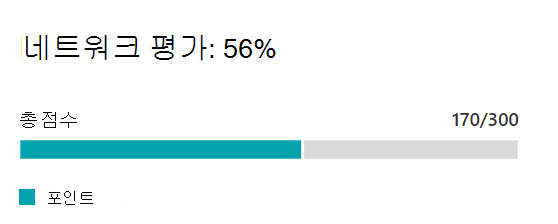
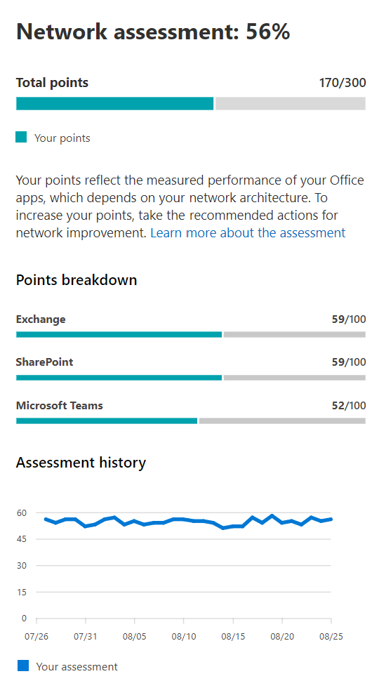

# Microsoft 365 네트워크 평가

Microsoft 365 관리 센터의 네트워크 연결에서 네트워크  평가는 여러 네트워크 성능 메트릭의 집계를 엔터프라이즈 네트워크 경계 상태의 스냅숏으로 증분합니다. 네트워크 평가는 고객 책임 네트워크 디자인이 사용자 환경에 미치는 영향을 Office 365 알 수 있습니다. 네트워크 평가의 범위는 전체 테넌트와 사용자가 테넌트에 연결하는 각 지리적 위치로 지정됩니다. 평가는 Microsoft 365 기업의 네트워크 상태와 전 세계 사무실 위치에 대한 자세한 보고서로 빠르게 드릴다운할 수 있는 쉬운 방법을 제공합니다.

네트워크 평가점 값은 0에서 100까지의 값으로, TCP 대기 시간, 다운로드 속도 및 UDP 연결 품질 메트릭의 평균입니다. 이러한 메트릭은 하루 한 번 컴파일됩니다. Microsoft 소유 네트워크에 대한 성능 메트릭은 평가 결과가 모호하지 않은 회사 네트워크와 관련이 있도록 이러한 측정에서 제외됩니다.

> [!div class="mx-imgBorder"]
> 

네트워크 평가 값이 매우 낮을수록 Microsoft 365 클라이언트가 테넌트에 연결하거나 반응형 사용자 환경을 유지 관리하는 데 상당한 문제가 있는 것입니다. 값이 높으면 성능 문제가 거의 없습니다. 값 80%는 정상 기준을 나타내며, 이 기준은 네트워크 성능으로 인해 Microsoft 365 연결 또는 응답성에 대한 정기적인 사용자 불만을 받지 않을 것으로 예상됩니다. 네트워크 연결 개선을 거치면 사용자 환경과 함께 이 값이 증가합니다.

| 네트워크 평가 | 예상 사용자 환경 |
| :----------------- | :----------------------- |
| 100                | 가장 적합한                     |
| 80                 | 추천 충족    |
| 60                 | 용인되는               |
| 40                 | 사용자에게 문제가 있을 수 있습니다. |
| 20                 | 사용자가 불만을 할 수 있습니다.       |
| 0                  | 네트워크 문제의 일반적인 토론 항목 |

>[!IMPORTANT]
>Microsoft 365 관리 센터의 네트워크 인사이트, 성능 권장 사항 및 평가는 현재 미리 보기 상태입니다. Microsoft 365 미리 보기 프로그램에 등록된 Microsoft 365 테넌트에만 사용할 수 있습니다.

## 네트워크 평가 패널

각 네트워크 평가는 테넌트로 범위가 지정되거나 특정 사무실 위치에 따라 평가에 대한 세부 정보가 있는 패널을 보여줍니다. 이 패널은 측정 데이터를 수신한 워크로드만 포함하여 각 구성 요소 작업의 총점 및 백분율로 평가의 막대형 차트를 보여줍니다. 사무실 위치 네트워크 평가의 경우 사무실 위치와 같은 도시에 있는 데이터를 보고한 5개의 각 Microsoft 365 고객 비율을 비교하여 보여 주며,

> [!div class="mx-imgBorder"]
> 

패널의 **평가** 분석에는 각 구성 요소 워크로드에 대한 평가가 표시됩니다.

평가 **기록에는** 지난 30일 동안의 평가 및 벤치마크가 표시될 수 있습니다. 기록 탭을 사용하여 최대 2년 동안 모든 사무실 위치에 대한 메트릭 기록을 보고할 수도 있습니다. 기록 탭에서는 보고할 특성을 선택할 수 있습니다. 보고서 시간 프레임을 선택하면 네트워크 업데이트 프로젝트의 영향을 강조 표시하고 네트워크 평가 개선을 볼 수 있습니다.

## 테넌트 네트워크 평가 및 사무실 위치 네트워크 평가

네트워크 평가는 사무실 위치의 네트워크 경계 디자인을 Microsoft 네트워크로 측정합니다. 네트워크 경계 개선은 각 사무실 위치에서 가장 잘 수행됩니다.

전체 테넌트에 대한 네트워크 평가 Microsoft 365 성능 개요 페이지에 표시됩니다. 이 값은 모든 사무실 위치에 대한 네트워크 평가의 가중 평균입니다. 또한 해당 위치의 요약 페이지에 검색된 각 사무실 위치에 대한 특정 네트워크 평가 값이 있습니다.

## Exchange Online

Exchange Online 경우 클라이언트 컴퓨터부터 서비스 프런트 도어까지의 TCP Exchange 측정됩니다. 이 대기 시간은 네트워크가 고객 LAN 및 WAN을 통해 이동하는 거리에 영향을 줄 수 있습니다. 또한 네트워크 중계 장치 또는 서비스에 의해 연결이 지연되거나 패킷이 다시 전송될 수 있습니다. 가장 가까운 서비스 프런트 도어가 얼마나 Exchange 영향을 미치게 됩니다. 50번째 백분위수 또는 P50 측정값으로도 알려진 중위값은 지난 3일 동안의 모든 측정값에 대해 측정됩니다.

다음 Exchange Online 평가가 수행됩니다. 임계값 간의 모든 TCP 대기 시간 숫자에는 대역 내에서 선형으로 포인트가 할당됩니다.

| TCP 대기 시간   | 포인트 |
| :------------ | :----- |
| 10 ms 이하  | 100    |
| 25 ms          | 80     |
| 100 ms         | 60     |
| 200 ms         | 40     |
| 300 ms         | 20     |
| 350 ms 이상 | 0      |

## SharePoint Online

SharePoint Online의 경우 사용자가 SharePoint 또는 웹 사이트에서 문서에 액세스할 수 OneDrive 속도가 측정됩니다. 이는 클라이언트 컴퓨터와 Microsoft 네트워크 간의 네트워크 회로에서 사용할 수 있는 대역폭의 영향을 미칠 수 있습니다. 또한 복잡한 네트워크 장치의 병목 현상이나 범위가 낮은 영역의 경우 네트워크 정체의 영향을 Wi-Fi 있습니다. 다운로드 속도는 초당 약 100 메가비트 회로의 10분의 1에 달하는 초당 메가바이트 단위로 측정됩니다. 초당 MegaByte 단위는 1초에 다운로드할 수 있는 크기 파일을 직접 볼 수 있기 때문에 유용합니다. 25번째 백분위수(P25 측정값)는 지난 3일 동안의 모든 측정에 대해 수행됩니다. 이 25번째 백분위수는 시간 경과에 따라 다양한 정체의 영향을 줄이는 데 도움이 됩니다.

SharePoint 온라인 평가는 다음 표를 사용하여 수행됩니다. 임계값 간의 모든 다운로드 속도 번호에는 대역 내에서 선형으로 포인트가 할당됩니다.

| 다운로드 속도 | 포인트 |
| :------------- | :----- |
| 20MBps 이상 | 100    |
| 14MBps         | 80     |
| 8MBps          | 60     |
| 4MBps          | 40     |
| 2MBps          | 20     |
| 0MBps          | 0      |

## Microsoft Teams

이 Microsoft Teams 네트워크 품질은 UDP 대기 시간, UDP 지터 및 UDP 패킷 손실로 측정됩니다. UDP는 통화 및 회의 오디오 및 비디오 미디어 연결에 Microsoft Teams. UDP가 보다 일반적인 TCP 프로토콜에 별도로 구성되면 네트워크의 UDP 지원에 있는 연결 간격과 대기 시간 및 다운로드 속도와 같은 요인에 의해 영향을 줄 수 있습니다. 50번째 백분위수 또는 P50 측정값으로도 알려진 중위값은 지난 3일 동안의 모든 측정값에 대해 측정됩니다. 

이러한 UDP 측정값에서 1에서 5까지의 배율에 대한 평균 의견 점수를 계산합니다. 그런 다음 네트워크 평가를 위해 0-100포인트 Microsoft Teams 매핑합니다.  전반적으로 양호한 점은 87.5포인트를 넘고 전반적인 불량은 50포인트 미만입니다.

## 관련 항목

[Microsoft 365 관리 센터의 네트워크 연결(미리 보기)](office-365-network-mac-perf-overview.md)

[Microsoft 365 네트워크 성능 인사이트(미리 보기)](office-365-network-mac-perf-insights.md)

[Microsoft 365 연결 테스트 도구(미리 보기)](office-365-network-mac-perf-onboarding-tool.md)

[Microsoft 365 네트워크 연결 위치 서비스(미리 보기)](office-365-network-mac-location-services.md)
