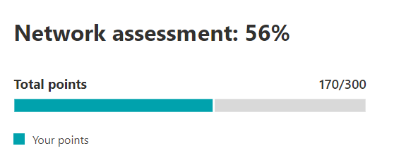

# Microsoft 365 네트워크 평가 (미리 보기)Microsoft 365 network assessment (preview)

Microsoft 365 관리 센터의 네트워크 연결에서 **네트워크 평가** 는 많은 네트워크 성능 메트릭 집계를 0-100의 포인트 값으로 나타내는 기업 네트워크 경계 상태의 스냅숏으로 정제 합니다.In the Microsoft 365 Admin Center's network connectivity, **network assessments** distill an aggregate of many network performance metrics into a snapshot of your enterprise network perimeter health, represented by a points value from 0 - 100. 네트워크 평가는 고객의 네트워크 디자인에 365 영향을 미치는 정도를 사용자에 게 알립니다.A network assessment tells you how much the customer responsible network design is impacting Office 365 user experience. 네트워크 평가는 전체 테 넌 트와 사용자가 테 넌 트에 연결 하는 각 지리적 위치에 대해 범위가 지정 되므로 Microsoft 365 관리자는 회사의 네트워크 상태를 신속 하 게 파악 하 고 전체 사무실 위치에 대 한 자세한 보고서로 드릴 다운할 수 있는 쉬운 방법을 제공 합니다.Network assessments are scoped to both the entire tenant and for each geographic location from which users connect to your tenant, providing Microsoft 365 administrators with an easy way to instantly grasp a gestalt of the enterprise's network health and quickly drill down into a detailed report for any global office location.

Network 평가할 points 값은 하루에 한 번 컴파일되는 TCP 대기 시간, 다운로드 속도 및 UDP 연결 품질 메트릭에 대 한 평균입니다.The network assessment points value is an average of TCP latency, download speed and UDP connection quality metrics compiled once a day. Microsoft 소유의 네트워크에 대 한 성능 메트릭은 평가 결과가 모호 하 고 회사 네트워크에 한정 되도록 하기 위해 이러한 측정값에서 제외 됩니다.Performance metrics for Microsoft-owned networks are excluded from these measurements to ensure that assessment results are unambiguous and specific to the corporate network.

아주 낮은 네트워크 평가 값은 Microsoft 365 클라이언트에 테 넌 트에 연결 하는 중요 한 문제가 있거나 응답성이 뛰어난 사용자 환경을 유지 관리 하는 반면, 값이 높으면 성능 문제가 거의 없는 네트워크를 올바르게 구성한 것을 의미 합니다.A very low network assessment value suggests that Microsoft 365 clients will have significant problems connecting to the tenant or maintaining a responsive user experience, while a high value indicates a properly configured network with few ongoing performance issues. 값이 80%는 네트워크 성능으로 인 한 Microsoft 365 연결 또는 응답성에 대 한 일반 사용자 불만을 수신 하지 않을 것으로 예상 되는 정상적인 기준을 나타냅니다.A value of 80% represents a healthy baseline where you should not expect to receive regular user complaints about Microsoft 365 connectivity or responsiveness due to network performance. 반복적으로 네트워크 연결이 개선 됨에 따라이 값은 사용자 환경에 따라 증가 합니다.As iterative network connectivity improvements are made, this value will increase along with user experience.

| 네트워크 평가Network assessment | 예상 사용자 환경Expected user experience |
| :----------------- | :----------------------- |
| 100100                | 방법은Best                     |
| 8080                 | 권장 사항 충족Meets recommendations    |
| 6060                 | 용인되는Acceptable               |
| 4040                 | 사용자에 게 문제가 발생할 수 있음Users may experience issues |
| 20cm(820                 | 사용자가 겪을 수 있음Users may complain       |
| 개0                  | 네트워크 문제 일반 토론 항목Network problems a common topic of discussion |

>[!IMPORTANT]
>네트워크 insights, Microsoft 365 관리 센터의 성능 권장 사항 및 평가는 현재 미리 보기 상태 이며, 기능 미리 보기 프로그램에 등록 되어 있는 Microsoft 365 테 넌 트에만 사용할 수 있습니다.Network insights, performance recommendations and assessments in the Microsoft 365 Admin Center is currently in preview status, and is only available for Microsoft 365 tenants that have been enrolled in the feature preview program.

## 네트워크 평가 패널Network assessment panel

테 넌 트 또는 특정 사무실 위치로 범위가 지정 되었는지 여부에 관계 없이 각 네트워크 평가에는 평가에 대 한 세부 정보가 포함 된 패널이 표시 됩니다.Each network assessment, whether scoped to the tenant or to a specific office location, shows a panel with details about the assessment. 이 패널에는 평가에 대 한 가로 막대형 차트와 측정 데이터를 받은 작업을 포함 하는 각 구성 요소 작업의 총 지점에 대 한 완료율이 표시 됩니다.This panel shows a bar chart of the assessment both as a percentage and as the total points for each component workload including only workloads where measurement data was received. Office 위치 네트워크 평가의 경우에는 quintiles의 각 5 개 사용자에 게 office 위치와 같은 도시의 데이터를 보고 한 Microsoft 365 고객 비율 비교도 표시 됩니다.For an office location network assessment, we also show a comparison to the percent of Microsoft 365 customers in each of five quintiles that reported data in the same city as your office location.

패널의 **평가 분석** 에서는 각 구성 요소 작업에 대 한 평가를 보여 줍니다.The **Assessment breakdown** in the panel shows the assessment for each of the component workloads.

**평가 기록** 에는 평가 및 벤치 마크의 최근 30 일이 표시 됩니다.The **Assessment history** shows the past 30 days of the assessment and the benchmark. 기록 탭을 사용 하 여 최대 2 년 동안 office 위치의 메트릭 기록을 보고할 수도 있습니다. 기록 탭에서는 보고할 특성을 선택 하 고, 보고서 시간 범위를 선택 하 여 네트워크 업데이트 프로젝트의 영향을 강조 하 고 네트워크 평가에 대 한 개선 사항을 확인할 수 있습니다.You can also report on the metrics history for any office location for up to two years using the history tab. The history tab allows you to select your attributes to report on and by choosing a report timeframe you can highlight the impact of a network update project and see the improvement to your network assessment.

## 테 넌 트 네트워크 평가 및 사무실 위치 네트워크 평가Tenant network assessments and office location network assessments

네트워크 평가는 사무실의 네트워크 경계를 Microsoft 네트워크로의 디자인을 측정 합니다.A network assessment measures the design of the network perimeter of an office location to Microsoft's network. 네트워크 경계에 대 한 향상 된 기능은 각 사무실 위치에서 가장 잘 수행 됩니다.Improvements to the network perimeter is best done at each office location.

모든 사무실 위치에 대 한 네트워크 평가의 가중치 평균 인 네트워크 성능 개요 페이지에 전체 Microsoft 365 테 넌 트에 대 한 네트워크 평가 값이 표시 됩니다.We show a network assessment value for the whole Microsoft 365 tenant on the network performance overview page which is a weighted average of the network assessments for all office locations. 또한 해당 위치의 요약 페이지에서 검색 된 각 사무실 위치에 대해 특정 네트워크 평가 값이 있습니다.There is also a specific network assessment value for each detected office location on that location's summary page.

## Exchange OnlineExchange Online

Exchange Online의 경우 클라이언트 컴퓨터에서 Exchange 서비스 전면 도어의 TCP 대기 시간이 측정 됩니다.For Exchange Online the TCP latency from the client machine to the Exchange service front door is measured. 이는 네트워크가 고객 LAN 및 WAN을 통과 하는 거리에 영향을 받을 수 있습니다.This can be impacted by the distance the network travels over the customers LAN and WAN. 또한 연결을 지연 시키거나 패킷을 다시 전송 하도록 하는 네트워크 매개 장치 또는 서비스의 영향을 받을 수 있습니다.It can also be impacted by network intermediary devices or services which delay the connectivity or cause packets to be resent. 그리고 가장 가까운 Exchange 서비스 전면 도어의 거리에 따라 영향을 받습니다.And it is impacted by how far away the nearest Exchange service front door is. 이전 3 일 동안의 모든 측정값에 대해 중앙값 (50 번째 백분위 수 또는 P50 측정값이 라고도 함)을 가져옵니다.The median (also known as the 50th percentile or P50 measure) is taken for all measurements over the previous three days.

Exchange Online 평가는 다음 표를 사용 하 여 수행 됩니다.The Exchange Online assessment is made using the following table. 임계값 사이의 TCP 대기 시간 번호는 밴드 내에서 선형으로 지정 됩니다.Any TCP latency number between the thresholds are assigned points linearly within the band.

| TCP 대기 시간TCP Latency   | 포인트Points |
| :------------ | :----- |
| 10ms 또는 less10ms or less  | 100100    |
| 25ms25ms          | 8080     |
| 적고 100 밀리초100ms         | 6060     |
| 200ms200ms         | 4040     |
| 300ms300ms         | 20cm(820     |
| 350ms 이상350ms or more | 개0      |

## SharePoint OnlineSharePoint Online

SharePoint Online의 경우 사용자가 SharePoint 또는 OneDrive에서 문서에 액세스 하는 데 사용할 수 있는 다운로드 속도가 측정 됩니다.For SharePoint Online the download speed available for a user to access a document from SharePoint or OneDrive is measured. 이는 클라이언트 컴퓨터와 Microsoft 네트워크 간의 네트워크 회로에서 사용 가능한 대역폭의 영향을 받을 수 있습니다.This can be impacted by the bandwidth available on network circuits between the client machine and Microsoft's network. 또한 복잡 한 네트워크 장치에서 병목 현상이 발생 한 네트워크 혼잡 이나 적절 하지 않은 서비스 범위에 있는 경우에도 영향을 받습니다.It is also often impacted by network congestion that exists in bottlenecks in complex network devices or in poor coverage Wi-Fi areas. 다운로드 속도는 초당 mb 단위로 측정 되며 약 1/10 초당 메가 비트 회로입니다.The download speed is measured in megabytes per second which is approximately one tenth of a circuits rated megabits per second. 1 초에 다운로드 가능한 크기 파일을 직접 확인할 수 있으므로 메가바이트/초 단위는 유용 합니다.The MegaByte per second unit is helpful because you can directly see what size file can be downloaded in 1 second. 이전 3 일 동안의 모든 측정값에 대해 25 번째 백분위 수 (P25 측정값이 라고도 함)를 가져옵니다.The 25th percentile (also known as the P25 measure) is taken for all measurements over the previous three days. 이 25 번째 백분위 수는 시간에 따른 혼잡이 미치는 영향을 줄이는 데 도움이 됩니다.This 25th percentile helps reduce the impact of varying congestion over time.

다음 표를 사용 하 여 SharePoint Online 평가를 수행 합니다.The SharePoint Online assessment is made using the following table. 임계값 사이의 다운로드 속도 번호는 밴드 내에서 선형으로 지정 됩니다.Any download speed number between the thresholds are assigned points linearly within the band.

| 다운로드 속도Download speed | 포인트Points |
| :------------- | :----- |
| 20MBps 이상20MBps or more | 100100    |
| 14MBps14MBps         | 8080     |
| 8MBps8MBps          | 6060     |
| 4MBps4MBps          | 4040     |
| 2MBps2MBps          | 20cm(820     |
| 0MBps0MBps          | 개0      |

## Microsoft TeamsMicrosoft Teams

Microsoft 팀의 경우 네트워크 품질은 UDP 대기 시간, UDP 지터 및 UDP 패킷 손실으로 측정 됩니다.For Microsoft Teams the Network quality is measured as UDP latency, UDP jitter, and UDP packet loss. UDP는 Microsoft 팀의 통화 및 회의 오디오 및 비디오 미디어 연결에 사용 됩니다.UDP is used for call and conferencing audio and video media connectivity for Microsoft Teams. 이는 UDP가 보다 일반적인 TCP 프로토콜과 별도로 구성 되므로 네트워크의 UDP 지원에서의 연결 간격 외에도 대기 시간 및 다운로드 속도와 동일한 요인의 영향을 받을 수 있습니다.This can be impacted by the same factors as for latency and download speed in addition to connectivity gaps in a network's UDP support since UDP is configured separately to the more common TCP protocol. 이전 3 일 동안의 모든 측정값에 대해 중앙값 (50 번째 백분위 수 또는 P50 측정값이 라고도 함)을 가져옵니다.The median (also known as the 50th percentile or P50 measure) is taken for all measurements over the previous three days. 

Microsoft는이 수치에 대 한 평균 평가 점수를 1 ~ 5로 계산 합니다.We calculate a mean opinion score from these UDP measurements for a scale from one to five. 그런 다음 Microsoft 팀 네트워크 평가를 위해 0-100 포인트 배율로 매핑합니다.Then we map that to the 0-100 points scale for the Microsoft Teams network assessment.  전체 양호은 87.5 점을 초과 하며 전반적인 불량은 50 포인트 미만입니다.Overall good is over 87.5 points and overall bad is below 50 points.

## 관련 항목Related topics

[Microsoft 365 관리 센터의 네트워크 연결 (미리 보기)Network connectivity in the Microsoft 365 Admin Center (preview)](office-365-network-mac-perf-overview.md)

[Microsoft 365 network performance insights (preview)Microsoft 365 network performance insights (preview)](office-365-network-mac-perf-insights.md)

[Microsoft 365 네트워크 연결 테스트 도구 (미리 보기)Microsoft 365 network connectivity test tool (preview)](office-365-network-mac-perf-onboarding-tool.md)

[Microsoft 365 네트워크 연결 위치 서비스 (미리 보기)Microsoft 365 Network Connectivity Location Services (preview)](office-365-network-mac-location-services.md)
