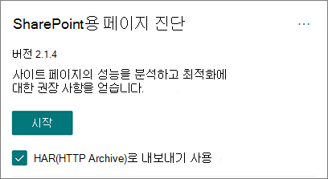
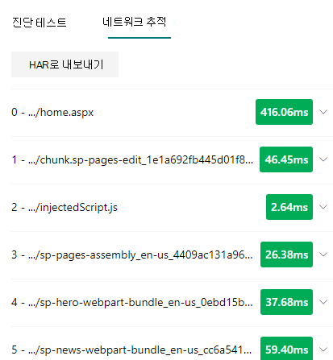

# 사용자용 페이지 진단 SharePoint 사용

이 문서에서는 SharePoint 위한 **페이지** 진단 도구를 사용하여 SharePoint 온라인 최신 및 클래식 사이트 페이지를 미리 정의된 성능 기준 집합과 분석하는 방법을 설명합니다.

다음에 대해 SharePoint 페이지 진단 도구를 설치할 수 있습니다.

- **Microsoft Edge(Edge** [확장)](https://microsoftedge.microsoft.com/addons/detail/ocemkolpnamjcacndljdfmhlpcaoipji)
- **Chrome(Chrome** [확장)](https://chrome.google.com/webstore/detail/inahogkhlkbkjkkaleonemeijihmfagi)

>[!TIP]
>버전 **2.0.0** 이상에는 클래식 사이트 페이지뿐만 아니라 최신 페이지도 지원됩니다. 사용 중이던 도구의 버전을 확정하지 못하면  링크 또는 타원(...)을 선택하여 버전을 확인할 수 있습니다. **도구를 사용할** 때 항상 최신 버전으로 업데이트합니다.

SharePoint용 페이지 진단 도구는 새 Microsoft Edge에 대한 브라우저 확장입니다. (SharePoint Online 최신 포털 및 클래식 게시 사이트 페이지를 분석하는 https://www.microsoft.com/edge) 및 Chrome 브라우저) 이 도구는 SharePoint Online에서만 사용할 수 있으며 시스템 SharePoint 사용할 수 없습니다.

이 도구는 미리 정의된 규칙 집합에 대해 페이지가 수행되는 방법을 보여 주며, 테스트 결과가 기준 값에 맞지 않은 경우 자세한 정보를 표시하는 분석된 각 페이지에 대한 보고서를 생성합니다. SharePoint 온라인 관리자와 디자이너는 이 도구를 사용하여 성능 문제를 해결하고 게시하기 전에 새 페이지를 최적화할 수 있습니다.

페이지 진단 도구는 *allitems.aspx* 또는 *sharepoint.aspx와* 같은 시스템 SharePoint 사이트 페이지만 분석하도록 디자인되어 있습니다. 시스템 페이지 또는 다른 비사이트 페이지에서 도구를 실행하려고 하면 해당 유형의 페이지에 대해 도구를 실행할 수 없다는 오류 메시지가 표시됩니다.

> [!div class="mx-imgBorder"]
> 

라이브러리 또는 시스템 페이지를 평가하는 데 값이 없는 도구에서는 오류가 되지 않습니다. 도구를 사용하려면 SharePoint 페이지로 이동합니다. 이 오류가 SharePoint 페이지에서 발생하는 경우 마스터 페이지를 확인하여 SharePoint 메타태그가 제거되지 않은지 확인하십시오.

도구에 대한 피드백을 제공하려면 도구의 오른쪽 상단 모서리에 있는 줄임차를 선택한 다음 피드백 [보내기를 선택합니다.](https://go.microsoft.com/fwlink/?linkid=874109)

> [!div class="mx-imgBorder"]
> 
  
## 사용자용 페이지 진단 SharePoint 설치

이 섹션의 설치 절차는 Chrome 및 웹 브라우저에서 Microsoft Edge 실행됩니다.

> [!IMPORTANT]
> Microsoft는 SharePoint 페이지 진단 도구에서 분석한 데이터 또는 페이지 콘텐츠를 읽지 않고, 개인 정보, 웹 사이트 또는 다운로드 정보를 캡처하지 않습니다. 이 도구로 Microsoft에 기록되는 식별 가능한 정보는 테넌트 이름, 실패한 규칙 수, 도구를 실행한 날짜와 시간뿐입니다. 이 정보는 Microsoft에서 최신 포털 및 게시 사이트 사용 추세와 일반적인 성능 문제를 보다 잘 이해하기 위해 사용됩니다.

1.  [SharePoint(Edge](https://microsoftedge.microsoft.com/addons/detail/ocemkolpnamjcacndljdfmhlpcaoipji) 확장) 또는 Chrome(Chrome 확장Microsoft Edge용 **페이지** 진단 [도구를 설치합니다.](https://chrome.google.com/webstore/detail/inahogkhlkbkjkkaleonemeijihmfagi) 스토어의 설명 페이지에 제공된 사용자 개인 정보 취급 방침을 검토하세요. When adding the tool to your browser, you will see the following permissions notice.

    > [!div class="mx-imgBorder"]
    > 

    이 알림은 페이지의 웹 파트 및 사용자 지정에 따라 페이지에 SharePoint 외부 위치의 콘텐츠를 포함할 수 있기 때문에 이 알림이 설정됩니다. 즉, 시작 단추를 클릭할 때 도구가 실행 중인 활성 SharePoint 탭에만 요청 및 응답을 읽게 됩니다. 이 정보는 웹 브라우저에서 로컬로 캡처하며 도구의 네트워크 추적 탭에 **있는 JSON으로** 내보내기 또는 **HAR로** 내보내기 단추를 통해 사용할 수 있습니다. 이 정보는 Microsoft로 전송되거나 Microsoft에서 캡처되지 **않습니다.**  이 도구는 여기에서 액세스할 수 있는 Microsoft 개인 정보 취급 방침을 [준수합니다.](https://go.microsoft.com/fwlink/p/?linkid=857875)

    Manage _your downloads_ permission covers use of the tool's **Export to JSON** functionality. 결과에는 URL이 포함되어 있으며 PII(개인 식별이 가능한 정보)로 분류될 수 있는 JSON 파일을 조직 외부에서 공유하기 전에 회사 자체의 개인 정보 보호 지침을 따르세요.
1. Incognito 또는 InPrivate 모드에서 도구를 사용하려면 브라우저에 대해 다음 절차를 따르는 것이 좋습니다.
    1. 다음 Microsoft Edge URL 표시줄에 확장을 _edge://extensions_ 입력하고 확장에 대한 **세부** 정보를 선택합니다.  확장 설정에서 InPrivate 에서 허용 **확인란을 선택합니다.**
    1. Chrome에서 확장으로 이동하거나  URL chrome://extensions 확장에 대한  세부 정보를 선택합니다.  확장 설정에서 **Incognito에서 허용할 슬라이더를 선택합니다.**
1. 검토할 SharePoint 온라인에서 SharePoint 사이트 페이지로 이동합니다. 페이지에서 항목의 "로드 지연"이 허용됩니다. 따라서 이 도구는 자동으로 중지되지 않습니다(모든 페이지 로드 시나리오를 수용하기 위해 디자인). 컬렉션을 중지하려면 중지 를 **선택합니다.** 데이터 수집을 중지하기 전에 페이지 로드가 완료되거나 부분 추적만 캡처해야 합니다.
1. 확장의 도구 모음 단추 클릭  를 사용하여 도구를 로드하면 다음과 같은 확장 팝업 창이 표시됩니다.

    

분석을 **위해** 데이터 수집을 시작하려면 시작을 선택합니다.

## 사용자용 페이지 진단 도구에 SharePoint 표시됩니다.

1. 도구의 오른쪽 위 모서리에 있는 타원(...)을 클릭하여 다음 링크를 찾을 수 있습니다.
   1. 추가 **리소스 링크는** 이 문서에 대한 링크를 포함하여 도구에 대한 일반적인 지침과 세부 정보를 제공합니다.
   1. 피드백 **보내기 링크는** 사용자 SharePoint 사이트 및 공동 작업 사용자 음성 사이트에 _대한 링크를_ 제공합니다.
   1. 정보 **링크에는** 현재 설치된 도구 버전과 도구의 타사 알림에 대한 직접 링크가 포함되어 있습니다.  
1. **상관 관계 ID, SPRequestDuration, SPIISLatency,** 페이지 로드 시간 및 **URL** 세부 정보는 정보를 제공하며 몇 가지 용도로 사용할 수 있습니다. 

    > [!div class="mx-imgBorder"]
    > 

   - **CorrelationID는** Microsoft 지원 서비스에서 특정 페이지에 대한 추가 진단 데이터를 수집할 수 있도록 하는 중요한 요소입니다.
   - **SPRequestDuration은** 페이지를 SharePoint 시간입니다. 구조 탐색, 큰 이미지, 많은 API 호출이 모두 더 긴 기간에 기여할 수 있습니다.
   - **SPIISLatency는** Online에서 페이지 로드를 SharePoint 시간(밀리초)입니다. 이 값에는 웹 응용 프로그램이 응답하는 데 들이는 시간이 포함되어 있지 않습니다.
   - **페이지 로드 시간은** 요청 시간부터 응답이 수신 및 브라우저에서 렌더링된 시간까지 페이지에 의해 기록된 총 시간입니다. 이 값은 네트워크 대기 시간, 컴퓨터 성능 및 브라우저에서 페이지를 로드하는 데 걸리는 시간을 비롯한 다양한 요인의 영향을받습니다.
   - 페이지 **URL(Uniform** Resource Locator)은 현재 페이지의 웹 주소입니다.

1. 진단 [**테스트 탭에는**](#how-to-use-the-diagnostic-tests-tab) 분석 결과가 세 가지 범주로 표시됩니다. **작업이 필요하지 않습니다.** **개선 기회 및** **주의가 필요하지 않습니다.** 각 테스트 결과는 다음 표에 설명된 바와 같이 이러한 범주 중 하나의 항목으로 표시됩니다.

    |범주  |색  |설명  |
    |---------|---------|---------|
    |**주의 필요** |빨간색 |테스트 결과는 기준 값 외부에 있으며 페이지 성능에 영향을 미치고 있습니다. 수정 지침을 따르하세요.|
    |**개선 기회** |노란색 |테스트 결과는 기준 값 외부에 있으며 성능 문제에 기여할 수 있습니다. 테스트 관련 조건이 적용될 수 있습니다.|
    |**필요한 작업 없음** |녹색 |테스트 결과는 테스트의 기준 값에 해당합니다.|

    > [!div class="mx-imgBorder"]
    > 

1. 네트워크 [**추적 탭은**](#how-to-use-the-network-trace-tab-and-how-to-export-a-har-file) 페이지 빌드 요청 및 응답에 대한 세부 정보를 제공합니다.

## 진단 테스트 탭을 사용하는 방법

SharePoint SharePoint 도구로 최신 포털 페이지 또는 클래식 게시 사이트 페이지를 분석하면 결과를 기준 값과 비교하고 진단 테스트 탭에 표시되는 미리 정의된 규칙을 사용하여 결과를 **분석합니다.** 특정 테스트에 대한 규칙은 둘 간의 특정 성능 특성이 어떻게 다른지에 따라 최신 포털 및 클래식 게시 사이트에 대해 서로 다른 기준 값을 사용할 수 있습니다.

개선 기회 또는  주의 필요  범주에 나타나는 테스트 결과는 권장 사례에 대해 검토해야 하는 영역을 나타내며 결과에 대한 추가 정보를 표시하기 위해 선택할 수 있습니다. 각 항목에 대한 세부  정보에는 테스트와 관련된 적절한 지침으로 바로 연결되는 자세한 정보 링크가 포함되어 있습니다. 작업 필요 없음  범주에 나타나는 테스트 결과는 관련 규칙의 준수를 나타내며, 선택한 경우 추가 세부 정보를 표시하지 않습니다.

진단 테스트 탭의 정보는 페이지를 디자인하는 방법을 설명하지는 않지만 페이지 성능에 영향을 줄 수 있는 요인을 강조합니다. 일부 페이지 기능 및 사용자 지정은 페이지 성능에 불가피하게 영향을 미치며, 해당 영향이 큰 경우 페이지에서 잠재적인 수정 또는 누락을 검토해야 합니다.

빨간색 또는 노란색 결과는 데이터를 너무 자주 새로 고치는 웹 파트를 나타낼 수도 있습니다. 예를 들어 회사 뉴스는 매 초마다 업데이트되지 않지만 사용자 지정 웹 파트는 전체 사용자 환경을 개선할 수 있는 캐싱 요소를 구현하는 대신 매 초마다 최신 뉴스를 표시하도록 구축되는 경우가 종종 있습니다. 페이지에 웹 파트를 포함하면 사용 가능한 각 매개 변수의 값을 평가하여 의도한 용도에 적절하게 설정되도록 하여 성능에 미치는 영향을 줄일 수 있는 간단한 방법이 있는 경우가 종종 있습니다.

>[!NOTE]
>게시 기능을 사용하도록 설정하지 않은 클래식 팀 사이트는 CDNS를 사용할 수 없습니다. 이러한 사이트에서 도구를 실행하면 CDN 테스트가 실패하고 무시될 수 있지만 나머지 모든 테스트는 적용할 수 있습니다. SharePoint 게시 기능의 추가 기능을 사용하면 페이지 로드 시간이 증가할 수 있으므로 페이지 로드 기능을 허용하기만 하면 CDN 않습니다.

>[!IMPORTANT]
>테스트 규칙은 정기적으로 추가 및 업데이트됩니다. 따라서 테스트 결과에 포함된 현재 규칙 및 특정 정보에 대한 자세한 내용은 최신 버전의 도구를 참조하세요. 확장을 관리하여 버전을 확인할 수 있으며 확장은 업데이트를 사용할 수 있는지 여부를 조언합니다.

## 네트워크 추적 탭을 사용하는 방법 및 HAR 파일을 내보내는 방법

네트워크 **추적 탭에서는** 페이지를 작성하기 위한 요청과 사용자로부터 받은 응답에 대한 자세한 SharePoint.

1. **빨간색으로 플래그가 지정된 항목 로드 시간을 찾아 봐야 합니다.** 각 요청 및 응답은 다음 대기 시간 메트릭을 사용하여 전체 페이지 성능에 미치는 영향을 나타내기 위해 색으로 코딩됩니다.
    - 녹색: \< 500ms
    - 노란색: 500-1000ms
    - 빨간색: \> 1000ms

    > [!div class="mx-imgBorder"]
    > 

    위에 표시된 이미지에서 빨간색 항목은 기본 페이지에 해당합니다. 페이지가 \< 1000ms(1초 미만)로 로드되지 않으면 항상 빨간색으로 표시됩니다.

2. **테스트 항목 로드 시간 입니다.** 경우에 따라 항목이 브라우저에 의해 이미 캐시되어 있기 때문에 시간 또는 색 표시기가 없는 경우도 있습니다. 이 테스트를 올바르게 테스트하려면 페이지를 열고 브라우저  캐시를 지운 다음 시작을 클릭하여 "콜드" 페이지 로드를 강제로 실행하고 초기 페이지 로드를 실제 반영합니다. 그런 다음 "웜" 페이지 로드와 비교해야 합니다. 그러면 페이지에 캐시되는 항목을 결정하는 데도 도움이 됩니다.

3. 문제를 조사하는 데 도움이 될 수 있는 다른 사용자와 관련 **세부 정보를 공유합니다.** 도구에 제공된 세부 정보나 정보를 개발자 또는 기술 지원 사용자와 공유하려면 **HAR(HTTP Archive)로** 내보내기 사용을 사용하는 것이 좋습니다. 

   > [!div class="mx-imgBorder"]
   > 

시작을 클릭하기 전에 사용하도록 설정해야 합니다. 그러면 브라우저에서 디버그 모드를 사용하도록 설정됩니다. 그런 다음 "네트워크 추적" 탭을 통해 액세스할 수 있는 HTTP 보관 파일(HAR)을 생성합니다. "HAR로 내보내기"를 클릭하면 파일이 컴퓨터로 다운로드된 다음 그에 따라 공유할 수 있습니다. F12 개발자 도구 및 Fiddler와 같은 다양한 디버그 도구에서 파일을 열 수 있습니다.

> [!div class="mx-imgBorder"]
> 

> [!IMPORTANT]
> 이러한 결과에는 PII(개인 식별이 가능한 정보)로 분류할 수 있는 URL이 포함되어 있습니다. 해당 정보를 배포하기 전에 조직의 지침을 따라야 합니다.

## Microsoft 지원 참여

지원 사례에서 직접 작업할 때만 활용해야 하는 **Microsoft** 지원 수준 기능이 포함되어 있습니다. 이 기능을 활용하면 지원 팀 참여 없이 사용할 경우 이점이 제공되지 않고 페이지가 훨씬 느려질 수 있습니다. 서비스 로깅에 추가 정보가 추가될 때 도구에서 이 기능을 사용할 때 추가 정보가 없습니다.

이 기능을 사용하도록 설정하고 페이지 성능이 2~3배 느려지며 사용하도록 설정한 경우 페이지 성능이 크게 떨어졌다는 알림을 제외하고는 변경이 표시되지 않습니다. 특정 페이지 및 해당 활성 세션에만 관련이 있습니다. 따라서 지원에 적극적으로 참여할 때만 이 를 사용해야 합니다.

### Microsoft 지원 수준 기능을 사용하도록 설정하려면

1. 사용자용 페이지 진단 도구를 SharePoint 를 니다.
2. 키보드에서 **ALT-Shift-L을 누릅니다.** 그러면 지원 **로깅 사용 확인란이** 표시됩니다.
3. 확인란을 선택한 다음 시작을 **클릭하여** 페이지를 다시 로드하고 자세한 로깅을 생성합니다.

   > [!div class="mx-imgBorder"]
   > 
  
    CorrelationID(도구의 맨 위에 표시)를 메모하고 지원 담당자에게 제공하여 진단 세션에 대한 추가 정보를 수집할 수 있도록 해야 합니다.

## 관련 항목

[SharePoint Online 성능 조정](tune-sharepoint-online-performance.md)

[Office 365 성능 조정](tune-microsoft-365-performance.md)

[최신 SharePoint 환경의 성능](/sharepoint/modern-experience-performance)

[콘텐츠 배달 네트워크](content-delivery-networks.md)

[sharepoint Online을 활용해 Office 365 콘텐츠 배달 네트워크(CDN) 사용하기](use-microsoft-365-cdn-with-spo.md)