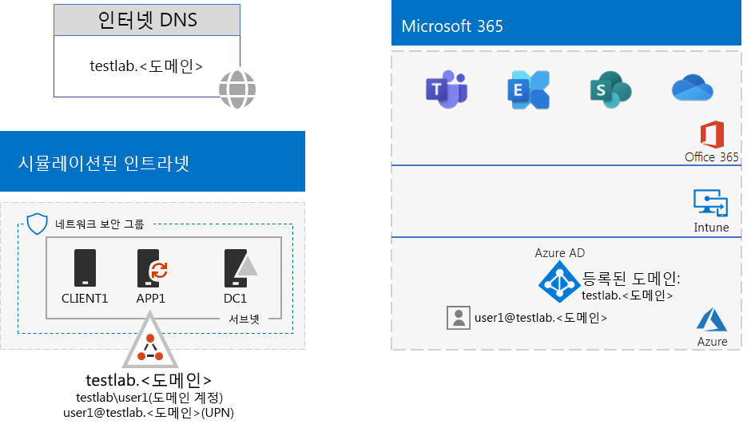
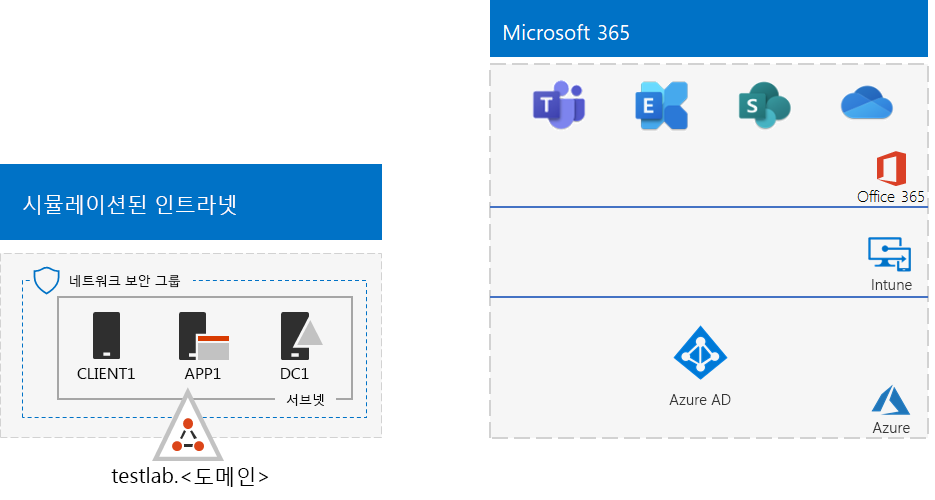
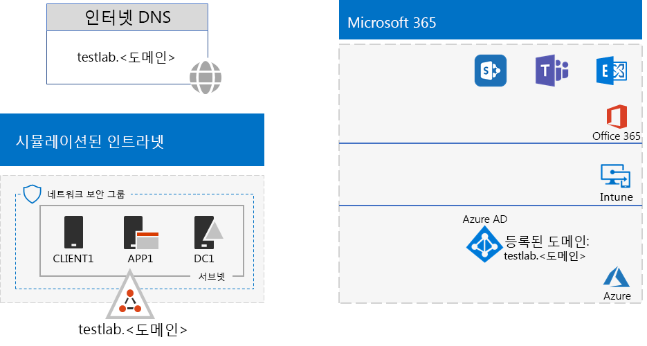

# <a name="password-hash-synchronization-for-your-microsoft-365-test-environment"></a>Microsoft 365 테스트 환경을 위한 암호 해시 동기화

*이 테스트 랩 가이드는 Microsoft 365 Enterprise와 Office 365 Enterprise 테스트 환경 모두에서 사용할 수 있습니다.*

다수의 조직은 Azure AD Connect와 암호 해시 동기화를 사용하여 온-프레미스 AD DS(Active Directory Domain Services) 포리스트의 계정 집합을 Microsoft 365 또는 Office 365 구독의 Azure AD 테넌트의 계정 집합과 동기화합니다. 이 문서에서는 Microsoft 365 테스트 환경에 암호 해시 동기화를 추가하여 다음과 같은 구성을 수행하는 방법에 대해 설명합니다.
  

  
이 테스트 환경의 2가지 주요 설정 단계는 다음과 같습니다.
  
1. Microsoft 365 시뮬레이트된 엔터프라이즈 테스트 환경을 만듭니다.
2. APP1에 Azure AD Connect를 설치 및 구성합니다.
    
> [!TIP]
> [여기](media/m365-enterprise-test-lab-guides/Microsoft365EnterpriseTLGStack.pdf)를 클릭하여 Microsoft 365 Enterprise 테스트 랩 가이드 스택의 모든 문서에 대한 가상 맵을 확인할 수 있습니다.
  
## <a name="phase-1-create-the-microsoft-365-simulated-enterprise-test-environment"></a>1단계: Microsoft 365 시뮬레이트된 엔터프라이즈 테스트 환경을 만들기

[Microsoft 365의 시뮬레이이트된 엔터프라이즈 기반 구성](simulated-ent-base-configuration-microsoft-365-enterprise.md)의 지침을 따릅니다. 결과 구성은 다음과 같습니다.
  

  
이 구성은 다음으로 이루어집니다. 
  
- Microsoft 365 E5, Office 365 E5 평가판 또는 유료 구독.
- 인터넷에 연결된 간소화된 조직 인트라넷: Azure 가상 네트워크에 있는 DC1, APP1 및 CLIENT1 가상 머신으로 구성됩니다. DC1은 testlab.\<공용 도메인 이름> AD DS 도메인의 도메인 컨트롤러입니다.

## <a name="phase-2-create-and-register-the-testlab-domain"></a>2단계: 테스트 랩 도메인 만들기 및 등록

이 단계에서 공용 DNS 도메인을 추가하고 구독에 추가합니다.

먼저, 공용 DNS 등록 공급자와 협력하여 공용 DNS 등록 공급자 현재 도메인 이름에 따라 새 공용 DNS 도메인 이름을 만든 후 Office 365 구독에 추가합니다. 이름 **testlab.**\<공용 도메인>을 사용하는 것이 좋습니다. 예를 들어, 공용 도메인 이름이 <span>**contoso</span>.com**이면 공용 도메인 이름 **<span>testlab</span>.contoso.com**을 추가합니다.
  
그런 다음 **테스트랩**\<을 추가합니다. 공용 도메인> 도메인을 Office 365 시험판 또는 유료 구독으로 전환하려면 도메인 등록 프로세스를 거쳐야 합니다. 이것은 **테스트랩**\<에 추가 DNS 레코드를 추가하는 것으로 구성됩니다. 공개 도메인> 도메인. 자세한 내용은 [Office 365에 사용자 및 도메인 추가](https://support.office.com/article/Add-users-and-domain-to-Office-365-6383f56d-3d09-4dcb-9b41-b5f5a5efd611)를 참조하세요. 

구성 결과는 다음과 같습니다.
  

  
이 구성은 다음으로 이루어집니다.

- Microsoft 365 E5, Office 365 E5 평가판 또는 유료 구독(DNS 도메인 Test Lab 포함).\<공용 도메인 이름> 등록됨.
- 인터넷에 연결된 간소화된 조직 인트라넷: Azure Virtual Network 서브넷에 있는 DC1, APP1 및 CLIENT1 가상 머신으로 구성됩니다.

testlab.\<공용 도메인 이름>에 대해 현재 다음 작업이 어떻게 진행되는지 확인합니다.

- 공용 DNS 레코드에서 지원도비니다.
- Office 365 및 EMS 구독에 등록됩니다.
- 시뮬레이트된 인트라넷의 AD DS 도메인입니다.
     
## <a name="phase-3-install-azure-ad-connect-on-app1"></a>3단계: APP1에 Azure AD Connect 설치

이 단계에서는 APP1에서 Azure AD Connect 도구를 설치 및 구성한 후 잘 작동하는지 확인합니다.
  
먼저 APP1에 Azure AD Connect 설치 및 구성합니다.

1. [Azure Portal](https://portal.azure.com)에서 전역 관리자 계정으로 로그인한 후 TESTLAB\\User1 계정을 사용하여 APP1에 연결합니다.
    
2. APP1의 바탕 화면에서 관리자 수준 Windows PowerShell 명령 프롬프트를 열고 다음 명령을 실행합니다.
    
   ```powershell
   Set-ItemProperty -Path "HKLM:\SOFTWARE\Microsoft\Active Setup\Installed Components\{A509B1A7-37EF-4b3f-8CFC-4F3A74704073}" -Name "IsInstalled" -Value 0
   Set-ItemProperty -Path "HKLM:\SOFTWARE\Microsoft\Active Setup\Installed Components\{A509B1A8-37EF-4b3f-8CFC-4F3A74704073}" -Name "IsInstalled" -Value 0
   Stop-Process -Name Explorer -Force
   ```

3. 작업 표시줄에서 **Internet Explorer**를 클릭하고 [https://aka.ms/aadconnect](https://aka.ms/aadconnect)로 이동합니다.
    
4. Microsoft Azure Active Directory Connect 페이지에서 **다운로드**를 클릭하고 **실행**을 클릭합니다.
    
5. **Azure AD Connect 시작** 페이지에서 **동의**를 클릭하고 **계속**을 클릭합니다.
    
6. **기본 설정** 페이지에서 **기본 설정 사용**을 클릭합니다.
    
7. **Azure AD에 연결** 페이지에서 **사용자 이름**에 Office 365 전역 관리자 계정 이름을 입력하고 **암호**에 해당 암호를 입력한 후 **다음 **을 클릭합니다.
    
8. **AD DS에 연결** 페이지에서 **사용자 이름**에 **TESTLAB\\User1**을 입력하고 **암호**에 암호를 입력한 후 **다음**을 클릭합니다.
    
9. **구성 준비 완료** 페이지에서 **설치**를 클릭합니다.
    
10. **구성 완료** 페이지에서 **끝내기**를 클릭합니다.
    
11. Internet Explorer에서 Microsoft 365 관리 센터([https://portal.microsoft.com](https://portal.microsoft.com))로 이동합니다.
    
12. 왼쪽 탐색에서 **사용자 > 활성화된 사용자**를 클릭합니다.
    
    **User1**이라는 계정을 유의합니다. 이 계정은 TESTLAB AD DS 도메인의 계정이며 디렉터리 동기화가 성공했다는 증거입니다.
    
13. **User1** 계정을 클릭합니다. 제품 라이선스에 대해 **편집**을 클릭합니다.
    
14. **제품 라이선스**에서 국가를 선택하고 **Office 365 Enterprise E5**에 대해 **해제** 컨트롤을 클릭합니다(**설정**으로 전환됨). **Enterprise Mobility + Security E5** 라이선스에 대해 동일한 작업을 수행합니다. 

15. 페이지 아래쪽에서 **저장**을 클릭하고 **닫기**를 클릭합니다.
    
다음으로, user1 계정의 <strong>user1@testlab.</strong>\<사용자의 도메인 이름> 사용자 이름으로 Office 365 구독에 로그인하는 기능을 테스트합니다.

1. APP1에서 Office 365로부터 로그아웃했다가 다른 계정을 지정하여 다시 로그인합니다.

2. 사용자 이름 및 암호를 지정하라는 메시지가 표시되면 <strong>user1@testlab.</strong>\<사용자의 도메인 이름> 및 User1 암호를 입력합니다. User1으로 잘 로그인되어야 합니다. 
 
User1에 TESTLAB AD DS 도메인에 대한 도메인 관리자 권한이 있더라도 Office 365 전역 관리자는 아닙니다. 따라서 **관리자** 아이콘이 옵션으로 표시되지 않습니다. 

구성 결과는 다음과 같습니다.


이 구성은 다음으로 이루어집니다. 
  
- Microsoft 365 E5, Office 365 E5 평가판 또는 유료 구독(DNS 도메인 Test Lab 포함).\<도메인 이름> 등록됨.
- 인터넷에 연결된 간소화된 조직 인트라넷: Azure Virtual Network 서브넷에 있는 DC1, APP1 및 CLIENT1 가상 머신으로 구성됩니다. Azure AD Connect는 Test Lab AD DS 도메인을 Microsoft 365 또는 Office 365 구독의 Azure AD 테넌트와 주기적으로 동기화하기 위해 APP1에서 실행됩니다.
- TESTLAB AD DS 도메인의 User1 계정이 Azure AD 테넌트와 동기화되었습니다.

## <a name="next-step"></a>다음 단계

테스트 환경에서 추가 [ID](m365-enterprise-test-lab-guides.md#identity) 기능도 알아봅니다.

## <a name="see-also"></a>참고 항목

[Microsoft 365 Enterprise 테스트 랩 가이드](m365-enterprise-test-lab-guides.md)

[Microsoft 365 Enterprise 배포](deploy-microsoft-365-enterprise.md)

[Microsoft 365 Enterprise 설명서](https://docs.microsoft.com/microsoft-365-enterprise/)


