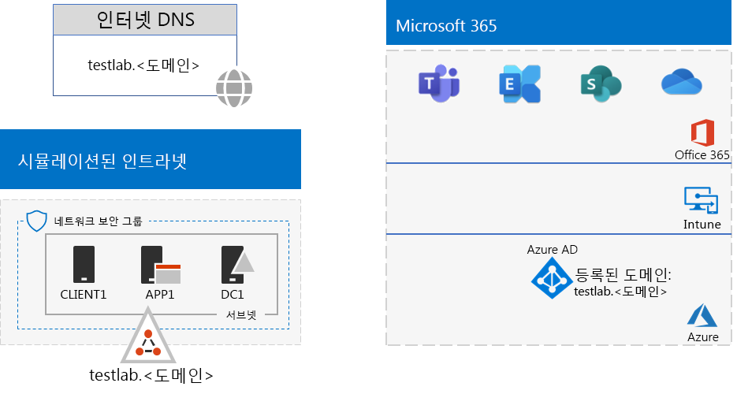

# <a name="password-hash-synchronization-for-your-microsoft-365-test-environment"></a>Microsoft 365 테스트 환경을 위한 암호 해시 동기화

*이 테스트 랩 가이드는 엔터프라이즈 및 엔터프라이즈용 Microsoft 365 둘 다에 사용할 Office 365 Enterprise 있습니다.*

다수의 조직은 Azure AD Connect와 암호 해시 동기화를 사용하여 온-프레미스 AD DS(Active Directory Domain Services) 포리스트의 계정 집합을 Microsoft 365 구독의 Azure AD 테넌트의 계정 집합과 동기화합니다. 

이 문서에서는 테스트 환경에 암호 해시 동기화를 추가하는 Microsoft 365 설명하여 이 구성을 구현합니다.
  

  
이 테스트 환경을 설정하는 단계는 다음 세 단계로 진행됩니다.
- [1단계: Microsoft 365 시뮬레이트된 엔터프라이즈 테스트 환경을 만들기](#phase-1-create-the-microsoft-365-simulated-enterprise-test-environment)
- [2단계: 테스트 랩 도메인 만들기 및 등록](#phase-2-create-and-register-the-testlab-domain)
- [3단계: APP1에 Azure AD Connect 설치](#phase-3-install-azure-ad-connect-on-app1)
    
> [!TIP]
> 엔터프라이즈용 테스트 랩 가이드 스택의 Microsoft 365 모든 문서에 대한 시각적 맵을 확인한 다음 엔터프라이즈 테스트 랩 Microsoft 365 스택에 대한 자세한 [설명을 참조하세요.](../downloads/Microsoft365EnterpriseTLGStack.pdf)
  
## <a name="phase-1-create-the-microsoft-365-simulated-enterprise-test-environment"></a>1단계: Microsoft 365 시뮬레이트된 엔터프라이즈 테스트 환경을 만들기

에 대한 [시뮬레이트된 엔터프라이즈 기본 구성의 Microsoft 365.](simulated-ent-base-configuration-microsoft-365-enterprise.md) 구성 결과는 다음과 같습니다.
  

  
이 구성은 다음으로 이루어집니다.
  
- Microsoft 365 E5 평가판 또는 유료 구독
- 인터넷에 연결된 간소화된 조직 인트라넷: Azure Virtual Network의 DC1, APP1 및 CLIENT1 가상 머신으로 구성됩니다. DC1은 AD DS 도메인에 대한 공용  <.> 컨트롤러입니다.

## <a name="phase-2-create-and-register-the-testlab-domain"></a>2단계: 테스트 랩 도메인 만들기 및 등록

이 단계에서 공용 DNS 도메인을 추가한 다음 구독에 추가합니다.

먼저 공용 DNS 등록 공급자와 함께 현재 도메인 이름을 기반으로 하는 새 공용 DNS 도메인 이름을 만든 다음 구독에 추가합니다. 공용 도메인 에 **testlab.<*사용하는 것이 좋습니다.* >** 예를 들어 공용 도메인 이름이 **<span>contoso</span>.com이면** 공용 도메인 이름 **<span>testlab</span>.contoso.com.**
  
그런 다음 **>** 도메인 등록 <통해 공용 도메인을 Microsoft 365 평가판 또는 유료 구독에 추가합니다. 이 구성은 공용 도메인 도메인의 **testlab.<DNS *레코드를 추가하는 것으로 구성됩니다.* >** 자세한 내용은 [Add a domain to Microsoft 365.](../admin/setup/add-domain.md)

구성 결과는 다음과 같습니다.
  

  
이 구성은 다음으로 이루어집니다.

- DNS Microsoft 365 E5 testlab.을 사용하여 평가판 또는 유료 < 등록된 공용 도메인> 구독입니다.
- 인터넷에 연결된 간소화된 조직 인트라넷으로, Azure Virtual Network 서브넷에 있는 DC1, APP1 및 CLIENT1 가상 머신으로 구성됩니다.

공용 도메인 <testlab.>  방법을 알 수 있습니다.

- 공용 DNS 레코드에서 지원도비니다.
- Microsoft 365 구독에 등록되었습니다.
- 시뮬레이트된 인트라넷의 AD DS 도메인입니다.
     
## <a name="phase-3-install-azure-ad-connect-on-app1"></a>3단계: APP1에 Azure AD Connect 설치

이 단계에서는 APP1에서 Azure AD 커넥트 도구를 설치하고 구성한 다음 작동하는지 확인해야 합니다.
  
먼저 APP1에 Azure AD 커넥트 설치하고 구성합니다.

1. [Azure Portal](https://portal.azure.com)에서 전역 관리자 계정으로 로그인한 후 TESTLAB\\User1 계정을 사용하여 APP1에 연결합니다.
    
2. APP1의 바탕 화면에서 관리자 수준 Windows PowerShell 명령 프롬프트를 열고 다음 명령을 실행하여 Internet Explorer 강화 보안을 사용하지 않습니다.
    
   ```powershell
   Set-ItemProperty -Path "HKLM:\SOFTWARE\Microsoft\Active Setup\Installed Components\{A509B1A7-37EF-4b3f-8CFC-4F3A74704073}" -Name "IsInstalled" -Value 0
   Set-ItemProperty -Path "HKLM:\SOFTWARE\Microsoft\Active Setup\Installed Components\{A509B1A8-37EF-4b3f-8CFC-4F3A74704073}" -Name "IsInstalled" -Value 0
   Stop-Process -Name Explorer -Force
   ```

3. 작업 표시줄에서 를 **선택하고 Internet Explorer** 로 [https://aka.ms/aadconnect](https://aka.ms/aadconnect) 이동하십시오.
    
4. On the Microsoft Azure Active Directory 커넥트 page, select **Download**, and then select **Run**.
    
5. Azure AD 커넥트 시작 페이지에서 **동의를** 선택하고 계속을 **선택합니다.**
    
6. **Express** 설정 익스프레스 설정 **사용을 선택합니다.**
    
7. Azure **AD 커넥트** 페이지에서 사용자 이름에 전역 관리자 계정 이름을 입력하고 **암호에** 암호를 **입력한** 후 다음 을 **선택합니다.**
    
8. AD **커넥트** 페이지의 사용자 이름에 **TESTLAB \\ User1을** 입력하고 **암호에** 암호를 **입력한** 후 다음 을 **선택합니다.**
    
9. 구성 **준비 완료 페이지에서** 설치를 **선택합니다.**
    
10. 구성 **완료 페이지에서** 끝내기 **를 선택합니다.**
    
11. Internet Explorer에서 Microsoft 365 관리 센터([https://portal.microsoft.com](https://portal.microsoft.com))로 이동합니다.
    
12. 왼쪽 탐색 창에서 사용자 및 활성 **> 선택합니다.**
    
    **User1** 이라는 계정을 유의합니다. 이 계정은 TESTLAB AD DS 도메인의 계정이며 디렉터리 동기화가 성공했다는 증거입니다.
    
13. **User1 계정을 선택한** 다음 라이선스 및 **앱을 선택합니다.**
    
14. 제품 **라이선스에서** 위치(필요한 경우)를 선택하고 Office 365 E5 **사용하지** 않도록 설정한 다음 Microsoft 365 E5 **라이선스를** 사용하도록 설정하십시오. 

15. 페이지 **아래쪽에서** 저장을 선택한 다음 닫기 를 **선택합니다.**
    
다음으로 User1 계정의 도메인 이름 사용자 이름을 **user1@testlab.< > 구독에** 로그인하는 기능을 테스트합니다.

1. APP1에서 로그아웃한 다음 다른 계정을 지정하여 다시 로그인합니다.

2. 사용자 이름과 암호를 입력하라는 메시지가 표시될 때 도메인 **user1@testlab.< >** 사용자1 암호를 지정합니다. User1으로 성공적으로 로그인해야 합니다.
 
User1에 TESTLAB AD DS 도메인에 대한 도메인 관리자 권한이 있더라도 전역 관리자는 아닙니다. 따라서 **관리자** 아이콘이 옵션으로 표시되지 않습니다. 

구성 결과는 다음과 같습니다.


이 구성은 다음으로 이루어집니다. 
  
- Microsoft 365 E5 OFFICE 365 E5 도메인 TESTLAB.<평가판 또는 유료 구독을 등록하거나 > 합니다.
- 인터넷에 연결된 간소화된 조직 인트라넷으로, Azure Virtual Network 서브넷에 있는 DC1, APP1 및 CLIENT1 가상 머신으로 구성됩니다. Azure AD 커넥트 APP1에서 실행되어 TESTLAB AD DS 도메인을 사용자 구독의 Azure AD 테넌트와 Microsoft 365 동기화합니다.
- TESTLAB AD DS 도메인의 User1 계정이 Azure AD 테넌트와 동기화되었습니다.

## <a name="next-step"></a>다음 단계

테스트 환경에서 추가 [ID](m365-enterprise-test-lab-guides.md#identity) 기능도 알아봅니다.

## <a name="see-also"></a>참고 항목

[엔터프라이증용 Microsoft 365 테스트 랩 가이드](m365-enterprise-test-lab-guides.md)

[엔터프라이즈용 Microsoft 365 개요](microsoft-365-overview.md)

[기업용 Microsoft 365 설명서](/microsoft-365-enterprise/)