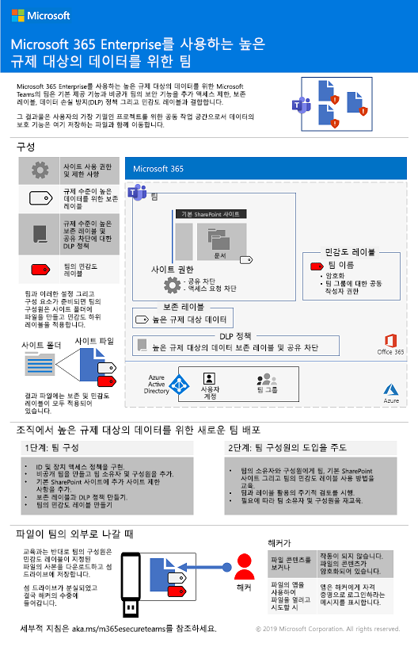
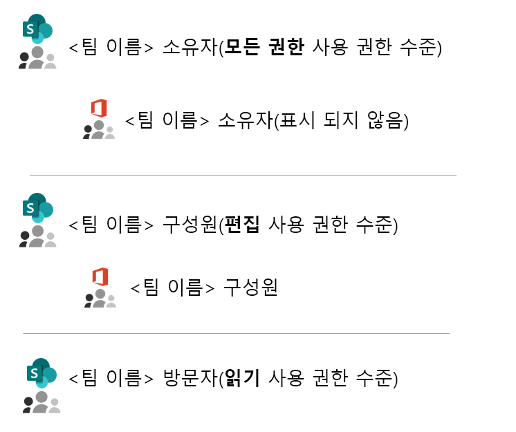
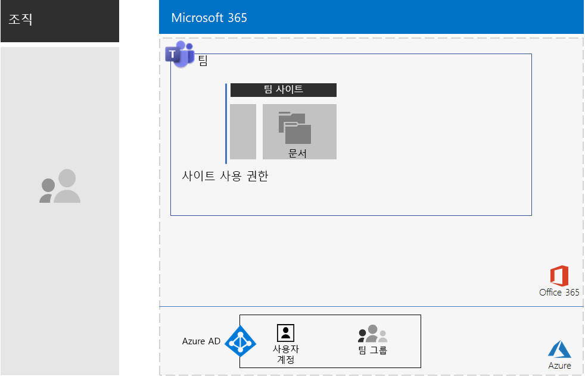
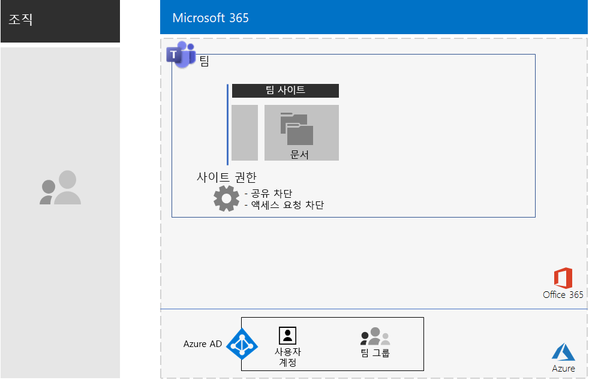
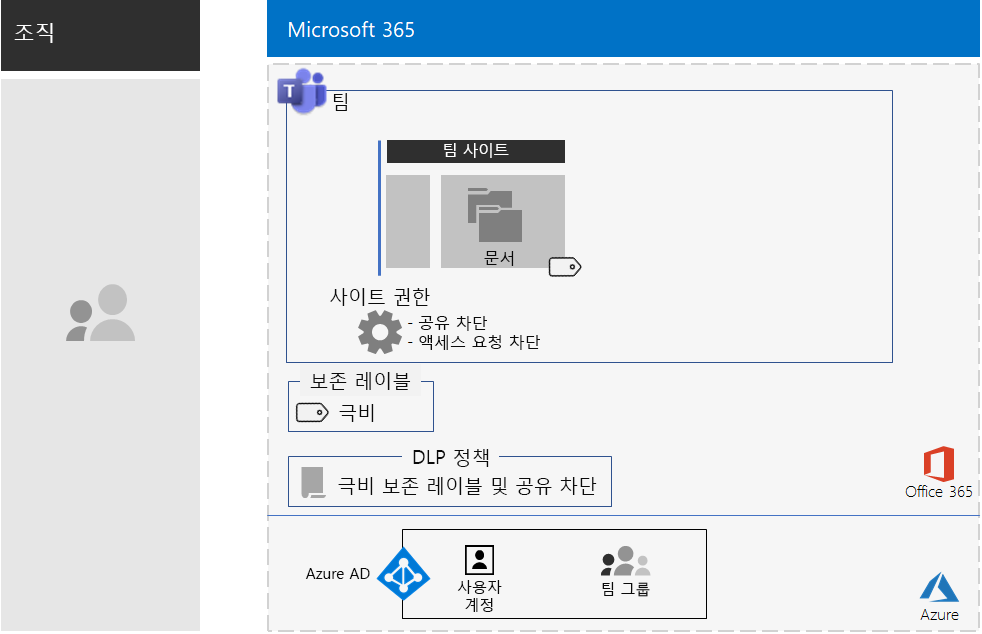
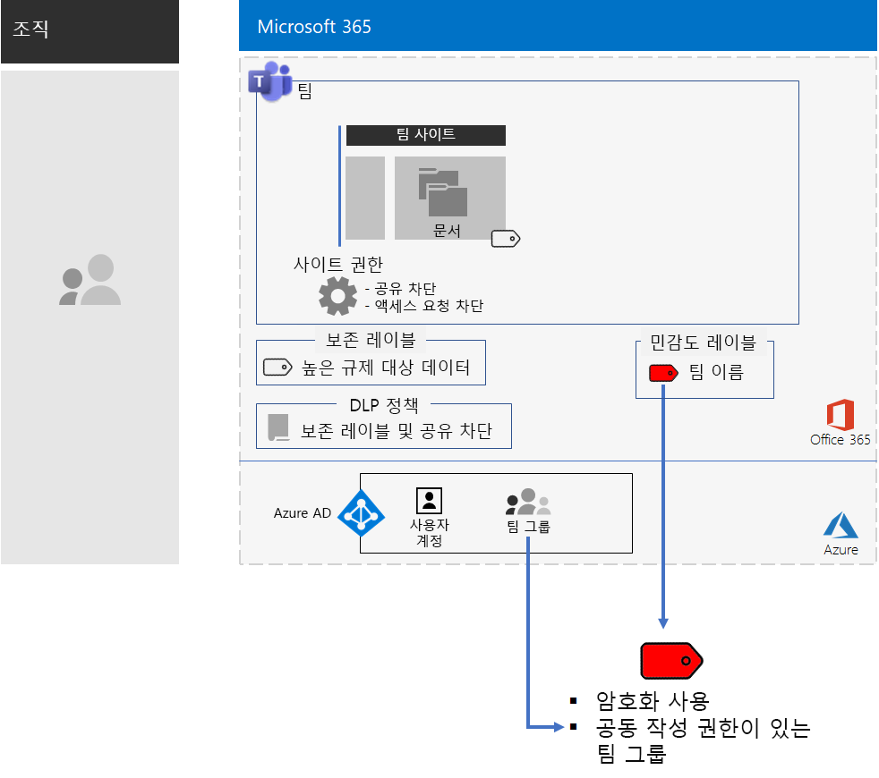
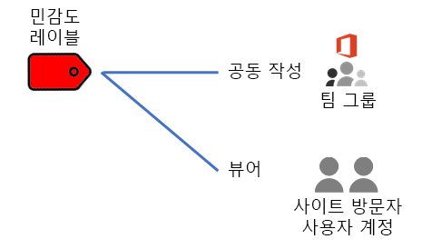
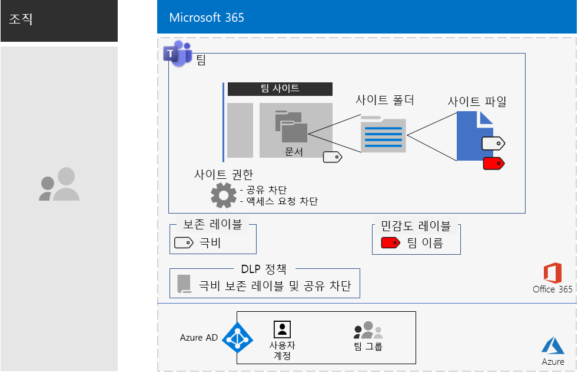

# 높은 규제 대상 데이터에 대한 Teams

이 문서에서는 개인 팀에 대해 Teams 기능(예: 채팅, 모임 및 파일)에 대한 액세스를 Office 365 그룹의 구성원과 소유자로 차단하는 개인 팀을 Microsoft Teams에서 구성하기 위한 권장 사항과 단계를 제공합니다. 

Office 365 그룹을 기반으로 하는 개인 액세스를 넘어서, 이 문서에서는 기본 개인 SharePoint 팀 사이트를 구성하는 방법을 설명합니다. 여기서, 높은 규제 대상 데이터를 저장하는 데 필요한 추가 보안을 위해 팀 채널의 **파일** 섹션에서 액세스할 수 있습니다. 이 SharePoint 팀 사이트에서 파일, 페이지, 공유 일정, 작업, 전자 필기장 및 목록에 저장하고 공동 작업할 수 있습니다.

>[!Note]
> SharePoint를 사용하는 유사한 시나리오는 [여기](teams-sharepoint-online-sites-highly-regulated-data.md)에 있습니다.
>

높은 규제 대상 데이터의 구성 요소는 다음과 같습니다.

- 소유자와 구성원 사용자 계정을 포함하는 해당 Office 365 그룹을 보유하고 있는 개인 팀입니다.
- 팀을 위한 기본 SharePoint 사이트에 대 한 추가 보안:
  - 사이트의 멤버가 다른 사람에게 액세스 권한을 부여하지 못하도록 합니다.
  - 사이트의 멤버 이외의 사용자가 다른 사람에게 액세스 권한을 요청하지 못하도록 합니다.
- 보존 정책을 정의하는 기본 방법으로 사이트에 있는 새 파일에 자동으로 적용되는 기본 SharePoint 사이트의 Office 365 보존 레이블입니다.
- 보존 레이블을 사용하고 사용자가 조직 외부에서 파일을 공유하거나 보내지 못하도록 차단하는 DLP(데이터 손실 방지) 정책입니다.
- Office 365 민감도 레이블 또는 팀의 Office 365 그룹에 대해 암호화가 활성화되어 있고 공동 작성자 권한이 있는 높은 규제 대상 레이블의 하위 레이블. Word, Excel 및 PowerPoint의 민감도 메뉴 모음 옵션에서 팀의 **파일** 섹션에 저장된 파일에 레이블이나 하위 레이블을 적용할 수 있습니다.

다음은 민감도 레이블이 포함된 결과 구성입니다.

 이 시나리오의 1 페이지 요약서를 보려면 [규제 수준이 높은 데이터 포스터를 위한 Teams](./media/secure-teams-highly-regulated-data-scenario/TeamsHighlyRegulatedData.pdf)를 참조하세요.

이 포스터를 [PDF](https://github.com/MicrosoftDocs/microsoft-365-docs/raw/public/microsoft-365/enterprise/media/secure-teams-highly-regulated-data-scenario/TeamsHighlyRegulatedData.pdf)나 [PowerPoint](https://github.com/MicrosoftDocs/microsoft-365-docs/raw/public/microsoft-365/enterprise/media/secure-teams-highly-regulated-data-scenario/Teams-Highly-Regulated-Data-Poster.pptx) 형식으로 다운로드할 수 있고 편지형, 법률형, 타블로이드(11 x 17) 크기 용지에 인쇄할 수도 있습니다.

<!--

[Quick-Learn test (vertical): PDF](./media/secure-teams-highly-regulated-data-scenario/Click-Through-Test.pdf)

[Quick-Learn test: PowerPoint](./media/secure-teams-highly-regulated-data-scenario/Click-Through-Test.pptx)

[Horizontal PDF (Quick Start)](./media/secure-teams-highly-regulated-data-scenario/Sideways.pdf)

--> 

## 1단계: 고도로 규제된 데이터를 위한 팀 구성

보안 팀의 엔드 투 엔드 (End-to-end) 구성은 다음의 단계로 구성됩니다:

1. ID 및 장치 액세스를 구성합니다.
2. 개인 팀을 만듭니다.
3. 추가 보안을 위해 기본 SharePoint 사이트를 구성합니다.
4. 보존 레이블과 DLP 정책을 만듭니다.
5. 높은 규제 대상 레이블의 레이블 또는 하위 레이블을 만듭니다.

### 1단계: ID 및 디바이스 액세스 구성

팀 또는 해당 팀의 기본 SharePoint 사이트에 대한 액세스를 보호하려면 [ID 및 디바이스 액세스 정책](https://docs.microsoft.com/microsoft-365/enterprise/identity-access-policies) 및 권장하는 [SharePoint Online 액세스 정책](https://docs.microsoft.com/microsoft-365/enterprise/sharepoint-file-access-policies)

### 2단계: 개인 팀 만들기

[이 지침](https://support.office.com/article/create-a-team-from-scratch-174adf5f-846b-4780-b765-de1a0a737e2b)을 사용하여 개인 팀을 만듭니다.

개인 팀을 만들 때 기본 권한은 다음과 같습니다.

- 팀의 Office 365 그룹(팀 그룹)에는 그룹 소유자와 그룹 구성원이 있습니다.
- 팀(팀 사이트)의 기본 SharePoint 사이트:
  - 사이트 모음 관리자가 팀 그룹 소유자에 대해 구성되어 있습니다.
  - 팀 사이트: 
    - 팀 사이트 소유자 SharePoint 그룹([모든 권한] 사용 권한 수준 포함)은 팀 그룹 소유자로 설정됩니다.
    - 팀 사이트 구성원 SharePoint 그룹(편집 사용 권한 수준 포함)은 팀 그룹 구성원으로 설정됩니다.
    - 팀 사이트 방문자 SharePoint 그룹(읽기 사용 권한 수준 포함)은 그룹 또는 사용자 계정이 없습니다.

다음은 팀 사이트의 기본 사용 권한입니다.

 
>[!Note]
>편집 사용 권한 수준의 \<팀 이름> 소유자 SharePoint 그룹을 보는 경우, \<팀 이름> 소유자가 표시되지 않습니다.
>

결과로 제공되는 권한을 사용하여 다음을 수행할 수 있습니다.

- 팀 그룹 소유자가 사이트를 관리하고 사이트 콘텐츠를 전체적으로 제어할 수 있습니다.
- 팀 그룹 구성원이 사이트에서 파일을 만들고 편집할 수 있습니다. 

사용 권한 유지 관리는 팀 구성원 및 소유자 유지 관리와 동일합니다.

지금까지의 결과 구성입니다.

 
### 3단계: 추가 보안을 위해 기본 SharePoint 사이트 구성

팀 사이트에서 이 사용 권한 설정을 구성합니다.

1. 도구 막대에서 설정 아이콘을 클릭한 다음, **사이트 사용 권한**을 클릭합니다.
2. **사이트 사용 권한** 창에 있는 **공유 설정**에서 **공유 설정 변경**을 클릭합니다.
3. **사용 권한 공유**에서 **사이트 소유자만 파일, 폴더 및 사이트를 공유할 수 있습니다**를 선택합니다.
4. **액세스 요청 허용**을 해제한 다음, **저장**을 클릭합니다.

이 설정을 사용하는 경우, 팀 그룹 구성원이 다른 구성원과 팀 사이트를 공유하거나 구성원이 아닌 사용자가 해당 팀 사이트의 액세스를 요청할 수 있는 기능을 사용할 수 없습니다.

지금까지의 결과 구성입니다.

 
### 4단계: 보존 레이블 및 DLP 정책 만들기

[이 지침](https://docs.microsoft.com/microsoft-365/security/office-365-security/deploy-teams-retention-dlp)을 사용하여 다음을 수행합니다.

1. 필요한 경우, 높은 규제 대상 데이터의 보존 레이블을 만들고 게시합니다.
2. 1단계에서 만든 보존 레이블에 맞게 팀 사이트를 구성합니다.
3. 2단계에서 만든 보존 레이블을 사용하고 사용자가 조직 외부에서 파일을 전송하지 못하도록 높은 규제 대상 데이터에 대한 DLP 정책을 만듭니다. [DLP 정책 서식 파일](https://docs.microsoft.com/microsoft-365/compliance/data-loss-prevention-policies#dlp-policy-templates)을 기반으로, 상태 및 재무 산업 규제에 대한 정책와 같이 추가 요구 사항에 대한 정책을 구성할 수도 있습니다.

지금까지의 결과 구성입니다.

 
### 5단계: 규제 수준이 높은 민감도 레이블의 민감도 레이블 또는 하위 레이블 만들기

모든 사용자가 모든 파일에 적용할 수 있는 높은 규제 대상 데이터의 민감도 레이블과 달리, 할당된 파일이 다음을 수행하려면 보안 팀에 고유한 레이블이나 하위 레이블이 필요합니다.

- 암호화되고 해당 암호화가 파일이 이동하는 경우에도 지원됩니다.
- 팀 그룹의 구성원만 파일을 열 수 있도록 사용자 지정 권한을 포함합니다.

팀 사이트에 저장된 파일에 보안 수준을 추가적으로 설정하려면, 고유한 레이블 또는 높은 규제 대상 파일에 대한 일반적인 레이블의 하위 레이블인 새 민감도 레이블을 구성해야 합니다. 팀 그룹 구성원만 레이블 목록에서 해당 항목을 볼 수 있습니다.

전역적인 사용과 개별적 개인 팀에 소수의 레이블이 필요한 경우에는 민감도 레이블을 사용합니다. 다수의 레이블을 보유하고 있거나 높은 규제 대상 레이블 아래에 개인 팀의 레이블을 구성하려는 경우 민감도 하위 레이블을 사용합니다.

[이 지침을 사용](https://docs.microsoft.com/microsoft-365/compliance/encryption-sensitivity-labels)하여 다음 설정으로 개별 레이블이나 하위 레이블을 구성합니다.

- 레이블 이름에는 팀 이름이 포함되어 있습니다.
- 암호화가 사용하도록 설정됩니다.
- 팀 그룹에 공동 작성자 권한이 있습니다.

새 레이블이 포함된 결과 구성은 다음과 같습니다.

민감도 레이블과 팀 그룹 사이의 관계는 다음과 같습니다.

>[!Note]
>사용자 정의 사용 권한에 대해 또는 만료일을 포함하여 민감도 레이블이나 하위 레이블을 구성하는 경우, Teams 또는 SharePoint에서 파일을 열 수 없습니다. Office 앱을 사용해야 합니다.
>

### 사용 권한의 사용자 지정 

팀 사이트의 사용자 지정 SharePoint 사이트 사용 권한을 구성하고, 필요한 경우 해당 민감도 레이블을 구성할 수도 있습니다. 다음은 이와 관련된 두 가지 예입니다.

#### 예제 1: SharePoint 사이트 관리 위임

팀 소유자가 SharePoint 관리 경험이 없거나 팀 사이트의 관리를 위임하려는 경우, SharePoint 관리자의 사용자 계정을 팀 소유자 목록에 추가할 수 있습니다. 그러나 SharePoint 관리자는 팀과 모든 해당 리소스에 대한 전체 액세스 권한을 갖게 되고 민감도 레이블이 적용된 파일을 열 수 있습니다. 

권한을 초과하여 부여하지 않도록 하려면, 해당 사이트의 고급 사용 권한 설정에서 SharePoint 관리자의 사용자 계정을 팀 사이트 소유자 SharePoint 그룹에 추가합니다. SharePoint 관리자가 사이트를 관리할 수는 있지만, 팀과 해당 리소스에 액세스할 수 없으며 민감도 레이블이 지정된 파일을 열 수 없습니다.

#### 예제 2: 레이블이 지정된 파일에 대해 보기 전용 액세스 허용

일부 직원만 팀 사이트에서 레이블이 지정된 파일의 내용을 보아야 하는 경우, 개별 사용자 계정을 

- 기본적으로 읽기 사용 권한이 있는 \<팀 이름 > 방문자 SharePoint 그룹에 추가할 수 있습니다. 
- 뷰어 권한이 있는 민감도 레이블입니다.

다음은 레이블의 결과 권한입니다.

 
사이트 방문자는 팀 사이트에 바로 액세스하고 하위 레이블이 적용된 파일의 내용을 볼 수 있습니다. 그러나 팀 그룹의 구성원이 아니므로, 팀 또는 해당 리소스에는 액세스할 수 없습니다.

## 2단계: 팀 구성원을 위한 사용자 채택 유도

팀이 준비되면 팀 구성원에게 팀과 추가 보안 기능의 채택을 유도할 시점입니다.

### 1단계: 사용자 교육

팀 그룹의 구성원은 채팅, 모임 및 기타 앱을 포함하여 팀과 모든 리소스에 액세스할 수 있습니다. 채널의 **파일** 섹션에서 파일에 대한 작업을 하는 경우, 팀 그룹의 구성원이 보안 팀을 위해 만든 파일에 민감도 레이블이나 하위 레이블을 할당해야 합니다. 다음은 예시입니다.

 
레이블이 해당 파일에 적용되는 경우, 파일이 보호됩니다. 팀 그룹의 구성원이 실시간으로 Teams에서 파일을 열고 공동 작업할 수 있습니다. 파일이 암호화되며 팀 그룹 구성원으로 설정된 공동 작성자 권한을 포함합니다. 파일이 사이트를 떠나 악의적인 사용자에게 전달되는 경우, 파일을 열고 콘텐츠를 보려면 팀 그룹의 구성원인 사용자 계정의 자격 증명을 제공해야 합니다. 

팀 구성원 교육:

- 채팅, 모임, 파일 및 기타 팀 사이트의 리소스를 위한 새 팀 사용의 중요성 및 높은 규제 대상의 데이터 누출 결과(예: 법적 영향, 규제 벌금, 랜섬웨어 또는 경쟁적 우위 박탈)
- 팀에 액세스 하는 방법
- 사이트에서 새 파일을 만들고 로컬에 저장된 새 파일을 업로드하는 방법
- DLP 정책으로 외부에서 파일을 공유하지 못하도록 차단하는 방법
- 팀의 사용자 지정 레이블이나 하위 레이블을 사용하여 파일에 레이블을 할당하는 방법.
- 파일이 사이트 외부로 누출된 경우에도 레이블 혹은 하위 레이블이 파일을 보호하는 방법.

이 교육에는 팀 구성원이 이러한 기능과 해당 결과를 경험해볼 수 있도록 하기 위해 실무 위주의 연습이 포함되어 있습니다.

### 2단계: 정기적인 사용 현황 검토 및 팀 구성원 피드백 처리

교육 후 몇 주 안에:

- 팀 구성원의 피드백을 신속하게 처리하고 정책과 구성을 세부적으로 조정합니다.
- 팀의 사용 현황을 분석하고 예상 사용 현황과 비교합니다.
- 높은 규제 대상 파일에 사용자 지정 민감도 레이블 혹은 하위 레이블이 적절히 할당되었는지 확인합니다.

  SharePoint에서 폴더를 보고 **열 추가**의 **열 표시/숨기기** 옵션을 통해 **민감도** 열을 추가하여 레이블이 할당된 파일을 볼 수 있습니다.

필요에 따라 사용자를 재교육합니다.

## 테스트 환경에서 이에 대해 설명

민감 또는 기밀 파일이 있는지 팀을 테스트하기 위한 자체 테스트 환경을 구축하려면 [이 지침](https://docs.microsoft.com/microsoft-365/security/office-365-security/secure-team-for-files-in-a-dev-test-environment)을 참조하십시오. 

## Contoso Corporation이 극비 프로젝트를 위해 보안 팀을 사용하는 방법

Contoso Corporation은 가상의 대표적인 글로벌 제조 대기업입니다. Contoso에서 신제품 및 서비스 집합을 개발하고 시장에 출시하기 위한 극비 프로젝트에 대해 [보안 팀](contoso-team-for-top-secret-project.md)을 구성하고 채택하는 방법을 알아봅니다. 

## 참고 항목

[높은 규제 대상 데이터를 위한 SharePoint 사이트](teams-sharepoint-online-sites-highly-regulated-data.md)

[Microsoft 365 Enterprise 워크로드 및 시나리오](deploy-workloads.md)

[Microsoft 365 생산성 라이브러리](https://aka.ms/productivitylibrary) (https://aka.ms/productivitylibrary)

[배포 가이드](deploy-microsoft-365-enterprise.md)
