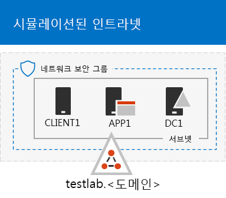
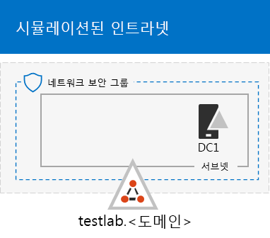

# <a name="the-simulated-enterprise-base-configuration"></a><span data-ttu-id="ed09f-103">시뮬레이트된 엔터프라이즈 기본 구성</span><span class="sxs-lookup"><span data-stu-id="ed09f-103">The simulated enterprise base configuration</span></span>

<span data-ttu-id="ed09f-104">*이 테스트 랩 가이드는 Microsoft 365 Enterprise와 Office 365 Enterprise 테스트 환경 모두에서 사용할 수 있습니다.*</span><span class="sxs-lookup"><span data-stu-id="ed09f-104">*This Test Lab Guide can be used for both Microsoft 365 Enterprise and Office 365 Enterprise test environments.*</span></span>

<span data-ttu-id="ed09f-105">이 문서에서는 다음을 포함하는 Microsoft 365 Enterprise의 간소화된 환경을 만들기 위한 단계별 지침을 제공합니다.</span><span class="sxs-lookup"><span data-stu-id="ed09f-105">This article provides you with step-by-step instructions to create a simplified environment for Microsoft 365 Enterprise that includes:</span></span>

- <span data-ttu-id="ed09f-106">Microsoft 365 E5 평가판 또는 유료 구독</span><span class="sxs-lookup"><span data-stu-id="ed09f-106">A Microsoft 365 E5 trial or paid subscription.</span></span>
- <span data-ttu-id="ed09f-107">인터넷에 연결된 간소화된 조직 인트라넷: Azure Virtual Network의 3가지 가상 머신(DC1, APP1 및 CLIENT1)으로 구성됩니다.</span><span class="sxs-lookup"><span data-stu-id="ed09f-107">A simplified organization intranet connected to the Internet, consisting of three virtual machines on an Azure virtual network (DC1, APP1, and CLIENT1).</span></span>
 


<span data-ttu-id="ed09f-109">추가 [테스트 랩 가이드](m365-enterprise-test-lab-guides.md)를 진행하고 결과 환경을 사용하거나 직접 구성한 환경을 사용하여 [Microsoft 365 Enterprise](https://www.microsoft.com/microsoft-365/enterprise)의 특성과 기능을 테스트할 수 있습니다.</span><span class="sxs-lookup"><span data-stu-id="ed09f-109">You can use the resulting environment to test the features and functionality of [Microsoft 365 Enterprise](https://www.microsoft.com/microsoft-365/enterprise) with additional [Test Lab Guides](m365-enterprise-test-lab-guides.md) or on your own.</span></span>


> [!TIP]
> <span data-ttu-id="ed09f-111">Microsoft 365 Enterprise 테스트 랩 가이드 스택의 모든 문서에 대한 가상 맵을 확인하려면 [Microsoft 365 Enterprise 테스트 랩 가이드 스택](../media/m365-enterprise-test-lab-guides/Microsoft365EnterpriseTLGStack.pdf)으로 이동하세요.</span><span class="sxs-lookup"><span data-stu-id="ed09f-111">Go to [Microsoft 365 Enterprise Test Lab Guide Stack](../media/m365-enterprise-test-lab-guides/Microsoft365EnterpriseTLGStack.pdf) for a visual map to all the articles in the Microsoft 365 Enterprise Test Lab Guide stack.</span></span>

## <a name="phase-1-create-a-simulated-intranet"></a><span data-ttu-id="ed09f-112">1단계: 시뮬레이트된 인트라넷 만들기</span><span class="sxs-lookup"><span data-stu-id="ed09f-112">Phase 1: Create a simulated intranet</span></span>

<span data-ttu-id="ed09f-113">이 단계에서는 AD DS(Active Directory Domain Services) 도메인 컨트롤러, 응용프로그램 서버, 클라이언트 컴퓨터를 포함하는 Azure 인프라 서비스에 시뮬레이트된 인트라넷을 만듭니다.</span><span class="sxs-lookup"><span data-stu-id="ed09f-113">In this phase, you build a simulated intranet in Azure infrastructure services that includes an Active Directory Domain Services (AD DS) domain controller, an application server, and a client computer.</span></span> 

<span data-ttu-id="ed09f-114">이 컴퓨터를 추가 [Microsoft 365 Enterprise 테스트 랩 가이드](m365-enterprise-test-lab-guides.md)에서 이 컴퓨터를 사용하여 하이브리드 ID 및 기타 기능을 구성하고 보여줍니다.</span><span class="sxs-lookup"><span data-stu-id="ed09f-114">You'll use these computers in additional [Microsoft 365 Enterprise Test Lab Guides](m365-enterprise-test-lab-guides.md) to configure and demonstrate hybrid identity and other capabilities.</span></span>

### <a name="method-1-build-your-simulated-intranet-with-an-azure-resource-manager-template"></a><span data-ttu-id="ed09f-115">방법 1: Azure Resource Manager 템플릿으로 시뮬레이트된 인트라넷 만들기</span><span class="sxs-lookup"><span data-stu-id="ed09f-115">Method 1: Build your simulated intranet with an Azure Resource Manager template</span></span>

<span data-ttu-id="ed09f-116">In this method, you use an Azure Resource Manager (ARM) template to build out the simulated intranet.</span><span class="sxs-lookup"><span data-stu-id="ed09f-116">In this method, you use an Azure Resource Manager (ARM) template to build out the simulated intranet.</span></span> <span data-ttu-id="ed09f-117">ARM templates contain all of the instructions to create the Azure networking infrastructure, the virtual machines, and their configuration.</span><span class="sxs-lookup"><span data-stu-id="ed09f-117">ARM templates contain all of the instructions to create the Azure networking infrastructure, the virtual machines, and their configuration.</span></span>

<span data-ttu-id="ed09f-118">템플릿을 배포하기 전에 [템플릿 추가 정보 페이지](https://github.com/maxskunkworks/TLG/tree/master/tlg-base-config_3-vm.m365-ems)를 읽고 다음 정보를 준비합니다.</span><span class="sxs-lookup"><span data-stu-id="ed09f-118">Prior to deploying the template, read through the [template README page](https://github.com/maxskunkworks/TLG/tree/master/tlg-base-config_3-vm.m365-ems) and have the following information ready:</span></span>

- <span data-ttu-id="ed09f-119">The public DNS domain name of your test environment (testlab.\<your public domain>).</span><span class="sxs-lookup"><span data-stu-id="ed09f-119">The public DNS domain name of your test environment (testlab.\<your public domain>).</span></span> <span data-ttu-id="ed09f-120">You'll need to enter this name in the **Domain Name field** of the **Custom deployment** page.</span><span class="sxs-lookup"><span data-stu-id="ed09f-120">You'll need to enter this name in the **Domain Name field** of the **Custom deployment** page.</span></span>
- <span data-ttu-id="ed09f-121">A DNS label prefix for the URLs of the public IP addresses of your virtual machines.</span><span class="sxs-lookup"><span data-stu-id="ed09f-121">A DNS label prefix for the URLs of the public IP addresses of your virtual machines.</span></span> <span data-ttu-id="ed09f-122">You'll need to enter this label in the **Dns Label Prefix** field of the **Custom deployment** page.</span><span class="sxs-lookup"><span data-stu-id="ed09f-122">You'll need to enter this label in the **Dns Label Prefix** field of the **Custom deployment** page.</span></span>

<span data-ttu-id="ed09f-123">지침을 읽은 후 [템플릿 추가 정보 페이지](https://github.com/maxskunkworks/TLG/tree/master/tlg-base-config_3-vm.m365-ems)에서 **Azure로 배포**를 클릭하여 시작합니다.</span><span class="sxs-lookup"><span data-stu-id="ed09f-123">After reading through the instructions, click **Deploy to Azure** on the [template README page](https://github.com/maxskunkworks/TLG/tree/master/tlg-base-config_3-vm.m365-ems) to get started.</span></span>

>[!Note]
><span data-ttu-id="ed09f-124">ARM 템플릿에서 만든 시뮬레이트된 인트라넷은 유료 Azure 구독이 있어야 합니다.</span><span class="sxs-lookup"><span data-stu-id="ed09f-124">The simulated intranet built by the ARM template requires a paid Azure subscription.</span></span>
>

<span data-ttu-id="ed09f-125">템플릿이 완료된 후 구성입니다.</span><span class="sxs-lookup"><span data-stu-id="ed09f-125">Here is your configuration after the template is complete.</span></span>



### <a name="method-2-build-your-simulated-intranet-with-azure-powershell"></a><span data-ttu-id="ed09f-127">방법 2: Azure PowerShell로 시뮬레이트된 인트라넷 만들기</span><span class="sxs-lookup"><span data-stu-id="ed09f-127">Method 2: Build your simulated intranet with Azure PowerShell</span></span>

<span data-ttu-id="ed09f-128">이 방법에서는 Windows PowerShell 및 Azure PowerShell 모듈을 사용하여 네트워킹 인프라, 가상 머신 및 해당 구성을 만듭니다.</span><span class="sxs-lookup"><span data-stu-id="ed09f-128">In this method, you use Windows PowerShell and the Azure PowerShell module to build out the networking infrastructure, the virtual machines, and their configuration.</span></span>

<span data-ttu-id="ed09f-129">Use this method if you want to get experience creating elements of Azure infrastructure one step at a time with PowerShell.</span><span class="sxs-lookup"><span data-stu-id="ed09f-129">Use this method if you want to get experience creating elements of Azure infrastructure one step at a time with PowerShell.</span></span> <span data-ttu-id="ed09f-130">You can then customize the PowerShell command blocks for your own deployment of other virtual machines in Azure.</span><span class="sxs-lookup"><span data-stu-id="ed09f-130">You can then customize the PowerShell command blocks for your own deployment of other virtual machines in Azure.</span></span>

#### <a name="step-1-create-dc1"></a><span data-ttu-id="ed09f-131">1단계: DC1 만들기</span><span class="sxs-lookup"><span data-stu-id="ed09f-131">Step 1: Create DC1</span></span>

<span data-ttu-id="ed09f-132">이 단계에서는 Azure Virtual Network를 만들고, AD DS 도메인에 대한 도메인 컨트롤러인 가상 머신 DC1을 추가합니다.</span><span class="sxs-lookup"><span data-stu-id="ed09f-132">In this step, we create an Azure virtual network and add DC1, a virtual machine that is a domain controller for an AD DS domain.</span></span>

<span data-ttu-id="ed09f-133">먼저, 로컬 컴퓨터에서 Windows PowerShell 명령 프롬프트를 시작합니다.</span><span class="sxs-lookup"><span data-stu-id="ed09f-133">First, start a Windows PowerShell command prompt on your local computer.</span></span>
  
> [!NOTE]
> <span data-ttu-id="ed09f-134">The following command sets use the latest version of Azure PowerShell.</span><span class="sxs-lookup"><span data-stu-id="ed09f-134">The following command sets use the latest version of Azure PowerShell.</span></span> <span data-ttu-id="ed09f-135">See [Get started with Azure PowerShell cmdlets](https://docs.microsoft.com/powershell/azureps-cmdlets-docs/).</span><span class="sxs-lookup"><span data-stu-id="ed09f-135">See [Get started with Azure PowerShell cmdlets](https://docs.microsoft.com/powershell/azureps-cmdlets-docs/).</span></span> 
  
<span data-ttu-id="ed09f-136">다음 명령을 사용하여 Azure 계정에 로그인합니다.</span><span class="sxs-lookup"><span data-stu-id="ed09f-136">Sign in to your Azure account with the following command.</span></span>
  
```powershell
Connect-AzAccount
```

<span data-ttu-id="ed09f-137">다음 명령을 사용하여 구독 이름을 가져옵니다.</span><span class="sxs-lookup"><span data-stu-id="ed09f-137">Get your subscription name using the following command.</span></span>
  
```powershell
Get-AzSubscription | Sort Name | Select Name
```

<span data-ttu-id="ed09f-138">Set your Azure subscription.</span><span class="sxs-lookup"><span data-stu-id="ed09f-138">Set your Azure subscription.</span></span> <span data-ttu-id="ed09f-139">Replace everything within the quotes, including the < and > characters, with the correct name.</span><span class="sxs-lookup"><span data-stu-id="ed09f-139">Replace everything within the quotes, including the < and > characters, with the correct name.</span></span>
  
```powershell
$subscr="<subscription name>"
Get-AzSubscription -SubscriptionName $subscr | Select-AzSubscription
```

<span data-ttu-id="ed09f-140">Next, create a new resource group for your simulated enterprise test lab.</span><span class="sxs-lookup"><span data-stu-id="ed09f-140">Next, create a new resource group for your simulated enterprise test lab.</span></span> <span data-ttu-id="ed09f-141">To determine a unique resource group name, use this command to list your existing resource groups.</span><span class="sxs-lookup"><span data-stu-id="ed09f-141">To determine a unique resource group name, use this command to list your existing resource groups.</span></span>
  
```powershell
Get-AzResourceGroup | Sort ResourceGroupName | Select ResourceGroupName
```

<span data-ttu-id="ed09f-142">Create your new resource group with these commands.</span><span class="sxs-lookup"><span data-stu-id="ed09f-142">Create your new resource group with these commands.</span></span> <span data-ttu-id="ed09f-143">Replace everything within the quotes, including the < and > characters, with the correct names.</span><span class="sxs-lookup"><span data-stu-id="ed09f-143">Replace everything within the quotes, including the < and > characters, with the correct names.</span></span>
  
```powershell
$rgName="<resource group name>"
$locName="<location name, such as West US>"
New-AzResourceGroup -Name $rgName -Location $locName
```

<span data-ttu-id="ed09f-144">Next, you create the TestLab virtual network that will host the Corpnet subnet of the simulated enterprise environment and protect it with a network security group.</span><span class="sxs-lookup"><span data-stu-id="ed09f-144">Next, you create the TestLab virtual network that will host the Corpnet subnet of the simulated enterprise environment and protect it with a network security group.</span></span> <span data-ttu-id="ed09f-145">Fill in the name of your resource group and run these commands at the PowerShell command prompt on your local computer.</span><span class="sxs-lookup"><span data-stu-id="ed09f-145">Fill in the name of your resource group and run these commands at the PowerShell command prompt on your local computer.</span></span>
  
```powershell
$rgName="<name of your new resource group>"
$locName=(Get-AzResourceGroup -Name $rgName).Location
$corpnetSubnet=New-AzVirtualNetworkSubnetConfig -Name Corpnet -AddressPrefix 10.0.0.0/24
New-AzVirtualNetwork -Name TestLab -ResourceGroupName $rgName -Location $locName -AddressPrefix 10.0.0.0/8 -Subnet $corpnetSubnet -DNSServer 10.0.0.4
$rule1=New-AzNetworkSecurityRuleConfig -Name "RDPTraffic" -Description "Allow RDP to all VMs on the subnet" -Access Allow -Protocol Tcp -Direction Inbound -Priority 100 -SourceAddressPrefix Internet -SourcePortRange * -DestinationAddressPrefix * -DestinationPortRange 3389
New-AzNetworkSecurityGroup -Name Corpnet -ResourceGroupName $rgName -Location $locName -SecurityRules $rule1
$vnet=Get-AzVirtualNetwork -ResourceGroupName $rgName -Name TestLab
$nsg=Get-AzNetworkSecurityGroup -Name Corpnet -ResourceGroupName $rgName
Set-AzVirtualNetworkSubnetConfig -VirtualNetwork $vnet -Name Corpnet -AddressPrefix "10.0.0.0/24" -NetworkSecurityGroup $nsg
$vnet | Set-AzVirtualNetwork
```

<span data-ttu-id="ed09f-146">다음으로, DC1 가상 머신을 만들고 **testlab.**\<your public domain> AD DS 도메인에 대한 도메인 컨트롤러와</span><span class="sxs-lookup"><span data-stu-id="ed09f-146">Next, you create the DC1 virtual machine and configure it as a domain controller for the **testlab.**\<your public domain></span></span> <span data-ttu-id="ed09f-147">TestLab 가상 네트워크의 가상 머신에 대한 DNS 서버로 구성합니다.</span><span class="sxs-lookup"><span data-stu-id="ed09f-147">AD DS domain and a DNS server for the virtual machines of the TestLab virtual network.</span></span> <span data-ttu-id="ed09f-148">예를 들어 공용 도메인 이름이 **<span>contoso</span>.com**이면 DC1 가상 머신은 **<span>testlab</span>.contoso.com**에 대한 도메인 컨트롤러가 됩니다.</span><span class="sxs-lookup"><span data-stu-id="ed09f-148">For example, if your public domain name is **<span>contoso</span>.com**, the DC1 virtual machine will be a domain controller for the **<span>testlab</span>.contoso.com** domain.</span></span>
  
<span data-ttu-id="ed09f-149">DC1에 대한 Azure Virtual Machine을 만들려면 리소스 그룹의 이름을 입력하고 로컬 컴퓨터의 PowerShell 명령 프롬프트에서 다음 명령을 실행합니다.</span><span class="sxs-lookup"><span data-stu-id="ed09f-149">To create an Azure virtual machine for DC1, fill in the name of your resource group and run these commands at the PowerShell command prompt on your local computer.</span></span>
  
```powershell
$rgName="<resource group name>"
$locName=(Get-AzResourceGroup -Name $rgName).Location
$vnet=Get-AzVirtualNetwork -Name TestLab -ResourceGroupName $rgName
$pip=New-AzPublicIpAddress -Name DC1-PIP -ResourceGroupName $rgName -Location $locName -AllocationMethod Dynamic
$nic=New-AzNetworkInterface -Name DC1-NIC -ResourceGroupName $rgName -Location $locName -SubnetId $vnet.Subnets[0].Id -PublicIpAddressId $pip.Id -PrivateIpAddress 10.0.0.4
$vm=New-AzVMConfig -VMName DC1 -VMSize Standard_A2_V2
$cred=Get-Credential -Message "Type the name and password of the local administrator account for DC1."
$vm=Set-AzVMOperatingSystem -VM $vm -Windows -ComputerName DC1 -Credential $cred -ProvisionVMAgent -EnableAutoUpdate
$vm=Set-AzVMSourceImage -VM $vm -PublisherName MicrosoftWindowsServer -Offer WindowsServer -Skus 2016-Datacenter -Version "latest"
$vm=Add-AzVMNetworkInterface -VM $vm -Id $nic.Id
$vm=Set-AzVMOSDisk -VM $vm -Name "DC1-OS" -DiskSizeInGB 128 -CreateOption FromImage
$diskConfig=New-AzDiskConfig -AccountType "Standard_LRS" -Location $locName -CreateOption Empty -DiskSizeGB 20
$dataDisk1=New-AzDisk -DiskName "DC1-DataDisk1" -Disk $diskConfig -ResourceGroupName $rgName
$vm=Add-AzVMDataDisk -VM $vm -Name "DC1-DataDisk1" -CreateOption Attach -ManagedDiskId $dataDisk1.Id -Lun 1
New-AzVM -ResourceGroupName $rgName -Location $locName -VM $vm
```

<span data-ttu-id="ed09f-150">You will be prompted for a user name and password for the local administrator account on DC1.</span><span class="sxs-lookup"><span data-stu-id="ed09f-150">You will be prompted for a user name and password for the local administrator account on DC1.</span></span> <span data-ttu-id="ed09f-151">Use a strong password and record both the name and password in a secure location.</span><span class="sxs-lookup"><span data-stu-id="ed09f-151">Use a strong password and record both the name and password in a secure location.</span></span>
  
<span data-ttu-id="ed09f-152">다음으로, DC1 가상 머신에 연결합니다.</span><span class="sxs-lookup"><span data-stu-id="ed09f-152">Next, connect to the DC1 virtual machine.</span></span>
  
1. <span data-ttu-id="ed09f-153">[Azure Portal](https://portal.azure.com)에서 **리소스 그룹 >** [새 리소스 그룹의 이름] **> DC1 > 연결**을 클릭합니다.</span><span class="sxs-lookup"><span data-stu-id="ed09f-153">In the [Azure portal](https://portal.azure.com), click **Resource Groups >** [the name of your new resource group] **> DC1 > Connect**.</span></span>
    
2. <span data-ttu-id="ed09f-154">In the open pane, click **Download RDP file**.</span><span class="sxs-lookup"><span data-stu-id="ed09f-154">In the open pane, click **Download RDP file**.</span></span> <span data-ttu-id="ed09f-155">Open the DC1.rdp file that is downloaded, and then click **Connect**.</span><span class="sxs-lookup"><span data-stu-id="ed09f-155">Open the DC1.rdp file that is downloaded, and then click **Connect**.</span></span>
    
3. <span data-ttu-id="ed09f-156">DC1 로컬 관리자 계정 이름을 지정합니다.</span><span class="sxs-lookup"><span data-stu-id="ed09f-156">Specify the DC1 local administrator account name:</span></span>
    
   - <span data-ttu-id="ed09f-157">Windows 7:</span><span class="sxs-lookup"><span data-stu-id="ed09f-157">For Windows 7:</span></span>
    
     <span data-ttu-id="ed09f-158">In the **Windows Security** dialog box, click **Use another account**.</span><span class="sxs-lookup"><span data-stu-id="ed09f-158">In the **Windows Security** dialog box, click **Use another account**.</span></span> <span data-ttu-id="ed09f-159">In **User name**, type **DC1\\**[Local administrator account name].</span><span class="sxs-lookup"><span data-stu-id="ed09f-159">In **User name**, type **DC1\\**[Local administrator account name].</span></span>
    
   - <span data-ttu-id="ed09f-160">Windows 8.1 또는 Windows 10:</span><span class="sxs-lookup"><span data-stu-id="ed09f-160">For Windows 8 or Windows 10:</span></span>
    
     <span data-ttu-id="ed09f-161">In the **Windows Security** dialog box, click **More choices**, and then click **Use a different account**.</span><span class="sxs-lookup"><span data-stu-id="ed09f-161">In the **Windows Security** dialog box, click **More choices**, and then click **Use a different account**.</span></span> <span data-ttu-id="ed09f-162">In **User name**, type **DC1\\**[Local administrator account name].</span><span class="sxs-lookup"><span data-stu-id="ed09f-162">In **User name**, type **DC1\\**[Local administrator account name].</span></span>
    
4. <span data-ttu-id="ed09f-163">**암호**에서 로컬 관리자 계정의 암호를 입력하고 **확인**을 클릭합니다.</span><span class="sxs-lookup"><span data-stu-id="ed09f-163">In **Password**, type the password of the local administrator account, and then click **OK**.</span></span>
    
5. <span data-ttu-id="ed09f-164">메시지가 표시되면 **예**를 클릭합니다.</span><span class="sxs-lookup"><span data-stu-id="ed09f-164">When prompted, click **Yes**.</span></span>
    
<span data-ttu-id="ed09f-165">다음으로 DC1의 관리자 수준 Windows PowerShell 명령 프롬프트에서 다음 명령을 사용하여 추가 데이터 디스크를 드라이브 문자 F:의 새로운 볼륨으로 추가합니다.</span><span class="sxs-lookup"><span data-stu-id="ed09f-165">Next, add an extra data disk as a new volume with the drive letter F: with this command at an administrator-level Windows PowerShell command prompt on DC1.</span></span>
  
```powershell
Get-Disk | Where PartitionStyle -eq "RAW" | Initialize-Disk -PartitionStyle MBR -PassThru | New-Partition -AssignDriveLetter -UseMaximumSize | Format-Volume -FileSystem NTFS -NewFileSystemLabel "WSAD Data"
```

<span data-ttu-id="ed09f-166">그런 다음, DC1을 **testlab.**\<your public domain> 도메인에 대한 도메인 컨트롤러 및 DNS 서버로</span><span class="sxs-lookup"><span data-stu-id="ed09f-166">Next, configure DC1 as a domain controller and DNS server for the **testlab.**\<your public domain></span></span> <span data-ttu-id="ed09f-167">구성합니다.</span><span class="sxs-lookup"><span data-stu-id="ed09f-167">domain.</span></span> <span data-ttu-id="ed09f-168">공용 도메인 이름을 지정하고, \< and > 문자를 제거한 다음, 이 명령을 DC1의 관리자 수준 Windows PowerShell 명령 프롬프트에서 실행합니다.</span><span class="sxs-lookup"><span data-stu-id="ed09f-168">Specify your public domain name, remove the \< and > characters, and then run these commands at an administrator-level Windows PowerShell command prompt on DC1.</span></span>
  
```powershell
$yourDomain="<your public domain>"
Install-WindowsFeature AD-Domain-Services -IncludeManagementTools
Install-ADDSForest -DomainName testlab.$yourDomain -DatabasePath "F:\NTDS" -SysvolPath "F:\SYSVOL" -LogPath "F:\Logs"
```
<span data-ttu-id="ed09f-169">You will need to specify a safe mode administrator password.</span><span class="sxs-lookup"><span data-stu-id="ed09f-169">You will need to specify a safe mode administrator password.</span></span> <span data-ttu-id="ed09f-170">Store this password in a secure location.</span><span class="sxs-lookup"><span data-stu-id="ed09f-170">Store this password in a secure location.</span></span>
  
<span data-ttu-id="ed09f-171">이러한 명령은 완료하는 데 몇 분 정도 걸릴 수 있습니다.</span><span class="sxs-lookup"><span data-stu-id="ed09f-171">Note that these commands can take a few minutes to complete.</span></span>
  
<span data-ttu-id="ed09f-172">DC1이 다시 시작되면 DC1 가상 머신에 다시 연결합니다.</span><span class="sxs-lookup"><span data-stu-id="ed09f-172">After DC1 restarts, reconnect to the DC1 virtual machine.</span></span>
  
1. <span data-ttu-id="ed09f-173">[Azure Portal](https://portal.azure.com)에서 **리소스 그룹 >** [리소스 그룹 이름] **> DC1 > 연결**을 클릭합니다.</span><span class="sxs-lookup"><span data-stu-id="ed09f-173">In the [Azure portal](https://portal.azure.com), click **Resource Groups >** [your resource group name] **> DC1 > Connect**.</span></span>
    
2. <span data-ttu-id="ed09f-174">다운로드된 DC1.rdp 파일을 실행하고 **연결**을 클릭합니다.</span><span class="sxs-lookup"><span data-stu-id="ed09f-174">Run the DC1.rdp file that is downloaded, and then click **Connect**.</span></span>
    
3. <span data-ttu-id="ed09f-175">In **Windows Security**, click **Use another account**.</span><span class="sxs-lookup"><span data-stu-id="ed09f-175">In **Windows Security**, click **Use another account**.</span></span> <span data-ttu-id="ed09f-176">In **User name**, type **TESTLAB\\**[Local administrator account name].</span><span class="sxs-lookup"><span data-stu-id="ed09f-176">In **User name**, type **TESTLAB\\**[Local administrator account name].</span></span>
    
4. <span data-ttu-id="ed09f-177">**암호**에서 로컬 관리자 계정의 암호를 입력하고 **확인**을 클릭합니다.</span><span class="sxs-lookup"><span data-stu-id="ed09f-177">In **Password**, type the password of the local administrator account, and then click **OK**.</span></span>
    
5. <span data-ttu-id="ed09f-178">메시지가 표시되면 **예**를 클릭합니다.</span><span class="sxs-lookup"><span data-stu-id="ed09f-178">When prompted, click **Yes**.</span></span>
    
<span data-ttu-id="ed09f-179">Next, create a user account in Active Directory that will be used when logging in to TESTLAB domain member computers.</span><span class="sxs-lookup"><span data-stu-id="ed09f-179">Next, create a user account in Active Directory that will be used when logging in to TESTLAB domain member computers.</span></span> <span data-ttu-id="ed09f-180">Run this command at an administrator-level Windows PowerShell command prompt.</span><span class="sxs-lookup"><span data-stu-id="ed09f-180">Run this command at an administrator-level Windows PowerShell command prompt.</span></span>
  
```powershell
New-ADUser -SamAccountName User1 -AccountPassword (read-host "Set user password" -assecurestring) -name "User1" -enabled $true -PasswordNeverExpires $true -ChangePasswordAtLogon $false
```

<span data-ttu-id="ed09f-181">Note that this command prompts you to supply the User1 account password.</span><span class="sxs-lookup"><span data-stu-id="ed09f-181">Note that this command prompts you to supply the User1 account password.</span></span> <span data-ttu-id="ed09f-182">Because this account will be used for remote desktop connections for all TESTLAB domain member computers, choose a strong password.</span><span class="sxs-lookup"><span data-stu-id="ed09f-182">Because this account will be used for remote desktop connections for all TESTLAB domain member computers, choose a strong password.</span></span> <span data-ttu-id="ed09f-183">Record the User1 account password and store it in a secured location.</span><span class="sxs-lookup"><span data-stu-id="ed09f-183">Record the User1 account password and store it in a secured location.</span></span>
  
<span data-ttu-id="ed09f-184">Next, configure the new User1 account as a domain, enterprise, and schema administrator.</span><span class="sxs-lookup"><span data-stu-id="ed09f-184">Next, configure the new User1 account as a domain, enterprise, and schema administrator.</span></span> <span data-ttu-id="ed09f-185">Run this command at the administrator-level Windows PowerShell command prompt.</span><span class="sxs-lookup"><span data-stu-id="ed09f-185">Run this command at the administrator-level Windows PowerShell command prompt.</span></span>
  
```powershell
$yourDomain="<your public domain>"
$domainName = "testlab."+$yourDomain
$userName="user1@" + $domainName
$userSID=(New-Object System.Security.Principal.NTAccount($userName)).Translate([System.Security.Principal.SecurityIdentifier]).Value
$groupNames=@("Domain Admins","Enterprise Admins","Schema Admins")
ForEach ($name in $groupNames) {Add-ADPrincipalGroupMembership -Identity $userSID -MemberOf (Get-ADGroup -Identity $name).SID.Value}
```

<span data-ttu-id="ed09f-186">DC1과의 원격 데스크톱 세션을 닫은 후 TESTLAB\\User1 계정을 사용하여 다시 연결합니다.</span><span class="sxs-lookup"><span data-stu-id="ed09f-186">Close the Remote Desktop session with DC1 and then reconnect using the TESTLAB\\User1 account.</span></span>
  
<span data-ttu-id="ed09f-187">다음으로, Ping 도구에 대한 트래픽을 허용하려면 관리자 수준의 Windows PowerShell 명령 프롬프트에서 다음 명령을 실행합니다.</span><span class="sxs-lookup"><span data-stu-id="ed09f-187">Next, to allow traffic for the Ping tool, run this command at an administrator-level Windows PowerShell command prompt.</span></span>
  
```powershell
Set-NetFirewallRule -DisplayName "File and Printer Sharing (Echo Request - ICMPv4-In)" -enabled True
```

<span data-ttu-id="ed09f-188">다음은 현재 구성입니다.</span><span class="sxs-lookup"><span data-stu-id="ed09f-188">This is your current configuration.</span></span>
  

  
#### <a name="step-2-configure-app1"></a><span data-ttu-id="ed09f-190">2단계: APP1 구성</span><span class="sxs-lookup"><span data-stu-id="ed09f-190">Step 2: Configure APP1</span></span>

<span data-ttu-id="ed09f-191">이 단계에서는 처음에 웹 및 파일 공유 서비스를 제공하는 응용 프로그램 서버인 APP1을 만들고 구성합니다.</span><span class="sxs-lookup"><span data-stu-id="ed09f-191">In this step, you create and configure APP1, which is an application server that initially provides web and file sharing services.</span></span>

<span data-ttu-id="ed09f-192">APP1에 대한 Azure Virtual Machine을 만들려면 리소스 그룹의 이름을 입력하고 로컬 컴퓨터의 명령 프롬프트에서 다음 명령을 실행합니다.</span><span class="sxs-lookup"><span data-stu-id="ed09f-192">To create an Azure Virtual Machine for APP1, fill in the name of your resource group and run these commands at the  command prompt on your local computer.</span></span>
  
```powershell
$rgName="<resource group name>"
$locName=(Get-AzResourceGroup -Name $rgName).Location
$vnet=Get-AzVirtualNetwork -Name TestLab -ResourceGroupName $rgName
$pip=New-AzPublicIpAddress -Name APP1-PIP -ResourceGroupName $rgName -Location $locName -AllocationMethod Dynamic
$nic=New-AzNetworkInterface -Name APP1-NIC -ResourceGroupName $rgName -Location $locName -SubnetId $vnet.Subnets[0].Id -PublicIpAddressId $pip.Id
$vm=New-AzVMConfig -VMName APP1 -VMSize Standard_A2_V2
$cred=Get-Credential -Message "Type the name and password of the local administrator account for APP1."
$vm=Set-AzVMOperatingSystem -VM $vm -Windows -ComputerName APP1 -Credential $cred -ProvisionVMAgent -EnableAutoUpdate
$vm=Set-AzVMSourceImage -VM $vm -PublisherName MicrosoftWindowsServer -Offer WindowsServer -Skus 2016-Datacenter -Version "latest"
$vm=Add-AzVMNetworkInterface -VM $vm -Id $nic.Id
$vm=Set-AzVMOSDisk -VM $vm -Name "APP1-OS" -DiskSizeInGB 128 -CreateOption FromImage
New-AzVM -ResourceGroupName $rgName -Location $locName -VM $vm
```

<span data-ttu-id="ed09f-193">다음으로, APP1 로컬 관리자 계정 이름과 암호를 사용하여 APP1 가상 머신에 연결하고 Windows PowerShell 명령 프롬프트를 엽니다.</span><span class="sxs-lookup"><span data-stu-id="ed09f-193">Next, connect to the APP1 virtual machine using the APP1 local administrator account name and password, and then open a Windows PowerShell command prompt.</span></span>
  
<span data-ttu-id="ed09f-194">APP1와 DC1 사이의 이름 확인과 네트워크 통신을 확인하려면 **ping dc1.testlab.**\<your public domain name>을(를) 실행하고</span><span class="sxs-lookup"><span data-stu-id="ed09f-194">To check name resolution and network communication between APP1 and DC1, run the **ping dc1.testlab.**\<your public domain name></span></span> <span data-ttu-id="ed09f-195">응답이 4개인지 확인합니다.</span><span class="sxs-lookup"><span data-stu-id="ed09f-195">command and verify that there are four replies.</span></span>
  
<span data-ttu-id="ed09f-196">다음으로, Windows PowerShell 프롬프트에 다음 명령을 사용하여 APP1 가상 머신을 TESTLAB 도메인에 가입합니다.</span><span class="sxs-lookup"><span data-stu-id="ed09f-196">Next, join the APP1 virtual machine to the TESTLAB domain with these commands at the Windows PowerShell prompt.</span></span>
  
```powershell
$yourDomain="<your public domain name>"
Add-Computer -DomainName ("testlab." + $yourDomain)
Restart-Computer
```

<span data-ttu-id="ed09f-197">**Add-Computer** 명령을 실행한 후 TESTLAB\\User1 도메인 계정 자격 증명을 제공해야 합니다.</span><span class="sxs-lookup"><span data-stu-id="ed09f-197">Note that you must supply the TESTLAB\\User1 domain account credentials after running the **Add-Computer** command.</span></span>
  
<span data-ttu-id="ed09f-198">APP1을 다시 시작한 후에 TESTLAB\\User1 계정을 사용하여 연결한 후 관리자 수준 Windows PowerShell 명령 프롬프트를 엽니다.</span><span class="sxs-lookup"><span data-stu-id="ed09f-198">After APP1 restarts, connect to it using the TESTLAB\\User1 account, and then open an administrator-level Windows PowerShell command prompt.</span></span>
  
<span data-ttu-id="ed09f-199">다음으로, APP1의 관리자 수준 Windows PowerShell 명령 프롬프트에서 다음 명령을 사용하여 APP1을 웹 서버로 만듭니다.</span><span class="sxs-lookup"><span data-stu-id="ed09f-199">Next, make APP1 a web server with this command at an administrator-level Windows PowerShell command prompt on APP1.</span></span>
  
```powershell
Install-WindowsFeature Web-WebServer -IncludeManagementTools
```

<span data-ttu-id="ed09f-200">그런 후 다음 PowerShell 명령을 사용하여 APP1의 폴더 내에 공유 폴더 및 텍스트 파일을 만듭니다.</span><span class="sxs-lookup"><span data-stu-id="ed09f-200">Next, create a shared folder and a text file within the folder on APP1 with these PowerShell commands.</span></span>
  
```powershell
New-Item -path c:\files -type directory
Write-Output "This is a shared file." | out-file c:\files\example.txt
New-SmbShare -name files -path c:\files -changeaccess TESTLAB\User1
```

<span data-ttu-id="ed09f-201">다음은 현재 구성입니다.</span><span class="sxs-lookup"><span data-stu-id="ed09f-201">This is your current configuration.</span></span>
  

  
#### <a name="step-3-configure-client1"></a><span data-ttu-id="ed09f-203">3단계: CLIENT1 구성</span><span class="sxs-lookup"><span data-stu-id="ed09f-203">Step 3: Configure CLIENT1</span></span>

<span data-ttu-id="ed09f-204">이 단계에서는 인트라넷에서 전형적인 랩톱, 태블릿 또는 데스크톱 컴퓨터의 역할을 하는 CLIENT1을 만들고 구성합니다.</span><span class="sxs-lookup"><span data-stu-id="ed09f-204">In this step, you create and configure CLIENT1, which acts as a typical laptop, tablet, or desktop computer on the intranet.</span></span>

> [!NOTE]  
> <span data-ttu-id="ed09f-205">The following command set creates CLIENT1 running Windows Server 2016 Datacenter, which can be done for all types of Azure subscriptions.</span><span class="sxs-lookup"><span data-stu-id="ed09f-205">The following command set creates CLIENT1 running Windows Server 2016 Datacenter, which can be done for all types of Azure subscriptions.</span></span> <span data-ttu-id="ed09f-206">If you have a Visual Studio-based Azure subscription, you can create CLIENT1 running Windows 10 with the [Azure portal](https://portal.azure.com).</span><span class="sxs-lookup"><span data-stu-id="ed09f-206">If you have a Visual Studio-based Azure subscription, you can create CLIENT1 running Windows 10 with the [Azure portal](https://portal.azure.com).</span></span> 
  
<span data-ttu-id="ed09f-207">CLIENT1에 대한 Azure Virtual Machine을 만들려면 리소스 그룹의 이름을 입력하고 로컬 컴퓨터의 명령 프롬프트에서 다음 명령을 실행합니다.</span><span class="sxs-lookup"><span data-stu-id="ed09f-207">To create an Azure Virtual Machine for CLIENT1, fill in the name of your resource group and run these commands at the  command prompt on your local computer.</span></span>
  
```powershell
$rgName="<resource group name>"
$locName=(Get-AzResourceGroup -Name $rgName).Location
$vnet=Get-AzVirtualNetwork -Name TestLab -ResourceGroupName $rgName
$pip=New-AzPublicIpAddress -Name CLIENT1-PIP -ResourceGroupName $rgName -Location $locName -AllocationMethod Dynamic
$nic=New-AzNetworkInterface -Name CLIENT1-NIC -ResourceGroupName $rgName -Location $locName -SubnetId $vnet.Subnets[0].Id -PublicIpAddressId $pip.Id
$vm=New-AzVMConfig -VMName CLIENT1 -VMSize Standard_A2_V2
$cred=Get-Credential -Message "Type the name and password of the local administrator account for CLIENT1."
$vm=Set-AzVMOperatingSystem -VM $vm -Windows -ComputerName CLIENT1 -Credential $cred -ProvisionVMAgent -EnableAutoUpdate
$vm=Set-AzVMSourceImage -VM $vm -PublisherName MicrosoftWindowsServer -Offer WindowsServer -Skus 2016-Datacenter -Version "latest"
$vm=Add-AzVMNetworkInterface -VM $vm -Id $nic.Id
$vm=Set-AzVMOSDisk -VM $vm -Name "CLIENT1-OS" -DiskSizeInGB 128 -CreateOption FromImage
New-AzVM -ResourceGroupName $rgName -Location $locName -VM $vm
```

<span data-ttu-id="ed09f-208">다음으로, CLIENT1 로컬 관리자 계정 이름과 암호를 사용하여 CLIENT1 가상 머신에 연결하고 관리자 수준 Windows PowerShell 명령 프롬프트를 엽니다.</span><span class="sxs-lookup"><span data-stu-id="ed09f-208">Next, connect to the CLIENT1 virtual machine using the CLIENT1 local administrator account name and password, and then open an administrator-level Windows PowerShell command prompt.</span></span>
  
<span data-ttu-id="ed09f-209">APP1와 DC1 사이의 이름 확인과 네트워크 통신을 확인하려면 Windows PowerShell 명령 프롬프트에서 **ping dc1.testlab.**\<your public domain name></span><span class="sxs-lookup"><span data-stu-id="ed09f-209">To check name resolution and network communication between CLIENT1 and DC1, run the **ping dc1.testlab.**\<your public domain name></span></span> <span data-ttu-id="ed09f-210">명령을 실행하고 응답이 4개인지 확인합니다.</span><span class="sxs-lookup"><span data-stu-id="ed09f-210">command at a Windows PowerShell command prompt and verify that there are four replies.</span></span>
  
<span data-ttu-id="ed09f-211">다음으로, Windows PowerShell 프롬프트에 다음 명령을 사용하여 CLIENT1 가상 머신을 TESTLAB 도메인에 가입합니다.</span><span class="sxs-lookup"><span data-stu-id="ed09f-211">Next, join the CLIENT1 virtual machine to the TESTLAB domain with these commands at the Windows PowerShell prompt.</span></span>
  
```powershell
$yourDomain="<your public domain name>"
Add-Computer -DomainName ("testlab." + $yourDomain)
Restart-Computer
```

<span data-ttu-id="ed09f-212">**Add-Computer** 명령을 실행한 후 TESTLAB\\User1 도메인 계정 자격 증명을 제공해야 합니다.</span><span class="sxs-lookup"><span data-stu-id="ed09f-212">Note that you must supply your TESTLAB\\User1 domain account credentials after running the **Add-Computer** command.</span></span>
  
<span data-ttu-id="ed09f-213">CLIENT1을 다시 시작한 후에 TESTLAB\\User1 계정 이름 및 암호를 사용하여 연결한 후 관리자 수준 Windows PowerShell 명령 프롬프트를 엽니다.</span><span class="sxs-lookup"><span data-stu-id="ed09f-213">After CLIENT1 restarts, connect to it using the TESTLAB\\User1 account name and password, and then open an administrator-level Windows PowerShell command prompt.</span></span>
  
<span data-ttu-id="ed09f-214">그런 후 CLIENT1에서 APP1의 웹 및 파일 공유 리소스에 액세스할 수 있는지 확인합니다.</span><span class="sxs-lookup"><span data-stu-id="ed09f-214">Next, verify that you can access web and file share resources on APP1 from CLIENT1.</span></span>
  
1. <span data-ttu-id="ed09f-215">서버 관리자의 트리 창에서 **로컬 서버**를 클릭합니다.</span><span class="sxs-lookup"><span data-stu-id="ed09f-215">In Server Manager, in the tree pane, click **Local Server**.</span></span>
    
2. <span data-ttu-id="ed09f-216">**CLIENT1에 대한 속성**에서 **IE 보안 강화 구성** 옆의 **켜기**를 클릭합니다.</span><span class="sxs-lookup"><span data-stu-id="ed09f-216">In **Properties for CLIENT1**, click **On** next to **IE Enhanced Security Configuration**.</span></span>
    
3. <span data-ttu-id="ed09f-217">**Internet Explorer 보안 강화 구성**에서 **관리자** 및 **사용자**에 대해 **끄기**를 클릭한 후 \*\* 확인\*\*을 클릭합니다.</span><span class="sxs-lookup"><span data-stu-id="ed09f-217">In **Internet Explorer Enhanced Security Configuration**, click **Off** for **Administrators** and **Users**, and then click **OK**.</span></span>
    
4. <span data-ttu-id="ed09f-218">시작 화면에서 **Internet Explorer**를 클릭하고 **확인**을 클릭합니다.</span><span class="sxs-lookup"><span data-stu-id="ed09f-218">From the Start screen, click **Internet Explorer**, and then click **OK**.</span></span>
    
5. <span data-ttu-id="ed09f-219">주소 표시줄에 **http<span>://</span>app1.testab.**\<your public domain name>**/** 을(를) 입력한 다음 ENTER 키를 누릅니다.</span><span class="sxs-lookup"><span data-stu-id="ed09f-219">In the Address bar, type **http<span>://</span>app1.testab.**\<your public domain name>**/**, and then press ENTER.</span></span> <span data-ttu-id="ed09f-220">APP1에 대한 기본 인터넷 정보 서비스 웹 페이지가 표시됩니다.</span><span class="sxs-lookup"><span data-stu-id="ed09f-220">You should see the default Internet Information Services web page for APP1.</span></span>
    
6. <span data-ttu-id="ed09f-221">바탕 화면 작업 표시줄에서 파일 탐색기 아이콘을 클릭합니다.</span><span class="sxs-lookup"><span data-stu-id="ed09f-221">From the desktop taskbar, click the File Explorer icon.</span></span>
    
7. <span data-ttu-id="ed09f-222">In the address bar, type **\\\\app1\\Files**, and then press ENTER.</span><span class="sxs-lookup"><span data-stu-id="ed09f-222">In the address bar, type **\\\\app1\\Files**, and then press ENTER.</span></span> <span data-ttu-id="ed09f-223">You should see a folder window with the contents of the Files shared folder.</span><span class="sxs-lookup"><span data-stu-id="ed09f-223">You should see a folder window with the contents of the Files shared folder.</span></span>
    
8. <span data-ttu-id="ed09f-224">In the **Files** shared folder window, double-click the **Example.txt** file.</span><span class="sxs-lookup"><span data-stu-id="ed09f-224">In the **Files** shared folder window, double-click the **Example.txt** file.</span></span> <span data-ttu-id="ed09f-225">You should see the contents of the Example.txt file.</span><span class="sxs-lookup"><span data-stu-id="ed09f-225">You should see the contents of the Example.txt file.</span></span>
    
9. <span data-ttu-id="ed09f-226">**example.txt - 메모장**과 **Files** 공유 폴더 창을 닫습니다.</span><span class="sxs-lookup"><span data-stu-id="ed09f-226">Close the **example.txt - Notepad** and the **Files** shared folder windows.</span></span>
    
<span data-ttu-id="ed09f-227">다음은 현재 구성입니다.</span><span class="sxs-lookup"><span data-stu-id="ed09f-227">This is your current configuration.</span></span>
  


## <a name="phase-2-create-your-microsoft-365-e5-subscription"></a><span data-ttu-id="ed09f-229">2단계: Microsoft 365 E5 구독 만들기</span><span class="sxs-lookup"><span data-stu-id="ed09f-229">Phase 2: Create your Microsoft 365 E5 subscription</span></span>

<span data-ttu-id="ed09f-230">In this phase, you create a new Microsoft 365 E5 subscription that uses a new Azure AD tenant, one that is separate from your production subscription.</span><span class="sxs-lookup"><span data-stu-id="ed09f-230">In this phase, you create a new Microsoft 365 E5 subscription that uses a new Azure AD tenant, one that is separate from your production subscription.</span></span> <span data-ttu-id="ed09f-231">You can do this in two ways:</span><span class="sxs-lookup"><span data-stu-id="ed09f-231">You can do this in two ways:</span></span>

- <span data-ttu-id="ed09f-232">Microsoft 365 E5 평가판 구독을 사용 합니다.</span><span class="sxs-lookup"><span data-stu-id="ed09f-232">Use a trial subscription of Microsoft 365 E5.</span></span> 

  <span data-ttu-id="ed09f-233">The Microsoft 365 E5 trial subscription is 30 days, which can be easily extended to 60 days.</span><span class="sxs-lookup"><span data-stu-id="ed09f-233">The Microsoft 365 E5 trial subscription is 30 days, which can be easily extended to 60 days.</span></span> <span data-ttu-id="ed09f-234">When the trial subscription expires, you must either convert it to a paid subscription or create a new trial subscription.</span><span class="sxs-lookup"><span data-stu-id="ed09f-234">When the trial subscription expires, you must either convert it to a paid subscription or create a new trial subscription.</span></span> <span data-ttu-id="ed09f-235">Creating new trial subscriptions means you will leave your configuration, which could include complex scenarios, behind.</span><span class="sxs-lookup"><span data-stu-id="ed09f-235">Creating new trial subscriptions means you will leave your configuration, which could include complex scenarios, behind.</span></span>  

- <span data-ttu-id="ed09f-236">적은 수의 라이선스로 Microsoft 365 E5의 별도 프로덕션 구독을 사용합니다.</span><span class="sxs-lookup"><span data-stu-id="ed09f-236">Use a separate production subscription of Microsoft 365 E5 with a small number of licenses.</span></span>

  <span data-ttu-id="ed09f-237">This is an additional cost, but ensures that you have a working test environment to try features, configurations, and scenarios that does not expire.</span><span class="sxs-lookup"><span data-stu-id="ed09f-237">This is an additional cost, but ensures that you have a working test environment to try features, configurations, and scenarios that does not expire.</span></span> <span data-ttu-id="ed09f-238">You can use the same test environment over the long term for proofs of concept, demonstration to peers and management, and application development and testing.</span><span class="sxs-lookup"><span data-stu-id="ed09f-238">You can use the same test environment over the long term for proofs of concept, demonstration to peers and management, and application development and testing.</span></span> <span data-ttu-id="ed09f-239">This is the recommended method.</span><span class="sxs-lookup"><span data-stu-id="ed09f-239">This is the recommended method.</span></span>

### <a name="sign-up-for-an-office-365-e5-trial-subscription"></a><span data-ttu-id="ed09f-240">Office 365 E5 평가판 구독 등록</span><span class="sxs-lookup"><span data-stu-id="ed09f-240">Sign up for an Office 365 E5 trial subscription</span></span>

<span data-ttu-id="ed09f-241">Azure Portal에서 CORP\User1 계정으로 CLIENT1에 연결합니다.</span><span class="sxs-lookup"><span data-stu-id="ed09f-241">Connect to CLIENT1 with the CORP\User1 account from the Azure portal.</span></span>

<span data-ttu-id="ed09f-242">새 Office 365 E5 평가판 구독을 만들려면 간단한 기본 구성 테스트 랩 가이드의 [1단계 ](lightweight-base-configuration-microsoft-365-enterprise.md#phase-1-create-your-office-365-e5-subscription)에 있는 지침을 수행하십시오.</span><span class="sxs-lookup"><span data-stu-id="ed09f-242">To create a new Office 365 E5 trial subscription, perform the instructions in [Phase 1](lightweight-base-configuration-microsoft-365-enterprise.md#phase-1-create-your-office-365-e5-subscription) of the lightweight base configuration Test Lab Guide.</span></span>

<span data-ttu-id="ed09f-243">새 Office 365 E5 평가판 구독을 구성하려면 간단한 기본 구성 테스트 랩 가이드의 [2단계 ](lightweight-base-configuration-microsoft-365-enterprise.md#phase-2-configure-your-office-365-trial-subscription)에 있는 지침을 수행하십시오.</span><span class="sxs-lookup"><span data-stu-id="ed09f-243">To configure your new Office 365 E5 trial subscription, perform the instructions in [Phase 2](lightweight-base-configuration-microsoft-365-enterprise.md#phase-2-configure-your-office-365-trial-subscription) of the lightweight base configuration Test Lab Guide.</span></span>

#### <a name="using-an-office-365-e5-test-environment"></a><span data-ttu-id="ed09f-244">Office 365 E5 테스트 환경 사용</span><span class="sxs-lookup"><span data-stu-id="ed09f-244">Using an Office 365 E5 test environment</span></span>

<span data-ttu-id="ed09f-245">Office 365 테스트 환경만을 필요로 하는 경우 여기에서 중단할 수 있습니다.</span><span class="sxs-lookup"><span data-stu-id="ed09f-245">If all you need is an Office 365 test environment, you can stop here.</span></span> 

<span data-ttu-id="ed09f-246">Office 365 및 Microsoft 365 모두에 적용되는 추가 테스트 랩 가이드는 [Microsoft 365 Enterprise 테스트 랩 가이드](m365-enterprise-test-lab-guides.md)를 참조하세요.</span><span class="sxs-lookup"><span data-stu-id="ed09f-246">See [Microsoft 365 Enterprise Test Lab Guides](m365-enterprise-test-lab-guides.md) for additional Test Lab Guides that apply to both Office 365 and Microsoft 365.</span></span>

### <a name="add-a-microsoft-365-e5-trial-subscription"></a><span data-ttu-id="ed09f-247">Microsoft 365 E5 평가판 구독 추가</span><span class="sxs-lookup"><span data-stu-id="ed09f-247">Add a Microsoft 365 E5 trial subscription</span></span>

<span data-ttu-id="ed09f-248">Microsoft 365 E5 평가판 구독 및 라이센스로 사용자 계정을 구성하려면 간단한 기본 구성 테스트 랩 안내서의 [3단계](lightweight-base-configuration-microsoft-365-enterprise.md#phase-3-add-a-microsoft-365-e5-trial-subscription)에 있는 지침을 수행하십시오.</span><span class="sxs-lookup"><span data-stu-id="ed09f-248">To a Microsoft 365 E5 trial subscription and configure your users accounts with licenses, perform the instructions in [Phase 3](lightweight-base-configuration-microsoft-365-enterprise.md#phase-3-add-a-microsoft-365-e5-trial-subscription) of the lightweight base configuration Test Lab Guide.</span></span>

  
## <a name="results"></a><span data-ttu-id="ed09f-249">결과</span><span class="sxs-lookup"><span data-stu-id="ed09f-249">Results</span></span>

<span data-ttu-id="ed09f-250">이제 테스트 환경에는 다음이 구현됩니다.</span><span class="sxs-lookup"><span data-stu-id="ed09f-250">Your test environment now has:</span></span>
  
- <span data-ttu-id="ed09f-251">Microsoft 365 E5 평가판 구독.</span><span class="sxs-lookup"><span data-stu-id="ed09f-251">Microsoft 365 E5 trial subscription.</span></span>
- <span data-ttu-id="ed09f-252">모든 적절한 사용자 계정이 Microsoft 365 E5를 사용할 수 있습니다.</span><span class="sxs-lookup"><span data-stu-id="ed09f-252">All your appropriate user accounts are enabled to use Microsoft 365 E5.</span></span>
- <span data-ttu-id="ed09f-253">시뮬레이션되고 단순화된 인트라넷.</span><span class="sxs-lookup"><span data-stu-id="ed09f-253">A simulated and simplified intranet.</span></span>
    
<span data-ttu-id="ed09f-254">다음은 최종 구성입니다.</span><span class="sxs-lookup"><span data-stu-id="ed09f-254">This is your final configuration.</span></span>
  

  
<span data-ttu-id="ed09f-256">이제 [Microsoft 365 Enterprise](https://www.microsoft.com/microsoft-365/enterprise)의 추가 기능을 사용해볼 준비가 되었습니다.</span><span class="sxs-lookup"><span data-stu-id="ed09f-256">You are now ready to experiment with additional features of [Microsoft 365 Enterprise](https://www.microsoft.com/microsoft-365/enterprise).</span></span>
  
## <a name="next-steps"></a><span data-ttu-id="ed09f-257">다음 단계</span><span class="sxs-lookup"><span data-stu-id="ed09f-257">Next steps</span></span>

<span data-ttu-id="ed09f-258">다음과 같은 추가 테스트 랩 가이드 집합에 대해 알아봅니다.</span><span class="sxs-lookup"><span data-stu-id="ed09f-258">Explore these additional sets of Test Lab Guides:</span></span>
  
- [<span data-ttu-id="ed09f-259">ID</span><span class="sxs-lookup"><span data-stu-id="ed09f-259">Identity</span></span>](m365-enterprise-test-lab-guides.md#identity)
- [<span data-ttu-id="ed09f-260">모바일 장치 관리</span><span class="sxs-lookup"><span data-stu-id="ed09f-260">Mobile device management</span></span>](m365-enterprise-test-lab-guides.md#mobile-device-management)
- [<span data-ttu-id="ed09f-261">정보 보호</span><span class="sxs-lookup"><span data-stu-id="ed09f-261">Information protection</span></span>](m365-enterprise-test-lab-guides.md#information-protection)

## <a name="see-also"></a><span data-ttu-id="ed09f-262">참고 항목</span><span class="sxs-lookup"><span data-stu-id="ed09f-262">See also</span></span>

[<span data-ttu-id="ed09f-263">Microsoft 365 Enterprise 테스트 랩 가이드</span><span class="sxs-lookup"><span data-stu-id="ed09f-263">Microsoft 365 Enterprise Test Lab Guides</span></span>](m365-enterprise-test-lab-guides.md)

[<span data-ttu-id="ed09f-264">Microsoft 365 Enterprise 배포</span><span class="sxs-lookup"><span data-stu-id="ed09f-264">Deploy Microsoft 365 Enterprise</span></span>](deploy-microsoft-365-enterprise.md)

[<span data-ttu-id="ed09f-265">Microsoft 365 Enterprise 설명서</span><span class="sxs-lookup"><span data-stu-id="ed09f-265">Microsoft 365 Enterprise documentation</span></span>](https://docs.microsoft.com/microsoft-365-enterprise/)
