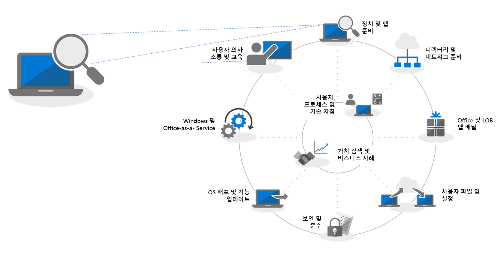
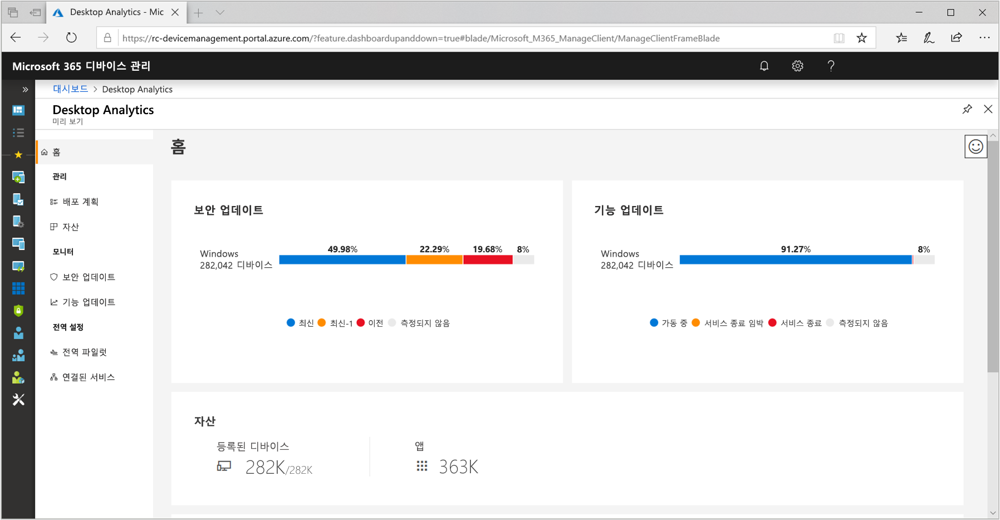
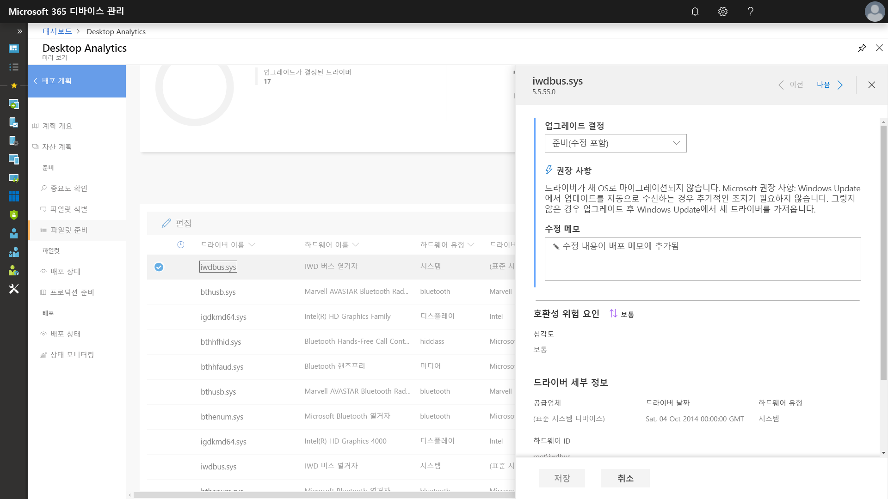
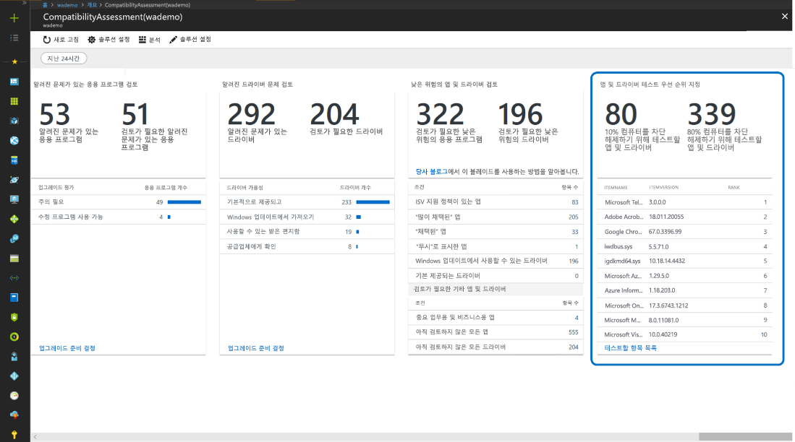
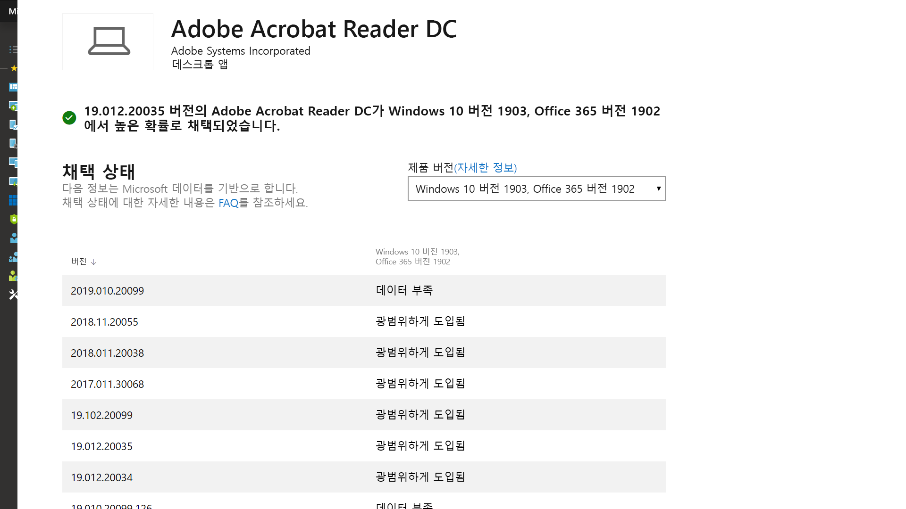
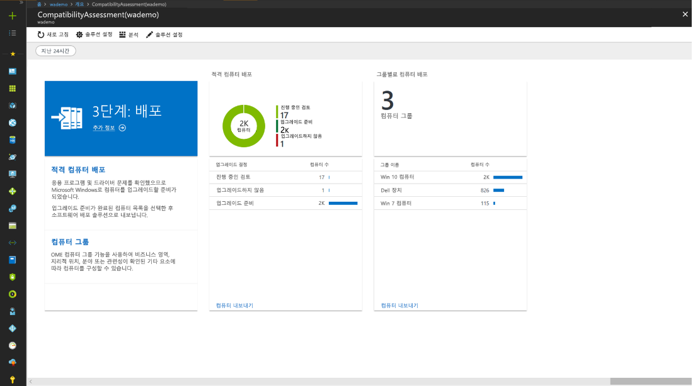

# 1단계: 장치 및 앱 준비

<table>
<thead>
<td></td>
<td>
<strong>1단계: 장치 및 앱 준비</strong>

장치 및 앱의 인벤토리 사용하여 데스크톱 배포 프로젝트를 시작하고, 이동할 항목의 우선 순위를 지정하고, 우선 순위가 지정된 앱 및 장치를 테스트한 후, 배포 준비 완료에 필요한 항목을 수정합니다.
</td>
<td></td>
</thead>
</table>

>[!NOTE]
>장치 및 앱 준비는 응용 프로그램 및 하드웨어 호환성의 전체적인 측면을 점검하는 데 권장되는 배포 프로세스 사이클의 첫 번째 단계입니다. 전체 데스크톱 배포 프로세스를 보려면 [데스크톱 배포 센터](https://aka.ms/HowToShift)를 방문하세요.
>

과거에 사용자의 데스크톱을 업그레이드할 때 발생하는 주요 장애물은 응용 프로그램 및 하드웨어 호환성입니다. Windows 10 및 Office 365 ProPlus로의 전환을 계획할 경우 지난 10년 이내에 작성한 응용 프로그램을 전환할 때만 이점이 있으며, 조직에서 Office 2010 이후의 Office 버전에서 사용한 COM 추가 기능 및 VBA 매크로는 수정 없이도 최신 버전의 Office에서 계속 작동됩니다.

즉, 응용 프로그램의 크기 및 사용 기간에 따라, 응용 프로그램 및 하드웨어 호환성은 권장되는 8단계 배포 프로세스에서 필수적인 초기 단계일 것입니다.

이 문서에서는 Windows 라이선스를 통해 사용할 수 있는 지능형 클라우드 기반 솔루션인 Desktop Analytics를 비롯한 Microsoft 준비 상태 평가 도구를 사용하여 첫 번째 단계인 장치 및 앱 준비를 진행합니다.

## Windows 10 호환성 검사

Windows 10을 배포하기 전에 Windows 7 또는 8 / 8.1을 실행하는 기존 장치의 준비 상태를 확인하는 것이 좋습니다. Windows 10 설치 미디어는 setup.exe에 대한 명령줄 스위치를 지원하여 업그레이드를 실행하지만 실제로 업그레이드를 수행하는 것이 아니라 호환성을 확인하기만 합니다. ScanOnly는 스크립팅 된 배치 파일로 실행되거나 Microsoft Endpoint Configuration Manager 작업 시퀀스에 통합될 수 있습니다. 또한 네트워크에서 직접 ScanOnly를 실행하여 Windows 10 설치 미디어가 로컬 장치로 스트리밍되지 않도록 할 수 있습니다. ScanOnly가 완료되면 Setup.EXE에 의해 생성된 로그 파일의 반환 코드를 통해 결과가 반환됩니다.   

호환성 검색을 자동으로 완료하는 샘플 ScanOnly 명령줄은 아래와 같습니다.

    Setup.EXE /Auto Upgrade /Quiet /NoReboot /Compat ScanOnly

ScanOnly 및 기타 Windows 설치 명령 스위치에 대한 자세한 내용은 [Windows 설치 명령줄 옵션](https://aka.ms/setupswitches)을 참조합니다.

## 권장 도구: Desktop Analytics

Desktop Analytics 기존 데스크톱 관리 시스템에 비해 많은 이점을 제공하는 권장 도구입니다. 이 제품은 에이전트없이 수억 대의 소비자 PC 업그레이드를 통해 수집된 응용 프로그램 및 드라이버 호환성 정보를 사용하여 수행해야 할 작업을 안내합니다. 이 정보는 업그레이드를 가로막을 수 있는 호환성 문제를 식별하고 Microsoft에 알려진 수정 제안에 대한 링크를 통해 자세한 평가를 제공합니다.

Desktop Analytics를 설정하려면 먼저 Azure 구독을 설정하고 Azure Log Analytics 작업 공간을 포함시켜야 합니다. Desktop Analytics 서비스가 실행되면 그룹 정책 설정을 통해 인터넷에 연결된 Windows 7 SP1 또는 최신 장치를 손쉽게 등록할 수 있습니다. 배포 에이전트가 없이, Desktop Analytics의 시각적 워크플로는 파일럿 배포에서 프로덕션 배포로 안내합니다. 원하는 경우 Desktop Analytics에서 Microsoft Endpoint Configuration Manager(현재 분기)와 같은 소프트웨어 배포 도구로 데이터를 내보낼 수 있으므로 PC를 직접 대상으로하고 배포 준비가 된 컬렉션을 구축 할 수 있습니다.

현재, 환경에 대해 Desktop Analytics를 설치하지 않았거나 평가판을 등록하려는 경우 Desktop Analytics 페이지](https://www.aka.ms/desktopanalytics)로 이동한 후 시작할 수 있습니다.

## 장치 및 앱 준비 프로세스

장치 및 앱 준비는 다음 네 단계로 구성됩니다. 1. 인벤토리, 2. 우선 순위 지정, 3. 테스트, 4. 수정. 이들을 각각 차례대로 살펴 보겠습니다.

### 1\. 재고

Desktop Analytics는 에이전트 없는 프로세스를 사용하여 데스크톱 자산 전체에 걸쳐 컴퓨터 및 응용 프로그램에 대한 인벤토리를 파악합니다. 또한 자주 방문한 인터넷 사이트, 응용 프로그램 및 인트라넷 위치에 대한 보고서를 제공하여 나중에 호환성 테스트를 도와줍니다.

### 2\. 우선 순위 지정

인벤토리가 확인되면, Desktop Analytics는 조직에서 가장 일반적으로 사용되는 앱 및 하드웨어, 배포를 위해 가능한 한 많은 PC를 차단 해제할 때 초점을 맞춰야 하는 항목을 식별하고 또한 우선 순위를 부여하는 데 도움을 줍니다.

또한 다음 단계인 테스트 동안 문제를 해결하는 데 필요한 업데이트를 평가하는 데 도움이 되는 지침도 제공합니다.

### 3\. 테스트

인벤토리 된 대부분의 응용 프로그램, 드라이버 및 추가 기능은 있는 그대로 작동합니다. Desktop Analytics에 문제가 있다고 평가할 경우 해당 항목에 대해 호환성 문제를 해결하기 위해 버전 업데이트를 찾을 수있는 위치를 비롯하여 알려진 정보가 제공됩니다. 중요도가 낮고 배포 빈도가 낮은 응용 프로그램 및 구형 장치에서 복잡한 문제를 해결하는 데 시간과 자원을 투입하는 대신 사용자와 협력하여 이러한 항목을 폐기하고 교체할 수 있습니다.

Desktop Analytics를 사용하여 브라우저 기반 호환성 문제를 평가하고 ActiveX 컨트롤, 브라우저 도우미 개체, VBScript 또는 Microsoft Edge 브라우저에서 지원하지 않는 기타 레거시 기술을 사용하는 사용자가 액세스하는 웹 사이트 및 웹 앱을 식별할 수 있습니다. 사용자는 여전히 이러한 사이트에 Internet Explorer 11을 사용해야 하며 엔터프라이즈 모드 사이트 목록 관리자를 사용하여 [엔터프라이즈 모드 사이트 목록](https://docs.microsoft.com/microsoft-edge/deploy/emie-to-improve-compatibility)에 추가할 수 있습니다.

또한 Office 365 ProPlus로의 이전을 지원하기 위해, [Office용 Readiness Toolkit](https://docs.microsoft.com/deployoffice/use-the-readiness-toolkit-to-assess-application-compatibility-for-office-365-pro)을 사용하여 추가 기능 및 Microsoft VBA(Visual Basic for Applications) 매크로의 호환성을 테스트할 수 있습니다.

### 4\. 수정

기기 및 앱 준비의 최종 단계는 '수정'입니다. 여기에서 필요한 소프트웨어 또는 드라이버 패키지를 수집할 수 있습니다. 이러한 항목을 사용하여 배포 프로세스의 일부로 이전 버전을 대체하거나 업데이트하게 됩니다.

목록을 따라 이동하면서 문제를 수정하면 점점 더 많은 PC가 “배포 준비 완료” 상태가 되는 것을 알 수 있습니다. 즉, PC의 드라이버와 앱 둘 다 배포 목표로 지정한 Windows 10 버전과 호환되는 상태가 됩니다.

### 응용 프로그램 우선 순위 지정을 위한 Configuration Manager 소프트웨어 인벤토리

Configuration Manager 소프트웨어 인벤토리는 장치 및 응용 프로그램 준비에 클라우드 기반 분석 솔루션 사용의 대안으로 사용할 수 있습니다. 설치 횟수 및 특정 컴퓨터를 조사하여 호환성 테스트 및 유효성 검사의 우선 순위를 지정하고 패키지 설정을 통해 Windows 10과 호환되는 응용 프로그램 패키지를 설정할 수 있습니다. 이 옵션은 Microsoft의 분석 서비스와 알려진 호환성 정보를 비교하는 기능을 제공하지는 않지만 우선 순위가 지정된 앱들을 더 작은 집합의 대상으로 하는 수동 테스트에 효과적인 솔루션이 될 수 있습니다. 

자세한 내용은 [Configuration Manager의 소프트웨어 인벤토리 소개](https://docs.microsoft.com/configmgr/core/clients/manage/inventory/introduction-to-software-inventory) 및 [Configuration Manager의 패키지 및 프로그램](https://docs.microsoft.com/configmgr/apps/deploy-use/packages-and-programs)에서 응용 프로그램 패키지의 플랫폼 요구 사항 설정을 참조하세요.

## App Assure

Windows 10 및 Office 365 ProPlus 응용 프로그램 호환성을 지원하는 또 다른 도구는 FastTrack Center를 통해 제공되는 [App Assure](https://aka.ms/appassure) 프로그램입니다. 유효한 응용 프로그램 문제가 발생할 경우 App Assure를 통해 Microsoft 엔지니어가 추가 비용없이 사용자와 협력하여 응용 프로그램 비호환성 문제를 해결합니다.

## 진단 데이터 도구의 지속적인 사용

Desktop Analytics는 단지 Windows 10 및 Office 365 ProPlus로의 전환을 도와주기 위한 도구가 아닙니다. Windows 10 및 Office 365에서 데스크톱을 실행하는 경우 이 도구를 사용하여 배포를 유지 관리하고 반기 기능 업데이트를 관리하여 최신 상태를 유지할 수 있습니다.

## 다음 단계 

## [2단계: 디렉터리 및 네트워크 준비](https://aka.ms/mdd2)
