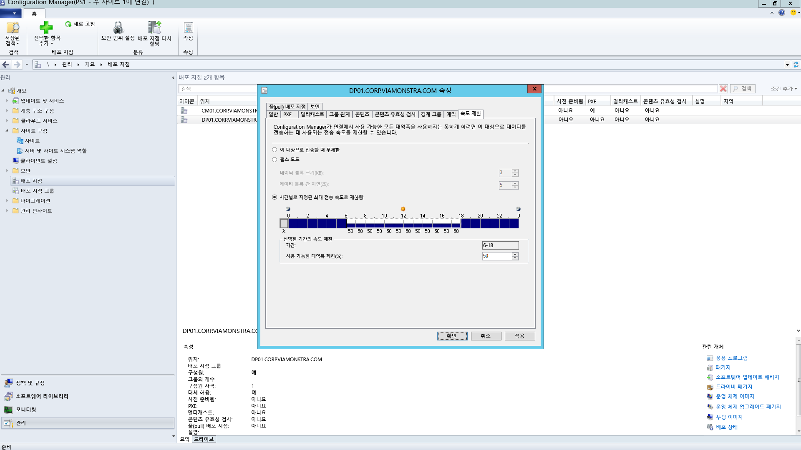
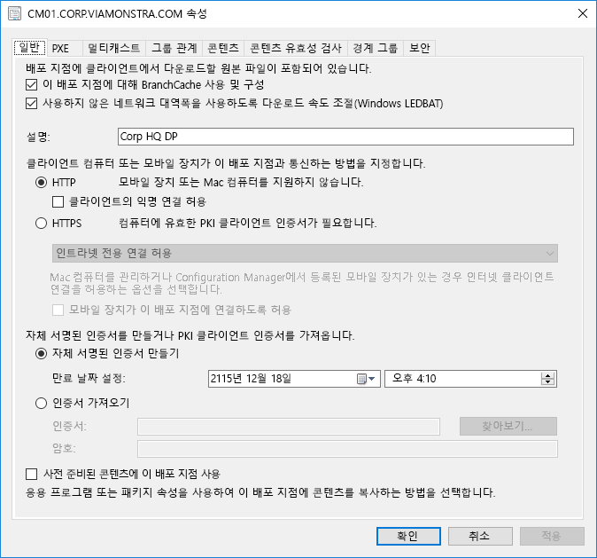
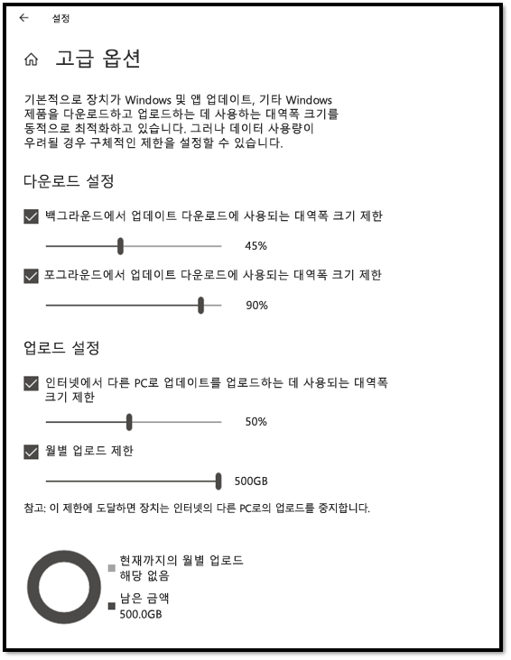
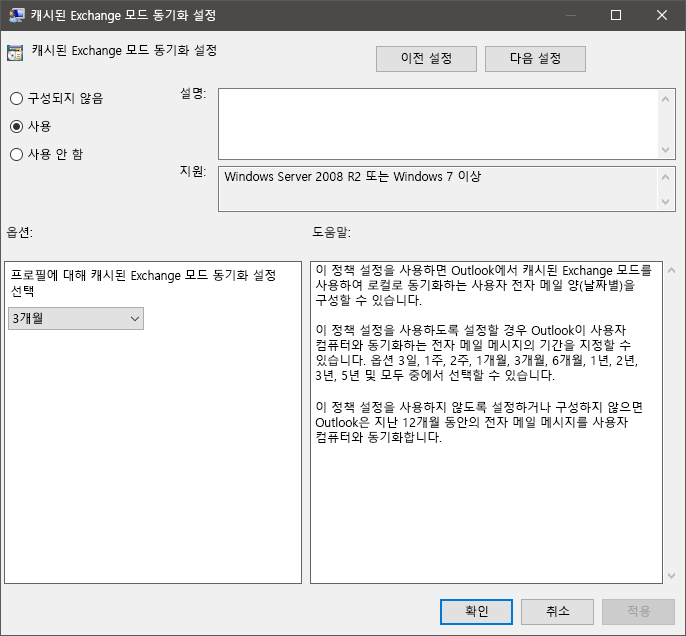
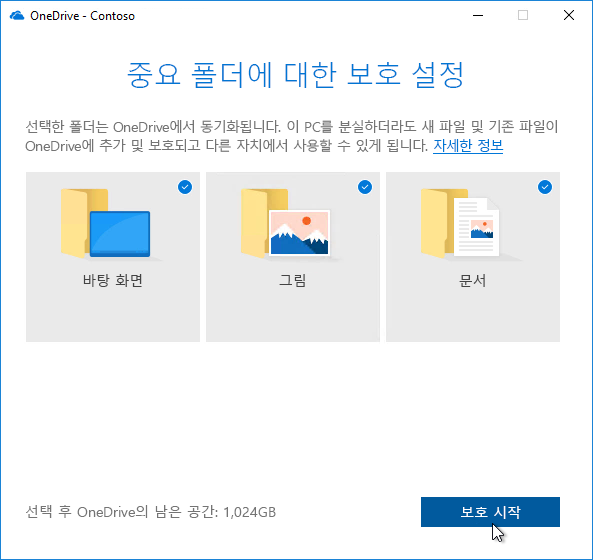

# 2단계: 디렉터리 및 네트워크 준비Step 2: Directory and Network Readiness

디렉터리와 네트워크가 구성되고, Windows 10 및 엔터프라이즈용 Microsoft 365 앱으로의 전원을 지원할 준비가 되었는지 확인합니다. 이를 위해서는 사용자가 Azure Active Directory 서비스를 사용할 수 있게 설정되고, 네트워크에는 일반 트래픽과 방대해질 수 있는 데이터의 이동(예: PC가 업그레이드되거나 사용자 파일, 설정 및 응용 프로그램이 복원되는 경우)을 처리할 수 있는 용량이 준비되어야 합니다.Ensure your directory and the network are configured and ready to support to your shift to Windows 10 and Microsoft 365 Apps for enterprise. This will require Azure Active Directory Services to be in place for users, and your network must have the capacity to handle both its regular traffic and the movement of potentially vast amounts of data as PCs are upgraded, and users’ files, settings and applications are restored.

<table>
<thead>
<td></td>
<td>
<strong>2단계: 디렉터리 및 네트워크 준비</strong><strong>Step 2: Directory and Network Readiness</strong>

엔터프라이즈용 Microsoft 365 앱의 클라우드 연결 서비스와 새로운 배포 옵션(예: Windows Autopilot)에는 Azure Active Directory가 필요합니다. Windows 이미지, 앱, 드라이버 및 관련 파일을 PC로 이동할 때 계획해야 하는 중요한 영역이 바로 네트워크와 연결입니다. 새로운 도구와 배포 옵션으로 네트워크 트래픽을 줄이고 능률화하는 방법을 알아봅니다.Cloud connected services in Microsoft 365 Apps for enterprise and new deployment options like Windows Autopilot require Azure Active Directory. Your network and connectivity are also important areas to plan when moving Windows images, apps, drivers and related files to your PCs. Learn how new tools and deployment options reduce and streamline network traffic.
</td>
<td></td>
</thead>
</table>

>[!NOTE]
>디렉터리 및 네트워크 준비는 Azure Active Directory를 중심으로 네트워크를 최적화하기 위한 권장 배포 프로세스 사이클의 두 번째 단계입니다.Directory and Network Readiness is the second step in our recommended deployment process wheel focusing on Azure Active Directory and optimizing the network. 전체 데스크톱 배포 프로세스를 보려면 [데스크톱 배포 센터](https://aka.ms/HowToShift)를 방문하세요.To see the full desktop deployment process, visit the [Desktop Deployment Center](https://aka.ms/HowToShift).
>

디렉터리 및 네트워크 준비는 원활한 OS 및 데스크톱 배포를 위한 기본 과정입니다. 자동화된 배포와 마찬가지로, 파일 공유에 연결할 수 있어야 하고, 네트워크는 대용량 파일을 한 번에 수백 대 또는 수천 대의 PC로 전송하도록 지원할 수 있어야 합니다.Directory and Network readiness is fundamental to ensuring a smooth OS and desktop deployment. As with any automated deployment, it is important to ensure your file shares can be reached, and your network will need to be able to support the transfer of very large files, possibly to hundreds or even thousands of PCs at a time.

Windows 10 및 엔터프라이즈용 Microsoft 365 앱으로의 전환을 수행할 경우 클라우드 기반 ID를 Azure Active Directory를 통해 설정해야 합니다. 이러한 작업은 엔터프라이즈용 Microsoft 365 앱을 활성화하는 데 중요할 뿐만 아니라, Windows Autopilot과 같은 최신 프로비저닝 솔루션을 활용하는 데도 필요합니다.With your shift to Windows 10 and Microsoft 365 Apps for enterprise you also now need to make sure that cloud-based identity is set up with Azure Active Directory. This is key not only to activating Microsoft 365 Apps for enterprise, it also allows you to take advantage of modern provisioning solutions like Windows Autopilot.

이 문서에서는 Windows 10 및 엔터프라이즈용 Microsoft 365 앱에 배포하기 위해 디렉터리 서비스 및 사용자 및 장치 권한을 준비하기 위한 도구 및 옵션을 알아봅니다.In this article we’ll explore the tools and options to prepare your directory services, and user and device permissions, ready for deployment to Windows 10 and Microsoft 365 Apps for enterprise.

## Azure Active Directory 추가Adding Azure Active Directory

조직이 이미 Office 365, Exchange Online, Microsoft Intune 또는 기타 Microsoft Online 서비스를 사용하는 경우 사용자가 Azure Active Directory를 사용하고 있다면 매우 유용할 수 있습니다.If your organization already uses Office 365, Exchange Online, Microsoft Intune, or other Microsoft Online services, the good news is you are already using Azure Active Directory. 이 기능을 사용하고 있으면 데스크톱 배포의 대상 사용자가 Azure Active Directory에 있고 라이선스가 할당되어 있는지만 확인하면 됩니다.If you are, you just need to ensure that the users you are targeting for desktop deployment are in your Azure Active Directory and that licenses have been assigned.

현재 Azure Active Directory를 사용하고 있지 않으면 [다양한 리소스](https://docs.microsoft.com/azure/active-directory/)의 도움을 받아 설정할 수 있습니다.If you are not currently using Azure Active Directory, there are [numerous resources](https://docs.microsoft.com/azure/active-directory/) to help you set it up. 또한 라이선스의 일부로 제공되는 Microsoft FastTrack을 통해 맞춤형 지원을 받을 수 있습니다.You may well qualify for personalized assistance via Microsoft FastTrack, as part of your license. [여기](https://fasttrack.microsoft.com)에서 Microsoft Fastrack에 대한 자세한 내용을 알아볼 수 있습니다.You can check out more about Microsoft FastTrack [here](https://fasttrack.microsoft.com).

Azure Active Directory가 준비되면 사용자는 엔터프라이즈용 Microsoft 365 앱에 로그인한 후 정품 인증을 수행할 수 있으며, 앱 및 정책의 자동 배포에 Microsoft Intune 또는 Windows Autopilot을 사용할 수 있습니다.Once you have Azure Active Directory in place, your users can sign in to and activate their Microsoft 365 Apps for enterprise apps, and you can use Microsoft Intune or Windows Autopilot deployment for automated deployment of apps and policy.

## 네트워크 준비Network Readiness

배포를 계획할 때 대역폭 요구 사항을 고려해야 합니다.You must consider bandwidth requirements when planning your deployments. 배포에는 네트워크 - PC 이미징, 소프트웨어 업데이트 및 사용자 개인 설정에 영향을 주는 세 가지 기본 구성 요소가 있습니다.There are three main components in a deployment that will have an impact on your network – PC imaging, software updates, and user personalization. 초기 마이그레이션의 경우 PC당 20GB를 초과하게 되지만, 최신 상태를 유지하기 위해서는 PC당 매월 1GB 정도 이상이 필요합니다.Between them, this can mean in excess of 20 GB per PC for the initial migration, and often 1 GB or more per month per PC to stay up-to-date.

먼저 이러한 세 가지 주요 구성 요소 각각에 대한 요구 사항을 살펴보겠습니다.Let’s start by exploring the requirements of each of these three main components:

### PC 이미징PC Imaging

사용자 지정하지 않은 Windows 이미지의 경우, PC당 3GB를 계획해야 하지만, 앱을 포함하는 사용자 지정한 이미지의 경우에는 6GB 이상을 허용해야 할 수 있습니다.For Windows Images with no customization you should plan typically for 3GB per PC, while for customized images with apps you may need to allow 6GB, or more. 드라이버 패키지도 고려해야 할 수 있습니다. 이 패키지는 PC당 수백 메가바이트 정도가 되며 최대 1GB일 수 있습니다.You may also need to consider Driver packages; these can be a few hundred megabytes per PC, sometimes up to 1GB.

### 소프트웨어 업데이트Software Updates

소프트웨어 업데이트를 위해 네트워크 대역폭을 계획해야 합니다.You’ll need to plan network bandwidth for software updates. Windows 10 및 엔터프라이즈용 Microsoft 365 앱은 월별 및 반기 업데이트를 제공하는 새로운 서비스 모델을 사용합니다.Windows 10 and Microsoft 365 Apps for enterprise use a new servicing model delivering monthly and semi-annual updates. 이 모델을 처음 접하는 경우 [여기](https://docs.microsoft.com/windows/deployment/update/waas-overview)에서 작동 방식을 자세히 알아볼 수 있습니다.If you are new to this model, you can learn more about how this works [here](https://docs.microsoft.com/windows/deployment/update/waas-overview).

새로운 서비스 모델에는 1년에 2번 Windows용 기능 업데이트, Office 반기 엔터프라이즈 채널 업데이트 및 월별 품질 업데이트가 포함되어 있습니다. 기능 업데이트는 크기가 일반적으로 2-4GB이고, Office 반기 채널 업데이트는 업데이트당 300-400MB입니다. 그다음에는 월별 품질 업데이트가 있습니다. 이러한 업데이트 크기는 수백 메가바이트에서 1기가바이트 이상까지 다양합니다. 이러한 다양한 크기는 월별 업데이트가 누적되기 때문이며, 각 Windows 10 버전의 서비스 수명 주기 동안 크기가 커지게 됩니다. 따라서 업데이트를 구현하기 위해 네트워크를 통과해야 하는 데이터 양을 줄이는 데 도움이 되는 도구들이 있습니다. 아래에 이러한 도구에 대한 자세한 설명이 나와 있습니다.The new servicing model includes Feature Updates for Windows twice a year, Office Semi-Annual Enterprise Channel Updates, and monthly Quality Updates. Feature Updates are typically 2 – 4GB in size, and Office Semi-Annual Enterprise Channel updates are 300 – 400 MB per update. Then there are the monthly Quality Updates. These may range from a few hundred megabytes to over a gigabyte. This is because monthly updates are cumulative, so these increase in size over the servicing lifetime for each Windows 10 version. That said, there are tools that can help reduce the amount of data that must pass over the network to implement updates. We will cover this in more detail below.

### 사용자 개인 설정User Personalization

고려해야 할 세 번째 구성 요소는 사용자 개인 설정입니다. 여기에 PC 새로 고침 또는 교체 과정의 일부로, 사용자 파일, 해당 설정 및 응용 프로그램의 복원을 고려하여 네트워크 대역폭을 계획해야 합니다. 이러한 항목이 전체적으로 PC당 20GB를 초과하는 경우가 자주 발생합니다. 일부 사용자의 경우 100GB가 넘기도 합니다.The third component to consider is user personalization. Here you need to plan network bandwidth to accommodate the restoring of user files, their settings, and their applications as part of the PC refresh or replacement process. Together, these items often exceed 20 GB per PC; for some users these may exceed 100 GB.

## 대역폭 제한Limiting Bandwidth

배포 관련 트래픽이 네트워크에 미치는 영향을 제한하는 한 가지 방법은 클라이언트에서 BITS(Background Intelligent Transfer Service) 설정을 사용하여 제한하는 것입니다. BITS는 ABR(Adaptive Bit Rate)을 사용하여 배포 목적으로 사용할 수 있는 대역폭을 조정합니다. 이러한 BITS는 그룹 정책을 사용하여 클라이언트에서 구성할 수 있습니다.One way to limit the impact of deployment-related traffic on the network is to throttle it using the BITS (Background Intelligent Transfer Service) setting on clients. BITS uses an Adaptive Bit Rate (ABR) to adjust bandwidth available for deployment purposes; it can be configured on clients using Group Policy.

[BITS 정보About BITS](https://docs.microsoft.com/windows/desktop/bits/about-bits)

Microsoft Endpoint Configuration Manager(현재 분기)를 사용하는 경우 BITS 지원 배포 지점을 구성하거나 WDS를 통해 멀티캐스트를 사용하도록 설정할 수도 있습니다.If you use Microsoft Endpoint Configuration Manager (Current Branch), you can also configure BITS-enabled Distribution Points or enable multicast with WDS.

특정 트래픽을 제한할 경우 정상적인 네트워크 트래픽이 PC의 업데이트 및 응용 프로그램 다운로드에 따른 영향을 덜 받게 됩니다. 그렇지만 이러한 작업을 위해 특정 비율의 대역폭을 분할하면 생산성이 Windows 또는 Office 배포의 영향을 받지 않으며, 프로세스는 필요에 따라 계속 실행될 수 있습니다. 또한 배포가 실행되는 동안 사용자가 해당 PC를 잠그면 배포 관련 가동 중지 시간이 줄어들 수 있습니다.Throttling specific traffic means that normal network traffic is less impacted by PCs downloading updates and applications. But carving out a certain percentage of bandwidth for these tasks helps ensure productivity isn’t impacted by Windows or Office deployment and processes continue to run as needed, it can worsen deployment-related downtime, with users locked out of their PCs while a deployment runs.

다행히 사용자가 대규모 데스크톱 배포가 네트워크에 미치는 영향을 보다 쉽게 관리하도록 하는 새로운 도구들이 있습니다. 사용 가능한 대역폭의 사용을 최적화하는 LEDBAT, 배포 트래픽을 네트워크 중심에서 주변 네트워크로 이동하기 위한 P2P(피어 투 피어) 옵션이 여기에 해당됩니다.Fortunately, there are new tools to make it easier for you to manage the network impact of a large-scale desktop deployment, including LEDBAT to optimize use of available bandwidth, and peer-to-peer (P2P) options to move deployment traffic away from the center of the network and out to the perimeter

## 대역폭 청소Scavenging Bandwidth

Windows Server 2019 및 Microsoft Endpoint Configuration Manager(현재 분기)에서 지원되는 LEDBAT(Low Extra Delay Background Transport)는 Windows 클라이언트에 대한 네트워크 트래픽을 최적화되도록 디자인되었습니다.Low Extra Delay Background Transport (LEDBAT), supported in Windows Server 2019 and Microsoft Endpoint Configuration Manager (Current Branch), is designed to optimize network traffic to Windows clients.

[Windows Server 2019의 상위 10가지 네트워킹 기능: \#9 LEDBAT – 대기 시간 최적화 백그라운드 전송Top 10 Networking Features in Windows Server 2019: \#9 LEDBAT – Latency Optimized Background Transport](https://blogs.technet.microsoft.com/networking/2018/07/25/ledbat/)

기존 제한과 달리, LEDBAT는 사용 가능한 모든 네트워크 대역폭을 백그라운드 작업으로 사용할 수 있으며, 다른 트래픽이 요청할 때 대역폭을 즉시 양보할 수 있습니다. BITS와 달리 지연도 발생하지 않습니다. 모든 작업은 자동으로 진행되므로 수동 조정이나 일정 관리가 필요하지 않으며, 모든 설치가 서버 쪽에서 진행됩니다. 따라서 성능이 크게 향상될 수 있습니다.Unlike traditional throttling, LEDBAT can use all available network bandwidth as a background task, instantly yielding bandwidth when other traffic requests it. Unlike BITS there is no delay; everything is automated – no manual tuning or scheduling required, and everything is setup server side. This affords potentially massive performance gains.

## 피어 투 피어 옵션Peer-to-Peer options

피어 투 피어 옵션은 Windows 10 마이그레이션의 PC 이미징, 소프트웨어 업데이트 및 사용자 개인 설정에서 점점 더 많이 사용되고 있습니다. 초기 Windows 10 배포 후의 빌드 간 업그레이드를 용이하게 진행하는 데도 도움이 됩니다. 여기서는 Windows 10 및 Office 관련 트래픽을 네트워크 중심에서 멀리 이동하여 클래식 제한 방법의 필요성을 줄이고, PC가 필요한 업데이트 파일을 배포 지점이나 인터넷에서 다운로드하지 않고, 로컬 네트워크의 피어에서 찾을 수 있도록 하는 데 도움이 되는 몇 가지 예제를 살펴보겠습니다.Peer-to-Peer options are increasingly being used in Windows 10 migrations, for PC imaging, software updates and user personalization. They are also valuable in facilitating build-to-build upgrades after your initial Windows 10 deployment. Here we will cover several examples to help move Windows 10 and Office-related traffic away from the center of the network, reducing the need for classic throttling approaches, and allowing PCs to find the update files they need on peers in their local network rather than downloading them from a distribution point or the internet.

**BranchCache**는 네트워크를 포화 상태로 만들지 않고 분산 환경에서 콘텐츠를 다운로드하는 데 도움이 됩니다. 이 기능은 두 가지 옵션으로 제공됩니다. 하나는 로컬 서버를 사용하여 콘텐츠를 캐시할 수 있는 호스트 캐시 모드이고, 다른 하나는 클라이언트가 이미 다운로드한 코텐츠를 서로 공유할 수 있도록 하는 분산 캐시 모드(Configuration Manager에서 지원되는 모드)입니다.**BranchCache** can help you download content in distributed environments without saturating the network. It comes in two options: Hosted Cache Mode, which lets you use local servers to cache content, and Distributed Cache Mode (a mode supported in Configuration Manager), which lets clients share already downloaded content with each other.

Configuration Manager에서 지원되는 **피어 캐시** 클라이언트 또한 피어 캐시를 활용할 수 있습니다.**Peer Cache** Clients supported by Configuration Manager can also make use of Peer Cache. 이 기능을 통해 네트워크에서 안정적으로 사용할 수 있는 PC가 콘텐츠 배포를 위해 소스를 호스트할 수 있습니다.This allows PCs that are reliably available on the network to host source for content distribution. 이 기능을 모든 PC에서 사용하도록 설정하지 않고, 안정적인 네트워크 연결이 있는 디바이스만 호스트로 지정할 수 있습니다(예: 데스크톱, 미니 타워 또는 타워형 PC).You won’t want to enable this all of your PCs – only target devices with reliable network connections as hosts (e.g. desktop, mini-tower, or tower PCs). 피어 캐시는 설치 동안 Windows PE 단계에서 실행되는 배포 작업에도 적절할 수 있습니다.Peer Cache can even work for deployment tasks running in Windows PE phases during setup.

참고: BranchCache 및 피어 캐시는 보조 기능이며 동일한 환경에서 함께 사용할 수 있습니다.Note: BranchCache and Peer Cache are complementary and can work together in the same environment.

[BranchCache 및 피어 캐시BranchCache vs. Peer Cache](https://blogs.technet.microsoft.com/swisspfe/2018/01/25/branch-cache-vs-peer-cache/)

**배달 최적화** 배달 최적화는 다른 피어 투 피어 캐싱 기술로, 배포를 위한 네트워크 기반 컨트롤을 제공합니다.**Delivery Optimization** Delivery Optimization is another peer-to-peer caching technology, providing network-based controls for deployments. 기본 제공 UWP 앱을 업데이트하고, Microsoft Store에서 애플리케이션을 설치하고, Express 업데이트를 사용한 소프트웨어 업데이트를 위한 Windows 10 배달 최적화.Windows 10 Delivery Optimization to update built-in UWP apps, also to install applications from the Microsoft Store, and for software updates using Express Updates. 이 기능은 최근에 이르러서야 Microsoft Endpoint Configuration Manager(현재 분기)와 통합되었지만 초기 버전의 Windows 10 이후부터 사용할 수 있었습니다.It has been available since early versions of Windows 10, though it has only recently integrated with Microsoft Endpoint Configuration Manager (Current Branch). Windows 10 버전 1803의 새 구성 옵션부터, Store에서의 앱 설치와 같은 백그라운드 업데이트 및 포그라운드 작업을 위해 대역폭 제한을 별도로 설정할 수 있습니다.Since Windows 10 version 1803 new configuration options mean you can now independently set bandwidth limits for background updates and foreground jobs such as an app install from the Store. 이제 Windows 배달 최적화는 지원되는 모든 클라이언트 업데이트 채널에서 사용할 수 있는 클라이언트 업데이트 동안 엔터프라이즈용 Microsoft 365 앱도 지원합니다.Windows Delivery Optimization now also supports Microsoft 365 Apps for enterprise during client updates, available in all supported client update channels. 클라이언트 초기 설치 동안의 Windows 배달 최적화 지원도 곧 제공될 예정입니다.Support for Windows Delivery Optimization during client initial installation will be coming soon.  

**엔터프라이즈용 Microsoft 365 앱을 위한 추가 고려사항****Additional Considerations for Microsoft 365 Apps for enterprise**

배달 최적화 지원 외에, 엔터프라이즈용 Microsoft 365 앱 배포로 인한 네트워크 부하를 줄이는 데 도움이 되는 3가지 항목은 다음과 같습니다.In addition to leveraging Delivery Optimization, here are three items that will help reduce your network load due to Microsoft 365 Apps for enterprise deployments.

**이진 델타 압축** 엔터프라이즈용 Microsoft 365 앱은 Office 365 ProPlus의 최신 릴리스에서 다음 릴리스로 업데이트할 때 소프트웨어 업데이트가 사용하는 대역폭을 줄이기 위해 이진 델타 압축을 사용합니다. 이전 릴리스에서 이진 수준 변경 내용만 가져오므로 누적 업데이트의 월별 증가에 따른 영향이 최소화됩니다. 이로 인해 매월 PC 1대당 수백 메가바이트의 데이터가 감소될 수 있습니다. 그렇지만 이러한 기능을 사용하기 위해서는 릴리스를 건너뛰면 안 됩니다. 릴리스를 건너뛰게 되면 전체 누적 업데이트를 다운로드해야 합니다.**Binary Delta Compression** Microsoft 365 Apps for enterprise uses Binary Delta Compression to reduce bandwidth consumed by software updates when updating from the most recent release of Microsoft 365 Apps for enterprise to the next release. By only pulling the binary level changes from the previous release, the impact from month-over-month growth of cumulative updates is minimized. This has the potential of saving several hundred megabytes of data, per PC, each month. In order to use this capability though, you cannot skip releases. If you do, then the full cumulative update must be downloaded.

[Microsoft 365 앱에 대한 업데이트를 다운로드하는 중Downloading Updates for Microsoft 365 Apps](https://docs.microsoft.com/deployoffice/overview-update-process-microsoft-365-apps#download-the-updates-for-microsoft-365-apps)

**Outlook 데이터 파일**: 오프라인 사용을 위해 사용자의 전체 사서함을 로컬로 캐시하도록 Outlook을 구성하는 경우가 많습니다.**Outlook Data Files** Outlook is often configured to cache users’ entire mailbox locally for use offline. 현재 위치 업그레이드를 제외하고 모든 Windows 배포에서 사용자의 Outlook 데이터 파일은 업그레이드 후에 자체적으로 다시 작성되어야 합니다.In any Windows deployment, except an in-place upgrade, that requires the users’ Outlook Data Files to rebuild themselves after the upgrade. 이것은 자동화된 프로세스이지만, 일반적으로 Outlook 사서함 제한을 최대 100GB로 설정한 상태에서 모든 사용자에 대해 로컬로 전체 사서함을 다시 캐시하면 많은 데이터가 전송됩니다.This is an automated process, but with Outlook mailbox limits typically set to up to 100GB, re-caching the entire mailbox locally for all users means a lot of data transfer. 네트워크 부하를 줄이기 위해 그룹 정책을 사용하여 "오프라인으로 유지할 메일" 설정을 줄이는 것이 바람직할 수 있습니다.To reduce the network load you may want to consider using Group Policy to reduce the “Mail to keep offline” setting. 엔터프라이즈용 Microsoft 365 앱 또는 Office 2016에서 Outlook의 기본값은 12개월로 설정됩니다.In Microsoft 365 Apps for enterprise or Office 2016 the default value for Outlook is set to 12 months. 네트워크에 미치는 영향을 줄이려면 오프라인 캐시를 1~6개월 정도 유지하도록 설정하는 것이 좋습니다.In order to reduce network impact consider setting the offline cache to last between 1 to 6 months. 이 설정을 변경해도 온라인 사서함의 크기에는 영향을 주지 않으며, 온라인 상태에서 Outlook을 통해 전체 사서함을 계속 검색할 수 있습니다.Changing this setting does not affect the size of the online mailbox, and the entire mailbox can still be searched via Outlook when online.

**요청 시 OneDrive 파일 및 알려진 폴더 이동** OneDrive는 PC 및 클라우드의 다른 디바이스에 있는 사용자 파일을 동기화하고 보호하는 유용한 방법입니다.**OneDrive Files on Demand and Known Folder Move** OneDrive is a great way to synchronize and protect user files from PCs and other devices in the cloud. 알려진 폴더 이동 기능을 사용하면 사용자의 바탕 화면, 문서 및 그림 폴더에서 OneDrive로 파일을 동기화하여 새 디바이스나 이미지로 다시 설치한 PC에 로그인할 때 해당 파일을 사용하도록 할 수 있습니다.With Known Folder Move, you can enforce file sync from a user’s Desktop, Documents, and Pictures folders to OneDrive making those files available when signing into a new device a or reimaged PC. 바탕 화면, 문서 및 그림 위치에 보관된 파일의 순수한 크기 및 개수 때문에, PC에서 OneDrive를 사용하고 적용하는 정책을 롤아웃하여 보다 계획적으로 작업하려고 할 수 있습니다.Remember though, due to the sheer size and number of files kept in Desktop, Documents, and Pictures locations, you’ll want to be planful with the rollout of policies enabling and enforcing OneDrive on your PCs. 한 가지 옵션은 그룹 정책 네트워크 컨트롤을 사용하여 OneDrive 동기화 서비스에서 사용되는 대역폭을 제한하는 것입니다.One option is to use Group Policy Network controls to throttle bandwidth used by the OneDrive sync service.

[알려진 폴더 이동 설정Setup Known Folder Move](https://techcommunity.microsoft.com/t5/Microsoft-OneDrive-Blog/Migrate-Your-Files-to-OneDrive-Easily-with-Known-Folder-Move/ba-p/207076)

[OneDrive Files on DemandOneDrive Files on Demand](https://www.microsoft.com/microsoft-365/blog/2017/05/11/introducing-onedrive-files-on-demand-and-additional-features-making-it-easier-to-access-and-share-files/)

OneDrive를 아직 롤아웃하지 않은 경우 Windows 7에서 Windows 10으로 전환하는 것은 OneDrive를 사용하고 엔터프라이즈용 Microsoft 365 앱을 원활하게 통합할 수 있는 완벽한 기회가 될 수 있습니다.If you haven’t already rolled out OneDrive, the shift from Windows 7 to Windows 10 is a perfect opportunity to enable OneDrive and it integrates seamlessly Microsoft 365 Apps for enterprise. 앱 및 디바이스 준비를 진행하면서 이러한 롤아웃을 시작하는 것이 좋습니다.Consider starting this roll-out while working through your app and device readiness. 이렇게 하면 Windows 이미지를 이동하고 네트워크를 통해 앱을 배포하기 전에 파일 동기화를 먼저 시작할 수 있습니다.This will give file sync a head start before you start moving Windows images and deploying apps over your network.

## 다음 단계Next Step 

## [3단계: Office 및 LOB 앱 배달Step 3: Office and LOB App Delivery](https://aka.ms/mdd3)

## 이전 단계:Previous Step:

## [1단계: 장치 및 앱 준비Step 1: Device and App Readiness](https://aka.ms/mdd1)

## 사용자 의견Feedback

Microsoft는 사용자의 의견을 환영합니다. 제공하려는 의견 유형을 선택하세요.We'd love to hear your thoughts. Choose the type you'd like to provide:

설명서에 대한 사용자 의견을 제공하기 위한 제품 피드백 로그인Product feedback Sign in to give documentation feedback

새 피드백 시스템은 GitHub 문제를 기준으로 합니다. Microsoft 블로그 게시물에서 이러한 변경에 대해 알아보세요.Our new feedback system is built on GitHub Issues. Read about this change in our blog post.
