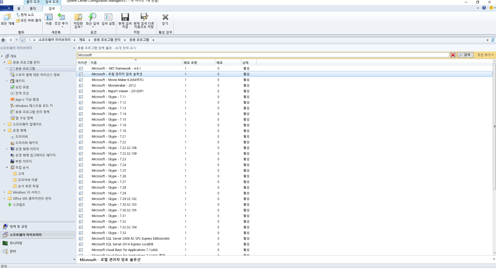
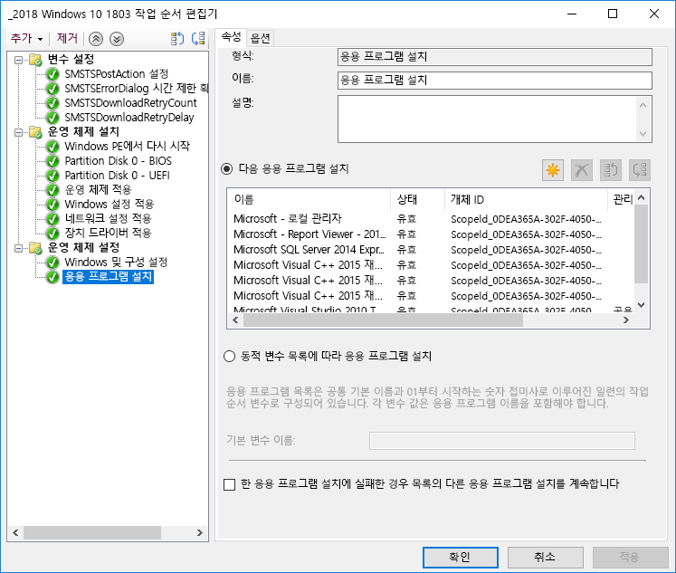
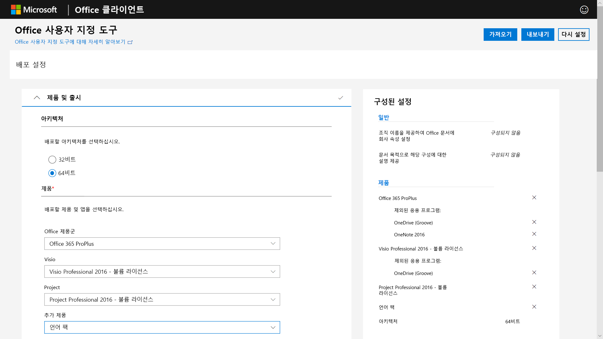
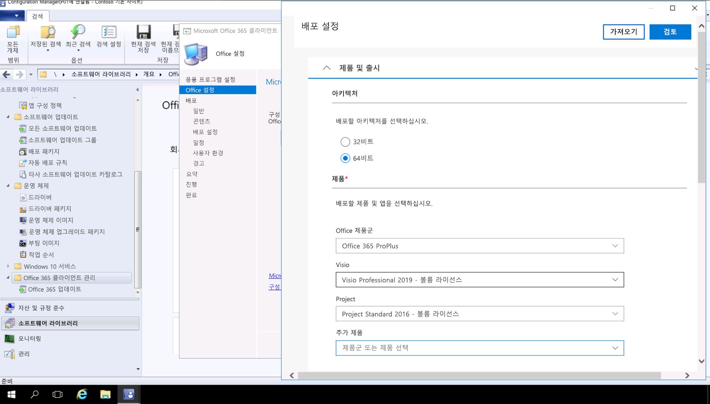

# 3단계: Office 및 LOB 앱 배달

<table>
<thead>
<td></td>
<td>
<strong>3단계: Office 및 LOB 앱 배달</strong>

앱이 패키지되고 자동 방식으로 설치할 준비가 되었는지 확인합니다. Office 365 ProPlus가 포함된 간편 실행 패키지에 어떻게 Office 앱을 구성하고, 전달하고, 최신 상태로 유지하는 새 옵션이 포함되어 있는지 알아봅니다.
</td>
<td></td>
</thead>
</table>

>[!NOTE]
>Office 및 LOB 앱 배달은 Office 및 LOB를 설치 및 관리하는 옵션을 포함하는 권장 배포 프로세스 사이클의 세 번째 단계입니다. 성공적인 배포를 위해서는 처음 두 단계를 건너뛰지 마세요.  전체 데스크톱 배포 프로세스를 보려면 [데스크톱 배포 센터](https://aka.ms/HowToShift)를 방문하세요.
>

이제 Office 및 LOB(기간 업무) 앱을 전달할 준비가 되었으며 이 작업을 수행하는 방법은 다양하며 이중에는 몇 가지 흥미로운 새 옵션도 포함되어 있습니다. 일부 애플리케이션은 32비트 또는 64비트 컴파일된 버전으로 사용할 수 있지만, Office 365 ProPlus 등의 다른 애플리케이션은 32비트 및 64비트 기본 컴파일된 버전을 모두 제공하므로, 배포할 버전을 결정하는 것이 가장 중요합니다. 새 디바이스에서 추가 컴퓨팅 성능 및 RAM을 활용하려면 32비트 종속성이 없는 경우 64비트 버전을 사용하는 것이 좋습니다. 추가 기능 또는 파일 관련 호환성 문제를 파악하려면 계속하기 전에 1단계 디바이스 및 앱 준비를 다시 검토하는 것이 바람직할 수 있습니다.

방해 요인이 없는 경우 Microsoft Office를 비롯한 모든 앱을 64비트 버전으로 배포하는 것이 좋습니다. 64비트 네이티브 컴파일 앱은 최상의 성능을 제공하며 향후에도 사용할 수 있는 옵션입니다.

Windows에 앱을 설치하는 데 사용할 수 있는 여러 방법과 모델이 있으며 전달 옵션을 살펴보겠습니다.

[Windows 10 응용 프로그램 관리](https://docs.microsoft.com/windows/application-management/)

## MSI 기반 배포

LOB(기간 업무) 앱의 경우 MSI 기반 패키지 또는 실행 파일을 사용하고, 앱을 OS 배포 작업 시퀀스의 일부로 설치하게 됩니다. Windows 10은 이러한 패키지에서 계속 작동합니다.

Microsoft Endpoint Configuration Manager 및 Microsoft Intune 등의 소프트웨어 배포 도구 또한 MSI 패키징 앱을 전달하도록 최적화됩니다. Windows 10에서 앱의 유효성을 검사하고 나면, 앱 전달을 위해 Microsoft Endpoint Configuration Manager(현재 분기)를 사용할 수 있습니다. Microsoft Intune에서 회사 포털을 사용하는 경우 조직에서 사용할 수 있는 IT 승인 앱의 선택 범위를 최신 응용 프로그램을 포함하도록 확장할 수 있으며 사용자가 필요한 항목을 자체 선택하도록 할 수 있습니다.

## PC 이미징

다른 인기 있는 앱 전달 방법은 PC 이미징입니다. 이 경우 애플리케이션은 샘플 PC에 작업 시퀀스를 통해 또는 수동으로 설치된 다음, 필수 애플리케이션이 미리 설치된 상태로 시스템 이미지가 캡처됩니다. 이미징을 통한 빌드 및 캡처 방법은 새 PC를 프로비저닝할 때 시간을 절약할 수 있지만, 이미지 내의 운영 체제 및 앱이 빠르게 구형이 될 수 있습니다. Windows 10 및 Office 365 ProPlus의 누적 업데이트 모델은 이 문제를 해결하는 데 도움이 되지만 완전히 해소하지는 못 합니다. 따라서 배포 시에 애플리케이션을 이미지 외부에서 설치하는 씬 이미지 접근 방법을 권장하는 것입니다.

Office 365 ProPlus를 이미지에 포함하지 않으려는 경우 이 기능이 사용자 기반 활성화라는 점을 기억하도록 합니다. 즉, 시스템 관리자가 미리 활성화할 수 없습니다. Office 배포 도구를 사용하여 이미징하는 장치에 Office를 미리 설치하고 사용자 로그인을 건너뜁니다. 이미지가 배포되면 최종 사용자는 Office 365 자격 증명을 사용하여 로그인하고 Office 365 ProPlus를 활성화할 수 있습니다.

[운영 체제를 설치하는 작업 시퀀스 만들기](https://docs.microsoft.com/configmgr/osd/deploy-use/create-a-task-sequence-to-install-an-operating-system)

[운영 체제 이미지의 일부로 Office 365 ProPlus 배포](https://docs.microsoft.com/deployoffice/deploy-office-365-proplus-as-part-of-an-operating-system-image)

## Office 간편 실행 

Office 365 ProPlus는 간편 실행을 사용하여 설치되고, 간편 실행은 예정된 Windows용 Office 2019 릴리스의 모든 버전에 포함된 MSI 기반 패키징을 대신합니다. 이 기능은 더 빠른 설치, 빠르고 효율적인 업데이트, 보다 깔끔한 제거를 비롯한 다양한 이점을 제공합니다. 

간편 실행을 통해 전달되는 프로그램은 컴퓨터의 가상 애플리케이션 환경에서 실행되며, 다른 애플리케이션과 함께 충돌 없이 공존합니다. 또한 MSI 기반 패키지의 경우보다 약 1/2의 디스크 공간을 사용합니다. Office 애플리케이션은 Office 앱을 다운로드, 구성 및 사용자 지정하는 데 필요한 Office 설치 엔진인 [Office 배포 도구](https://www.microsoft.com/download/details.aspx?id=49117)를 통해 배달되고 관리됩니다. Office 배포 도구는 Office 설치를 구성 및 사용자 지정하는 방법에 대한 메타데이터 지침을 제공하는 구성 XML 파일을 읽습니다.

[Office 사용자 지정 도구](https://config.office.com/)를 사용하여 배포 설정을 사용자 지정하고 구성 XML 파일을 만드는 것이 좋습니다. Office 사용자 지정 도구를 통해 설치할 애플리케이션 및 언어, 애플리케이션 업데이트 방법, 애플리케이션 기본 설정 및 설치 환경 설정을 지정할 수 있습니다.

Configuration Manager를 사용하는 경우 Office 365 ProPlus의 브로드 배포에도 사용할 수 있습니다. Configuration Manager(현재 분기)는 업데이트된 Office 사용자 지정 도구에 대한 네티이브 지원, 간편 실행을 위한 설치 시 패키지 사용자 지정, 설치 후 소프트웨어 업데이트 관리에 대한 네이티브 지원도 제공합니다.

[Office 365 ProPlus 배포 가이드](https://docs.microsoft.com/deployoffice/deployment-guide-for-office-365-proplus)

[Office 365 ProPlus로 업그레이드하는 경우 기존 MSI 버전의 Office 제거](https://docs.microsoft.com/deployoffice/upgrade-from-msi-version)

[Configuration Manager를 사용하여 Office 365 ProPlus 관리](https://docs.microsoft.com/configmgr/sum/deploy-use/manage-office-365-proplus-updates)

[Microsoft Intune을 사용하여 Office 365 앱을 Windows 10 장치에 할당](https://docs.microsoft.com/intune/apps-add-office365)

## 브라우저 기반 앱

브라우저 기반 응용 프로그램이 예상대로 계속 작동하도록 하기 위해 고려해야 할 몇 가지 사항이 있습니다. Microsoft Edge와의 호환성 문제가 알려져 있는 특정 웹 사이트 및 앱이 있는 경우 해당 웹 사이트가 자동으로 Internet Explorer 11을 사용하여 열리도록 Enterprise Mode 사이트 목록을 사용할 수 있습니다.

또한 인트라넷 사이트가 Microsoft Edge에서 제대로 작동하지 않는 것으로 확인될 경우 모든 인트라넷 사이트가 자동으로 Internet Explorer 11을 사용하여 열리도록 설정할 수 있습니다. 이 프로세스는 XML 파일을 사용하여 각 사이트에 IE11이 사용되는지 여부를 제어하며 그룹 정책을 사용하여 설정을 적용합니다.

[엔터프라이즈 모드란?](https://docs.microsoft.com/internet-explorer/ie11-deploy-guide/what-is-enterprise-mode#what-is-enterprise-mode)

지금까지 잘 알려진 배포 방법을 살펴보았습니다. 하지만 고려할 수 있는 두 가지가 새로운 앱 배포 방법이 있습니다.

## 비즈니스용 Microsoft Store 

비즈니스용 Microsoft Store는 무료 및 유료 앱을 검색하고 획득하고 관리하고 대규모로 Windows 10 디바이스에 배포하는 유연한 방법을 제공합니다. IT 관리자는 필요에 따라 라이선스를 할당 및 재사용하면서 선택한 Microsoft Store 앱을 사용자 지정 고유 앱과 함께 사용자의 개인 저장소에 게시할 수 있습니다. 사용자는 이 저장소로만 이동되므로 승인된 앱만 찾아서 설치할 수 있습니다.

스토어 앱은 기본적으로 UWP 앱으로 빌드될 수 있고, 데스크톱 브리지를 사용하여 기존 앱을 스토어용으로 다시 패키지한 후 Windows 10용 최신 환경을 추가할 수 있습니다. Windows 10 환경을 향상시키는 데 사용하는 코드 외에는 앱은 변경되지 않은 상태를 유지하며, 전체 신뢰 사용자 모드에서 계속 실행됩니다.

## MSIX 컨테이너화

애플리케이션 패키지를 위한 새 옵션은 MSIX입니다. MSIX에서는 Windows에서 사용할 수 있는 컨테이너화 기술을 사용하여 간편 실행, UWP 및 MSI 패키징에 포함된 최상의 기능을 제공합니다. MSIX 컨테이너화는 EXE, MSI, APPV 및 APPX와 같은 기존 설치 관리자를 MSIX로 직접 마이그레이션하는 도구를 사용하여 오늘날 사용되는 많은 설치 기술을 포함하는 통합 경로를 제공합니다. MSIX 지원은 현재 버전의 Windows에 포함되어 있습니다. Windows 10 RS5 이상을 실행하는 디바이스에는 MSIX 패키징 앱을 설치 및 실행하는 데 필요한 모든 항목이 있습니다. Windows 10은 애플리케이션을 운영 체제와는 별도로 유지하면서 수신하는 MSIX 컨테이너를 동적으로 통합합니다.

컨테이너화는 시스템에서 항목을 남겨둘 수 있는 오늘날의 많은 MSI 및 EXE 기반 패키지와 달리, 패키지를 완전히 제거함을 의미합니다. 또한 응용 프로그램을 설치하기 위해 표준 사용자 자격 증명만 있으면 되며, MSIX 컨테이너를 설치하기 위해 관리자 자격 증명이 필요하지 않습니다. MSIX 컨테이너는 업데이트하는 데도 좀 더 효율적입니다. 업데이트가 게시될 때 블록 수준의 차이를 사용하여 새로운 이진 파일만 적용되므로 업데이트 페이로드가 감소하며, 더 적은 네트워크 대역폭을 사용하면서 배포는 더 빨라집니다.

[MSIX 기술 커뮤니티 사이트](https://techcommunity.microsoft.com/t5/MSIX/ct-p/MSIX)를 통해 MSIX에 대한 추가 정보를 확인할 수 있습니다.

## 다음 단계

## [4단계: 사용자 파일 및 설정](https://aka.ms/mdd4)

## 이전 단계

## [2단계: 디렉터리 및 네트워크 준비](https://aka.ms/mdd2) 
