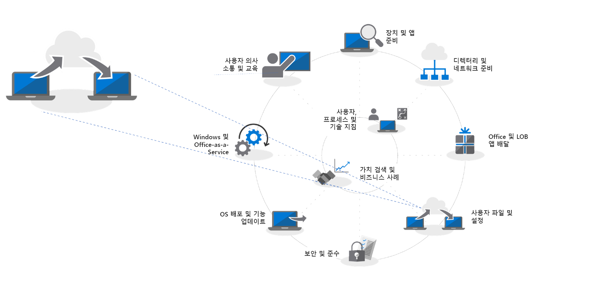

# 4단계: 사용자 파일 및 설정

사용자의 파일 및 설정을 새 PC 또는 업그레이드 된 PC로 이동하는 것은 중요한 프로세스이며, 당연히 성공적으로 진행해야 합니다. 각 PC를 수동으로 마이그레이션하거나 프로세스를 자동화하는 여러 방법 중 하나를 선택합니다. 어떤 마이그레이션 방법을 선택하든 사용자의 파일 전송, 설정값, Windows 10 시작 및 작업 표시줄 레이아웃 관리 등 세 가지 주요 고려 사항을 해결해야 합니다.

<table>
<thead>
<td></td>
<td>
<strong>4단계: 사용자 파일 및 설정</strong>

PC를 업그레이드하거나 교체하는 경우, 사용자 상태 백업 및 복원을 자동화하여 시간을 절약할 수 있습니다. 클라우드 파일 동기화에 대한 새 옵션을 사용하면 새로운 Windows 설치에서 파일에 원활하게 액세스할 수 있도록 바탕 화면, 문서 및 그림 폴더를 사용자 기준으로 OneDrive와 동기화할 수 있습니다.
</td>
<td></td>
</thead>
</table>

>[!NOTE]
>이전에 사용했던 마이그레이션 프로세스를 계속 사용할 수 있지만 Office 365 ProPlus로 전환되면서, OneDrive의 ‘알려진 폴더 이동'(아래 참조)을 사용할 것을 권장합니다. 전체 데스크톱 배포 프로세스를 보려면 [데스크톱 배포 센터](https://aka.ms/HowToShift)를 방문하세요.
>

대규모 배포의 가장 어렵고 자주 발생하는 수동 작업 중 하나는 사용자 파일 및 설정을 이전하는 것입니다. 이 문서에서는 새 PC, 업그레이드한 PC 및 이미지로 다시 설치한 PC로 사용자를 마이그레이션하는 데 사용할 수 있는 옵션을 설명합니다.

## 수동 마이그레이션

새 PC 또는 새 버전의 Windows로 전환할 때 유지할 항목을 결정할 경우 모든 항목을 유지하려는 사용자도 있고, 드라이브를 정리할 기회로 삼으려는 사용자도 있을 것입니다. 따라서 일부 IT 부서에서는 사용자 파일 마이그레이션을 수동으로 처리하기로 선택하며, 지원 팀이 사용자를 방문하도록 하거나, 사용자가 지원 팀에게 PC를 가져올 수 있도록 지원 센터를 구축하기도 합니다. 어떤 경우든 사용자는 이전할 항목과 삭제할 항목을 결정하는 데 참여할 수 있습니다.

조직에서 이러한 결정을 옵션으로 제공할지 여부는 계획 중인 마이그레이션의 규모에 따라 좌우됩니다. 분명한 사실은 이러한 결정은 사용자와 직접 함께 작업하거나, 사용자의 요구를 이해하거나, 새 PC나 업데이트한 PC로 파일을 복사할 때 수반되는 시간과 물리적 공간에 따라 제한된다는 것입니다.

수동 마이그레이션을 수행하기로 결정하면 Windows 7 지원이 종료되는 2020년 1월까지 이 작업을 완료할 수 있는지 여부를 평가해야 할 수 있습니다. 완료 여부가 불투명한 경우 아래의 자동화 옵션 중 하나를 사용하거나 도움을 줄 수 있는 추가 직원을 요청할 수 있습니다.

## USMT를 사용하는 자동화된 마이그레이션 

대규모 배포의 경우 Microsoft Endpoint Configuration Manager 또는 MDT(Microsoft Deployment Toolkit)와 같은 자업 시퀀스 기반 배포 자동화 도구를 사용하여 많은 프로세스를 자동화할 수 있습니다. 이러한 두 솔루션은 종단 간 배포 프로세스의 일부로 USMT(사용자 환경 마이그레이션 도구)를 활용합니다. USMT는 [Windows ADK(Windows Assessment and Deployment Kit)](https://docs.microsoft.com/windows-hardware/get-started/adk-install)의 일부입니다.

USMT는 사용자 계정, 사용자 파일, 운영 체제 설정 및 응용 프로그램 설정을 캡처한 후 새 Windows 설치로 마이그레이션합니다. 또한 IT 관리자에게 마이그레이션되는 항목을 정확히 제어할 수 있도록 하며, 경우에 따라 원치 않는 파일 형식(예: 오디오 및 비디오 파일 또는 실행 파일)을 제외시킬 수 있습니다.

마이그레이션 프로세스 동안 임시 마이그레이션 저장소로 사용할 수 있는 충분한 서버 저장소 용량이 있어야 합니다. 여기서 USMT는 두 가지 중요한 기능을 제공합니다. 첫째, PC당 필요한 저장소 크기를 예측할 수 있습니다. 둘째, 마이그레이션 저장소를 암호화하여 파일 서버에 데이터가 저장되어 있는 동안 손상될 위험을 줄일 수 있도록 합니다.

PC 새로 고침을 수행하고, 기본 Windows 파티션을 다시 포맷하지 않을 경우, USMT에서 하드 링크 마이그레이션 저장소를 사용할 수 있는 옵션도 제공됩니다. 이 프로세스는 이전 운영 체제 및 앱이 제거되고 새로 고침되는 동안 PC에서 사용자 상태를 유지합니다. 복원 프로세스가 동일한 로컬 파티션에서 시작될 경우 이 옵션은 성능을 획기적으로 향상시키고 네트워크 트래픽을 줄여줍니다.

[USMT(사용자 환경 마이그레이션 도구) 개요](https://docs.microsoft.com/windows/deployment/usmt/usmt-overview)

## OneDrive의 알려진 폴더 이동

사용자가 OneDrive에 있거나 이 배포의 일부로 OneDrive를 추가하는 경우 새 옵션을 사용할 수 있습니다. 클라우드를 사용하여 사용자 파일을 동기화할 경우 OneDrive의 “알려진 폴더 이동” 기능은 로컬 네트워크 기반 파일 마이그레이션 옵션으로는 가능하지 않은 유연성 수준을 제공합니다. 마이그레이션 전에 이 기능을 사용하도록 설정하면 새 PC 또는 업그레이드한 PC에서 보안 액세스가 제공되고, 자체 서버에 임시 마이그레이션 저장소를 만들 필요가 없습니다. 또한 이러한 모든 작업이 사용자에게 완전히 투명하게 진행될 수 있습니다.

[알려진 Windows 폴더를 OneDrive로 리디렉션 및 이동](https://docs.microsoft.com/onedrive/redirect-known-folders)

이미 OneDrive을 사용 중인 경우 사용자는 OneDrive 또는 SharePoint에서 해당 장치와 동기화하려는 폴더 및 위치를 선택할 수 있으며, 결과적으로 최종 사용자가 이러한 설정을 수행할 책임을 지게 됩니다. 알려진 폴더 이동 기능을 사용하면 사용자 프로필 내의 문서, 바탕 화면 및 그림 폴더를 대상으로 지정하고, OneDrive에서 모두 보호할 수 있습니다. 사용자는 이 작업을 직접 수행할 수 있으며, 이 시나리오에서 보다 중요하게 [그룹 정책 설정을 사용하여 적용](https://docs.microsoft.com/onedrive/use-group-policy?redirectSourcePath=%252fen-us%252farticle%252fUse-Group-Policy-to-control-OneDrive-sync-client-settings-0ecb2cf5-8882-42b3-a6e9-be6bda30899c)할 수 있습니다.

알려진 폴더 이동을 사용할 때는 워크플로를 변경하지 않습니다. 즉, OneDrive와의 동기화가 완료되기 전, 도중 및 이후에도 모든 항목은 동일하게 보입니다. 그룹 정책에서는 OneDrive에서 해당 문서, 그림 및 바탕 화면이 보호된다는 사실을 사용자에게 알릴지 여부를 선택할 수도 있습니다. 알림을 제공하지 않도록 선택하면 백그라운드에서 모든 작업이 자동으로 진행됩니다. 사용자는 새 PC가 배달되거나 PC가 업그레이드될 때만 알 수 있습니다. 사용자는 OneDrive 계정에 로그인하는 즉시, 이러한 파일을 다시 사용할 수 있으며, 새 PC로 복원됩니다. 또한 OneDrive를 통해 휴대폰 및 기타 장치에서 언제든지 해당 파일을 안전하게 유지될 것임을 보장할 수 있습니다.

Azure Active Directory는 OneDrive에 대한 인증을 지원합니다. 추가 보안을 위해, Multi-Factor Authentication을 쉽게 사용하도록 설정하고, OneDrive가 사용하는 업로드 및 다운로드 대역폭을 제어하여 네트워크 활동을 제한하도록 정책을 설정할 수 있습니다.

모든 사용자를 동시에 마이그레이션할 필요는 없습니다. 그룹 정책 설정 롤아웃을 단게별로 진행하거나, [파일 동기화를 도메인에 가입된 PC로 제한](https://docs.microsoft.com/powershell/module/sharepoint-online/Set-SPOTenantSyncClientRestriction?view=sharepoint-ps)할 수 있습니다.

## 시작 메뉴 및 작업 표시줄 사용자 지정

OneDrive는 파일 및 폴더를 동기화하고 보호되도록 디자인되었습니다. Windows 설정의 응용 프로그램은 동기화하지 않습니다. 이전에는 이 작업을 수행하려면 프로필 복사 방법을 사용하여 사용자의 시작 메뉴 및 작업 표시줄 설정에 대한 표준 레이아웃을 구성해야 했습니다. Windows 10 Pro, Enterprise 및 Education에서는 그룹 정책, MDM, PowerShell 또는 프로비저닝 패키지를 사용하여 [사용자 지정된 시작 및 작업 표시줄 레이아웃](https://docs.microsoft.com/windows/configuration/windows-10-start-layout-options-and-policies)을 배포할 수 있습니다. 이미지로 다시 설치할 필요가 없으며, 레이아웃을 포함하는 .xml 파일을 간단히 덮어쓰는 방식으로 레이아웃을 업데이트할 수 있습니다.

새 레이아웃을 만들려면 간단히 샘플 시스템을 구성하고 PowerShell [Export-StartLayout](https://docs.microsoft.com/powershell/module/startlayout/export-startlayout?view=win10-ps) cmdlet을 사용하여 XML 파일은 생성한 후 이 파일을 네트워크 공유에 두거나, 배포 시퀀스의 일부로 로컬로 캐시합니다. 사용자가 로그인할 때 읽기 전용 파일로 연결되기만 하면 됩니다. 그런 후에 정책 또는 [Import-StartLayout](https://docs.microsoft.com/powershell/module/startlayout/import-startlayout?view=win10-ps) cmdlet을 사용하여 이 파일을 참조할 수 있습니다.

## 원치 않는 기본 제공 앱 제거

Windows 10에는 표준 설치의 일부로 여러 유용한 기본 제공 앱이 포함되어 있지만, 관리되는 PC에서 이러한 앱 일부를 제거하고, 해당 앱이 복구되지 못하게 설치를 구성하려고 할 수도 있습니다(예: XBOX 또는 Zune Music). [PowerShell Get-AppxPackage](https://technet.microsoft.com/library/hh856044.aspx) 명령을 사용하여 이러한 앱 목록을 검색한 후, [Remove-AppxPackage](https://technet.microsoft.com/library/hh856038.aspx) 명령을 사용하여 원치 않는 앱을 제거할 수 있습니다. 또는 배포 전에 Windows 이미지(.img) 파일을 오프라인으로 탑재하고, [DISM(배포 이미지 서비스 및 관리)](https://docs.microsoft.com/windows-hardware/manufacture/desktop/what-is-dism) 명령줄 도구와 [Remove-AppxProvisionedPackage](https://docs.microsoft.com/powershell/module/dism/remove-appxprovisionedpackage?view=win10-ps) 명령을 사용하여 원치 않는 패키지를 추출할 수 있습니다.

## 다음 단계

## [5단계: 보안 및 준수 고려 사항](https://aka.ms/mdd5)

## 이전 단계

## [3단계: Office 및 LOB 앱 배달](https://aka.ms/mdd3)