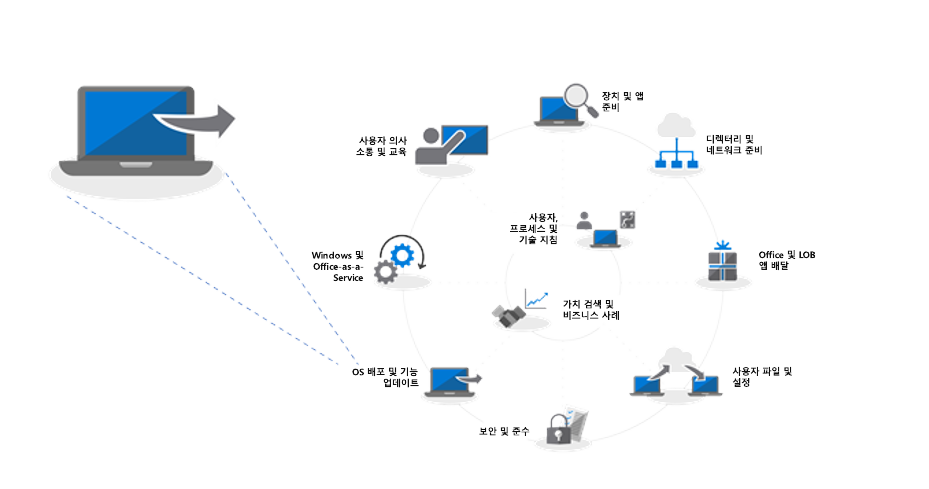
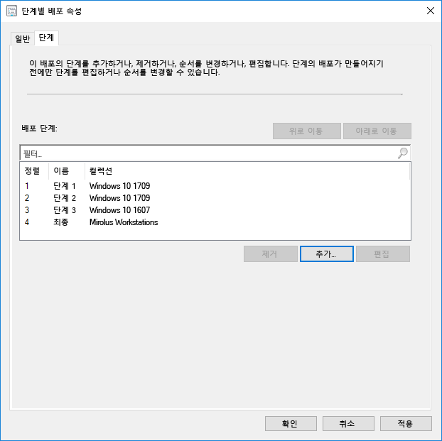
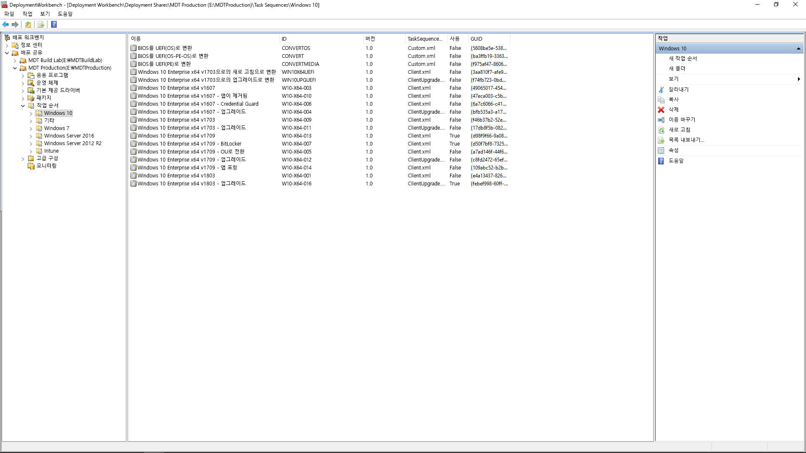

# 6단계: 운영 체제 배포 및 기능 업데이트Step 6: OS Deployment and Feature Updates

<table>
<thead>
<td></td>
<td>
<strong>6단계: 운영 체제 배포 및 기능 업데이트</strong><strong>Step 6: OS Deployment and Feature Updates</strong>

완전 설치, PC 업그레이드 및 PC 교체를 위해 대규모의 단계별 배포를 자동화하는 데 작업 시퀀스 기반 배포가 사용됩니다. 업그레이드 작업 시퀀스는 주요 반기 업데이트로 최신 상태를 유지하도록 도와줍니다. 또한 Windows Autopilot은 새 PC 취득 프로세스를 현대화하는 최신 추가 기능입니다.Task sequence-based deployment is used to automate large scale, phased deployment for bare metal installs, PC refresh and PC replacement. Upgrade task sequences will also help you stay current with major semi-annual updates. And Windows Autopilot is a recent addition that modernizes the new PC acquisition process.
</td>
<td></td>
</thead>
</table>

>[!NOTE]
>OS 배포 및 기능 업데이트는 Windows 10 OS 배포, 업그레이드 및 기능 업데이트를 포함하는 권장 배포 프로세스 사이클의 6번째 단계입니다.OS Deployment and Feature Updates is the sixth step in our recommended deployment process wheel covering Windows 10 OS deployment, upgrades and Feature Updates. To see the full desktop deployment process, visit the Modern Desktop Deployment Center. 전체 데스크톱 배포 프로세스를 보려면 [데스크톱 배포 센터](https://aka.ms/HowToShift)를 방문하세요.To see the full desktop deployment process, visit the [Desktop Deployment Center](https://aka.ms/HowToShift).
>

지금까지 배포 프로세스 사이클을 따라 진행했으면 적어도 장치 및 앱 준비 단계를 부분적으로 완료하고, 인프라를 준비하고, 앱 패키지를 수집하고, 사용자 파일을 마이그레이션하고 기본 설정을 구성하기 위한 계획과 기존의 보안 컨트롤을 유지하고 새 보안 컨트롤을 배포하기 위한 계획을 세웠을 것입니다.If you’ve been following the deployment process wheel till now, you’ve at least partially completed the steps for device and app readiness, prepared your infrastructure, configured and collected app packages, have a plan in place for migrating user files and configuring default settings as well as have plans for retaining your existing security controls and perhaps deploying new ones.

이제 이러한 모든 부분을 통합하여 Windows 10 및 Office 365 ProPlus, 필요한 드라이버, 앱 및 기타 항목을 설치하기 위해 가능한 많은 작업을 자동화하는 단계가 되었습니다.Now we’ve arrived at the stage where you’re putting all these pieces together to automate as much as you can to install Windows 10 and Office 365 ProPlus, along with the necessary drivers, apps and whatever else is needed.

기본적으로 OS 배포의 성공 여부를 파악하는 가장 좋은 척도는 사용자 기대를 충족하는지와 작업 중단을 피할 수 있는지 여부입니다. 이 단계에서는 단계별 배포의 일부로 파일럿 사용자에 대한 테스트 및 배포를 시작합니다. 또한 여기서는 브로드 배포 전에 배포 프로세스 사이클의 8단계인 [사용자 커뮤니케이션 및 교육](https://aka.ms/mdd8)으로 건너뛰어 사용자들이 변경에 대해 미리 알고 대처하도록 하고, 단계별 배포를 진행하면서 지속적으로 유효성 검사를 실시하여 롤아웃이 적절히 진행되는지 측정할 수 있습니다.Ultimately, the best measure of success with an OS deployment is meeting user expectations and avoiding disruptions in their work. And in this step, you’ll start testing and deploying to pilot users as part of a phased deployment. And one tip here, before you broaden deployment, you’ll need to skip ahead to step 8 on our deployment process wheel – [User Communications and Training](https://aka.ms/mdd8) to make sure users are informed and prepared for changes coming their way and that you can measure your roll-out pace with continuous validation using Phased Deployment.

## Windows 이미징 프로세스Windows Imaging Process

대부분의 조직 사용 하는 프로세스를 구성 하 고 몇 가지 표준 앱이 설치 된, 기본 집합 등 Windows의 복제본을 기록할 이미징 PC 또는 전자 짝수만 응용 프로그램 런타임 및 업데이트를 통해 늘어 지 이미지를 합니다. 이 작업을 수행 하는 가장 좋은 방법은 예상 하지 못한 드라이버와 관련 된 호환성 문제를 방지 하기 위해이 프로세스에 대 한 및 자동화 목적을 위해 가상 컴퓨터 사용 하 여입니다.Most organizations use the process of PC imaging to configure and capture a clone of Windows, including a base set of a few standard apps installed, or an even a thinner image with only application runtimes and updates. The best way to do this is using a virtual machine for this process to avoid any unexpected driver-related compatibility issues and for automation purposes.

이미지 캡처를 진행하면서 최고 품질의 이미지 및 반복 가능한 프로세스를 보장하려면 가능한 한 많은 작업을 자동화하는 것이 좋습니다. 대부분의 배포에서는 캡처하기 전에 Windows 이미지에 가능한 한 적은 사용자 지정과 미리 설치된 앱을 배치하는 것이 좋습니다. 이것이 소위 말하는 ‘씬 이미지’ 접근 방식입니다. 이 방식은 이미지 내의 많은 앱을 제거하여 네트워크의 전체적인 대역폭을 절약할 수 있는 방법입니다. 씬 기본 이미지로 시작하고 사용자에게 맞게 앱, 언어 및 구성에 대해 계층을 동적으로 구성할 수 있습니다.If going the image capture route, it’s best to automate as much as possible to ensure the best quality image and a repeatable process. For most deployments, it is also recommended to put as little customization and pre-installed apps as possible in the Windows image prior to capturing. This is what is called a ‘thin image’ approach, which can save overall bandwidth on the network by eliminating the number of apps within the image. By starting with a thin base image, you can layer on required apps, languages and configurations dynamically tailored to users.

빌드 및 캡처 중 프로세스 동안 System Center Configuration Manager 및 Microsoft Deployment Toolkit와 같은 도구는 시스템 준비 도구(또는 Sysprep)와 "일반화" 명령을 함께 사용하여 Windows 10 설치를 이미지로 캡처하기 전에 이미지를 다시 봉인합니다.During the build and capture process, tools like System Center Configuration Manager and the Microsoft Deployment Toolkit use the System Preparation Tool – or Sysprep – along with the “Generalize” command to reseal your image before they capture the Windows 10 installation as an image.

캡처한 이미지에는 Windows 이미지 또는 표준 Windows 설치 미디어와 같은 형식을 갖는 WIM이 포함됩니다. 사용자 지정 WIM 파일이 있으면 System Center Configuration Manager 또는 Microsoft Deployment Toolkit에서 OS 배포의 일부로 다른 작업 시퀀스를 사용하여 배포 관련 작업을 수행하고, 이미지를 적용하고, 환으로 Windows 이미지 적용 전후에 작업을 실행할 수 있습니다.The captured image will have the Windows image – or WIM – format like standard Windows installation media. Once you have your custom WIM file, you can use another task sequence as part of your OS deployment in System Center Configuration Manager or Microsoft Deployment Toolkit to perform deployment-related tasks, to apply the image and run tasks before and after your Windows image is applied.

[Windows 10 참조 이미지 만들기Create a Windows 10 Reference Image](https://docs.microsoft.com/ko-KR/windows/deployment/deploy-windows-mdt/create-a-windows-10-reference-image)

[운영 체제를 설치하는 작업 시퀀스 만들기Create a Task Sequence to Install an Operating System](https://docs.microsoft.com/ko-KR/sccm/osd/deploy-use/create-a-task-sequence-to-install-an-operating-system)

### 배포 유형Deployment Types

사용자 지정 이미지가 준비되면, 설치 또는 마이그레이션 유형은 다음 범주에 속합니다.With your custom image ready, the installation or migration type will fall into the following categories:

  - 첫째, **완전 배포**. 빈 디스크에 이미지를 배포하거나, 데이터를 디스크에 담지 않으려는 경우에 컴퓨터를 이미지로 다시 설치하는 데 사용되는 시나리오입니다.First, **bare metal deployment**. This is the scenario used to deploy an image to a clean disk, or to reimage a computer where you don’t intend to keep any of the data on the disk

  - 둘째는 완전 배포와 비슷한 **컴퓨터 새로 고침**으로, 사용자 상태가 디스크에 유지되거나, 설치가 완료된 후에 복원된다는\* 중대한 차이점이 있습니다.And second, similar to bare metal, is **Computer Refresh,** with the key difference that user state remains on the disk\* or will be restored after the install is complete

  - 마지막은 **컴퓨터 교체**입니다. 이름에서 알 수 있듯이 PC를 다른 PC로 교체하는 것입니다. 이 경우 첫 번째 PC에서 중앙 위치로 사용자 파일이 백업되었다가 두 번째 PC로 복원되는 경우가 많습니다.And last is **Computer Replacement**. Here as the name implies, you are replacing a PC with another PC. In this case, there is often a backup of user files from the first PC to a central location, then a restore of those files to the second PC.

이러한 세 가지 시나리오는 몇 가지 공통점이 있습니다. 작업 시퀀스를 사용해서 실행되며, 각 경우에 사용자 지정 이미지를 적용할 수 있다는 것입니다.All three of these scenarios have something in common, they use a task sequence to run, and a custom image can be applied each time.

[Windows 10 배포 시나리오에 대한 자세한 정보More About Windows 10 Deployment Scenarios](https://docs.microsoft.com/ko-KR/windows/deployment/windows-10-deployment-scenarios)

### 작업 시퀀스 자동화를 사용한 현재 위치 업그레이드In-place Upgrade using Task Sequence Automation

이러한 배포 유형 외에도, Windows 10을 포함하는 System Center Configuration Manager 작업 시퀀스 및 업그레이드 작업 시퀀스를 사용한 현재 위치 업그레이드도 새롭게 사용할 수 있는 옵션입니다.In addition to these deployment types, there is a new option available now as a System Center Configuration Manager Task Sequence with Windows 10 – and in-place upgrade using the Upgrade Task Sequence.

이전 버전의 Windows에서 현재 위치 업그레이드를 수행하려면 작업 시퀀스가 필요하지 않지만, 엔터프라이즈 규모에서 배포할 때는 작업 시퀀스가 권장됩니다. 현재 위치 업그레이드에서는 응용 프로그램을 포함하는 사용자 지정 이미지를 적용할 수 었지만, 오프라인 서비스를 사용하여 기본 install.wim을 업데이트할 수 있습니다. 예를 들어 업그레이드를 수행하기 전에 최신 Windows 업데이트가 적용되었는지 확인할 수 있습니다.In-place upgrades from a previous version of Windows do not require a task sequence, but it is a recommended approach when deploying at enterprise scale. An in-place upgrade does not allow you to apply a custom image with applications, but you can update the default install.wim using offline servicing. For example, you can to make sure it has the latest Windows updates applied prior to performing upgrades.

현재 위치 업그레이드에서는 Windows 설치 프로그램을 사용합니다. 설치 엔진은 몇 가지 소규모 설치 전 검사를 실행하여 알려진 호환성 문제를 검색합니다. 또한 사용자 상태 및 응용 프로그램은 유지하고, 설치하려는 Windows 10 버전과 호환되지 않는 항목만 제거합니다. 이 옵션을 사용하면 기존에 설치된 응용 프로그램 및 사용자 상태가 유지됩니다. 또한 현재 위치 업그레이드를 사용하면 문제 해결에 필요한 경우 이전에 설치된 OS로 롤백할 수도 있습니다.In-place upgrade uses windows setup. The setup engine runs several small pre-installation checks looking for known compatibility issues. It also preserves the user state and applications and only removes what isn’t compatible with the version of Windows 10 being installed. With this option, previously installed applications and user state are preserved. In-place upgrade also allows you to roll-back to the previous OS installed if needed for troubleshooting purposes.

[Setup.exe를 사용하는 Windows 10 업그레이드 전 유효성 검사Windows 10 Pre-Upgrade Validation Using setup.exe](https://blogs.technet.microsoft.com/mniehaus/2015/08/23/windows-10-pre-upgrade-validation-using-setup-exe/)

현재 위치 업그레이드 시나리오는 레거시 버전의 Windows에서 Windows 10으로 마이그레이션하거나 이전 버전의 Windows 10에서 업그레이드하는 데 사용할 수 있습니다. Windows 설치 프로그램이 업그레이드를 완료하면 작업 시퀀스가 계속 실행되면서 Office와 같은 응용 프로그램을 업그레이드하고, 드라이버를 교체하고, 개인 설정을 적용합니다. 마찬가지로 업그레이드 작업 시퀀스를 사용하여 업그레이드를 수행하기 전에 설치 전 작업 및 검사를 수행할 수 있습니다.The in-place upgrade scenario can be used to migrate to Windows 10 from legacy versions of Windows, as well as upgrade from previous versions of Windows 10. After Windows Setup completes the upgrade, your task sequence can continue to run and upgrade applications like Office, replace drivers, and apply personalization settings. Likewise, you can use the Upgrade Task Sequence to perform pre-installation tasks or checks prior to carrying out the upgrade.

[Configuration Manager를 사용하여 Windows 10으로의 현재 위치 업그레이드 수행Perform an in-place upgrade to Windows 10 using Configuration Manager](https://docs.microsoft.com/ko-KR/windows/deployment/upgrade/upgrade-to-windows-10-with-system-center-configuraton-manager)

[Configuration Manager에서 OS를 업그레이드하는 작업 시퀀스 만들기Create a task sequence to upgrade an OS in Configuration Manager](https://docs.microsoft.com/ko-KR/sccm/osd/deploy-use/create-a-task-sequence-to-upgrade-an-operating-system)

### 단계별 배포Phased Deployment

배포를 계획할 때 완전 복구, 새로 고침, 교체 및 업그레이드 경로에 대한 컴퓨터를 타기팅하게 됩니다. 이 경우에 권장되는 방법은 비슷한 컴퓨터 컬렉션에 대해 단계별 배포를 사용하는 것입니다. 이러한 방식으로 배포 규모를 넓히기 전에 호환성, 전달 및 자동화, 사용자 수용, 네트워크 대역폭 사용량 및 기타 요소가 유효한지 확인할 수 있습니다.As you're planning your deployment, you'll be targeting computers for bare metal, refresh, replace and upgrade paths. The recommended approach in this case is to use phased deployment to collections of similar machines. This way, you can validate compatibility, delivery and automation, user acceptance, network bandwidth consumption, and other factors before increasing the scale of your deployment.

### 권장 도구: System Center Configuration Manager 및 Microsoft Deployment ToolkitRecommended Tools: System Center Configuration Manager and the Microsoft Deployment Toolkit

선택하는 배포 유형에 관계없이, 예측 가능성 및 반복 가능성을 위해 가능한 한 자동화될 수 있는지 확인할 수 있습니다. Microsoft는 자동화된 작업 시퀀스를 사용하여 OS 배포를 자동화하기 위한 다음 두 가지 솔루션을 제공합니다.Regardless of the deployment type you choose, you’ll want to make sure it’s as automated as possible for predictability and repeatability. Microsoft offers two solutions to automate OS deployment using automated task sequences:

  - **[System Center Configuration Manager](https://docs.microsoft.com/ko-KR/sccm/core/understand/introduction)**(ConfigMgr)는 소프트웨어 배포 및 소프트웨어 업데이트 관리를 위한 기능을 보완하기 위해 기본 제공 운영 체제 소프트웨어 배포 기능을 제공합니다. ConfigMgr은 모든 규모의 조직에서 광범위하게 사용되며, 4가지 Windows 배포 유형을 모두 지원합니다. 필요에 따라 Microsoft Intune에 ConfigMgr을 통합하여 배포 및 장치 관리를 위한 추가 기능을 추가할 수 있습니다.**[System Center Configuration Manager](https://docs.microsoft.com/ko-KR/sccm/core/understand/introduction)** (ConfigMgr) provides built-in operating system deployment capabilities to complement its capabilities for software distribution and software update management. ConfigMgr is widely used by organizations of all sizes and supports all four Windows deployment types. Optionally, you can integrate ConfigMgr with Microsoft Intune to add additional capabilities for deployment and device management.

  - 또한 인기 있는 다른 배포 옵션 중 하나는 무료 **[Microsoft Deployment Toolkit](https://docs.microsoft.com/ko-KR/windows/deployment/deploy-windows-mdt/get-started-with-the-microsoft-deployment-toolkit)**(MDT)으로, 일반적으로 중소기업이 OS 배포에 사용합니다. 이 도구 키트에는 약간의 인프라만 필요합니다. MDT는 네트워크 부을 위해 WDS(Windows 배포 서비스)와 통합됩니다. 4가지 배포 유형과 응용 프로그램, 드라이버 및 설정 설치를 모두 지원합니다. 또한 MDT를 Configuration Manager와 통합할 수도 있습니다.And one other popular deployment option is the free **[Microsoft Deployment Toolkit](https://docs.microsoft.com/ko-KR/windows/deployment/deploy-windows-mdt/get-started-with-the-microsoft-deployment-toolkit)** (MDT) which is typically used by small and medium sized organizations for OS deployment. This requires very little infrastructure. MDT integrates with Windows Deployment Services (WDS) for network boot. It supports all four deployment types as well as installation of applications, drivers, and settings. And of course, MDT can even be integrated with Configuration Manager.

### Windows AutopilotWindows Autopilot

Windows 10에 새롭게 제공되는 옵션은 Windows Autopilot을 사용하여 새 PC를 하드웨어 새로 고침 주기의 일부로 구성하는 것입니다.A new option with Windows 10 is to configure new PCs as part of your hardware refresh cycle using Windows Autopilot. 이 기능을 사용하여 하드웨어 공급업체에서 사용자에게 제공되는 라이선스 계약 또는 진단 데이터 설정 등의 옵션을 제거하는 것과 같이 기본 Windows 설정 환경을 사용자 지정하도록 지원할 수 있습니다.A new option with Windows 10 is to configure new PCs as part of your hardware refresh cycle using Windows Autopilot. Here you can work with supporting hardware vendors to customize the default Windows setup experience – for example by eliminating options presented to users, like Licensing Agreements or telemetry settings.

그런 다음, 사용자가 Azure AD의 자격 증명을 사용하여 설치 중에 PC에 로그인하면 장치는 Microsoft Intune에 등록하고, 배포 프로세스를 인계 받고 응용 프로그램, 소프트웨어 업데이트 구성 및 준수 정책을 적용할 수 있게 됩니다. 또한 필요에 따라 Windows Autopilot은 프로비전이 완료될 때까지 사용자가 첫 번째 세션에 액세스하지 못하게 할 수도 있습니다.Then, when a user signs in to the PC during setup using their Azure AD credentials, the device enrolls into Microsoft Intune, which can then take over the deployment process and apply applications, software updates configurations and compliance policies. Windows Autopilot can also optionally prevent the user from accessing the first session until provisioning is complete.

[Windows Autopilot 개요Overview of Windows Autopilot](https://docs.microsoft.com/ko-KR/windows/deployment/windows-autopilot/windows-10-autopilot)

[Windows Autopilot 필수 구성 요소Windows Autopilot Prerequisites](https://docs.microsoft.com/ko-KR/windows/deployment/windows-autopilot/windows-10-autopilot#prerequisites)

## 기능 업데이트를 위한 비즈니스용 Windows 업데이트Windows Update for Business for Feature Updates

비즈니스용 Windows 업데이트는 IT 전문가가 디바이스를 Windows 업데이트 서비스에 직접 연결하여 Windows 10 디바이스를 항상 최신 상태로 유지할 수 있도록 하는 무료 서비스입니다.Windows Update for Business is a free service that enables IT Pros to keep Windows 10 devices always up to date by directly connecting the devices to the Windows Update service. 비즈니스용 Windows 업데이트는 그룹 정책 또는 MDM 솔루션(예: Microsoft Intune)을 통해 구성할 수 있으며, IT 전문가가 새 빌드가 유효한지 검사하기 위한 [배포 링](https://docs.microsoft.com/ko-KR/windows/deployment/update/waas-deployment-rings-windows-10-updates)을 만들 수 있도록 지원합니다.Windows Update for Business can be configured via Group Policy or through MDM solutions such as Microsoft Intune and allows IT Pros to create [deployment rings](https://docs.microsoft.com/ko-KR/windows/deployment/update/waas-deployment-rings-windows-10-updates) to validate new builds. 이 기능은 WSUS(Windows Server Update Services), System Center Configuration Manager(현재 분기) 및 Microsoft Intune 등과 같은 기존 관리 도구에 통합됩니다.It is integrated into existing management tools such as Windows Server Update Services (WSUS), System Center Configuration Manager (current branch), and Microsoft Intune. 또한 비즈니스용 Windows 업데이트는 대역폭 효율성을 최적화하고 네트워크 정체를 줄이는 데 도움이 되는 피어 투 피어 배달을 지원합니다.Additionally, Windows Update for Business supports peer-to-peer delivery to help optimize bandwidth efficiency and reduce network congestion.

비즈니스용 Windows 업데이트에 대한 자세한 내용을 다음 설명서를 참조하세요.For more detailed information on Windows Update for Business please review the following documentation:

- [비즈니스용 Windows 업데이트를 사용하여 업데이트 배포Deploy Updates Using Windows Update for Business](https://docs.microsoft.com/ko-KR/windows/deployment/update/waas-manage-updates-wufb)
- [비즈니스용 Windows 업데이트 구성Windows Update for Business](https://docs.microsoft.com/ko-KR/windows/deployment/update/waas-configure-wufb)
- [비즈니스용 Windows 업데이트를 기존 관리 도구에 통합Integrate Windows Update for Business with Existing Management Tools](https://docs.microsoft.com/ko-KR/windows/deployment/update/waas-integrate-wufb)
- [그룹 정책을 사용하여 비즈니스용 Windows 업데이트 구성Use Group Policy to configure Windows Update for Business](https://docs.microsoft.com/ko-KR/windows/deployment/update/waas-wufb-group-policy)
- [Microsoft Intune을 사용하여 비즈니스용 Windows 업데이트 구성Use Microsoft Intune to configure Windows Update for Business](https://docs.microsoft.com/ko-KR/intune/windows-update-for-business-configure)

## 다음 단계Next Step 

## [7단계: Windows 및 Office ServicingStep 7: Windows and Office Servicing](https://aka.ms/mdd7)

## 이전 단계Previous Step

## [5단계: 보안 및 준수 고려 사항Step 5: Security and Compliance Considerations](https://aka.ms/mdd5)