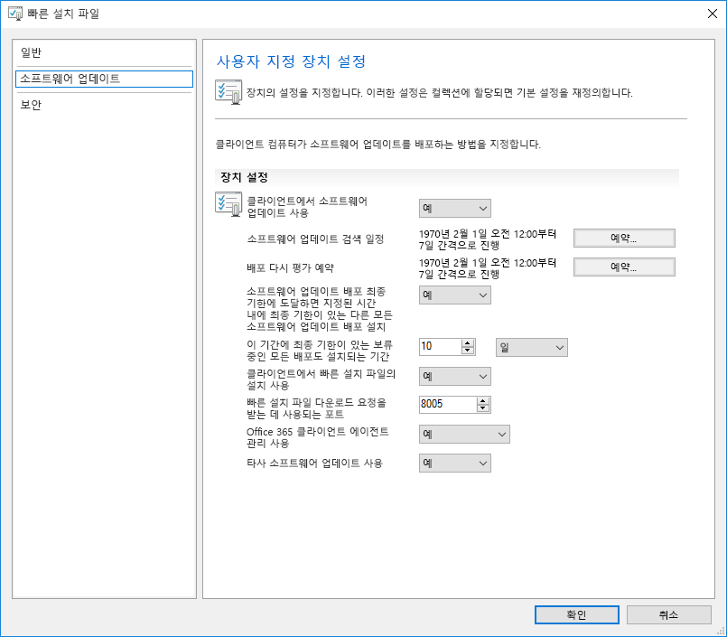
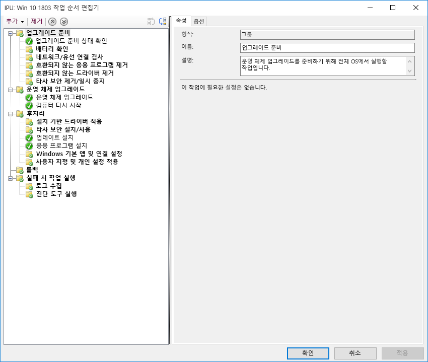

# 7단계: Windows 및 Office as a ServiceStep 7: Windows and Office as a Service

System Center Configuration Manager 현재 분기의 관리 도구 업데이트와 함께 Windows 10 및 Office 365 ProPlus의 새 기능을 포함하는 반기 채널 업데이트를 준비합니다.Prepare for semi-annual channel updates with new features and capabilities in Windows 10 and Office 365 ProPlus along with corresponding updates to management tools with System Center Configuration Manager Current Branch.

<table>
<thead>
<td></td>
<td>
<strong>7단계: Windows 및 Office as a Service 준비</strong><strong>Step 7: Preparing for Windows and Office as a Service</strong>

Windows 10 및 Office 365 ProPlus는 사용자 환경 및 보안을 최신 혁신 상태로 유지하기 위해 지속적으로 새 기능을 추가하고 있습니다. 반기 및 월별 업데이트를 통해 최신 상태를 유지하는 방법, 새 서비스 모델이 작동하는 방식 및 보유하고 있는 도구와 옵션에 대해 알아봅니다.Both Windows 10 and Office 365 ProPlus continually add new capabilities to keep bringing user experiences and security forward with the latest innovations. Learn how to stay current with semi-annual and monthly updates, how the new servicing model works and the tools and options you have.
</td>
<td></td>
</thead>
</table>

>[!NOTE]
>Windows 및 Office as a Service는 기능에 대한 반기 업데이트를 준비하는 계획 과정을 포함하는 권장 배포 프로세스 사이클의 7번째 단계입니다. 전체 데스크톱 배포 프로세스를 보려면 [최신 데스크톱 배포 센터](https://aka.ms/HowToShift)를 방문하세요.Windows and Office as a Service is the seventh step in our recommended deployment process wheel covering the planning aspects of preparing for semi-annual updates to features. To see the full desktop deployment process, visit the [Modern Desktop Deployment Center](https://aka.ms/HowToShift).
>

Windows 10 및 Office 365 ProPlus 둘 다 새 서비스 옵션, 지원 모델 및 업데이트 타임라인을 도입합니다. 이러한 변화를 통해 최신 기능을 최신 상태로 유지하는 프로세스가 간소화됩니다. 이러한 업데이트와 함께, 사용자 요구를 충족하는 서비스 계획을 지원하는 새로운 구성 옵션도 제공됩니다.Both Windows 10 and Office 365 ProPlus introduce new servicing options, support models and update timelines. These changes simplify the process for staying current on the latest features. Along with these updates are new configuration options to enable servicing plans that meet your needs.

[고객의 최신 데스크톱으로의 전환 지원Helping customers shift to a modern desktop](https://www.microsoft.com/ko-KR/microsoft-365/blog/2018/09/06/helping-customers-shift-to-a-modern-desktop/)

## 업데이트 유형Update Types

업데이트는 두 가지 주요 범주, 즉 기능 업데이트와 누적 보안, 안정성 및 버그 픽스를 포함하는 보안 업데이트로 구분됩니다. 케이던스 측면에서, Windows와 Office는 둘 다 매년 2번, 3월 및 9월 경에 새 기능을 전달하는 반기 채널을 전달하며, 품질 및 보안 업데이트는 매월 진행됩니다. 또한 Office 365 앱의 경우에만 완전히 지원되며 새 기능과 품질 업데이트를 둘 다 포함하는 월별 채널 업데이트를 전달합니다.Updates fall into two main categories, feature updates and then quality and security updates which contain cumulative security, reliability and bug fixes. In terms of cadence both Windows and Office deliver a semi-annual channel which delivers new features twice per year around March and September while Quality and Security Updates occur Monthly. Additionally, unique to Office 365 Apps, we deliver Monthly Channel updates that are fully-supported and contain both new features and quality updates.

데스크톱 OS 및 앱 업데이트 사이의 주기가 더 긴 경우 다음과 같은 의문이 생길 수 있습니다.If you’re used to a longer cycle between desktop OS and app updates, you might be wondering;

  - 업데이트가 서로 호환되나요?Will the updates be compatible?

  - 사용자를 계속해서 재교육해야 하나요?Will I need to keep retraining my users?

  - 어떤 위험 요소가 있나요?And what are the risks?

이러한 질문에 답변하고 새로운 기능을 좀 더 자주 전달해야 할 근거를 뒷받침하기 위해 이러한 접근 방법의 몇 가지 이점을 알아보겠습니다.To answer those questions and the rationale for delivering new capabilities more frequently, we’ll some of the advantages of this approach

### 기능 업데이트 혜택Feature Update Benefits

첫째, 우리는 3년 정도마다 거대한 변화의 물결을 소개하는 과거의 모델에서 매년 2번 기능 업데이트를 포함하는 좀 더 작은 규모의 증분 변경 방식으로 전환했습니다. 보안 위협이 빠르게 진화할 뿐만 아니라 기술 추세가 빠르게 변화하는 가운데, 이러한 방식은 환경 및 보호 기능을 최신 상태로 유지하도록 합니다. 예를 들어 일부 보안 관련 업데이트는 월별 보안 업데이트 또는 바이러스 백신 서명 파일만으로는 전달할 수 없으며, 가상화 기반 보안과 같은 하위 수준의 변경 플랫폼 방식을 따를 수 있습니다.First, we’ve moved away from the model of the past that would introduce huge waves of change around every three years to now incremental smaller changes with feature updates twice per year. Why? With technology trends moving so fast in addition to rapidly evolving security threats, this keeps experiences and protections current. Some of the security related updates for example can’t just be delivered by monthly security updates or antivirus signature files; they may be low-level changes platform, like virtualization-based security.

[Windows as a service에 대한 빠른 가이드Quick guide to Windows as a service](https://docs.microsoft.com/ko-KR/windows/deployment/update/waas-quick-start)

[Windows 10 보안 기능을 사용하여 위협 완화Mitigate threats by using Windows 10 security features](https://docs.microsoft.com/ko-KR/windows/security/threat-protection/overview-of-threat-mitigations-in-windows-10%20%20)

### 누적 업데이트 모델 혜택Cumulative Update Model Benefits

둘째, 품질 및 보안 업데이트를 누적 업데이트 패키지로 전달하면 과거의 많은 문제점이 해결됩니다. 과거에는 매월 Windows 및 Office에 대한 수십 가지 이상의 업데이트 중에서 일부를 선택할 수 있었습니다. 짐작할 수 있는 것처럼 이러한 방식에서는 거의 불가능한 수준의 테스트 지원 매트릭스가 생성됩니다. 또한 1년 이전의 Windows 또는 Office 버전을 설치하는 경우 해당 버전이 릴리스된 이래로 전달된 모든 업데이트를 적용하는 데 수 시간이 걸릴 수 있습니다.Second delivering quality and security updates as a cumulative update package corrects many of the issues of the past. It used to be that you might pick and choose sometimes from a dozen updates or more each month for both Windows and Office. As you can imagine, this creates a nearly impossible set of test matrices for support. Also, if you install a version of Windows or Office that is a year or more old, it might take hours or sometimes days to apply all updates delivered since that version was released.

누적 모델을 사용하는 경우 최신 업데이트보다 항상 1 이전 버전을 사용하게 되며, 이를 통해 배포해야 하는 월별 업데이트 수는 줄어듭니다. 각 업데이트는 이전 달의 업데이트 위에 구축되며, 최신 상태로 유지해야 하는 모든 픽스를 포함합니다. 누적 업데이트는 다른 사용자에게 다시 할당되기 위해 저장소에서 대기해야 하므로 PC를 몇 달 동안 꺼둔 경우에 특히 도움이 됩니다.With the cumulative model, you’re always one update away from being current and in doing so the number of monthly updates that you need to deploy is reduced. Each update builds upon updates from previous months and contains all of the fixes that you need to get current. Cumulative updates are especially helpful when PCs has been turned off for several months because they are in storage waiting to be reassigned to a different user.

[Windows as a Service 개요Overivew of Windows as a service](https://docs.microsoft.com/ko-KR/windows/deployment/update/waas-overview)

### 확장된 업데이트 유효성 검사Expanded Validation of Updates

또 다른 장점은 브로드 배포를 위해 업데이트를 롤아웃하기 전에 먼저 [Office](https://products.office.com/en-us/office-insider?tab=Windows-Desktop) 및 [Windows](https://insider.windows.com/ko-KR/)의 참가자 프로그램을 통해 빌드를 릴리스하게 되며, 이를 통해 업데이트를 광범위하게 릴리스하기 전에 원격 분석 및 피드백을 수집할 수 있습니다. 참가자 프로그램은 현재, 누구에게나 열려 있으므로 업데이트를 먼저 알아볼 수 있는 기회가 됩니다. 업데이트를 출시한 다음, 수백만 가지 구성에 대한 원격 분석이 수신되므로, 업데이트를 롤아웃할 때 좀 더 예측 가능한 품질이 구현됩니다.Another advantage is that, before we roll out updates for broad deployment, we first release builds via the Insider programs for [Office](https://products.office.com/en-us/office-insider?tab=Windows-Desktop) and [Windows](https://insider.windows.com/ko-KR/), and this allows us to gather telemetry and feedback ahead of us releasing updates broadly. Now the Insider programs are open to everyone so that you can get ahead of understanding the updates. By the time we release updates we will have received telemetry from millions of configurations, so when we do roll out updates, quality is now inherently more predictable

아울러, Office 365 ProPlus 참가자 빌드는 월별 채널 업데이트를 반영하기 때문에 Office의 반기 채널을 사용하여 Windows에 맞춰 1년에 2번 기능 업데이트를 전달할 경우, 반기 채널 대상 릴리스를 사용할 때처럼 해당 빌드도 조기에 유효성을 검사할 수 있습니다.AND one more thing, because Office 365 ProPlus Insider builds reflect monthly channel updates, if you are using semi-annual channel for Office to deliver feature updates twice per year aligned to Windows, you can validate those builds early as well using the semi-annual channel targeted releases.

### 관리 도구 지원Supporting Management Tools

또한 Microsoft는 사용자에게 원활하게 업데이트를 배포하는 방법을 고민해왔습니다. Windows 및 Office에 대한 이러한 업데이트 및 새 기능의 롤아웃을 지원하기 위해 System Center Configuration Manager 현재 분기는 자주 업데이트됩니다.We've also thought through how to make the deployment of updates seamless to you. System Center Configuration Manager Current Branch is updated frequently to support the roll-out of these updates to Windows and Office and any new capabilities.

[System Center Configuration Manager를 사용하여 Windows 10 업데이트 배포Deploy Windows 10 updates using System Center Configuration Manager](https://docs.microsoft.com/ko-KR/windows/deployment/update/waas-manage-updates-configuration-manager)

[Configuration Manager를 사용하여 Office 365 ProPlus 관리Manage Office 365 ProPlus with Configuration Manager](https://docs.microsoft.com/ko-KR/sccm/sum/deploy-use/manage-office-365-proplus-updates)

## 단계별 업데이트 배포Phased Deployment of Updates

이제 이러한 업데이트 배포를 롤아웃하는 방법을 살펴보겠습니다. 모든 릴리스에 대해, IT 부서에 3개 이상의 배포 작업 단계, 즉 유효성 검사, 파일럿 및 브로드 프로덕션 배포를 권장합니다. 일단 Windows 10 및 Office 365 ProPlus에서 시작 및 실행될 경우 월별 서비스를 사용하여 중요한 보안 및 품질 업데이트로 최신 상태를 유지한 다음, 새 기능에 대한 반기 서비스로 전환합니다.Now let’s shift gears to how you will roll out these updates. For any release, we recommend at least three deployment phases for IT – validation, piloting and broad production deployment. Once you’re up and running on Windows 10 and Office 365 ProPlus, you'll use monthly servicing to stay current with critical security and quality updates, then you’ll move to semi-annual servicing for new features.

### 월별 업데이트Monthly Updating

이 서비스 모델에서는 새 기능의 롤아웃을 1년에 2번으로 제한하도록 선택할 수 있으며, 필요한 경우 반기 업데이트를 건너뛰고 품질 및 보안 업데이터를 계속 받을 수 있습니다. 앞서 언급한 것처럼 월별 업데이트는 누적되므로 매월 크기가 커집니다.The service model is designed so you can choose to limit the roll-out of new features to twice per year, and if needed you can even skip a semi-annual update and continue receiving quality and security updates. As mentioned, the cumulative nature of monthly updates means each will increase in size per month.

#### 빠른 업데이트Express Updates

Windows의 “빠른 업데이트”, Office의 이진 델타 압축이라는 기술을 사용하여 다운로드 크기를 획기적으로 줄일 수 있습니다. 두 가지 방법에서 업데이트 엔진은 PC에 있는 항목을 비교하고, 해당 항목을 업데이트하는 데 필요한 차등 기능만 찾습니다.Using a technology called "Express Updates" in Windows and Binary Delta Compression in Office, we can reduce the download size significantly. In both approaches, the update engines compare what’s on the PC and finds only the differentials needed to update what’s there.

[Windows 10 품질 업데이트 및 델타 업데이트 종료Windows 10 quality updates explained & the end of delta updates](https://techcommunity.microsoft.com/t5/Windows-IT-Pro-Blog/Windows-10-quality-updates-explained-amp-the-end-of-delta/ba-p/214426)

비즈니스용 Windows 업데이트 및 Windows Server Update Services는 오랫 동안 빠른 업데이트를 지원했지만, 현재는 System Center Configuration Manager로 지원을 확장하고 있습니다. 따라서 여기서도 빠른 업데이트를 사용할 수 있습니다.Windows Update for Business and Windows Server Update Services have supported express updates for a long time, but we've now extended that support to System Center Configuration Manager so that it can also use Express Updates.

#### 이진 델타 압축Binary Delta Compression

Office의 이진 델타 압축은 가장 최근의 Office 365 ProPlus 버전에서 업데이트하는 경우에만 사용됩니다. 따라서 이 방법을 사용하려면 이전 빌드에서 업데이트해야 하며 업데이트를 건너뛸 수 없습니다.Binary Delta Compression in Office is only used if you're updating from the most recent version of Office 365 ProPlus-- so to use this approach you need to be updating from the previous build and can’t skip updates.

Windows 및 Office 업데이트 채널은 Configuration Manager를 통해 표준 승인 및 타기팅 프로세스를 사용하여 관리할 수 있습니다. 또한 Office 및 Windows의 정책 설정을 사용하여 관련 설정 뿐만 아니라 사용되는 업데이트 채널을 적용할 수 있습니다.Windows and Office update channels can be managed via Configuration Manager using the standard approval and targeting process. Additionally, you can use policy settings in Office and Windows to enforce update channels used, as well as related settings.

### 반기 업데이트Semi-Annual Updates

지금까지 월별 업데이트에 대한 이러한 고려 사항을 살펴보았으므로 이제 좀 더 큰 규모의 반기 업데이트에 대해 알아보겠습니다.So those are your considerations for monthly updates, now let’s move to the larger, semi-annual updates.

장치 및 앱 준비 상태에서 살펴본 것처럼, 배포 프로세스 사이클의 1단계에서 설정한 동일한 준비 도구를 사용하여 이러한 좀 더 큰 규모의 업데이트를 준비할 수 있습니다.As we covered in Device and App Readiness, you’ll want to begin your preparation for these larger updates using the same readiness tools we set up in Step 1 of the deployment process wheel.

비즈니스용 Windows 업데이트를 사용하는 정책 설정, System Center Configuration Manager를 통한 소프트웨어 업데이트 관리, WSUS(Windows Server 업데이트 서비스) 또는 Microsoft Intune에서 설정되는 업데이트 정책을 도구로 사용할 수 있습니다. 네트워크 대역폭이 걱정된다면 2단계: 디렉터리 및 네트워크 준비를 참조하여 장치 최적화 및 기타 피어 투 피어 캐싱 기술을 통해 네트워크 트래픽을 줄이는 옵션에 대해 알아보세요.As for tooling, you can use policy settings with Windows Update for Business, software update management via System Center Configuration Manager, Windows Server Update Services (WSUS), or update policies set by Microsoft Intune. If you are concerned about network bandwidth, see Step 2: Directory and Network Readiness, to learn about your options to reduce network traffic via Delivery Optimization and other peer to peer caching technologies.

[Windows 반기 채널Windows Semi-Annual Channel](https://docs.microsoft.com/ko-KR/windows/deployment/update/waas-overview#semi-annual-channel)

[Office 365 ProPlus에 대한 반기 채널Semi-Annual Channel for Office 365 ProPlus](https://docs.microsoft.com/ko-KR/DeployOffice/overview-of-update-channels-for-office-365-proplus#BKMK_SAC)

#### 업그레이드 작업 시퀀스Upgrade Task Sequences

표준 소프트웨어 업데이트 관리 루틴을 통해 더 큰 기능 업데이트를 설치할 수 있지만, 많은 조직에서는 System Center Configuration Manager 또는 Microsoft Deployment Toolkit를 통해 업그레이드 작업 시퀀스를 사용하도록 선택합니다.Installing the larger feature updates via standard software update management routines is a supported option, but many organizations will opt to use an Upgrade Task Sequence with System Center Configuration Manager or the Microsoft Deployment Toolkit.

작업 시퀀스를 사용하면 기능 업데이트를 설치하기 전에 사용자 지정 검사 또는 작업을 만들고, 업데이트 설치 자체가 완료된 후에 사용자 지정 작업을 수행할 수 있습니다. 업데이트 후 작업에는 필요한 경우 업데이트, 드라이버 설치 및 교체, 응용 프로그램 업그레이드나 작업 표시줄 및 Windows 10 시작 개인 설정 중에 서비스를 일시적으로 중단하는 작업이 포함될 수 있습니다.A Task Sequence allows you to create custom checks or tasks BEFORE to the installing the Feature Update and allows you to perform custom tasks AFTER the update installation itself has completed – post-update tasks might include temporarily suspending services if needed during the update, driver installation and replacement, application upgrades or taskbar and Windows 10 Start personalization settings.

Windows 7 컴퓨터를 Windows 10으로 마이그레이션하는 작업 시퀀스를 이미 사용 중이며 해당 도구에 대해 잘 아는 경우, 작업 시퀀스로 시작하면 좋으며 작업을 적절히 제어할 수 있습니다. 전체 업그레이드에 대해 단일 작업 시퀀스를 사용할 수 있지만 조직에서는 일반적으로 2개의 작업 시퀀스를 사용합니다. 하나는 컴퓨터의 업그레이드 준비가 되었는지 확인하는 것으로, 대상 컴퓨터에서 모든 필수 설치 파일을 사전에 준비하는 시퀀스이며, 다른 하나는 실제 업그레이드를 수행하는 시퀀스입니다. 이러한 방식을 통해 사용자 생산성이 영향을 덜 받습니다.If you’re already using task sequences to migrate your Windows 7 machines to Windows 10 and are well-versed with those tools, this is a great place to start and provides ultimate control. While you can use a single task sequence for the entire upgrade, it is quite common that organizations use two task sequences. One task sequence for making sure the machines are ready for the upgrade, that silently pre-stages all the required setup files on target computers, and one to do the actual upgrade. This approach ensures that your user productivity is less impacted.

[Configuration Manager에서 OS를 업그레이드하는 작업 시퀀스 만들기Create a task sequence to upgrade an OS in Configuration Manager](https://docs.microsoft.com/ko-KR/sccm/osd/deploy-use/create-a-task-sequence-to-upgrade-an-operating-system)

#### 기능 업데이트에 대한 반기 채널 지원Semi-annual channel support for feature updates

[2018년 9월에 발표된 것처럼](https://www.microsoft.com/ko-KR/microsoft-365/blog/2018/09/06/helping-customers-shift-to-a-modern-desktop/), 반기 채널 업데이트의 지원 타임라인은 다음 모델을 사용합니다.[As announced in September 2018](https://www.microsoft.com/ko-KR/microsoft-365/blog/2018/09/06/helping-customers-shift-to-a-modern-desktop/), support timeline for semi-annual channel updates will use the following model.

  - 버전 1607부터 시작해서 Windows 10 Enterprise 및 Education의 지원되는 모든 기능 업데이트는 원본 릴리스 날로부터 30개월 동안 지원됩니다.All currently supported feature updates of Windows 10 Enterprise and Education, starting with version 1607, will be supported for 30 months from their original release date.

  - 9월에 예정된 1809부터 시작하는 모든 향후 기능 업데이트는 릴리스 날로부터 30개월 동안 지원됩니다.All future feature updates, starting with 1809, with a targeting September will be supported for 30 months from their release date.

  - 3월에 예정되어 있고 1903에서 시작되는 향후 기능 업데이트는 릴리스 날로부터 18개월 동안 계속 지원됩니다.Future feature updates targeting March and starting with 1903 will continue to be supported for 18 months from their release date.

  - Office 365 ProPlus 반기 업데이트는 18개월 동안 계속 지원됨Office 365 ProPlus semi-annual updates continue to be supported for 18 months

#### 작업 시퀀스 외부의 추가 설치 자동화 옵션Additional setup automation options outside of task sequences

업그레이드 작업 시퀀스를 사용하지 않는 경우, 설치 전 단계(설치 프로그램이 호환성 검사를 실행하기 전) 또는 커밋 전 단계(업그레이드가 적용되기 전)에 기능 업데이트 동안 사용자 지정 작업을 실행하거나 드라이버 파일을 실행할 수 있습니다.If you don’t use Upgrade Task Sequences, you can now run custom actions or apply driver files during feature updates in the Pre-install phase – before setup runs its compatibility checks – or in the pre-commit phase – before the upgrade is applied.

[Windows 10 설치, 버전 1803의 새로운 기능What's new in Windows 10 setup, version 1803](https://docs.microsoft.com/ko-KR/windows/whats-new/whats-new-windows-10-version-1803%23windows-setup)

## 다음 단계Next Step 

## [8단계: 사용자 커뮤니케이션 및 교육Step 8: User Communications and Training](https://aka.ms/mdd8)

## 이전 단계Previous Step 

## [6단계: 운영 체제 배포 및 기능 업데이트Step 6 OS Deployment and Feature Updates](https://aka.ms/mdd6)