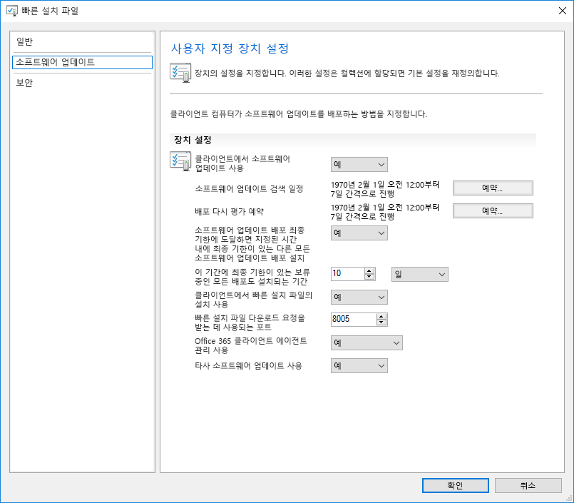
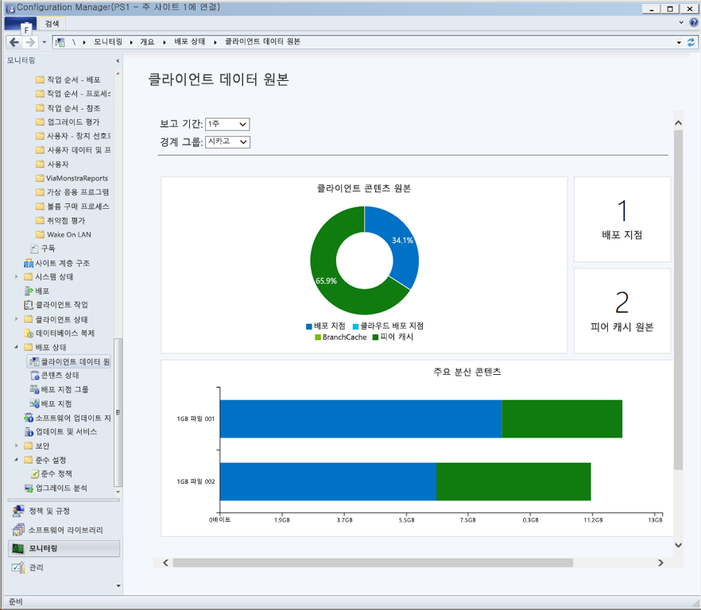

# 7단계: Windows 및 Office Servicing

<table>
<thead>
<td></td>
<td>
<strong>7단계: Windows 및 Office Servicing</strong>

Both Windows 10 and Microsoft 365 Apps for enterprise continually add new capabilities to keep bringing user experiences and security forward with the latest innovations. Learn how to stay current with semi-annual and monthly updates, how the new servicing model works and the tools and options you have.
</td>
<td></td>
</thead>
</table>

>[!NOTE]
>Windows 및 Office as a Service는 기능에 대한 반기 업데이트를 준비하는 계획 과정을 포함하는 권장 배포 프로세스 사이클의 7번째 단계입니다. 전체 데스크톱 배포 프로세스를 보려면 [데스크톱 배포 센터](https://aka.ms/HowToShift)를 방문하세요.
>

Windows 10 및 엔터프라이즈용 Microsoft 365 앱 모두 새로운 서비스 옵션, 지원 모델 및 업데이트 타임라인을 도입합니다. 이러한 변화를 통해 보다 간편하게 항상 최신 기능 상태를 유지할 수 있습니다. 이러한 업데이트와 함께, 사용자 요구를 충족하는 서비스 계획을 설정할 수 있는 새로운 구성 옵션도 제공됩니다. Microsoft Endpoint Configuration Manager(현재 분기)의 새 기능을 활용하면서 Windows 10 및 엔터프라이즈용 Microsoft 365 앱의 새 기능을 제공하는 반기 채널 업데이트를 준비하는 방법을 알아봅니다.

[Windows 10 및 엔터프라이즈용 Microsoft 365 앱으로 전환하는 고객 지원](https://www.microsoft.com/microsoft-365/blog/2018/09/06/helping-customers-shift-to-a-modern-desktop/)

## 업데이트 유형

업데이트는 두 가지 주요 범주인 기능 업데이트와 누적 보안, 안정성, 버그 수정을 포함하는 품질 및 보안 업데이트로 진행됩니다. 업데이트 주기는 Windows와 Office 둘 다 3월과 9월 경에 연 2회 새 기능을 제공하는 반기 채널을 따르지만, 품질 및 보안 업데이트는 매월 제공됩니다. 또한 Office 365 애플리케이션의 경우에만 업데이트에 새 기능과 품질 업데이트를 둘 다 포함하는 완전 지원형 현재 채널 옵션을 제공하고 있습니다.

데스크톱 OS 및 앱 업데이트 사이의 주기가 더 긴 경우 다음과 같은 의문이 생길 수 있습니다.

  - 업데이트가 서로 호환되나요?

  - 사용자를 계속해서 재교육해야 하나요?

  - 어떤 위험 요소가 있나요?

이러한 질문에 답변하고 새로운 기능을 좀 더 자주 전달해야 할 근거를 뒷받침하기 위해 이러한 접근 방법의 몇 가지 이점을 알아보겠습니다.

### 기능 업데이트 혜택

First, we’ve moved away from the model of the past that would introduce huge waves of change around every three years to now incremental smaller changes with feature updates twice per year. Why? With technology trends moving so fast in addition to rapidly evolving security threats, this keeps experiences and protections current. Some of the security related updates for example can’t just be delivered by monthly security updates or antivirus signature files; they may be low-level changes platform, like virtualization-based security.

[Windows as a service에 대한 빠른 가이드](https://docs.microsoft.com/windows/deployment/update/waas-quick-start)

[Windows 10 보안 기능을 사용하여 위협 완화](https://docs.microsoft.com/windows/security/threat-protection/overview-of-threat-mitigations-in-windows-10%20%20)

### 누적 업데이트 모델 혜택

Second delivering quality and security updates as a cumulative update package corrects many of the issues of the past. It used to be that you might pick and choose sometimes from a dozen updates or more each month for both Windows and Office. As you can imagine, this creates a nearly impossible set of test matrices for support. Also, if you install a version of Windows or Office that is a year or more old, it might take hours or sometimes days to apply all updates delivered since that version was released.

With the cumulative model, you’re always one update away from being current and in doing so the number of monthly updates that you need to deploy is reduced. Each update builds upon updates from previous months and contains all of the fixes that you need to get current. Cumulative updates are especially helpful when PCs has been turned off for several months because they are in storage waiting to be reassigned to a different user.

### 확장된 업데이트 유효성 검사

또 다른 장점은 광범위한 배포를 위해 업데이트를 롤아웃하기 전에 먼저 [Office](https://products.office.com/office-insider?tab=Windows-Desktop) 및 [Windows](https://insider.windows.com/)용 참가자 프로그램을 통해 빌드를 릴리스한다는 것입니다. 이를 통해 업데이트를 광범위하게 릴리스하기 전에 진단 데이터 및 사용자 의견을 수집할 수 있습니다. 이제 참가자 프로그램은 모든 사용자에게 열려 있으므로 사용자들은 업데이트를 먼저 이해할 수 있습니다. 업데이트를 릴리스할 때 수백만 가지 구성의 진단 데이터를 받아 보게 되므로 업데이트를 롤아웃할 때는 보다 안정적인 품질 수준에 도달할 수 있게 됩니다.

그리고 한 가지 더 말씀드리면, 엔터프라이즈용 Microsoft 365 Apps for Insider 빌드에는 월별 채널 업데이트가 반영되므로, Office용 반기 채널을 사용하여 Windows에 맞춰 기능 업데이트를 매년 두 번씩 제공하는 경우 반기별 엔터프라이즈 채널(미리 보기) 릴리스를 사용하여 이러한 빌드를 조기에 검증할 수 있습니다.

### 관리 도구 지원

We've also thought through how to make the deployment of updates seamless to you. Configuration Manager (Current Branch) is updated frequently to support the roll-out of these updates to Windows and Office and any new capabilities.

[Configuration Manager를 사용하여 Windows 10 업데이트 배포](https://docs.microsoft.com/windows/deployment/update/waas-manage-updates-configuration-manager)

[Configuration Manager를 사용하여 엔터프라이즈용 Microsoft 365 앱 관리](https://docs.microsoft.com/mem/configmgr/sum/deploy-use/manage-office-365-proplus-updates)

## Windows 및 Office 채널 개요

Windows 10은 다음의 3가지 서비스 채널을 제공합니다.

- [**Windows 참가자 프로그램**](https://docs.microsoft.com/windows/deployment/update/waas-overview#windows-insider): 조직에서 향후 기능 업데이트에 제공될 기능을 테스트하고 의견을 제공할 수 있습니다.
- **반기 채널**: 연 2회 기능 업데이트 릴리스를 통해 새 기능을 제공합니다.
- **장기 서비스 채널**: 장기 서비스 옵션이 필요한 특수 디바이스에만 사용됩니다.

Microsoft 365는 다음과 같은 4가지 서비스 채널을 제공합니다.

- [**Office 참가자 프로그램**](https://products.office.com/office-insider): 조직에서 최신 Office 기능과 아직 개발 중인 기능을 테스트하고 의견을 제공할 수 있습니다.
- **현재 채널**: Office의 최신 기능이 사용 가능해지는 즉시 사용자에게 제공됩니다.
- **반기 엔터프라이즈 채널**: 연 2회만 새 기능을 제공합니다.
- **반기 엔터프라이즈 채널(미리 보기)**: 파일럿 사용자와 애플리케이션 호환성 테스터가 다음 반기 엔터프라이즈 채널을 테스트하고 유효성을 검사할 수 있는 완전히 지원되는 Office 빌드입니다.

Windows 및 Office 서비스 채널에 대한 자세한 내용은 아래 설명서를 검토하세요.

- [Windows as a Service 개요](https://docs.microsoft.com/windows/deployment/update/waas-overview#servicing-channels)
- [Microsoft 365 앱의 업데이트 채널 개요](https://docs.microsoft.com/DeployOffice/overview-update-channels#BKMK_SAC)

## 단계별 업데이트 배포

Now let’s shift gears to how you will roll out these updates. For any release, we recommend at least three deployment phases for IT – validation, piloting and broad production deployment. Once you’re up and running on Windows 10 and Microsoft 365 Apps for enterprise, you'll use monthly servicing to stay current with critical security and quality updates, then you’ll move to semi-annual servicing for new features.

### 월별 업데이트

The service model is designed so you can choose to limit the roll-out of new features to twice per year, and if needed you can even skip a semi-annual update and continue receiving quality and security updates. As mentioned, the cumulative nature of monthly updates means each will increase in size per month.

#### 빠른 업데이트

Using a technology called "Express Updates" in Windows and Binary Delta Compression in Office, we can reduce the download size significantly. In both approaches, the update engines compare what’s on the PC and finds only the differentials needed to update what’s there.

[Windows 10 품질 업데이트 및 델타 업데이트 종료](https://techcommunity.microsoft.com/t5/Windows-IT-Pro-Blog/Windows-10-quality-updates-explained-amp-the-end-of-delta/ba-p/214426)

비즈니스용 Windows 업데이트 및 Windows Server Update Services는 오랫 동안 빠른 업데이트를 지원했지만, 현재는 Microsoft Endpoint Configuration Manager(현재 분기)로 지원을 확장하고 있습니다. 따라서 여기서도 빠른 업데이트를 사용할 수 있습니다.

#### 2진 델타 압축은

Office의 이진 델타 압축은 가장 최근의 엔터프라이즈용 Microsoft 365 앱 버전에서 업데이트하는 경우에만 사용됩니다. 따라서 이 방법을 사용하려면 이전 빌드에서 업데이트해야 하며 업데이트를 건너뛸 수 없습니다.

Windows and Office update channels can be managed via Configuration Manager using the standard approval and targeting process. Additionally, you can use policy settings in Office and Windows to enforce update channels used, as well as related settings.

### 반기 업데이트

지금까지 월별 업데이트에 대한 이러한 고려 사항을 살펴보았으므로 이제 좀 더 큰 규모의 반기 업데이트에 대해 알아보겠습니다.

장치 및 앱 준비 상태에서 살펴본 것처럼, 배포 프로세스 사이클의 1단계에서 설정한 동일한 준비 도구를 사용하여 이러한 좀 더 큰 규모의 업데이트를 준비할 수 있습니다.

As for tooling, you can use policy settings with Windows Update for Business, software update management via Microsoft Endpoint Configuration Manager (Current Branch), Windows Server Update Services (WSUS), or update policies set by Microsoft Intune. If you are concerned about network bandwidth, see Step 2: Directory and Network Readiness, to learn about your options to reduce network traffic via Delivery Optimization and other peer to peer caching technologies.

[Windows 반기 채널](https://docs.microsoft.com/windows/deployment/update/waas-overview#semi-annual-channel)

[Microsoft 365 앱에 대한 반기 엔터프라이즈 채널](https://docs.microsoft.com/DeployOffice/overview-update-channels#BKMK_SAC)

#### 업그레이드 작업 시퀀스

표준 소프트웨어 업데이트 관리 루틴을 통해 더 큰 기능 업데이트를 설치할 수 있지만, 많은 조직에서는 Microsoft Endpoint Configuration Manager(현재 분기) 또는 Microsoft Deployment Toolkit를 통해 업그레이드 작업 시퀀스를 사용하도록 선택합니다.

작업 시퀀스를 사용하면 기능 업데이트를 설치하기 전에 사용자 지정 검사 또는 작업을 만들고, 업데이트 설치 자체가 완료된 후에 사용자 지정 작업을 수행할 수 있습니다. 업데이트 후 작업에는 필요한 경우 업데이트, 드라이버 설치 및 교체, 응용 프로그램 업그레이드나 작업 표시줄 및 Windows 10 시작 개인 설정 중에 서비스를 일시적으로 중단하는 작업이 포함될 수 있습니다.

If you’re already using task sequences to migrate your Windows 7 machines to Windows 10 and are well-versed with those tools, this is a great place to start and provides ultimate control. While you can use a single task sequence for the entire upgrade, it is quite common that organizations use two task sequences. One task sequence for making sure the machines are ready for the upgrade, that silently pre-stages all the required setup files on target computers, and one to do the actual upgrade. This approach ensures that your user productivity is less impacted.

[Configuration Manager에서 OS를 업그레이드하는 작업 시퀀스 만들기](https://docs.microsoft.com/mem/configmgr/osd/deploy-use/create-a-task-sequence-to-upgrade-an-operating-system)

#### 기능 업데이트에 대한 반기 채널 지원

[2018년 9월에 발표된 것처럼](https://www.microsoft.com/microsoft-365/blog/2018/09/06/helping-customers-shift-to-a-modern-desktop/), 반기 채널 업데이트의 지원 타임라인은 다음 모델을 사용합니다.

  - 버전 1607부터 시작해서 Windows 10 Enterprise 및 Education의 지원되는 모든 기능 업데이트는 원본 릴리스 날로부터 30개월 동안 지원됩니다.

  - 9월에 예정된 1809부터 시작하는 모든 향후 기능 업데이트는 릴리스 날로부터 30개월 동안 지원됩니다.

  - 3월에 예정되어 있고 1903에서 시작되는 향후 기능 업데이트는 릴리스 날로부터 18개월 동안 계속 지원됩니다.

  - 엔터프라이즈용 Microsoft 365 앱 반기 업데이트는 18개월 동안 계속 지원됨

#### 작업 시퀀스 외부의 추가 설치 자동화 옵션

업그레이드 작업 시퀀스를 사용하지 않는 경우, 설치 전 단계(설치 프로그램이 호환성 검사를 실행하기 전) 또는 커밋 전 단계(업그레이드가 적용되기 전)에 기능 업데이트 동안 사용자 지정 작업을 실행하거나 드라이버 파일을 실행할 수 있습니다.

[Windows 10 설치, 버전 1803의 새로운 기능](https://docs.microsoft.com/windows/whats-new/whats-new-windows-10-version-1803%23windows-setup)

## 다음 단계 

## [8단계: 사용자 커뮤니케이션 및 교육](https://aka.ms/mdd8)

## 이전 단계 

## [6단계: 운영 체제 배포 및 기능 업데이트](https://aka.ms/mdd6)
