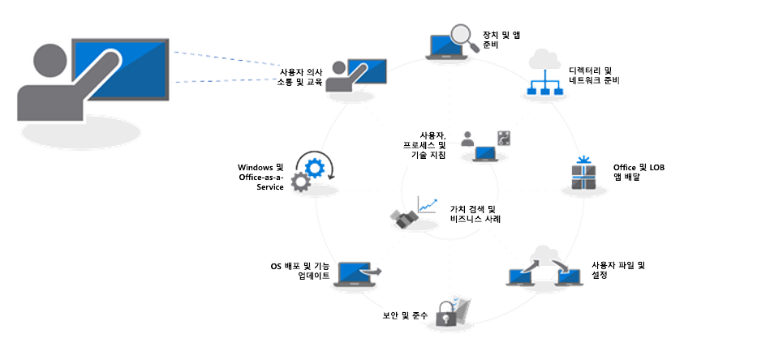
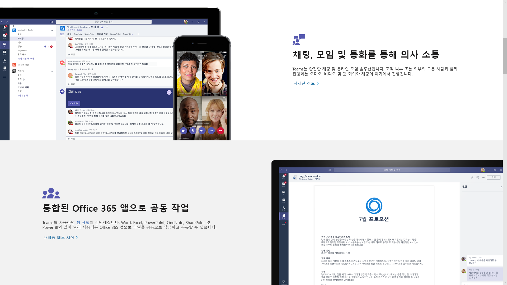
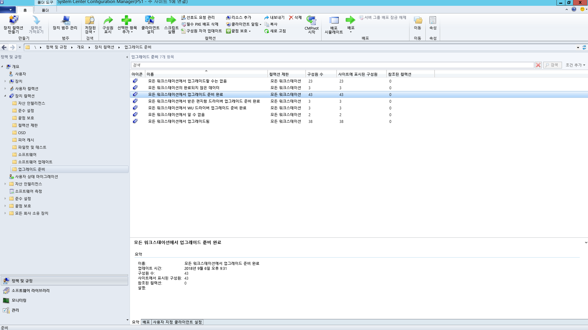
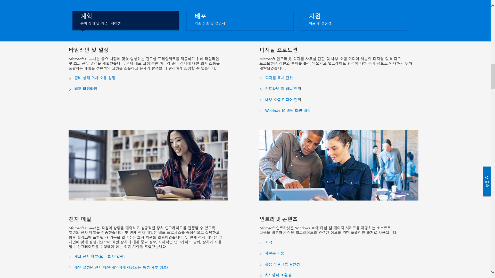

# 8단계: 사용자 커뮤니케이션 및 교육Step 8: User Communications and Training

<table>
<thead>
<td></td>
<td>
<strong>8단계: 사용자 커뮤니케이션 및 교육</strong><strong>Step 8: User Communication and Training</strong>

사용자에게 새로운 환경과 PC를 Windows 10 및 Office 365 ProPlus로 전환하는 새로운 작업 방법을 알려주어야 합니다. Microsoft FastTrack, 교육 자료 및 커뮤니케이션 서식 파일과 사용자 수용 및 사용 현황을 모니터링하는 새로운 방법을 통해 사용자 채택을 지원하는 방법을 알아보세요.Make sure your users are informed about new experiences and new ways of working as you shift your PCs to Windows 10 and Office 365 ProPlus. Learn how to take advantage of user adoption assistance with Microsoft FastTrack, training materials and communication templates, as well as new ways to monitor user acceptance and usage.
</td>
<td></td>
</thead>
</table>

>[!NOTE]
>사용자 커뮤니케이션 및 교육은 사용자에게 정보를 알려주고 준비를 지원하기 위한 팁과 권장 사항을 포함하는 권장 배포 프로세스 사이클의 8번째 단계입니다.User Communications and Training is the eighth step in our recommended deployment process wheel by covering tips and recommendations to inform and prepare users. To see the full desktop deployment process, visit the Modern Desktop Deployment Center. 전체 데스크톱 배포 프로세스를 보려면 [데스크톱 배포 센터](https://aka.ms/HowToShift)를 방문하세요.To see the full desktop deployment process, visit the [Desktop Deployment Center](https://aka.ms/HowToShift).
>

Office 365, Windows 10 및 Azure Active Directory를 통한 새로운 보안 및 준수 컨트롤을 포함하는 최신 작업 환경을 사용자에게 알리고 준비하는 과정은 채택을 촉진하는 데 매우 중요합니다.Inform and prepare your users for modern workplace experiences spanning Office 365, Windows 10 and new security and compliance controls with Azure Active Directory and more. 여기에서 다루는 내용은 업데이트를 적용하는 방법을 찾아내는 것입니다. 즉, 사용자들이 생산성 중단이나 워크플로 변경을 두려워하거나, 새로운 기능을 배워야 하는 경우가 여기에 해당합니다.The trick here is to figure out how to introduce updates -- when some users may fear disruptions to their productivity or changes in their workflow, or if they have to learn new things.

긍정적인 측면은 Windows 7과 Office 2010 또는 Office 2013에서 전환하는 경우 많은 사용자들이 개인용 장치에서 실행되는 Windows 10과 새 버전의 Office에 친숙하며, 이러한 측면이 변경이 미치는 영향을 줄이는 데 도움이 될 것이라는 점입니다.The good news is if you are moving from Windows 7 and Office 2010 or Office 2013, there will be a lot of people familiar with Windows 10 and newer versions of Office running on their personal devices, and all this will help reduce the impact of change.

## 새로운 환경 준비Getting ready for new experiences

Office부터 시작해서, Office 365 ProPlus를 처음 배포하는 경우, Office 앱에 로그인한 후 OneDrive 또는 SharePoint 위치에 파일을 저장할 경우 공유가 쉬워지고, 파일 분기가 줄어들고, 실시간 공동 작업이 가능하다는 이점을 전달할 수 있습니다.Starting with Office, if you’re deploying Office 365 ProPlus for the first time, this when you can communicate the benefits of signing in to Office apps and saving files to OneDrive or SharePoint locations to enable easier sharing, reduce file branching and enable real-time co-authoring.

이러한 앱은 물론, Teams 및 Planner와 같은 기타 로컬 또는 브라우저 기반 앱에서 자세한 커뮤니케이션 및 교육 서식 파일을 사용할 수 있습니다.Detailed communication and training templates are available for these and other local or browser-based apps, like Teams and Planner.

또한 Outlook에서 OneDrive 연결 파일을 첨부하고 PowerPoint에서 새로운 모핑 슬라이드 전환 및 디자인 기능을 사용하는 등, 새로운 앱 내 기능에 대한 지침도 제공됩니다.We also give guidance for new in-app capabilities like attaching OneDrive linked files in Outlook or using the new Morph slide transitions and Designer features in PowerPoint.

Windows 10의 경우, Windows Hello와 같이 생체 인식을 사용하여 안전하게 로그인하는 기능, Windows 환경을 개인 설정하기 위한 시작 기능 업데이트, 작업 중이던 Cortana와 같은 기능으로 쉽게 복귀하기 위한 타임라인 등에 친숙해지도록 도와드립니다.For Windows 10, we help you to familiarize your users with optional and default capabilities like Windows Hello to log in securely using biometrics, Start updates to personalize your Windows experience, Timeline to easily get back to what you were working on, Cortana and more.

사용자가 노출될 수 있는 시각적인 보안 및 규정 준수 컨트롤도 있습니다. Azure AD 및 Microsoft Intune으로 구성된 Enterprise Mobility + Security는 데스크톱 업그레이드의 대상으로 지정할 수 있는 추가 기능을 Windows 10 및 Office 365에 통합합니다.There are also visible security and compliance controls that your users may be exposed to. Enterprise Mobility + Security which comprises Azure AD and Microsoft Intune, integrates additional capabilities with Windows 10 and Office 365 that you can target for your desktop upgrade.

[Microsoft Enterprise Mobility + SecurityMicrosoft Enterprise Mobility + Security](https://www.microsoft.com/ko-KR/cloud-platform/enterprise-mobility-security)

예를 들어 다단계 인증을 사용하도록 설정한 경우 이 기능은 Azure AD를 사용하고, 휴대폰 앱 또는 PIN으로 안전하게 서비스에 액세스하도록 하여 리소스에 대한 사용자 로그인을 보호합니다. 또한 Azure Information Protection은 사용자가 문서를 쉽게 분류하고 레이블을 지정할 수 있도록 합니다.For example, if you've enabled Multi-factor Authentication, this uses Azure AD --and protects user sign-in to resources by leveraging a phone app or PIN to securely access services. And Azure Information Protection makes it easy for users to classify and label documents.

[Office 365에 대한 다단계 인증 설정](https://support.office.com/ko-KR/article/set-up-multi-factor-authentication-for-office-365-users-8f0454b2-f51a-4d9c-bcde-2c48e41621c6)하려면[Set up multi-factor authentication for Office 365 users](https://support.office.com/ko-KR/article/set-up-multi-factor-authentication-for-office-365-users-8f0454b2-f51a-4d9c-bcde-2c48e41621c6)

사용자들이 경험하게 될 새로운 기능들이 약간 있으며 경우에 따라 긍정적이거나 덜 긍정적인 차원에서 사용자에게 놀라움을 주는 기능도 있을 수 있습니다. 또한 이러한 놀라운 기능들이 정상적인 워크플로에 변화를 가져올 경우 지원 센터에서 더 많은 문의 전화가 수신되고 지원 티켓이 늘어날 수 있습니다.These are just a handful of new capabilities that will be experienced by your users and some may catch them by surprise – either in a positive or less positive way. And these surprises – especially if they alter the normal work flow – can result in more calls and tickets for you or your helpdesk.

## 사전 준비 및 측정된 롤아웃Proactive Preparation and Measured Roll-outs

사용자 환경 변화와 관련된 위험을 최소화하기 위해 다음과 같은 두 가지 보완적인 접근 방법을 권장합니다.To help minimize the risk associated with changes in the user experience, we recommend two complementary approaches:

  - 예상 결과를 알 수 있도록 사전에 사용자에게 정보 전달Proactive communication to your users so they know what to expect

  - 배포 링을 사용하여 배포 속도 제어Use of deployment rings to control the rate of deployment

### 단계별 배포Phased Deployment

배포 링을 사용하는 단계별 배포는 소규모 그룹에서 시작해서 시간이 지나면서 측정 가능한 방식으로 광범위한 배포 규모로 확장하는 개념입니다. 일반적으로 커뮤니케이션 및 교육 계획을 처음 세울 때 이러한 링 및 해당 멤버가 형성됩니다. 이러한 방식으로 배포 규모를 서서히 넓혀가면서 잠재적인 위험을 줄이고 접근 방식이 유효한지 검사할 수 있으며, 예상보다 더 많은 지원 센터 전화 문의가 발생할 때 작업을 일시 중지할 수 있습니다.Phased deployment using deployment rings is the concept of starting with small groups then broadened deployment scale in a measured way over time. Normally by the time a communication and training plan is drafted, these rings and their members should be formed. This way, you can reduce potential risk and validate your approach as you continually open the deployment valve, or pause activities if needed, for example, when you see more helpdesk calls come in than expected.

배포 링은 사업부 및 해당 관리자와 협의할 때 가장 잘 구현됩니다. 배포하거나 변경을 진행할 때 피해야 할 중요한 날짜와 시간을 이해해야 합니다. 신중하게 계획하지 못하거나 이해 관계자의 의견을 반영하지 않으면 앞으로 발생할 변화를 사용자가 잘 받아들이고 편안하게 사용하기 어려울 수 있습니다.Deployment rings are best created in cooperation with business units and their managers. You’ll want an understanding of critical dates and times to avoid when deploying or making changes. Without careful planning and buy-in from stakeholders, it will be difficult to get users on-board and comfortable with any changes coming their way.

### 첫 번째 작업 단계: IT 팀 및 얼리 어답터 참가자Phase 1: The IT Team and Early Adopter Insiders 

일반적으로 IT 팀과 초기 액세스를 자원한 열정적인 얼라 어답터와 함께 배포를 시작하는 것이 가장 바람직합니다. 이러한 “참가자”와 함께 커뮤니케이션, 변경이 미치는 영향 및 커뮤니케이션과 교육의 효과를 테스트할 수 있습니다. 이러한 작업 단계 동안 IT 부서는 소유모 파일럿을 실행하면서 보다 광범위한 배포 단계 동안 도움이 될 수 있는 문제 해결 및 자동화 기법을 학습합니다.It’s usually best to begin your deployment with the IT team and enthusiastic early adopters, who volunteer for early access. With these “insiders” you can test your communications, the impacts of change and the effectiveness of your communications and training. During this phase, IT runs small pilots, learns troubleshooting and automation techniques to help during broader deployment phases.

초기 파일럿 작업 단계에는 구성원들을 참여시켜 관찰한 결과를 문서로 정리하고 프로세스에 대한 피드백을 제공하도록 하는 것이 중요합니다. 또한 IT 팀 외부에 새로운 기능을 구두로 유기적으로 전달하는 옹호자를 두는 것도 좋습니다. 이러한 옹호자들은 이후 작업 단계에서 사용자들이 도움이 필요할 때 최전방 지원 담당자가 될 수 있습니다.It’s important to have engaged members in the initial pilot phase, to make sure they are documenting their observations and feeding back to the process. Also, it’s good to have champions outside the IT team that help extend organic, word-of-mouth communication of new capabilities, and they’ll often be first line of support when users in later phases need help.

### 두 번째 작업 단계: 파일럿Phase 2: Pilot 

첫 번째 작업 단계에서 좋은 결과를 얻었다면 두 번째 작업 단계인 파일럿 단계에서는 더 많은 사용자 집합을 대상으로 지정할 수 있습니다. 이러한 단계는 대표적인 사용자 역할, 장치 유형, Windows 앱 및 Office 추가 기능으로 구성되어야 합니다. 이러한 그룹에서 반환되는 데이터는 분석 기능에서 보다 광범위한 세 번째 작업 단계 배포의 초기 대상을 지정하는 데 활용됩니다.Once you feel good about the first phase, you can target a larger set of users for your second, pilot phase. This should comprise a representative mix of user roles, device types, Windows apps and Office add-ins. The data returning from these groups will be used via Analytics to target the initial waves for phase 3, the broader deployment.

이 작업 단계 및 이후 작업 단계의 모든 PC는 분석 서비스까지 로깅되므로, 전달 최적화 및 Windows Hello 로그인 사용을 통한 대역폭 절감 뿐만 아니라 장치 및 앱 상태에 대한 진단 데이터를 수집할 수 있습니다.Remember, all PCs in this phase and future phases should be logging up to the Analytics service, so you can collect telemetry about device and app health as well as bandwidth savings from Delivery Optimization and use of Windows Hello login.

이 작업 단계에서는 변경 내용을 알리고 사용자가 새로운 기능을 활용하도록 지원하는 것이 특히 중요합니다. 사용자들이 IT 부서가 보내는 전자 메일이나 기타 커뮤니케이션을 우선적으로 고려하지 않거나 무시하는 경향이 있을 수 있으므로 관리 부서와 회의할 때 변경 내용을 전달하고 새로운 도구 및 기술에 대한 채택을 권장하면 도움이 됩니다.For this phase it is especially important to communicate changes and help users take advantage of new capabilities. Users can often de-prioritize or ignore email or other communications coming from IT – so it helps to meet with management to get their help in communicating change and drive adoption of new tools and technology.

또한 사용자 작업 중단을 최소화할 수 있도록 피해야 할 시간을 입력하도록 해야 합니다. 예를 들어 재무 팀은 회계 분기 동안 특히 민감할 수 있으며 제품 개발 팀은 제품 출시 기간 동안 민감할 수 있습니다.You’ll also need their input on timeframes to avoid, so you can minimize user disruption – for example the finance team may be particularly sensitive at the end of fiscal quarters or product development teams during a product launch.

장치, 사용자, 부서 및 타이밍을 계획하면서 동시에, 커뮤티케이션 및 교육 계획을 세우는 것은 물론, 콘텐츠를 준비하고 외부 리소스를 고용하여 사용자 교육을 도울 수 있습니다.In parallel to planning for devices, users, departments and timing, you can start to build your communication and training plans, as well as begin compiling content or engaging outside resources to help train users.

#### Microsoft FastTrackMicrosoft FastTrack 

교육 콘텐츠를 준비할 때 Microsoft FastTrack 생산성 라이브러리에 대한 단계별 교육 가이드를 포함하는 포괄적인 짧은 비디오 기반 교육 자료에 액세스하면 도움이 될 수 있습니다.To help your effort in pulling together training content, you can access a comprehensive set of short, video-based training with step-by-step instructional guidance on the Microsoft FastTrack Productivity Library.

[Microsoft FastTrack 생산성 라이브러리Microsoft FastTrack Productivity Library](https://www.microsoft.com/en-us/microsoft-365/success/?rtc=2)

보다 영향력 있는 콘텐츠 생성, 사이트 및 콘텐츠 공유, 팀워크 혁신 및 최신 장치로 생산성 향상 등, 조직에 중요한 목표를 기준으로 하는 수백 가지 항목이 제공됩니다.There are hundreds of topics, based on what’s important to your organization, including: creating more impactful content, sharing sites and content, transforming teamwork and unlocking productivity with modern devices.

또한 Microsoft 365 또는 Office 365를 사용하는 경우 Microsoft의 FastTrack 서비스를 통해 사용자 채택을 유도할 수 있는 타당한 자격을 얻을 수 있습니다. Microsoft 365(Windows, Office 및 EMS) 롤아웃 프로세스를 진행할 때 담당자가 채택 모범 사례를 안내해드립니다.Also, if you are using Microsoft 365 or Office 365, there is good chance that you’re eligible for help with driving user adoption via Microsoft’s FastTrack service. Representatives guide you through adoption best practices as you go through the Microsoft 365 – Windows, Office and EMS – rollout process.

#### Microsoft IT ShowcaseMicrosoft IT Showcase 

Microsoft의 IT Showcase 시리즈는 Windows 10 배포 관련 콘텐츠를 제공하는 또 다른 유용한 리소스입니다. 여기에는 타임라인과 일정, 디지털 프로모션 서식 파일, 전자 메일 서식 파일 및 인트라넷 콘텐츠가 포함됩니다. 이러한 리소스는 Microsoft 자체의 Windows 10 배포에 사용되는 자료를 토대로 하며, 조직에서 사용할 수 있게 수정되었습니다.Microsoft’s IT Showcase series is another great resource for Windows 10 deployment-related content. It includes timelines and schedules, digital promotion templates, email templates and Intranet content. These are based on materials used for Microsoft’s own deployment of Windows 10 and has been modified for any organization to use.

[조직의 원활한 Windows 10 배포 준비Preparing your organization for a seamless Windows 10 deployment](https://www.microsoft.com/itshowcase/windows10deployment)

이러한 구성 요소와 서비스는 파일럿 단계 중에 세부적으로 조정될 수 있습니다. 교육적 측면에서 사용자에게 공감을 주는 정보, 대상으로 지정할 장치, 그리고 분석을 통해 피하거나 지연해야 할 장치 또는 사용자 그룹에 대해 알게 되면 이후 작업 단계에서 데이터 및 환경 중심 접근 방식을 사용하여 배포를 확장할 수 있습니다.These components and services together can be fine-tuned during the pilot phase. And as you start to realize what’s resonating with users on the training side of things, which devices to target and via Analytics and which devices or user groups to avoid or delay, you can begin to broaden your deployment in later phases using a data- and experience-driven approach.

파일럿이 확장되면, 자주 묻는 질문과 셀프 서비스 콘텐츠를 문서화하여 게시함으로써 지원 티켓 및 지원 센터 작업을 사전에 줄이는 데 도움을 줄 수 있습니다.As your pilot expands, you’ll want to document and publish frequently asked questions and self-service content to help proactively reduce support tickets and helpdesk activities.

### 세 번째 작업 단계 및 이후 단계: 광범위한 프로덕션 배포Phase 3 and beyond: Broad Production deployment 

광범위한 배포 작업 단계가 되면, 프로세스, 커뮤니케이션, 교육 및 셀프 서비스 도구를 구체화하게 될 것입니다.By the time you reach broad deployment phases, you’ll have refined your processes, communication, training and self-service tools. Now you can use data collected via telemetry to target more and more PCs. 이제 원격 분석을 통해 수집된 데이터를 사용하여 점점 더 많은 PC를 타깃팅할 수 있습니다.Now you can use the diagnostic data collected to target more and more PCs.

IT 부서, 지원 센터, 사용자 및 네트워크 용량에 따라 관리 가능한 속도로 배포합니다. 항상 배포 프로세스 사이클의 2단계로 돌아가 네트워크를 최적화하고, 피어 간 캐시, LEDBAT 및 기타 기술을 사용하여 배포 관련 데이터를 더 빠르게 전송할 수 있습니다.Deploy at a rate that is manageable to your IT department, help desk, users and network capacity. You can always go back to Step 2 in the deployment process wheel to optimize your network even further using peer to peer cache, LEDBAT and other techniques to facilitate faster transfer of deployment-related data.

진단 도구를 통해 모니터링하는 진단 데이터 외에, 관리 센터의 워크로드를 기준으로 하는 자세한 사용 현황 보고서를 사용하거나 Power BI를 통해 관리 대시보드를 사용하여 세분화된 방식으로 Office 365 및 Microsoft 365 서비스 사용량을 모니터링할 수도 있습니다.In addition to the telemetry that you monitor via the analytics tools, you can also monitor Office 365 and Microsoft 365 service usage in a granular way with detailed usage reports in by workload in the admin center and using the admin dashboards via Power BI. These are great tools to help set and track goals as you roll-out new tools for working together – like Microsoft Teams – or new ways to share files – like OneDrive. 이러한 도구들은 함께 작업하기 위한 새로운 도구(예: Microsoft Teams) 또는 파일을 공유하는 새로운 방법(예: OneDrive)을 롤아웃할 때 목표를 설정하고 추적하는 데 유용합니다.These are great tools to help set and track goals as you roll-out new tools for working together – like Microsoft Teams – or new ways to share files – like OneDrive.

새 기술의 수용 및 채택은 조직의 모든 PC에 Windows 10 및 Office 365 ProPlus가 설치되고 한참 후에도 계속 진행됩니다. 또한 사용자들은 새로운 기능에 대한 정보를 받거나 교육을 받지 못한 상태로 업무 방식을 반드시 바꿀 필요는 없습니다. 마지막으로, Windows의 반기 일정 및 Office의 선택적 월별 일정에 따라 새로운 서비스 모델을 통해 새 기능이 제공되면서, 커뮤니케이션은 계속 진행될 것입니다.New technology acceptance and adoption will go on long after every PC in your organization has Windows 10 and Office 365 ProPlus installed. And users won’t necessarily change how they work – without taking the time to inform and train them of new capabilities. Finally, with the new servicing models providing new capabilities on an ongoing semi-annual schedule for Windows and optionally a monthly schedule for Office, communication will be continual.

## 이전 단계Previous Step 

## [7단계: Windows 및 Office ServicingStep 7: Windows and Office Servicing](https://aka.ms/mdd7)